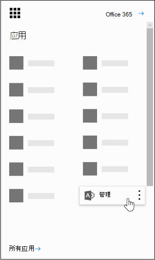

# Power BI nell'organizzazionePower BI in your organization

Questa pagina illustra in che modo gli utenti dell'organizzazione possono usare Power BI e come controllare in che modo l'organizzazione acquisisce il servizio.This page describes how users in your organization can use Power BI and how you can control how your organization acquires this service.
    
## Che cos'è Power BI?What is Power BI?

Microsoft Power BI consente agli utenti di visualizzare dati, condividere scoperte e collaborare in nuovi modi intuitivi. Per altre informazioni, vedere il [sito Web di Power BI](https://powerbi.microsoft.com/en-us/).Microsoft Power BI enables users to visualize data, share discoveries, and collaborate in intuitive new ways. To learn more, see the [Power BI Web site](https://powerbi.microsoft.com/en-us/).
  
## Power BI soddisfa i requisiti di conformità nazionali, regionali e specifici del settore?Does Power BI meet national, regional, and industry-specific compliance requirements?

Per ulteriori informazioni sulla conformità a Power BI, vedere il [Centro protezione Microsoft](https://go.microsoft.com/fwlink/?LinkId=785324).To learn more about Power BI compliance, see the [Microsoft Trust Center](https://go.microsoft.com/fwlink/?LinkId=785324).
  
## In che modo gli utenti si iscrivono a Power BI?How do users sign up for Power BI?

In qualità di amministratore, è possibile iscriversi a Power BI tramite il [sito Web di Power bi](https://powerbi.microsoft.com/en-us/).As an administrator, you can sign up for Power BI through the [Power BI web site](https://powerbi.microsoft.com/en-us/). È inoltre possibile eseguire la registrazione tramite la pagina acquisto servizi nell'interfaccia di amministrazione di Microsoft 365.You can also sign up through the purchase services page on the Microsoft 365 admin center. Quando un amministratore si iscrive per Power BI, può assegnare licenze di sottoscrizione utente agli utenti che devono avere accesso.When an administrator signs up for Power BI, they can assign user subscription licenses to users who should have access.
  
Inoltre, i singoli utenti dell'organizzazione potrebbero essere in grado di iscriversi a Power BI tramite il [sito Web di Power BI](https://powerbi.microsoft.com/en-us/). Quando un utente dell'organizzazione si iscrive a Power BI, gli viene assegnata automaticamente una licenza di Power BI.Additionally, individual users in your organization may be able to sign up for Power BI through the [Power BI web site](https://powerbi.microsoft.com/en-us/). When a user in your organization signs up for Power BI, that user is assigned a Power BI license automatically.
  
## In che modo si iscrivono i singoli utenti dell'organizzazione?How do individual users in my organization sign up?

Esistono tre possibili scenari:There are three scenarios that might apply to users in your organization:
  
### Scenario 1: l'organizzazione ha già un ambiente di Office 365 e l'utente che effettua l'iscrizione a Power BI ha già un account di Office 365.Scenario 1: Your organization already has an existing Office 365 environment and the user signing up for Power BI already has an Office 365 account.

In questo scenario, se un utente ha già un account aziendale o dell'istituto di istruzione nel tenant (ad esempio contoso.com) ma non ha ancora Power BI, Microsoft attiverà semplicemente il piano per tale account e l'utente riceverà automaticamente una notifica relativa all'uso del servizio Power BI.In this scenario, if a user already has a work or school account in the tenant (for example, contoso.com) but does not yet have Power BI, Microsoft will simply activate the plan for that account, and the user will automatically be notified of how to use the Power BI service.
  
### Scenario 2: l'organizzazione ha un ambiente di Office 365 e l'utente che effettua l'iscrizione a Power BI non ha un account di Office 365.Scenario 2: Your organization has an existing Office 365 environment and the user signing up for Power BI doesn't have an Office 365 account.

In questo scenario, l'utente ha un indirizzo di posta elettronica nel dominio dell'organizzazione (ad esempio contoso.com) ma non ha ancora un account di Office 365. In questo caso, l'utente può iscriversi a Power BI per ricevere automaticamente un account. In questo modo l'utente potrà accedere al servizio Power BI. Se ad esempio una dipendente di nome Sara usa l'indirizzo di posta elettronica aziendale, Sara@contoso.com, per iscriversi, Microsoft la aggiungerà automaticamente come utente nell'ambiente Office 365 di Contoso e attiverà Power BI per tale account.In this scenario, the user has an email address in your organization's domain (for example, contoso.com) but does not yet have an Office 365 account. In this case, the user can sign up for Power BI and will automatically be given an account. This lets the user access the Power BI service. For example, if an employee named Nancy uses her work email address (for example, Nancy@contoso.com) to sign up, Microsoft will automatically add Nancy as a user in Contoso's Office 365 environment and activate Power BI for that account.
  
### Scenario 3: l'organizzazione non ha un ambiente di Office 365 connesso al proprio dominio di posta elettronica.Scenario 3: Your organization does not have an Office 365 environment connected to your email domain.

L'organizzazione non deve intraprendere alcuna azione amministrativa per poter usufruire di Power BI.There are no administrative actions your organization needs to take to take advantage of Power BI.
  
> [!IMPORTANT]
> Se l'organizzazione dispone di più domini di posta elettronica e si preferisce che tutte le estensioni di indirizzi di posta elettronica siano nello stesso tenant, prima che gli utenti creino il tenant principale, aggiungere tutti i domini dell'indirizzo di posta elettronica al tenant prima che gli utenti creino il tenant principale.If your organization has multiple email domains and you prefer all email address extensions to be in the same tenant, before any users create your primary tenant, add all email address domains to that tenant before any users create your primary tenant. Non esiste un meccanismo automatico per spostare gli utenti tra i tenant dopo che sono stati creati.There is no automated mechanism to move users across tenants after they have been created. Per ulteriori informazioni su questo processo, vedere [se sono presenti più domini, è possibile controllare il tenant di Office 365 a cui vengono aggiunti gli utenti?](#if-i-have-multiple-domains-can-i-control-the-office-365-tenant-that-users-are-added-to) più avanti in questo articolo e [aggiungere un dominio a Office 365](../setup/add-domain.md) online.For more information on this process, see [If I have multiple domains, can I control the Office 365 tenant that users are added to?](#if-i-have-multiple-domains-can-i-control-the-office-365-tenant-that-users-are-added-to) later in this article and [Add a domain to Office 365](../setup/add-domain.md) online. 
  
## Come cambierà la gestione delle identità per gli attuali utenti dell'organizzazione?How will this change the way I manage identities for users in my organization today?

Se l'organizzazione ha già un ambiente di Office 365 e tutti gli utenti dell'organizzazione hanno account di Office 365, il processo di gestione delle identità rimarrà invariato.If your organization already has an existing Office 365 environment and all users in your organization have Office 365 accounts, identity management will not change.
  
Se l'organizzazione ha già un ambiente di Office 365 ma non tutti gli utenti dell'organizzazione hanno account di Office 365, Microsoft creerà un utente nel tenant e assegnerà le licenze in base all'indirizzo di posta elettronica aziendale o dell'istituto di istruzione dell'utente. Questo significa che il numero di utenti da gestire in un determinato momento aumenterà man mano che nuovi utenti nell'organizzazione si iscriveranno al servizio.If your organization already has an existing Office 365 environment but not all users in your organization have Office 365 accounts, we will create a user in the tenant and assign licenses based on the user's work or school email address. This means that the number of users you are managing at any particular time will grow as users in your organization sign up for the service.
  
Se la directory viene gestita in locale e si usa Active Directory Federation Services (ADFS), Microsoft non aggiungerà utenti al tenant e tutti gli utenti che proveranno ad aggiungersi al tenant riceveranno un messaggio che li invita a contattare l'amministratore dell'organizzazione.If you are managing your directory on-premises, and use Active Directory Federation Services (AD FS), Microsoft will not add users to your tenant, and users attempting to join your tenant will receive a message to contact their organization's admin.
  
Se l'organizzazione non ha un ambiente di Office 365 connesso al proprio dominio di posta elettronica, non ci saranno cambiamenti nella modalità di gestione delle identità. Gli utenti verranno aggiunti a una nuova directory di utenti basata sul cloud e si avrà la possibilità di scegliere se assumere il ruolo di amministratore del tenant per gestirli.If your organization does not have an Office 365 environment connected to your email domain, there will be no change in how you manage identity. Users will be added to a new, cloud-only user directory, and you will have the option to elect to take over as the tenant admin and manage them.
  
## Qual è la procedura per gestire un tenant creato da Microsoft per gli utenti?What is the process to manage a tenant created by Microsoft for my users?

Se Microsoft ha creato un tenant, è possibile chiedere di gestirlo eseguendo la procedura seguente:If a tenant was created by Microsoft, you can claim and manage that tenant by following these steps:
  
1. Aggiungersi al tenant [iscrivendosi a Power BI](https://go.microsoft.com/fwlink/?LinkId=522448) con il dominio dell'indirizzo di posta elettronica che corrisponde al domino del tenant da gestire. Se ad esempio Microsoft ha creato il tenant contoso.com, sarà necessario aggiungersi con un indirizzo di posta elettronica che termina con @contoso.com.Join the tenant by [signing up for Power BI](https://go.microsoft.com/fwlink/?LinkId=522448) using an email address domain that matches the tenant domain you want to manage. For example, if Microsoft created the contoso.com tenant, you will need to join the tenant with an email address ending with @contoso.com. 
    
2. Richiedere il controllo di amministratore verificando di essere proprietari del dominio. Dopo l'aggiunta al tenant, è possibile alzarsi di livello al ruolo di amministratore verificando di essere proprietari del dominio, mediante la procedura seguente:Claim admin control by verifying domain ownership: once you are in the tenant, you can promote yourself to the admin role by verifying domain ownership. To do so, follow these steps:
 
::: moniker range="o365-worldwide"
   
3. Accedere a [https://admin.microsoft.com](https://admin.microsoft.com).Go to [https://admin.microsoft.com](https://admin.microsoft.com).
 

::: moniker-end

::: moniker range="o365-germany"

3. Passare a [https://portal.office.de](https://portal.office.de).Go to [https://portal.office.de](https://portal.office.de).

::: moniker-end

::: moniker range="o365-21vianet"

3. Passare a [https://portal.partner.microsoftonline.cn](https://portal.partner.microsoftonline.cn).Go to [https://portal.partner.microsoftonline.cn](https://portal.partner.microsoftonline.cn).

::: moniker-end

    
4. Selezionare l'icona di avvio delle app in alto a sinistra e scegliere **Amministratore**.Select the app launcher icon in the upper-left and choose **Admin**.
    
    
  
5. Leggere le istruzioni riportate nella pagina **diventa amministratore** e quindi selezionare **Sì, voglio essere l'amministratore**.Read the instructions on the **Become the admin** page and then select **Yes, I want to be the admin**.
    
    > [!NOTE]
    >  Se questa opzione non viene visualizzata, esiste già un amministratore sul posto.If this option doesn't appear, there is already an administrator in place. 
  
## Se si hanno più domini, è possibile controllare il tenant di Office 365 in cui vengono aggiunti gli utenti?If I have multiple domains, can I control the Office 365 tenant that users are added to?

Se non si fa niente, verrà creato un tenant per ogni domino o sottodominio di posta elettronica degli utenti.If you do nothing, a tenant will be created for each user email domain and subdomain.
  
Se si vuole che gli utenti stiano nello stesso tenant indipendentemente dalle estensioni dei loro indirizzi di posta elettronica:If you want all users to be in the same tenant regardless of their email address extensions:
  
- Creare in anticipo un tenant di destinazione oppure usare un tenant esistente e aggiungere tutti gli attuali domini e sottodomini da consolidare al suo interno. Quindi, tutti gli utenti con un indirizzo di posta elettronica che termina con questi domini e sottodomini verranno automaticamente aggiunti al tenant di destinazione quando si iscrivono.Create a target tenant ahead of time or use an existing tenant, and add all the existing domains and subdomains that you want consolidated within that tenant. Then all the users with email addresses ending in those domains and subdomains will automatically join the target tenant when they sign up.
    
> [!IMPORTANT]
> Non esiste un meccanismo automatizzato supportato per trasferire gli utenti da un tenant all'altro dopo la creazione.There is no supported automated mechanism to move users across tenants once they have been created. Per ulteriori informazioni sull'aggiunta di domini a un singolo tenant di Office 365, vedere [aggiungere un dominio a office 365](../setup/add-domain.md).To learn about adding domains to a single Office 365 tenant, see [Add a domain to Office 365](../setup/add-domain.md). 
  
> [!IMPORTANT]
> Per ulteriori informazioni e indicazioni sulla gestione dei tenant, vedere [che cos'è Power bi Administration?](https://docs.microsoft.com/power-bi/service-admin-administering-power-bi-in-your-organization).For additional information and guidance on managing tenants, see [What is Power BI administration?](https://docs.microsoft.com/power-bi/service-admin-administering-power-bi-in-your-organization). 
  
## Come si può impedire agli utenti di aggiungersi all'attuale tenant di Office 365?How can I prevent users from joining my existing Office 365 tenant?

È possibile eseguire operazioni come amministratore per impedire agli utenti di partecipare al tenant di Office 365 esistente.There are steps you can take as an admin to prevent users from joining your existing Office 365 tenant. Se si blocca questo, i tentativi degli utenti di accedere avranno esito negativo e verranno indirizzati a contattare l'amministratore dell'organizzazione. Non è necessario ripetere questa procedura se la distribuzione automatica delle licenze è già stata disabilitata prima (ad esempio, Office 365 Education per studenti, docenti e personale).If you do block this, users' attempts to sign in will fail and they will be directed to contact their organization's admin. You do not need to repeat this process if you have already disabled automatic license distribution before (e.g. Office 365 Education for Students, Faculty and Staff).
  
Questa procedura richiede l'uso di Windows PowerShell. Per informazioni su Windows PowerShell, vedere [Guida introduttiva di PowerShell](https://go.microsoft.com/fwlink/p/?LinkID=286814).These steps require the use of Windows PowerShell. To get started with Windows PowerShell, see the [PowerShell getting started guide](https://go.microsoft.com/fwlink/p/?LinkID=286814).
  
Per eseguire la procedura seguente, è necessario installare la versione a 64 bit più recente del [Modulo di Microsoft Azure Active Directory per Windows PowerShell](https://www.powershellgallery.com/packages/AzureADPreview/2.0.2.5).To perform the following steps, you must install the latest 64-bit version of the [Azure Active Directory Module for Windows PowerShell](https://www.powershellgallery.com/packages/AzureADPreview/2.0.2.5).
  
Dopo aver selezionato il collegamento, selezionare **Esegui** per eseguire il pacchetto del programma di installazione.After you select the link, select **Run** to run the installer package. 
  
 **Disabilitare l'aggiunta automatica al tenant**: usare questo comando di Windows PowerShell per impedire ai nuovi utenti di aggiungersi a un tenant gestito:**Disable automatic tenant join**: Use this Windows PowerShell command to prevent new users from joining a managed tenant:
  
Per disabilitare l'aggiunta automatica di nuovi utenti al tenant:  `Set-MsolCompanySettings -AllowEmailVerifiedUsers $false`To disable automatic tenant join for new users:  `Set-MsolCompanySettings -AllowEmailVerifiedUsers $false`
  
Per abilitare l'aggiunta automatica di nuovi utenti al tenant:  `Set-MsolCompanySettings -AllowEmailVerifiedUsers $true`To enable automatic tenant join for new users:  `Set-MsolCompanySettings -AllowEmailVerifiedUsers $true`
  
> [!NOTE]
> Questo blocco impedisce ai nuovi utenti dell'organizzazione di iscriversi a Power BI.This blocking prevents new users in your organization from signing up for Power BI. Gli utenti che si iscrivono a Power BI prima della disabilitazione delle nuove iscrizioni per l'organizzazione manterranno le proprie licenze.Users that sign up for Power BI prior to disabling new signups for your organization will still retain their licenses. Vedere il [come si rimuove Power BI per gli utenti che hanno già effettuato l'iscrizione?](#how-do-i-remove-power-bi-for-users-that-already-signed-up) per istruzioni su come è possibile rimuovere l'accesso a Power BI per gli utenti che in precedenza avevano effettuato l'iscrizione al servizio.See the [How do I remove Power BI for users that already signed up?](#how-do-i-remove-power-bi-for-users-that-already-signed-up) for instructions on how you can remove access to Power BI for users that had previously signed up for the service. 
  
## Come si può consentire agli utenti di aggiungersi all'attuale tenant di Office 365?How can I allow users to join my existing Office 365 tenant?

Per consentire agli utenti di aggiungersi al tenant, eseguire il comando opposto a quello descritto nella domanda precedente:  `Set-MsolCompanySettings -AllowEmailVerifiedUsers $true`To allow users to join your tenant, run the opposite command as described in the question above:  `Set-MsolCompanySettings -AllowEmailVerifiedUsers $true`
  
## Come si verifica se è attivato il blocco nel tenant?How do I verify if I have the block on in the tenant?

Usare il seguente script di PowerShell:  `Get-MsolCompanyInformation | fl allow*`Use the following PowerShell script:  `Get-MsolCompanyInformation | fl allow*`
  
## Come è possibile impedire agli utenti di iniziare a usare Power BI?How can I prevent my existing users from starting to use Power BI?

 **Disabilitare la distribuzione automatica delle licenze**: Usare questo script di Windows PowerShell per disabilitare la distribuzione automatica delle licenze per gli attuali utenti.**Disable automatic license distribution:** Use this Windows PowerShell script to disable automatic license distributions for existing users. Non è necessario ripetere questa procedura se la distribuzione automatica delle licenze è già stata disabilitata prima (ad esempio, Office 365 Education per studenti, docenti e personale).You do not need to repeat this process if you have already disabled automatic license distribution before (e.g. Office 365 Education for Students, Faculty and Staff). 
  
Per disabilitare la distribuzione automatica delle licenze per gli attuali utenti:  `Set-MsolCompanySettings -AllowAdHocSubscriptions $false`To disable automatic license distribution for existing users:  `Set-MsolCompanySettings -AllowAdHocSubscriptions $false`
  
Per abilitare la distribuzione automatica delle licenze per gli attuali utenti:  `Set-MsolCompanySettings -AllowAdHocSubscriptions $true`To enable automatic license distribution for existing users:  `Set-MsolCompanySettings -AllowAdHocSubscriptions $true`
  
> [!NOTE]
> Il flag *AllowAdHocSubscriptions* viene utilizzato per controllare diverse funzionalità utente nell'organizzazione, inclusa la possibilità per gli utenti di iscriversi al servizio Azure Rights Management.The *AllowAdHocSubscriptions* flag is used to control several user capabilities in your organization, including the ability for users to sign up for the Azure Rights Management Service. La modifica di questo contrassegno avrà effetto su tutte queste funzionalità.Changing this flag will affect all of these capabilities. 
  
## Come si può consentire agli utenti di iscriversi a Power BI?How can I allow my existing users to sign up for Power BI?

Per consentire agli utenti di iscriversi a Power BI, eseguire il comando opposto a quello descritto nella domanda precedente:  `Set-MsolCompanySettings -AllowAdHocSubscriptions $true`To allow your existing users to sign up for Power BI, run the opposite command as described in the question above:  `Set-MsolCompanySettings -AllowAdHocSubscriptions $true`
  
## Come si rimuove Power BI per gli utenti che hanno già effettuato l'iscrizione?How do I remove Power BI for users that already signed up?

Se un utente ha effettuato l'iscrizione a Power BI ma non si vuole più consentirgli di accedere al servizio, è possibile rimuovere la licenza di Power BI di tale utente.If a user signed up for Power BI but you no longer want them to have access to Power BI, you can remove the Power BI license for that user.

::: moniker range="o365-worldwide"

> [!NOTE]
> Se non si usa la nuova interfaccia di amministrazione di Microsoft 365, è possibile attivarla selezionando l'opzione **Prova la nuova interfaccia di amministrazione** che si trova nella parte superiore della home page.If you're not using the new Microsoft 365 admin center, you can turn it on by selecting the **Try the new admin center** toggle located at the top of the Home page.
  
1. Nell'interfaccia di amministrazione passare alla pagina **Utenti** \> <a href="https://go.microsoft.com/fwlink/p/?linkid=834822" target="_blank">Utenti attivi</a>.In the admin center, go to the **Users** \> <a href="https://go.microsoft.com/fwlink/p/?linkid=834822" target="_blank">Active users</a> page.
    
2. Individuare l'utente per il quale si desidera rimuovere la licenza, quindi selezionarne il nome.Find the user you want to remove the license for, then select their name.
    
3. Nella scheda **licenze e app** deselezionare la casella di controllo **Microsoft Power bi** .On the **Licenses and Apps** tab, clear the **Microsoft Power BI** check box.
    
4. Selezionare **Salva modifiche**.Select **Save changes**.

::: moniker-end

  
::: moniker range="o365-germany"

1. Nell'interfaccia di amministrazione passare alla pagina **Utenti** \> <a href="https://go.microsoft.com/fwlink/p/?linkid=847686" target="_blank">Utenti attivi</a>.In the admin center, go to the **Users** \> <a href="https://go.microsoft.com/fwlink/p/?linkid=847686" target="_blank">Active users</a> page.

2. Individuare l'utente per il quale si desidera rimuovere la licenza, quindi selezionarne il nome.Find the user you want to remove the license for, then select their name.
    
3. Accanto a **licenze di prodotto**, selezionare **modifica**.Next to **Product licenses**, select **Edit**. 
    
4. Disattiva l'opzione **Microsoft Power bi** .Toggle off the **Microsoft Power BI** option.
    
5. Selezionare **Salva**.Select **Save**.

::: moniker-end

::: moniker range="o365-21vianet"

1. Nell'interfaccia di amministrazione passare alla pagina **Utenti** \> <a href="https://go.microsoft.com/fwlink/p/?linkid=850628" target="_blank">Utenti attivi</a>.In the admin center, go to the **Users** \> <a href="https://go.microsoft.com/fwlink/p/?linkid=850628" target="_blank">Active users</a> page.

2. Individuare l'utente per il quale si desidera rimuovere la licenza, quindi selezionarne il nome.Find the user you want to remove the license for, then select their name.
    
3. Accanto a **licenze di prodotto**, selezionare **modifica**.Next to **Product licenses**, select **Edit**. 
    
4. Disattiva l'opzione **Microsoft Power bi** .Toggle off the **Microsoft Power BI** option.
    
5. Selezionare **Salva**.Select **Save**.

::: moniker-end 

## Come si può sapere se nuovi utenti si aggiungono al tenant?How do I know when new users have joined my tenant?

Ai nuovi utenti che si aggiungono al tenant nell'ambito di questo programma viene assegnata una licenza univoca che è possibile filtrare nel riquadro degli utenti attivi del dashboard di amministrazione.Users who have joined your tenant as part of this program are assigned a unique license that you can filter on within your active user pane in the admin dashboard.
  
Per creare questa nuova visualizzazione, nell'interfaccia di amministrazione, seguire la procedura descritta in [creare una visualizzazione utente personalizzata](../add-users/create-edit-or-delete-a-custom-user-view.md#create-a-custom-user-view).To create this new view, in the admin center, follow the steps to in [Create a custom user view](../add-users/create-edit-or-delete-a-custom-user-view.md#create-a-custom-user-view). In **licenza prodotto assegnato**selezionare **Microsoft Power bi**.Under **Assigned product license**, select **Microsoft Power BI**. Dopo aver creato la nuova visualizzazione, sarà possibile visualizzare tutti gli utenti del tenant che si sono iscritti al programma.After the new view has been created, you will be able to see all the users in your tenant who have enrolled in this program.
  
## È necessario prepararsi per altro?Are there any additional things I should be prepared for?

Potrebbe verificarsi un aumento nella richiesta di reimpostazione delle password.You might experience an increase in password reset requests. Per informazioni su questo processo, vedere [Reimpostazione della password di un utente](../add-users/reset-passwords.md).For information about this process, see [Reset a user's password](../add-users/reset-passwords.md).
  
È possibile rimuovere un utente dal tenant tramite il processo standard nell'interfaccia di amministrazione.You can remove a user from your tenant via the standard process in the admin center. Se tuttavia l'utente ha ancora un indirizzo di posta elettronica attivo dell'organizzazione, potrà riaggiungersi a meno che non si impedisca a tutti di aggiungersi.However, if the user still has an active email address from your organization, they will be able to rejoin unless you block all users from joining.
  
## Perché nel tenant di Office 365 è visualizzato 1 milione di licenze?Why did 1 million licenses for Microsoft Power BI show up in my Office 365 tenant?

Gli utenti di un'organizzazione idonea sono a loro volta idonei a usare il servizio Microsoft Power BI e queste licenze rappresentano la capacità disponibile per i nuovi utenti di Power BI nel tenant.As a qualifying organization, users in your organization are eligible to use the Microsoft Power BI service and these licenses represent the available capacity for new Power BI users in your tenant. Per queste licenze non vengono addebitati costi.There is no charge for these licenses. Se si è scelto di consentire agli utenti di iscriversi a Power BI da soli, al termine del processo di iscrizione viene assegnata una delle licenze gratuite disponibili.If you've chosen to allow users to sign up for Power BI themselves, they will be assigned one of these available free licenses when they complete the sign up process. È inoltre possibile scegliere di assegnare tali licenze agli utenti tramite l'interfaccia di amministrazione.You can also choose to assign these licenses to users yourself through the admin center.
  
## È gratuito?Is this free? Verrà addebitato un costo per queste licenze?Will I be charged for these licenses?

Queste licenze sono valide per la versione gratuita di Power BI. Se si è interessati a funzionalità aggiuntive, prendere in considerazione la versione Power BI Pro.These licenses are for the free version of Power BI. If you're interested in additional capabilities, take a look at the Power BI Pro version.
  
## Perché un milione di licenze?Why 1 million licenses?

È stato scelto un numero sufficiente perché la maggior parte delle organizzazioni avrebbe ampie licenze per fornire questo vantaggio senza indugio ai propri utenti.We chose a number that was large enough that the majority of organizations would have ample licenses to provide this benefit without delay to their users.
  
## Che cosa succede se servono più di un milione di licenze?What if I need more than 1 million licenses?

Se è necessario acquisire altre licenze, contattare il rappresentante Microsoft per altre informazioni.Contact your Microsoft account representative for more information if you will need to acquire additional licenses.
