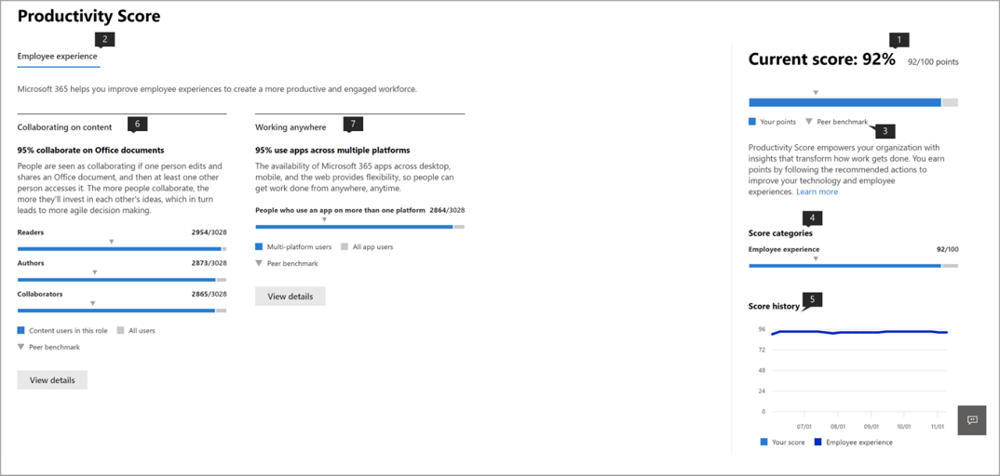
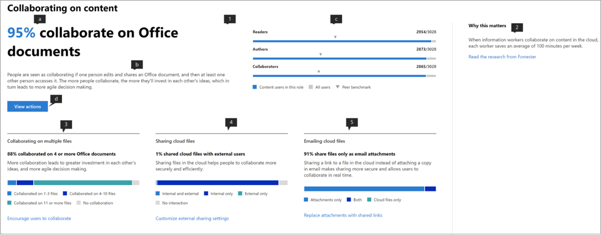

# Punteggio di produttività Microsoft (anteprima)

Microsoft 365 offre soluzioni per la produttività che consentono all'organizzazione di raggiungere i propri obiettivi aziendali. Produttività Score fornisce informazioni utili per l'utilizzo di queste soluzioni che è possibile trasformare in modalità di funzionamento.Contiene: 

- **Visibilità** aiutandoli a capire in che modo le persone lavorano sotto forma di punteggio corrente con ripartizione tra le categorie di esperienza dei dipendenti e la tecnologia Experience (prossimamente). 
- **Intuizioni** per identificare le opportunità per consentire migliori esperienze. 
- **Azioni** per l'aggiornamento di competenze e sistemi in modo che tutti possano svolgere il proprio lavoro. 

Lo score e le intuizioni sono presenti in due categorie:  

- **Esperienza dei dipendenti:** viene illustrato come Microsoft 365 contribuisce alla creazione di una forza lavoro produttiva e impegnata quantificando il modo in cui le persone collaborano al contenuto, lavorano ovunque, capendo gli stili di comunicazione (prossimamente) e sviluppando una cultura della riunione (prossimamente) 

- **Tecnologia Experience** (prossimamente): consente di ottimizzare le esperienze del dispositivo, come la correzione proattiva dei problemi di supporto comuni e il miglioramento dei tempi di avvio del PC e della rete per garantire che le app funzionino correttamente.  

## Funzionamento

### Aree di Punteggio 

All'interno di ogni categoria punteggio, il Punteggio di produttività fornisce informazioni sulla trasformazione del lavoro tra aree diverse. Le aree interessate all'interno dell'esperienza dei dipendenti sono:

- Collaborare al contenuto  
- Utilizzo in qualsiasi posizione 
- Informazioni sugli stili di comunicazione (prossimamente) 
- Sviluppo di una cultura della riunione (prossimamente) 

### Azioni degli utenti con Punteggio 

All'interno di ogni area, vengono misurate le azioni chiave basate sulla ricerca che rappresentano le modalità di utilizzo che consentono alle organizzazioni di trasformarsi in un'organizzazione estremamente produttiva. Per ogni area viene calcolata la percentuale di utenti che eseguono queste azioni negli ultimi 28 giorni. 

Il Punteggio esperienza dipendente è curato come Punteggio medio in tutte le aree. Tenere presente che è possibile continuare ad aggiungere ulteriori aree all'esperienza dei dipendenti e alla tecnologia nel tempo. 

### Prodotti inclusi nel punteggio di produttività 

Il Punteggio di produttività attualmente include i segnali dei carichi di lavoro chiave di Microsoft 365 OneDrive, SharePoint, Word, Excel, PowerPoint, OneNote, Outlook, Yammer, teams, Skype. 

Il Punteggio viene aggiornato giornalmente e riflette le azioni degli utenti completate negli ultimi 28 giorni (compreso il giorno corrente).

## Accesso e autorizzazioni necessarie 

Per l'esperienza dipendente, è necessario disporre di un abbonamento a un piano di Office 365 per le aziende o a un piano aziendale di Microsoft 365 con più utenti. 

Per avere l'autorizzazione per l'accesso al Punteggio di produttività Microsoft, è necessario disporre dei ruoli seguenti: 

- Amministratore globale 
- Amministratori di Exchange 
- Amministratori di SharePoint 
- Amministratori di Skype for Business 
- Amministratore di Teams 
- Ruolo con autorizzazioni di lettura globali 
- Lettore di report 

È possibile accedere all'esperienza da Microsoft 365 admin Home scegliendo **report** > **Productivity Score** nella barra di spostamento a sinistra.

## Interpretazione del Punteggio di produttività 

### Informazioni su come funziona l'organizzazione 

la Home page del Punteggio di produttività fornisce il punteggio e la cronologia correnti su una base percentuale, informazioni principali per le aree all'interno di ogni categoria di Punteggio completate da benchmark. 

1.**Il Punteggio di produttività** è elencato su una base percentuale così come nel <numerator> / <denominator> formato, in modo da poter vedere anche i punti assoluti (numeratore) e i punti massimi possibili  
1. Questo pivot consente di selezionare la categoria di Punteggio su cui si desidera concentrarsi. Nell'anteprima, è possibile visualizzare solo i **dipendenti**, ma la selezione verrà presto espansa per includere l' **esperienza di tecnologia**. 
1. **Benchmark peer** consente di confrontare il punteggio corrente con organizzazioni come l'utente. La misura di benchmark viene calcolata come media delle misure all'interno di un insieme di organizzazioni simili. Il set è costituito da organizzazioni che dispongono di un numero analogo di utenti abilitati, area geografica, tipi di licenze possedute, industria e possesso all'interno di Microsoft 365 o Office 365. 
1. La sezione **Score Categories** fornisce una ripartizione del Punteggio di produttività con i benchmark per categoria.
1. La **cronologia dei punteggi** Visualizza la modalità di spostamento del Punteggio di ogni categoria negli ultimi 6 mesi.
1. L'intuizione principale per la **collaborazione nei contenuti** illustra le misure rilevanti con i benchmark di questa area che contribuiscono allo score. Selezionare **Visualizza dettagli** per visualizzare la pagina Dettagli area.
1. L'intuizione principale di **working Anywhere** Visualizza le misure rilevanti con i benchmark di questo settore che contribuiscono allo score. Selezionare **Visualizza dettagli** per visualizzare la pagina Dettagli area.  

### Intuizioni per identificare le opportunità di miglioramento delle esperienze 

Per ogni area, selezionare **Visualizza dettagli** nell'Insight principale per visualizzare la pagina Dettagli area in cui vengono visualizzate altre informazioni, ricerche e azioni correlate per migliorare il punteggio. .

Tutte le pagine dei dettagli dell'area seguono la seguente struttura: 

- In alto a sinistra: Insight principale mantenuto dalla Home page.
- In basso a sinistra: supporto di approfondimenti con azioni contestuali.  
- A destra: ricerca accademica che dimostra la relazione tra l'area e la produttività.

Inoltre, tutte le informazioni dettagliate contengono gli elementi seguenti: 

- Intestazione: chiave da asporto o esito rilevato per ogni intuizione;
- Riepilogo: ulteriori informazioni sul motivo per cui le misure nell'Insight sono importanti per la produttività dell'organizzazione. 
- Visualizzazione dei dati: quantifica visivamente la posizione dell'organizzazione in relazione alle misure nell'Insight con i parametri di riferimento applicabili.
- Azioni: azione contestuale che può contribuire a incrementare il risultato desiderato per l'Insight e quindi migliorare il punteggio.

### Pagina Dettagli area – collaborazione per il contenuto 

La collaborazione nella pagina contenuto contiene l'intuizione principale della Home page del Punteggio di produttività. Sono disponibili i componenti seguenti:

1. Intestazione: quantifica la percentuale di utenti che collaborano sul contenuto (esito chiave).
1. Corpo: maggiori dettagli su come una maggiore collaborazione comporta una maggiore produttività.
1. Visualizzazione: questo quantifica visivamente ogni elemento che contribuisce allo score per questa area con parametri di riferimento:

    - **Reader**: quantifica gli utenti che accedono o scaricano file nel cloud (OneDrive e SharePoint) all'interno di una base di OneDrive e degli utenti abilitati per SharePoint.
    - **Autori**: quantifica gli utenti che modificano, eseguono il caricamento, la sincronizzazione, il check-in, la copia o lo spostamento di file nel cloud (OneDrive e SharePoint) all'interno di una base di OneDrive e degli utenti abilitati per SharePoint.
    - **Collaboratori**: quantifica gli utenti che collaborano ai file nel cloud (OneDrive e SharePoint) all'interno di una base di OneDrive e degli utenti abilitati per SharePoint. Due utenti sono collaboratori se uno di essi ha letto o modificato un documento di Word, Excel, PowerPoint, OneNote o PDF cloud dopo l'altro creato o modificato all'interno di una finestra di 28 giorni.

1. Il motivo per cui **è importante** fornisce un riepilogo della ricerca che collega la collaborazione ai file cloud con la produttività. **Leggere la ricerca di Forrester** va a un articolo di ricerca che fornisce più contesto su come la collaborazione è favorevole all'aumento della produttività.
1. Il supporto di Insight sulla **collaborazione su più file** quantifica la modalità di collaborazione tra gli utenti dell'organizzazione e i diversi file. 
1. Il supporto di Insight sulla **condivisione dei file del cloud** quantifica se gli utenti condividono contenuto sul cloud, mentre la distinzione tra condivisione interna ed esterna.
1. Il supporto di Insight sui **file cloud di posta elettronica** quantifica se gli utenti che condividono file tramite posta elettronica utilizzano allegati e collegamenti ai file cloud.

I tipi di file considerati per la collaborazione sono Word/Excel/PowerPoint/OneNote/PDF.

### Pagina Dettagli area – utilizzo in qualsiasi posizione 

La pagina Working Anywhere quantifica gli utenti (come percentuale e valore assoluto) che hanno utilizzato almeno un'app per la produttività in due o più piattaforme, ovvero desktop, mobili e Web. Gli utenti ottengono un punteggio maggiore per l'utilizzo di più app e piattaforme. Le app considerate sono Outlook, teams, Word, Excel, PowerPoint, OneNote, Yammer, Skype. La base dell'Insight sono gli utenti abilitati per Office 365 ProPlus, Exchange, Yammer, Skype o teams.

1. Il motivo per cui **è importante** fornisce un riepilogo dalla ricerca che collega l'utilizzo di più piattaforme a una maggiore produttività. **Leggere la ricerca di Forrester** va a un articolo di ricerca che fornisce più contesto sul modo in cui l'utilizzo è favorevole all'aumento della produttività.
1. Il supporto di Insight sul **messaggio di posta elettronica Anywhere** quantifica il numero di utenti nell'organizzazione che utilizzano Outlook su più piattaforme all'interno della base di utenti attivi su Outlook.
1. Il supporto di Insight su **Chat Anywhere** quantifica la modalità con cui gli utenti dell'organizzazione utilizzano Team tra piattaforme all'interno della base di utenti attivi nei team.
1. Il supporto di Insight sull' **accesso ai documenti di Office** consente di quantificare in che modo gli utenti dell'organizzazione utilizzano Word, Excel, PowerPoint e OneNote tra piattaforme all'interno della base di utenti attivi su Word, Excel, PowerPoint o OneNote.

### Azioni per l'aggiornamento delle competenze e dei sistemi 

Per promuovere l'azione, ogni Insight di supporto viene fornito con azioni in linea che consentono di trasformare l'esperienza dei dipendenti, alcune delle quali possono essere modifiche alla configurazione o campagne di sensibilizzazione. Se si fa clic su queste chiamate all'azione, nelle opzioni del riquadro azioni consigliate è possibile prendere in considerazione. Attualmente, le azioni in **collaborazione sul contenuto** sono abilitate.

1. Le **azioni di visualizzazione** passano a un riquadro che elenca tutte le azioni relative alla collaborazione sul contenuto.
1. **Incoraggiare gli utenti a collaborare** passa a un elenco di video didattici sulla collaborazione con argomenti quali la creazione condivisa e la @mentions. 
1. Personalizzare le impostazioni di **condivisione esterna** passa a una pagina con una panoramica sulla condivisione esterna che descrive cosa succede quando gli utenti condividono, a seconda di cosa stanno condividendo e con chi.  
1. **Sostituisci allegati con collegamenti condivisi** passa a una pagina in cui viene spiegato come condividere i collegamenti di OneDrive anziché gli allegati tramite posta elettronica per una migliore collaborazione.

Selezionando uno qualsiasi dei pulsanti azione, verrà aperto il riquadro **azioni consigliate** a destra con un riepilogo di ogni azione e un collegamento alle pagine della documentazione.

## Si vuole sapere da voi 

Si desidera utilizzare il programma di anteprima privata per raccogliere commenti e suggerimenti e utilizzare le informazioni per creare il prodotto in modo che sia possibile procedere in futuro. È possibile utilizzare le sezioni di **feedback** all'interno del prodotto e/o raggiungere il team del Punteggio di produttività in ProductivityScorePreview@service.microsoft.com.

Per richiedere l'accesso all'anteprima privata, compilare il modulo all'indirizzo https://aka.ms/productivityscorepreview.  