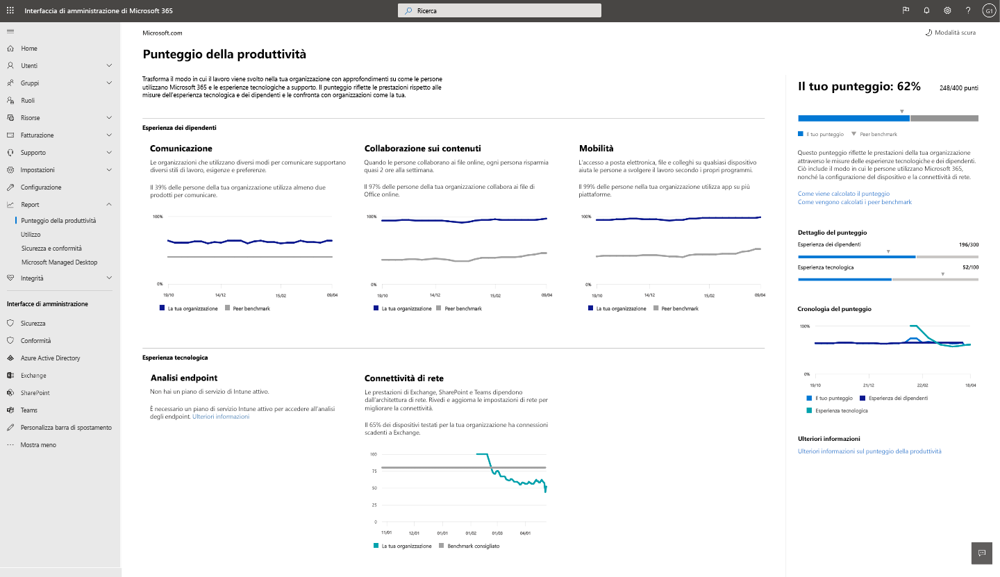

# Punteggio di produttività Microsoft (anteprima)

Il Punteggio di produttività consente alle organizzazioni di trasformare il lavoro svolto con informazioni su come gli utenti utilizzano Microsoft 365 e le esperienze tecnologiche che le supportano. Lo Score riflette le prestazioni dell'organizzazione rispetto alle misure relative all'esperienza dipendente e alla tecnologia e confronta il punteggio con organizzazioni come la propria.

La partitura include:

- **Metriche** che consentono di vedere in che modo le persone usano prodotti Microsoft 365 per collaborare, comunicare e lavorare su più piattaforme.
- Informazioni dettagliate sui dati utili per identificare le opportunità di migliorare la produttività e la **soddisfazione dei dipendenti** .
- Le **azioni consigliate** che è possibile eseguire per aiutare gli utenti dell'organizzazione a utilizzare i prodotti Microsoft 365 sono efficienti in modo che tutti possano svolgere il proprio lavoro.

Vengono forniti dati, informazioni dettagliate e suggerimenti in due aree: 

- **Esperienza dipendente:** Misuriamo il modo in cui le persone collaborano al contenuto, il modo in cui utilizzano i prodotti Microsoft 365 per comunicare e se utilizzano Microsoft 365 su più piattaforme. 

    Queste informazioni vengono fornite perché quando le persone collaborano online, risparmiano tempo. Quando hanno la libertà di lavorare su qualsiasi dispositivo, sono più produttivi e soddisfatti. Quando sono in grado di comunicare in modo flessibile, sono più efficienti, formano relazioni migliori e l'organizzazione è più unita. Per ulteriori informazioni, vedere [rapporto Forrester](https://vc2prod.blob.core.windows.net/vc-resources/TEIStudies/TEI%20of%20Microsoft%20365%20E5%20-%20Oct%202018.pdf).

- **Tecnologia Experience:** La produttività dipende da una tecnologia affidabile e performante, oltre che da un utilizzo efficiente di Microsoft 365. Viene fornita l' [analisi dell'endpoint](https://aka.ms/endpointanalytics), che consente di comprendere in che modo la produttività degli utenti può essere influenzata da problemi di prestazioni e integrità con l'hardware e il software dell'endpoint, garantendo le azioni consigliate per rimediare; Microsoft 365 fornisce informazioni sulla connettività di rete per la propria organizzazione.

Vedere [che cos'è l'analisi di endpoint](https://docs.microsoft.com/mem/analytics/overview) per una panoramica e Dettagli prerequisito. Per ulteriori informazioni sulle considerazioni relative alla connettività di rete di Microsoft 365, leggere [la panoramica della connettività di rete](https://docs.microsoft.com/office365/enterprise/office-365-networking-overview).
  

## Modalità di calcolo del Punteggio

Il Punteggio di produttività è basato sui punteggi combinati delle categorie di esperienza dipendente e tecnologia. Ogni categoria viene ponderata equamente, con un totale di 100 punti per categoria. Il numero totale di punti possibili per il Punteggio di produttività è 500.

### Categorie di Punteggio 

- Collaborazione del contenuto (100 punti)
- Comunicazione (100 punti)
- Mobilità (100 punti)
- Analisi degli endpoint (100 punti)
- Connettività di rete (100 punti)
- **Totale possibile = 500 punti**
 
 In ogni categoria vengono identificati i modelli per le attività chiave che sono indicatori del modo in cui gli utenti utilizzano i prodotti Microsoft 365 per collaborare, comunicare e lavorare su più piattaforme. Vengono fornite le visualizzazioni di 28 giorni e 180 giorni delle attività principali. Sono inoltre disponibili metriche di supporto che non fanno parte del calcolo del punteggio, ma sono importanti per identificare i comportamenti e le impostazioni sottostanti che è possibile utilizzare per la modifica dell'unità.

### Prodotti inclusi nel punteggio di produttività 

Il Punteggio di produttività include i dati di Exchange, SharePoint, OneDrive, teams, Word, Excel, PowerPoint, OneNote, Outlook, Yammer e Skype.

Il Punteggio viene aggiornato giornalmente e riflette le azioni degli utenti completate negli ultimi 28-180 giorni (compreso il giorno corrente).

## Prerequisiti 

È necessario un abbonamento a Microsoft 365 for business o Office 365 for Enterprise per ottenere i dati relativi alle esperienze dei dipendenti ed è necessario utilizzare servizi cloud multi-tenant. Per ottenere i dati di analisi degli endpoint per il tenant, è necessario aggiungere Microsoft Intune all'abbonamento. Intune consente di proteggere i dati dell'organizzazione tramite la gestione di dispositivi e app.       Dopo aver installato Intune, è possibile abilitare l'analisi di endpoint all'interno dell'esperienza di Intune. Per ulteriori informazioni, vedere Microsoft Intune. 

Per visualizzare il Punteggio di produttività per l'organizzazione, è necessario disporre di uno dei ruoli seguenti: 

- Amministratore globale 
- Amministratori di Exchange
- Amministratore di SharePoint 
- Amministratore di Skype for Business 
- Amministratore di Teams 
- Ruolo con autorizzazioni di lettura globali 
- Lettore report 

È possibile accedere all'esperienza da Microsoft 365 admin Home in **report**  >  **Productivity Score**.

## Interpretazione del Punteggio di produttività 

La Home page del Punteggio di produttività Visualizza il punteggio totale e la cronologia dei punteggi, nonché l'intuizione principale per ogni categoria

**Il Punteggio** viene visualizzato come valore percentuale, nonché in punti, in modo da poter visualizzare i punti (numeratore) e i punti massimi possibili (denominatore).

I **benchmark peer** consentono di confrontare il punteggio con organizzazioni come la propria. Per le categorie di esperienza dipendente, la misura di benchmark peer viene calcolata come media delle misure all'interno di un insieme di organizzazioni simili. Il set è costituito da organizzazioni nella propria area geografica con un numero analogo di utenti con licenza, tipi di licenze, industria e possesso con Microsoft 365. 

Il benchmark peer analisi endpoint include gli obiettivi per le prestazioni di avvio del dispositivo e la configurazione software consigliata in base ai valori mediani aggregati in tutti i tenant.

Per la connettività di rete, il benchmark consigliato è 80 punti.

La sezione **Score Breakdown** fornisce una ripartizione del Punteggio di produttività con benchmark da parte dei dipendenti e delle aree di utilizzo della tecnologia.

La cronologia dei punteggi Visualizza la modalità di modifica del Punteggio di ogni categoria negli ultimi 6 mesi.

Le aree esperienza e **tecnologia** dei **dipendenti** contengono le informazioni principali per le categorie in queste aree. È possibile fare clic su ogni categoria per visualizzare le informazioni più approfondite.

## Pagine dei dettagli categoria

In ogni pagina dei dettagli della categoria vengono illustrate le metriche principale e di supporto, nonché le attività relative alla ricerca e alle azioni che è possibile eseguire per gestire le modifiche nell'organizzazione. La ricerca supporta l'importanza e la logica dietro le intuizioni principali di ogni categoria. Per ulteriori informazioni, [leggere il rapporto Forrester](https://vc2prod.blob.core.windows.net/vc-resources/TEIStudies/TEI%20of%20Microsoft%20365%20E5%20-%20Oct%202018.pdf).

### Dettagli sulla collaborazione del contenuto

L'intuizione principale per la collaborazione tra i contenuti è il numero di persone che creano, leggono e collaborano (modifica e Condividi) online. Queste misure sono importanti perché la ricerca dimostra che quando la gente collabora con i file online, ogni persona salva una media di 100 minuti o quasi 2 ore alla settimana.

Viene definita la collaborazione del contenuto come una persona che crea e condivide un file di Office e quindi almeno un'altra persona la modifica. 

Lettori: utenti che accedono o scaricano file online in OneDrive o SharePoint.

**Creatori:** Utenti che creano, modificano, caricano, sincronizzano, eseguono l'archiviazione, la copia o lo spostamento di file di OneDrive o SharePoint Online.

Collaboratori: utenti che collaborano con i file online tramite OneDrive o SharePoint. Due persone sono collaboratori se uno di essi legge o modifica un documento cloud online di Word, Excel, PowerPoint, OneNote o PDF dopo che l'altra persona lo ha creato o modificato, all'interno di una finestra di 28 giorni.

I tipi di file considerati per la collaborazione sono file Word, Excel, PowerPoint, OneNote e PDF.

Vengono fornite informazioni dettagliate sui tempi di avvio e sulla configurazione dei dispositivi nell'organizzazione, nonché informazioni sulla connettività di rete per la collaborazione dei contenuti, poiché la collaborazione dei file online richiede dispositivi affidabili che si avviano rapidamente e dispongono di software aggiornato, nonché di una buona connettività a Microsoft 365.

### Dettagli della comunicazione

L'intuizione principale per la comunicazione è la frequenza con cui gli utenti dell'organizzazione utilizzano messaggi di posta elettronica, chat e community per comunicare. Questa intuizione è importante perché quando gli utenti utilizzano una vasta gamma di strumenti di comunicazione in tempo reale, sono in grado di scegliere la modalità di comunicazione che li aiuta ad essere più efficienti e dispongono di strumenti come chat e community che consentono loro di sviluppare relazioni tra le diverse posizioni di Office.

### Dettagli sulla mobilità

L'intuizione principale per la mobilità è il numero di persone che accedono ai file e usano la posta elettronica e la chat su più piattaforme. La possibilità di lavorare da qualsiasi posizione su qualsiasi dispositivo scelga è importante per gli utenti con ruoli di vendita, Senior Manager, consulenti e altri utenti che devono svolgere un lavoro lontano dall'ufficio per essere produttivi. I miglioramenti apportati a questi operatori hanno un impatto notevole. 

Misuriamo la percentuale e il numero assoluto di persone che hanno utilizzato almeno un'app per la produttività di Microsoft 365 in due o più piattaforme, tra cui desktop, mobili e Web. Le app per la produttività che misuriamo sono Outlook, teams, Word, Excel, PowerPoint, OneNote, Yammer e Skype. Gli utenti devono disporre delle licenze Microsoft 365 Apps for Enterprise, Exchange, Yammer, Skype o teams. 

## Rapporto speciale di continuità aziendale

Il rapporto di continuità aziendale è un report di intelligence sul luogo di lavoro a tempo limitato disponibile per tutti i clienti di Microsoft 365 per aiutarli a guidare le loro organizzazioni durante questo momento impegnativo.  

Questo rapporto aiuta i leader aziendali a comprendere quanto segue: 

- Il modo in cui la collaborazione e la comunicazione sono intaccate dal passaggio al lavoro remoto. 

- L'impatto sul saldo della vita lavorativa come la gente adatta a lavorare da casa. 

- Se le riunioni remote supportano un processo decisionale efficace.

[Ulteriori informazioni sul rapporto di continuità aziendale](https://aka.ms/bcrps)

[Altre informazioni su Microsoft Graph](https://docs.microsoft.com/graph/)

## Si vuole sapere da voi

Si prega di condividere i propri pensieri sul punteggio di produttività e sulle idee su come migliorarlo. Utilizzare le sezioni di **feedback** all'interno del prodotto e/o raggiungere il team del Punteggio di produttività in ProductivityScorePreview@service.microsoft.com.
