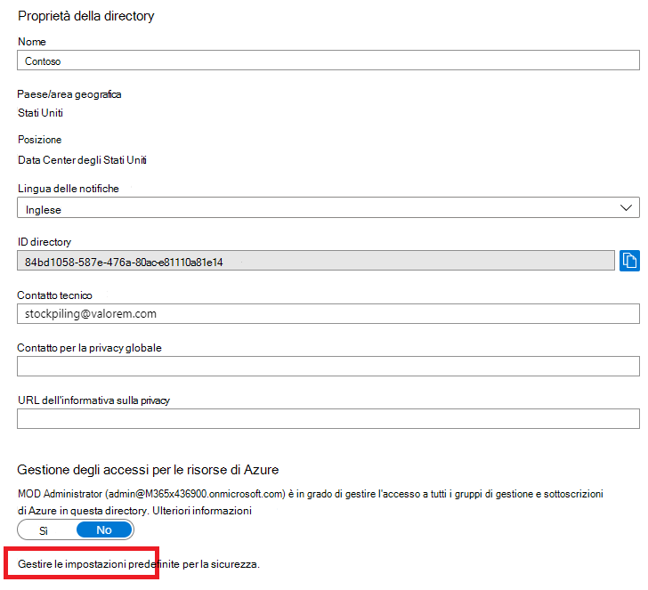
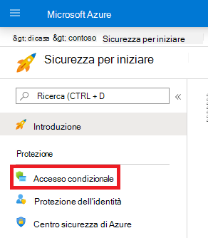
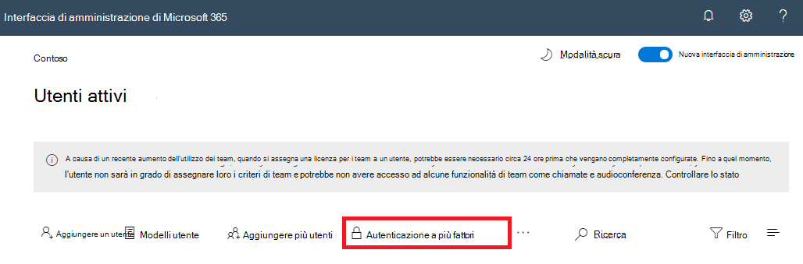

# Autenticazione a più fattori per Microsoft 365Multi-factor authentication for Microsoft 365

Le password sono il metodo più comune per l'autenticazione di un accesso a un computer o a un servizio online, ma sono anche le più vulnerabili.Passwords are the most common method of authenticating a sign-in to a computer or online service, but they are also the most vulnerable. Gli utenti possono scegliere password facili e utilizzare le stesse password per accedere a più accessi a computer e servizi diversi.People can choose easy passwords and use the same passwords for multiple sign-ins to different computers and services.

Per fornire un ulteriore livello di sicurezza per gli accessi, è necessario utilizzare l'autenticazione a più fattori (AMF), che utilizza sia una password, che deve essere forte, sia un ulteriore metodo di verifica basato sui seguenti valori:To provide an additional level of security for sign-ins, you must use multi-factor authentication (MFA), which uses both a password, which should be strong, and an additional verification method based on:

- Qualcosa che si ha con voi che non è facilmente duplicato, ad esempio uno Smart Phone.Something you have with you that is not easily duplicated, such as a smart phone.
- Qualcosa che si ha in modo univoco e biologicamente, ad esempio le impronte digitali, la faccia o altri attributi biometrici.Something you uniquely and biologically have, such as your fingerprints, face, or other biometric attribute.

Il metodo di verifica aggiuntivo non viene utilizzato fino a quando la password dell'utente non è stata verificata.The additional verification method is not employed until after the user’s password has been verified. Con AMF, anche se una password utente complessa è danneggiata, l'aggressore non ha lo Smart Phone o l'impronta digitale per completare l'accesso.With MFA, even if a strong user password is compromised, the attacker does not have your smart phone or your fingerprint to complete the sign-in.

## Supporto dell'AMF in Microsoft 365MFA support in Microsoft 365
Per impostazione predefinita, sia Microsoft 365 che Office 365 supportano AMF per gli account utente utilizzando:By default, both Microsoft 365 and Office 365 support MFA for user accounts using:

- Un messaggio di testo inviato a un telefono che richiede all'utente di immettere un codice di verifica.A text message sent to a phone that requires the user to type a verification code.
- Una telefonata.A phone call.
- App Smart Phone Microsoft Authenticator.The Microsoft Authenticator smart phone app.

In entrambi i casi, l'accesso dell'AMF utilizza il metodo "something you have with you that is not facilmente Duplicated" per la verifica aggiuntiva.In both cases, the MFA sign-in is using the “something you have with you that is not easily duplicated” method for the additional verification.
Esistono diversi modi in cui è possibile abilitare l'AMF per Microsoft 365 e Office 365:There are multiple ways in which you can enable MFA for Microsoft 365 and Office 365:

- Con le impostazioni predefinite di sicurezzaWith security defaults
- Con i criteri di accesso condizionaleWith Conditional Access policies
- Per ogni singolo account utente (non consigliato)For each individual user account (not recommended)

Questi modi si basano sul piano Microsoft 365.These ways are based on your Microsoft 365 plan.
    
|PianoPlan  |ConsiglioRecommendation  | Tipo di clienteType of customer |
|---------|---------|----------|
| Tutti i piani di Microsoft 365All Microsoft 365 plans | Utilizzare le impostazioni predefinite per la sicurezza, che richiedono l'AMF per tutti gli account utente.Use security defaults, which require MFA for all user accounts.   È inoltre possibile richiedere l'utilizzo dell'AMF in base all'account utente, ma non è consigliabile.You can also require MFA on a per-user account basis, but this is not recommended. | Azienda di piccole dimensioniSmall business |
| Microsoft 365 Business PremiumMicrosoft 365 Business Premium    Microsoft 365 E3Microsoft 365 E3    Licenze P1 di Azure Active Directory (Azure AD)Azure Active Directory (Azure AD) Premium P1 licenses | Utilizzare i criteri di accesso condizionale per richiedere l'utilizzo dell'AMF per gli account utente in base all'appartenenza ai gruppi, alle app o ad altri criteri.Use Conditional Access policies to require MFA for user accounts based on group membership, apps, or other criteria. | Small Business to EnterpriseSmall business to enterprise |
| Microsoft 365 E5Microsoft 365 E5    Licenze P2 di Azure AD PremiumAzure AD Premium P2 licenses | Usare Azure AD Identity Protection per richiedere l'utilizzo dell'AMF in base ai criteri di rischio di accesso.Use Azure AD Identity Protection to require MFA based on sign-in risk criteria. |  Grandi aziendeEnterprise |
||||

### Impostazioni predefinite per la sicurezzaSecurity defaults

Le impostazioni predefinite di sicurezza sono una nuova funzionalità per gli abbonamenti a pagamento o di valutazione di Microsoft 365 e Office 365 creati dopo il 21 ottobre 2019.Security defaults is a new feature for Microsoft 365 and Office 365 paid or trial subscriptions created after October 21, 2019. Sono state attivate le impostazioni predefinite per la sicurezza, che sono le seguenti:These subscriptions have security defaults turned on, which:

- Richiede a tutti gli utenti di utilizzare il master con l'app Microsoft Authenticator.Requires all of your users to use MFA with the Microsoft Authenticator app.
- Blocca l'autenticazione legacy.Blocks legacy authentication.

Gli utenti hanno 14 giorni per registrarsi per la MFA con l'app Microsoft Authenticator dai propri smartphone, periodo che inizia dalla prima volta che accedono dopo aver abilitato le impostazioni predefinite di sicurezza.Users have 14 days to register for MFA with the Microsoft Authenticator app from their smart phones, which begins from the first time they sign in after security defaults has been enabled. Trascorsi 14 giorni, l'utente non sarà in grado di accedere fino al completamento della registrazione della MFA.After 14 days have passed, the user won't be able to sign in until MFA registration is completed.

Le impostazioni di sicurezza predefinite garantiscono che tutte le organizzazioni dispongano di un livello base di sicurezza per l'accesso degli utenti abilitato per impostazione predefinita.Security defaults ensure that all organizations have a basic level of security for user sign-in that is enabled by default. È possibile disabilitare le impostazioni predefinite per la sicurezza in favore dell'AMF con criteri di accesso condizionale.You can disable security defaults in favor of MFA with Conditional Access policies.

È possibile abilitare o disabilitare le impostazioni predefinite di sicurezza dal riquadro delle **Proprietà** di Azure ad nel portale di Azure.You enable or disable security defaults from the **Properties** pane for Azure AD in the Azure portal.

È possibile utilizzare le impostazioni predefinite di sicurezza con qualsiasi piano di Microsoft 365.You can use security defaults with any Microsoft 365 plan.

Per altre informazioni, vedere questa [panoramica delle impostazioni predefinite di sicurezza](https://docs.microsoft.com/azure/active-directory/fundamentals/concept-fundamentals-security-defaults).For more information, see this [overview of security defaults](https://docs.microsoft.com/azure/active-directory/fundamentals/concept-fundamentals-security-defaults). 

### Criteri di accesso condizionaleConditional Access policies

I criteri di accesso condizionale sono un insieme di regole che specificano le condizioni in base alle quali gli accessi vengono valutati e consentiti.Conditional Access policies are a set of rules that specify the conditions under which sign-ins are evaluated and allowed. Ad esempio, è possibile creare un criterio di accesso condizionale che indichi:For example, you can create a Conditional Access policy that states:

- Se il nome dell'account utente corrisponde a un membro di un gruppo per utenti a cui sono assegnati i ruoli di amministratore di Exchange, utenti, password, sicurezza, SharePoint o globale, richiedere la MFA prima di consentire l'accesso.If the user account name is a member of a group for users that are assigned the Exchange, user, password, security, SharePoint, or global administrator roles, require MFA before allowing access.

Questo criterio consente di richiedere l'autenticazione a più fattori in base all'appartenenza al gruppo, anziché configurare i singoli account utente per l'autenticazione a più fattori quando vengono assegnati o non assegnati tramite questi ruoli di amministratore.This policy allows you to require MFA based on group membership, rather than trying to configure individual user accounts for MFA when they are assigned or unassigned from these administrator roles.

È inoltre possibile utilizzare i criteri di accesso condizionale per funzionalità più avanzate, ad esempio l'utilizzo dell'AMF per specifiche app o l'esecuzione dell'accesso da un dispositivo compatibile, ad esempio il laptop che esegue Windows 10.You can also use Conditional Access policies for more advanced capabilities, such as requiring MFA for specific apps or that the sign-in is done from a compliant device, such as your laptop running Windows 10.

È possibile configurare i criteri di accesso condizionale dal riquadro di **sicurezza** di Azure ad nel portale di Azure.You configure Conditional Access policies from the **Security** pane for Azure AD in the Azure portal.

È possibile utilizzare i criteri di accesso condizionale con:You can use Conditional Access policies with:

- Microsoft 365 Business PremiumMicrosoft 365 Business Premium
- Microsoft 365 E3 ed E5Microsoft 365 E3 and E5
- Licenze di Azure AD Premium P1 e Azure AD Premium P2Azure AD Premium P1 and Azure AD Premium P2 licenses 

Per le aziende di piccole dimensioni con Microsoft 365 Business Premium, è possibile utilizzare facilmente i criteri di accesso condizionale con i passaggi seguenti:For small businesses with Microsoft 365 Business Premium, you can easily use Conditional Access policies with the following steps:

1. Creare un gruppo che contenga gli account utente che richiedono l'utilizzo dell'AMF.Create a group to contain the user accounts that require MFA.
2. Abilitare il criterio **per gli amministratori globali per** l'autenticazione obbligatoria.Enable the **Require MFA for global admins** policy.
3. Creare un criterio di accesso condizionale basato su gruppo con queste impostazioni:Create a group-based Conditional Access policy with these settings:
    - Assegnazioni > utenti e gruppi: il nome del gruppo al passaggio 1.Assignments > Users and groups: The name of your group from Step 1 above.
    - Assegnazioni > app o azioni cloud: tutte le app cloud.Assignments > Cloud apps or actions: All cloud apps.
    - I controlli di accesso > Grant > Grant Access > richiedono l'autenticazione a più fattori.Access controls > Grant > Grant access > Require multi-factor authentication.
4. Abilitazione del criterio.Enable the policy.
5. Aggiungere un account utente al gruppo creato nel passaggio 1 sopra e testare.Add a user account to the group created in Step 1 above and test.
6. Per richiedere l'utilizzo dell'AMF per account utente aggiuntivi, aggiungerli al gruppo creato nel passaggio 1.To require MFA for additional user accounts, add them to the group created in Step 1.

Questo criterio di accesso condizionale consente di implementare il requisito dell'AMF per gli utenti a proprio piacimento.This Conditional Access policy allows you to roll out the MFA requirement to your users at your own pace.

Le aziende devono utilizzare [criteri di accesso condizionale comuni](https://docs.microsoft.com/azure/active-directory/conditional-access/concept-conditional-access-policy-common) per configurare i criteri seguenti:Enterprises should use [Common Conditional Access policies](https://docs.microsoft.com/azure/active-directory/conditional-access/concept-conditional-access-policy-common) to configure the following policies:

- [Richiedere la MFA per amministratoriRequire MFA for administrators](https://docs.microsoft.com/azure/active-directory/conditional-access/howto-conditional-access-policy-admin-mfa)
- [Richiedere la MFA per tutti gli utentiRequire MFA for all users](https://docs.microsoft.com/azure/active-directory/conditional-access/howto-conditional-access-policy-all-users-mfa)
- [Bloccare l'autenticazione legacyBlock legacy authentication](https://docs.microsoft.com/azure/active-directory/conditional-access/howto-conditional-access-policy-block-legacy)

Per altre informazioni, vedere questa [panoramica dell'accesso condizionale](https://docs.microsoft.com/azure/active-directory/conditional-access/overview).For more information, see this [overview of Conditional Access](https://docs.microsoft.com/azure/active-directory/conditional-access/overview).

### Azure AD Identity ProtectionAzure AD Identity Protection

Con Azure AD Identity Protection, è possibile creare un ulteriore criterio di accesso condizionale per richiedere il livello di sicurezza [dell'AMF quando il rischio di iscrizione è medio o elevato](https://docs.microsoft.com/microsoft-365/enterprise/identity-access-policies#require-mfa-based-on-sign-in-risk).With Azure AD Identity Protection, you can create an additional Conditional Access policy to [require MFA when sign-in risk is medium or high](https://docs.microsoft.com/microsoft-365/enterprise/identity-access-policies#require-mfa-based-on-sign-in-risk).

È possibile utilizzare i criteri di accesso condizionale di Azure AD Identity Protection e Risk-based con:You can use Azure AD Identity Protection and risk-based Conditional Access policies with:

- Microsoft 365 E5Microsoft 365 E5
- Licenze P2 di Azure AD PremiumAzure AD Premium P2 licenses

Per ulteriori informazioni, vedere questa [panoramica di Azure AD Identity Protection](https://docs.microsoft.com/azure/active-directory/identity-protection/overview-identity-protection).For more information, see this [overview of Azure AD Identity Protection](https://docs.microsoft.com/azure/active-directory/identity-protection/overview-identity-protection).

### AMF per un singolo account utente (non consigliato)MFA for an individual user account (not recommended)

È consigliabile utilizzare i criteri di sicurezza o di accesso condizionale per richiedere l'autenticazione per l'account utente. Tuttavia, se una di queste non può essere utilizzata, Microsoft consiglia di utilizzare l'AMF per gli account utente che dispongono di ruoli di amministratore, in particolare il ruolo di amministratore globale, per qualsiasi sottoscrizione di dimensioni.You should be using either security defaults or Conditional Access policies to require MFA for your user account sign-ins. However, if either of these cannot be used, Microsoft strongly recommends MFA for user accounts that have administrator roles, especially the global administrator role, for any size subscription. 

È possibile abilitare l'AMF per singoli account utente dal riquadro **utente attivo dell'interfaccia** di amministrazione di Microsoft 365.You enable MFA for individual user accounts from the **Active user** pane of the Microsoft 365 admin center.

Dopo essere stato abilitato, la volta successiva che l'utente accede, verrà richiesto di registrarsi per l'AMF e di scegliere e testare il metodo di verifica aggiuntivo.After being enabled, the next time the user signs in, they will be prompted to register for MFA and to choose and test the additional verification method.

### Usare questi metodi insiemeUsing these methods together

Questa tabella mostra i risultati dell'abilitazione della MFA con impostazioni predefinite di sicurezza, criteri di accesso condizionale e impostazioni dell'account per utente.This table shows the results of enabling MFA with security defaults, Conditional Access policies, and per-user account settings.

|| AbilitatoEnabled | DisattivatoDisabled | Metodo di autenticazione secondarioSecondary authentication method |
|:-------|:-----|:-------|:-------|
| **Impostazioni predefinite per la sicurezza****Security defaults** | Non è possibile utilizzare i criteri di accesso condizionaleCan’t use Conditional Access policies |   È possibile utilizzare i criteri di accesso condizionaleCan use Conditional Access policies | App Microsoft AuthenticatorMicrosoft Authenticator app |
| **Criteri di accesso condizionale****Conditional Access policies** |Se alcuni sono abilitati, non è possibile abilitare le impostazioni predefinite per la sicurezzaIf any are enabled, you can’t enable security defaults | Se sono tutti disabilitati, è possibile abilitare le impostazioni predefinite per la sicurezzaIf all are disabled, you can enable security defaults | Specificato dall'utente durante la registrazione della MFAUser-specified during MFA registration |
| **Impostazione dell'account per utente (non consigliata)****Per-user account setting (not recommended)** | Sottoposto a override dalle impostazioni predefinite di sicurezza e dai criteri di accesso condizionale che richiedono l'AMFOverridden by security defaults and Conditional Access policies requiring MFA | Sottoposto a override da criteri di accesso condizionale e impostazioni predefinite per la sicurezzaOverridden by security defaults and Conditional Access policies | Specificato dall'utente durante la registrazione della MFAUser-specified during MFA registration|
||||

Se le impostazioni predefinite per la sicurezza sono abilitate, tutti i nuovi utenti vengono richieste per la registrazione dell'AMF e per l'utilizzo dell'app Microsoft Authenticator all'accesso successivo.If security defaults are enabled, all new users are prompted for MFA registration and the use of the Microsoft Authenticator app at their next sign-in.

Tuttavia, se un utente ha un telefono meno recente che può ricevere messaggi di testo ma non è in grado di eseguire l'app Microsoft Authenticator, è possibile abilitare l'autenticazione Master su quell'account utente specifico e farli registrare utilizzando il metodo di verifica supplementare del codice di testo con i passaggi seguenti:However, if a user has an older phone that can receive text messages but cannot run the Microsoft Authenticator app, you can enable MFA on that specific user account and have them register using the text code additional verification method with these steps:

1. Disabilitare le impostazioni predefinite per la sicurezza nel portale di Azure.Disable security defaults in the Azure portal.
2. Abilitare l'autenticazione master per l'account utente nell'interfaccia di amministrazione di Microsoft 365.Enable MFA for the user account in the Microsoft 365 admin center.
3. Fare in modo che l'utente esegua l'accesso e registri il metodo di autenticazione del codice di testo e dell'AMF.Have the user sign in and register for MFA and the text code authentication method.
4. Al termine, abilitare le impostazioni predefinite per la sicurezza nel portale di AzureWhen complete, enable security defaults in the Azure portal

## Modalità di gestione delle impostazioni dell'AMFWays to manage MFA settings

Esistono due modi per gestire le impostazioni dell'AMF.There are two ways to manage MFA settings.

Nel portale di Azure, è possibile:In the Azure portal, you can:

- Abilitare e disabilitare le impostazioni predefinite per la sicurezzaEnable and disable security defaults
- Configurare i criteri di accesso condizionaleConfigure Conditional Access policies

Nell'interfaccia di amministrazione di Microsoft 365, è possibile configurare le impostazioni dell'AMF per utente e dei servizi.In the Microsoft 365 admin center, you can configure per-user and service MFA settings.

## Passaggio successivoYour next step

[Configurare l'AMF per Microsoft 365Set up MFA for Microsoft 365](set-up-multi-factor-authentication.md)

