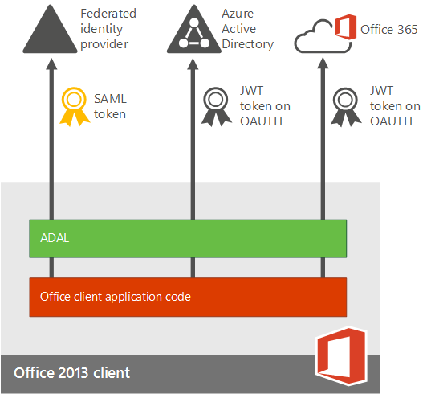

# Pianificare l'autenticazione a più fattori per le distribuzioni di Office 365

L'autenticazione a più fattori (MFA) è un metodo di autenticazione che richiede l'uso di più metodi di verifica e aggiunge un secondo livello di sicurezza agli accessi e alle transazioni degli utenti. Funziona richiedendo due o più dei metodi di verifica seguenti:
  
- Un passcode generato casualmente
    
- Una telefonata
    
- Una smart card virtuale o fisica 
    
- Un dispositivo biometrico 
    
## Autenticazione a più fattori in Office 365

Office 365 utilizza l'autenticazione a più fattori per fornire la sicurezza aggiuntiva ed è gestita dall'interfaccia di amministrazione di Microsoft 365. Office 365 offre il seguente sottoinsieme di funzionalità di autenticazione a più fattori di Azure come parte della sottoscrizione: 
  
- La possibilità di abilitare e applicare l'autenticazione a più fattori per gli utenti finali
    
- L'uso di un'app per dispositivi mobili (online o OTP, One-Time Password) come secondo fattore di autenticazione
    
- L'uso di una telefonata come secondo fattore di autenticazione
    
- L'uso di un SMS come secondo fattore di autenticazione
    
- Password delle applicazioni per i client non browser, ad esempio, il software di comunicazione Microsoft Lync 2013
    
- Messaggio di saluto predefinito Microsoft durante le telefonate di autenticazione
    
Per l'elenco completo delle funzionalità aggiunte, vedere [il confronto con la versione Azure Multi-Factor Authentication](https://go.microsoft.com/fwlink/?LinkId=506927). È sempre possibile usufruire delle funzionalità complete acquistando il servizio Azure Multi-Factor Authentication. 
  
Il subset di funzionalità varia a seconda che si abbia una distribuzione solo cloud per Office 365 o una configurazione ibrida con Single Sign-On e Active Directory Federation Services (ADFS). 
  
|**Da dove si gestisce il tenant di Office 365?**|**Opzioni per il secondo fattore dell'autenticazione a più fattori**|
|:-----|:-----|
|Solo cloud    |Autenticazione a più fattori di Azure (testo o telefonata)    |
|Configurazione ibrida, gestita in locale    | Se l'identità utente viene gestita in locale, sono disponibili le opzioni seguenti:     Smart Card fisica o virtuale (quando si utilizza ADFS)    [Autenticazione](https://go.microsoft.com/fwlink/p/?LinkId=526677) a più fattori di Azure (modulo per ADFS)     Autenticazione a più fattori di Azure Active Directory (Azure AD)    |
   
  
La figura seguente mostra in che modo le app aggiornate per i dispositivi di Office 2013 (in Windows) consentono agli utenti di accedere con l'autenticazione a più fattori. Le app per dispositivi di Office 2013 supportano l'autenticazione a più fattori tramite l'utilizzo della [libreria di autenticazione di Active Directory (adal)](https://go.microsoft.com/fwlink/p/?LinkId=526684). Azure AD ospita una pagina Web per l'accesso degli utenti. Il provider di identità può essere Azure AD o un provider di identità federate come ADFS. L'autenticazione per gli utenti federati prevede i passaggi seguenti:
  
1. Azure AD reindirizza l'utente alla pagina Web di accesso ospitata dal provider di identità del record per il tenant di Office 365. Il provider di identità è determinato dal dominio specificato nel nome di accesso dell'utente.
    
2. L'utente accede alla pagina Web di accesso nel proprio dispositivo. 
    
3. Il provider di identità restituisce un token a Azure AD dopo che l'utente ha eseguito correttamente l'accesso.
    
4. Azure AD restituisce un token Web JSON (JWT) all'app per i dispositivi di Office e l'app viene autenticata usando un token JWT con Office 365. 
    
Questa operazione è descritta in dettaglio nella figura seguente:
  

  
## Requisiti software

Per abilitare l'autenticazione a più fattori per le app client di Office 2013, è necessario che sia installato il software seguente (la versione elencata di seguito o una versione più recente) a seconda che sia stata eseguita un'[Installazioni basate su A portata di clic](#click-to-run-based-installations) o un' [Installazioni basate su MSI](#msi-based-installations).
  
Per determinare se l'installazione di Office è basata su A portata di clic o su MSI:
  
1. Avviare Outlook 2013.
    
2. Scegliere **account di Office**dal menu **file** .
    
3. Per le installazioni A portata di clic di Outlook 2013, viene visualizzato il pulsante **Opzioni di aggiornamento**. Per le installazioni basate su MSI, non viene visualizzato il pulsante **Opzioni di aggiornamento**. 
    
    
  
### Installazioni basate su A portata di clic

Per le installazioni basate su A portata di clic è necessario che nel computer sia installato il software seguente (la versione elencata di seguito o una versione successiva). Se la versione del file non è uguale o successiva alla versione del file nell'elenco, aggiornarla con la procedura seguente.
  
|**Usare l'attività di riepilogo del progetto per allegare o creare un collegamento ai documenti per la pianificazione**|**Percorso di installazione nel computer**|**Versione del file**|
|:-----|:-----|:-----|
|MSO. DLL    |C:\Programmi\Microsoft Office 15\root\vfs\ProgramFilesCommonx86\Microsoft Shared\OFFICE15\MSO.DLL    |15.0.4753.1001    |
|CSI. DLL    |CSI.DLL C:\Programmi\Microsoft Office 15\root\office15\csi.dll    |15.0.4753.1000    |
|Groove. EXE    |C:\Programmi\Microsoft Office 15\root\office15\GROOVE.exe    |15.0.4763.1000    |
|Outlook. exe    |C:\Programmi\Microsoft Office 15\root\office15\OUTLOOK.exe    |15.0.4753.1002    |
|ADAL. DLL    |C:\Programmi\Microsoft Office 15\root\vfs\ProgramFilesCommonx86\Microsoft Shared\OFFICE15\ADAL.DLL    |1.0.2016.624    |
|Iexplore. exe    |C:\Programmi\Internet Explorer    |varia    |
   
### Installazioni basate su MSI

Per le installazioni basate su MSI è necessario che nel computer sia installato il software seguente (la versione elencata di seguito o una versione successiva). Se la versione del file non è uguale o successiva alla versione del file nell'elenco, aggiornarla usando il collegamento nella colonna relativa al corrispondente articolo della Knowledge Base.
  
|**Usare l'attività di riepilogo del progetto per allegare o creare un collegamento ai documenti per la pianificazione**|**Percorso di installazione nel computer**|**Dove ottenere l'aggiornamento**|**Versione**|
|:-----|:-----|:-----|:-----|
|MSO. DLL    |C:\Programmi\Common Files\Microsoft Shared\OFFICE15\MSO.DLL    |[KB3085480](https://support.microsoft.com/kb/3085480)   |15.0.4753.1001    |
|CSI. DLL    |C:\Programmi\Common Files\Microsoft Shared\OFFICE15\Csi.dll    |[KB3085504](https://support.microsoft.com/kb/3085504)   |15.0.4753.1000    |
|Groove. exe    |C:\Programmi\Microsoft Office\Office15\GROOVE.EXE    |[KB3085509](https://support.microsoft.com/kb/3085509)   |15.0.4763.1000    |
|Outlook. exe    |C:\Programmi\Microsoft Office\Office15\OUTLOOK.EXE    |[KB3085495](https://support.microsoft.com/kb/3085495)   |15.0.4753.1002    |
|ADAL. DLL    |C:\Programmi\Common Files\Microsoft Shared\OFFICE15\ADAL.DLL    |[KB3055000](https://support.microsoft.com/kb/3055000)   |1.0.2016.624    |
|Iexplore. exe    |C:\Programmi\Internet Explorer    |[MS14-052](https://support.microsoft.com/kb/2977629)   |Non applicabile    |
   
## Abilitare l'autenticazione a più fattori

Per abilitare l'autenticazione a più fattori, è necessario completare le operazioni seguenti:
  
1. Abilitare i client per l'autenticazione moderna:
    
  - [Abilitare l'autenticazione moderna per Office 2013 nei dispositivi Windows](enable-modern-authentication.md) . 
    
  - Configurare l'autenticazione a più fattori di Azure con servizi directory di terze parti.
    
    Per informazioni su specifici provider di identità accettati per questo programma, vedere [scenari avanzati con autenticazione a più fattori di Azure e soluzioni VPN di terze parti](https://docs.microsoft.com/azure/active-directory/authentication/howto-mfaserver-nps-vpn) . 
    
2. [Configurare l'autenticazione a più fattori per Office 365](set-up-multi-factor-authentication.md)
    
3. Spiegare ai singoli utenti come effettuare l'accesso con l'autenticazione a più fattori: [Accedere a Office 365 con la verifica in due passaggi](https://support.office.com/article/2b856342-170a-438e-9a4f-3c092394d3cb.aspx).
    
> [!IMPORTANT]
> Se gli utenti sono stati abilitati per l'autenticazione a più fattori di Azure e dispongono di tutti i dispositivi che eseguono Office 2013 che non sono abilitati per l'autenticazione moderna, dovranno utilizzare AppPasswords su tali dispositivi. Per altre informazioni sulle password per app (AppPassword) e su quando, dove e come usarle, vedere: [Password per app con Azure Multi_Factor Authentication](https://go.microsoft.com/fwlink/p/?LinkId=528178). 
  
## Domande frequenti

[Domande frequenti sull'articolo wiki sull'autenticazione moderna](https://go.microsoft.com/fwlink/p/?LinkId=530064)
  
 **Problemi noti:**
  
[Autenticazione moderna di Office 2013 e Office 365 ProPlus: Informazioni utili prima del processo di onboarding](https://social.technet.microsoft.com/wiki/contents/articles/30214.office-2013-and-office-365-proplus-modern-authentication-things-to-know-before-onboarding.aspx)
  
 **Risoluzione dei problemi di Azure Multi-Factor Authentication:**
  
Vedere [risolvere i problemi di autenticazione a più fattori di Azure](https://support.microsoft.com/help/2937344/troubleshooting-azure-multi-factor-authentication-issues).
  
[Come risolvere i problemi di accesso con l'autenticazione moderna di Office 2013 quando si usa ADFS](https://support.microsoft.com/kb/3052203/)
  
 **Se gli ID alternativi non funzionano:**
  
[Come usare PowerShell per correggere i nomi dell'entità utente duplicati](https://go.microsoft.com/fwlink/p/?LinkId=396730)
  
[Script per correggere i nomi dell'entità utente duplicati](https://go.microsoft.com/fwlink/p/?LinkId=396725)
  
 **Filtro degli accessi client:**
  
[Criteri di filtro degli accessi client e di autenticazione moderna di Office 2013 e Office 365 ProPlus: Informazioni utili prima del processo di onboarding](https://social.technet.microsoft.com/wiki/contents/articles/30214.office-2013-and-office-365-proplus-modern-authentication-things-to-know-before-onboarding.aspx)
  
 **Quali app supportano l'autenticazione a più fattori?**
  
|**Windows**|**Mac**|**iOS**|**Telefono Android**|**Tablet Android**|
|:-----|:-----|:-----|:-----|:-----|
|L'autenticazione moderna per Word 2013, Word 2016, Excel 2013, Excel 2016, NetworkSolutionsBP-Verify-1-3, PowerPoint 2016, OneNote 2013, OneNote 2016, Project 2013, Project 2016, Visio 2013, Visio 2016, Lync 2013 e Skype for Business è supportata con questa versione.    |L'autenticazione moderna per Word 2016 per Mac, Excel 2016 per Mac e PowerPoint 2016 per Mac è supportata con questa versione.    |L'autenticazione moderna per Word per iPad, Excel per iPad e PowerPoint per iPad è supportata con questa versione.    |L'autenticazione moderna per Word per Android, Excel per Android e PowerPoint per Android è supportata con questa versione.    |L'autenticazione moderna per Word per Android, Excel per Android e PowerPoint per Android è supportata con questa versione.    |
|L'autenticazione moderna per Outlook 2013 e Outlook 2016 è supportata con questa versione.    |L'autenticazione moderna per Outlook 2016 per Mac è supportata con questa versione.    |L'autenticazione moderna per Outlook per iPad è supportata con questa versione.    |||
   

