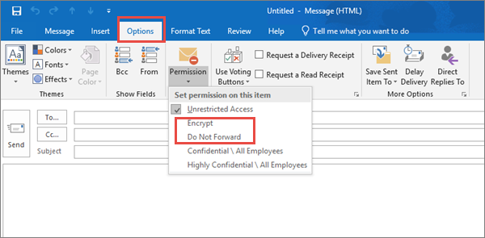

# Top 10 modi per proteggere i piani Microsoft 365 for business

::: moniker range="o365-21vianet"

> [!NOTE]
> L'interfaccia di amministrazione sta cambiando. Se alcuni dettagli non corrispondono a quelli presentati qui, vedere [Informazioni sulla nuova interfaccia di amministrazione di Microsoft 365](https://docs.microsoft.com/microsoft-365/admin/microsoft-365-admin-center-preview?view=o365-21vianet).

::: moniker-end

Se si è un'organizzazione di piccole o medie dimensioni che utilizza uno dei piani aziendali di Microsoft e il tipo di organizzazione è mirato da criminali informatici e hacker, utilizzare le istruzioni contenute in questo articolo per aumentare la sicurezza dell'organizzazione. Questa guida aiuta l'organizzazione a raggiungere gli obiettivi descritti nel [manuale della campagna](https://go.microsoft.com/fwlink/?linkid=2015598&amp;clcid=0x409)di Harvard Kennedy School Cybersecurity.
  
Microsoft consiglia di completare le attività elencate nella tabella seguente che si applicano al piano di servizio. 
  
||**Attività**|**Microsoft 365 Business Standard**|**Microsoft 365 Business Premium**|
|:-----|:-----|:-----|:-----|
|1     |[Configurare l'autenticazione a più fattori](secure-your-business-data.md#setup)   |             |             |
|2     |[Formazione degli utenti](secure-your-business-data.md#train)   |             |             |
|3     |[Utilizzo degli account amministratore dedicati](secure-your-business-data.md#admin)   |             |             |
|4     |[Aumentare il livello di protezione da malware nella posta elettronica](secure-your-business-data.md#malware)   |             |             |
|5     |[Proteggere l'ambiente da ransomware](secure-your-business-data.md#ransomware)   |             |             |
|6     |[Interrompere l'inoltro automatico per la posta elettronica](secure-your-business-data.md#forwarding)   |             |             |
|7     |[Utilizzare la crittografia dei messaggi di Office](secure-your-business-data.md#encryption)   ||             |
|8     |[Proteggere la posta elettronica da attacchi di phishing](secure-your-business-data.md#phishing)   ||             |
|9     |[Protezione da allegati e file dannosi con gli allegati sicuri di ATP](secure-your-business-data.md#atp)   ||             |
|10     |[Protezione da attacchi di phishing con collegamenti sicuri di ATP](secure-your-business-data.md#phishingatp)   ||             |
   
Prima di iniziare, controllare il [Punteggio microsoft 365 Secure](https://docs.microsoft.com/microsoft-365/security/mtp/microsoft-secure-score) nel centro sicurezza di Microsoft 365. Da un Dashboard centralizzato, è possibile monitorare e migliorare la sicurezza per le identità, i dati, le app, i dispositivi e l'infrastruttura di Microsoft 365. Si ricevono punti per la configurazione delle funzionalità di sicurezza consigliate, per l'esecuzione di attività correlate alla sicurezza (come la visualizzazione dei report) o per l'indirizzamento di suggerimenti con un'applicazione o un software di terze parti. Con ulteriori informazioni e una maggiore visibilità in un insieme più ampio di prodotti e servizi Microsoft, è possibile ottenere una relazione sicura sull'integrità della sicurezza dell'organizzazione.
  

  
## 1: configurare l'autenticazione a più fattori

L'utilizzo dell'autenticazione a più fattori è uno dei modi più semplici e più efficaci per aumentare la sicurezza dell'organizzazione. È più facile di quanto sembri: quando si effettua l'accesso, l'autenticazione a più fattori significa che si digitano un codice dal telefono per accedere a Microsoft 365. Ciò può impedire ai pirati informatici di prendere il sopravvento se conoscono la password. L'autenticazione a più fattori viene chiamata anche verifica in due passaggi. Gli utenti possono aggiungere la verifica in due passaggi alla maggior parte degli account facilmente, ad esempio, per gli account Google o Microsoft. Ecco come [aggiungere la verifica in due passaggi al tuo account Microsoft personale](https://go.microsoft.com/fwlink/?linkid=2016403&amp;clcid=0x409).
  
Per le aziende che utilizzano Microsoft 365, aggiungere un'impostazione che richiede agli utenti di eseguire l'accesso utilizzando l'autenticazione a più fattori. Quando si apportano queste modifiche, agli utenti verrà richiesto di configurare il telefono per l'autenticazione a due fattori dopo l'accesso.
Per visualizzare un video per la formazione su come configurare l'AMF e su come gli utenti completano il set up, vedere [set up Mae](https://support.microsoft.com/office/e12187b8-216a-4490-9e3b-df34a06fb787) and [User set up](https://support.microsoft.com/office/a32541df-079c-420d-9395-9d59354f7225).
  
Per configurare l'autenticazione a più fattori:

1. Nell'interfaccia di [Amministrazione](https://go.microsoft.com/fwlink/p/?linkid=834822) **selezionare utenti**  >  **attivi**.

2. Nella sezione **utenti attivi** selezionare autenticazione a più **fattori**.

3. Nella pagina **autenticazione** a più fattori selezionare **utente** se si sta abilitando questa operazione per un utente oppure è possibile eseguire un **aggiornamento in blocco**.

4. Selezionare **Abilita** in **passaggi rapidi**.

5. Nella finestra popup scegliere **Abilita autenticazione a più fattori**.

Dopo aver configurato l'autenticazione a più fattori per l’organizzazione, agli utenti verrà richiesto di impostare la verifica in due passaggi sui loro dispositivi. Per ulteriori informazioni, vedere [configurare la verifica in due passaggi per Microsoft 365](https://support.microsoft.com/office/ace1d096-61e5-449b-a875-58eb3d74de14).
  
Per informazioni complete e suggerimenti completi, vedere [configurare l'autenticazione a più fattori per gli utenti](set-up-multi-factor-authentication.md).
  
## 2: formare gli utenti

Il [manuale della campagna](https://go.microsoft.com/fwlink/?linkid=2015598&amp;clcid=0x409) di Harvard Kennedy School Cybersecurity fornisce indicazioni eccellenti sulla creazione di una forte cultura della consapevolezza della sicurezza all'interno dell'organizzazione, tra cui la formazione degli utenti per identificare gli attacchi di phishing. 
  
Oltre a queste linee guida, Microsoft consiglia agli utenti di eseguire le azioni descritte in questo articolo: [proteggere l'account e i dispositivi da hacker e malware](https://support.microsoft.com/office/066d6216-a56b-4f90-9af3-b3a1e9a327d6). Queste azioni includono:
  
- Utilizzo di password complesse
    
- Protezione di dispositivi
    
- Abilitazione delle funzionalità di sicurezza nei PC Windows 10 e Mac
    
Microsoft consiglia inoltre agli utenti di proteggere gli account di posta elettronica personali adottando le azioni consigliate negli articoli seguenti:
  
- [Proteggi il tuo account di posta elettronica di Outlook.com](https://support.microsoft.com/office/a4f20fc5-4307-4ece-8231-6d4d4bd8a9ba)
    
- [Proteggi l'account di Gmail con la verifica in due passaggi](https://go.microsoft.com/fwlink/?linkid=2015688&amp;clcid=0x409)
    
## 3: utilizzare gli account di amministrazione dedicati

Gli account amministrativi utilizzati per amministrare l'ambiente Microsoft 365 includono privilegi elevati. Questi sono obiettivi validi per gli hacker e i criminali informatici. Utilizzare gli account di amministrazione solo per l'amministrazione. Gli amministratori devono disporre di un account utente distinto per l'utilizzo regolare e non amministrativo e utilizzare il proprio account amministrativo solo quando necessario per completare un'attività associata alla loro funzione processi. Suggerimenti aggiuntivi:
  
- Verificare che anche gli account di amministrazione siano impostati per l'autenticazione a più fattori. 
    
- Prima di utilizzare gli account di amministrazione, chiudere tutte le app e le sessioni del browser non correlate, compresi gli account di posta elettronica personali.
    
- Dopo aver completato le attività amministrative, accertarsi di disconnettersi dalla sessione del browser.
    
## 4: aumentare il livello di protezione da malware nella posta

L'ambiente Microsoft 365 include la protezione da malware, ma è possibile aumentare questa protezione bloccando gli allegati con tipi di file comunemente utilizzati per il malware. Per urtare la protezione antimalware nella posta elettronica, visualizzare un [breve video di formazione](https://support.microsoft.com/office/02b5783a-eea0-42e8-8856-62440718c3f0)o completare i passaggi seguenti:
  
1. Accedere a [https://protection.office.com](https://protection.office.com) e accedere con le credenziali dell'account di amministratore. 
    
2. Nel riquadro di &amp; spostamento a sinistra del centro conformità sicurezza fare clic su **criteri** antimalware in **gestione minacce** \> **Anti-Malware**.
    
3. Fare doppio clic sul criterio predefinito per modificare il criterio a livello di società.
    
4. Selezionare **Impostazioni**.
    
5. In **filtro tipi di allegati comuni**selezionare **On**attivato. I tipi di file bloccati sono elencati nella finestra direttamente sotto questo controllo. È possibile aggiungere o eliminare i tipi di file in un secondo momento, se necessario.
    
6. Selezionare **Salva.**
    
Per ulteriori informazioni, vedere [anti-malware Protection](https://go.microsoft.com/fwlink/?linkid=2015692&amp;clcid=0x409).
  
## 5: protezione da ransomware

Ransomware limita l'accesso ai dati crittografando i file o bloccando gli schermi del computer. Tenta quindi di estorcere denaro dalle vittime chiedendo "Ransom", generalmente in forma di cryptocurrencies come Bitcoin, in Exchange per l'accesso ai dati. 
  
È possibile proteggere contro ransomware creando una o più regole del flusso di posta per bloccare le estensioni di file comunemente utilizzate per il ransomware o per avvisare gli utenti che ricevono questi allegati tramite posta elettronica. Un buon punto di partenza consiste nel creare due regole:
  
- Avvisare gli utenti prima di aprire gli allegati di file di Office che includono macro. Il ransomware può essere nascosto all'interno delle macro, quindi gli utenti non possono aprire questi file dalle persone che non conoscono. 
    
- Blocca i tipi di file che potrebbero contenere ransomware o altro codice dannoso. Inizieremo con un elenco comune di file eseguibili, elencati nella tabella seguente. Se l'organizzazione utilizza uno di questi tipi di file eseguibili e si prevede che questi vengano inviati tramite posta elettronica, aggiungerli alla regola precedente (avvisa gli utenti).
    
Per creare una regola di trasporto della posta, visualizzare un [video di formazione breve](https://support.microsoft.com/office/a9ecca03-42a6-4867-b9fd-38e3f6bb06ad)o completare i passaggi seguenti:
  
1. Accedere all'<a href="https://go.microsoft.com/fwlink/p/?linkid=2059104" target="_blank">interfaccia di amministrazione di Exchange</a>.

2. Nella categoria **flusso di posta** , selezionare **regole**.
    
3. Selezionare **+** e quindi **creare una nuova regola**.
    
4. Selezionare * * * * nella parte inferiore della finestra di dialogo per visualizzare la serie completa di opzioni. 
    
5. Applicare le impostazioni nella tabella seguente per ogni regola. Lasciare l'impostazione predefinita per le altre impostazioni, a meno che non si desideri modificarle.
    
6. Seleziona **Salva**.
    
|**Impostazione**|**Avvisare gli utenti prima di aprire gli allegati dei file di Office**|**Bloccare i tipi di file che potrebbero contenere ransomware o altro codice dannoso**|
|:-----|:-----|:-----|
|Nome    |Regola anti-ransomware: avvisa gli utenti    |Regola di protezione da ransomware: Blocca tipi di file    |
|Applica questa regola se. . .    |Qualsiasi allegato. . . l'estensione del file corrisponde. . .    |Qualsiasi allegato. . . l'estensione del file corrisponde. . .    |
|Specificare parole o frasi    |Aggiungere questi tipi di file:    dotm, docm, xlsm, sltm, xla, xlam, XLL, pptm, potm, ppam, ppsm, sldm    |Aggiungere questi tipi di file:    Ade, ADP, Ani, Bas, bat, chm, cmd, com, cpl, CRT, HLP, HT, HTA, inf, ins, ISP, job, js, JSE, lnk, MDA, mdb, MDE, MDZ, MSC, MSI, msp, MST (PCD), reg, SCR, SCT, SHS, URL, VB, VBE, vbs, WSC, wsf, WSH, exe, PIF    |
|Eseguire le operazioni seguenti. . .    |Invia una notifica al destinatario tramite messaggio    |Blocca il messaggio. . . rifiuta il messaggio e Includi una spiegazione    |
|Fornire il testo del messaggio    |Non aprire questi tipi di file, a meno che non siano stati previsti, in quanto i file potrebbero contenere codice dannoso e sapere che il mittente non è una garanzia di sicurezza.    ||
   
> [!TIP]
> È inoltre possibile aggiungere i file che si desidera bloccare nell'elenco antimalware nel [passaggio 4](#4-raise-the-level-of-protection-against-malware-in-mail).

Per altre informazioni, vedere:
  
- [Come gestire ransomware](https://go.microsoft.com/fwlink/?linkid=2016501&amp;clcid=0x409)
    
- [Ripristinare il OneDrive](https://support.microsoft.com/office/fa231298-759d-41cf-bcd0-25ac53eb8a15)
    
## 6: Interrompi l'inoltro automatico per la posta elettronica

Gli hacker che accedono alla cassetta postale di un utente possono exfiltrate la posta configurando la cassetta postale per inoltrare automaticamente la posta elettronica. Ciò può verificarsi anche senza la consapevolezza dell'utente. È possibile evitare che ciò accada configurando una regola del flusso di posta. 
  
Per creare una regola di trasporto della posta:
  
1. Accedere all'<a href="https://go.microsoft.com/fwlink/p/?linkid=2059104" target="_blank">interfaccia di amministrazione di Exchange</a>.

2. Nella categoria **flusso di posta** , selezionare **regole**.
    
3. Selezionare **+** e quindi **creare una nuova regola**.
    
4. Selezionare **altre opzioni** nella parte inferiore della finestra di dialogo per visualizzare il set completo di opzioni. 
    
5. Applicare le impostazioni nella tabella seguente. Lasciare l'impostazione predefinita per le altre impostazioni, a meno che non si desideri modificarle.
    
6. Seleziona **Salva**.
    
|**Impostazione**|**Rifiutare i messaggi di posta elettronica di inoltro automatico ai domini esterni**|
|:-----|:-----|
|Nome    |Impedire l'inoltro automatico dei messaggi di posta elettronica ai domini esterni    |
|Applica questa regola se...    |Il mittente. . . è esterno/interno. . . All'interno dell'organizzazione    |
|Aggiungi condizione    |Il destinatario. . . è esterno/interno. . . All'esterno dell'organizzazione    |
|Aggiungi condizione    |Le proprietà del messaggio. . . includere il tipo di messaggio. . . Inoltro automatico    |
|Eseguire le operazioni seguenti:    |Blocca il messaggio. . . rifiuta il messaggio e Includi una spiegazione.    |
|Fornire il testo del messaggio    |L'inoltro automatico della posta elettronica all'esterno dell'organizzazione è impedito per motivi di sicurezza.    |
   
## 7: usare la crittografia dei messaggi di Office

La crittografia dei messaggi di Office è inclusa in Microsoft 365. È già configurata. Con la crittografia dei messaggi di Office, l'organizzazione può inviare e ricevere messaggi di posta elettronica crittografati tra utenti all'interno e all'esterno dell'organizzazione. La crittografia dei messaggi di Office 365 è compatibile con Outlook.com, Yahoo!, Gmail e altri servizi di posta elettronica. La crittografia dei messaggi di posta elettronica consente di verificare che solo i destinatari previsti possano visualizzare il contenuto del messaggio.
  
La crittografia dei messaggi di Office offre due opzioni di protezione per l'invio della posta:
  
- Non inoltrare
    
- Crittografare
    
È possibile che l'organizzazione abbia configurato opzioni aggiuntive che applicano un'etichetta alla posta elettronica, ad esempio riservata.
  
### Per inviare messaggi di posta elettronica protetti

In Outlook per PC selezionare **Opzioni** nel messaggio di posta elettronica, quindi fare clic su **autorizzazioni**. 
  

  
In Outlook.com, selezionare **Proteggi** nel messaggio di posta elettronica. La protezione predefinita **non è inoltrata**. Per modificare la crittografia, selezionare **change permissions** \> **Encrypt**. 
  

  
### Per ricevere messaggi di posta elettronica crittografati

Se il destinatario dispone di Outlook 2013 o Outlook 2016 e di un account di posta elettronica Microsoft, verrà visualizzato un avviso relativo alle autorizzazioni limitate dell'elemento nel riquadro di lettura. Dopo l'apertura del messaggio, il destinatario può visualizzare il messaggio come qualsiasi altro.
  
Se il destinatario utilizza un altro client di posta elettronica o un account di posta elettronica, ad esempio Gmail o Yahoo, visualizzerà un collegamento che consente di accedere alla lettura del messaggio di posta elettronica o di richiedere un codice di accesso una tantum per visualizzare il messaggio in un Web browser. Se gli utenti non ricevono la posta elettronica, verificarne la posta indesiderata o la cartella posta indesiderata. 
  
Per ulteriori informazioni, vedere [inviare, visualizzare e rispondere a messaggi crittografati in Outlook per PC](https://support.microsoft.com/office/eaa43495-9bbb-4fca-922a-df90dee51980).
  
## 8. proteggere la posta elettronica da attacchi di phishing

Se sono stati configurati uno o più domini personalizzati per l'ambiente Microsoft 365, è possibile configurare la protezione anti-phishing mirata. La protezione anti-phishing ATP, parte di Office 365 Advanced Threat Protection, può aiutare a proteggere l'organizzazione da attacchi di phishing basati sulla rappresentazione malevola e altri attacchi di phishing. Se non è stato configurato un dominio personalizzato, non è necessario eseguire questa operazione.
  
Si consiglia di iniziare a utilizzare questa protezione creando un criterio per proteggere gli utenti più importanti e il dominio personalizzato. 
  

  
Per creare un criterio di anti-phishing ATP, visualizzare un [video di formazione breve](https://support.microsoft.com/office/86c425e1-1686-430a-9151-f7176cce4f2c)o completare i passaggi seguenti:
  
1. Passare a [https://protection.office.com](https://protection.office.com). 
    
2. Nel riquadro di &amp; spostamento a sinistra del centro conformità sicurezza fare clic su **criteri**in **gestione minacce**.
    
3. Nella pagina criterio selezionare **ATP anti-phishing**.
    
4. Nella pagina anti-phishing selezionare **+ Crea**. Viene avviata una procedura guidata che consente di definire i criteri di anti-phishing.
    
5. Specificare il nome, la descrizione e le impostazioni del criterio come consigliato nel grafico riportato di seguito. Per ulteriori informazioni, vedere informazioni [sulle opzioni relative ai criteri di anti-phishing ATP](https://docs.microsoft.com/microsoft-365/security/office-365-security/set-up-anti-phishing-policies) . 
    
6. Dopo aver esaminato le impostazioni, selezionare **crea questo criterio** o **Salva**, a seconda dei casi.

|**Impostazione o opzione**|**Impostazione consigliata**  |
|:-----|:-----|
|Nome    |Domain e la maggior parte del personale prezioso della campagna    |
|Descrizione    |Garantire che la maggior parte del personale importante e del nostro dominio non siano rappresentati.    |
|Aggiungere gli utenti da proteggere    |Seleziona **+ Aggiungi una condizione, il destinatario è**. Digitare i nomi utente oppure immettere l'indirizzo di posta elettronica del candidato, del responsabile della campagna e di altri membri del personale importanti. È possibile aggiungere fino a 20 indirizzi interni ed esterni che si desidera proteggere dalla rappresentazione.    |
|Aggiungere i domini da proteggere    |Selezionare **+ Aggiungi una condizione, il dominio del destinatario è**. Se ne è stata definita una, immettere il dominio personalizzato associato all'abbonamento a Microsoft 365. È possibile immettere più di un dominio.    |
|Scegli azioni    |Se la posta elettronica viene inviata da un utente rappresentato: selezionare **reindirizza messaggio a un altro indirizzo di posta elettronica**e quindi digitare l'indirizzo di posta elettronica dell'amministratore della sicurezza. ad esempio, securityadmin@contoso.com.          Se la posta elettronica viene inviata da un dominio rappresentato: selezionare **messaggio in quarantena**.    |
|Intelligence della cassetta postale    |Per impostazione predefinita, la funzione di intelligence della cassetta postale è selezionata quando si creano nuovi criteri anti-phishing. Per ottenere risultati ottimali, lasciare l’opzione **attiva**.    |
|Aggiungere mittenti e domini attendibili    |Per questo esempio, non definire alcuna sostituzione.    |
|Applicato a    |Selezionare **Il dominio del destinatario è**. In **Uno dei seguenti**, selezionare **Scegli**. Selezionare **+ Aggiungi**. Selezionare la casella di controllo accanto al nome del dominio, ad esempio contoso.com, nell'elenco e quindi fare clic su **Aggiungi**. Scegliere **Fine**.    |
|
   
Per ulteriori informazioni, vedere [configurare i criteri di anti-phishing ATP di Office 365](https://docs.microsoft.com/microsoft-365/security/office-365-security/configure-atp-anti-phishing-policies).
  
## 9: protezione da allegati e file dannosi con gli allegati sicuri di ATP

Gli utenti inviano, ricevono e condividono regolarmente gli allegati, ad esempio documenti, presentazioni, fogli di calcolo e altro ancora. Non è sempre facile stabilire se un allegato è sicuro o dannoso solo guardando un messaggio di posta elettronica. La protezione avanzata dalle minacce di Office 365 include la protezione degli allegati sicuri di ATP, ma questa protezione non è attivata per impostazione predefinita. Si consiglia di creare una nuova regola per iniziare a usare questa protezione. Questa protezione si estende ai file in SharePoint, OneDrive e Microsoft teams.
  
Per creare un criterio degli allegati sicuri di ATP, visualizzare un [video di formazione breve](https://support.microsoft.com/office/e7e68934-23dc-4b9c-b714-e82e27a8f8a5)o completare i passaggi seguenti:
  
1. Passare a [https://protection.office.com](https://protection.office.com) e accedere con l'account di amministratore. 
    
2. Nel riquadro di &amp; spostamento a sinistra del centro conformità sicurezza fare clic su **criteri**in **gestione minacce**.
    
3. Nella pagina criterio selezionare gli **allegati sicuri di ATP**.
    
4. Nella pagina allegati sicuri, applicare questa protezione in generale selezionando la casella di controllo **attiva ATP per SharePoint, OneDrive e Microsoft teams** . 
    
5. Selezionare questa **+** impostazione per creare un nuovo criterio. 
    
6. Applicare le impostazioni nella tabella seguente. 
    
7. Dopo aver esaminato le impostazioni, selezionare **crea questo criterio** o **Salva**, a seconda dei casi.
    

|**Impostazione o opzione**|**Impostazione consigliata**  |
|:-----|:-----|
|Nome    |Blocca i messaggi di posta elettronica correnti e futuri con malware rilevato.    |
|Descrizione    |Blocca i messaggi di posta elettronica e gli allegati correnti e futuri con malware rilevato.    |
|Save Attachments Unknown Malware Response    |Selezionare **blocca-blocca i messaggi di posta elettronica e gli allegati correnti e futuri con malware rilevato**.    |
|Reindirizza l'allegato sul rilevamento    |Attiva reindirizzamento (selezionare questa casella) immettere l'account di amministratore o la configurazione di una cassetta postale per la quarantena.          Applicare la selezione precedente se la ricerca di malware per gli allegati non è stata eseguita o si verifica un errore (selezionare questa casella).    |
|Applicato a    |Il dominio del destinatario è. . . Selezionare il dominio.    |
|
   
Per ulteriori informazioni, vedere [configurare i criteri di anti-phishing ATP di Office 365](https://docs.microsoft.com/microsoft-365/security/office-365-security/configure-atp-anti-phishing-policies).
  
## 10: Proteggi da attacchi di phishing con collegamenti sicuri di ATP

A volte gli hacker nascondono siti Web dannosi nei collegamenti nei messaggi di posta elettronica o in altri file. Office 365 ATP Safe Links (ATP Safe Links), parte di Office 365 Advanced Threat Protection, può aiutare a proteggere l'organizzazione fornendo la verifica del tempo di clic degli indirizzi Web (URL) nei messaggi di posta elettronica e nei documenti di Office. La protezione è definita tramite i criteri collegamenti sicuri di ATP.
  
È consigliabile eseguire le operazioni seguenti:
  
- Modificare il criterio predefinito per aumentare la protezione.
    
- Aggiungere un nuovo criterio indirizzato a tutti i destinatari del dominio.
    
Per accedere ai collegamenti sicuri di ATP, visualizzare un [video di formazione breve](https://support.microsoft.com/office/61492713-53c2-47da-a6e7-fa97479e97fa)o completare i passaggi seguenti:
  
1. Passare a [https://protection.office.com](https://protection.office.com) e accedere con l'account di amministratore. 
    
2. Nel riquadro di &amp; spostamento a sinistra del centro conformità sicurezza fare clic su **criteri**in **gestione minacce**.
    
3. Nella pagina criterio selezionare **collegamenti sicuri ATP**.
    
Per modificare il criterio predefinito:
  
1. Nella pagina collegamenti sicuri, in **criteri che si applicano all'intera organizzazione**, fare doppio clic sul criterio **predefinito** . 
    
2. In **impostazioni che si applicano al contenuto di Office 365**, immettere un URL da bloccare, ad esempio _example.com_, e selezionare **+** .

3. In **impostazioni che si applicano al contenuto tranne che alla posta elettronica**, selezionare **applicazioni di Office 365**, non **monitorare quando gli utenti fanno clic su collegamenti sicuri**e **non consentire agli utenti di fare clic su collegamenti sicuri all'URL originale**.
    
4. Seleziona **Salva**. 
    
Per creare un nuovo criterio mirato a tutti i destinatari nel dominio:
  
1. Nella pagina collegamenti sicuri, in **criteri che si applicano a destinatari specifici**, selezionare **+** per creare un nuovo criterio. 
    
2. Applicare le impostazioni elencate nella tabella seguente.
    
3. Seleziona **Salva**. 
    
|**Impostazione o opzione**|**Impostazione consigliata**  |
|:-----|:-----|
|Nome    |Criteri dei collegamenti sicuri per tutti i destinatari del dominio    |
|Selezionare l'azione per gli URL potenzialmente dannosi sconosciuti nei messaggi    |Selezionare **su URL verrà riscritto e controllato in base a un elenco di collegamenti dannosi noti quando l'utente fa clic sul collegamento**.    |
|Applicazione dell'analisi degli URL in tempo reale per collegamenti e collegamenti sospetti che puntano a file    |Selezionare questa casella.    |
|Applicato a    |Il dominio del destinatario è. . . Selezionare il dominio.    |
|
   
Per ulteriori informazioni, vedere [collegamenti sicuri ATP di Office 365](https://go.microsoft.com/fwlink/?linkid=2016138&amp;clcid=0x409).
