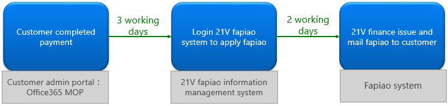
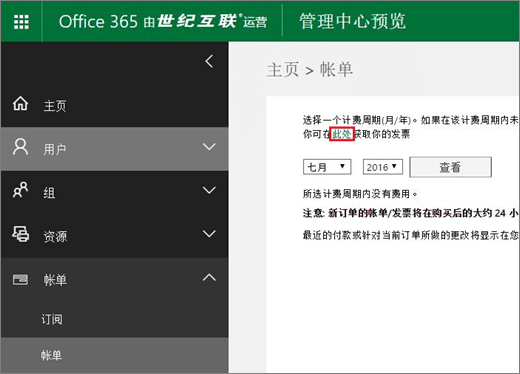
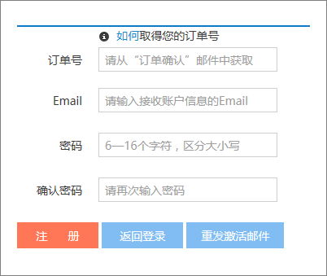

# Richiedere un Fapiao per Office 365 gestito da 21VianetApply for a Fapiao for Office 365 operated by 21Vianet

> [!NOTE]
> L'interfaccia di amministrazione sta cambiando.The admin center is changing. Se alcuni dettagli non corrispondono a quelli presentati qui, vedere [Informazioni sulla nuova interfaccia di amministrazione di Microsoft 365](../microsoft-365-admin-center-preview.md?preserve-view=true&view=o365-21vianet).If your experience doesn't match the details presented here, see [About the new Microsoft 365 admin center](../microsoft-365-admin-center-preview.md?preserve-view=true&view=o365-21vianet).

Puoi inviare la richiesta Fapiao al sistema di gestione 21Vianet Fapiao circa tre giorni dopo aver pagato.You can submit your Fapiao request to the 21Vianet Fapiao management system about three days after you have paid. Dopo aver inviato la richiesta Fapiao, questa verrà elaborata tra due giorni.After you submit your Fapiao request, it will be processed in two days.
  

  
## Passaggio 1: richiedere un FapiaoStep 1: Apply for a Fapiao

Esistono due modi per richiedere un Fapiao:There are two ways to apply for a Fapiao:
  
1. Dopo aver effettuato un pagamento nel sito Web Office 365 gestito da 21Vianet, si riceverà un messaggio di posta elettronica di conferma dell'ordine contenente il numero dell'ordine e un collegamento al sistema di gestione Fapiao.After making a payment in the Office 365 operated by 21Vianet website, you'll receive an order confirmation email that contains your order number and a link to the Fapiao management system. È possibile utilizzare il collegamento nel messaggio di posta elettronica per creare un account nel sistema di gestione delle informazioni <a href="https://go.microsoft.com/fwlink/p/?linkid=837466" target="_blank">21Vianet Fapiao.</a>You can use the link in the email to create an account in the <a href="https://go.microsoft.com/fwlink/p/?linkid=837466" target="_blank">21Vianet Fapiao information management system</a>.

    OppureOr

2. Puoi richiedere un Fapiao <a href="https://go.microsoft.com/fwlink/p/?linkid=850627" target="_blank">dall'interfaccia di amministrazione.</a>You can apply for a Fapiao from the <a href="https://go.microsoft.com/fwlink/p/?linkid=850627" target="_blank">admin center</a>.

    
  
## Passaggio 2: registrarsi con il sistema di gestione 21Vianet FapiaoStep 2: Register with the 21Vianet Fapiao management system

> [!NOTE]
> È possibile usare lo stesso nome di posta elettronica e la stessa password dell'account di Office 365 oppure è possibile usare qualcosa di diverso.You can use the same email name and password as your Office 365 account, or you can use something different.
  
1. Passare al sistema di gestione delle informazioni <a href="https://go.microsoft.com/fwlink/p/?linkid=837466" target="_blank">21Vianet Fapiao.</a>Go to the <a href="https://go.microsoft.com/fwlink/p/?linkid=837466" target="_blank">21Vianet Fapiao information management system</a>.

2. Nel modulo di registrazione immetti il numero dell'ordine, l'indirizzo e-mail e la password, quindi seleziona **Registrazione**.In the registration form, enter your order number, email address, and password, then select **Registration**.

    
  
3. Al termine della registrazione, il sistema invierà un messaggio di posta elettronica di attivazione all'indirizzo di posta elettronica.After your registration is complete, the system will send an activation email message to your email address. Aprire il messaggio di posta elettronica e selezionare il collegamento per attivare l'account.Open the email message and select the link to activate your account.

## Passaggio 3: inviare la fattura per un FapiaoStep 3: Submit your bill for a Fapiao

1. Accedere al sistema <a href="https://go.microsoft.com/fwlink/p/?linkid=837465" target="_blank">di gestione Fapiao.</a>Log in to the <a href="https://go.microsoft.com/fwlink/p/?linkid=837465" target="_blank">Fapiao management system</a>.

2. Seleziona il record di fatturazione, quindi seleziona **Applica fattura.**Select the billing record, then select **Apply bill**.

    > [!NOTE]
    > Il sistema di pagamento si trova su una piattaforma di terze parti e richiede tre giorni per sincronizzare l'ordine e il record di pagamento.The payment system is on a third-party platform and takes three days to synchronize the order and payment record.
  
    
  
3. Seleziona il tipo Fapiao, immetti le informazioni necessarie, quindi seleziona **Avanti.**Select the Fapiao type, enter the required information, then select **Next**.

    
  
    > [!NOTE]
    > - Per una normale partita IVA Fapiao, devi solo immettere il nome dell'acquirente.For a normal VAT Fapiao, you only need to enter the buyer's name.
    > - Se necessario, puoi richiedere un Fapiao con un titolo diverso.If necessary, you can apply for a Fapiao with different a title. Tuttavia, puoi applicare un solo titolo Fapiao per una fattura nel sistema.However, you can only apply one Fapiao title for one bill in the system. Se vuoi dividere Fapiao in diversi importi o titoli, invia la richiesta <a href="https://portal.partner.microsoftonline.cn/Support/SupportOverview.aspx" target="_blank">nell'interfaccia di amministrazione.</a>If you want to split the Fapiao into different amounts or titles, please <a href="https://portal.partner.microsoftonline.cn/Support/SupportOverview.aspx" target="_blank">submit your request in the admin center</a>.
    > - La volta successiva che ti candida per un Fapiao, il sistema presenta automaticamente le informazioni fapiao precedenti.The next time you apply for a Fapiao, the system automatically presents the previous Fapiao information.
    > - Se hai bisogno di un certificato di acquisto o di un rimborso, il nome del pagatore e il titolo Fapiao devono corrispondere.If you need a purchase certificate or a refund, the payer name and the Fapiao title must match.

4. Selezionare un metodo di spedizione e immettere le informazioni di spedizione.Select a shipping method and enter the mailing information. È possibile scegliere Yunda o SF (raccolta di merci).You can choose Yunda or SF (freight collect). Puoi anche andare al ramo 21Vianet di Shanghai per ottenere il Fapiao.You can also go to the 21Vianet Shanghai branch to get the Fapiao. selezionare **Avanti**.select **Next**.

    
  
    **Indirizzo della succursale di Shanghai 21Vianet:****21Vianet Shanghai branch company address:**

    Shanghai, Pudong New Area Keyuan Road No.Shanghai, Pudong New Area Keyuan Road No. 88, German Center, edificio 3, 65788, German Center, building 3, 657

    **Informazioni di contatto:****Contact information:**

    Zhu qin qin 021-28986102Zhu qin qin 021-28986102

5. Verificare che le informazioni siano corrette, quindi selezionare **Conferma**.Verify that the information is correct, then select **Confirm**.

    
  
## Passaggio 4: controllare lo stato dell'applicazioneStep 4: Check application progress

L'applicazione viene trasmessa automaticamente al Centro servizi 21Vianet e verrà completata in due giorni lavorativi.Your application is automatically transmitted to the 21Vianet Service Center, and will be completed in two working days.
  
Dopo aver inviato l'applicazione, puoi controllare lo stato in qualsiasi momento.After you submit the application, you can check the progress at any time. Aggiorneremo lo stato della tua applicazione con osservazioni come **Rilasciato** o **Inviato.**We will update the status of your application with remarks like **Issued** or **Mailed out**.
  

  
Quando Fapiao non è in uso, il sistema visualizza un avviso e indicherà il tempo previsto per emettere fapiao.When Fapiao is out of use, the system will display a notice, and will indicate the expected time to issue the Fapiao.
  

  
## Domande frequentiFAQs

### Quali servizi è possibile ottenere dal supporto online?What services can I get from online support?

Puoi controllare l'avanzamento della richiesta Fapiao e scoprire perché non hai ricevuto fapiao.You can check the progress of your Fapiao request, and find out why you haven't received the Fapiao.
  
Se vuoi cambiare il titolo fapiao, inviaci di nuovo Fapiao e ristamperemo il Fapiao.If you want to change the Fapiao title, please send the Fapiao back to us and we will reissue the Fapiao. È possibile inviare la richiesta tramite <a href="https://portal.partner.microsoftonline.cn/Support/SupportOverview.aspx" target="_blank">l'interfaccia di amministrazione.</a>You can submit the request through the <a href="https://portal.partner.microsoftonline.cn/Support/SupportOverview.aspx" target="_blank">admin center</a>.
  

  
### Come si modifica l'indirizzo di posta elettronica e la password di accesso?How do I change my login email address and password?

1. Accedi al sistema <a href="https://go.microsoft.com/fwlink/p/?linkid=837465" target="_blank">di gestione Fapiao,</a>quindi seleziona **Cambia indirizzo e-mail.**Log in to the <a href="https://go.microsoft.com/fwlink/p/?linkid=837465" target="_blank">Fapiao management system</a>, then select **Change email address**.

    
  
2. Se hai dimenticato la password di accesso, puoi usare l'indirizzo e-mail di accesso per reimpostare la password.If you forgot your login password, you can use your login email address to reset the password. Il sistema di gestione Fapiao invierà una nuova password all'indirizzo di posta elettronica.The Fapiao management system will send a new password to your email address. È possibile utilizzare la nuova password per eseguire l'accesso.You can use the new password to login.

    
  
3. Se si è dimenticato l'indirizzo di posta elettronica di accesso, contattare il servizio clienti 21Vianet al numero (86) 400-089-0365.If you forgot your login email address, please contact 21Vianet customer service at (86) 400-089-0365.

### Come si trova l'ID dell'ordine?How do I find my order ID?

1. [Nell'interfaccia di amministrazione](https://go.microsoft.com/fwlink/p/?linkid=850627)passare alla pagina **Fatturazione** \> **& pagamenti.**In the [admin center](https://go.microsoft.com/fwlink/p/?linkid=850627), go to the **Billing** \> **Bills & payments** page.

2. Trova la fattura desiderata, seleziona la visualizzazione o scegli di scaricare il PDF.Find the invoice you want, select to view, or choose to download the PDF.

### Cosa succede se si immette l'indirizzo di posta elettronica errato al momento della registrazione?What if I enter the wrong email address when I register?

Se si immette l'indirizzo di posta elettronica errato al momento della registrazione, non si riceverà il messaggio di posta elettronica di attivazione.If you enter the wrong email address when you register, you won't receive the activation email. Il collegamento di registrazione nel messaggio di posta elettronica scadrà automaticamente dopo 24 ore.The registration link in the email will automatically expire after 24 hours. È possibile tornare alla pagina <a href="https://go.microsoft.com/fwlink/p/?linkid=837466" target="_blank">di registrazione e</a> registrare di nuovo con l'indirizzo di posta elettronica corretto.You can return to the <a href="https://go.microsoft.com/fwlink/p/?linkid=837466" target="_blank">registration page</a> and register again with the correct email address.
  
### Cosa succede se non si riceve un messaggio di posta elettronica di attivazione?What if I don't receive an activation email?

Se non si riceve un messaggio di posta elettronica di attivazione dell'account entro 24 ore dalla registrazione, passare al sistema di gestione delle informazioni <a href="https://go.microsoft.com/fwlink/p/?linkid=837466" target="_blank">21Vianet Fapiao,</a>immettere l'indirizzo di posta elettronica, quindi selezionare Invia di nuovo il messaggio di posta elettronica di **attivazione.**If you don't receive an account activation email within 24 hours after you register, go to the <a href="https://go.microsoft.com/fwlink/p/?linkid=837466" target="_blank">21Vianet Fapiao information management system</a>, enter your email address, then select **Resend the activation email**. Il sistema invierà di nuovo il messaggio di posta elettronica di attivazione dell'account all'indirizzo di posta elettronica registrato.The system will resend the account activation email to your registered email address.
  

  
Se ancora non si riceve un messaggio di posta elettronica di attivazione, contattare il servizio clienti 21Vianet al numero (86) 400-089-0365.If you still don't receive an activation email, please contact 21Vianet customer service at (86) 400-089-0365.