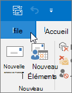

# Eseguire la migrazione di posta elettronica e contatti a Microsoft 365Migrate email and contacts to Microsoft 365

Importare o copiare la posta elettronica da Gmail o da un altro provider di posta elettronica a Microsoft 365.Import or copy email from Gmail or another email provider to Microsoft 365.
  
 **È possibile ottenere assistenza?****Want help with this?**  [Contattare il supporto tecnico Microsoft 365 for business](../contact-support-for-business-products.md) .[Contact Microsoft 365 for business support](../contact-support-for-business-products.md) . 
  
Per questa attività è necessaria una versione di Outlook installata nel desktop.You need to use a version of Outlook that is installed on your desktop for this task. Outlook è incluso nella maggior parte dei [piani](https://go.microsoft.com/fwlink/p/?LinkId=723731)di Microsoft 365.Outlook is included in most Microsoft 365 [plans](https://go.microsoft.com/fwlink/p/?LinkId=723731).
  
### Importare da GmailImport from Gmail

Seguire questa procedura per importare la posta elettronica, i contatti e il calendario da Gmail in Outlook con Microsoft 365:Follow these steps to import email, contacts, and calendar from Gmail into Outlook with Microsoft 365:
  
- [Importare la posta elettronica di Gmail in OutlookImport Gmail to Outlook](https://support.office.com/article/20fdb8f2-fed8-4b14-baf0-bf04b9c44bf7.aspx)
    
- [Importare contatti in OutlookImport contacts to Outlook](https://support.office.com/article/bb796340-b58a-46c1-90c7-b549b8f3c5f8.aspx)
    
- [Importare da Google CalendarImport Google Calendar](https://support.office.com/article/098ed60c-936b-41fb-83d6-7e3786437330)
    
> [!VIDEO https://www.microsoft.com/videoplayer/embed/c1e45708-9a92-475b-910b-f5aa40614d92?autoplay=false]
  
### Importare da Outlook (desktop)Import from Outlook (desktop)

Seguire questa procedura per esportare la posta elettronica, i contatti e i calendari da Outlook a un file. pst e quindi importare il file in Outlook con Microsoft 365:Follow these steps to export email, contacts and calendars from Outlook to a .pst file, and then import that file to Outlook with Microsoft 365:
  
1. [Esportare posta elettronica, contatti e calendarioExport email, contacts, and calendar](https://support.office.com/article/14252b52-3075-4e9b-be4e-ff9ef1068f91)
    
2. [Importare posta elettronica, contatti e calendarioImport mail, contacts, and calendar](https://support.office.com/article/431a8e9a-f99f-4d5f-ae48-ded54b3440ac)
    
Per importare solo i contatti, procedere come segue:If you just want contacts, follow these steps:
  
1. [Esportare i contatti da OutlookExport contacts from Outlook](https://support.office.com/article/10f09abd-643c-4495-bb80-543714eca73f.aspx)
    
2. [Importare contatti in OutlookImport contacts to Outlook](https://support.office.com/article/bb796340-b58a-46c1-90c7-b549b8f3c5f8.aspx)
    
To start the process, open Outlook and choose **File** \> **Open &amp; Export** \> **Import/Export**.To start the process, open Outlook and choose **File** \> **Open &amp; Export** \> **Import/Export**.
  

  
## Visualizzare gli altri account di posta elettronica in OutlookSee other email accounts in Outlook

Vuoi solo vedere la posta elettronica da un altro provider (come Gmail, Yahoo o Live.com) in Outlook?Just want to see your email from another provider (like Gmail, Yahoo, or Live.com) in Outlook? Non è necessario importare o migrare.No need to import or migrate. È possibile configurare Outlook o Outlook Web App in modo da poter accedere agli altri account dalla stessa posizione della cassetta postale di Microsoft 365 e inviare, ricevere e leggere messaggi di posta elettronica inviati a tali account.You can set up Outlook or Outlook Web App so you can access your other accounts from the same place as your Microsoft 365 mailbox and send, receive, and read email sent to those accounts.
  
### Outlook (desktop)Outlook (desktop)

Aggiungere un account, ad esempio l'account privato di Gmail, a Outlook.Add an account, such as your private Gmail account, to Outlook.
  
- Aprire Outlook, quindi passare a **File** \> **Aggiungi account**.Open Outlook, then go to **File** \> **Add account**.
    
Serve una procedura più dettagliata? Vedere [Aggiungere un account](https://support.office.com/article/6e27792a-9267-4aa4-8bb6-c84ef146101b).Need more detailed steps? See [Add an account](https://support.office.com/article/6e27792a-9267-4aa4-8bb6-c84ef146101b).
  

  
## Più cassette postali: gli amministratori possono importare in blocco la posta elettronica, i contatti e i calendari in Microsoft 365Multiple mailboxes: Admins can bulk import email, contacts, and calendars to Microsoft 365

A seconda del sistema di posta elettronica di origine, è possibile scegliere tra diversi metodi di migrazione in blocco.Depending on your source email system, you can choose from several bulk migration methods. Leggere [modi per eseguire la migrazione di più account di posta elettronica a Microsoft 365](https://docs.microsoft.com/Exchange/mailbox-migration/mailbox-migration) per decidere quale metodo può essere utilizzato per l'utente.Read [Ways to migrate multiple email accounts to Microsoft 365](https://docs.microsoft.com/Exchange/mailbox-migration/mailbox-migration) to decide which method works for you. 
  

