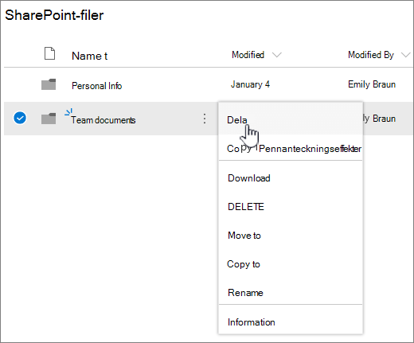
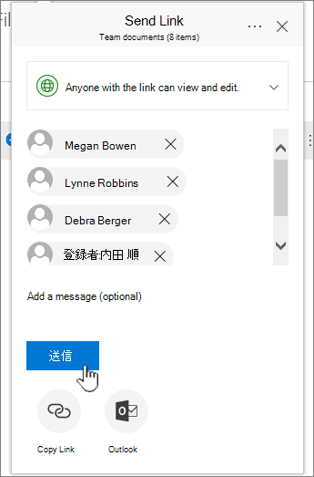
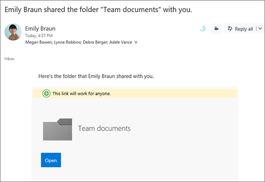
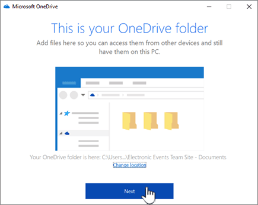
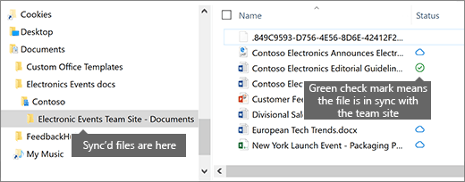

# Configurare l'archiviazione e la condivisione di file in Office 365

Uno dei modi migliori per configurare l'archiviazione e la condivisione dei file per la propria azienda consiste nell'utilizzare OneDrive e un sito del team insieme. Questa soluzione è ideale per le piccole aziende con pochi dipendenti.

Guardare un breve video sul percorso in cui archiviare i file in Office 365.  

> [!VIDEO https://www.microsoft.com/videoplayer/embed/RE1FTHX] 

Se il video è stato utile, consultare la [serie di formazione completa per piccole imprese e nuovi utenti di Microsoft 365](https://support.office.com/article/6ab4bbcd-79cf-4000-a0bd-d42ce4d12816).

## Dove archiviare i documenti in Office 365

- OneDrive è stato ideato per l'utilizzo individuale, con la condivisione occasionale dei file. 

- Un sito del team è stato creato per la condivisione e la collaborazione dei file regolarmente. Un sito del team è ideale per l'archiviazione di file che dispongono di proprietà condivisa in cui più utenti possiedono i file e che possono collaborare su di essi. Creare un team di Microsoft per aggiungere un sito del team. Per ulteriori informazioni, vedere [creare un team in](https://support.office.com/article/174adf5f-846b-4780-b765-de1a0a737e2b)teams.

Sia OneDrive che i siti del team offrono accesso da qualsiasi luogo all'utente e ai dipendenti.
  

  
Di seguito sono riportati alcuni suggerimenti su cosa archiviare in ogni percorso quando si utilizzano OneDrive e i siti del team:
  
||||
|:-----|:-----|:-----|
|**Posizione di archiviazione**   |**Scopo**   |**Cosa archiviare**   |
|**OneDrive**   |L'archiviazione del contenuto in OneDrive è simile all'archiviazione dei file nel computer in uso. nessun altro può accedervi facilmente.    Per altre informazioni, vedere [che cos'è OneDrive for business?](https://support.office.com/article/187f90af-056f-47c0-9656-cc0ddca7fdc2.aspx)   |File aziendali a cui gli altri membri del team non devono lavorare o accedere regolarmente.    |
|**Siti del team di SharePoint**   |Collaborazione. Quando si crea un gruppo di Office 365 (ad esempio, nell'interfaccia di amministrazione di Microsoft 365, in Outlook o creando un team in Microsoft Teams), viene creato un sito del team di SharePoint per tale gruppo. Analogamente, quando si crea un nuovo sito del team di SharePoint dalla Home page di SharePoint o dalla nuova interfaccia di amministrazione di SharePoint, viene creato anche un gruppo di Office 365. Per altre informazioni, vedere [che cos'è un sito del team di SharePoint](https://support.office.com/article/75545757-36c3-46a7-beed-0aaa74f0401e.aspx) e [creare un sito del team in SharePoint Online](https://support.office.com/article/ef10c1e7-15f3-42a3-98aa-b5972711777d.aspx).    |File che dispongono di proprietà condivisa. È consigliabile separare i siti del team per ogni unità di lavoro nell'organizzazione. Ad esempio, per mantenere il personale e i documenti finanziari privati in un team di piccole dimensioni, creare un sito del team separato.    |

> [!NOTE]
> SharePoint ha anche altri tipi di siti che è possibile utilizzare per la propria azienda. È possibile utilizzare i [siti di comunicazione](https://support.office.com/article/7fb44b20-a72f-4d2c-9173-fc8f59ba50eb.aspx) della rete Intranet per pubblicare le informazioni per un vasto gruppo di destinatari. È possibile utilizzare i [siti hub](https://support.office.com/article/fe26ae84-14b7-45b6-a6d1-948b3966427f.aspx) per connettere i siti della rete Intranet.
  
## Iniziare a utilizzare OneDrive e il sito del team

### I membri del team possono archiviare i propri file in OneDrive

Ogni persona dell'azienda che dispone di una licenza di Office 365 assegnata (e di SharePoint Online selezionata) ottiene lo spazio di archiviazione cloud di OneDrive. Sono in grado di archiviare i file correlati alle aziende per l'accesso da qualsiasi dispositivo e sono disponibili solo per l'utente. Si può ad esempio archiviare una bozza di proposta, le note di una riunione o il testo di una demo da presentare.
  
I dipendenti possono anche condividere file e cartelle di OneDrive. Se un dipendente è via o lascia la società, altri utenti possono accedere ai file condivisi archiviati in OneDrive.
  
Di seguito viene illustrato come ogni persona del team può configurare OneDrive e condividere file.

1. Accedere al <a href="https://portal.office.com/ " target="_blank">portale di Office 365</a>e accedere con il nome utente e la password.

2. Dall'icona di avvio delle app, selezionare **OneDrive**.

3. In OneDrive, i membri del team possono archiviare i propri file correlati alle attività aziendali. È possibile condividere singoli file o un'intera cartella. Selezionare un file o una cartella, fare clic con il pulsante destro del mouse e scegliere **Condividi**.

    
  
4. Nella pagina **Invia collegamento** , lasciare la selezione predefinita **tutti gli utenti con il collegamento possono visualizzarli e modificarli**.

    Digitare i nomi o gli indirizzi di posta elettronica dei membri del team a cui si desidera accedere alla cartella e aggiungere un messaggio facoltativo.

    Se si desidera che la propria copia del messaggio di posta elettronica venga inviata, aggiungere l'indirizzo di posta elettronica all'elenco.

    
  
5. Quando hai finito di immettere gli utenti con cui vuoi condividerlo, seleziona **Invia**. Il messaggio viene inviato immediatamente alle persone invitate.

    
  
6. Di seguito è riportato l'aspetto del messaggio di posta elettronica. 

    
  
### Caricare file in un sito del team per la collaborazione online

I siti del team sono dotati di una posizione in cui archiviare i file, denominati raccolta documenti.  
  
Di seguito sono riportati i passaggi per aggiungere file:
  
1. Nella Home page del sito del team scegliere **documenti** dal menu di spostamento a sinistra. Verrà visualizzata la **raccolta Documenti**.
  
2. Anche se si è ancora connessi a Office 365, aprire **Esplora file** di Windows dalla barra delle applicazioni o in un'altra posizione. Passare ai file da caricare nel sito del team.

3. Selezionare i file che si desidera caricare nel sito del team e trascinarli nella **raccolta documenti**.
  
4. Al termine, i file saranno archiviati sia nel sito del team che nel computer.
  
5. È possibile eliminare i file dal computer. Nel passaggio successivo, [sincronizzare i file online con il PC o il Mac](#sync-online-files-with-your-pc-or-mac), si creerà un nuovo percorso per questi file nel computer.

    Se si hanno molti file o file di grandi dimensioni da caricare nel sito del team, leggere questi suggerimenti sul [caricamento di molti file o di file di grandi dimensioni in una raccolta](https://support.office.com/article/da549fb1-1fcb-4167-87d0-4693e93cb7a0.aspx#__toc384119242).

    Se serve più spazio di archiviazione, vedere [Modificare lo spazio di archiviazione per l'abbonamento](../../commerce/add-storage-space.md).

### Sincronizzare i file online con il PC o il Mac

Ora che i file sono archiviati nel sito del team, è possibile impostarne la sincronizzazione con il PC o il Mac. In questo modo, è possibile lavorare sui file dal PC o dal Mac invece di lavorare in Microsoft Edge, Chrome o in un altro browser. Inoltre, è utile avere una versione dei file sincronizzata con il computer per le situazioni in cui è necessario accedere a un file ma manca la connessione Internet.
  
Dopo aver configurato i file per la sincronizzazione con il computer, quando si è connessi a Internet, verranno sincronizzati automaticamente.
  
Ecco come sincronizzare i file archiviati nel sito del team con il desktop:
  
1. Nella Home page del sito del team scegliere **documenti** dal menu di spostamento a sinistra. Questa operazione consente di visualizzare la raccolta documenti.

    > [!TIP]
    > Quando si sincronizzano i file nel sito del team, la sincronizzazione di ogni raccolta file nel sito non è l'intero sito.
  
2. Scegliere **Sync** per sincronizzare tutti i file. Oppure passare alla cartella specifica che si desidera sincronizzare.

3. Se viene richiesto di cambiare le app, scegliere **Sì**. OneDrive è il processo che esegue la sincronizzazione.
  
4. Se si riceve un prompt di **OneDrive set up** , accedere con l'account aziendale o dell'Istituto di istruzione.

    
  
5. Se non è stato ancora sincronizzato il OneDrive, è possibile che **venga visualizzato il seguente schermo della cartella OneDrive** . Controllare il percorso sotto **la cartella OneDrive**. Scegliere **Cambia percorso** se si desidera utilizzare un percorso diverso, quindi fare clic su **Avanti**.

    
  
6. I file nei siti del team verranno visualizzati nel riquadro sinistro di Esplora file sotto il nome dell'organizzazione. I file in OneDrive verranno visualizzati in "OneDrive- \<nome dell'organizzazione\>"

    
  
7. Verificare la sincronizzazione aprendo un file nella cartella del team nel computer in uso. Apportare una modifica e scegliere **Salva**.

## Procedure consigliate per l'archiviazione e condivisione di file

Di seguito vengono forniti alcuni suggerimenti per ottenere il massimo da OneDrive o dal sito del team di SharePoint.
  
### Suggerimenti sulla collaborazione e l'archiviazione di file per altri tipi di piccole aziende

- **Sole individuali**: utilizzare OneDrive per archiviare i propri file e condividerli con i clienti caso per caso.

- **Comproprietà**: entrambi i proprietari utilizzano OneDrive e condividono i file avanti e indietro.

- **Aziende con client o partner esterni che hanno necessità di accedere ai file**: creare un nuovo sito del team per archiviare e condividere documenti destinati a un cliente specifico. Configurare il sito in modo da consentire l'accesso solo al cliente. Non è quindi necessario preoccuparsi che un cliente ottenga accidentalmente accesso alle informazioni destinate a un altro cliente.

### Mantenere privati i file riservati

Quando si archivia un file in OneDrive, è possibile accedervi solo, a meno che non venga condiviso con altri utenti. Quando si condividono file, è possibile scegliere di creare un collegamento che può essere inoltrato o di condividere solo con persone specifiche. È anche possibile creare cartelle distinte in OneDrive per scopi diversi, ad esempio cartelle pubbliche, private o per singoli progetti. Ogni cartella può essere condivisa con una persona o un gruppo diverso oppure con nessuno.
  
Per ulteriori informazioni sulla condivisione, vedere anche [condivisione di file e cartelle con Office 365](https://support.office.com/article/72f26d6c-bf9e-432c-8b96-e3c2437f5b65.aspx).
  
### Tenere traccia dello spazio di archiviazione residuo

Per verificare la quantità di spazio di archiviazione disponibile in OneDrive, vedere [Manage your OneDrive for Business Storage](https://support.office.com/article/31519161-059C-4764-B6F8-F5CD29F7FE68.aspx).
  
### Quali file possono essere archiviati in OneDrive e in un sito del team?

Anche se è possibile caricare quasi tutti i tipi di file, non sono consentiti alcuni nomi di file e caratteri nei nomi dei file. Per altre informazioni, vedere [caratteri di file e tipi di file non validi in OneDrive for business](https://support.office.com/article/64883A5D-228E-48F5-B3D2-EB39E07630FA.aspx).
  
### Abilitare o disabilitare i servizi di archiviazione di terze parti

È possibile abilitare l'archiviazione di terze parti per gli utenti di Office 365 in modo che possano archiviare e condividere documenti utilizzando servizi quali Dropbox oltre a OneDrive e siti del team. Può essere un'ottima soluzione per fornire servizi che gli utenti stanno forse già usando o preferiscono usare per i progetti commerciali. Se non si desidera che gli utenti dell'organizzazione che utilizzano Office aprano i file in un servizio di terze parti, eseguire la procedura seguente per disattivarla.
  
> [!IMPORTANT]
> Lo spazio di archiviazione di terze parti è abilitato per impostazione predefinita, quindi è necessario eseguire questi passaggi subito se non si desidera che sia disponibile per gli utenti.
  
1. Accedere all'interfaccia di <a href="https://go.microsoft.com/fwlink/p/?linkid=2024339" target="_blank">Amministrazione</a>.

2. Passare alla pagina **** \> <a href="https://go.microsoft.com/fwlink/p/?linkid=2118715" target="_blank">Impostazioni</a> impostazioni.

3. Nella scheda **Servizi** selezionare **Office sul Web**.

4. Selezionare o deselezionare la casella di controllo per abilitare o disabilitare l'archiviazione di terze parti, quindi selezionare **Salva modifiche**.

## Passaggi successivi

- [Personalizzare il sito del team per l'archiviazione e la condivisione dei file](customize-team-site.md). Questa esercitazione dettagliata mostra come è possibile sfruttare ulteriori caratteristiche di archiviazione e collaborazione. 

- **Installare le app di Office su tablet e telefoni**. È necessario eseguire questa operazione in modo che sia possibile **modificare** i file archiviati in OneDrive e nei siti del team dal tablet o dal telefono. Se non si installano le app di Office per il tablet o il telefono, sarà possibile visualizzare i file ma non modificarli.

  - [Installare e configurare Office in un dispositivo Android con Office 365](https://support.office.com/article/cafe9d6f-8b0c-4b03-b20a-12438a82a22d.aspx)

  - [Installare e configurare Office in un iPhone o un iPad con Office 365](https://support.office.com/article/9df6d10c-7281-4671-8666-6ca8e339b628.aspx)

  - [Configurare Office in Windows Phone con Office 365](https://support.office.com/article/2b7c1b51-a717-45d6-90c9-ee1c1c5ee0b7.aspx)
