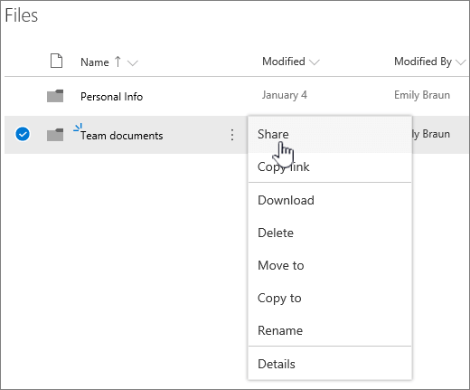

# Configurare l'archiviazione e la condivisione di file in Microsoft 365Set up file storage and sharing in Microsoft 365

Uno dei modi migliori per configurare l'archiviazione e la condivisione dei file per l'azienda è quello di usare OneDrive e un sito del team insieme.One of the best ways to set up file storage and sharing for your business is to use OneDrive and a team site together. Questa soluzione è ideale per le piccole aziende con pochi dipendenti.This is ideal if you have a small business with a few employees.

## Watch: Where to store files in Office 365Watch: Where to store files in Office 365

> [!VIDEO https://www.microsoft.com/videoplayer/embed/RE1FTHX] 

Se il video è stato utile, consultare la [serie dei corsi di formazione completa per piccole imprese e nuovi utenti di Microsoft 365](../../business-video/index.yml).If you found this video helpful, check out the [complete training series for small businesses and those new to Microsoft 365](../../business-video/index.yml).

## Microsoft 365 archiviazione e gestione dei documentiMicrosoft 365 document storage and management

- OneDrive è progettato per uso individuale, con la condivisione occasionale di file.OneDrive is designed for individual use, with the occasional sharing of files.

- Un sito del team è progettato per la condivisione e la collaborazione su file regolarmente.A team site is designed for sharing and collaborating on files regularly. Un sito del team è ideale per l'archiviazione di file con proprietà condivisa in cui più persone sono proprietarie dei file e potrebbero collaborare su di essi.A team site is ideal for storing files that have shared ownership where several people own the files and might collaborate on them. Creare un team Microsoft per aggiungere un sito del team.Create a Microsoft Team to add a team site. [Per ulteriori informazioni, vedere Creare un team in Teams](https://support.microsoft.com/office/174adf5f-846b-4780-b765-de1a0a737e2b).[Learn more at Create a team in Teams](https://support.microsoft.com/office/174adf5f-846b-4780-b765-de1a0a737e2b).

Sia i OneDrive che i siti del team forniscono l'accesso ovunque per te e i tuoi dipendenti.Both OneDrive and team sites provide anywhere access for you and your employees.
  

  
Ecco alcuni suggerimenti su cosa archiviare in ogni posizione quando si usano siti OneDrive team insieme:Here are recommendations for what to store in each location when you use OneDrive and team sites together: 

  
|Posizione di archiviazioneStorage location|A cosa si può fareWhat's it for|Cosa archiviareWhat to store here|
|:-----|:-----|:-----|
|**OneDrive****OneDrive** |Archiviare il contenuto OneDrive è come archiviare i file nel computer; nessun altro può accedervi facilmente.Storing content in OneDrive is like storing files on your computer; no one else can easily access them.  Per altre info, vedi [Che cos'è OneDrive for Business?](https://support.microsoft.com/office/187f90af-056f-47c0-9656-cc0ddca7fdc2)For more info, see [What is OneDrive for Business?](https://support.microsoft.com/office/187f90af-056f-47c0-9656-cc0ddca7fdc2)   |File aziendali a cui gli altri membri del team non devono lavorare o accedere regolarmente.Business files that other team members won't need to collaborate on or access regularly.  |
|**Siti del team di SharePoint****SharePoint team sites**   |Collaborazione.Collaboration. Quando si crea un gruppo di Microsoft 365, ad esempio nel interfaccia di amministrazione di Microsoft 365, in Outlook o creando un team in Microsoft Teams, viene creato un sito del team di SharePoint per tale gruppo.When you create a Microsoft 365 group (for example, in the Microsoft 365 admin center, in Outlook, or by creating a team in Microsoft Teams), a SharePoint team site is created for that group. Analogamente, quando si crea un nuovo sito del team di SharePoint dalla home page di SharePoint o dalla nuova interfaccia di amministrazione di SharePoint, viene creato anche un gruppo Microsoft 365.Likewise, when you create a new SharePoint team site from the SharePoint home page or from the new SharePoint admin center, it also creates a Microsoft 365 group. Per altre info, vedi [Che cos'è](https://support.microsoft.com/office/75545757-36c3-46a7-beed-0aaa74f0401e) un sito SharePoint team? e Creare un sito [del team in SharePoint Online.](https://support.microsoft.com/office/ef10c1e7-15f3-42a3-98aa-b5972711777d)For more info, see [What is a SharePoint team site?](https://support.microsoft.com/office/75545757-36c3-46a7-beed-0aaa74f0401e) and [Create a team site in SharePoint Online](https://support.microsoft.com/office/ef10c1e7-15f3-42a3-98aa-b5972711777d).    |File con proprietà condivisa.Files that have shared ownership. È consigliabile separare i siti del team per ogni unità di lavoro dell'organizzazione.We recommend separate team sites for each unit of work in your organization. Ad esempio, per mantenere privati il personale e i documenti finanziari per un team di piccole dimensioni, creare un sito del team separato.For example, to keep personnel and financial documents private to a small team, create a separate team site.    |

> [!NOTE]
> SharePoint sono disponibili anche altri tipi di siti che è possibile utilizzare per la propria azienda.SharePoint also has other types of sites you can use for your business. È possibile utilizzare [i siti di comunicazione](https://support.microsoft.com/office/7fb44b20-a72f-4d2c-9173-fc8f59ba50eb) nella rete Intranet per pubblicare informazioni per un pubblico ampio.You can use [communication sites](https://support.microsoft.com/office/7fb44b20-a72f-4d2c-9173-fc8f59ba50eb) in your intranet to publish information for a broad audience. È inoltre possibile utilizzare i [siti hub](https://support.microsoft.com/office/fe26ae84-14b7-45b6-a6d1-948b3966427f) per connettere i siti nella rete Intranet.And you can use [hub sites](https://support.microsoft.com/office/fe26ae84-14b7-45b6-a6d1-948b3966427f) to connect sites in your intranet.
  
## Iniziare a usare OneDrive e il sito del teamStart using OneDrive and your team site

### I membri del team possono archiviare i propri file in OneDriveTeam members can store their own files in OneDrive

Ogni persona dell'azienda a cui è assegnata Microsoft 365 licenza (e SharePoint Online) ottiene OneDrive'archiviazione cloud.Each person in your business who has a Microsoft 365 license assigned (and SharePoint Online selected) gets OneDrive cloud storage. Possono archiviare qui i file correlati all'azienda per l'accesso da qualsiasi dispositivo e sono disponibili solo per tale utente.They can store business-related files here for access from any device, and they are only available to that user. Si può ad esempio archiviare una bozza di proposta, le note di una riunione o il testo di una demo da presentare.For example, they might store a draft proposal, their meeting notes, or the script for a demo they're going to deliver.
  
I dipendenti possono anche condividere OneDrive file e cartelle.Employees can also share OneDrive files and folders. Se un dipendente è fuori sede o lascia l'azienda, altri utenti possono accedere ai file condivisi archiviati in OneDrive (OneDrive condivisione delle cartelle del team).If an employee is away or leaves the company, others can access shared files stored in OneDrive (OneDrive team folder sharing).
  
Ecco come ogni persona del team può configurare OneDrive e condividere file.Here's how each person on your team can set up OneDrive and share files.

1. Passare al <a href="https://admin.mirosoft.com/ " target="_blank">interfaccia di amministrazione di Microsoft 365</a>e accedere con il nome utente e la password.Go to the <a href="https://admin.mirosoft.com/ " target="_blank">Microsoft 365 admin center</a>, and sign in with your user name and password.

2. Nell'icona di avvio delle app seleziona **OneDrive**.From the App launcher, select **OneDrive**.

3. In OneDrive, i membri del team possono archiviare i propri file correlati all'azienda.In OneDrive, team members can store their own business-related files. È possibile condividere singoli file o un'intera cartella.You can share either individual files, or a whole folder. Selezionare un file o una cartella, fare clic con il pulsante destro del mouse e scegliere **Condividi**.Pick a file or folder, right-click, and then choose **Share**.

    
  
4. Nella pagina **Invia collegamento** lasciare la selezione predefinita Chiunque abbia il collegamento può visualizzare **e modificare**.On the **Send Link** page, leave the default selection **Anyone with the link can view and edit**.

    Digitare i nomi o gli indirizzi di posta elettronica dei membri del team a cui si desidera accedere alla cartella e aggiungere un messaggio facoltativo.Type names or email addresses of team members who you want to have access to the folder, and add an optional message.

    Se si desidera che la propria copia del messaggio di posta elettronica che verrà inviato, aggiungere l'indirizzo di posta elettronica all'elenco.If you want your own copy of the email that will be sent, add your email address to the list.

    
  
5. Dopo aver immesso con chi si desidera condividere, selezionare **Invia**.When you're done entering who you want to share with, select **Send**. Il messaggio viene inviato immediatamente alle persone invitate.The email is immediately sent to the people you invite.

    
  
6. Ecco l'aspetto del messaggio di posta elettronica.Here's what the email looks like. 

    
  
### Upload file in un sito del team per la collaborazione onlineUpload files to a team site for online collaboration

I siti del team sono in grado di archiviare i file, denominati raccolta documenti.Team sites come with a place to store files, called a document library.  
  
Ecco la procedura per aggiungere i file:Here are the steps to add files:
  
1. Nella home page del sito del team scegliere **Documenti** dal menu di spostamento a sinistra.On the home page of your team site, choose **Documents** from the left-hand navigation menu. Verrà visualizzata la **raccolta Documenti**.This will take you to your **Documents library**.
  
2. Mentre hai ancora eseguito l'accesso a Microsoft 365, apri Esplora Windows **file** dalla barra delle applicazioni o da un'altra posizione.While you're still signed in to Microsoft 365, open Windows **File Explorer** from your taskbar or other location. Passare ai file da caricare nel sito del team.Go to the files you want to upload to your team site.

3. Selezionare i file che si desidera caricare nel sito del team e quindi trascinarli nella **raccolta documenti.**Select the files you want to upload to your team site, and then drag them to the **Document library**.
  
4. Al termine, i file saranno archiviati sia nel sito del team che nel computer.When you're done, the files will be stored in both your team site and your computer.
  
5. È possibile eliminare i file dal computer.You can delete the files from your computer. Nel passaggio successivo, Sincronizza i file online con il PC o [il Mac,](#sync-online-files-with-your-pc-or-mac)creerai un nuovo percorso per questi file nel computer.In the next step, [Sync online files with your PC or Mac](#sync-online-files-with-your-pc-or-mac), you're going to create a new location for these files on your computer.

    Se si dispone di numerosi file o file di grandi dimensioni da caricare nel sito del team, leggere questi suggerimenti sul caricamento di file di grandi dimensioni [o molti in una raccolta.](https://support.microsoft.com/office/da549fb1-1fcb-4167-87d0-4693e93cb7a0#__toc384119242)If you have numerous files or large files to upload to your team site, read these tips on [uploading large or many files to a library](https://support.microsoft.com/office/da549fb1-1fcb-4167-87d0-4693e93cb7a0#__toc384119242).

    Se serve più spazio di archiviazione, vedere [Modificare lo spazio di archiviazione per l'abbonamento](../../commerce/add-storage-space.md).If you need more storage space, see [Change storage space for your subscription](../../commerce/add-storage-space.md).

### Sincronizzare i file online con il PC o il MacSync online files with your PC or Mac

Ora che i file sono archiviati nel sito del team, è possibile impostarne la sincronizzazione con il PC o il Mac.Now that you have files on your team site, you can set them up to sync with your PC or Mac. In questo modo, puoi lavorare sui file dal PC o dal Mac invece di usare Microsoft Edge, Chrome o un altro browser.This way, you can work on your files from your PC or Mac instead of working in Microsoft Edge, Chrome, or another browser. Inoltre, è utile avere una versione dei file sincronizzata con il computer per le situazioni in cui è necessario accedere a un file ma manca la connessione Internet.It's also useful to have a version of your files synced on your computer for situations when you need to get to a file and you aren't connected to the Internet.
  
Dopo aver configurato i file per la sincronizzazione con il computer, quando si è connessi a Internet, questi verranno sincronizzati automaticamente.After you set up files to sync with your computer, when you're connected to the Internet, they'll be synchronized automatically.
  
Ecco come sincronizzare i file archiviati nel sito del team con il desktop:Here's how to synchronize files on your team site with your desktop:
  
1. Nella home page del sito del team scegliere **Documenti** dal menu di spostamento a sinistra.On the home page of your team site, choose **Documents** from the left-hand navigation menu. Verrà quindi possibile accedere alla raccolta Documenti.This takes you to your Documents library.

    > [!TIP]
    > Durante la sincronizzazione dei file nel sito del team, si sincronizza ogni raccolta file nel sito, non l'intero sito.When syncing files on your team site, you're syncing each file library on the site, not the entire site.
  
2. Scegliere **Sincronizza** per sincronizzare tutti i file.Choose **Sync** to synchronize all the files. Oppure passare alla cartella specifica che si desidera sincronizzare.Or browse to the specific folder you want to sync.

3. Se viene richiesto di cambiare app, scegliere **Sì.**If prompted to switch apps, choose **Yes**. OneDrive è il processo che effettua la sincronizzazione.OneDrive is the process doing the synchronization.
  
4. Se viene visualizzato un prompt **Configura OneDrive,** accedere con l'account aziendale o dell'istituto di istruzione.If you then get a **Set up OneDrive** prompt, sign in with your work or school account.

    
  
5. Se non hai ancora sincronizzato il tuo OneDrive, potresti visualizzare la schermata Questa è la tua OneDrive **cartella.**If you haven't yet synced your OneDrive, you might see a **This is your OneDrive folder** screen. Controllare il percorso in **La cartella OneDrive è qui**.Check the path under **Your OneDrive folder is here**. Scegliere **Cambia percorso** se si desidera utilizzare un percorso diverso e quindi selezionare **Avanti.**Choose **Change Location** if you want to use a different path, and then select **Next**.

    
  
6. I file nei siti del team verranno visualizzati nel riquadro sinistro di Esplora file sotto il nome dell'organizzazione.The files in your team sites will appear in the left pane of File Explorer under the name of your organization. I file in OneDrive verranno visualizzati in "OneDrive - \<Name of Organization\> "The files in OneDrive will appear under "OneDrive - \<Name of Organization\>"

    
  
7. Testare la sincronizzazione aprendo un file nella cartella del team nel computer.Test the synchronization by opening a file in the team's folder on your computer. Apportare una modifica e scegliere **Salva**.Make a change, and then choose **Save**.

## Procedure consigliate per l'archiviazione e condivisione di fileBest practices for file storage and sharing

Ecco alcuni suggerimenti per ottenere il massimo da OneDrive o dal sito SharePoint team.Here are a few tips for getting the most from OneDrive or your SharePoint team site.
  
### Suggerimenti sulla collaborazione e l'archiviazione di file per altri tipi di piccole aziendeFile storage and collaboration recommendations for other types of small businesses

- **Proprietà individuali:** utilizzare OneDrive per archiviare i propri file e condividerli con i clienti caso per caso.**Sole proprietorships**: Use OneDrive to store your own files and share them with customers on a case-by-case basis.

- **Coproprietà:** entrambi i proprietari usano OneDrive e condividono file avanti e indietro.**Co-ownerships**: Both owners use OneDrive and share files back and forth.

- **Aziende con clienti esterni o partner** che necessitano dell'accesso ai file: creare un nuovo sito del team per archiviare e condividere documenti destinati a un cliente specifico.**Businesses with external clients or partners who need access to files**: Create a new team site to store and share documents intended for a specific customer. Configurare il sito per consentire l'accesso solo a tale cliente.Set up the site to allow access to only that customer. Non è quindi necessario preoccuparsi che un cliente otterrà accidentalmente l'accesso alle informazioni destinate a un altro cliente.You then don't need to worry that one customer will accidentally get access to information intended for another customer.

### Mantenere privati i file riservatiKeep private files private

Quando archivi un file in OneDrive è accessibile solo dall'utente, a meno che non lo condividi con altri utenti.When you store a file in OneDrive it's only accessible by you, unless you share it with others. Quando si condividono file, è possibile scegliere di creare un collegamento che può essere inoltrato o di condividere solo con persone specifiche.When you share files, you can choose to create a link that can be forwarded, or to share with only specific people. È anche possibile creare cartelle distinte in OneDrive per scopi diversi, ad esempio cartelle pubbliche, private o per singoli progetti.You can also create separate folders in OneDrive for different purposes such as public, personal, or for individual projects. Ogni cartella può essere condivisa con una persona o un gruppo diverso oppure con nessuno.Each folder can be shared with a different person or group, or nobody else at all.
  
Per ulteriori informazioni sulla condivisione, vedere Condividere file e cartelle [con Microsoft 365](https://support.microsoft.com/office/72f26d6c-bf9e-432c-8b96-e3c2437f5b65).For more information on sharing, also see [Share files and folders with Microsoft 365](https://support.microsoft.com/office/72f26d6c-bf9e-432c-8b96-e3c2437f5b65).
  
### Tenere traccia dello spazio di archiviazione residuoTrack how much space you have left

Per sapere quanto spazio di archiviazione è rimasto in OneDrive, vedere [Manage your OneDrive for Business storage](https://support.microsoft.com/office/31519161-059C-4764-B6F8-F5CD29F7FE68).To see how much storage space you have left in OneDrive, see [Manage your OneDrive for Business storage](https://support.microsoft.com/office/31519161-059C-4764-B6F8-F5CD29F7FE68).
  
### Quali file possono essere archiviati in OneDrive sito del team?What files can be stored in OneDrive and a team site?

Sebbene sia possibile caricare quasi tutti i tipi di file, alcuni nomi di file e caratteri nei nomi di file non sono consentiti.While you can upload almost all types of files, some file names and characters in file names aren't allowed. Per altre info, vedi Caratteri e tipi di file non validi [in OneDrive for Business.](https://support.microsoft.com/office/64883A5D-228E-48F5-B3D2-EB39E07630FA)For more info, see [Invalid file characters and file types in OneDrive for Business](https://support.microsoft.com/office/64883A5D-228E-48F5-B3D2-EB39E07630FA).
  
### Abilitare o disabilitare i servizi di archiviazione di terze partiEnable or disable third-party storage services

È possibile abilitare l'archiviazione di terze parti per gli utenti in Microsoft 365 in modo che possano archiviare e condividere documenti utilizzando servizi come Dropbox oltre a siti OneDrive e del team.You can enable third-party storage for your users in Microsoft 365 so they can store and share documents using services like Dropbox in addition to OneDrive and team sites. Può essere un'ottima soluzione per fornire servizi che gli utenti stanno forse già usando o preferiscono usare per i progetti commerciali.This can be a great way to provide services that your users may already be using or prefer to use for business projects. Se non si desidera che gli utenti dell'organizzazione Office aprire i file in un servizio di terze parti, eseguire la procedura seguente per disattivarlo.If you don't want people in your organization using Office to open files in a third-party service, follow these steps to turn it off.
  
> [!IMPORTANT]
> L'archiviazione di terze parti è abilitata per impostazione predefinita, quindi è necessario eseguire subito questi passaggi se non si desidera che sia disponibile per gli utenti.Third-party storage is enabled by default so you need to perform these steps right away if you don't want it available to your users.
  
1. Accedere <a href="https://go.microsoft.com/fwlink/p/?linkid=2024339" target="_blank">all'interfaccia di amministrazione</a>.Sign in to to the <a href="https://go.microsoft.com/fwlink/p/?linkid=2024339" target="_blank">admin center</a>.

2. Passare alla pagina **Impostazioni** \> <a href="https://go.microsoft.com/fwlink/p/?linkid=2053743" target="_blank">**impostazioni dell'organizzazione.**</a>Go to the **Settings** \> <a href="https://go.microsoft.com/fwlink/p/?linkid=2053743" target="_blank">**Org settings**</a> page.

3. Nella scheda **Servizi** selezionare **Office sul web**.On the **Services** tab, select **Office on the web**.

4. Selezionare o deselezionare la casella di controllo per attivare o disattivare l'archiviazione di terze parti, quindi selezionare **Salva modifiche.**Select or deselect the check box to turn third-party storage on or off, then select **Save changes**.

## Passaggi successiviNext steps

- [Personalizzare il sito del team per l'archiviazione e la condivisione di file](customize-team-site.md).[Customize your team site for file storage and sharing](customize-team-site.md). Questa esercitazione dettagliata mostra come è possibile sfruttare ulteriori caratteristiche di archiviazione e collaborazione.This step-by-step tutorial shows you how to you can take advantage of more storage and collaboration features.

- **Installare le app di Office su tablet e telefoni**.**Set up Office apps on your tablets and phones.** È necessario eseguire questa operazione in modo da poter **modificare** i file archiviati in OneDrive e nei siti del team dal tablet o dal telefono.You need to do this so you can **edit** files that are stored in OneDrive and on team sites from your tablet or phone. Se non installi le app Office per il tablet o il telefono, potrai visualizzare i file ma non modificarli.If you don't install the Office apps for your tablet or phone, you'll be able to view the files but not edit them.

  - [Installare e configurare Office su un dispositivo Android con Microsoft 365Install and set up Office on an Android with Microsoft 365](https://support.microsoft.com/office/cafe9d6f-8b0c-4b03-b20a-12438a82a22d)

  - [Installare e configurare Office in un iPhone o iPad con Microsoft 365Install and set up Office on an iPhone or iPad with Microsoft 365](https://support.microsoft.com/office/9df6d10c-7281-4671-8666-6ca8e339b628)

  - [Configurare Office in Windows Phone con Microsoft 365Set up Office on Windows Phone with Microsoft 365](https://support.microsoft.com/office/2b7c1b51-a717-45d6-90c9-ee1c1c5ee0b7)

## Contenuto correlatoRelated content

[Aggiungere spazio di archiviazione per la sottoscrizione](../../commerce/add-storage-space.md) (articolo)[Add storage space for your subscription](../../commerce/add-storage-space.md) (article)\
[Condividere file e cartelle con Microsoft 365 Business](https://support.microsoft.com/office/share-files-and-folders-with-microsoft-365-business-72f26d6c-bf9e-432c-8b96-e3c2437f5b65) (video)[Share files and folders with Microsoft 365 Business](https://support.microsoft.com/office/share-files-and-folders-with-microsoft-365-business-72f26d6c-bf9e-432c-8b96-e3c2437f5b65) (video)\
[Personalizzare il sito del team per l'archiviazione e la condivisione di file](customize-team-site.md) (articolo)[Customize your team site for file storage and sharing](customize-team-site.md) (article)