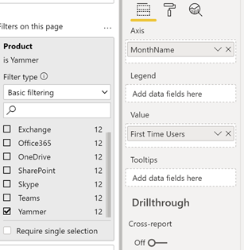
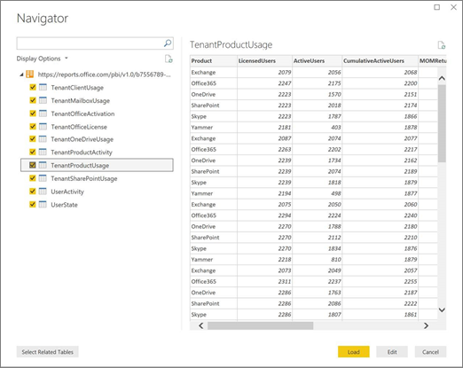

# Personalizzare i report nell'Microsoft 365 di utilizzo

Microsoft 365'analisi dell'utilizzo fornisce un dashboard in Power BI che offre informazioni dettagliate su come gli utenti adottano e usano Microsoft 365. Il dashboard è solo un punto di partenza per interagire con i dati di utilizzo. Le informazioni contenute nei report possono essere personalizzate.

È anche possibile usare Power BI Desktop per personalizzare ulteriormente i report collegandoli ad altre origini dati per ricavare informazioni utili e più complete sull'attività aziendale.

## Personalizzazione dei report nel browser

I due esempi seguenti illustrano come modificare un oggetto visivo esistente e come creare un nuovo oggetto visivo.

### Modificare un oggetto visivo esistente

In questo esempio viene illustrato come modificare la **scheda Attivazione** nel report **Attivazione/gestione** licenze.

1. All'interno del report **Attivazione/licenza** seleziona la **scheda** Attivazione.

2. Per accedere alla modalità  di modifica, scegliere il pulsante Modifica nella parte superiore del pulsante Altro  pulsante.

    

3. In alto a destra scegliere **Duplica questa pagina.**

    

4. In basso a destra scegli uno dei grafici a barre che mostrano il numero di utenti che si attivano in base al sistema operativo, ad esempio Android, iOS, Mac e così via.

5. Nell'area **Visualizzazioni** a destra, per rimuovere **Mac Count** dall'oggetto visivo, seleziona la **X** accanto ad esso.

    

### Creare un nuovo oggetto visivo

L'esempio seguente illustra come creare un nuovo oggetto visivo per tenere traccia di nuovi utenti di Yammer su base mensile.

1. Vai al **report Utilizzo prodotti** usando il riquadro di spostamento a sinistra e seleziona la **Yammer** scheda.

2. Passare alla modalità di modifica scegliendo  **Modifica**.

3. Nella parte inferiore della pagina, selezionare la casella di controllo  per creare una nuova pagina.

4. Nell'area **Visualizzazioni** a destra scegliere il grafico a **barre** in pila (riga superiore, prima da sinistra).

    

5. Selezionare la parte inferiore destra della visualizzazione e trascinarla per ingrandirla.

6. **Nell'area** Campi a destra espandere la **tabella** Calendario.

7. Trascinare **MonthName** nell'area campi, direttamente sotto l'intestazione **Asse** nell'area **Visualizzazioni**.

    

8. Nell'area **Campi** a destra espandere la tabella **TenantProductUsage**.

9. Trascinare **FirstTimeUsers** nell'area campi, direttamente sotto l'intestazione **Valore**.

10. Trascinare **Prodotto** nell'area **Filtri**, direttamente sotto l'intestazione **Filtri a livello di oggetto visivo**.

11. Nell'area **Tipo di filtro** che viene visualizzata, selezionare la casella di controllo **Yammer**.

    

12. Appena sotto l'elenco delle visualizzazioni, scegliere **l'icona** Formato icona Formato  .

13. Espandere Titolo e cambiare il valore **Testo titolo** in **Nuovi utenti di Yammer per mese**.

14. Cambiare il valore **Dimensione testo** in **12**.

15. Modificare il titolo della nuova pagina modificando il nome della pagina in basso a destra.

16. Salvare il report facendo clic su **Visualizzazione di lettura** in alto e quindi su **Salva.**

## Personalizzazione dei report in Power BI Desktop

Per la maggior parte dei clienti è sufficiente modificare i report e gli oggetti visivi grafico in Power BI sul Web. Per alcuni, tuttavia, potrebbe essere necessario unire questi dati con altre origini dati per ricavare informazioni utili e più complete relative al contesto della propria azienda, nel qual caso è possibile personalizzare e creare report aggiuntivi con Power BI Desktop. È possibile scaricare [Power BI Desktop](https://go.microsoft.com/fwlink/p/?linkid=849797) gratis.

### Usare le API Reporting

Puoi iniziare connettendoti direttamente alle API di report ODATA da Microsoft 365 che generano questi report.

1. Passare a **Recupera dati** \> **Altro** \> **Feed OData** \> **Connetti**.

2. Nella finestra URL immettere "https:// <i></i> \<tenantid\> reports.office.com/pbi/v1.0/"

    **NOTA:** Le API per i report sono in anteprima e sono soggette a modifiche fino a quando non vengono in produzione.

    

3. Immettere le credenziali Microsoft 365 (organizzazione o istituto di istruzione) per eseguire l'autenticazione Microsoft 365 quando richiesto.

    Vedi le [domande frequenti](usage-analytics.md#faq) per altre informazioni su chi è autorizzato ad accedere ai Microsoft 365 report dell'app modello Adozione.

4. Dopo aver autorizzato la connessione, viene visualizzata la finestra Strumento di navigazione che mostra i set di dati disponibili a cui connettersi.

    Selezionare tutto e scegliere **Carica**.

    I dati verranno in Power BI Desktop. Salvare questo file per iniziare a creare i report necessari.

    

### Usare il modello Microsoft 365 di analisi dei dati di utilizzo

È inoltre possibile utilizzare il file Power BI modello che corrisponde ai report di analisi di utilizzo di Microsoft 365 come punto di partenza per connettersi ai dati. Il vantaggio di usare il file PBIT è che ha la stringa di connessione già stabilita. È anche possibile sfruttare tutte le misure personalizzate create, oltre ai dati che lo schema di base restituisce, usandole come base di sviluppo.

È possibile scaricare il file Power BI modello [dall'Area download Microsoft.](https://download.microsoft.com/download/7/8/2/782ba8a7-8d89-4958-a315-dab04c3b620c/Microsoft%20365%20Usage%20Analytics.pbit) Dopo aver scaricato il file Power BI modello, segui questi passaggi per iniziare:

1. Aprire il file PBIT.

2. Immettere il valore dell'ID tenant nella finestra di dialogo.

    

3. Immetti le credenziali di amministratore per l'autenticazione Microsoft 365 quando richiesto.

     per ulteriori informazioni sugli utenti autorizzati ad accedere ai report di analisi Microsoft 365 di utilizzo.

    Una volta ottenuta l'autorizzazione, i dati verranno aggiornati nel file di Power BI.

    Il caricamento dei dati può richiedere del tempo, ma al termine è possibile salvare il file PBIX e continuare a personalizzare i report o importare un'origine dati aggiuntiva nel report.

4. Per comprendere come creare i report, pubblicarli nel servizio Power BI e condividerli con l'organizzazione, vedere [Introduzione a Power BI](/power-bi/fundamentals/desktop-getting-started). Se si segue questo percorso per la personalizzazione e la condivisione potrebbero essere necessarie altre licenze di Power BI. Per altre informazioni vedere le [indicazioni sulle licenze](https://go.microsoft.com/fwlink/p/?linkid=849803).
