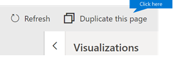

# Personalizzare i report nell'analisi dell'utilizzo di Microsoft 365Customize the reports in Microsoft 365 usage analytics

::: moniker range="o365-21vianet"

> [!NOTE]
> L'interfaccia di amministrazione cambia.The admin center is changing. Se l'esperienza non corrisponde ai dettagli presentati, vedere [About The New Microsoft 365 Admin Center](https://docs.microsoft.com/microsoft-365/admin/microsoft-365-admin-center-preview?view=o365-21vianet).If your experience doesn't match the details presented here, see [About the new Microsoft 365 admin center](https://docs.microsoft.com/microsoft-365/admin/microsoft-365-admin-center-preview?view=o365-21vianet).

::: moniker-end

Microsoft 365 Usage Analytics fornisce un dashboard in Power BI che offre informazioni su come gli utenti adottano e utilizzano Microsoft 365.Microsoft 365 usage analytics provides a dashboard in Power BI that offers insights into how users adopt and use Microsoft 365. Il dashboard è solo un punto di partenza per interagire con i dati di utilizzo.The dashboard is just a starting point to interact with the usage data. Le informazioni contenute nei report possono essere personalizzate.The reports can be customized for more personalized insights.
  
È anche possibile usare Power BI Desktop per personalizzare ulteriormente i report collegandoli ad altre origini dati per ricavare informazioni utili e più complete sull'attività aziendale.You can also use the Power BI desktop to further customize your reports by connecting them to other data sources to gain richer insights about your business.
  
## Personalizzazione dei report nel browserCustomizing reports in the browser

I due esempi seguenti illustrano come modificare un oggetto visivo esistente e come creare un nuovo oggetto visivo.The following two examples show how to modify an existing visual and how to create a new visual.
  
### Modificare un oggetto visivo esistenteModify an existing visual

In questo esempio viene illustrato come modificare la scheda **attivazione** all'interno del rapporto di **attivazione/gestione licenze** .This example shows how to modify the **Activation** tab within the **Activation/Licensing** report. 
  
1. All'interno del rapporto di **attivazione/gestione delle licenze** , fare clic sulla scheda **attivazione** .Within the **Activation/Licensing** report, click on the **Activation** tab.
    
2. Immettere la modalità di modifica facendo clic sul pulsante **modifica** nella parte superiore tramite  bi.Enter the edit mode by clicking the **Edit** button on the top through the  button. 
    
    
  
3. In alto a destra, fare clic su **Duplica questa pagina**.On the top right, click **Duplicate this page**.
    
    
  
4. In basso a destra, fare clic su uno dei grafici a barre che mostra il numero di utenti che si attivano in base al sistema operativo, ad esempio Android, iOS, Mac e così via.In the bottom right, click on any of the bar charts showing the count of users activating based on the OS such as Android, iOS, Mac, etc.
    
5. Nell'area **visualizzazioni** a destra, per rimuovere **Mac count** dall'elemento visivo, fare clic sulla **X** accanto ad essa.In the **Visualizations** area to the right, in order to remove **Mac Count** from the visual, click on the **X** next to it.

        
    
### Creare un nuovo oggetto visivoCreate a new visual

L'esempio seguente illustra come creare un nuovo oggetto visivo per tenere traccia di nuovi utenti di Yammer su base mensile.The following example shows how to create a new visual to track new Yammer users on monthly basis.
  
1. Accedere al report **sull'utilizzo del prodotto** usando il NAV sinistro e fare clic sulla scheda **Yammer** .Go to the **Product Usage** report using the left nav and click on **Yammer** tab.
    
2. Passare alla modalità di modifica facendo clic  e **modifica**.Switch to edit mode by clicking on  and **Edit**. 
    
3. Nella parte inferiore della pagina, fare clic suAt the bottom of the page, click on  per creare una nuova pagina.to create a new page.
  
4. Nell'area **visualizzazioni** a destra fare clic sul **grafico a barre in pila** (riga superiore, primo da sinistra).In the **Visualizations** area to the right, click the **Stacked bar chart** (top row, first from left).

    
    
5. Fare clic sull'angolo inferiore destro della visualizzazione e trascinarla per ingrandirla.Click the bottom right of that visualization and drag to make it larger.

6. Nell'area **campi** a destra espandere la tabella **Calendario** .In the **Fields** area to the right, expand the **Calendar** table.

7. Trascinare **MonthName** nell'area campi, direttamente sotto l'intestazione **Asse** nell'area **Visualizzazioni**.Drag **MonthName** to the fields area, directly below the **Axis** heading in the **Visualizations** area.
 
    
    
8. Nell'area **Campi** a destra espandere la tabella **TenantProductUsage**.In the **Fields** area to the right, expand the **TenantProductUsage** table.

9. Trascinare **FirstTimeUsers** nell'area campi, direttamente sotto l'intestazione **Valore**.Drag **FirstTimeUsers** to the fields area, directly below the **Value** heading.

10. Trascinare **Prodotto** nell'area **Filtri**, direttamente sotto l'intestazione **Filtri a livello di oggetto visivo**.Drag **Product** to the **Filters** area, directly below the **Visual level filters** heading.

11. Nell'area **Tipo di filtro** che viene visualizzata, selezionare la casella di controllo **Yammer**.In the **Filter Type** area that appears, select the **Yammer** check box.

    
  
12. Appena sotto l'elenco delle visualizzazioni, fare clic sull' **icona formato formato icona** .Just below the list of visualizations, click the **Format** icon .

13. Espandere Titolo e cambiare il valore **Testo titolo** in **Nuovi utenti di Yammer per mese**.Expand Title and change the **Title Text** value to **First-Time Yammer Users by Month**.
    
14. Cambiare il valore **Dimensione testo** in **12**.Change the **Text Size** value to **12**.
    
15. Modificare il titolo della nuova pagina modificando il nome della pagina in basso a destra.Change the title of the new page by editing the name of the page on bottom right.

16.  Salvare il rapporto facendo clic sulla **visualizzazione lettura** in alto e quindi su **Salva**.Save out the report by Clicking on **Reading View** on top and then **Save**.
    
## Personalizzazione dei report in Power BI DesktopCustomizing the reports in Power BI Desktop

Per la maggior parte dei clienti è sufficiente modificare i report e gli oggetti visivi grafico in Power BI sul Web. Per alcuni, tuttavia, potrebbe essere necessario unire questi dati con altre origini dati per ricavare informazioni utili e più complete relative al contesto della propria azienda, nel qual caso è possibile personalizzare e creare report aggiuntivi con Power BI Desktop. È possibile scaricare [Power BI Desktop](https://go.microsoft.com/fwlink/p/?linkid=849797) gratis.For most customers modifying the reports and chart visuals in Power BI web will be sufficient. For some however, there may be a need to join this data with other data sources to gain richer insights contextual to their own business, in which case they can customize and build additional reports using Power BI Desktop. You can download [Power BI Desktop](https://go.microsoft.com/fwlink/p/?linkid=849797) for free. 
  
### Usare le API ReportingUse the reporting APIs

È possibile iniziare collegandosi direttamente alle API di Reporting ODATA da Microsoft 365 che alimentano questi rapporti.You can start by connecting directly to the ODATA reporting APIs from Microsoft 365 that power these reports.
  
1. Passare a **Recupera dati** \> **Altro** \> **Feed OData** \> **Connetti**.Go to **get data** \> **Other** \> **ODATA Feed** \> **Connect**.
    
2. Nella finestra URL immettere "https://<i></i>Reports.Office.com/PBI/V1.0/\<TenantId"\>In the URL window enter "https://<i></i>reports.office.com/pbi/v1.0/\<tenantid\>"
    
    **Nota:** Le API dei report sono in anteprima e sono soggette a modifiche fino a quando non entrano in produzione.**NOTE:** The reporting APIs are in preview and are subject to change until they go into production. 
  
    
  
3. Immettere le credenziali di amministratore di Microsoft 365 (organizzazione o scuola) per l'autenticazione a Microsoft 365 quando richiesto.Enter your Microsoft 365 (organization or school) admin credentials to authenticate to Microsoft 365 when prompted.
    
    Per ulteriori informazioni su chi è autorizzato ad accedere ai report delle app modello di adozione di Microsoft 365, vedere le [domande frequenti](usage-analytics.md#faq) .See the [FAQ](usage-analytics.md#faq) for more information about who is allowed to access the Microsoft 365 Adoption template app reports. 
    
4. Dopo aver autorizzato la connessione, viene visualizzata la finestra Strumento di navigazione che mostra i set di dati disponibili a cui connettersi.Once the connection is authorized, you will see the Navigator window that shows the datasets available to connect to.
    
    Selezionare tutto e fare clic su **Carica**.Select all and click on **Load**.
    
    I dati verranno in Power BI Desktop. Salvare questo file per iniziare a creare i report necessari.This will download the data into your Power BI Desktop. Save this file and then you can start creating the reports you need.
    
    
  
### Utilizzare il modello di analisi dei dati di utilizzo di Microsoft 365Use the Microsoft 365 usage analytics template

È inoltre possibile utilizzare il file del modello Power BI che corrisponde ai report di analisi di utilizzo di Microsoft 365 come punto di partenza per la connessione ai dati.You can also use the Power BI template file that corresponds to the Microsoft 365 usage analytics reports as a starting point to connect to the data. Il vantaggio di usare il file PBIT è che ha la stringa di connessione già stabilita.The advantage of using the pbit file is that it has the connection string already established. È anche possibile sfruttare tutte le misure personalizzate create, oltre ai dati che lo schema di base restituisce, usandole come base di sviluppo.You can also take advantage of all the custom measures that are created, on top of the data that the base schema returns and build on it further.
  
È possibile scaricare il file del modello Power BI dall'area download Microsoft dall' [area download](https://download.microsoft.com/download/7/8/2/782ba8a7-8d89-4958-a315-dab04c3b620c/Microsoft%20365%20Usage%20Analytics.pbit).You can download the Power BI template file from the Microsoft download center from the [Download center](https://download.microsoft.com/download/7/8/2/782ba8a7-8d89-4958-a315-dab04c3b620c/Microsoft%20365%20Usage%20Analytics.pbit). Dopo aver scaricato il file del modello di Power BI seguire questa procedura per iniziare:After you have downloaded the Power BI template file follow these steps to get started:
  
1. Aprire il file PBIT.Open the pbit file.
    
2. Immettere il valore dell'ID tenant nella finestra di dialogo.Enter your tenant id value in the dialog.
    
    
  
3. Quando richiesto, immettere le credenziali di amministratore per eseguire l'autenticazione a Microsoft 365.Enter your admin credentials to authenticate to Microsoft 365 when prompted.
    
     Per ulteriori informazioni su chi è autorizzato ad accedere ai report di analisi di utilizzo di Microsoft 365.for more information about who is allowed to access the Microsoft 365 usage analytics reports. 
    
    Una volta ottenuta l'autorizzazione, i dati verranno aggiornati nel file di Power BI.Once authorized, the data will be refreshed in the Power BI file.
    
    Il caricamento dei dati può richiedere del tempo, ma al termine è possibile salvare il file PBIX e continuare a personalizzare i report o importare un'origine dati aggiuntiva nel report.Data load may take some time, once complete, you can save the file as a .pbix file and continue to customize the reports or bring an additional data source into this report.
    
4. Per comprendere come creare i report, pubblicarli nel servizio Power BI e condividerli con l'organizzazione, vedere [Introduzione a Power BI](https://go.microsoft.com/fwlink/?linkid=849802). Se si segue questo percorso per la personalizzazione e la condivisione potrebbero essere necessarie altre licenze di Power BI. Per altre informazioni vedere le [indicazioni sulle licenze](https://go.microsoft.com/fwlink/p/?linkid=849803).Follow [Getting started with Power BI](https://go.microsoft.com/fwlink/?linkid=849802) documentation to understand how to build reports, publish them to the Power BI service, and share with your organization. Following this path for customization and sharing may require additional Power BI licenses. See Power BI [licensing guidance](https://go.microsoft.com/fwlink/p/?linkid=849803) for details. 
    

