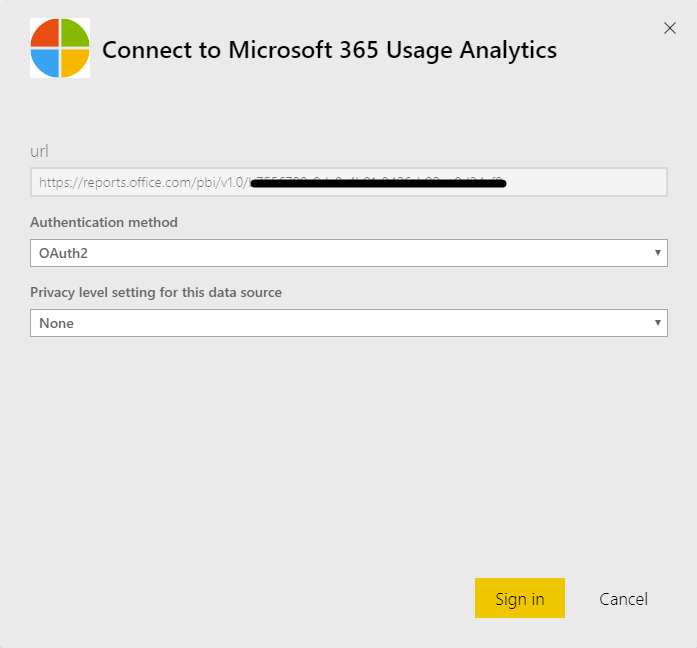

# Abilitare l'analisi dell'utilizzo di Microsoft 365Enable Microsoft 365 usage analytics

::: moniker range="o365-21vianet"

> [!NOTE]
> L'interfaccia di amministrazione sta cambiando.The admin center is changing. Se alcuni dettagli non corrispondono a quelli presentati qui, vedere [Informazioni sulla nuova interfaccia di amministrazione di Microsoft 365](https://docs.microsoft.com/microsoft-365/admin/microsoft-365-admin-center-preview?view=o365-21vianet).If your experience doesn't match the details presented here, see [About the new Microsoft 365 admin center](https://docs.microsoft.com/microsoft-365/admin/microsoft-365-admin-center-preview?view=o365-21vianet).

::: moniker-end

Microsoft 365 Usage Analytics non è ancora disponibile per la community di Microsoft 365 US Government.Microsoft 365 usage analytics is not yet available for Microsoft 365 US Government Community.
  
## Passaggi per abilitare l'analisi dell'utilizzo di Microsoft 365Steps to enable Microsoft 365 usage analytics

Per iniziare a utilizzare l'analisi di utilizzo di Microsoft 365, è necessario prima di tutto rendere disponibili i dati nell'interfaccia di amministrazione di Microsoft 365 e quindi avviare l'app modello in Power BI.To get started with Microsoft 365 usage analytics you must first make the data available in the Microsoft 365 admin center, then initiate the template app in Power BI.
  
### Ottenere Power BIGet Power BI

Se non si dispone già di Power BI, è possibile [iscriversi a Power bi Pro](https://go.microsoft.com/fwlink/p/?linkid=845347).If you don't already have Power BI, you can [sign up for Power BI Pro](https://go.microsoft.com/fwlink/p/?linkid=845347). Seleziona **prova gratis** per iscriversi a una versione di valutazione o **Acquista ora** per ottenere Power bi Pro.Select **Try free** to sign up for a trial, or **Buy now** to get Power BI Pro.
  
  
È anche possibile espandere **Prodotti** per acquistare una versione di Power BI.You can also expand **Products** to buy a version of Power BI. 

> [!NOTE]
> È necessaria una licenza Power BI Pro per l'installazione, la personalizzazione e la distribuzione di un'app modello.You need a Power BI Pro license to install, customize, and distribute a template app. Per ulteriori informazioni, vedere [prerequisiti](https://docs.microsoft.com/power-bi/service-template-apps-install-distribute?source=docs#prerequisites).For more information, please see [Prerequisites](https://docs.microsoft.com/power-bi/service-template-apps-install-distribute?source=docs#prerequisites).

È necessaria una licenza Power BI Pro per condividere il contenuto e le persone con cui condividerlo o il contenuto deve trovarsi in un'area di lavoro con una [capacità Premium](https://docs.microsoft.com/power-bi/service-premium-what-is).You need a Power BI Pro license to share your content, and the people you share it with do too, or the content needs to be in a workspace in a [Premium capacity](https://docs.microsoft.com/power-bi/service-premium-what-is). 
  
### Abilitazione dell'app modelloEnable the template app

Per abilitare l'app modello, è necessario essere un **amministratore globale**, un **lettore di report**, un **amministratore di Exchange**, un amministratore **di Skype for business**o un **amministratore di SharePoint**.To enable the template app, you have to be either a **global administrator**, **report reader**, **Exchange administrator**, **Skype for Business administrator**, or **SharePoint administrator**. 
  
Per ulteriori informazioni, vedere informazioni [sui ruoli di amministratore](../add-users/about-admin-roles.md) .See [About admin roles](../add-users/about-admin-roles.md) for more information. 
  
1. Nell'interfaccia di amministrazione passare alla pagina **Report** \> <a href="https://go.microsoft.com/fwlink/p/?linkid=2074756" target="_blank">Utilizzo</a>.In the admin center, go to the **Reports** \> <a href="https://go.microsoft.com/fwlink/p/?linkid=2074756" target="_blank">Usage</a> page. 
    
2. Nella pagina **utilizzo** individuare la scheda **Microsoft 365 Usage Analytics** e quindi fare clic su **Avvia**.On the **Usage** page, locate the **Microsoft 365 usage analytics** card, and select **Get started**.
    
3. Nel riquadro rapporti che si apre, impostare **rendere disponibili i dati di Microsoft 365 Usage Analytics for Power bi** to **on** \> **Save**.On the Reports panel that opens, set **Make data available to Microsoft 365 usage analytics for Power BI** to **On** \> **Save**. 
  
In questo modo viene avviato il processo di raccolta dei dati e il completamento verrà eseguito tra 2 e 48 ore, a seconda delle dimensioni del tenant.This initiates the data collection process and will complete in 2 to 48 hours depending on the size of your tenant. Il pulsante **Vai a Power bi** verrà abilitato (non più grigio) quando la raccolta dati è stata completata.The **Go to Power BI** button will be enabled (no longer gray) when data collection is complete. 
    
### Avviare l'app modelloInitiate the template app

Per avviare l'app modello, è necessario essere un **amministratore globale**, un lettore di **report**, un **amministratore di Exchange**, un amministratore **di Skype for business**o un **amministratore di SharePoint**.To initiate the template app, you have to be either a **global administrator**, **report reader**, **Exchange administrator**, **Skype for Business administrator**, or **SharePoint administrator**. 
  
1. Copiare l'ID tenant e selezionare **Vai a Power bi**.Copy the tenant Id and select **Go to Power BI**.
    
2.  Dopo aver scaricato Power BI, eseguire l'accesso.When you get to Power BI, sign in. Seleziona app->Ottieni app dal menu di spostamento.Select Apps->Get apps from the navigation menu.    
  
3. Nella scheda **app** Digitare Microsoft 365 nella casella di ricerca e quindi selezionare **Analisi utilizzo Microsoft 365** \> **ottenerlo subito**.In the **Apps** tab, type Microsoft 365 in the search box and then select **Microsoft 365 usage analytics** \> **Get it now**.

    
    
4.  Dopo l'installazione dell'app.Once the app is installed. Fare clic sul riquadro per aprirlo.Click on the tile to open it.

5.  Fare clic su **Esplora app** per visualizzare l'app con dati di esempio.Click **Explore app** to view the app with sample data. Fare clic su **Connetti** per connettere l'app ai dati dell'organizzazione.Click **Connect** to connect the app to your organization’s data.

6.  Dopo aver fatto clic su **Connetti**, nella schermata **connetti a Microsoft 365 Usage Analytics** digitare l'ID tenant (senza trattini) copiato nel passaggio (1) e quindi selezionare **Avanti**.After clicking **Connect**, on the **Connect to Microsoft 365 usage analytics** screen, type in the tenant Id (without dashes) you copied in step (1), and select **Next**.
    
7. Nella schermata successiva, selezionare **OAuth2** come accesso al **Metodo** \> **di**autenticazione.On the next screen, select **oAuth2** as the **Authentication method** \> **Sign in**. Se si sceglie qualsiasi altro metodo di autenticazione, la connessione all'app modello avrà esito negativo.If you choose any other authentication method, the connection to the template app will fail.
    
    
  
8. Dopo aver creato un'istanza dell'app modello, il Dashboard Microsoft 365 Usage Analytics sarà disponibile in Power BI sul Web.Once the template app is instantiated the Microsoft 365 usage analytics dashboard will be available in Power BI on the web. Il caricamento iniziale del dashboard richiederà da 2 a 30 minuti.The initial loading of the dashboard will take between 2 to 30 minutes.
  
Le aggregazioni a livello di tenant saranno disponibili in tutti i report.Tenant level aggregates will be available in all reports. I **dettagli a livello di utente diventeranno disponibili solo dopo il 1 ° o 15 ° giorno del mese di calendario dopo l'opt-in**.**User-level details will only become available after the 1st or 15th day of the calendar month after opting in**. Questo influirà su tutti i report in attività utente (vedere [navigare e utilizzare i report di analisi di utilizzo di Microsoft 365](navigate-and-utilize-reports.md) per suggerimenti su come visualizzare e utilizzare questi report).This will impact all reports under User Activity (See [Navigate and utilize the reports in Microsoft 365 usage analytics](navigate-and-utilize-reports.md) for tips on how to view and use these reports).
    
## Rendere anonimi i dati raccoltiMake the collected data anonymous

Per rendere anonimi i dati raccolti per tutti i report è necessario essere un amministratore globale.To make the data that is collected for all reports anonymous, you have to be a global administrator. In questo modo vengono nascoste informazioni identificabili, ad esempio i nomi di utenti, gruppi e siti, nei report e nell'app modello.This will hide identifiable information such as user, group and site names in reports and in the template app .
  
1. Nell'interfaccia di amministrazione passare alla **pagina Impostazioni** \> **organizzazione**e quindi in scheda **Servizi** scegliere **report**.In the admin center, go to the **Settings** \> **Org Settings**, and under **Services** tab, choose **Reports**.
    
2. Selezionare **report**, quindi scegliere di **visualizzare gli identificatori anonimi**.Select **Reports**, and then choose to **Display anonymous identifiers**. Questa impostazione viene applicata sia ai report sull'utilizzo che all'app modello.This setting gets applied both to the usage reports as well as to the template app.
  
3. Selezionare **Salva modifiche**.Select **Save changes**.
