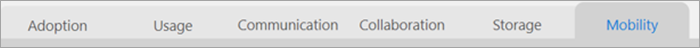
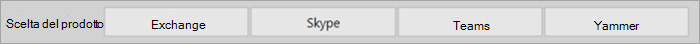
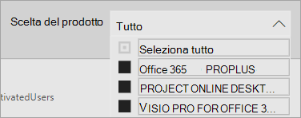

# Esplorare e usare i report nell'analisi dell'utilizzo di Microsoft 365 

Il dashboard offre una rapida panoramica delle principali metriche di adozione e utilizzo. Selezionando le metriche di primo livello, è possibile accedere ai report che forniscono ulteriori dettagli e informazioni dettagliate. Ogni scheda del report contiene visualizzazioni dei dati specifiche di un aspetto dell'utilizzo e dell'adozione per l'organizzazione. I dati raccolti sono illustrati nel titolo di ogni report e viene visualizzato un riquadro contenente ulteriori informazioni sulle visualizzazioni nella scheda del report che si sta visualizzando.

Ecco alcuni suggerimenti per iniziare a usare i report:

- Usa le schede di spostamento a sinistra o su una metrica correlata nella pagina **Executive Summary** per passare a ogni report di primo livello.

    

- Utilizzare le schede di spostamento nella parte superiore di ogni report di primo livello per passare a report diversi all'interno di tale livello.

    

- Molti report contengono un filtro dei dati in cui è possibile filtrare il prodotto, l'attributo AAD o l'attività che si desidera visualizzare. Possono essere a selezione singola o a selezione multipla.

    

    

- Passare il mouse sui punti dati per visualizzare un callout che contiene informazioni dettagliate.

    

L'utente che ha creato un'istanza dell'app modello avrà la possibilità di personalizzare il report in base alle proprie esigenze. Per personalizzare l'app modello:

- Selezionare **Modifica report** nella parte superiore del report.

    

- Creare oggetti visivi personalizzati usando i [set di dati](usage-analytics-data-model.md) sottostanti.

- Usare PowerBI Desktop per importare specifiche origini dati.

Per condividere i report, basta selezionare il pulsante Condividi  nella parte superiore della pagina.

Per informazioni su come personalizzare i report, vedere [Personalizzazione dei report nell'analisi dell'utilizzo di Microsoft 365.](customize-reports.md)

Nella documentazione della Guida di Power BI sono disponibili moltissime altre informazioni:

- [Concetti di base di Power BI](/power-bi/service-basic-concepts)

    Informazioni su dashboard, set di dati, report e altri concetti di Power BI.

- [Introduzione a Power BI](/power-bi/service-get-started?wt.mc_id=O365_Reports_PBI_contentpack)

    Informazioni sulle funzionalità di base in Power BI, con collegamenti ad articoli che spiegano come usare Power BI Desktop.

- [Condividere dashboard e report](/power-bi/service-share-dashboards)

    Informazioni su come condividere report con colleghi o persone esterne all'organizzazione. È inoltre possibile condividere il report o una versione filtrata del report.