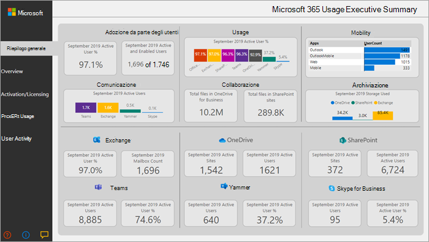

# Analisi di utilizzo di Microsoft 365

## Panoramica dell'analisi dell'utilizzo di Microsoft 365

Utilizzare l'analisi di utilizzo di Microsoft 365 all'interno di Power BI per ottenere informazioni sul modo in cui l'organizzazione adotta i diversi servizi in Microsoft 365. È possibile visualizzare e analizzare i dati di utilizzo di Microsoft 365, creare report personalizzati e condividere le informazioni dettagliate all'interno dell'organizzazione. È inoltre possibile ottenere informazioni dettagliate sul modo in cui aree o reparti specifici utilizzano Microsoft 365.
  
Microsoft 365 Usage Analytics consente di accedere a un dashboard precompilato che fornisce una visualizzazione cross-product degli ultimi 12 mesi e contiene una serie di rapporti precompilati. Ogni report fornisce informazioni specifiche sull'utilizzo. Le informazioni specifiche dell'utente sono disponibili per l'ultimo mese di calendario completo.
  
Il [modello di dati](usage-analytics-data-model.md) che alimenta l'app modello include gli attributi degli utenti di Active Directory, consentendo la possibilità di eseguire il pivot in alcuni report. Sono inclusi gli attributi di Active Directory seguenti: percorso, reparto e organizzazione. 
  
Per iniziare a raccogliere dati, vedere [Abilitare l'analisi dell'utilizzo di Microsoft 365](enable-usage-analytics.md). 
  
L'analisi di utilizzo di Microsoft 365 contiene una serie di rapporti descritti nelle sezioni seguenti. 

È possibile accedere a report dettagliati per ogni area selezionando le tabelle di dati. È possibile visualizzare tutti i report predefiniti selezionando le schede nella parte inferiore del sito. Per istruzioni più dettagliate, vedere [esplorazione e utilizzo dei report](navigate-and-utilize-reports.md) e [personalizzazione dei report](customize-reports.md).

## Riepilogo esecutivo

Il riepilogo esecutivo è una visualizzazione di alto livello di Microsoft 365 per l'adozione, l'utilizzo, la mobilità, la comunicazione, la collaborazione e i rapporti di archiviazione, ed è destinata ai decisori aziendali. Consente di visualizzare la modalità di utilizzo di alcuni singoli servizi in base a tutti gli utenti abilitati e a quelli attivi. Tutti i valori del mese riportati nel report si riferiscono all'ultimo mese completo. 

In questo riepilogo è possibile comprendere rapidamente i modelli di utilizzo in Office e la modalità e la collaborazione dei dipendenti.

## Panoramica

Il report introduttivo di Microsoft 365 contiene i report seguenti. È possibile visualizzarli scegliendo la scheda nella parte superiore della pagina del report. Tutti i valori del mese riportati nella sezione superiore del report si riferiscono all'ultimo mese completo.

- **Adozione** &ndash; Offre un riepilogo di tutti i trend di adozione. Utilizzare i rapporti riportati in questa sezione per informazioni su come gli utenti hanno adottato Microsoft 365, nonché sul modo in cui l'utilizzo generale dei singoli servizi è stato modificato mensilmente nel mese. È possibile vedere in che modo gli utenti possono essere abilitati, quante persone nell'organizzazione stanno usando attivamente Microsoft 365, quanti stanno restituendo gli utenti e quanti utilizzano il prodotto per la prima volta.

- **Utilizzo** &ndash; Offre una visualizzazione drill-down nel volume degli utenti attivi e le attività chiave per ogni prodotto negli ultimi 12 mesi. Utilizzare i report di questa sezione per informazioni su come gli utenti dell'organizzazione utilizzano Microsoft 365.

- **Comunicazione** &ndash; È possibile vedere a colpo d'occhio se gli utenti dell'organizzazione preferiscono rimanere in contatto tramite teams, Yammer, email o Skype calls. È possibile osservare se sono presenti turni negli schemi nell'utilizzo degli strumenti di comunicazione tra i dipendenti. 

- **Collaborazione** &ndash; Vedere in che modo gli utenti dell'organizzazione utilizzano OneDrive e SharePoint per archiviare documenti e collaborare tra loro e in che modo queste tendenze si evolvono mensilmente nel mese. È inoltre possibile visualizzare il numero di documenti condivisi internamente o esternamente e il numero di siti di SharePoint o di account di OneDrive che vengono utilizzati attivamente, suddivisi per i proprietari e gli altri collaboratori.

- **Archiviazione** &ndash; Utilizzare questo report per monitorare l'archiviazione del cloud per le cassette postali, OneDrive e i siti di SharePoint.

- **Dispositivi mobili** &ndash; Monitorare i client e i dispositivi utilizzati dalle persone per la connessione a posta elettronica, teams, Skype o Yammer.

## Attivazione e gestione delle licenze

La pagina di attivazione e licenza offre rapporti sull'attivazione di Microsoft 365; in questo modo, il numero di utenti che hanno scaricato e attivato le app di Office e quante licenze sono state assegnate dall'organizzazione. Il valore del mese verso l'alto si riferisce al mese corrente e la metrica riflette i valori aggregati dall'inizio del mese alla data corrente.

- **Attivazione** &ndash; Monitorare il piano del servizio (ad esempio, le attivazioni di Microsoft 365 Apps per Enterprise, Project e Visio) nell'organizzazione. Ogni persona con una licenza di Office può installare prodotti in un totale di cinque dispositivi. È inoltre possibile utilizzare i report di questa sezione per visualizzare i dispositivi in cui sono installate le app di Office. Si noti che per attivare un piano, un utente deve installare l'app e accedere con il proprio account.

- **Gestione delle licenze** &ndash; Questo report contiene una panoramica dei tipi di licenza, il numero di utenti a cui sono stati assegnati ogni tipo di licenza e la distribuzione dell'assegnazione della licenza per ogni mese. Il valore del mese verso l'alto si riferisce al mese corrente e la metrica riflette i valori aggregati dall'inizio del mese alla data corrente.

## Utilizzo del prodotto

Questo report contiene un rapporto separato per ogni servizio Microsoft 365, inclusi Exchange, Microsoft 365 groups, OneDrive, SharePoint, Skype, teams e Yammer. Ogni report contiene i rapporti degli utenti attivi totali abilitati e totali, i conteggi di entità quali le cassette postali, i siti, i gruppi e gli account, nonché i report sui tipi di attività, se necessario. Tutti i valori del mese riportati nella sezione superiore del report si riferiscono all'ultimo mese completo.

## Attività dell'utente

I report sulle attività degli utenti sono disponibili per alcuni singoli servizi. Questi rapporti forniscono dati di utilizzo dei dettagli a livello di utente Uniti agli attributi di Active Directory. Inoltre, il rapporto di adozione del reparto consente di suddividere gli attributi di Active Directory in modo che sia possibile visualizzare gli utenti attivi in tutti i singoli servizi. Tutte le metriche vengono aggregate per l'ultimo mese completo.

## Domande frequenti

### Questa applicazione modello sarà disponibile tramite acquisto o sarà gratuita?

Non è gratuito, ti servirà una licenza Power BI Pro. Per informazioni dettagliate, vedere [prerequisiti](https://docs.microsoft.com/power-bi/service-template-apps-install-distribute#prerequisites) per l'installazione, la personalizzazione e la distribuzione di un'app modello.

Per condividere i dashboard con altri utenti, vedere altre informazioni su [Condividi dashboard e report](https://docs.microsoft.com/power-bi/service-how-to-collaborate-distribute-dashboards-reports#share-dashboards-and-reports).

### Chi può connettersi all'analisi dell'utilizzo di Microsoft 365?

È necessario essere un amministratore **globale** , un amministratore di **Exchange** , un amministratore di **Skype for business** , un amministratore di **SharePoint** , un **lettore globale** o un **lettore di report** per stabilire la connessione all'app del modello. Per ulteriori informazioni, vedere informazioni [sui ruoli di amministratore](../add-users/about-admin-roles.md) .

### Chi può personalizzare i report di analisi dei dati di utilizzo?

Solo l'utente che ha effettuato la connessione iniziale all'app modello può personalizzare i report o creare nuovi rapporti nell'interfaccia Web di Power BI. Per istruzioni, vedere [Customizing the Reports in Microsoft 365 Usage Analytics](customize-reports.md) .

### È possibile personalizzare i report solo dall'interfaccia Web di Power BI?

Oltre a personalizzare i rapporti dall'interfaccia Web di Power BI, gli utenti possono anche utilizzare Power BI desktop per connettersi direttamente al servizio Reporting di Microsoft 365 per creare i propri report.

### Come si può ottenere il file pbit a cui è associata questa dashboard?

È possibile accedere al file PBIT dall' [area download Microsoft](https://download.microsoft.com/download/7/8/2/782ba8a7-8d89-4958-a315-dab04c3b620c/Microsoft%20365%20Usage%20Analytics.pbit).

### Chi può visualizzare i dashboard e i report?

Se si è connessi all'app modello, è possibile condividerli con chiunque utilizzando la [funzionalità di condivisione](https://go.microsoft.com/fwlink/p/?linkid=845494). La licenza Power BI richiede che sia la condivisione utente che l'utente con cui è condiviso un dashboard dispongano di Power BI Pro o Power BI Premium.

### La dashboard può essere condivisa da chiunque o solo dalla persona connessa?

Quando si condivide il dashboard, è possibile consentire agli utenti di ripartire il dashboard con altri o meno. È possibile impostare questa opzione al momento della condivisione.

### È possibile lavorare e personalizzare lo stesso modello di app con un gruppo di persone?

Sì. Per consentire a un gruppo di amministratori di collaborare sulla stessa app modello, è possibile sfruttare le funzionalità di area di lavoro app di Power BI, per ulteriori informazioni, vedere [come è consigliabile collaborare e condividere dashboard e report?](https://go.microsoft.com/fwlink/p/?linkid=851070) 

### Per quale intervallo di tempo sono disponibili i dati?

La maggior parte dei rapporti Visualizza i dati per i 12 mesi precedenti. Tuttavia, alcuni grafici possono mostrare meno cronologia poiché la raccolta dati per prodotti e report diversi è stata avviata in momenti diversi e quindi i dati per i 12 mesi completi potrebbero non essere disponibili. Tutti i report verranno infine accumulati fino a 12 mesi di cronologia. I report che mostrano i dettagli a livello di utente mostrano i dati per il mese completo precedente.

### Quali dati vengono inclusi nell'app modello?

I dati dell'app modello coprono attualmente lo stesso insieme di metriche di attività disponibili nei [report attività](../activity-reports/activity-reports.md). Quando i rapporti vengono aggiunti ai report attività, verranno aggiunti all'app modello in una versione futura.

### In che modo i dati dell'app modello sono diversi dai dati dei report sull'utilizzo?

I dati sottostanti visualizzati nell'app modello corrispondono ai dati visualizzati nei rapporti attività nell'interfaccia di amministrazione di Microsoft 365. Le differenze principali sono che nei dati dell'interfaccia di amministrazione sono disponibili per gli ultimi 7/30/90/180 giorni mentre l'app modello presenta dati su base mensile per un massimo di 12 mesi.

Inoltre, i dettagli a livello di utente nell'app modello sono disponibili solo per l'ultimo mese completo per gli utenti a cui è stata assegnata una licenza di prodotto ed è stata eseguita un'attività.

### Quando è necessario utilizzare l'app modello e quando i report sull'utilizzo?

I [report sulle attività](../activity-reports/activity-reports.md)  rappresentano un buon punto di partenza per comprendere l'utilizzo e l'adozione di Microsoft 365. L'app modello combina i dati di utilizzo di Microsoft 365 e le informazioni di Active Directory dell'organizzazione e consente agli amministratori di analizzare il set di dati utilizzando le funzionalità di Visual Analytics di Power BI. Questo consente agli amministratori di non solo di visualizzare e analizzare i dati di utilizzo di Microsoft 365, ma anche di affettarli dalle proprietà di Active Directory, come reparti, posizione e così via. È inoltre possibile creare report personalizzati e condividere le intuizioni all'interno della propria organizzazione. 

### Con quale frequenza vengono aggiornati i dati? 

Quando ci si connette all'app modello per la prima volta, viene compilato automaticamente con i dati per gli ultimi 12 mesi. Successivamente, i dati dell'app modello verranno aggiornati settimanalmente. I clienti possono scegliere di modificare la pianificazione di aggiornamento se l'utilizzo di questi dati richiede un ritmo di aggiornamento diverso.

Il servizio back-end Microsoft 365 aggiornerà i dati quotidianamente e fornisce dati tra 5-8 giorni latenti dalla data corrente.

La colonna **Data contenuto** in ogni dataset rappresenta la data di aggiornamento dei dati nell'app modello.

### Come viene definito un utente attivo?

La definizione di utente attivo è identica alla definizione di [utente attivo](../activity-reports/active-users.md) nei report attività.

### Quali raccolte siti di SharePoint sono incluse nei report di SharePoint?

La versione corrente dell'app modello include l'attività dei file dai siti del team di SharePoint e dai siti del gruppo di SharePoint.

### Quali gruppi sono inclusi nel report sull'utilizzo dei gruppi di Microsoft 365?

La versione corrente dell'app modello include l'utilizzo da parte di gruppi di Outlook, gruppi di Yammer e gruppi di SharePoint. Non include i gruppi relativi a Microsoft teams o Planner.

### Quando sarà disponibile una versione aggiornata dell'app modello?

Le modifiche principali all'app modello verranno rilasciate due volte all'anno, che possono includere nuovi rapporti o nuovi dati. Le modifiche minime ai report possono essere rilasciate su base più frequente.

### È possibile integrare i dati dell'app modello nelle soluzioni esistenti? 

I dati dell'app modello possono essere recuperati tramite le API di Microsoft 365 (in Preview). Quando si spediscono alla produzione, verranno unite all'interno delle API per la [creazione di report di Microsoft Graph](https://go.microsoft.com/fwlink/p/?linkid=848843). 

### Sono disponibili piani per espandere l'app modello per visualizzare i dati di utilizzo di altri prodotti Microsoft?

Questo è considerato per i miglioramenti futuri. Consultare la [Roadmap di Microsoft 365](https://www.microsoft.com/microsoft-365/roadmap) per gli aggiornamenti.

### Come è possibile filtrare le informazioni aziendali in Active Directory?

Informazioni sulla società è incluso uno dei campi di Active Directory nell'app modello ed è possibile visualizzarlo come filtro precompilato nei report **attività utente prodotto** . È disponibile come colonna nella tabella **userState** .

### È possibile inserire altri campi da Active Directory?

È possibile eseguire ulteriori personalizzazioni su questi dati collegandosi alle [API di Reporting di Microsoft Graph](https://go.microsoft.com/fwlink/p/?linkid=848843) per estrarre campi aggiuntivi da Azure Active Directory e unirsi al set di informazioni. 

### È possibile aggregare le informazioni nell'app modello su più abbonamenti?

In questo momento, l'app modello è per una singola sottoscrizione, poiché è associata alle credenziali che sono state utilizzate per connettersi inizialmente.

### È possibile visualizzare l'utilizzo per piano (ad esempio, E1, E3)?

Nell'app modello, l'utilizzo è rappresentato a livello di prodotto. I dati relativi alle diverse sottoscrizioni assegnate agli utenti vengono forniti, tuttavia non è possibile correlare l'attività dell'utente alla sottoscrizione assegnata all'utente.

### È possibile integrare altri set di dati nell'app modello?

È possibile utilizzare Power BI desktop per connettersi alle API Microsoft 365 (in Preview) per aggiungere origini dati aggiuntive da combinare con i dati dell'applicazione modello.

Per ulteriori informazioni, vedere il [documento Customize](customize-reports.md).

### È possibile visualizzare i report "Top Users" per un intervallo di tempo specifico?

Tutti i report a livello di utente presentano dati aggregati per il mese precedente.

### L'app modello verrà localizzata? 

Questo non è attualmente nella roadmap.

### Si tratta di una domanda specifica relativa ai dati visualizzati per la propria organizzazione. A chi posso rivolgermi?

È possibile utilizzare il pulsante Commenti e suggerimenti nella pagina panoramica attività dell'interfaccia di amministrazione oppure è possibile aprire un [caso di supporto](../contact-support-for-business-products.md) per ottenere assistenza per l'app modello. 

### Come possono fare i partner ad accedere ai dati?

Se un partner ha delegato i diritti di amministratore, può connettersi all'app modello per conto del cliente.

### È possibile nascondere le informazioni personali, come i nomi di utenti, gruppi e siti, nei report?

Sì, vedere [rendere anonimi i dati raccolti](enable-usage-analytics.md#make-the-collected-data-anonymous).
