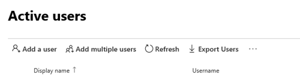
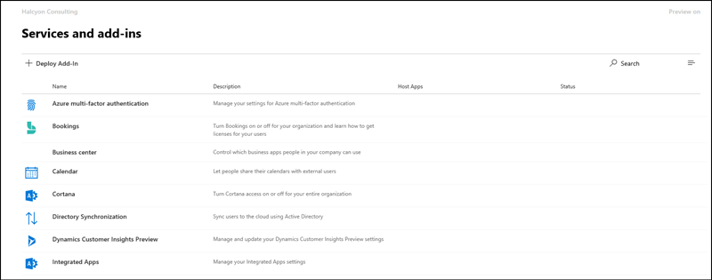
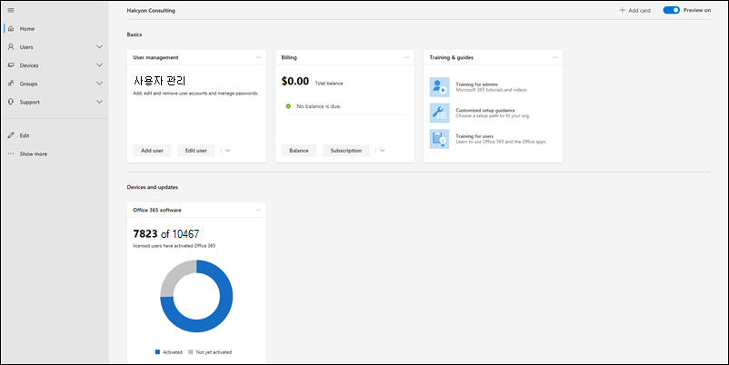
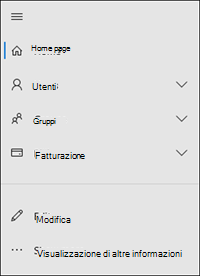
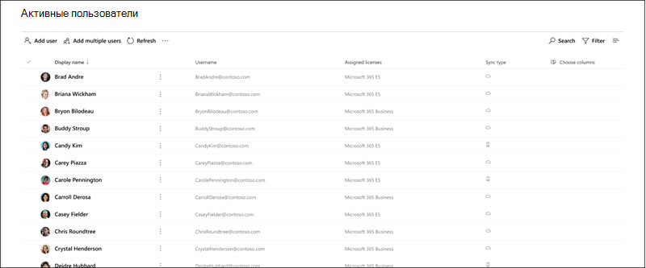
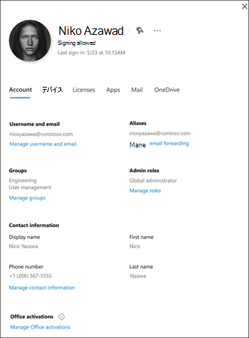

# Novità dell'interfaccia di amministrazione di Microsoft 365What's new in the Microsoft 365 admin center

Si aggiungono continuamente nuove funzionalità all'interfaccia di [amministrazione di Microsoft 365](microsoft-365-admin-center-preview.md), risolvendo i problemi che vengono apportati e modificando in base ai commenti e suggerimenti.We're continuously adding new features to [the Microsoft 365 admin center](microsoft-365-admin-center-preview.md), fixing issues we learn about, and making changes based on your feedback. Per sapere cosa è disponibile per l'utente, vedere di seguito.Take a look below to see what's available for you today. Alcune funzionalità vengono distribuite a velocità diverse per i clienti.Some features get rolled out at different speeds to our customers. Se non si vede ancora una funzionalità, [provare ad aggiungersi alla versione mirata](manage/release-options-in-office-365.md).If you aren't seeing a feature yet, [try adding yourself to targeted release](manage/release-options-in-office-365.md).

Se si è interessati alle novità in altri centri di amministrazione:And if you're interested in what's new in other admin centers:

- [Novità nel centro conformità di Microsoft 365What's new in the Microsoft 365 compliance center](https://docs.microsoft.com/Office365/SecurityCompliance/whats-new)
- [Novità dell'interfaccia di amministrazione di SharePointWhat's new in the SharePoint admin center](https://docs.microsoft.com/sharepoint/what-s-new-in-admin-center)

## Gennaio 2020-buon anno nuovo!January 2020 - Happy New Year!

> [!NOTE]
> Lo sapevate che c'è una [novità di serie di video Microsoft 365](https://go.microsoft.com/fwlink/p/?linkid=2118096) su YouTube?Did you know that there's a [What's New in Microsoft 365](https://go.microsoft.com/fwlink/p/?linkid=2118096) video series on YouTube? In questo modo vengono evidenziate le funzionalità più recenti che sono state implementate dagli utenti.It highlights the latest features that we've rolled out to users. Ogni mese, si inizierà il collegamento all'ultimo episodio della sezione [video, formazione e documenti](#videos-training-and-docs) .Every month, we'll start linking to the latest episode in the [Videos, training, and docs](#videos-training-and-docs) section.     Ecco January's Episode: [January 2020-What ' s New in Microsoft 365](https://go.microsoft.com/fwlink/p/?linkid=2118096)Here's January's episode: [January 2020 - What's New in Microsoft 365](https://go.microsoft.com/fwlink/p/?linkid=2118096)

### Modalità scuraDark mode

Quando è stata eseguita la modalità oscura per la prima volta, è disponibile solo nella Home page.When we first rolled out dark mode, it was only available on the Home page. La modalità oscura è ora fuori dall'anteprima ed è in rilascio mirato nella maggior parte delle pagine dell'interfaccia di amministrazione.Dark mode is now out of preview and is in Targeted release across most pages in the admin center.

1. Per prima cosa, è necessario abilitare la **versione di destinazione** \> : andare a **impostazioni delle** \> impostazioni di **rilascio**del **profilo** \> dell'organizzazione.First, you'll need to turn on Targeted Release: Go to **Settings** \> **Settings** \> **Organization profile** \> **Release preferences**. 
1. E quindi per abilitare la modalità oscura, andare alla **Home** page e quindi selezionare il pulsante **modalità scura** .And then to turn on dark mode, go to the **Home** page, and then select the **Dark mode** button. (Accanto al campo di **ricerca** e al **nuovo** collegamento di questo articolo).(It's next to the **Search** field and this article's **What's new** link.)
1. Per tutte le pagine con modalità scura disponibili, il pulsante si trova nella parte superiore della pagina, accanto al **nuovo interruttore dell'** interfaccia di amministrazione.For any page that has dark mode available, the button is at the top of the page, next to **The new admin center** toggle.

### Gestione di Office What ' s New ManagementOffice What's New management

Gli amministratori desiderano controllare in che modo Microsoft comunica "cosa c'è di nuovo" ai propri utenti nelle app di Office e ora il controllo è disponibile.Admins want control over how Microsoft communicates "What's New" to their users in the Office apps - and you now have that control. Andare a **Settings** \> **Office What ' s New Management Preview**.Go to **Settings** \> **Office What's New management Preview**. Selezionare una funzionalità per visualizzarne i dettagli, quindi è possibile selezionare il pulsante **Nascondi da utenti** se non si desidera che gli utenti visualizzino un messaggio specifico "Novità".Select a feature to view its details, and then you can select the **Hide from users** button if you don't want your users to see a particular "what's new" message. Ad esempio, l'organizzazione potrebbe essere in attesa di consentire agli utenti di conoscere una funzionalità fino a quando non viene addestrato a tutti i presenti nell'org.For example, your organization might be waiting to let users know about a feature until everyone in your org is trained on it.

Questa funzionalità è stata rilasciata per la prima volta in anteprima nel novembre, ma ci sono stati alcuni aggiornamenti delle funzionalità che è necessario conoscere: [Office What ' s New Management Preview Updates Now Available](https://techcommunity.microsoft.com/t5/microsoft-365-blog/office-what-s-new-management-preview/ba-p/1020438)This feature was first released to preview in November, but there have been a few feature updates that you should know about: [Office What's New management preview updates now available](https://techcommunity.microsoft.com/t5/microsoft-365-blog/office-what-s-new-management-preview/ba-p/1020438)

### PartnerPartners
Salve, soci!Howdy, Partners! (Non è stato possibile aiutarmi). Anche questo mese è stato aggiornato.(Couldn't help myself.) We've got an update for you this month, as well. È disponibile una nuova funzionalità che consente ai partner di concedere ai clienti CSP la possibilità di accettare il contratto di servizio Microsoft (MCA) nella sezione **account di fatturazione** dell'interfaccia di amministrazione.There's a new feature that allows Partners to give CSP customers the option to accept their Microsoft Customer Agreement (MCA) in the **Billing accounts** section of the admin center. In questa nuova esperienza:In this new experience:

1. Il cliente riceve un messaggio di posta elettronica di invito con un collegamento per accettare la relazione tra partner e il MCA.The customer receives an invitation email with a link to accept the partner relationship and the MCA.
2. Dopo che il cliente ha eseguito l'accesso, può visualizzare e accettare le autorizzazioni MCA e partner-direttamente dall'interfaccia di amministrazione.After the customer signs in, they can view and accept the MCA and partner permissions - right from the admin center.

### Cassette postali per la risorsaResource mailboxes

L'elenco delle cassette postali per le risorse è stato aggiornato al nuovo stile.The Resource mailboxes list has been updated to the new style. Nell'interfaccia di amministrazione di Microsoft 365, accedere a **Resources** \> **Rooms & Equipment**.In the Microsoft 365 admin center, go to **Resources** \> **Rooms & equipment**.

### Video, formazione e documentiVideos, training, and docs

Consultare la formazione di amministratore di Small Business che è stata rilasciata a gennaio:Check out the small business admin training that we released in January:

- [Creare il sito Web aziendaleCreate your business website](https://support.office.com/article/3325d50e-d131-403c-a278-7f3296fe33a9)
- [Trovare le risposte e la guidaFind answers and help](https://support.office.com/article/7f681212-c649-4a3e-a43b-32b1d1e58988)
- [Ottenere assistenza o supporto tecnicoGet help or support](https://support.office.com/article/18948a4c-3eb1-4b30-b1bc-a4cc29eb7655)
- [Eliminare un utenteDelete a user](https://support.office.com/article/6bcdad7b-732a-4260-997a-8c176bc3d9d6)
- [Scegliere un abbonamento MicrosoftChoose a Microsoft subscription](https://support.office.com/article/b9f7c78e-430f-4117-89ec-2eeb1dced2ca)
- [Panoramica della sicurezza aziendale di Microsoft 365Overview of Microsoft 365 Business security](https://support.office.com/article/3274b159-a825-46d7-9421-7d6e209389d1)

## Novembre e dicembre 2019November and December 2019

Combiniamo le notizie di novembre e dicembre perché dopo l'accensione sono stati apportati pochissimi annunci.We're combining November's and December's news because after Ignite we had very few announcements to make. Ci vediamo nel nuovo anno.See you in the new year!

### Passare dalla carta di credito al pagamento della fatturaChange from credit card to invoice payment

Si sta iniziando a implementare la possibilità di modificare il metodo di pagamento dalla carta di credito a una fattura.We've starting to roll out the ability to change your payment method from credit card to an invoice. Andare a prodotti per la **fatturazione** \> **& Servizi**, selezionare un abbonamento, quindi selezionare il collegamento **modifica** accanto al pagamento con carta di credito.Go to **Billing**\> **Products & services**, select a subscription, and then select the **Edit** link next to the credit card payment.

Vuoi saperne di più?Want to read more about it? [Passare dalla carta di credito o dal conto corrente bancario alla fatturaChange from credit card or bank account to invoice](../commerce/billing-and-payments/change-payment-method.md#change-from-credit-card-or-bank-account-to-invoice)

### Ruolo con autorizzazioni di lettura globaliGlobal reader

È stato menzionato il ruolo Global Reader nell' [edizione di ottobre 2019-Ignite](#october-2019---ignite-edition), ma, come si sta implementando più in generale, vengono illustrati alcuni dettagli:We mentioned the Global reader role in the [October 2019 - Ignite Edition](#october-2019---ignite-edition), but as it’s rolling out more broadly, let’s discuss some details:

- Il ruolo lettore globale è la controparte di sola lettura per il ruolo di amministratore globale.The Global reader role is the read-only counterpart to the Global admin role. Il lettore globale può vedere tutto quello che l'amministratore globale ha l'autorizzazione a eseguire.The Global reader can see everything that the Global admin has permission to do.
- Con alcune eccezioni, come alcune funzionalità di sicurezza e conformità, i lettori globali hanno accesso alla visualizzazione di tutti i centri di amministrazione cloud Microsoft che l'organizzazione ha la licenza di usare.With a few exceptions, like some compliance and security features, Global readers have access to view all of the Microsoft cloud admin centers that your org is licensed to use.
- Assegnare il ruolo di lettura globale agli utenti che ne hanno necessità per la pianificazione, i controlli e le indagini.Assign the Global reader role to users who need it for planning, audits, and investigations.
- È inoltre possibile combinare il ruolo lettore globale con un altro ruolo con meno autorizzazioni.You can also combine the global reader role with another role that has fewer permissions. Ad esempio, a un proprietario di piccole imprese potrebbe essere assegnato il ruolo di**lettore globale** dell' **amministratore** + della fatturazione in modo che possano pagare le bollette e rimanere al di sopra delle modifiche apportate alla propria organizzazione cloud.For example, a small business owner might be assigned the **Billing admin** + **Global reader** roles so that they can pay the bills and stay on top of changes to their cloud organization.
- I lettori globali possono accedere a qualsiasi pagina dell'interfaccia di amministrazione di Microsoft 365.Global readers can go to any page in the Microsoft 365 admin center. Quando si apre una pagina modificabile, nella parte superiore viene visualizzato un avviso che indica che non dispongono delle autorizzazioni necessarie per salvare le modifiche e che il pulsante Salva verrà disabilitato.When they open an editable page,  there will be a warning at the top telling them that they don't have permission to save changes, and the save button will be disabled.

È possibile ottenere commenti e suggerimenti sul ruolo Global Reader e su qualsiasi delle autorizzazioni basate sui ruoli che si desidera visualizzare in futuro.We’d love to get your feedback about the global reader role and any of the role-based permissions that you’d like to see in the future. [Fornire commenti e suggerimenti per le autorizzazioni basate sui ruoliGive feedback for role-based permissions](https://office365.uservoice.com/forums/273493-office-365-admin/suggestions/10115430-have-a-consistent-experience-when-assigning-admin)

### Pagina nuove impostazioniNew Settings page

Le pagine dei componenti aggiuntivi per il **profilo dell'organizzazione**, la **sicurezza & la privacy**e i **Servizi &** sono state tutte combinate in una pagina con 3 schede verticali.The **Organization profile**, **Security & privacy**, and **Services & add-ins** pages have all been combined into one page with 3 vertical tabs. E la parte migliore, da una singola posizione, è ora possibile cercare tutte le impostazioni.And the best part -- from one single location, you can now search for all settings.

### Formazione & documentiTraining & Docs

Questa sezione è una nuova funzionalità di questo articolo, in cui verrà avviato il collegamento a nuovi corsi di formazione e documentazione che riteniamo sia interessante.This section is a new feature of this article, where we'll start linking to new training and documentation that we think you will find interesting.

A novembre sono stati rilasciati alcuni percorsi di apprendimento per il sito Web [Microsoft Learn](https://docs.microsoft.com/learn/) per aiutare i professionisti IT a conoscere e allenarsi su Microsoft 365.In November, we released quite a few learning paths to [Microsoft Learn](https://docs.microsoft.com/learn/) website to help IT pros learn about and get trained on Microsoft 365. Estrarli:Check them out:

- [Nozioni fondamentali su Microsoft 365Microsoft 365 fundamentals](https://docs.microsoft.com/learn/paths/m365-fundamentals/)
- [Estendere i fondamenti di OfficeExtend Office fundamentals](https://docs.microsoft.com/learn/paths/extend-office-fundamentals/)
- [Microsoft 365-modernizzare la distribuzione aziendale con Windows 10 e Office 365 ProPlusMicrosoft 365 - Modernize your enterprise deployment with Windows 10 and Office 365 ProPlus](https://docs.microsoft.com/learn/paths/m365-getmodern/)
- [Gestire la distribuzione aziendale con Microsoft 365Manage your enterprise deployment with Microsoft 365](https://docs.microsoft.com/learn/paths/manage-enterprise-deployment-m365/)
- [Aggiornare Microsoft Office per la scalabilitàUpgrade Microsoft Office for IT at scale](https://docs.microsoft.com/learn/paths/m365-office-for-it/)
- [Fornire desktop e app Remote da Azure con desktop virtuale di WindowsDeliver remote desktops and apps from Azure with Windows Virtual Desktop ](https://docs.microsoft.com/learn/paths/m365-wvd/)
- [Modernizzare il proprio ambiente di lavoro con Microsoft 365 e Surface for businessModernize your workplace with Microsoft 365 and Surface for Business](https://docs.microsoft.com/learn/paths/modernize-workplace-with-m365-and-surface/)
- [Proteggere l'identità e l'accesso con Microsoft 365Protect identity and access with Microsoft 365](https://docs.microsoft.com/learn/paths/m365-identity/)
- [Proteggere le informazioni aziendali con Microsoft 365Protect enterprise information with Microsoft 365](https://docs.microsoft.com/learn/paths/m365-information-protection/)
- [Gestire la sicurezza con Microsoft 365Manage security with Microsoft 365](https://docs.microsoft.com/learn/paths/m365-security-management/)
- [Difendersi dalle minacce con Microsoft 365 e Microsoft Threat ProtectionDefend against threats with Microsoft 365 and Microsoft threat protection](https://docs.microsoft.com/learn/paths/m365-security-threat-protection/)
- [Gestire la collaborazione del team con Microsoft TeamsManage team collaboration with Microsoft Teams](https://docs.microsoft.com/learn/paths/m365-manage-team-collaboration/)
- [Collaborare con SharePoint in Microsoft 365Collaborate with SharePoint in Microsoft 365](https://docs.microsoft.com/learn/paths/m365-teams-sharepoint/)

## Ottobre 2019-Ignite EditionOctober 2019 - Ignite Edition

Welcome to the Ignite Edition del What ' s New in Microsoft 365 Admin Center!Welcome to the Ignite Edition of the What's new in the Microsoft 365 admin center! Naturalmente, non si tratta di un elenco completo di annunci, ma ecco alcuni punti salienti.Of course, this isn't a complete list of announcements, but here are a few highlights. Inoltre, Guarda i Blog Ignite per maggiori informazioni sui rilasci:Also, check out the Ignite blogs for more great info about releases:

- [Amministratori: sicurezza, produttività e miglioramenti della rete per Microsoft 365](https://techcommunity.microsoft.com/t5/Microsoft-365-Blog/ADMIN-Security-Productivity-and-Network-Enhancements-for/ba-p/964019).[ADMIN - Security, Productivity, and Network Enhancements for Microsoft 365](https://techcommunity.microsoft.com/t5/Microsoft-365-Blog/ADMIN-Security-Productivity-and-Network-Enhancements-for/ba-p/964019).
- [Novità di Microsoft teams-ignite 2020](https://techcommunity.microsoft.com/t5/Microsoft-Teams-Blog/What-s-New-in-Microsoft-Teams-Ignite-2019/ba-p/937025).[What's New in Microsoft Teams - Ignite 2020](https://techcommunity.microsoft.com/t5/Microsoft-Teams-Blog/What-s-New-in-Microsoft-Teams-Ignite-2019/ba-p/937025).

### Controllo degli accessi in base al ruoloRole-based access control 

Sono state apportate numerose modifiche ai ruoli nell'interfaccia di amministrazione da quando è stata avviata la distribuzione in giugno:There have been a lot of changes for Roles in the admin center since we started rolling out in June:

- **Confronto dei ruoli** : selezionare fino a 3 ruoli per confrontare le autorizzazioni per ognuna di esse.**Compare roles** - Select up to 3 roles to compare the permissions for each one. Ciò consentirà di trovare il ruolo meno permissivo da assegnare agli utenti.This will help you find the least permissive role to assign to users. Andare a **ruoli**, utilizzare la casella di controllo selezione multipla nella prima colonna per scegliere fino a 3 ruoli, quindi selezionare **Confronta ruoli**.Go to **Roles**, use the multi-select checkbox in the first column to choose up to 3 roles, and then select **Compare roles**.

    

- **Preferiti** : è possibile aggiungere una stella ai ruoli preferiti o più utilizzati, in modo da poterli trovare facilmente ordinando la colonna o creando un filtro.**Favorites** - You can add a star to your favorite or most-used roles, so that you can easily find them by sorting the column or creating a filter.
- **Gestione degli utenti** > \*\*\*\* attivi-questo è stato aggiornato per allineare le modifiche nei ruoli.**Active users** > **Manage roles** - This has been updated to align with the changes in Roles. Come con l'elenco dei ruoli, l'elenco predefinito di ruoli è stato definito come più utile, ma è possibile visualizzare tutti i ruoli espandendo **Mostra tutto in base alla categoria**.As with the Roles list, we've scoped the default list of roles to the most useful, but you can see all roles by expanding **Show all by category**.
- **Ruolo lettore globale** -l'hai chiesto!**Global reader role** - You asked for it! Ce l'hai fatta.You got it! Ruolo di [lettura globale](add-users/about-admin-roles.md#roles-available-in-the-microsoft-365-admin-center) .The [Global reader](add-users/about-admin-roles.md#roles-available-in-the-microsoft-365-admin-center) role!

### Segnalare un problemaReport an issue

Lo stato del servizio è stato aggiornato al nuovo stile e, se si ha un impatto su un problema che non viene visualizzato nel dashboard di integrità dei servizi, è possibile **segnalare un problema** per consentire a Microsoft di sapere.Service health has been updated to the new style and if you are impacted by an issue that is not showing up on your Service health dashboard, you can **Report an issue** to let Microsoft know. Andare a \*\*\*\* > **integrità del servizio**integrità.Go to **Health** > **Service health**.

### Abbonamenti "virali""Viral" subscriptions

Come sapete, gli utenti possono abilitare abbonamenti gratuiti a una miriade di prodotti come Power BI e app Connect.As you know, users can turn on free subscriptions to a myriad of products like Power BI and App Connect. È ora possibile visualizzare gli "abbonamenti virali" che gli utenti hanno provato.You can now see the "viral subscriptions" that your users have been trying. Accedere a prodotti di **fatturazione** > **& Servizi**.Go to **Billing** > **Products & services**. Selezionare il filtro **tipo di account** nella scheda abbonamenti per visualizzare le sottoscrizioni acquistate dall'utente.Select the **Account type** filter on the subscriptions tab to see the user-purchased subscriptions. Se necessario, è ora possibile rimuovere tali abbonamenti dall'account.If needed, you now have the ability to remove these subscriptions from your account.

### Modelli utenteUser templates

I modelli consentono di aggiungere facilmente numerosi utenti salvando e riutilizzando le impostazioni condivise per tali utenti.Templates allow you to easily add many users by saving and reusing the shared settings for these users. È possibile salvare i valori per i ruoli, le licenze assegnate, le informazioni di contatto, la posizione e altro ancora.You can save values for roles, licenses assigned, contact information, location, and more. Quando si utilizza il modello per creare un nuovo utente, il valore salvato viene automaticamente ottenuto per queste impostazioni.When you use the template to create a new user, they will automatically get the saved value for these settings. Passare a \*\*\*\* > utenti**attivi**, quindi selezionare **modelli utente** per provarlo.Go to **Users** > **Active users**, and then select **User templates** to try it out.

### Gestione di Office "What ' s New" (anteprima)Office "What's New" management (Preview)
Quando una funzionalità di Office importante viene rilasciata a un'app di Office, gli utenti riceveranno una scheda "What ' s New" per conoscere la nuova funzionalità.When an important ‎Office‎ feature is released to an Office app, users will get a "What's new" card to learn about the new feature. Se non si desidera che gli utenti visualizzino la scheda, è possibile nasconderla.If you don't want users to see the card, you can hide it. È inoltre possibile scegliere se si desidera che gli utenti visualizzino la scheda visualizzandola.You can also choose when you'd like users to see the card by showing it. Andare a **Settings** > **Office What ' s New Management** to check it out.Go to **Settings** > **Office What's New management** to check it out.

### Modifica dell'URL di SharePointSharePoint URL change
Tecnicamente, non si tratta delle notizie del centro di amministrazione di Microsoft 365 da raccontare, ma siamo così entusiasti che volevamo assicurarci di vedere queste notizie:Technically, this isn't the Microsoft 365 admin center's news to tell, but we're so excited we wanted to make sure you see this news:
> [!IMPORTANT]
> È ora possibile accedere all'interfaccia di amministrazione di SharePoint con un URL normale:https://admin.microsoft.com/SharePointYou can now get to the SharePoint admin center with a regular URL: https://admin.microsoft.com/SharePoint

Per altre informazioni, vedere [What ' s New in the SharePoint Admin Center](https://docs.microsoft.com/sharepoint/what-s-new-in-admin-center)For more info, see [What's new in the SharePoint admin center](https://docs.microsoft.com/sharepoint/what-s-new-in-admin-center)

## Settembre 2019September 2019

Per alcuni entusiasmanti rilasci di funzionalità in Ignite 2019, si stanno annunciando solo alcune nuove funzionalità che sono state rilasciate a settembre.We are ramping up for some exciting feature releases at Ignite 2019, so we're only announcing a few new features that were released in September. Ma rimanete sintonizzati per l'articolo del mese prossimo, sarà pubblicato il primo giorno di Ignite!But stay tuned for next month's article, it'll be published on the first day of Ignite!

### Correzione dei commenti in primo piano: la possibilità di convertire la cassetta postale dell'utente eliminato in una cassetta postale condivisa è tornata!Featured Feedback Fix – The option to convert the deleted user’s mailbox to a shared mailbox is back!

I commenti e le risposte sono stati evidenti e sono stati riportati la possibilità di concedere agli utenti l'accesso a una cassetta postale di un utente eliminato mediante la conversione in una **cassetta postale condivisa**.We heard your feedback loud and clear and we brought back the ability to give someone else access to a deleted user’s mailbox by converting it to a **shared mailbox**. Aggiungendo questo nuovo alla procedura guidata Elimina utente, è possibile decidere cosa fare con i dati:Adding this back to the delete user wizard lets you decide what to do with the data:

- Posta elettronica: consente a qualcun altro di accedere alla cassetta postale dell'utente eliminato mediante la conversione in una cassetta postale condivisa.Email: Give someone else access to the deleted user's mailbox by converting it to a shared mailbox.
- File: salvare i propri file di OneDrive e concedere l'accesso a un altro utente.Files: Save their OneDrive files and give someone else access.
- Autorizzazioni: rimuovere le autorizzazioni se altre dispongono dell'accesso a questa cassetta postale.Permissions: Remove permissions if others had access to this mailbox.
- Alias: rimuovere gli alias di posta elettronica in modo che siano disponibili per l'utilizzo di un altro utente subito.Aliases: Remove email aliases so they are available to use for another user right away.

### Configurazione inizialeInitial setup

Si è verificato un aggiornamento a un'altra delle procedure guidate per l'installazione iniziale: Microsoft 365 for business.There's been an update to another of our initial setup wizards: Microsoft 365 for business. I passaggi sono stati semplificati e sono state spostate due delle attività di configurazione nella pagina di installazione:The steps have been streamlined and we've moved two of the set up tasks into the Setup page:

- Proteggere i **computer Windows 10** : configurare i criteri per proteggere meglio i dispositivi Windows 10 da virus, malware e attacchi da parte di hacker.**Secure Windows 10 computers** - set up policies to better protect your Windows 10 devices from viruses, malware, and attacks by hackers.
- **Installazione automatica di Office** : quando si attiva questa operazione e gli utenti hanno connesso i propri PC a Microsoft 365 business, i computer vengono aggiornati automaticamente alle più recenti app di Office e rimangono sempre aggiornati.**Automatically install Office** - When you turn this on and users have connected their PCs to Microsoft 365 Business, their computers will automatically update to the latest Office apps - and stay up to date.

## Agosto 2019August 2019

### FatturazioneBilling

Sono stati apportati alcuni aggiornamenti per la fatturazione e gli abbonamenti di questo mese:We've got some updates for billing and subscriptions this month:

- Abbonamenti basati su dispositivo: è possibile assegnare o annullare **l'assegnazione delle licenze di Office 365 ProPlus for Education (Device)** ai dispositivi nell'interfaccia di amministrazione di Microsoft 365.Device-based subscriptions: You can assign or unassign **Office 365 ProPlus for Education (device)** licenses to devices in the Microsoft 365 admin center. **Office 365 ProPlus for Education (Device)** è una licenza per i componenti aggiuntivi che consente di assegnare una licenza a un dispositivo.**Office 365 ProPlus for Education (device)** is an add-on license that will lets you to assign a license to a device. Accedere a prodotti di **fatturazione** > **& Servizi** per trovare e acquistare la licenza.Go to **Billing** > **Products & services** to find and purchase the license.
- Gestione delle licenze basata sull'utente: è stato aggiornato il **modo in** > cui si assegnano le licenze agli utenti**attivi** per il nuovo stile.User-based license management: We've updated how you assign licenses in **Users** > **Active users** to the new style. Per altre informazioni, vedere:For more information, see:
    - [Assegnare licenze agli utentiAssign licenses to users](manage/assign-licenses-to-users.md)
    - [Annullare l'assegnazione delle licenze agli utentiUnassign licenses from users](manage/remove-licenses-from-users.md)

### Aggiornamenti della pagina di installazioneSetup page updates

Nel programma di installazione sono disponibili categorie e sezioni, tra cui una sezione **consigliata** , in cui è consigliabile eseguire il passaggio successivo per attivare le funzionalità e configurare l'organizzazione.Setup now has categories and sections, including a **Recommended for you** section where we intelligently suggest your next step in turning on features and setting up your organization. Inoltre, è stata aggiunta una nuova funzionalità da configurare:We've also added a new feature to set up:

- **Protezione avanzata dalle minacce di Office** : se l'organizzazione ha la licenza di usare Office ATP e non è stata configurata o attivata, la pagina verrà visualizzata.**Office Advanced Threat Protection** - If your org is licensed to use Office ATP and you haven't configured it or turned it on yet, you'll see this page. Andare a **Setup** per provare.Go to **Setup** to try it out.

### Segnalare un problemaReport an issue

Se si ha un impatto su un problema che non viene visualizzato nel dashboard di integrità dei servizi, la funzionalità **segnala un problema** fornirà un modo semplice e rapido per farci sapere.If you are impacted by an issue that is not showing up on your Service health dashboard, the **Report an issue** feature will provide you with a quick and easy way to let us know. Andare a \*\*\*\* > **integrità del servizio**integrità.Go to **Health** > **Service health**.

## Luglio 2019July 2019

### Centro messaggiMessage center

Il centro messaggi è stato aggiornato al nuovo progetto e ha un aspetto sorprendente.The Message center has been updated to the new design and it looks amazing! 

- È ora possibile visualizzare **i messaggi in base allo stato**.You can now view **Messages by status**. È sufficiente selezionare una delle schede: **tutti i messaggi attivi**, la **priorità alta**, **i messaggi non letti**e **i messaggi ignorati**.Just select one of the tabs: **All active messages**, **High importance**, **Unread messages**, and **Dismissed messages**.
- È inoltre possibile filtrare in base alla **privacy dei dati**delle categorie, **pianificare la modifica**, **prevenire o risolvere i problemi**e mantenere le categorie di messaggi **informate** .You can also filter by category **Data privacy**, **Plan for change**, **Prevent or fix issues**, and **Stay informed** message categories.
- Selezionare un messaggio dall'elenco e sono disponibili alcune opzioni nella barra dei comandi: **Ignora**, **Contrassegna come lettura** o **Segna come non letto**o **Condividi**.Select a message from the list and you have a few options in the command bar: **Dismiss**, **Mark as read** or **Mark as unread**, or **Share**. 
- Quando si apre un messaggio, sono disponibili altre opzioni:And when you open a message, you have even more options:
    - Copiare un collegamento del messaggio negli Appunti per salvarlo in un secondo momento o condividerlo con i colleghi.Copy a link of the message to your clipboard to save it for later or to share it with colleagues. 
    -  Contrassegnare i messaggi come **letti** o non **letti**.Mark messages as **Read** or **Unread**. 
    -  Fornire commenti e suggerimenti su un messaggio selezionando **like** o **antipatia**, viene visualizzato un riquadro di feedback che richiede di fornire commenti e suggerimenti specifici su ciò che è piaciuto o non è stato apprezzato per questo messaggio.Give feedback about a message by selecting **Like** or **Dislike**, a feedback pane opens asking you to provide specific feedback on what you liked or didn't like about this message.

### Intelligence del riquadro di spostamentoNavigation pane intelligence

 Nel riquadro di spostamento vengono ora memorizzate le ultime azioni e viene visualizzato il riquadro nell'ultimo stato in cui è stato lasciato.The navigation pane now remembers your last actions and shows you the pane in the last state that you left it in. Renderà inoltre visibili gli elementi utilizzati di frequente per impostazione predefinita.It will also make frequently used items visible by default.

### Configurazione iniziale & pagina di installazioneInitial setup & the Setup page
Sono state apportate modifiche entusiasmanti che consentono di configurare l'organizzazione.We've got some exciting changes to help you get your organization set up. Prima di tutto, discutiamo la differenza tra l' **installazione** e la **pagina di installazione**.First off, let's discuss the difference between **setup** and the **Setup page**. Il **programma di installazione** si riferisce all'installazione guidata iniziale utilizzata per l'onboarding ai servizi online di Microsoft.**Setup** refers to the initial setup wizard that you used to onboard to Microsoft's online services. Che in genere include tre passaggi specifici: **connettere un dominio**, **aggiungere utenti**e **scaricare le app di Office**.That usually includes three specific steps: **Connect a domain**, **Add users**, and **Download the Office apps**. La **pagina di installazione** è la pagina nell'interfaccia di amministrazione che ha raccomandato di configurare le attività per essere certi di ottenere il massimo dai propri abbonamenti, come l'attivazione delle caratteristiche per le quali sono state acquistate le licenze.The **Setup page** is the page in the admin center that has recommended set up tasks to ensure that you're getting the most out of your subscriptions - like turning on features you've purchased licenses for.

- **Setup** : l'installazione guidata iniziale è stata aggiornata per gli abbonamenti di **Office 365 for business** .**Setup** - The initial setup wizard has been updated for **Office 365 for Business** subscriptions. Questo nuovo progetto aiuterà le nuove organizzazioni a superare la procedura guidata più velocemente e con maggiore successo.This new design will help new organizations get through the wizard faster and with greater success.
- **Pagina di installazione** : la pagina di **installazione** consente di terminare la configurazione e la protezione dei servizi disponibili con gli abbonamenti.**Setup page** - The **Setup** page helps you finish setting up and securing the services that come with your subscriptions. È inoltre possibile visualizzare eventuali suggerimenti disattivati nella pagina di **installazione** .You can also see any dismissed recommendations on the **Setup** page. Per vedere se è ancora disponibile per gli abbonamenti, passare alla > **configurazione**dell'interfaccia di **amministrazione di Microsoft 365**.To see if it's available for your subscriptions yet, go to the **Microsoft 365 admin center** > **Setup**.

### Abbonamenti & di fatturazioneBilling & subscriptions

- Tipo di prodotto **software** -è ora possibile visualizzare i prodotti software acquistati tramite un provider di servizi cloud (CSP).**Software** product type - You can now view software products purchased through a Cloud Service Provider (CSP). Per visualizzare i download e le chiavi, accedere alla scheda**software** prodotti **fatturazione** > **& Servizi** > .To see your downloads and keys, go to **Billing** > **Products & services** > **Software** tab.
- È possibile visualizzare i prodotti e i servizi di Azure moderni dall'interfaccia di amministrazione di Microsoft 365, indipendentemente dal fatto che siano stati acquistati da Microsoft o da un provider di terze parti.You can view Modern Azure products and services from the Microsoft 365 admin center, whether you purchased them from Microsoft or a third-party provider. Esempi di prodotti di Azure moderni inclusi:Examples of Modern Azure products included:
    - Istanze virtuali riservate di AzureAzure Reserved Virtual Instances
    - Piani di supporto di AzureAzure Support Plans
    - Vantaggi dell'utilizzo ibrido di Azure (AHUB)Azure Hybrid Use Benefits (AHUB)
    - Gestione delle applicazioniManage Applications
    - Servizi per dispositiviDevice Services
    - Abbonamenti di AzureAzure Subscriptions

### Semplificare l'autenticazione a più fattoriSimplify multi-factor authentication

Gli amministratori hanno accesso alle informazioni riservate nell'organizzazione.Admins have access to sensitive information in your organization. Richiedere a tutti gli amministratori di utilizzare l'autenticazione a più fattori quando si effettua l'accesso.Require all admins to use multi-factor authentication when signing in. La nuova procedura guidata consente di ottenere l'operazione con un solo passaggio.The new wizard helps you get it done with just one step. Per provarlo, passare a **installazione** > **rafforzare la sicurezza di accesso**.To try it out, go to **Setup** > **Strengthen sign-in security**.

### UtentiUsers

Le pagine degli **utenti eliminati** e **degli utenti Guest** sono state aggiornate nel nuovo stile.The **Deleted users** and **Guest users** pages were updated to the new style.

- **Utenti Guest**: si aggiungono gli utenti Guest invitandoli a visualizzare o condividere file da SharePoint o OneDrive.**Guest users**: You add guest users by inviting them to view or share files from SharePoint or OneDrive. È possibile visualizzare **gli utenti Guest dagli** > utenti**Guest**.You can view guest users from **Users** > **Guest users**.
- **Utenti eliminati**: nella pagina aggiornamento **utenti eliminati** è possibile eseguire tutte le azioni possibili nell'interfaccia di amministrazione precedente, ma ora si aggiungono e si rimuovono le colonne.**Deleted users**: On the updated **Deleted users** page, you can do all the actions that you could in the older admin center, but now you add and remove columns. E ci sono molte opzioni di colonna tra cui scegliere.And we have a lot of column options to choose from. In effetti, sono le stesse colonne che è possibile scegliere nella pagina **utenti attivi** .In fact, it's the same columns that you can choose on the **Active users** page.

## Giugno 2019June 2019

### Richiesta di feedback in primo piano-modalità oscuraFeatured feedback request - Dark mode

La visualizzazione dell'interfaccia di amministrazione in modalità oscura è in anteprima.Viewing the admin center in dark mode is in preview! È possibile eseguire il testing nella **Home** page solo in questo momento.You can test it out on the **Home** page only right now. Nella **Home** page, il pulsante **modalità scura** si trova nella barra dei comandi accanto al collegamento **novità** .On the **Home** page, the **Dark mode** button is in the command bar next to the **What's new** link.

### Gestione dei ruoliRoles management

Alla fine di giugno sono stati avviati nuovi modi per gestire i ruoli di amministratore.At the end of June we started rolling out new way to manage admin roles. Quando è disponibile per l'utente,\*\*\*\* passare a \*\*\*\* > ruoli ruoli.When it's available for you, go to **Roles** > **Roles**. Fino ad allora, dai un'occhiata-è impressionante!Until then, take a look - it's awesome!
    

Questa nuova esperienza rende più facile vedere chi ha le autorizzazioni di amministratore e assegnare ruoli che conferiscono il livello di accesso appropriato agli amministratori.This new experience makes it easier to see who has admin permissions and to assign roles that grant the right level of access to your admins. Inoltre, sono stati aggiunti altri ruoli da Azure AD, in modo da non perdere tempo per passare a più centri di amministrazione.And we also added more roles from Azure AD so that you don't waste time going to multiple admin centers.
Cos'altro è possibile eseguire qui?What else can you do here?
- Esportare un elenco di tutti gli amministratori dell'organizzazione a cui sono assegnati ruoli di Azure Active Directory in Microsoft 365.Export a list of all admins in your org who are assigned Azure Active Directory roles in Microsoft 365.  
- Visualizzare tutti gli amministratori assegnati a un ruolo specifico, aggiungere o rimuovere amministratori da un ruolo specifico, ricercare i ruoli per nome e parola chiave e ottenere ulteriori informazioni su ciò che ogni ruolo consente a un utente di eseguire.View all admins assigned to a specific role, add or remove admins from a specific role, search for roles by name and keyword, and learn more about what each role allows a user to do. 
- Ricercare rapidamente un ruolo specifico e creare filtri.Quickly search for a specific role and create filters.

### Metodo di pagamentoPayment method
Il modo in cui si pagano gli abbonamenti è stato aggiornato.We've updated how you pay for your subscriptions. Accedere alle \*\*\*\* > **fatture** > di fatturazione &**modalità di pagamento**dei pagamenti.Go to **Billing** > **Bills & payments** > **Payment methods**. È possibile visualizzare i metodi di pagamento in una visualizzazione elenco.You can see your payment methods in a list view. Selezionare un elemento nell'elenco per rimuoverlo, modificarlo e visualizzare facilmente la sottoscrizione a cui è associato il metodo di pagamento.Select any item in the list to remove it, edit it, and easily see which subscription that payment method is associated with.

## Maggio 2019May 2019

### La sensibilità del Fix-case descritta in maggioMay's featured fix - Case sensitivity
Quando si esegue la ricerca di cassette postali condivise, contatti, risorse e autorizzazioni per le cassette postali, i termini di ricerca non devono essere sensibili ai casi.Now when you search for shared mailboxes, contacts, resources, and mailbox permissions, your search terms don't have to be case-sensitive. 

**Gestione di utenti e gruppi** Questo mese è stato aggiornato il **blocco degli utenti**, la **reimpostazione della password**, la visualizzazione elenco **contatti** , la visualizzazione elenco **gruppi** e le pagine dei dettagli per i **gruppi** nel nuovo stile dell'interfaccia di amministrazione.**User and group management** This month, we updated **Block user**, **Reset password**, **Contacts** list view, **Groups** list view, and the **Groups** details pages to the new admin center style.
- Con la visualizzazione elenco nuovi **gruppi** , è possibile ottenere dati più dettagliati sui gruppi e personalizzare il modo in cui vengono visualizzati i dati e l'elenco dei gruppi ricorda come visualizzare i dati.With the new **Groups** list view, you get richer data about your groups, and you can customize the way you see your data -- and the groups list remembers how you want to see your data. Ad esempio, è ora possibile filtrare i **gruppi con i team** per vedere se i gruppi fanno parte di un team ed è possibile aggiungere la colonna **stato teams** .For example, you can now filter on **Groups with Teams** to see if your groups are part of a Team and you can add the **Teams status** column.
- L'elenco dei gruppi comporta anche tutti i miglioramenti apportati all'esperienza di elenco nella gestione degli utenti, incluse le azioni rapide e la barra dei comandi contestuale.The groups list also brings with it all the improvements we made to the list experience in user management, including quick actions and the contextual command bar. 

**Consigli****Recommendations** 
Potrebbe essere visualizzato un nuovo suggerimento popup nell'interfaccia di amministrazione-sono state aggiunte solo 4 nuove.You might see a new recommendation pop-up in your admin center - we just added 4 new ones. Naturalmente, è possibile visualizzare solo i suggerimenti se si ritiene che possano essere utili per l'organizzazione.Of course, you'll only see recommendations if we think it will benefit your organization. Tuttavia, non aspettare fino a quando non viene visualizzata la Raccomandazione: è possibile aggiungerla alla raccolta schede.But don't wait until we show you the recommendation - you can add it from the card library.
- **Scadenza password** : è consigliabile che le password vengano impostate su **Never expire**.**Password expiry** - We recommend that passwords get set to **Never expire**. Se l'organizzazione dispone di un'impostazione diversa, è possibile che venga visualizzato il seguente suggerimento.And if your org has a different setting, you might just see this recommendation. 
- **Troppi amministratori globali** , poiché la presenza di un numero eccessivo di amministratori globali è una minaccia per la sicurezza, se si dispone di più di 4 amministratori globali, verrà visualizzato questo suggerimento.**Too many global admins** - Because having too many global admins is a security threat, if you have more than 4 global admins, you'll see this recommendation. Si consiglia di concedere agli utenti solo l'accesso di cui hanno bisogno per svolgere il proprio lavoro.We suggest giving users only the access they need to get their job done.
- **Protezione dei dispositivi di Intune** -se le licenze includono Intune e si rileva che non è stata completata la configurazione di Intune o che i dispositivi sono stati registrati, si consiglia di creare un criterio di Intune per proteggere i file dell'organizzazione quando gli utenti accedono ai propri dispositivi mobili.**Intune device protection** - If your licenses include Intune and we detect that you either haven't finished setting up Intune or enrolled your devices, we'll recommend that you create an Intune policy to protect your organization's files when users access them from their mobile devices.
- **Ottenere gli aggiornamenti mensili delle funzionalità di Office** : sono stati ricevuti commenti e suggerimenti dai clienti molto piccoli che, quando ricevono gli aggiornamenti mensili delle funzionalità di Office, gli utenti sono più contenti.**Get monthly Office feature updates** - We've gotten feedback from our very small customers that when they get monthly Office feature updates, their users are  happier. Pertanto, se si è un'azienda di piccole dimensioni e si è attualmente ottenere gli aggiornamenti delle funzionalità di Office ogni sei mesi, verrà visualizzato il seguente suggerimento.So, if you're a very small business and you're currently get your Office feature updates every six months, you'll see this recommendation.

**Impostazioni****Settings**  
Per quanto riguarda le impostazioni, sono state apportate alcune modifiche.As for settings, there have been quite a few changes. In genere, è sufficiente aggiornare le impostazioni esistenti al nuovo stile dell'interfaccia di amministrazione.Mostly, just updating the existing settings to the new admin center style. Man mano che si sta procedendo in avanti e si aggiungono nuove impostazioni che non sono mai state viste prima, si inizierà a menzionarle qui.As we're moving forward and add new settings that you've never seen before, we'll start mentioning them here. Per annunciare **l'autenticazione moderna**, è presente un'impostazione di un intero.And we've got one-whole setting to announce: **Modern authentication**. Sì, è disponibile una nuova impostazione per abilitare **l'autenticazione moderna**.Yes, there is a new setting to turn on **Modern authentication**! Per eseguire il check- > out, passare a **Impostazioni** > **Servizi &\*\*\*\*l'autenticazione moderna**dei componenti aggiuntivi.To check it out, go to **Settings** > **Services & add-ins** > **Modern authentication**.

## Aprile 2019April 2019

Le attività sono ottimali per l'interfaccia di amministrazione.Things are looking great for the admin center. Sono state leggere i commenti e suggerimenti, rispondere alla maggior parte di essi e prendere davvero tutto quello che dovete dire a Heart.We've been reading your feedback and suggestions, answering most of them, and really taking all you have to say to heart. Naturalmente, stiamo ancora facendo il lavoro per assicurarsi che tutto sia a parità con l'interfaccia di amministrazione precedente.Of course, we're still doing the work to make sure everything is up to parity with the old admin center. E ricorda: quando si distribuiscono nuove funzionalità, potrebbe non essere possibile ottenerlo subito.And please remember - as we roll out new features, you might not get it right away.

### Feature in primo piano-aggiungere utentiFeatured feature - Add users

Per aprile, è presente la procedura guidata **Aggiungi utente** che illustra i passaggi... Aspetta... Aggiunta di utenti.For April, we're featuring the **Add user** wizard that walks you through...wait for it...adding users. Si tratta di una procedura dettagliata per aggiungere le informazioni di base dell'utente come la posta elettronica e il nome visualizzato, l'assegnazione di una licenza e un ruolo, l'aggiunta di informazioni di contatto e la revisione dell'account dell'utente prima di eseguire il commit.It's a step-by-step to add the user's basic info like email and display name, assigning a license and a role, adding their contact information, and then reviewing the user's account before you commit. **Perché è stata apportata questa modifica?****Why did we make this change?** Sono stati apportati commenti e suggerimenti che non sono stati graditi dall'infinità dello scorrimento per aggiungere utenti nell'esperienza precedente.We heard your feedback that you didn't like the nearly infinite scroll to add users in the previous experience.
    

È possibile effettuare il check-out in due modi:There are two ways you can check it out:  

1. Nella **Home** page, selezionare **Aggiungi utente** dalla scheda di **Gestione utente** .From the **Home** page, select **Add user** from the **User management** card. La procedura guidata viene aperta direttamente in questo modo, quindi non è necessario spostarsi da qualsiasi lavoro che si sta svolgendo nella **Home** page.The wizard opens right there, so you don't have to navigate from any work you're doing on the **Home** page.
2. Passare a \*\*\*\* > utenti**attivi**, quindi selezionare **Aggiungi utente** dalla barra dei comandi.Go to **Users** > **Active users**, and then select **Add user** from the command bar.
  
Sono state apportate alcune altre modifiche alla **gestione degli utenti**, ecco un elenco rapido:We've made a few more changes to **user management**, here's a quick list:
- Il riquadro **Gestisci ruoli** è stato aggiornato al nuovo stile ed è accessibile.The **Manage roles** pane has been updated to the new style and is accessible. È stato inoltre aggiornato il **blocco utente** ed **eliminare** i riquadri utente nel nuovo stile.We've also updated the **Block user** and **Delete user** panes to the new style.
- **Gestire le licenze di prodotto** modificate nella barra dei comandi.**Manage product licenses** changed position in the command bar.
- La modifica della foto di un utente è ora più facile.Changing a user's photo is now easier. In **utenti attivi** selezionare un utente e quindi **cambiare foto** sotto la propria immagine.In **Active users** select a user, and then **Change photo** under their picture.

### Ma aspetta!But wait! C'è dell'altro...There's more...
- Nella **Home** page è presente un nuovo banner di installazione che vedrà se non sono stati completati i passaggi di configurazione, ad esempio l'aggiunta di un dominio, l'aggiunta di utenti e il download delle app di Office.There's a new setup banner on the **Home** page that you'll see if you haven't finished the set up steps, like adding a domain, adding users, and downloading the Office apps.
- Il riquadro elenco e dettagli **gruppo** è stato aggiornato al nuovo stile.The **Group** list and details pane have been updated to the new style. Andare ai \*\*\*\* > **gruppi** di gruppi per visualizzare le modifiche.Go to **Groups** > **Groups** to view the changes. 
    - A proposito di gruppi, è stata aggiunta una scheda **Microsoft teams** per il riquadro dei dettagli dei gruppi, in cui è possibile trasformare qualsiasi gruppo di Office 365 in un team.Speaking of groups, we've also added a **Microsoft Teams** tab to the groups details pane where you can turn any Office 365 group into a Team. Per "teamify" un gruppo seleziona un gruppo di Office 365 dall'elenco, seleziona la scheda **Microsoft teams** e quindi **Crea team**.To "teamify" a group select any Office 365 group from the list, select the **Microsoft Teams** tab, and then **Create Team**. Se il gruppo è già un team, si otterrà un collegamento per gestirlo dall'interfaccia di **amministrazione dei team**.If the group is already a Team, you'll get a link to manage it from the **Teams admin center**.
    - Infine, è possibile aggiungere lo **stato dei team** all'elenco **gruppi** .Finally, you can add the **Teams status** to the **groups** list. Nell'intestazione di colonna selezionare **Scegli colonne** > **stato** > Team**Save**.On the column header, select **Choose columns** > **Teams status** > **Save**.
- **Nuovi ruoli di amministratore limitati** -sono stati rilasciati alcuni nuovi ruoli di amministratore in modo da consentire agli utenti solo l'accesso di cui hanno bisogno.**New limited admin roles** - We've release some new admin roles so that you can give users only the access they need.
    -  **Amministratore di Kaizala**: gli utenti di questo ruolo dispongono dell'autorizzazione per eseguire tutte le attività di gestione in Microsoft Kaizala, tra cui la creazione e la gestione degli utenti nella directory di Kaizala, la gestione dei gruppi di Kaizala, la gestione di schede e connettori e la creazione di richieste di servizio.**Kaizala admin**: Users in this role have permission to perform all management tasks within Microsoft Kaizala, including create and manage users in Kaizala directory, manage Kaizala groups, manage action cards and connectors, and create service requests.
    - **Amministratore della ricerca**: gli utenti di questo ruolo hanno accesso completo a tutte le funzionalità di gestione di Microsoft Search nell'interfaccia di amministrazione di Microsoft 365.**Search admin**: Users in this role have full access to all Microsoft Search management features in the Microsoft 365 admin center. Gli amministratori della ricerca possono delegare i ruoli dell'amministratore della ricerca e dell'editor di ricerca agli utenti e creare e gestire il contenuto, ad esempio i segnalibri, Q&elementi e posizioni.Search admins can delegate the Search admin and Search editor roles to users, and create and manage content, like bookmarks, Q&A items, and locations. Inoltre, questi utenti possono visualizzare il centro messaggi, monitorare lo stato del servizio e creare richieste di servizio.Additionally, these users can view the Message center, monitor service health, and create service requests.
    - **Editor di ricerca**: gli utenti di questo ruolo possono creare, gestire ed eliminare contenuto per Microsoft Search nell'interfaccia di amministrazione di Microsoft 365, inclusi i segnalibri, la Q&elementi e le posizioni.**Search editor**: Users in this role can create, manage, and delete content for Microsoft Search in the Microsoft 365 admin center, including bookmarks, Q&A items, and locations.
- C'è un Bonanza delle modifiche alla **fatturazione** di questo mese...There's a bonanza of **Billing** changes this month...
    - È ora possibile aggiornare il CVV per le carte di credito esistenti senza dover eliminarlo e aggiungerlo di nuovo.You can now update the CVV for existing credit cards without having to delete it and add it again. È possibile aggiornare il CVV accedendo ai**metodi di pagamento**delle **fatture** > .You can update the CVV by going to **Bills** > **Payment methods**.
    - È stato più facile individuare le **fatture** e comprendere eventuali problemi di fatturazione che il tuo account potrebbe avere.We've made it easier to locate your **Invoices** and understand any billing issues your account may be having. E ora è possibile visualizzare le bollette nel Web browser invece di dover scaricare il file PDF.And now you can see your Bills in the web browser instead of having to download the PDF. Vai a **fatture bollette** > **.**Go to **Bills** > **Invoices**.
    - Nella pagina **prodotti & Servizi** , ora vengono aggregate le informazioni di sottoscrizione se sono presenti più abbonamenti dello stesso tipo.On the **Products & services** page, we now aggregate your subscription information if you've got multiple subscriptions of the same type.

## 2019 marzo-abbiamo rilasciato ufficialmente l'interfaccia di amministrazione!March 2019 - We've officially released the admin center!

Ebbene, se si sono perse le notizie entusiasmanti, è stata ufficialmente rilasciata la nuova e migliorata interfaccia di amministrazione di Microsoft 365.Well, if you missed the exciting news, we've officially release the new and improved Microsoft 365 admin center! Di seguito è indicato il post di Blog in cui è stato annunciato: [il nuovo interfaccia di amministrazione di Microsoft 365 disponibile oggi](https://techcommunity.microsoft.com/t5/Microsoft-365-Blog/The-new-Microsoft-365-admin-center-available-today/ba-p/377870).Here's the blog post where we announced it: [The new Microsoft 365 admin center available today](https://techcommunity.microsoft.com/t5/Microsoft-365-Blog/The-new-Microsoft-365-admin-center-available-today/ba-p/377870). Per marzo, faremo affidamento sul post di Blog per controllare le funzionalità rilasciate-Plus, è anche possibile leggere il post per le caratteristiche che vengono rilasciate nel prossimo futuro, cosa che non è consentito eseguire nel contenuto di base.For March, we'll rely on the blog post for you to check out the features released - plus, you can also read the post for the features that are getting released in the near future, which we're not allowed to do in core content.
    
Si dispone di una modifica all'area **fatturazione & abbonamenti** che si desidera menzionare.We do have one change to the **Billing & subscriptions** area that we'd like to mention. Insomma, tutti voi non credevamo che avessimo smesso di migliorare, vero?I mean, y'all didn't think we were done with improving it, did you? Perché non lo siamo.Because we're not! Questo mese, infatti, è stata aggiunta la possibilità di gestire le relazioni con i **partner per gli** > **account di fatturazione**.In fact, this month we added added the ability to manage your partner relationships to **Billing** > **Billing accounts**. Da qui è possibile esaminare le relazioni con i partner tra consulenti, CSP e rivenditori indiretti.From here you can review your partner relationships across Advisor, CSP, and Indirect resellers. È inoltre possibile accettare nuove richieste di relazione partner, incluse le autorizzazioni di amministratore Delegate.You can also accept new partner relationship requests, including delegated admin permissions.

Come sempre, il feedback è importante per noi, quindi continua a venire!As always, your feedback is important to us, so keep it coming! In qualsiasi pagina dell'interfaccia di amministrazione, è possibile fornire commenti e suggerimenti selezionando **Invia commenti e suggerimenti** in basso a destra, accanto a **bisogno di assistenza?**On any page in the admin center, you can give feedback by selecting **Give feedback** in the bottom-right, next to **Need help?**

## Febbraio 2019-fatturazione & abbonamentiFebruary 2019 - Billing & Subscriptions Edition

Questo mese, è necessario concentrarsi su tutti i miglioramenti apportati alle aree affettuosamente denominate "fatturazione e abbonamenti".This month, we're going to focus on all the improvements we've made to the areas affectionately referred to as "Billing and subscriptions". In passato, probabilmente non si riferisce a queste cose con affetto, ma pensiamo che sarà ora...In the past, you probably didn't refer to those things affectionately, but we think you will now...

- **Metodi di pagamento** : sono stati apportati commenti e suggerimenti per il fatto che l'aggiornamento del metodo di pagamento è stato difficile e sono state apportate numerose modifiche.**Payment methods** - We heard your feedback that updating your payment method was difficult and we've made a lot of changes around it. Passare a \*\*\*\* > **modalità di pagamento**fatturazione.Go to **Billing** > **Payment methods**. È possibile visualizzare facilmente i metodi di pagamento, come la carta di credito Visa, e l'abbonamento a cui è associato.You can easily see your payment methods, like your Visa card, and which subscription it is associated with. Nell'elenco dei metodi di pagamento, selezionare il menu **altro** (3 puntini accanto alla data di scadenza), quindi selezionare **Visualizza abbonamenti**.In your list of payment methods, select the **More** menu (3 little dots next to the expiration date), and then select **View subscriptions**. È inoltre possibile modificare ed eliminare i metodi di pagamento utilizzando il menu **altro** .You can also edit and delete your payment methods using the **More** menu.
- **Account di fatturazione** i clienti con rilascio mirato vedranno la prima pagina del nuovo account di fatturazione e poi lo rilasceremo a livello mondiale.**Billing account** - Targeted release customers will see the new Billing account page first and then we'll roll it out to world-wide. Quando è disponibile per l'utente, accedere a \*\*\*\* > **account di fatturazione**fatturazione.When it's available for you, go to **Billing** > **Billing account**. Cosa è possibile fare nella nuova pagina account di fatturazione?What can you do on the new billing account page? Sono contento che mi hai chiesto:I'm glad you asked:
  - Aggiornare l'indirizzo e altre informazioni di contatto nel profilo dell'organizzazione direttamente da questa pagina.Update the address and other contact information in your organizational profile directly from this page. Non è necessario andare al**profilo dell'organizzazione** **delle impostazioni** > , a meno che non si desideri.You don't have to go to **Settings** > **Organization profile**, unless you want to.
  - Per rendere più semplice la gestione dei clienti con contratti multilicenza o diretti, è possibile accettare ed esaminare gli accordi dei clienti dagli **account di fatturazione**.And we're making life easier for Direct or Volume licensing customers, you can accept and review customer agreements from **Billing accounts**. È inoltre possibile connettersi con altri org che consentano di collegare i org insieme per condividere licenze e risorse.You can also connect with other orgs allowing you to link the orgs together to share licenses and resources.
- Inoltre, sono stati apportati alcuni miglioramenti più piccoli e correzioni degli errori:We've also done a few smaller enhancements and bug fixes:
  - Riattivare un abbonamento con un pagamento in fatturaReactivate a subscription with an Invoice payment
  - Modificare l'indirizzo di utilizzo del servizio per le sottoscrizioniEdit the service usage address for your subscriptions
  - Nella pagina dettagli inventario sono stati aggiunti alcuni miglioramenti relativi alla notifica, che consentono di collegare la pagina in cui è possibile eseguire il lavoro e sono disponibili altre azioni sulla scheda dettagli inventario.And on the Inventory details page, we've added some notification enhancements, we link you to the actual page where you can do the work, and there are more actions on the inventory details card. Andare a \*\*\*\* > **fatture** > di fatturazione**visualizzare i dettagli** su qualsiasi fattura.Go to **Billing** > **Bills** > **View details** on any invoice.

## Gennaio 2019-buon anno nuovo!January 2019 - Happy New Year!

- Ancora in aggiunta nei **servizi & componenti** aggiuntivi: sono state aggiornate altre pagine delle **impostazioni > Servizi & componenti** aggiuntivi.Still adding in **Services & add-ins** - We've updated more of the **Settings > Services & add-ins** pages. Provare le app o i report integrati per visualizzare le informazioni più recenti.Try Integrated Apps or Reports to see the latest.
- **Ricerca di miglioramenti?****Searching for improvements?** Non guardare oltre la casella di **ricerca** nella barra dei comandi.Look no further than the **Search** box in the command bar. È stato aggiornato in modo da consentire la ricerca di attività.It's been updated to let you search for tasks. Ad esempio, provare a "reimpostare la password" o "aggiungere un utente".For example, try "password reset" or "add a user".

### FIX commenti e suggerimenti in primo piano-licenze e appFeatured Feedback Fix - Licenses and apps

Sono state ricombinate le **licenze e le app** nel riquadro dei dettagli dell'utente in base ai commenti e suggerimenti.We re-combined **Licenses and apps** in the user details pane based on your feedback. Inizialmente sono state separate le due caratteristiche per fornire spazio ai dettagli di tutte le licenze e tutte le possibilità delle app.We initially separated the two features to provide space for the details of all license and all app possibilities. È stato sentito da voi che la separazione delle licenze e delle app in due riquadri ha aggiunto confusione.We heard from you that separating licenses and apps into two panes added confusion. Sono state ascoltate e sono state riportate le licenze e le app in una sola scheda. A questo punto, è possibile verificare che un'app sia disattivata in tutte le licenze assegnate a un utente in un unico riquadro.We listened, and brought licenses and apps back together into one tab. Now you can make sure that an app is turned off in all licenses assigned to a user in one pane. Latte e biscotti.Milk and cookies. Licenze e app.Licenses and apps. Lo otteniamo subito.We get it now.

Check it out: **gli utenti > utenti attivi > modificare** o **aggiungere licenze e app per > utente**.Check it out: **Users > Active users > Edit** or **Add user > Licenses and Apps**.

## Dicembre 2018December 2018

- **Servizi & componenti** aggiuntivi-in ottobre sono stati aggiornati i servizi di **Impostazioni** \> **& i componenti** aggiuntivi con il nuovo stile di progettazione, ma tutte le pagine delle impostazioni erano ancora in stile classico.**Services & add-ins** - In October we updated **Settings** \> **Services & add-ins** with our new design style, but all of the settings pages were still in the classic style. Questo mese, è stata avviata l'aggiornamento delle impostazioni effettive alla nuova struttura.This month, we've started updating the actual settings to the new design. Consultare le **prenotazioni** per visualizzare il nuovo aspetto.Check out **Bookings** to see the new look.
- **Gestione utenti** -gestire nome utente, alias, indirizzo di posta elettronica principale.**User management** - Manage username, alias, primary email address.
- Sono state aggiunte due Home card alla raccolta.We've added two Home cards to the library. È possibile leggere le descrizioni complete nella raccolta.You can read their full descriptions in the library.
  - **Registrazione del dispositivo Intune****Intune Device enrollment**
  - **Domini****Domains**
- **Suggerimenti** : è possibile che venga visualizzato un nuovo suggerimento popup nell'interfaccia di amministrazione.**Recommendations** - You might see a new recommendation pop-up in your admin center. Naturalmente, è possibile visualizzare solo i suggerimenti se si ritiene che possano essere utili per l'organizzazione.Of course, you'll only see recommendations if we think it will benefit your organization. Tuttavia, non aspettare fino a quando non viene visualizzata la Raccomandazione: è possibile aggiungerla alla raccolta schede.But don't wait until we show you the recommendation - you can add it from the card library.
  - **Protezione delle informazioni riservate** : è consigliabile creare un criterio di prevenzione della perdita di dati (DLP) per rilevare quando gli elementi contenenti informazioni riservate vengono condivisi con utenti esterni all'organizzazione.**Protect sensitive info** - We recommend creating a data loss prevention (DLP) policy to detect when items containing sensitive info are shared with people outside your organization.

## Novembre 2018November 2018

- La casella di ricerca è tornata!The Search box is back! E lo spostammo leggermente.And we moved it slightly. È ancora nella parte superiore della Home page, ma è ora sul lato destro della pagina accanto al pulsante **Aggiungi scheda** .It's still at the top of the Home page, but it's now on the right-side of the page near the **Add card** button.   

- Sono state aggiunte schede per il dashboard.We've added cards for the dashboard. Basta andare all'interfaccia di amministrazione e selezionare **Aggiungi scheda** per visualizzare le nuove schede:Just go to the admin center and select **Add card** to see the new cards:
  - **Report di office 365 Active users** -monitorare l'utilizzo dei servizi di Office 365 acquistati.**Office 365 Active users report** - Monitor the usage of the Office 365 services you've purchased.
  - **Office 365 software** -installare o distribuire Office 365 ProPlus software e vedere il numero di utenti con licenza attivati.**Office 365 software** - Install or deploy Office 365 ProPlus software and see how many licensed users have activated it.
  - **Azure Active Directory** : consente di accedere rapidamente alle attività comuni di Azure ad, come la reimpostazione delle password self-service, la personalizzazione dell'accesso e l'aggiunta di app.**Azure Active Directory** - Gives you quick access to common Azure AD tasks like self-serve password resets, customizing sign-in, and adding apps.
- L'attività di **esportazione rapida degli utenti** è stata aggiunta alla barra dei comandi nella pagina utenti attivi.The **Export users** quick task has been added to command bar on the Active users page. 
- Per i servizi di acquisto sono disponibili ulteriori miglioramenti per novembre.Purchase services has additional enhancements for November. E sono tutti buoni!And they are ALL good! Per arrivarci, vai a fatturazione > acquisto di servizi.To get there, go to Billing > Purchase services.  
  > 1.  Nella parte superiore della pagina, è possibile pivot tra i piani di business e dell'istruzione.At the top of the page, you can pivot between Business and Education plans. Questo ti aiuterà a trovare quello che stai cercando.That will help you find what you're looking for.
  > 2.  È stata aggiunta una casella di ricerca in modo da non dover scorrere all'infinito per trovare ciò che si sta cercando.We added a search box so you don't have to scroll endlessly to find what you're looking for.
  > 3.  Infine, sono stati ordinati logicamente i piani che è possibile acquistare in sezioni che è possibile espandere e comprimere.Finally, we logically sorted the plans you can purchase into sections that you can expand and collapse. Non è necessario acquistare le **app e i servizi di Office**?Don't need purchase any of the **Office apps and services**? Comprimere la sezione e concentrarsi sui piani di Microsoft 365.Collapse that section and focus on Microsoft 365 plans.

## Ottobre 2018October 2018

- C'è un nuovo modo di acquistare abbonamenti nell'interfaccia di amministrazione di Microsoft 365.There's a new way to buy subscriptions in the Microsoft 365 admin center. Accedere a **servizi di acquisto** per visualizzare l'esperienza di acquisto completamente riprogettata che rende più semplice la ricerca, il confronto di piani e altre nuove funzionalità che facilitano l'acquisto di un abbonamento.Go to **Purchase services** to see the completely redesigned shopping experience that makes it easy to search, compare plans, and other great new features that helps make purchasing a subscription easier.  

- La pagina **Servizi e componenti** aggiuntivi è stata aggiornata per il nuovo aspetto, ma tutto il resto è esattamente lo stesso.The **Services and add-ins** page has been updated to the new look and feel, but everything else works exactly the same. Naturalmente, è consigliabile estrarre la barra dei comandi per visualizzare le nuove operazioni che è possibile eseguire, ad esempio il filtro e la modifica dell'elenco in visualizzazione compatta.Of course, you should check out the command bar to see what new things you can do, like filtering and changing the list to compact view. Nel riquadro di spostamento, accedere ai \*\*\*\* \> **componenti aggiuntivi &amp; Servizi** impostazioni per estrarla.In the navigation pane, go to **Settings** \> **Services &amp; add-ins** to check it out.  

## Settembre 2018September 2018

- **Miglioramenti della casa** La Home page è stata completamente rieseguita e non è possibile attendere che tu lo provi e Vedi cosa pensi.**Home improvements** The Home page has been completely re-done and we can't wait for you to try it out and see what you think. Questa è la Home page personale e non influenzerà le Home page di altri amministratori dell'organizzazione.This is your personal Home page and you won't affect the Home pages of other admins in your organization.  

  - È possibile aggiungere, rimuovere e spostare le schede Home page attorno alla Home page.You can add, remove, and move home page cards around the Home page. Selezionare **+ Aggiungi carta** nell'angolo in alto a destra per vedere quali schede sono disponibili nella raccolta schede e quindi trascinarle in un punto qualsiasi della Home page.Select **+ Add card** in the top right corner to see which cards are available in the card library, and then drag them anywhere on the Home page. Non ti piace dove è atterrato?Don't like where it landed? Trascinalo nel punto desiderato.Drag it to where you want it. Non è neanche necessario salvare altro.You don't even have to save any more.

  - Eseguire l'organizzazione al livello successivo raggruppando le schede nelle sezioni.Take organization to the next level by grouping cards into sections. Per l'utente sono state create due sezioni predefinite: **nozioni di base** e **dispositivi e aggiornamenti.**We've created two default sections for you: **Basics** and **Devices and updates.** Molto presto, sarà possibile aggiungere, rimuovere e rinominare sezioni per progettare una Home page che funzioni per l'utente.Very soon, you'll be able to add, remove, and rename sections to design a Home page that works for you.

  - La maggior parte delle schede sono informative e utilizzabili, il che significa che sarà possibile fornire informazioni just-in-time che consentono di eseguire le attività quotidiane in modo più rapido ed elegante.Most of the cards are informative and actionable, which means that you'll be provided with just-in-time information to help you do your daily tasks faster and smarter.

  - Il riquadro di spostamento è stato riorganizzato ed è possibile personalizzarlo per le attività rapide.The navigation pane has been re-organized and you can customize it for your quick tasks. È sufficiente selezionare **modifica** dalla parte inferiore del riquadro di spostamento per avviare la personalizzazione.Just select **Edit** from the bottom of the navigation pane to start customizing.  

- **Fatturazione** È probabile che si notino alcune delle modifiche più importanti all'interfaccia di amministrazione di Microsoft 365 nella sezione fatturazione.**Billing** You'll probably notice some of the biggest changes to the Microsoft 365 admin center in the Billing section. È possibile gestire gli abbonamenti e le app acquistati da Microsoft o da un altro fornitore, incluse nuove esperienze per la gestione dell'inventario, la cronologia degli ordini, i metodi di pagamento e la fatturazione.You can manage subscriptions and apps you've bought from Microsoft or another vendor, including new experiences for inventory management, order history, payment methods, and invoicing.

  - La gestione della sottoscrizione è stata riprogettata per offrire una nuova esperienza di gestione dell'inventario per più tipi di prodotto, tra cui app, software e componenti aggiuntivi. Ora è denominato \*\*servizi prodotti &amp; \*\* per riflettere meglio il supporto per i nuovi tipi di prodotto da aggiungere.Subscription management has been redesigned to give you a new inventory management experience for more product types including apps, software, and add-ins. It's now called **Products &amp; services** to better reflect the support for new product types being added. È ora possibile scegliere di disporre di una scheda o di una visualizzazione tabella dei prodotti e servizi ed è possibile cercare e filtrare per trovare rapidamente ciò che si sta cercando.You can now choose to have a card or table view of the products and services, and you can search and filter to quickly find what you're looking for.  

  - Ora è più facile che mai assegnare una licenza di prodotto agli utenti.It's now easier than ever to assign a product license to your users. Selezionare il prodotto acquistato, quindi è possibile assegnare il prodotto.Select your purchased product and then you can assign the product. È anche possibile vedere a quali utenti è già stato assegnato un prodotto specifico.You can also see which users have already been assigned a particular product.  

  - I **piani degli switch** sono ora denominati \* \* upgrade \* \* e infine gli aggiornamenti della sottoscrizione avvengono dietro le quinte, quindi non è necessario guardare l'aggiornamento completo.**Switch plans** is now called \*\* Upgrades \*\* and finally the subscription upgrades happen behind the scenes so you don't have to watch the upgrade complete. Infine, non esiste più una limitazione di licenza per gli aggiornamenti.Lastly, there is no longer a license limitation on upgrades.

- **Gestione degli utenti** Sono state apportate numerose modifiche alla gestione degli utenti per velocizzare il lavoro.**User management** We've made a lot of changes to user management to help you get your work done faster. È stata aggiornata la pagina \* \* utenti attivi \* \* e il riquadro dei dettagli dell'utente.We've updated the \*\* Active users \*\* page and the user's details pane. Di seguito sono riportate alcune delle modifiche più impressionanti:Here's some of the more awesome changes:

  - La pagina **utenti attivi** contiene una nuova struttura e un nuovo layout.There's a new design and new layout to the **Active users** page. Non ti piace la modalità di visualizzazione dell'elenco?Don't like the way the list looks? Selezionare **Cambia visualizzazione** (accanto a **filtro**) ed è possibile modificare l'elenco dall'elenco **normale** all' **elenco compatto**.Select **Change view** (next to **Filter**) and you can change the list from **Normal list** to **Compact list**. Elenco compatto è particolarmente utile se sono presenti molti utenti nell'organizzazione.Compact list is especially helpful if you've got a lot of users in your organization.  

  - La barra dei comandi (dove vive la **ricerca** ) è dinamica e l'elenco delle azioni cambierà a seconda del numero di utenti selezionati: non sono presenti utenti, un utente o più utenti.The command bar (where **Search** lives) is dynamic and the list of actions will change depending on the number of users you've selected: no users, one user, or multiple users. Vedrai anche quanti utenti sono stati selezionati accanto a **Cerca**.You'll also see how many users you have selected next to **Search**.  

  - È possibile eseguire attività rapide come la reimpostazione delle password per singoli o più utenti direttamente dalla visualizzazione elenco.You can perform quick tasks like resetting passwords for single or multiple users directly from the list view.

  - I dettagli e le impostazioni dell'utente sono ora organizzati dalle seguenti schede: **account**, **dispositivi**, **licenze**, **app**, **posta**e **OneDrive**.The User's details and settings are now organized by the following tabs: **Account**, **Devices**, **Licenses**, **Apps**, **Mail**, and **OneDrive**. In precedenza, molte di queste impostazioni erano situate su più schermate.Previously, many of these settings were located across multiple screens.   
