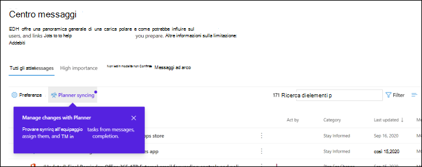
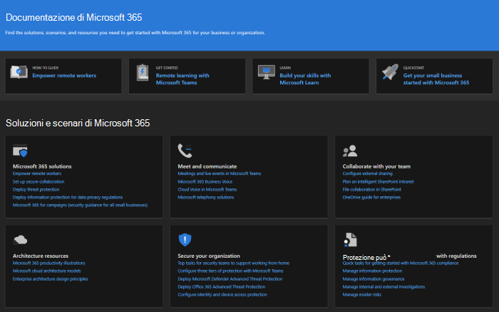
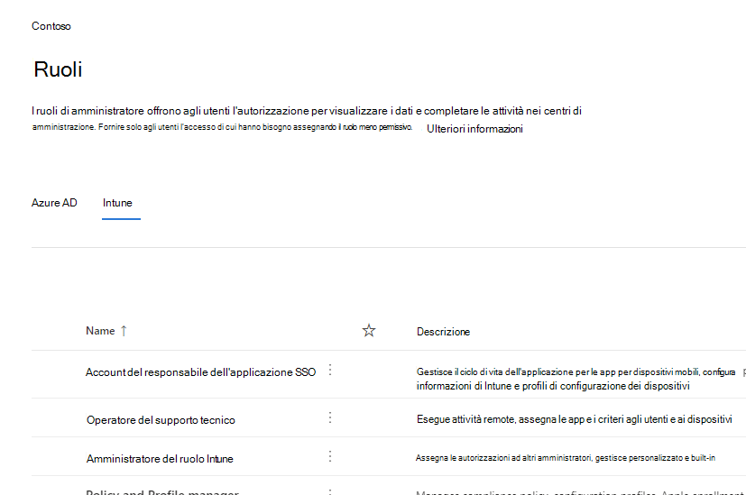
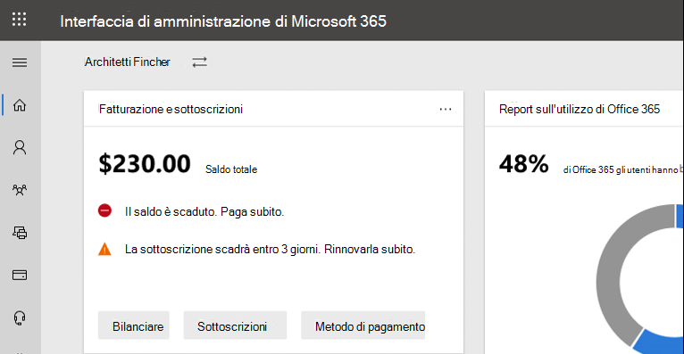

# Novità nell'interfaccia Microsoft 365 di amministrazioneWhat's new in the Microsoft 365 admin center

::: moniker range="o365-21vianet"

> [!NOTE]
> Alcune delle informazioni contenute in questo articolo potrebbero non essere applicabili Office 365 gestito da 21Vianet.Some of the information in this article might not apply to Office 365 operated by 21Vianet.

::: moniker-end

Stiamo continuamente aggiungendo nuove funzionalità all'interfaccia di amministrazione di [Microsoft 365,](../business-video/admin-center-overview.md)risolvendo i problemi che abbiamo appreso e apportando modifiche in base al tuo feedback.We're continuously adding new features to [the Microsoft 365 admin center](../business-video/admin-center-overview.md), fixing issues we learn about, and making changes based on your feedback. Dai un'occhiata qui sotto per vedere cosa è disponibile per te oggi.Take a look below to see what's available for you today. Alcune funzionalità vengono implementazioni a velocità diverse per i clienti.Some features get rolled out at different speeds to our customers. Se non vedi ancora una funzionalità, prova ad [aggiungerti alla versione mirata.](manage/release-options-in-office-365.md)If you aren't seeing a feature yet, [try adding yourself to targeted release](manage/release-options-in-office-365.md).

E se si desidera sapere quali sono le novità con altri servizi cloud Microsoft:And if you'd like to know what's new with other Microsoft cloud services:

- [Novità di Azure Active DirectoryWhat's new in Azure Active Directory](/azure/active-directory/fundamentals/whats-new)
- [Novità nell'interfaccia Exchange di amministrazioneWhat's new in the Exchange admin center](/Exchange/whats-new)
- [Novità di Microsoft IntuneWhat's new in Microsoft Intune](/mem/intune/fundamentals/whats-new)
- [Novità del Centro Microsoft 365 conformitàWhat's new in the Microsoft 365 compliance center](/Office365/SecurityCompliance/whats-new)
- [Novità di Microsoft 365 DefenderWhat's new in Microsoft 365 Defender](../security/mtp/whats-new.md)
- [Novità nell'interfaccia SharePoint di amministrazioneWhat's new in the SharePoint admin center](/sharepoint/what-s-new-in-admin-center)
- [Aggiornamenti di OfficeOffice updates](/OfficeUpdates/)
- [Come verificare l'integrità Windows rilascioHow to check Windows release health](/windows/deployment/update/check-release-health)

## Giugno 2021June 2021

### Microsoft 365 dell'interfaccia di amministrazioneMicrosoft 365 admin center search

Abbiamo aggiunto un paio di nuove categorie alla funzionalità di ricerca.We've added a couple of new categories to Search functionality.

- È ora possibile cercare Microsoft 365 di amministratore nella ricerca globale e visualizzare e gestire rapidamente le assegnazioni di ruolo da qualsiasi pagina.You can now search for Microsoft 365 admin roles in global search and quickly view and manage role assignments from any page. Ad esempio, cercare amministratore **di Intune**.For example, search for **Intune administrator**.

- È ora possibile trovare esperienze di installazione semplificate tramite la ricerca globale.You can now find simplified setup experiences through global search. Questo può aiutare l'utente e il team a iniziare rapidamente a usare le nuove funzionalità.This can help you and your team quickly get started with how to use new features. Ad esempio, cercare **imposta password in modo che non scada mai**.For example, search for **set password to never expire**.

Per ulteriori informazioni sulla ricerca nell'interfaccia di amministrazione, vedere [Search in the Microsoft 365 admin center](manage/search-in-the-mac.md).To learn more about search in the admin center, see [Search in the Microsoft 365 admin center](manage/search-in-the-mac.md).

## Maggio 2021May 2021

### App Admin per dispositivi mobiliAdmin mobile app

### Tenere traccia degli aggiornamenti dei ticket di supporto tramite l'app Admin per dispositivi mobiliKeep track of support ticket updates using the Admin mobile app

Per tutte le richieste di servizio create nel tenant è ora possibile tenere traccia dello stato del ticket, visualizzare i dettagli del ticket e fornire/ richiedere informazioni aggiuntive aggiungendo note & allegati.For all the service requests created in your tenant you can now keep track of the ticket status, view ticket details and provide / request additional information by adding notes & attachments.

:::image type="content" source="../media/Keep-track-support-ticket-updates2.PNG" alt-text="Screenshot: Track support ticket updates":::

### Tieniti aggiornato su tutti gli aggiornamenti principali per l'app e l'Microsoft 365 abbonamentoStay on top of all the major updates to the app and your Microsoft 365 subscription

- Tieniti aggiornato su tutti gli aggiornamenti principali dell'abbonamento Microsoft 365 tramite le notifiche push del Centro messaggi (ora abilitate per impostazione predefinita).Stay on top of all the major updates to your Microsoft 365 subscription through Message Center push notifications (now enabled by default).

- Tieni traccia delle funzionalità più recenti disponibili **nell'app** usando la sezione Novità.Keep track of the latest features available in the app using the **What's New** section. Vai a **Impostazioni**  >  **Novità?**Go to **Settings** > **What’s new?**

:::image type="content" source="../media/Stay-on-top-of-updates.PNG" alt-text="Screenshot: Track major updates and features":::

## Aprile 2021April 2021

### App Admin per dispositivi mobiliAdmin mobile app

### Gestire licenze e fatture dall'app Admin per dispositivi mobiliManage licenses and bills from the Admin mobile app

- È ora possibile visualizzare tutte le licenze disponibili e assegnate per le sottoscrizioni.You can now view all available and assigned licenses for your subscriptions. Puoi anche assegnare o annullare l'assegnazione di licenze agli utenti e aggiungere o rimuovere licenze.You can also assign or un-assign licenses to users, and add or remove licenses.
- Ora puoi visualizzare le fatture dettagliate nell'app.You can now view detailed invoices in the app.
- Questi aggiornamenti sono disponibili sia nei [dispositivi Android](https://go.microsoft.com/fwlink/p/?linkid=2159786) che [iOS.](https://go.microsoft.com/fwlink/p/?linkid=2159787)These updates are available on both [Android](https://go.microsoft.com/fwlink/p/?linkid=2159786) and [iOS](https://go.microsoft.com/fwlink/p/?linkid=2159787) devices.

:::image type="content" source="../media/assign-license-mobile-app2.png" alt-text="Screenshot: Admin mobile app assign license page":::
:::image type="content" source="../media/license-screen-mobile-app2.png" alt-text="Screenshot: Admin mobile app screen with users and their licenses":::
:::image type="content" source="../media/invoice-summary-mobile-app.png" alt-text="Screenshot: Admin mobile app invoice summary page":::

### Feed del Centro messaggi aggiornato nell'app Admin per dispositivi mobiliUpdated Message center feed in the Admin mobile app

- Ora hai un'esperienza di lettura più flessibile del feed del Centro messaggi.You now have a more flexible reading experience of the Message center feed. Ora puoi filtrare i messaggi in base al servizio o ai tag e contrassegnare i messaggi come preferiti.You now have the ability to filter messages based on service or tags and mark messages as favorite. Sono state aggiunte anche azioni in blocco per contrassegnare i messaggi come letti, non letti o archiviati.Bulk actions for marking messages as read, unread or archived has also been added.
- Questi aggiornamenti sono disponibili sia nei [dispositivi Android](https://go.microsoft.com/fwlink/p/?linkid=2159786) che [iOS.](https://go.microsoft.com/fwlink/p/?linkid=2159787)These updates are available on both [Android](https://go.microsoft.com/fwlink/p/?linkid=2159786) and [iOS](https://go.microsoft.com/fwlink/p/?linkid=2159787) devices.

:::image type="content" source="../media/mc-feed-mobile-app.png" alt-text="Screenshot: Admin mobile app Message center feed page":::

## Ignite 2021 (marzo)Ignite 2021 (March)

Benvenuto in Microsoft Ignite.Welcome to Microsoft Ignite. Ci auguriamo che tu sia stato in grado di partecipare ad alcune delle nostre sessioni: [Microsoft Ignite 2021.](https://myignite.microsoft.com/sessions)We hope you were able to attend some of one of our sessions: [Microsoft Ignite 2021](https://myignite.microsoft.com/sessions). Ecco alcune delle cose di cui abbiamo parlato in Ignite.Here's a few of the things we talked about at Ignite.
> [!NOTE]
> Non tutte le funzionalità saranno immediatamente disponibili per tutti gli utenti.Not all features are going to be available to everyone right away. Se non vedi le nuove funzionalità, partecipa [a Targeted Release.](manage/release-options-in-office-365.md)If you aren't seeing the new features, [join Targeted Release](manage/release-options-in-office-365.md).

### Centro messaggiMessage center

Abbiamo rinnovato il Centro messaggi per aiutarti a individuare i messaggi pertinenti e abbiamo aggiunto un'esperienza di lettura più flessibile.We’ve revamped the Message center to help you discover relevant messages and added a more flexible reading experience. È stata aggiunta una nuova colonna **Servizio** per analizzare il servizio a cui si applica un messaggio e filtrare i messaggi in base al servizio e ad altri metadati.We've added a new **Service** column to help you scan which Service a message applies to and filter messages by Service and other metadata. È possibile contrassegnare un messaggio come preferito per il follow-up, scegliere le colonne da visualizzare nell'elenco dei messaggi e spostarsi tra i messaggi con i pulsanti Indietro e Avanti.You can favorite a message to mark it for follow up, choose which columns appear in the message list, and navigate between messages with the back and next buttons. Abbiamo anche migliorato il processo per semplificare l'invio di commenti e suggerimenti sui post del Centro messaggi.We've also improved the process to make it easier to give feedback on Message center posts.

:::image type="content" source="../media/message-center.png" alt-text="Screenshot: Message center home page showing inbox and messages":::

Per ulteriori informazioni sulle nuove funzionalità, vedere [Centro messaggi.](manage/message-center.md)To learn more about the new features, check out [Message center](manage/message-center.md).

### NovitàWhat's new features

Abbiamo apportato miglioramenti alla modalità di visualizzazione delle funzionalità "Novità" per gli utenti nelle Office app.We've made improvements to how you view the "What's new" features for users in the Office apps. È ora possibile visualizzare il contenuto rtf nel nuovo riquadro Novità che gli utenti possono visualizzare.You can now see the rich content in the Whats' new pane that your users can see. È inoltre possibile ottenere ulteriori informazioni sulla funzionalità prima di decidere di consentire agli utenti di conoscerlo.You can also learn more about the feature before you decide to let your users know about the feature. Per altre info, vedere [Gestire Office funzionalità visualizzate in Novità](manage/show-hide-new-features.md).For more info, check out [Manage which Office‎ features appear in What's New](manage/show-hide-new-features.md).

:::image type="content" source="../media/power-bi-whats-new2.png" alt-text="Screenshot: Office app what's new page showing improvements to Power BI":::

## Ignite 2020 (agosto & settembre)Ignite 2020 (August & September)

Benvenuto in Microsoft Ignite- il nostro primo Ignite solo online.Welcome to Microsoft Ignite - our first online-only Ignite. Ci auguriamo di vederti in una delle nostre sessioni: [Microsoft Ignite 2020 Session Catalog.](https://myignite.microsoft.com/sessions)We hope to see you in one of our sessions: [Microsoft Ignite 2020 Session Catalog](https://myignite.microsoft.com/sessions). Ecco solo alcune delle cose di cui si parla in Ignite.Here's just a few of the things we'll be talking about at Ignite.
> [!NOTE]
> Non tutte le funzionalità saranno immediatamente disponibili per tutti gli utenti.Not all features are going to be available to everyone right away. Se non vedi le nuove funzionalità, partecipa [a Targeted Release.](manage/release-options-in-office-365.md)If you aren't seeing the new features, [join Targeted Release](manage/release-options-in-office-365.md).

### Gestione multi-tenantMulti-tenant management

Abbiamo sviluppato un set di funzionalità per amministratori multi-tenant come te per eseguire il tuo lavoro in modo più rapido ed efficiente.We've developed a set of features for multi-tenant admins like you to get your job done faster and more efficiently. Per ulteriori informazioni, vedere [Manage multiple tenants.](multi-tenant/manage.md)For more information, see [Manage multiple tenants](multi-tenant/manage.md).

- **Tenant:** passare rapidamente tra i tenant gestiti.**Your tenants**: Quickly switch between the tenants you manage.
- **Tutti i tenant**: una nuova pagina in cui è possibile visualizzare rapidamente l'integrità di tutti i servizi dei tenant, le eventuali richieste di servizi aperte, i prodotti e la fatturazione, le attività di configurazione consigliate e il numero di utenti in tale tenant.**All tenants**: A new page where you can quickly see the health of all your tenants' services, any open service requests, your products and billing, recommended setup tasks, and the number of users in that tenant.
- **Installazione**: la pagina Configurazione multi-tenant offre una visualizzazione elenco della pagina Installazione, ma organizzata per molti tenant.**Setup**: The multi-tenant Setup page gives you a list view of the Setup page, but organized for many tenants. È possibile vedere quali funzionalità non sono attivate, quali attività sono complete per tutti i tenant, attività che i tenant devono ancora completare.You can see which features aren't turned on, which tasks are complete for all tenants, tasks that tenants still need to complete. Questa visualizzazione consente di tenere traccia dell'adozione delle funzionalità e di assicurarsi che le attività di configurazione della sicurezza consigliate siano sempre eseguite.This view will help you keep track of feature adoption and to make sure the recommended security setup tasks are always done.
- **Integrità del** servizio: la visualizzazione integrità del servizio mostra se eventuali eventi imprevisti o avvisi influiscono sui tenant.**Service health**: The service health view shows you if any incidents or advisories are affecting the tenants. Ti dirà anche quanti tenant gestiti sono interessati.It will even tell you how many of your managed tenants are affected. Basta selezionare un evento imprevisto per ottenere ulteriori informazioni nella scheda panoramica, quindi passare alla scheda Tenant interessati per eseguire il drill-down e supportare tale tenant.Just select an incident to get more information on the overview tab, then switch over to the Tenants affected tab to drill down and support that tenant.
- **Le migrazioni di cassette postali** tra tenant sono un nuovo servizio, ora in anteprima pubblica, che consente di spostare le cassette postali tra tenant senza dover eseguire l'offboard e quindi l'onboard.**Cross-tenant mailbox migrations** is a new service, now in public preview, that lets you move mailboxes between tenants without the need to offboard and then onboard mailboxes. 
- **Condivisione di domini tra tenant:** presto, è possibile aggiungere un'anteprima privata per le funzionalità che consentono di condividere un dominio tra più tenant.**Cross-tenant domain sharing**: Soon, you can join a private preview for capabilities that allow you to share a domain across multiple tenants. Ad esempio, se Contoso acquisisce Wingtip Toys, Contoso può condividere il dominio con Wingtip Toys in modo che gli utenti di entrambi i tenant possano usare "contoso.com" come indirizzi di posta elettronica.For example, if Contoso acquires Wingtip Toys, Contoso can share the domain with Wingtip Toys so that people in both tenants can use "contoso.com" as their email addresses.

### Monitorare gli account più importantiMonitor your most important accounts

È possibile monitorare e tenere traccia dei messaggi di posta elettronica non riusciti o ritardati inviati agli utenti che hanno un impatto aziendale elevato, come il CEO.You can monitor and track failed or delayed email messages sent to your users who have a high business impact, like your CEO. È possibile tenere traccia degli account con priorità aggiungendo gli utenti all'elenco degli account con priorità nell'Microsoft 365 di amministrazione.You track priority accounts by adding users to your priority accounts list in the Microsoft 365 admin center. Aggiungere dirigenti, dirigenti, responsabili o altri utenti che hanno accesso a informazioni sensibili o ad alta priorità.Add executives, leaders, managers, or other users who have access to sensitive or high priority information.

Gli account di priorità sono disponibili solo per le organizzazioni che soddisfano entrambi i requisiti seguenti:Priority accounts are only available to organizations that meet both of the following requirements:

- Office 365 E3 o Microsoft 365 E3 o Office 365 E5 o Microsoft 365 E5.Office 365 E3 or Microsoft 365 E3, or Office 365 E5 or Microsoft 365 E5.
- Almeno 10.000 licenze e almeno 50 utenti attivi mensilmente Exchange Online utenti.At least 10,000 licenses and at least 50 monthly active Exchange Online users.

Esistono due modi per iniziare:There are two ways to get started:

- Vai a **Utenti** e quindi nel menu tre punti (altre azioni) seleziona **Gestisci** account di priorità per aggiungere utenti all'elenco.Go to **Users**, and then in the three dots (more actions) menu select **Manage priority accounts** to add users to the list.
- Vai a **Installazione,** trova l'attività di installazione **Monitora gli account più importanti** e quindi seleziona **Introduzione.**Go to **Setup**, find the setup task **Monitor your most important accounts**, and then select **Get started**.

Per altre info sugli account con priorità, consulta [Monitoraggio degli account con priorità.](./setup/priority-accounts.md)For more info on priority accounts, check out [Monitoring priority accounts](./setup/priority-accounts.md).

### Eseguire una ricerca più veloce e ottenere risultati migliori da qualsiasi paginaSearch faster and get better results from any page

Abbiamo iniziato la distribuzione di una nuova esperienza di ricerca per l'interfaccia di amministrazione e non vediamo l'ora di provarla. 

- La casella di ricerca è stata spostata nell'area di intestazione in cui è presente "interfaccia di amministrazione di Microsoft 365" in modo da eseguire la ricerca da qualsiasi pagina e non solo dalla home page.The Search box moved to the header area where it says "Microsoft 365 admin center" so you now search from any page, not just the Home page. Abbiamo anche un collegamento: **ALT+S.**We've even got a shortcut: **Alt+S**.
- La ricerca è più intelligente e consente di ottenere risultati migliori, anche più velocemente.Search is smarter and will give you better results, even faster. Prova a digitare "2fa" per iniziare.Try typing "2fa" to get started.
- I risultati della ricerca sono organizzati in base al tipo di elemento o azione che è possibile eseguire.Search results are organized by the type of item or action you can take.
  - **Utenti**: selezionare il nome dell'utente ed è possibile modificarlo qui.**Users**: Select the user's name and you can edit that user right there. Se si seleziona il menu con tre puntini (altre azioni) accanto al nome, è possibile reimpostarne la password.If you select the three dots (more actions) menu next to their name, you can reset their password. È possibile eseguire la ricerca in base al nome visualizzato, al cognome, al nome, al nome utente o all'indirizzo di posta elettronica principale e agli alias di posta elettronica.You can search by display name, last name, first name, username or primary email address, and email aliases. Ma per ottenere una corrispondenza esatta, cercare in base all'indirizzo di posta elettronica principale o al nome utente.But to get an exact match, search by primary email address or username.
  - **Gruppi**: modificare il gruppo da qualsiasi pagina, aggiungere membri, assegnare proprietari.**Groups**: Edit the group from any page, add members, assign owners.
  - **Azioni**: in modo analogo a come è possibile cercare un utente e quindi reimpostare la password, è anche possibile cercare "reimpostare la password" da qualsiasi pagina e quindi reimpostare una o più password per gli utenti.**Actions**: Similar to how you can search for a user and then reset their password, you can also search "reset password" from any page and then reset one or more passwords for users.
  - **Spostamento:** i risultati in Spostamento consentono di accedere rapidamente a una pagina nell'interfaccia di amministrazione.**Navigation**: Results under Navigation can quickly help you get to a page in the admin center quickly. Ad esempio, la ricerca di "ruoli" consente di accedere alla pagina Ruoli per i ruoli di Azure AD.For example, searching "roles" will take you to the Roles page for Azure AD roles.
  - **Impostazioni**: cercare qualsiasi impostazione relativa all'organizzazione, ai servizi sottoscritti e alle impostazioni di sicurezza e privacy.**Settings**: Search for any setting related to your organization, the services you subscribe to, and security and privacy settings. 
  - **Domini**: è possibile trovare collegamenti rapidi ai domini e quindi il collegamento consente di accedere alla pagina Panoramica e integrità del dominio.**Domains**: You can find quick links to your domains, and then the link will take you to that domain's Overview and health page.
  - **Documentazione:** se non è possibile trovare un risultato per l'utente, verrà cercata una documentazione utile.**Documentation**: If we can't find a result for you, we'll try to find some documentation to help. Per trovare una corrispondenza nell'elenco di articoli curato, è necessario attendere un secondo per consentire alla ricerca di trovare i risultati.It takes a little longer for the curated list of articles to find a match, so wait a second to let Search find the results. 
  - **Feedback**: Non hai trovato quello che cercavi?**Feedback**: Didn't find what you were looking for? Inviaci commenti e suggerimenti dalla ricerca.Send us feedback from Search. Aggiungeremo funzionalità di ricerca per altre pagine e altre funzionalità nell'interfaccia di amministrazione.We will add searching functionality for more pages and more features across the admin center.

### Microsoft 365 admin per dispositivi mobiliMicrosoft 365 admin mobile app

[L Microsoft 365 app](https://www.microsoft.com/microsoft-365/business/manage-office-365-admin-app)per dispositivi mobili di amministrazione, inclusa nell'abbonamento, ti consente di gestire Microsoft 365 dal dispositivo mobile in modo da poterti allontanare dalla scrivania per eseguire attività quotidiane.The [Microsoft 365 admin mobile app](https://www.microsoft.com/microsoft-365/business/manage-office-365-admin-app), which is included with your subscription, lets you manage Microsoft 365 from your mobile device so you can get away from your desk to do every day tasks. Infatti, nell'app sono presenti più di 90 funzionalità e ne sono state aggiunte altre:In fact, there are over 90 features in the app--and we just added a few more:

- Supporto per i criteri di gestione delle applicazioni mobili e di accesso condizionale di Microsoft Intune : ora è possibile usare il dispositivo personale per gestire Microsoft 365 anche se **l'organizzazione** ha attivato la gestione delle applicazioni mobili di Intune e i criteri di accesso condizionale.**Support for Microsoft Intune's Mobile Application Management and Conditional Access policies**: You can now use your personal device to manage Microsoft 365 even if your org has turned on Intune's Mobile Application Management and conditional access policies.
- **Notifiche del Centro messaggi**: attivare le notifiche del Centro messaggi **Impostazioni** notifiche se si desidera ricevere un avviso sui nuovi post  >   del Centro messaggi.**Message center notifications**: Turn on message center notifications at **Settings** > **Notifications** if you wish to be alerted about new message center posts. Tramite le notifiche, vogliamo essere sempre informati su informazioni ed eventi importanti nel tenant.Through notifications, we want to ensure you stay informed about important information and events across your tenant.
- **Avvisi di fatturazione:** puoi anche attivare le notifiche di fatturazione in notifiche Impostazioni se vuoi ricevere notifiche di fatturazione sul dispositivo se un abbonamento sta per  >   scadere.**Billing alerts**: You can also turn on billing notifications at **Settings** > **Notifications** if you want to get billing notifications on your device if a subscription is about to expire.
- **Modalità scura:** benvenuto nel lato oscuro dell'app per dispositivi mobili.**Dark mode**: Welcome to the dark side of the mobile app. Questa è stata una delle funzionalità più richieste.This was one of our most requested features. Vai a **Impostazioni**  >  **Temi** per attivarlo.Go to **Settings** > **Themes** to turn it on.
- **Segnalare un problema:** ora puoi segnalare un problema nell'app o visualizzare i problemi segnalati da altri amministratori.**Report an issue**: You can now report an issue in the app or view issues reported by other admins. Visitare **Integrità del servizio** per estrarlo.Visit **Service health** to check it out.

### Consigli sull'utilizzo per le piccole e medie impreseUsage recommendations for small and medium businesses

Le piccole e medie imprese potrebbero ricevere un suggerimento nella **home** page se alcune persone dell'organizzazione non usano attivamente Teams, OneDrive o Office app.Small and medium businesses might get a recommendation on the **Home** page if some of the people in the org aren't actively using Teams, OneDrive, or Office apps. Quando si visualizza il suggerimento, è possibile inviare rapidamente tramite posta elettronica la formazione Microsoft agli utenti inattivi per aiutarli a iniziare con l'app e per assicurarsi di ottenere il valore completo dalle sottoscrizioni.When you view the recommendation, you can quickly email Microsoft training to inactive users to help them get started with the app and to make sure you are getting the full value from your subscriptions.

### Raccolta di lavoro remotaRemote work collection

A ottobre verrà aggiunta una raccolta di lavoro remota per aiutare i proprietari delle piccole imprese e il loro personale a lavorare in remoto.In October, we'll be adding a remote work collection to help small business owners and their staff get online and working remotely.  **La configurazione di Elementi** essenziali per il lavoro remoto è un elenco curato di tutte le funzionalità consigliate da Microsoft per abilitare in modo sicuro il lavoro remoto e collaborare in modo efficace.**Remote work essentials** setup is a curated list of all features Microsoft recommends to securely enable remote work and to collaborate effectively. In un paio di settimane, è possibile provarlo in **Setup**  >  **Remote work essentials**.In a couple of weeks, you can try it out in **Setup** > **Remote work essentials**.

Per ulteriori informazioni su come consentire in modo sicuro il lavoro remoto e un pratico indirizzo Web facile da ricordare e condividere, [vedere aka.ms/remote-business](https://aka.ms/remote-business).For more information about how to securely allow remote work and a handy web address that's easy to remember and share, go to [aka.ms/remote-business](https://aka.ms/remote-business).

### Serve aiuto? passaggio a più centri di amministrazioneNeed help? moving to more admin centers

Stiamo continuamente esaminando e aggiornando il contenuto e gli strumenti per tenere il passo con le modifiche apportate al prodotto.We're continuously looking at and updating the content and tools to keep up with changes in the product. Ora abbiamo molti altri strumenti di diagnostica self-service per aiutarti a risolvere i problemi in modo rapido ed efficiente.We now have many more self-serve diagnostic tools to help you resolve issues quickly and efficiently. Ecco alcuni elementi che sono stati aggiunti di recente:Here are a few that were recently added:

- Modificare il criterio Exchange di limitazione del servizio WebChange your Exchange Web Service throttling policy
- Controllo dello stato Teams provisioning e convalida a utenti specificiChecking status of Teams provisioning and validation to specific users
- Risolvere i problemi di installazione di DKIMFix DKIM setup issues
- Diagnosticare gli errori di registrazione degli utenti di IntuneDiagnose Intune user enrollment errors

Stiamo inoltre stendando l'esperienza di supporto nuova e migliorata già visualizzata nell'interfaccia di amministrazione di Microsoft 365 in alcune delle altre interfaccia di amministrazione.And we are rolling out the new and improved support experience you already see in the Microsoft 365 admin center to some of the other admin centers. Teams L'interfaccia di amministrazione e le centri di amministrazione di sicurezza e conformità hanno già questa nuova esperienza.Teams Admin Center and Security and Compliance Admin Centers already have this new experience. A breve, **Exchange'interfaccia** di amministrazione, **SharePoint** e **Office.com** verranno aggiornati insieme a questa nuova esperienza di assistenza per gli amministratori.And soon, **Exchange admin center**, **SharePoint admin center**, and **Office.com** will be updated along with this new help experience for admins.

### Gestire le modifiche con Microsoft PlannerManage changes with Microsoft Planner

A maggio, abbiamo annunciato che presto potrai sincronizzare i post del Centro messaggi con Microsoft Planner e ora è disponibile per tutti gli utenti.In May, we announced that you'll soon be able to sync Message center posts to Microsoft Planner and now it's available for everyone to use.  È ora possibile creare attività dai messaggi, assegnarle e tenere traccia del completamento.You can now create tasks from messages, assign them, and track them to completion. La prima volta che si seleziona **la sincronizzazione di Planner,** sarà necessario connettersi al piano appropriato.The first time, you select **Planner syncing** you'll need to connect to the appropriate plan.

Per altre informazioni, vedere questo articolo e video per vedere come funziona: Tenere traccia dei post del Centro [messaggi in Planner](/Office365/Planner/track-message-center-tasks-planner)To learn more about it, check out this article and video to see how it works: [Track your message center posts in Planner](/Office365/Planner/track-message-center-tasks-planner)

### Documentazione, formazione e videoDocumentation, Training, and Videos

- Brand new and just in time for Microsoft Ignite--[The Virtual Hub](https://adoption.microsoft.com/virtual-hub/).Brand new and just in time for Microsoft Ignite--[The Virtual Hub](https://adoption.microsoft.com/virtual-hub/). Approfondimento sulla formazione tecnica per professionisti IT e sviluppatori.Deep dive into technical training for IT pros and developers. Trova rapidamente circa 20 nuovi video come parte di #SIDETRACKED, il nome della traccia dell'amministratore di Ignite quest'anno.Quickly find around 20 new videos as part of #SIDETRACKED, the name of the Ignite admin track this year.
- Novità della serie di video [Microsoft 365:](https://www.youtube.com/watch?v=OVjb2lGJ4GU&t=2s) questo mese vengono trattate le nuove funzionalità disponibili in Whiteboard per Teams e sul Web, come automatizzare il provisioning degli utenti in Azure AD, nuovi trigger e azioni di Power Automate in Teams e altro ancora.[What's new with Microsoft 365](https://www.youtube.com/watch?v=OVjb2lGJ4GU&t=2s) video series: This month, we cover new features available in Whiteboard for Teams and on the web, how to automate user provisioning to Azure AD, new Power Automate triggers and actions in Teams, and more. E rimanete sintonizzati per il mese prossimo, dove avremo un riepilogo di tutte le grandi cose che accadono a Ignite!And stay tuned for next month, where we'll have a recap of all the great things happening at Ignite!
- È stata riprogettata la pagina [Microsoft 365 della](/microsoft-365) documentazione che si concentra innanzitutto sulle soluzioni.We did a redesign of the [Microsoft 365 documentation](/microsoft-365) page that focuses on solutions first. Verranno evidenziate nuove soluzioni non appena saranno disponibili in questa pagina, quindi tenere d'occhio.We'll highlight new solutions as they become available on this page, so keep an eye out.

## Luglio 2020July 2020

### Prepararsi per Ignite 2020Getting ready for Ignite 2020

Durante il passaggio alla stagione Ignite presso Microsoft, non vengono rilasciate tutte le funzionalità di cui discutere durante le sessioni.As we're moving into Ignite season at Microsoft, we're not releasing as many features so that we have a lot to talk about during our sessions.

Il prossimo aggiornamento di questo articolo sarà il giorno di apertura del nostro primo Ignite solo online.The next update to this article will be on opening day of our first online-only Ignite. E quest'anno, è gratuito partecipare!And this year, it is free to attend! Check it out, get signed up: [Microsoft Ignite 2020](https://www.microsoft.com/ignite).Check it out, get signed up: [Microsoft Ignite 2020](https://www.microsoft.com/ignite).

### I tuoi prodottiYour products

Nella gestione delle sottoscrizioni è stato svolto molto lavoro per velocizzare il caricamento della pagina, per trovare più velocemente ciò che si sta cercando e per soddisfare gli standard di accessibilità Web ( linee guida[di WCAG 2.1).](http://www.w3.org/TR/WCAG21/)There has been a lot of work done in the subscriptions management to make the page faster to load, faster to find what you're looking for, and to meet the web accessibility standards ([WCAG 2.1 guidelines](http://www.w3.org/TR/WCAG21/)).

- **Riprogettazione della** tabella : la tabella è stata riprogettata in modo da poter raggruppare sottoscrizioni simili.**Table redesign**: The table was redesigned so that you can group similar subscriptions. Vai a **Fatturazione**  >  **I tuoi prodotti**.Go to **Billing** > **Your products**.
- **Dettagli prodotto:** per ottenere più dettagli che mai sugli abbonamenti, selezionare il prodotto nell'elenco.**Product details**: Get more details than ever about your subscriptions by selecting the product in the list.
- **Fare tutto da qui**: E non è necessario andare a saltare diverse pagine per gestire un prodotto.**Do it all from here**: And you don't have to go to jump around several pages to manage one product. Ad esempio, se devi annullare una sottoscrizione, il pannello si aprirà per eseguire l'azione proprio qui.For example, if you need to cancel a subscription, the panel will open to do the action right there.

### DominiDomains

La gestione del dominio può essere complicata e abbiamo rilasciato una nuova funzionalità per semplificare la gestione.Domain management can be complicated, and we've released a new feature to make that easier. Vai a Impostazioni > domini e quindi seleziona un dominio per ottenere ulteriori informazioni sul dominio e sull'integrità del dominio.Go to Settings > Domains and then select a domain to get more information about your domain and the domain's health.

:::image type="content" source="../media/MAC-WN-DomainDNS.PNG" alt-text="Pagina dei dettagli dei domini per contoso.com":::

### Documenti, formazione e video (luglio 2020)Docs, training, and videos (July 2020)

Novità di una serie di video di Microsoft 365: questo mese vengono trattate la nuova esperienza di Yammer per il Web e i dispositivi mobili, come integrare [l'app](https://youtu.be/m1Nu8WJgCDY) community di Yammer per Microsoft Teams, nuovi pacchetti di criteri per supportare firstline worker e manager e altro ancora.[What's new with Microsoft 365](https://youtu.be/m1Nu8WJgCDY) video series: This month, we cover the new Yammer experience for web and mobile, how to integrate the Yammer Communities app for Microsoft Teams, new policy packages to support Firstline Workers and managers, and more.

## Giugno 2020June 2020

### Tenere il passo con Office what's new managementKeeping up with Office What's New management

Alcuni mesi fa, è stata aggiunta un'impostazione che consente di gestire i messaggi Novità visualizzati nelle app Office di un utente.A few months ago, we added a setting that lets you manage the What's New messages that show up in a user's Office apps. Questo mese è stata rilasciata una nuova scheda home page che consente di agire rapidamente e tenere traccia dei messaggi Novità che si desidera visualizzare agli utenti **dell'organizzazione.**This month, we released a new Home page card that will help you act quickly and keep track of the **What's New** messages that you want shown to the users in your organization.

### Documenti, formazione e video (giugno)Docs, training, and videos (June)

- [Introduzione a TeamsGetting started with Teams](../business-video/get-started-teams-small-business.md)

## Maggio 2020May 2020

### Nuovo canale di aggiornamento per OfficeNew update channel for Office

Il 12 maggio è stata annunciata la disponibilità di un nuovo canale di aggiornamento per Office: Canale Enterprise mensile.On May 12, we announced the availability of a new update channel for Office:  Monthly Enterprise Channel. Questo canale di aggiornamento fornisce agli utenti nuove funzionalità Office una volta al mese, il secondo martedì del mese.This update channel provides your users with new Office features once a month, on the second Tuesday of the month.

Se si consente agli utenti di installare automaticamente Office dal portale, è possibile selezionare Canale Enterprise mensile.If you allow your users to self-install Office from the portal, you can select Monthly Enterprise Channel for them. A tale scopo, accedere all'interfaccia di amministrazione Microsoft 365 e passare a **Mostra** tutte le Impostazioni  >   >  **impostazioni dell'organizzazione**  >  **Servizi**  >  **Office impostazioni di download software**.To do this, sign in to the Microsoft 365 admin center and go to **Show all** >**Settings** > **Org settings** > **Services** > **Office software download settings**. Se si seleziona Una volta al mese **(Canale** Enterprise mensile), tutte le nuove installazioni self-install di Office verranno configurate per l'utilizzo del Canale Enterprise mensile.If you select **Once a month (Monthly Enterprise Channel)**, then any new self-installs of Office will be configured to use Monthly Enterprise Channel.

In combinazione con il rilascio di Monthly Enterprise Channel, stiamo anche rivedendo i nomi dei canali di aggiornamento esistenti.In conjunction with the release of Monthly Enterprise Channel, we’re also revising the names of the existing update channels. Ad esempio, Canale mensile viene rinominato Canale corrente.For example, Monthly Channel is being renamed to Current Channel. I nuovi nomi hanno effetto il 9 giugno 2020.The new names take effect on June 9, 2020.

Per altre informazioni, vedere [Modifiche ai canali di aggiornamento per Microsoft 365 Apps](/DeployOffice/update-channels-changes).For more information, see [Changes to update channels for Microsoft 365 Apps](/DeployOffice/update-channels-changes).

### Nuovi ruoli di amministratoreNew admin roles

Abbiamo aggiunto alcuni nuovi ruoli di Azure Active Directory'interfaccia Microsoft 365 di amministrazione.We've added some new Azure Active Directory admin roles to the Microsoft 365 admin center.

- Il ruolo di amministratore dell'identità ibrida consente agli utenti di gestire il provisioning cloud e i servizi di autenticazione.Hybrid identity admin role gives users permission to manage cloud provisioning and authentication services.
- Il ruolo di amministratore di rete consente agli utenti di gestire i percorsi di rete ed esaminare le informazioni dettagliate di rete Microsoft 365 software come app di servizio.Network admin role lets users manage network locations and review network insights for Microsoft 365 Software as a Service apps.
- Il ruolo di amministratore della stampante concede l'autorizzazione per gestire tutti gli aspetti delle stampanti e delle connessioni alle stampanti.Printer admin role grants permission to manage all aspects of printers and printer connections.
- Il tecnico della stampante è un sottoinsieme del ruolo di amministratore della stampante in cui tali utenti possono registrare e annullare la registrazione delle stampanti e aggiornare lo stato della stampante.Printer technician is a subset of the Printer admin role where those users can register and unregister printers, and update printer status.
Per ulteriori informazioni su questi ruoli, vedere [Informazioni sui ruoli di amministratore.](./add-users/about-admin-roles.md)To find out more about these roles, see [About admin roles](./add-users/about-admin-roles.md).

### Esportare l'elenco dei gruppiExport groups list

Molti amministratori hanno sentito dire che devono condividere informazioni sui gruppi e sul loro utilizzo a persone che non hanno accesso alle centri di amministrazione.We've heard from a lot of admins that they need to share information about groups and their usage to people who don't have access to the admin centers. È ora possibile esportare l'elenco Gruppi in un file CSV per scopi di controllo, il che significa che è possibile generare il vecchio script di PowerShell.You can now export the Groups list to a CSV file for auditing purposes, which means you can throw out that old PowerShell script. Per provarlo, passare a **Gruppi**  >  **gruppi** e quindi selezionare **Esporta gruppi** dalla barra dei comandi.To try it out, go to **Groups** > **Groups**, and then select **Export groups** from the command bar.

### Microsoft 365 Solution and Architecture CenterMicrosoft 365 solution and architecture center

Proprio questo mese è stato rilasciato un nuovo sito su docs.microsoft.com denominato centro soluzioni e architettura [di Microsoft 365,](../solutions/index.yml)che riunisce le indicazioni tecniche necessarie per comprendere, pianificare e implementare soluzioni Microsoft 365 integrate per una collaborazione sicura e conforme.Just this month, we released a new site on docs.microsoft.com called the [Microsoft 365 solution and architecture center](../solutions/index.yml), which brings together the technical guidance you need to understand, plan, and implement integrated Microsoft 365 solutions for secure and compliant collaboration. In questo centro troverai:In this center, you'll find:

- Linee guida per le soluzioni di baseFoundational solution guidance
- Soluzioni del carico di lavoro e indicazioni per gli scenariWorkload solutions and scenario guidance
- Illustrazioni di soluzioni e architetture (poster!!!)Solution and architecture illustrations (The posters!!!)
- Indicazioni specifiche del settoreIndustry specific guidance
- Enterprise di progettazione dell'architetturaEnterprise architecture design principals

### Documenti, formazione e video (maggio)Docs, training, and videos (May)

- Novità della serie di video Microsoft 365 : questo mese vengono trattate le nuove esperienze di supporto **nell'amministratore** di Teams e nei Centri sicurezza e conformità, integrazione di Planner con il Centro messaggi e il nuovo layout video 3x3 in Microsoft Teams.**What's new in Microsoft 365 video series**: This month, we cover the new support experience in the Teams admin and Security and Compliance Centers, Planner integration with the Message Center, and the new 3x3 video layout in Microsoft Teams. 
- La [Microsoft 365 dell'hub dell'interfaccia](./index.yml) di amministrazione è stata aggiornata per aiutarti a trovare più rapidamente ciò di cui hai bisogno.The [Microsoft 365 admin center help](./index.yml) hub page was updated to help you find what you need more quickly. E se vai a vedere la pagina in questo momento, abbiamo aggiunto una scheda per informarti degli aggiornamenti e delle modifiche importanti.And if you go look at that page right now, we've added a card to inform you of important updates and changes.

## Aprile 2020April 2020

### Gestione dei ruoli di IntuneIntune roles management

[Aprile 2020April 2020](#april-2020)

Beh, l'abbiamo fatto!Well, we did it! Abbiamo fatto il secondo passo verso un'esperienza di ruoli unificati e ora puoi gestire i ruoli di Intune nell'Microsoft 365 di amministrazione.We've taken the second step towards a unified roles experience and you can now manage Intune roles in the Microsoft 365 admin center. È inoltre possibile sfruttare funzionalità quali la possibilità di cercare ruoli e visualizzare le autorizzazioni di ruolo.You can also leverage features such as the ability to search for roles and view role permissions. Ciò significa che non sono necessari due strumenti separati per gestire i ruoli per Microsoft 365 e Intune.This means you don’t need two separate tools to manage roles for Microsoft 365 and Intune. Quando accedi all'interfaccia di amministrazione di Microsoft 365, vedrai che nella pagina Ruoli sono presenti due pivot, uno per Azure AD e uno per Intune.When you sign into the Microsoft 365 admin center, you’ll see that there are two pivots on the Roles page, one for Azure AD and one for Intune.

### Sincronizzare i post del Centro messaggi in PlannerSync Message Center posts to Planner

A partire da maggio, gli amministratori in versione mirata inizieranno a vedere il pulsante "Sincronizzazione planner" nel centro messaggi.Starting in May, admins who are in Targeted release will start seeing the "Planner syncing" button in the message center. È ora possibile tenere traccia dei messaggi che necessitano di azioni, selezionare il tipo di messaggi che si desidera tenere traccia, assegnare messaggi da tenere traccia come attività e contrassegnare i messaggi per l'attenzione successiva.You can now track messages that need action, select the type of messages you'd like to track, assign messages to track as tasks, and tag messages for later attention.

[Partecipa a Targeted Release](manage/release-options-in-office-365.md) per iniziare![Join Targeted Release](manage/release-options-in-office-365.md) to get started!

### "Serve aiuto?""Need help?" avviato nell'Teams di amministrazione & centro sicurezza e conformitàlaunched in Teams admin center & Security and Compliance centers

L'Teams di amministrazione, il Centro sicurezza e il Centro conformità ora usano la stessa "Serve assistenza?"The Teams admin center, Security center, and Compliance center are now using the same "Need help?" che l'Microsoft 365 di amministrazione usa per trovare assistenza e contattare il supporto.feature that the Microsoft 365 admin center uses for finding help and contacting support. Abbiamo ricevuto molti feedback dagli amministratori che desiderano lo stesso livello di assistenza e supporto e siamo lieti di fornire questo feedback.We've received a lot of feedback from admins that you wanted the same level of help and support and we're happy to bring that to you. Provalo e inviaci il tuo feedback.Try it out and give us your feedback!

#### Hai bisogno di chat?Need chat?

I nostri agenti di supporto hanno lavorato da casa, pur continuando a prendere casi dei clienti e limitazioni sulla larghezza di banda Internet mentre lavorano da casa possono influire sulla qualità delle chiamate dei clienti.Our support agents have been working from home while still taking customer cases and limitations on internet bandwidth while working from home can impact customer call quality. Per continuare a supportare l'utente, è stata avviata l'opzione di supporto chat live per i clienti commerciali nell'Microsoft 365 di amministrazione.In order to continue supporting you, we have launched live chat support option for commercial customers in the Microsoft 365 admin center.

Durante la creazione di una richiesta di servizio, ora vedrai la chat come opzione, oltre al telefono e alla posta elettronica.While creating a service request, you'll now see chat as an option, in addition to phone and email. Seleziona la chat come canale di comunicazione preferito e crea la richiesta.Select chat as a preferred channel of communication and create the request. Dopo aver creato la richiesta, puoi avviare la chat quando sei pronto per chattare con gli agenti Microsoft.Once you've created the  request, you can start the chat when you are ready to chat with Microsoft agents.

### Teams aggiornamentiTeams updates

Con l'aumento dell'Teams, sono state aggiunte alcune funzionalità che consentono di gestirle.With the increased usage of Teams, we've added a few features to help you manage them.

- Una nuova scheda di raccomandazione nella home page dell'interfaccia di amministrazione mostra quali utenti non hanno utilizzato attivamente Teams per 30 giorni.A new recommendation card on the admin center Home page shows which users have not actively used Teams for 30 days. È possibile inviare a tali utenti un messaggio di posta elettronica di formazione per iniziare a usare Teams.You can send those users a training email to get them started using Teams.
- **Riunire** gli utenti con  i team : passare al programma di installazione per visualizzare una nuova pagina che consente di attivare Teams per gli utenti con licenza e consentire l'accesso guest, in modo da poter collaborare con clienti esterni in Teams.**Bring people together with teams**: Go to **Setup** to see a new page to help you turn on Teams for licensed users and allow guest access, so you can work with external customers in Teams.
- Una Microsoft Teams viene ora aggiunta per impostazione predefinita alla home page.A Microsoft Teams card is now pinned by default to your Home page. Indica se l Teams è attivato e se è consentito l'accesso guest.It shows whether Teams is turned on, and if guest access is allowed. Consente inoltre di controllare lo stato di installazione per gli utenti Teams con licenza e di verificare se i problemi di rete potrebbero influire Teams utenti.It also allows you to check the setup status for newly licensed Teams users, and check if network issues might be impacting Teams users.
- Infine, Teams è ora un passaggio del flusso di configurazione iniziale se hai acquistato una licenza che include Teams.Finally, Teams is now a step in the initial set up flow if you purchased a license that includes Teams.

### Punteggio di produttivitàProductivity score

Il punteggio di produttività fornisce informazioni dettagliate su come gli utenti usano i servizi cloud Microsoft e sulle esperienze tecnologiche che li supportano.Productivity Score gives insights about how people use Microsoft cloud services and the technology experiences that support them. Il punteggio riflette le prestazioni dell'organizzazione rispetto alle misure relative all'esperienza dei dipendenti e della tecnologia e confronta il punteggio con organizzazioni come la tua.The score reflects your organization’s performance against employee and technology experience measures and compares your score with organizations like yours. Questo mese vengono illustrati i nuovi concetti seguenti per l'esperienza di anteprima:This month, we are introducing the following new concepts to the preview experience:

- Visualizzazione delle tendenze dei dati analitici principali nelle pagine di dettaglio della home page e delle categorie - Categorie Endpoint Analytics e Connettività di rete aggiunte a Esperienza tecnologicaTrend view of primary insights on home page and category detail pages -Endpoint Analytics and Network Connectivity categories added to Technology Experience
- Informazioni dettagliate sull'esperienza tecnologica pertinente mostrate nelle categorie Di esperienza dei dipendentiRelevant Technology Experience insight shown in Employee Experience categories
- Nuova categoria Comunicazioni nell'ambito dell'esperienza dei dipendentiNew Communications category as part of Employee Experience
- Dettagli utente con metadati dell'organizzazione nelle categorie Esperienza dipendenteUser details with organizational metadata in Employee Experience categories

Per altre informazioni, vedere il blog: Misurare e migliorare l'esperienza Microsoft 365 [con Microsoft Productivity Score](https://techcommunity.microsoft.com/t5/microsoft-365-blog/measure-and-improve-the-microsoft-365-experience-with-microsoft/ba-p/1348618).If you'd like to learn more, check out the blog: [Measure and improve the Microsoft 365 experience with Microsoft Productivity Score](https://techcommunity.microsoft.com/t5/microsoft-365-blog/measure-and-improve-the-microsoft-365-experience-with-microsoft/ba-p/1348618). Il punteggio di produttività è attualmente in anteprima privata.Productivity score is currently in private preview. [Partecipa all'anteprima privata del punteggio produttività](https://aka.ms/productivityscorepreview) per iniziare.[Join the Productivity score private preview](https://aka.ms/productivityscorepreview) to get started.

### Aggiornamenti dei gruppiGroups updates

Abbiamo due aggiornamenti per i gruppi questo mese:We've got two updates for Groups this month:

- È ora possibile modificare gli indirizzi di posta elettronica per Office 365 (noti anche come gruppi in Outlook e presto noti come Microsoft 365 gruppi).You can now edit email addresses for Office 365 groups (Also known as Groups in Outlook, and soon to be known as Microsoft 365 groups).
- Abbiamo ascoltato il tuo feedback e abbiamo aggiunto messaggi di errore più chiari per il motivo per cui non puoi convertire un gruppo in un team Microsoft.We've heard your feedback and we've added clearer error messaging for why you can't convert a group to a Microsoft Team.

### Documentazione, video e formazione (aprile)Docs, videos, and training (April)

Novità della serie **di video Microsoft 365**: questo mese vengono forniti suggerimenti e risorse per aiutare le piccole aziende a passare al lavoro remoto, tra cui come implementare Microsoft Teams, risorse di formazione sul lavoro remoto per rimanere in contatto con clienti e partner e il nuovo piano di Microsoft 365 Business Voice.**What's new in Microsoft 365 video series**: This month, we cover tips and resources to help small businesses transition to remote work including how to roll out Microsoft Teams, remote work training resources to stay connected with clients and partners, and the new Microsoft 365 Business Voice plan. [Novità di Microsoft 365What's New in Microsoft 365](https://go.microsoft.com/fwlink/p/?linkid=2118096)

#### Per gli utentiFor your users

- [Pianificare una riunioneSchedule a meeting](../business-video/schedule-guest-meeting.md)
- [Partecipare a una Teams riunioneJoin a Teams meeting](https://support.microsoft.com/office/078e9868-f1aa-4414-8bb9-ee88e9236ee4)
- [Creare un team di tutta l'organizzazioneCreate an org-wide team](../business-video/org-wide-team.md)
- [Creare un team con utenti guestCreate a Team with guests](../business-video/team-with-guests.md)
- [Partecipare a un team come guestJoin a Team as a guest](../business-video/join-team-guest.md)
- [Creare un indirizzo di posta elettronica di gruppoCreate a group email address](../business-video/group-email.md)

#### Per amministratori e proprietari di aziendeFor admins and business owners

- [Aumentare la produttività di un'azienda di piccole dimensioni con il lavoro remotoEmpower your small business with remote work](https://support.microsoft.com/office/9b91a85a-39b4-40a6-a590-0f9bea0ba8e6)
- [Esecuzione di una piccola azienda remotaRunning a remote small business](../business-video/sign-up.md)
- [Iscriversi a Microsoft Business BasicSign up for Microsoft Business Basic](../business-video/sign-up.md)
- [Configurazione dell'accesso a due fattoriSetting up two-factor sign-in](../business-video/sign-up.md)

## Marzo 2020March 2020

### Correzione feedback in primo piano: migliorare l'affidabilità "aggiungi utente" per le licenzeFeatured Feedback Fix: Improve "add user" reliability for licensing

Abbiamo ricevuto molti commenti e suggerimenti dagli amministratori sulla difficoltà di assegnare licenze quando si aggiungono utenti.We received a lot of feedback from admins about the how hard it is to assign licenses when adding users. Abbiamo apportato il primo aggiornamento a questa correzione ed è stata eseguita la migrazione a un servizio dietro le quinte più affidabile per elaborare tali richieste.We've made the first update to this fix and we've migrated to a more reliable behind-the-scenes service to process those requests. In caso di problemi, verrà visualizzato un messaggio di errore che consente di riprovare.And if something goes wrong, you'll now get an error message that lets you to try again.

### Microsoft Teams home pageMicrosoft Teams home page card

Con l'uptick nell'Teams, alcune organizzazioni riceveranno una scheda del dashboard aggiunta che rende più Teams più individuabile.With the uptick in Teams usage, some orgs will get a pinned dashboard card that makes turning Teams on more discoverable. La scheda include anche collegamenti alla formazione e ai documenti per facilitare la transizione dell'organizzazione al lavoro remoto.The card also has links to training and docs to help your org transition to remote work. Basta passare alla **home** page per visualizzare la nuova scheda.Just go to the **Home** page to see the new card.

### Personalizzare il tema dell'app SharePoint per dispositivi mobili dell'organizzazioneCustomize your organization's SharePoint mobile app theme

Usando l'Microsoft 365 di amministrazione, ora puoi personalizzare il tema dell'organizzazione in SharePoint app per dispositivi mobili per iOS e SharePoint per dispositivi mobili per Android.Using the Microsoft 365 admin center, you can now customize your organization's theme in SharePoint mobile app for iOS and SharePoint mobile app for Android. Questa funzionalità offre comodamente un'esperienza di app Intranet per dispositivi mobili che può corrispondere al tuo SharePoint Online per i dipendenti in viaggio.This feature conveniently provides a mobile intranet app experience that can match your SharePoint Online for employees on the go. La personalizzazione del tema include l'immagine del logo, il colore della barra di spostamento, i colori del testo e dell'icona e i colori principale, semplificando il riconoscimento.Theme customization includes your logo image, navigation bar color, text and icon colors, and accent colors, making for easy recognition.

### Miglioramenti alla procedura guidata "Aggiungi gruppo"Improvements to the "Add a group" wizard

Quando gli amministratori hanno creato un nuovo gruppo e lo hanno reso un team contemporaneamente, possono assegnare ai proprietari che non dispongono di una licenza che include Teams.When admins created a new group - and made it a Team at they same time, they could assign owners who don't have a license that includes Teams. E questo ha creato qualche mal di testa.And that created some headaches. Il flusso della procedura guidata è stato aggiornato per verificare che i proprietari hanno una licenza di Teams e se non hanno la possibilità di trasformare il gruppo in un team è disabilitato.We've updated the wizard flow to verify that owners have a Teams license and if they don't the option to turn the group into a Team is disabled.

### Microsoft 365 offerte per piccole e medie impreseMicrosoft 365 offerings for small and medium businesses

Sappiamo che si tratta di un annuncio per il mese prossimo, ma vogliamo essere certi di essere pronti.We know that this is an announcement for next month, but we want to make sure you're prepared.

A partire dal 21 aprile, stiamo apportando modifiche relative alle sottoscrizioni Office 365 per le piccole e medie imprese e a Office 365 ProPlus.Starting on April 21, we're making changes related to our Office 365 subscriptions for small and medium businesses – and to Office 365 ProPlus. Questi prodotti useranno ora il marchio Microsoft 365.These products will now use the Microsoft 365 brand.

I nuovi nomi di prodotto vengono validi il 21 aprile 2020.The new product names go into effect on April 21, 2020. Si tratta di una modifica solo al nome del prodotto e al momento non sono presenti modifiche ai prezzi o alle funzionalità.This is a change to the product name only, and there are no pricing or feature changes at this time.

|Nome correnteCurrent name |Nuovo nomeNew name  |
|---------|---------|
|Office 365 Business EssentialsOffice 365 Business Essentials     |   Microsoft 365 Business BasicMicrosoft 365 Business Basic      |
|Office 365 Business PremiumOffice 365 Business Premium     |    Microsoft 365 Business StandardMicrosoft 365 Business Standard     |
|Microsoft 365 BusinessMicrosoft 365 Business     |    Microsoft 365 Business PremiumMicrosoft 365 Business Premium     |
|Office 365 BusinessOffice 365 Business     |    Microsoft 365 Apps for businessMicrosoft 365 Apps for business       |
|Office 365 ProPlusOffice 365 ProPlus    |   Microsoft 365 app per le aziendeMicrosoft 365 apps for enterprise      |

### Video, formazione e documentiVideos, training, and docs

Novità della serie Web Microsoft 365 : nell'episodio di questo mese, viene evidenziato l'anniversario di 3 anni di Microsoft Teams e vengono trattate le nuove funzionalità, tra cui la qualità audio migliorata nelle riunioni online, le comunicazioni mirate per i manager di prima linea con [l'app](https://go.microsoft.com/fwlink/p/?linkid=2118096)Turni, l'interoperabilità degli utenti di Teams e Skype e altro ancora.[What's New in Microsoft 365 web series](https://go.microsoft.com/fwlink/p/?linkid=2118096): In this month's episode, we highlight the 3-year anniversary of Microsoft Teams and cover new features including improved audio quality in online meetings, Targeted Communications for firstline managers with the Shifts app, Teams and Skype consumer interoperability, and more.

## Febbraio 2020February 2020

### Correzione feedback in primo piano: commutatore multi-organizzazioneFeatured Feedback Fix: Multi-organization switcher

Abbiamo ricevuto molti feedback da partner e amministratori sulle sfide della gestione di più organizzazioni cloud Microsoft.We received a lot of feedback from partners and admins about the challenges of managing multiple Microsoft cloud orgs. Una delle prime funzionalità di gestione multi-organizzazione è lo **switcher** Organizzazione, che consente di passare da un'organizzazione all'altra in soli due clic.One of our first multi-org management features is the **Organization switcher**, which lets you change between the orgs that you manage in just 2 clicks.
> [!TIP]
> Non è necessario eseguire alcun'operazione per fare in modo che il commutatore dell'organizzazione venga visualizzato purché si sia il Partner of Record per almeno un'organizzazione.You don't have to do anything to make the organization switcher appear as long as you are the Partner of record for at least one organization.

1. Nell'Microsoft 365 di amministrazione selezionare il nome dell'organizzazione.In the Microsoft 365 admin center, select the org name.

2. Nel commutatore dell'organizzazione selezionare l'organizzazione che si desidera gestire.In the organization switcher, select the org you want to manage.

È letteralmente così!!!That's literally it!!!

### GruppiGroups

Un paio di modifiche nell'area dei gruppi questo mese:A couple of changes in the groups area this month:

- **Ordina per nome gruppo**: è possibile ordinare l'elenco dei gruppi in ordine alfabetico selezionando la **colonna Nome** gruppo.**Sort by group name**: You can sort the groups list alphabetically, by selecting the **Group name** column.
- **Ripristinare i Microsoft 365** eliminati : non è più necessario accedere all'interfaccia di amministrazione di Exchange per ripristinare i gruppi Microsoft 365 eliminati.**Restore deleted Microsoft 365 groups**: You don't have to go to the Exchange admin center anymore to restore  deleted Microsoft 365 groups. Vai a **Microsoft 365'interfaccia** di amministrazione Gruppi eliminati \>  \>  \> gruppi (selezionare un gruppo dall'elenco) \> **Ripristina gruppo**.Go to **Microsoft 365 admin center** \> **Groups** \> **Deleted groups** \> (select a group from the list) \> **Restore group**. Il gruppo verrà ripristinato  nell'elenco Gruppi e verrà ripristinato il messaggio di posta elettronica, le conversazioni, il blocco appunti, i file e il calendario del gruppo.It'll restore the group back to the **Groups** list and restore the group's email, conversations, notebook, files, and calendar.

### Video, formazione e documenti (febbraio)Videos, training, and docs (February)

- Novità di una **serie di video** di Microsoft 365 : questo mese ci concentriamo sulle funzionalità di ricerca personalizzate per SharePoint Online, sulla funzionalità di gestione "Novità" di Office che consente di visualizzare o nascondere funzionalità specifiche agli utenti finali tramite il riquadro della Guida in-app, gli aggiornamenti più recenti della sicurezza e della conformità in Yammer e altro ancora.**What's new in Microsoft 365 video series**: This month, we're focused on custom search capabilities for SharePoint Online, the Office "What's New" management feature that lets you show or hide specific features from end-users via the in-app help pane, the latest security and compliance updates in Yammer, and more. Ecco l'ultimo episodio: [Novità di Microsoft 365](https://go.microsoft.com/fwlink/p/?linkid=2118096)Here's the latest episode: [What's New in Microsoft 365](https://go.microsoft.com/fwlink/p/?linkid=2118096)

- **Spostamento di documenti:** sono stati combinati gli Office 365 web di amministrazione con il contenuto Microsoft 365 e potresti aver notato il nuovo URL.**Docs move**: We combined the Office 365 admin web articles with the Microsoft 365 content and you might've noticed the new URL. Ad esempio, questo articolo era ospitato in: **docs.microsoft.com/Office365/Admin/whats-new-in-preview**, ma l'URL è ora: **docs.microsoft.com/microsoft-365/admin/whats-new-in-preview**.For example, this article used to be hosted at: **docs.microsoft.com/Office365/Admin/whats-new-in-preview**, but the URL is now: **docs.microsoft.com/microsoft-365/admin/whats-new-in-preview**. Se sono disponibili pagine con segnalibri, è consigliabile aggiornare i collegamenti. Tuttavia, i collegamenti al contenuto verranno reindirizzati al nuovo repo del contenuto.If you've bookmarked pages, you should update your links; however, content links will be redirected to the new content repo.
