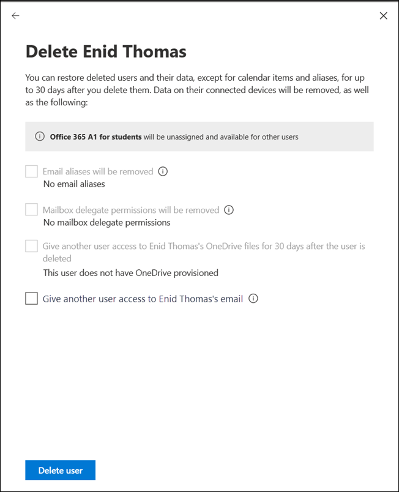
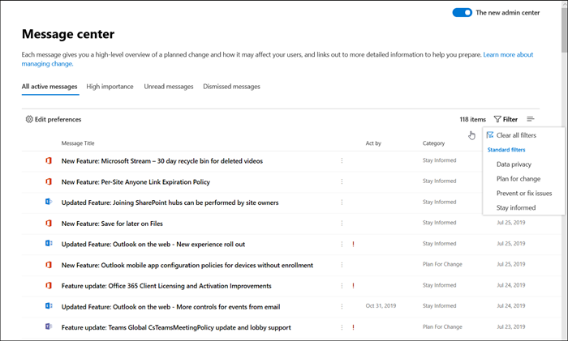
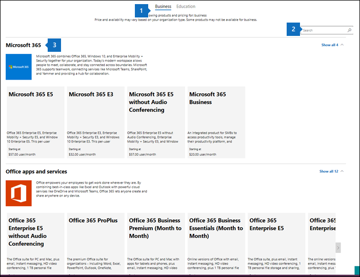
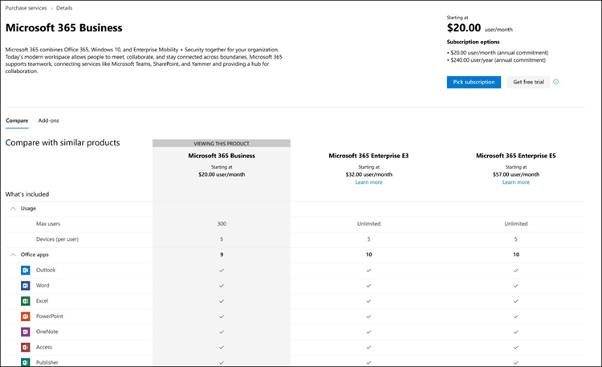

# Novità dell'interfaccia di amministrazione di Microsoft 365

Si aggiungono continuamente nuove funzionalità all'interfaccia di [amministrazione di Microsoft 365](microsoft-365-admin-center-preview.md), risolvendo i problemi che vengono apportati e modificando in base ai commenti e suggerimenti. Per sapere cosa è disponibile per l'utente, vedere di seguito. Alcune funzionalità vengono distribuite a velocità diverse per i clienti. Se non si vede ancora una funzionalità, [provare ad aggiungersi alla versione mirata](manage/release-options-in-office-365.md).

Se si è interessati alle novità in altri centri di amministrazione:

- [Novità nel centro conformità di Microsoft 365](https://docs.microsoft.com/Office365/SecurityCompliance/whats-new)
- [Novità dell'interfaccia di amministrazione di SharePoint](https://docs.microsoft.com/sharepoint/what-s-new-in-admin-center)

## Gennaio 2020-buon anno nuovo!

> [!NOTE]
> Lo sapevate che c'è una [novità di serie di video Microsoft 365](https://go.microsoft.com/fwlink/p/?linkid=2118096) su YouTube? In questo modo vengono evidenziate le funzionalità più recenti che sono state implementate dagli utenti. Ogni mese, si inizierà il collegamento all'ultimo episodio della sezione [video, formazione e documenti](#videos-training-and-docs) .     Ecco January's Episode: [January 2020-What ' s New in Microsoft 365](https://go.microsoft.com/fwlink/p/?linkid=2118096)

### Modalità scura

Quando è stata eseguita la modalità oscura per la prima volta, è disponibile solo nella Home page. La modalità oscura è ora fuori dall'anteprima ed è in rilascio mirato nella maggior parte delle pagine dell'interfaccia di amministrazione.

1. Per prima cosa, è necessario abilitare la **versione di destinazione** \> : andare a **impostazioni delle** \> impostazioni di **rilascio**del **profilo** \> dell'organizzazione. 
1. E quindi per abilitare la modalità oscura, andare alla **Home** page e quindi selezionare il pulsante **modalità scura** . (Accanto al campo di **ricerca** e al **nuovo** collegamento di questo articolo).
1. Per tutte le pagine con modalità scura disponibili, il pulsante si trova nella parte superiore della pagina, accanto al **nuovo interruttore dell'** interfaccia di amministrazione.

### Gestione di Office What ' s New Management

Gli amministratori desiderano controllare in che modo Microsoft comunica "cosa c'è di nuovo" ai propri utenti nelle app di Office e ora il controllo è disponibile. Andare a **Settings** \> **Office What ' s New Management Preview**. Selezionare una funzionalità per visualizzarne i dettagli, quindi è possibile selezionare il pulsante **Nascondi da utenti** se non si desidera che gli utenti visualizzino un messaggio specifico "Novità". Ad esempio, l'organizzazione potrebbe essere in attesa di consentire agli utenti di conoscere una funzionalità fino a quando non viene addestrato a tutti i presenti nell'org.

Questa funzionalità è stata rilasciata per la prima volta in anteprima nel novembre, ma ci sono stati alcuni aggiornamenti delle funzionalità che è necessario conoscere: [Office What ' s New Management Preview Updates Now Available](https://techcommunity.microsoft.com/t5/microsoft-365-blog/office-what-s-new-management-preview/ba-p/1020438)

### Partner
Salve, soci! (Non è stato possibile aiutarmi). Anche questo mese è stato aggiornato. È disponibile una nuova funzionalità che consente ai partner di concedere ai clienti CSP la possibilità di accettare il contratto di servizio Microsoft (MCA) nella sezione **account di fatturazione** dell'interfaccia di amministrazione. In questa nuova esperienza:

1. Il cliente riceve un messaggio di posta elettronica di invito con un collegamento per accettare la relazione tra partner e il MCA.
2. Dopo che il cliente ha eseguito l'accesso, può visualizzare e accettare le autorizzazioni MCA e partner-direttamente dall'interfaccia di amministrazione.

### Cassette postali per la risorsa

L'elenco delle cassette postali per le risorse è stato aggiornato al nuovo stile. Nell'interfaccia di amministrazione di Microsoft 365, accedere a **Resources** \> **Rooms & Equipment**.

### Video, formazione e documenti

Consultare la formazione di amministratore di Small Business che è stata rilasciata a gennaio:

- [Creare il sito Web aziendale](https://support.office.com/article/3325d50e-d131-403c-a278-7f3296fe33a9)
- [Trovare le risposte e la guida](https://support.office.com/article/7f681212-c649-4a3e-a43b-32b1d1e58988)
- [Ottenere assistenza o supporto tecnico](https://support.office.com/article/18948a4c-3eb1-4b30-b1bc-a4cc29eb7655)
- [Eliminare un utente](https://support.office.com/article/6bcdad7b-732a-4260-997a-8c176bc3d9d6)
- [Scegliere un abbonamento Microsoft](https://support.office.com/article/b9f7c78e-430f-4117-89ec-2eeb1dced2ca)
- [Panoramica della sicurezza aziendale di Microsoft 365](https://support.office.com/article/3274b159-a825-46d7-9421-7d6e209389d1)

## Novembre e dicembre 2019

Combiniamo le notizie di novembre e dicembre perché dopo l'accensione sono stati apportati pochissimi annunci. Ci vediamo nel nuovo anno.

### Passare dalla carta di credito al pagamento della fattura

Si sta iniziando a implementare la possibilità di modificare il metodo di pagamento dalla carta di credito a una fattura. Andare a prodotti per la **fatturazione** \> **& Servizi**, selezionare un abbonamento, quindi selezionare il collegamento **modifica** accanto al pagamento con carta di credito.

Vuoi saperne di più? [Passare dalla carta di credito o dal conto corrente bancario alla fattura](../commerce/billing-and-payments/change-payment-method.md#change-from-credit-card-or-bank-account-to-invoice)

### Ruolo con autorizzazioni di lettura globali

È stato menzionato il ruolo Global Reader nell' [edizione di ottobre 2019-Ignite](#october-2019---ignite-edition), ma, come si sta implementando più in generale, vengono illustrati alcuni dettagli:

- Il ruolo lettore globale è la controparte di sola lettura per il ruolo di amministratore globale. Il lettore globale può vedere tutto quello che l'amministratore globale ha l'autorizzazione a eseguire.
- Con alcune eccezioni, come alcune funzionalità di sicurezza e conformità, i lettori globali hanno accesso alla visualizzazione di tutti i centri di amministrazione cloud Microsoft che l'organizzazione ha la licenza di usare.
- Assegnare il ruolo di lettura globale agli utenti che ne hanno necessità per la pianificazione, i controlli e le indagini.
- È inoltre possibile combinare il ruolo lettore globale con un altro ruolo con meno autorizzazioni. Ad esempio, a un proprietario di piccole imprese potrebbe essere assegnato il ruolo di**lettore globale** dell' **amministratore** + della fatturazione in modo che possano pagare le bollette e rimanere al di sopra delle modifiche apportate alla propria organizzazione cloud.
- I lettori globali possono accedere a qualsiasi pagina dell'interfaccia di amministrazione di Microsoft 365. Quando si apre una pagina modificabile, nella parte superiore viene visualizzato un avviso che indica che non dispongono delle autorizzazioni necessarie per salvare le modifiche e che il pulsante Salva verrà disabilitato.

È possibile ottenere commenti e suggerimenti sul ruolo Global Reader e su qualsiasi delle autorizzazioni basate sui ruoli che si desidera visualizzare in futuro. [Fornire commenti e suggerimenti per le autorizzazioni basate sui ruoli](https://office365.uservoice.com/forums/273493-office-365-admin/suggestions/10115430-have-a-consistent-experience-when-assigning-admin)

### Pagina nuove impostazioni

Le pagine dei componenti aggiuntivi per il **profilo dell'organizzazione**, la **sicurezza & la privacy**e i **Servizi &** sono state tutte combinate in una pagina con 3 schede verticali. E la parte migliore, da una singola posizione, è ora possibile cercare tutte le impostazioni.

### Formazione & documenti

Questa sezione è una nuova funzionalità di questo articolo, in cui verrà avviato il collegamento a nuovi corsi di formazione e documentazione che riteniamo sia interessante.

A novembre sono stati rilasciati alcuni percorsi di apprendimento per il sito Web [Microsoft Learn](https://docs.microsoft.com/learn/) per aiutare i professionisti IT a conoscere e allenarsi su Microsoft 365. Estrarli:

- [Nozioni fondamentali su Microsoft 365](https://docs.microsoft.com/learn/paths/m365-fundamentals/)
- [Estendere i fondamenti di Office](https://docs.microsoft.com/learn/paths/extend-office-fundamentals/)
- [Microsoft 365-modernizzare la distribuzione aziendale con Windows 10 e Office 365 ProPlus](https://docs.microsoft.com/learn/paths/m365-getmodern/)
- [Gestire la distribuzione aziendale con Microsoft 365](https://docs.microsoft.com/learn/paths/manage-enterprise-deployment-m365/)
- [Aggiornare Microsoft Office per la scalabilità](https://docs.microsoft.com/learn/paths/m365-office-for-it/)
- [Fornire desktop e app Remote da Azure con desktop virtuale di Windows](https://docs.microsoft.com/learn/paths/m365-wvd/)
- [Modernizzare il proprio ambiente di lavoro con Microsoft 365 e Surface for business](https://docs.microsoft.com/learn/paths/modernize-workplace-with-m365-and-surface/)
- [Proteggere l'identità e l'accesso con Microsoft 365](https://docs.microsoft.com/learn/paths/m365-identity/)
- [Proteggere le informazioni aziendali con Microsoft 365](https://docs.microsoft.com/learn/paths/m365-information-protection/)
- [Gestire la sicurezza con Microsoft 365](https://docs.microsoft.com/learn/paths/m365-security-management/)
- [Difendersi dalle minacce con Microsoft 365 e Microsoft Threat Protection](https://docs.microsoft.com/learn/paths/m365-security-threat-protection/)
- [Gestire la collaborazione del team con Microsoft Teams](https://docs.microsoft.com/learn/paths/m365-manage-team-collaboration/)
- [Collaborare con SharePoint in Microsoft 365](https://docs.microsoft.com/learn/paths/m365-teams-sharepoint/)

## Ottobre 2019-Ignite Edition

Welcome to the Ignite Edition del What ' s New in Microsoft 365 Admin Center! Naturalmente, non si tratta di un elenco completo di annunci, ma ecco alcuni punti salienti. Inoltre, Guarda i Blog Ignite per maggiori informazioni sui rilasci:

- [Amministratori: sicurezza, produttività e miglioramenti della rete per Microsoft 365](https://techcommunity.microsoft.com/t5/Microsoft-365-Blog/ADMIN-Security-Productivity-and-Network-Enhancements-for/ba-p/964019).
- [Novità di Microsoft teams-ignite 2020](https://techcommunity.microsoft.com/t5/Microsoft-Teams-Blog/What-s-New-in-Microsoft-Teams-Ignite-2019/ba-p/937025).

### Controllo degli accessi in base al ruolo 

Sono state apportate numerose modifiche ai ruoli nell'interfaccia di amministrazione da quando è stata avviata la distribuzione in giugno:

- **Confronto dei ruoli** : selezionare fino a 3 ruoli per confrontare le autorizzazioni per ognuna di esse. Ciò consentirà di trovare il ruolo meno permissivo da assegnare agli utenti. Andare a **ruoli**, utilizzare la casella di controllo selezione multipla nella prima colonna per scegliere fino a 3 ruoli, quindi selezionare **Confronta ruoli**.

    

- **Preferiti** : è possibile aggiungere una stella ai ruoli preferiti o più utilizzati, in modo da poterli trovare facilmente ordinando la colonna o creando un filtro.
- **Gestione degli utenti** > **** attivi-questo è stato aggiornato per allineare le modifiche nei ruoli. Come con l'elenco dei ruoli, l'elenco predefinito di ruoli è stato definito come più utile, ma è possibile visualizzare tutti i ruoli espandendo **Mostra tutto in base alla categoria**.
- **Ruolo lettore globale** -l'hai chiesto! Ce l'hai fatta. Ruolo di [lettura globale](add-users/about-admin-roles.md#roles-available-in-the-microsoft-365-admin-center) .

### Segnalare un problema

Lo stato del servizio è stato aggiornato al nuovo stile e, se si ha un impatto su un problema che non viene visualizzato nel dashboard di integrità dei servizi, è possibile **segnalare un problema** per consentire a Microsoft di sapere. Andare a **** > **integrità del servizio**integrità.

### Abbonamenti "virali"

Come sapete, gli utenti possono abilitare abbonamenti gratuiti a una miriade di prodotti come Power BI e app Connect. È ora possibile visualizzare gli "abbonamenti virali" che gli utenti hanno provato. Accedere a prodotti di **fatturazione** > **& Servizi**. Selezionare il filtro **tipo di account** nella scheda abbonamenti per visualizzare le sottoscrizioni acquistate dall'utente. Se necessario, è ora possibile rimuovere tali abbonamenti dall'account.

### Modelli utente

I modelli consentono di aggiungere facilmente numerosi utenti salvando e riutilizzando le impostazioni condivise per tali utenti. È possibile salvare i valori per i ruoli, le licenze assegnate, le informazioni di contatto, la posizione e altro ancora. Quando si utilizza il modello per creare un nuovo utente, il valore salvato viene automaticamente ottenuto per queste impostazioni. Passare a **** > utenti**attivi**, quindi selezionare **modelli utente** per provarlo.

### Gestione di Office "What ' s New" (anteprima)
Quando una funzionalità di Office importante viene rilasciata a un'app di Office, gli utenti riceveranno una scheda "What ' s New" per conoscere la nuova funzionalità. Se non si desidera che gli utenti visualizzino la scheda, è possibile nasconderla. È inoltre possibile scegliere se si desidera che gli utenti visualizzino la scheda visualizzandola. Andare a **Settings** > **Office What ' s New Management** to check it out.

### Modifica dell'URL di SharePoint
Tecnicamente, non si tratta delle notizie del centro di amministrazione di Microsoft 365 da raccontare, ma siamo così entusiasti che volevamo assicurarci di vedere queste notizie:
> [!IMPORTANT]
> È ora possibile accedere all'interfaccia di amministrazione di SharePoint con un URL normale:https://admin.microsoft.com/SharePoint

Per altre informazioni, vedere [What ' s New in the SharePoint Admin Center](https://docs.microsoft.com/sharepoint/what-s-new-in-admin-center)

## Settembre 2019

Per alcuni entusiasmanti rilasci di funzionalità in Ignite 2019, si stanno annunciando solo alcune nuove funzionalità che sono state rilasciate a settembre. Ma rimanete sintonizzati per l'articolo del mese prossimo, sarà pubblicato il primo giorno di Ignite!

### Correzione dei commenti in primo piano: la possibilità di convertire la cassetta postale dell'utente eliminato in una cassetta postale condivisa è tornata!

I commenti e le risposte sono stati evidenti e sono stati riportati la possibilità di concedere agli utenti l'accesso a una cassetta postale di un utente eliminato mediante la conversione in una **cassetta postale condivisa**. Aggiungendo questo nuovo alla procedura guidata Elimina utente, è possibile decidere cosa fare con i dati:

- Posta elettronica: consente a qualcun altro di accedere alla cassetta postale dell'utente eliminato mediante la conversione in una cassetta postale condivisa.
- File: salvare i propri file di OneDrive e concedere l'accesso a un altro utente.
- Autorizzazioni: rimuovere le autorizzazioni se altre dispongono dell'accesso a questa cassetta postale.
- Alias: rimuovere gli alias di posta elettronica in modo che siano disponibili per l'utilizzo di un altro utente subito.

### Configurazione iniziale

Si è verificato un aggiornamento a un'altra delle procedure guidate per l'installazione iniziale: Microsoft 365 for business. I passaggi sono stati semplificati e sono state spostate due delle attività di configurazione nella pagina di installazione:

- Proteggere i **computer Windows 10** : configurare i criteri per proteggere meglio i dispositivi Windows 10 da virus, malware e attacchi da parte di hacker.
- **Installazione automatica di Office** : quando si attiva questa operazione e gli utenti hanno connesso i propri PC a Microsoft 365 business, i computer vengono aggiornati automaticamente alle più recenti app di Office e rimangono sempre aggiornati.

## Agosto 2019

### Fatturazione

Sono stati apportati alcuni aggiornamenti per la fatturazione e gli abbonamenti di questo mese:

- Abbonamenti basati su dispositivo: è possibile assegnare o annullare **l'assegnazione delle licenze di Office 365 ProPlus for Education (Device)** ai dispositivi nell'interfaccia di amministrazione di Microsoft 365. **Office 365 ProPlus for Education (Device)** è una licenza per i componenti aggiuntivi che consente di assegnare una licenza a un dispositivo. Accedere a prodotti di **fatturazione** > **& Servizi** per trovare e acquistare la licenza.
- Gestione delle licenze basata sull'utente: è stato aggiornato il **modo in** > cui si assegnano le licenze agli utenti**attivi** per il nuovo stile. Per altre informazioni, vedere:
    - [Assegnare licenze agli utenti](manage/assign-licenses-to-users.md)
    - [Annullare l'assegnazione delle licenze agli utenti](manage/remove-licenses-from-users.md)

### Aggiornamenti della pagina di installazione

Nel programma di installazione sono disponibili categorie e sezioni, tra cui una sezione **consigliata** , in cui è consigliabile eseguire il passaggio successivo per attivare le funzionalità e configurare l'organizzazione. Inoltre, è stata aggiunta una nuova funzionalità da configurare:

- **Protezione avanzata dalle minacce di Office** : se l'organizzazione ha la licenza di usare Office ATP e non è stata configurata o attivata, la pagina verrà visualizzata. Andare a **Setup** per provare.

### Segnalare un problema

Se si ha un impatto su un problema che non viene visualizzato nel dashboard di integrità dei servizi, la funzionalità **segnala un problema** fornirà un modo semplice e rapido per farci sapere. Andare a **** > **integrità del servizio**integrità.

## Luglio 2019

### Centro messaggi

Il centro messaggi è stato aggiornato al nuovo progetto e ha un aspetto sorprendente. 

- È ora possibile visualizzare **i messaggi in base allo stato**. È sufficiente selezionare una delle schede: **tutti i messaggi attivi**, la **priorità alta**, **i messaggi non letti**e **i messaggi ignorati**.
- È inoltre possibile filtrare in base alla **privacy dei dati**delle categorie, **pianificare la modifica**, **prevenire o risolvere i problemi**e mantenere le categorie di messaggi **informate** .
- Selezionare un messaggio dall'elenco e sono disponibili alcune opzioni nella barra dei comandi: **Ignora**, **Contrassegna come lettura** o **Segna come non letto**o **Condividi**. 
- Quando si apre un messaggio, sono disponibili altre opzioni:
    - Copiare un collegamento del messaggio negli Appunti per salvarlo in un secondo momento o condividerlo con i colleghi. 
    -  Contrassegnare i messaggi come **letti** o non **letti**. 
    -  Fornire commenti e suggerimenti su un messaggio selezionando **like** o **antipatia**, viene visualizzato un riquadro di feedback che richiede di fornire commenti e suggerimenti specifici su ciò che è piaciuto o non è stato apprezzato per questo messaggio.

### Intelligence del riquadro di spostamento

 Nel riquadro di spostamento vengono ora memorizzate le ultime azioni e viene visualizzato il riquadro nell'ultimo stato in cui è stato lasciato. Renderà inoltre visibili gli elementi utilizzati di frequente per impostazione predefinita.

### Configurazione iniziale & pagina di installazione
Sono state apportate modifiche entusiasmanti che consentono di configurare l'organizzazione. Prima di tutto, discutiamo la differenza tra l' **installazione** e la **pagina di installazione**. Il **programma di installazione** si riferisce all'installazione guidata iniziale utilizzata per l'onboarding ai servizi online di Microsoft. Che in genere include tre passaggi specifici: **connettere un dominio**, **aggiungere utenti**e **scaricare le app di Office**. La **pagina di installazione** è la pagina nell'interfaccia di amministrazione che ha raccomandato di configurare le attività per essere certi di ottenere il massimo dai propri abbonamenti, come l'attivazione delle caratteristiche per le quali sono state acquistate le licenze.

- **Setup** : l'installazione guidata iniziale è stata aggiornata per gli abbonamenti di **Office 365 for business** . Questo nuovo progetto aiuterà le nuove organizzazioni a superare la procedura guidata più velocemente e con maggiore successo.
- **Pagina di installazione** : la pagina di **installazione** consente di terminare la configurazione e la protezione dei servizi disponibili con gli abbonamenti. È inoltre possibile visualizzare eventuali suggerimenti disattivati nella pagina di **installazione** . Per vedere se è ancora disponibile per gli abbonamenti, passare alla > **configurazione**dell'interfaccia di **amministrazione di Microsoft 365**.

### Abbonamenti & di fatturazione

- Tipo di prodotto **software** -è ora possibile visualizzare i prodotti software acquistati tramite un provider di servizi cloud (CSP). Per visualizzare i download e le chiavi, accedere alla scheda**software** prodotti **fatturazione** > **& Servizi** > .
- È possibile visualizzare i prodotti e i servizi di Azure moderni dall'interfaccia di amministrazione di Microsoft 365, indipendentemente dal fatto che siano stati acquistati da Microsoft o da un provider di terze parti. Esempi di prodotti di Azure moderni inclusi:
    - Istanze virtuali riservate di Azure
    - Piani di supporto di Azure
    - Vantaggi dell'utilizzo ibrido di Azure (AHUB)
    - Gestione delle applicazioni
    - Servizi per dispositivi
    - Abbonamenti di Azure

### Semplificare l'autenticazione a più fattori

Gli amministratori hanno accesso alle informazioni riservate nell'organizzazione. Richiedere a tutti gli amministratori di utilizzare l'autenticazione a più fattori quando si effettua l'accesso. La nuova procedura guidata consente di ottenere l'operazione con un solo passaggio. Per provarlo, passare a **installazione** > **rafforzare la sicurezza di accesso**.

### Utenti

Le pagine degli **utenti eliminati** e **degli utenti Guest** sono state aggiornate nel nuovo stile.

- **Utenti Guest**: si aggiungono gli utenti Guest invitandoli a visualizzare o condividere file da SharePoint o OneDrive. È possibile visualizzare **gli utenti Guest dagli** > utenti**Guest**.
- **Utenti eliminati**: nella pagina aggiornamento **utenti eliminati** è possibile eseguire tutte le azioni possibili nell'interfaccia di amministrazione precedente, ma ora si aggiungono e si rimuovono le colonne. E ci sono molte opzioni di colonna tra cui scegliere. In effetti, sono le stesse colonne che è possibile scegliere nella pagina **utenti attivi** .

## Giugno 2019

### Richiesta di feedback in primo piano-modalità oscura

La visualizzazione dell'interfaccia di amministrazione in modalità oscura è in anteprima. È possibile eseguire il testing nella **Home** page solo in questo momento. Nella **Home** page, il pulsante **modalità scura** si trova nella barra dei comandi accanto al collegamento **novità** .

### Gestione dei ruoli

Alla fine di giugno sono stati avviati nuovi modi per gestire i ruoli di amministratore. Quando è disponibile per l'utente,**** passare a **** > ruoli ruoli. Fino ad allora, dai un'occhiata-è impressionante!
    

Questa nuova esperienza rende più facile vedere chi ha le autorizzazioni di amministratore e assegnare ruoli che conferiscono il livello di accesso appropriato agli amministratori. Inoltre, sono stati aggiunti altri ruoli da Azure AD, in modo da non perdere tempo per passare a più centri di amministrazione.
Cos'altro è possibile eseguire qui?
- Esportare un elenco di tutti gli amministratori dell'organizzazione a cui sono assegnati ruoli di Azure Active Directory in Microsoft 365.  
- Visualizzare tutti gli amministratori assegnati a un ruolo specifico, aggiungere o rimuovere amministratori da un ruolo specifico, ricercare i ruoli per nome e parola chiave e ottenere ulteriori informazioni su ciò che ogni ruolo consente a un utente di eseguire. 
- Ricercare rapidamente un ruolo specifico e creare filtri.

### Metodo di pagamento
Il modo in cui si pagano gli abbonamenti è stato aggiornato. Accedere alle **** > **fatture** > di fatturazione &**modalità di pagamento**dei pagamenti. È possibile visualizzare i metodi di pagamento in una visualizzazione elenco. Selezionare un elemento nell'elenco per rimuoverlo, modificarlo e visualizzare facilmente la sottoscrizione a cui è associato il metodo di pagamento.

## Maggio 2019

### La sensibilità del Fix-case descritta in maggio
Quando si esegue la ricerca di cassette postali condivise, contatti, risorse e autorizzazioni per le cassette postali, i termini di ricerca non devono essere sensibili ai casi. 

**Gestione di utenti e gruppi** Questo mese è stato aggiornato il **blocco degli utenti**, la **reimpostazione della password**, la visualizzazione elenco **contatti** , la visualizzazione elenco **gruppi** e le pagine dei dettagli per i **gruppi** nel nuovo stile dell'interfaccia di amministrazione.
- Con la visualizzazione elenco nuovi **gruppi** , è possibile ottenere dati più dettagliati sui gruppi e personalizzare il modo in cui vengono visualizzati i dati e l'elenco dei gruppi ricorda come visualizzare i dati. Ad esempio, è ora possibile filtrare i **gruppi con i team** per vedere se i gruppi fanno parte di un team ed è possibile aggiungere la colonna **stato teams** .
- L'elenco dei gruppi comporta anche tutti i miglioramenti apportati all'esperienza di elenco nella gestione degli utenti, incluse le azioni rapide e la barra dei comandi contestuale. 

**Consigli** 
Potrebbe essere visualizzato un nuovo suggerimento popup nell'interfaccia di amministrazione-sono state aggiunte solo 4 nuove. Naturalmente, è possibile visualizzare solo i suggerimenti se si ritiene che possano essere utili per l'organizzazione. Tuttavia, non aspettare fino a quando non viene visualizzata la Raccomandazione: è possibile aggiungerla alla raccolta schede.
- **Scadenza password** : è consigliabile che le password vengano impostate su **Never expire**. Se l'organizzazione dispone di un'impostazione diversa, è possibile che venga visualizzato il seguente suggerimento. 
- **Troppi amministratori globali** , poiché la presenza di un numero eccessivo di amministratori globali è una minaccia per la sicurezza, se si dispone di più di 4 amministratori globali, verrà visualizzato questo suggerimento. Si consiglia di concedere agli utenti solo l'accesso di cui hanno bisogno per svolgere il proprio lavoro.
- **Protezione dei dispositivi di Intune** -se le licenze includono Intune e si rileva che non è stata completata la configurazione di Intune o che i dispositivi sono stati registrati, si consiglia di creare un criterio di Intune per proteggere i file dell'organizzazione quando gli utenti accedono ai propri dispositivi mobili.
- **Ottenere gli aggiornamenti mensili delle funzionalità di Office** : sono stati ricevuti commenti e suggerimenti dai clienti molto piccoli che, quando ricevono gli aggiornamenti mensili delle funzionalità di Office, gli utenti sono più contenti. Pertanto, se si è un'azienda di piccole dimensioni e si è attualmente ottenere gli aggiornamenti delle funzionalità di Office ogni sei mesi, verrà visualizzato il seguente suggerimento.

**Impostazioni**  
Per quanto riguarda le impostazioni, sono state apportate alcune modifiche. In genere, è sufficiente aggiornare le impostazioni esistenti al nuovo stile dell'interfaccia di amministrazione. Man mano che si sta procedendo in avanti e si aggiungono nuove impostazioni che non sono mai state viste prima, si inizierà a menzionarle qui. Per annunciare **l'autenticazione moderna**, è presente un'impostazione di un intero. Sì, è disponibile una nuova impostazione per abilitare **l'autenticazione moderna**. Per eseguire il check- > out, passare a **Impostazioni** > **Servizi &****l'autenticazione moderna**dei componenti aggiuntivi.

## Aprile 2019

Le attività sono ottimali per l'interfaccia di amministrazione. Sono state leggere i commenti e suggerimenti, rispondere alla maggior parte di essi e prendere davvero tutto quello che dovete dire a Heart. Naturalmente, stiamo ancora facendo il lavoro per assicurarsi che tutto sia a parità con l'interfaccia di amministrazione precedente. E ricorda: quando si distribuiscono nuove funzionalità, potrebbe non essere possibile ottenerlo subito.

### Feature in primo piano-aggiungere utenti

Per aprile, è presente la procedura guidata **Aggiungi utente** che illustra i passaggi... Aspetta... Aggiunta di utenti. Si tratta di una procedura dettagliata per aggiungere le informazioni di base dell'utente come la posta elettronica e il nome visualizzato, l'assegnazione di una licenza e un ruolo, l'aggiunta di informazioni di contatto e la revisione dell'account dell'utente prima di eseguire il commit. **Perché è stata apportata questa modifica?** Sono stati apportati commenti e suggerimenti che non sono stati graditi dall'infinità dello scorrimento per aggiungere utenti nell'esperienza precedente.
    

È possibile effettuare il check-out in due modi:  

1. Nella **Home** page, selezionare **Aggiungi utente** dalla scheda di **Gestione utente** . La procedura guidata viene aperta direttamente in questo modo, quindi non è necessario spostarsi da qualsiasi lavoro che si sta svolgendo nella **Home** page.
2. Passare a **** > utenti**attivi**, quindi selezionare **Aggiungi utente** dalla barra dei comandi.
  
Sono state apportate alcune altre modifiche alla **gestione degli utenti**, ecco un elenco rapido:
- Il riquadro **Gestisci ruoli** è stato aggiornato al nuovo stile ed è accessibile. È stato inoltre aggiornato il **blocco utente** ed **eliminare** i riquadri utente nel nuovo stile.
- **Gestire le licenze di prodotto** modificate nella barra dei comandi.
- La modifica della foto di un utente è ora più facile. In **utenti attivi** selezionare un utente e quindi **cambiare foto** sotto la propria immagine.

### Ma aspetta! C'è dell'altro...
- Nella **Home** page è presente un nuovo banner di installazione che vedrà se non sono stati completati i passaggi di configurazione, ad esempio l'aggiunta di un dominio, l'aggiunta di utenti e il download delle app di Office.
- Il riquadro elenco e dettagli **gruppo** è stato aggiornato al nuovo stile. Andare ai **** > **gruppi** di gruppi per visualizzare le modifiche. 
    - A proposito di gruppi, è stata aggiunta una scheda **Microsoft teams** per il riquadro dei dettagli dei gruppi, in cui è possibile trasformare qualsiasi gruppo di Office 365 in un team. Per "teamify" un gruppo seleziona un gruppo di Office 365 dall'elenco, seleziona la scheda **Microsoft teams** e quindi **Crea team**. Se il gruppo è già un team, si otterrà un collegamento per gestirlo dall'interfaccia di **amministrazione dei team**.
    - Infine, è possibile aggiungere lo **stato dei team** all'elenco **gruppi** . Nell'intestazione di colonna selezionare **Scegli colonne** > **stato** > Team**Save**.
- **Nuovi ruoli di amministratore limitati** -sono stati rilasciati alcuni nuovi ruoli di amministratore in modo da consentire agli utenti solo l'accesso di cui hanno bisogno.
    -  **Amministratore di Kaizala**: gli utenti di questo ruolo dispongono dell'autorizzazione per eseguire tutte le attività di gestione in Microsoft Kaizala, tra cui la creazione e la gestione degli utenti nella directory di Kaizala, la gestione dei gruppi di Kaizala, la gestione di schede e connettori e la creazione di richieste di servizio.
    - **Amministratore della ricerca**: gli utenti di questo ruolo hanno accesso completo a tutte le funzionalità di gestione di Microsoft Search nell'interfaccia di amministrazione di Microsoft 365. Gli amministratori della ricerca possono delegare i ruoli dell'amministratore della ricerca e dell'editor di ricerca agli utenti e creare e gestire il contenuto, ad esempio i segnalibri, Q&elementi e posizioni. Inoltre, questi utenti possono visualizzare il centro messaggi, monitorare lo stato del servizio e creare richieste di servizio.
    - **Editor di ricerca**: gli utenti di questo ruolo possono creare, gestire ed eliminare contenuto per Microsoft Search nell'interfaccia di amministrazione di Microsoft 365, inclusi i segnalibri, la Q&elementi e le posizioni.
- C'è un Bonanza delle modifiche alla **fatturazione** di questo mese...
    - È ora possibile aggiornare il CVV per le carte di credito esistenti senza dover eliminarlo e aggiungerlo di nuovo. È possibile aggiornare il CVV accedendo ai**metodi di pagamento**delle **fatture** > .
    - È stato più facile individuare le **fatture** e comprendere eventuali problemi di fatturazione che il tuo account potrebbe avere. E ora è possibile visualizzare le bollette nel Web browser invece di dover scaricare il file PDF. Vai a **fatture bollette** > **.**
    - Nella pagina **prodotti & Servizi** , ora vengono aggregate le informazioni di sottoscrizione se sono presenti più abbonamenti dello stesso tipo.

## 2019 marzo-abbiamo rilasciato ufficialmente l'interfaccia di amministrazione!

Ebbene, se si sono perse le notizie entusiasmanti, è stata ufficialmente rilasciata la nuova e migliorata interfaccia di amministrazione di Microsoft 365. Di seguito è indicato il post di Blog in cui è stato annunciato: [il nuovo interfaccia di amministrazione di Microsoft 365 disponibile oggi](https://techcommunity.microsoft.com/t5/Microsoft-365-Blog/The-new-Microsoft-365-admin-center-available-today/ba-p/377870). Per marzo, faremo affidamento sul post di Blog per controllare le funzionalità rilasciate-Plus, è anche possibile leggere il post per le caratteristiche che vengono rilasciate nel prossimo futuro, cosa che non è consentito eseguire nel contenuto di base.
    
Si dispone di una modifica all'area **fatturazione & abbonamenti** che si desidera menzionare. Insomma, tutti voi non credevamo che avessimo smesso di migliorare, vero? Perché non lo siamo. Questo mese, infatti, è stata aggiunta la possibilità di gestire le relazioni con i **partner per gli** > **account di fatturazione**. Da qui è possibile esaminare le relazioni con i partner tra consulenti, CSP e rivenditori indiretti. È inoltre possibile accettare nuove richieste di relazione partner, incluse le autorizzazioni di amministratore Delegate.

Come sempre, il feedback è importante per noi, quindi continua a venire! In qualsiasi pagina dell'interfaccia di amministrazione, è possibile fornire commenti e suggerimenti selezionando **Invia commenti e suggerimenti** in basso a destra, accanto a **bisogno di assistenza?**

## Febbraio 2019-fatturazione & abbonamenti

Questo mese, è necessario concentrarsi su tutti i miglioramenti apportati alle aree affettuosamente denominate "fatturazione e abbonamenti". In passato, probabilmente non si riferisce a queste cose con affetto, ma pensiamo che sarà ora...

- **Metodi di pagamento** : sono stati apportati commenti e suggerimenti per il fatto che l'aggiornamento del metodo di pagamento è stato difficile e sono state apportate numerose modifiche. Passare a **** > **modalità di pagamento**fatturazione. È possibile visualizzare facilmente i metodi di pagamento, come la carta di credito Visa, e l'abbonamento a cui è associato. Nell'elenco dei metodi di pagamento, selezionare il menu **altro** (3 puntini accanto alla data di scadenza), quindi selezionare **Visualizza abbonamenti**. È inoltre possibile modificare ed eliminare i metodi di pagamento utilizzando il menu **altro** .
- **Account di fatturazione** i clienti con rilascio mirato vedranno la prima pagina del nuovo account di fatturazione e poi lo rilasceremo a livello mondiale. Quando è disponibile per l'utente, accedere a **** > **account di fatturazione**fatturazione. Cosa è possibile fare nella nuova pagina account di fatturazione? Sono contento che mi hai chiesto:
  - Aggiornare l'indirizzo e altre informazioni di contatto nel profilo dell'organizzazione direttamente da questa pagina. Non è necessario andare al**profilo dell'organizzazione** **delle impostazioni** > , a meno che non si desideri.
  - Per rendere più semplice la gestione dei clienti con contratti multilicenza o diretti, è possibile accettare ed esaminare gli accordi dei clienti dagli **account di fatturazione**. È inoltre possibile connettersi con altri org che consentano di collegare i org insieme per condividere licenze e risorse.
- Inoltre, sono stati apportati alcuni miglioramenti più piccoli e correzioni degli errori:
  - Riattivare un abbonamento con un pagamento in fattura
  - Modificare l'indirizzo di utilizzo del servizio per le sottoscrizioni
  - Nella pagina dettagli inventario sono stati aggiunti alcuni miglioramenti relativi alla notifica, che consentono di collegare la pagina in cui è possibile eseguire il lavoro e sono disponibili altre azioni sulla scheda dettagli inventario. Andare a **** > **fatture** > di fatturazione**visualizzare i dettagli** su qualsiasi fattura.

## Gennaio 2019-buon anno nuovo!

- Ancora in aggiunta nei **servizi & componenti** aggiuntivi: sono state aggiornate altre pagine delle **impostazioni > Servizi & componenti** aggiuntivi. Provare le app o i report integrati per visualizzare le informazioni più recenti.
- **Ricerca di miglioramenti?** Non guardare oltre la casella di **ricerca** nella barra dei comandi. È stato aggiornato in modo da consentire la ricerca di attività. Ad esempio, provare a "reimpostare la password" o "aggiungere un utente".

### FIX commenti e suggerimenti in primo piano-licenze e app

Sono state ricombinate le **licenze e le app** nel riquadro dei dettagli dell'utente in base ai commenti e suggerimenti. Inizialmente sono state separate le due caratteristiche per fornire spazio ai dettagli di tutte le licenze e tutte le possibilità delle app. È stato sentito da voi che la separazione delle licenze e delle app in due riquadri ha aggiunto confusione. Sono state ascoltate e sono state riportate le licenze e le app in una sola scheda. A questo punto, è possibile verificare che un'app sia disattivata in tutte le licenze assegnate a un utente in un unico riquadro. Latte e biscotti. Licenze e app. Lo otteniamo subito.

Check it out: **gli utenti > utenti attivi > modificare** o **aggiungere licenze e app per > utente**.

## Dicembre 2018

- **Servizi & componenti** aggiuntivi-in ottobre sono stati aggiornati i servizi di **Impostazioni** \> **& i componenti** aggiuntivi con il nuovo stile di progettazione, ma tutte le pagine delle impostazioni erano ancora in stile classico. Questo mese, è stata avviata l'aggiornamento delle impostazioni effettive alla nuova struttura. Consultare le **prenotazioni** per visualizzare il nuovo aspetto.
- **Gestione utenti** -gestire nome utente, alias, indirizzo di posta elettronica principale.
- Sono state aggiunte due Home card alla raccolta. È possibile leggere le descrizioni complete nella raccolta.
  - **Registrazione del dispositivo Intune**
  - **Domini**
- **Suggerimenti** : è possibile che venga visualizzato un nuovo suggerimento popup nell'interfaccia di amministrazione. Naturalmente, è possibile visualizzare solo i suggerimenti se si ritiene che possano essere utili per l'organizzazione. Tuttavia, non aspettare fino a quando non viene visualizzata la Raccomandazione: è possibile aggiungerla alla raccolta schede.
  - **Protezione delle informazioni riservate** : è consigliabile creare un criterio di prevenzione della perdita di dati (DLP) per rilevare quando gli elementi contenenti informazioni riservate vengono condivisi con utenti esterni all'organizzazione.

## Novembre 2018

- La casella di ricerca è tornata! E lo spostammo leggermente. È ancora nella parte superiore della Home page, ma è ora sul lato destro della pagina accanto al pulsante **Aggiungi scheda** .   

- Sono state aggiunte schede per il dashboard. Basta andare all'interfaccia di amministrazione e selezionare **Aggiungi scheda** per visualizzare le nuove schede:
  - **Report di office 365 Active users** -monitorare l'utilizzo dei servizi di Office 365 acquistati.
  - **Office 365 software** -installare o distribuire Office 365 ProPlus software e vedere il numero di utenti con licenza attivati.
  - **Azure Active Directory** : consente di accedere rapidamente alle attività comuni di Azure ad, come la reimpostazione delle password self-service, la personalizzazione dell'accesso e l'aggiunta di app.
- L'attività di **esportazione rapida degli utenti** è stata aggiunta alla barra dei comandi nella pagina utenti attivi. 
- Per i servizi di acquisto sono disponibili ulteriori miglioramenti per novembre. E sono tutti buoni! Per arrivarci, vai a fatturazione > acquisto di servizi.  
  > 1.  Nella parte superiore della pagina, è possibile pivot tra i piani di business e dell'istruzione. Questo ti aiuterà a trovare quello che stai cercando.
  > 2.  È stata aggiunta una casella di ricerca in modo da non dover scorrere all'infinito per trovare ciò che si sta cercando.
  > 3.  Infine, sono stati ordinati logicamente i piani che è possibile acquistare in sezioni che è possibile espandere e comprimere. Non è necessario acquistare le **app e i servizi di Office**? Comprimere la sezione e concentrarsi sui piani di Microsoft 365.

## Ottobre 2018

- C'è un nuovo modo di acquistare abbonamenti nell'interfaccia di amministrazione di Microsoft 365. Accedere a **servizi di acquisto** per visualizzare l'esperienza di acquisto completamente riprogettata che rende più semplice la ricerca, il confronto di piani e altre nuove funzionalità che facilitano l'acquisto di un abbonamento.  

- La pagina **Servizi e componenti** aggiuntivi è stata aggiornata per il nuovo aspetto, ma tutto il resto è esattamente lo stesso. Naturalmente, è consigliabile estrarre la barra dei comandi per visualizzare le nuove operazioni che è possibile eseguire, ad esempio il filtro e la modifica dell'elenco in visualizzazione compatta. Nel riquadro di spostamento, accedere ai **** \> **componenti aggiuntivi &amp; Servizi** impostazioni per estrarla.  

## Settembre 2018

- **Miglioramenti della casa** La Home page è stata completamente rieseguita e non è possibile attendere che tu lo provi e Vedi cosa pensi. Questa è la Home page personale e non influenzerà le Home page di altri amministratori dell'organizzazione.  

  - È possibile aggiungere, rimuovere e spostare le schede Home page attorno alla Home page. Selezionare **+ Aggiungi carta** nell'angolo in alto a destra per vedere quali schede sono disponibili nella raccolta schede e quindi trascinarle in un punto qualsiasi della Home page. Non ti piace dove è atterrato? Trascinalo nel punto desiderato. Non è neanche necessario salvare altro.

  - Eseguire l'organizzazione al livello successivo raggruppando le schede nelle sezioni. Per l'utente sono state create due sezioni predefinite: **nozioni di base** e **dispositivi e aggiornamenti.** Molto presto, sarà possibile aggiungere, rimuovere e rinominare sezioni per progettare una Home page che funzioni per l'utente.

  - La maggior parte delle schede sono informative e utilizzabili, il che significa che sarà possibile fornire informazioni just-in-time che consentono di eseguire le attività quotidiane in modo più rapido ed elegante.

  - Il riquadro di spostamento è stato riorganizzato ed è possibile personalizzarlo per le attività rapide. È sufficiente selezionare **modifica** dalla parte inferiore del riquadro di spostamento per avviare la personalizzazione.  

- **Fatturazione** È probabile che si notino alcune delle modifiche più importanti all'interfaccia di amministrazione di Microsoft 365 nella sezione fatturazione. È possibile gestire gli abbonamenti e le app acquistati da Microsoft o da un altro fornitore, incluse nuove esperienze per la gestione dell'inventario, la cronologia degli ordini, i metodi di pagamento e la fatturazione.

  - La gestione della sottoscrizione è stata riprogettata per offrire una nuova esperienza di gestione dell'inventario per più tipi di prodotto, tra cui app, software e componenti aggiuntivi. Ora è denominato **servizi prodotti &amp; ** per riflettere meglio il supporto per i nuovi tipi di prodotto da aggiungere. È ora possibile scegliere di disporre di una scheda o di una visualizzazione tabella dei prodotti e servizi ed è possibile cercare e filtrare per trovare rapidamente ciò che si sta cercando.  

  - Ora è più facile che mai assegnare una licenza di prodotto agli utenti. Selezionare il prodotto acquistato, quindi è possibile assegnare il prodotto. È anche possibile vedere a quali utenti è già stato assegnato un prodotto specifico.  

  - I **piani degli switch** sono ora denominati * * upgrade * * e infine gli aggiornamenti della sottoscrizione avvengono dietro le quinte, quindi non è necessario guardare l'aggiornamento completo. Infine, non esiste più una limitazione di licenza per gli aggiornamenti.

- **Gestione degli utenti** Sono state apportate numerose modifiche alla gestione degli utenti per velocizzare il lavoro. È stata aggiornata la pagina * * utenti attivi * * e il riquadro dei dettagli dell'utente. Di seguito sono riportate alcune delle modifiche più impressionanti:

  - La pagina **utenti attivi** contiene una nuova struttura e un nuovo layout. Non ti piace la modalità di visualizzazione dell'elenco? Selezionare **Cambia visualizzazione** (accanto a **filtro**) ed è possibile modificare l'elenco dall'elenco **normale** all' **elenco compatto**. Elenco compatto è particolarmente utile se sono presenti molti utenti nell'organizzazione.  

  - La barra dei comandi (dove vive la **ricerca** ) è dinamica e l'elenco delle azioni cambierà a seconda del numero di utenti selezionati: non sono presenti utenti, un utente o più utenti. Vedrai anche quanti utenti sono stati selezionati accanto a **Cerca**.  

  - È possibile eseguire attività rapide come la reimpostazione delle password per singoli o più utenti direttamente dalla visualizzazione elenco.

  - I dettagli e le impostazioni dell'utente sono ora organizzati dalle seguenti schede: **account**, **dispositivi**, **licenze**, **app**, **posta**e **OneDrive**. In precedenza, molte di queste impostazioni erano situate su più schermate.   
