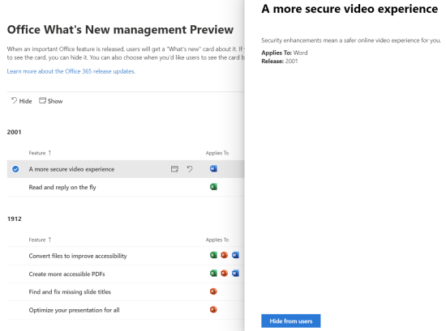
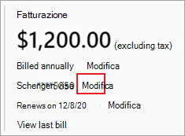
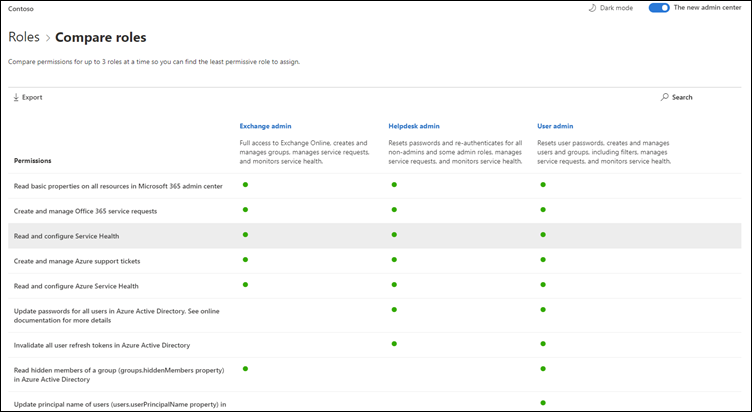
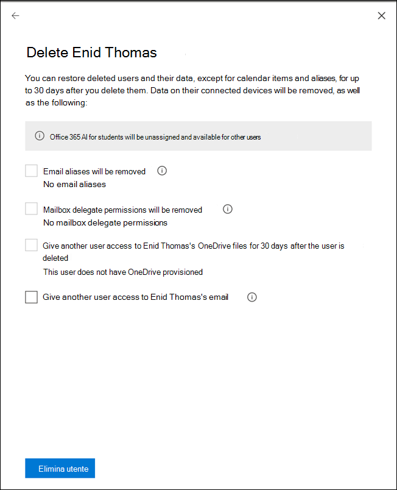

# Novità dell'interfaccia di amministrazione di Microsoft 365

::: moniker range="o365-21vianet"

> [!NOTE]
> Alcune delle informazioni contenute in questo articolo potrebbero non essere valide per Office 365 gestito da 21Vianet.

::: moniker-end

Si aggiungono continuamente nuove funzionalità all'interfaccia di [amministrazione di Microsoft 365](microsoft-365-admin-center-preview.md), risolvendo i problemi che vengono apportati e modificando in base ai commenti e suggerimenti. Per sapere cosa è disponibile per l'utente, vedere di seguito. Alcune funzionalità vengono distribuite a velocità diverse per i clienti. Se non si vede ancora una funzionalità, [provare ad aggiungersi alla versione mirata](manage/release-options-in-office-365.md).

Se si desidera sapere cosa c'è di nuovo con altri servizi cloud Microsoft:

- [Novità di Azure Active Directory](https://docs.microsoft.com/azure/active-directory/fundamentals/whats-new)
- [Novità dell'interfaccia di amministrazione di Exchange](https://docs.microsoft.com/Exchange/whats-new)
- [Novità di Microsoft Intune](https://docs.microsoft.com/mem/intune/fundamentals/whats-new)
- [Novità nel centro conformità di Microsoft 365](https://docs.microsoft.com/Office365/SecurityCompliance/whats-new)
- [Novità di Microsoft 365 Defender](https://docs.microsoft.com/microsoft-365/security/mtp/whats-new)
- [Novità dell'interfaccia di amministrazione di SharePoint](https://docs.microsoft.com/sharepoint/what-s-new-in-admin-center)
- [Aggiornamenti di Office](https://docs.microsoft.com/OfficeUpdates/)

## Ignite 2020 (agosto & settembre)

Benvenuto in Microsoft Ignite-la prima accensione solo online. Si spera di vederla in una delle nostre sessioni: [Microsoft ignite 2020 Session Catalog](https://myignite.microsoft.com/sessions). Di seguito sono riportate alcune delle informazioni di cui parleremo a Ignite. 
> [!NOTE]
> Non tutte le funzionalità sono disponibili per tutti gli utenti immediatamente. Se non si vedono le nuove funzionalità, [partecipare a Release mirate](manage/release-options-in-office-365.md).

### Gestione multi-tenant

Sono state sviluppate una serie di funzionalità per gli amministratori multi-tenant come te per ottenere il lavoro più rapido ed efficiente. Per ulteriori informazioni, vedere [gestire più tenant](multi-tenant/manage.md).

- **I tenant**: passano rapidamente tra i tenant gestiti.
- **Tutti i tenant**: una nuova pagina in cui è possibile visualizzare rapidamente l'integrità di tutti i servizi dei tenant, le richieste di servizi aperti, i prodotti e la fatturazione, le attività di installazione consigliate e il numero di utenti nel tenant.
- **Setup**: la pagina di installazione multi-tenant fornisce una visualizzazione elenco della pagina di installazione, ma è organizzata per molti tenant. È possibile vedere quali funzionalità non sono attivate, quali attività sono complete per tutti i tenant, attività che devono essere completate dai tenant. Questa visualizzazione consentirà di tenere conto dell'adozione delle funzionalità e di verificare che le attività di configurazione della sicurezza consigliate vengano sempre eseguite.
- **Integrità del servizio**: la visualizzazione dell'integrità del servizio Mostra se eventuali incidenti o avvisi interessano i tenant. Verrà anche illustrato il numero di tenant gestiti coinvolti. È sufficiente selezionare un evento imprevisto per ottenere ulteriori informazioni sulla scheda Panoramica, quindi passare alla scheda tenant affected per eseguire il drill-down e il supporto del tenant.
- La **migrazione delle cassette postali tra tenant** è un nuovo servizio, ora in anteprima pubblica, che consente di spostare le cassette postali tra i tenant senza dover trasferisce e quindi di onboard Mailboxes. 
- **Condivisione dei domini tra tenant**: in breve, è possibile partecipare a un'anteprima privata per le funzionalità che consentono di condividere un dominio tra più tenant. Ad esempio, se contoso acquisisce i giocattoli di Wingtip, Contoso può condividere il dominio con i giocattoli di Wingtip, in modo che gli utenti di entrambi i tenant possano utilizzare "contoso.com" come indirizzi di posta elettronica.

### Monitorare gli account più importanti

È possibile monitorare e tenere conto dei messaggi di posta elettronica non riusciti o ritardati inviati agli utenti che hanno un impatto aziendale elevato, come il CEO. Gli account di priorità vengono registrati aggiungendo gli utenti all'elenco degli account prioritari nell'interfaccia di amministrazione di Microsoft 365. Aggiungere dirigenti, dirigenti, Manager o altri utenti che hanno accesso a informazioni sensibili o ad alta priorità.

Gli account di priorità sono disponibili solo per le organizzazioni che soddisfano entrambi i requisiti seguenti:

- Office 365 E3 o Microsoft 365 E3 o Office 365 E5 o Microsoft 365 E5.
- Almeno 10.000 licenze e almeno 50 mensili degli utenti di Exchange Online attivi.

Per iniziare, sono disponibili due modalità:

- Andare a **utenti**, quindi nel menu "altre azioni" selezionare **Gestisci gli account prioritari** per aggiungere gli utenti all'elenco.
- Andare a **installazione**, trovare l'attività di installazione **monitorare gli account più importanti**, quindi selezionare **inizia**.

Per altre informazioni sugli account prioritari, vedere [monitoraggio degli account prioritari](https://docs.microsoft.com/microsoft-365/admin/setup/priority-accounts).

### Eseguire una ricerca più rapida e ottenere risultati migliori da qualsiasi pagina

È stata avviata l'implementazione di una nuova esperienza di ricerca per l'interfaccia di amministrazione e non è possibile attendere che venga eseguita la prova. 

- La casella di ricerca è stata spostata nell'area di intestazione in cui è indicato "Microsoft 365 Admin Center" in modo da eseguire la ricerca da qualsiasi pagina, non solo dalla Home page. È stato anche ottenuto un collegamento: **ALT + S**.
- La ricerca è più intelligente e ti darà risultati migliori, anche più velocemente. Provare a digitare "2FA" per iniziare.
- I risultati della ricerca sono organizzati in base al tipo di elemento o all'azione che è possibile eseguire.
  - **Utenti**: selezionare il nome dell'utente ed è possibile modificarlo direttamente. Se si seleziona il menu "altre azioni" accanto al nome, è possibile reimpostare la password. È possibile eseguire la ricerca per nome visualizzato, cognome, nome, nome utente o indirizzo di posta elettronica principale e alias di posta elettronica. Ma per ottenere una corrispondenza esatta, eseguire una ricerca in base all'indirizzo di posta elettronica principale o al nome utente.
  - **Gruppi**: modificare il gruppo da qualsiasi pagina, aggiungere membri, assegnare proprietari.
  - **Azioni**: simile a come è possibile cercare un utente e quindi reimpostare la propria password, è anche possibile cercare "Reimposta password" da qualsiasi pagina e quindi reimpostare una o più password per gli utenti.
  - Struttura di **spostamento**: i risultati in esplorazione consentono rapidamente di accedere rapidamente a una pagina nell'interfaccia di amministrazione. Ad esempio, la ricerca di "ruoli" vi consentirà di eseguire la pagina dei ruoli per i ruoli di Azure AD.
  - **Impostazioni**: ricerca di qualsiasi impostazione relativa all'organizzazione, ai servizi sottoscritti e alle impostazioni di sicurezza e privacy. 
  - **Domini**: è possibile trovare collegamenti rapidi ai domini e quindi il collegamento vi consentirà di visualizzare la pagina panoramica e integrità del dominio.
  - **Documentazione**: se non si riesce a trovare un risultato per l'utente, si cercherà di trovare una documentazione per la guida. Per trovare una corrispondenza, è necessario un po' di tempo per l'elenco di articoli a cura, quindi attendere un secondo per consentire alla ricerca di trovare i risultati. 
  - **Commenti e suggerimenti**: non è stato trovato quello che stavi cercando? Inviaci commenti e suggerimenti dalla ricerca. Verrà aggiunta la funzionalità di ricerca per altre pagine e altre funzionalità nell'interfaccia di amministrazione.

### App Microsoft 365 admin per dispositivi mobili

L' [app microsoft 365 Admin mobile](https://www.microsoft.com/microsoft-365/business/manage-office-365-admin-app), inclusa nell'abbonamento, consente di gestire Microsoft 365 dal dispositivo mobile, in modo da poter uscire dalla propria scrivania per svolgere ogni attività quotidiana. In effetti, esistono più di 90 funzionalità nell'app--e ne sono state aggiunte alcune altre:

- **Supporto per i criteri di gestione delle applicazioni mobili di Microsoft Intune e per l'accesso condizionale**: è ora possibile utilizzare il dispositivo personale per gestire Microsoft 365 anche se l'organizzazione ha attivato i criteri di gestione delle applicazioni mobili di Intune e di accesso condizionale.
- **Notifiche del centro messaggi**: attiva notifiche del centro messaggi nelle notifiche **delle impostazioni**  >   se si desidera ricevere un avviso sui nuovi post del centro messaggi. Tramite le notifiche, si vuole garantire che l'utente rimanga informato sulle informazioni importanti e sugli eventi all'interno del tenant.
- **Avvisi di fatturazione**: è inoltre possibile abilitare le notifiche di fatturazione nelle notifiche **delle impostazioni**  >   se si desidera ottenere notifiche di fatturazione sul dispositivo se un abbonamento sta per scadere.
- **Modalità oscura**: Welcome to the Dark Side dell'app per dispositivi mobili. Questa è stata una delle caratteristiche più richieste. Andare a **temi delle impostazioni**  >   per attivarla.
- **Segnalare un problema**: è ora possibile segnalare un problema nell'app o visualizzare i problemi segnalati da altri amministratori. Visitare l' **integrità del servizio** per estrarlo.

### Consigli sull'utilizzo per le aziende di piccole e medie dimensioni

Le aziende di piccole e medie dimensioni potrebbero ricevere una raccomandazione nella **Home** Page se alcuni utenti dell'organizzazione non utilizzano attivamente team, OneDrive o app di Office. Quando si visualizza la raccomandazione, è possibile inviare rapidamente messaggi di posta elettronica agli utenti inattivi per aiutarli a iniziare a usare l'app e per assicurarsi di ottenere il valore completo dalle sottoscrizioni.

### Raccolta di lavoro remota

In ottobre, verrà aggiunta una raccolta di lavoro remota per aiutare i proprietari di piccole imprese e il loro staff a ottenere online e a lavorare in remoto.  Il programma di installazione di **Essentials Work Remote** è un elenco curato di tutte le funzionalità che Microsoft consiglia di abilitare in modo sicuro i lavori remoti e collaborare efficacemente. In un paio di settimane, è possibile provare a eseguire l' **installazione** di  >  **Essentials Work Remote**.

Per ulteriori informazioni su come consentire il lavoro remoto e un pratico indirizzo web facile da ricordare e condividere, accedere a [aka.MS/Remote-business](https://aka.ms/remote-business).

### Serve assistenza? passare a più centri di amministrazione

In questo articolo viene continuamente analizzato e aggiornato il contenuto e gli strumenti per il mantenimento delle modifiche apportate al prodotto. Per risolvere i problemi in modo rapido ed efficiente, sono disponibili altri strumenti di diagnostica self-service. Di seguito sono riportate alcune aggiunte di recente:

- Modificare il criterio di limitazione del servizio Web Exchange
- Controllo dello stato del provisioning e della convalida dei team per utenti specifici
- Risolvere i problemi di installazione di DKIM
- Diagnosticare gli errori di registrazione degli utenti di Intune

Si sta implementando la nuova e migliorata esperienza di supporto già presente nell'interfaccia di amministrazione di Microsoft 365 in alcuni degli altri centri di amministrazione. L'interfaccia di amministrazione di team e i centri di amministrazione di sicurezza e conformità sono già presenti in questa nuova esperienza. Presto, interfaccia di **amministrazione di Exchange**, interfaccia di amministrazione di **SharePoint** e **Office.com** verranno aggiornati insieme a questa nuova esperienza di guida per gli amministratori.

### Gestire le modifiche con Microsoft Planner

In maggio, è stato annunciato che sarà presto possibile sincronizzare i post del centro messaggi in Microsoft Planner e ora è disponibile per tutti gli utenti.  È ora possibile creare attività dai messaggi, assegnarli e seguirli fino al completamento. La prima volta, si seleziona **pianificatore sincronizzazione** è necessario connettersi al piano appropriato.

Per ulteriori informazioni, consulta questo articolo e il video per vedere come funziona: [monitorare i post del centro messaggi in Planner](https://docs.microsoft.com/Office365/Planner/track-message-center-tasks-planner)

### Documentazione, formazione e video

- Nuovo di zecca e just in time per Microsoft Ignite:[l'hub virtuale](https://adoption.microsoft.com/virtual-hub/). Deep Dive into Technical Training per professionisti IT e sviluppatori. Trovare rapidamente circa 20 nuovi video come parte di #SIDETRACKED, il nome della pista Ignite admin di quest'anno.
- Novità di [Microsoft 365](https://www.youtube.com/watch?v=OVjb2lGJ4GU&t=2s) video Series: questo mese, vengono descritte le nuove funzionalità disponibili in whiteboard per Teams e sul Web, come automatizzare il provisioning degli utenti in Azure ad, nuovi trigger e azioni di automatizzazione di Power in teams e altro ancora. E restate sintonizzati per il mese prossimo, dove avremo una ricapitolazione di tutte le grandi cose che accadono a Ignite!
- È stata eseguita una riprogettazione della pagina [Microsoft 365 Documentation](https://docs.microsoft.com/microsoft-365) che si concentra sulle soluzioni per prime. Verranno evidenziate le nuove soluzioni che diventano disponibili in questa pagina, in modo da tenere d'occhio.

## Luglio 2020

### Prepararsi per Ignite 2020

Quando ci si sposta in Ignite Season in Microsoft, non viene rilasciato il numero di funzionalità in modo che sia necessario parlare durante le sessioni.

Il prossimo aggiornamento di questo articolo sarà il giorno di apertura del primo online solo Ignite. E quest'anno è possibile partecipare gratuitamente. Check it out, Get signed up: [Microsoft ignite 2020](https://www.microsoft.com/ignite).

### Prodotti

La gestione delle sottoscrizioni è stata molto elaborata in modo da velocizzare il caricamento della pagina, velocizzare la ricerca e rispondere agli standard di accessibilità Web ([linee guida WCAG 2,1](http://www.w3.org/TR/WCAG21/)).

- **Riprogettazione della tabella**: la tabella è stata riprogettata in modo che sia possibile raggruppare abbonamenti simili. Andare a **fatturazione** dei  >  **prodotti**.
- **Dettagli prodotto**: per ulteriori informazioni sugli abbonamenti, selezionare il prodotto nell'elenco.
- **Fare tutto da qui**: e non è necessario andare a saltare diverse pagine per gestire un prodotto. Ad esempio, se è necessario annullare un abbonamento, il riquadro si aprirà per eseguire l'azione qui.

### Domini

La gestione dei domini può essere complicata e è stata rilasciata una nuova funzionalità per semplificarla. Andare a Settings > Domains e quindi selezionare un dominio per ottenere ulteriori informazioni sul dominio e sull'integrità del dominio.

:::image type="content" source="../media/MAC-WN-DomainDNS.PNG" alt-text="Pagina dei dettagli sui domini per contoso.com":::

### Documenti, formazione e video (2020 luglio)

[What ' s New with microsoft 365](https://youtu.be/m1Nu8WJgCDY) video Series: this month, We cover the New Yammer experience for Web and mobile, How to integre The Yammer Communitys app for Microsoft teams, New Policy Packages to support FIRSTLINE workers and managers, and more.

## Giugno 2020

### Gestione delle nuove funzionalità di Office

Alcuni mesi fa, è stata aggiunta un'impostazione che consente di gestire i [nuovi messaggi visualizzati nelle app di Office di un utente](#office-whats-new-management). Questo mese, è stata rilasciata una nuova scheda Home page che ti aiuterà a agire rapidamente e a tenere conto dei messaggi che si desidera visualizzare per gli **utenti dell'organizzazione** .

### Documenti, formazione e video (giugno)

- [Guida introduttiva ai team](https://support.microsoft.com/office/184f1aba-2f91-43f0-86e1-9fae607e24f6)

## Maggio 2020

### Nuovo canale di aggiornamento per Office

Il 12 maggio, è stata annunciata la disponibilità di un nuovo canale di aggiornamento per Office: Monthly Enterprise Channel. Questo canale di aggiornamento consente agli utenti di disporre di nuove funzionalità di Office una volta al mese, il secondo martedì del mese.

Se si consente agli utenti di eseguire l'installazione automatica di Office dal portale, è possibile selezionare il canale Enterprise mensile. A tale scopo, accedere all'interfaccia di amministrazione di Microsoft 365 e passare a **Mostra tutte**  > **le impostazioni**  >  dell'**organizzazione** per il download del  >    >  **software di Office**. Se si seleziona una **volta al mese (Monthly Enterprise Channel)**, tutte le nuove installazioni di Office verranno configurate per l'utilizzo di Monthly Enterprise Channel.

In combinazione con il rilascio di Monthly Enterprise Channel, stiamo anche rivedendo i nomi dei canali di aggiornamento esistenti. Ad esempio, il canale mensile viene rinominato nel canale corrente. I nuovi nomi hanno effetto il 9 giugno 2020.

Per ulteriori informazioni, vedere [changes to Update channels for Microsoft 365 Apps](https://docs.microsoft.com/DeployOffice/update-channels-changes).

### Nuovi ruoli di amministratore

Sono stati aggiunti alcuni nuovi ruoli di amministratore di Azure Active Directory all'interfaccia di amministrazione di Microsoft 365.

- Il ruolo di amministratore di identità ibrido fornisce agli utenti l'autorizzazione per gestire i servizi di autenticazione e provisioning dei cloud.
- Il ruolo di amministratore di rete consente agli utenti di gestire i percorsi di rete ed esaminare le informazioni di rete per il software Microsoft 365 come app di servizio.
- Il ruolo di amministratore della stampante concede l'autorizzazione per gestire tutti gli aspetti delle stampanti e delle connessioni della stampante.
- Il tecnico della stampante è un sottoinsieme del ruolo di amministratore della stampante in cui gli utenti possono registrare e annullare la registrazione delle stampanti e aggiornare lo stato della stampante.
Per ulteriori informazioni su questi ruoli, vedere [informazioni sui ruoli di amministratore](https://docs.microsoft.com/microsoft-365/admin/add-users/about-admin-roles).

### Elenco gruppi di esportazione

Sono stati apportati numerosi amministratori che hanno la necessità di condividere informazioni sui gruppi e il loro utilizzo per gli utenti che non dispongono dell'accesso ai centri di amministrazione. È ora possibile esportare l'elenco dei gruppi in un file CSV per scopi di controllo, il che significa che è possibile eliminare il vecchio script di PowerShell. Per provarlo, **passare a gruppi di gruppi**  >  , quindi selezionare **Esporta gruppi** dalla barra dei comandi.

### Microsoft 365 Solution and Architecture Center

Proprio questo mese, è stato rilasciato un nuovo sito su [https://docs.microsoft.com](https://docs.microsoft.com) chiamato [Microsoft 365 Solution and Architecture Center](https://docs.microsoft.com/microsoft-365/solutions/solution-architecture-center), che raccoglie le indicazioni tecniche necessarie per comprendere, pianificare e implementare soluzioni integrate di Microsoft 365 per una collaborazione sicura e conforme. In questo centro sono disponibili le seguenti informazioni:

- Linee guida per la soluzione di base
- Soluzioni di carico di lavoro e guida per gli scenari
- Illustrazioni su soluzioni e architetture (manifesti!!!)
- Istruzioni specifiche per l'industria
- Entità di progettazione dell'architettura Enterprise

### Documenti, formazione e video (maggio)

- **What ' s New in microsoft 365 video Series**: questo mese, viene illustrata la nuova esperienza di supporto nei centri di amministrazione e sicurezza e conformità dei team, l'integrazione del pianificatore con il centro messaggi e il nuovo layout video 3x3 in Microsoft teams. 
- La pagina hub della Guida dell'interfaccia di [amministrazione di Microsoft 365](https://docs.microsoft.com/microsoft-365/admin/) è stata aggiornata per trovare le informazioni necessarie più rapidamente. E se si va a vedere la pagina in questo momento, è stata aggiunta una scheda per informare gli aggiornamenti e le modifiche importanti.

## Aprile 2020

### Gestione dei ruoli di Intune

[Aprile 2020](#april-2020)

Bene, ce l'abbiamo fatta. È stato compiuto il secondo passaggio verso un'esperienza di ruoli unificata e ora è possibile gestire i ruoli di Intune nell'interfaccia di amministrazione di Microsoft 365. È inoltre possibile sfruttare le funzionalità come la possibilità di cercare i ruoli e visualizzare le autorizzazioni per il ruolo. Questo significa che non sono necessari due strumenti distinti per gestire i ruoli per Microsoft 365 e Intune. Quando si accede all'interfaccia di amministrazione di Microsoft 365, si noterà che sono presenti due pivot nella pagina ruoli, uno per Azure AD e uno per Intune.

### Sincronizzare i post del centro messaggi in Planner

A partire da maggio, gli amministratori che si trovano in Release mirate inizieranno a visualizzare il pulsante "planner syncing" nel centro messaggi. È ora possibile monitorare i messaggi che richiedono un'azione, selezionare il tipo di messaggi che si desidera monitorare, assegnare messaggi a una registrazione come attività e contrassegnare i messaggi per una successiva attenzione.

[Partecipare a una release mirata](manage/release-options-in-office-365.md) per iniziare.

### "Hai bisogno di assistenza?" avviato nell'interfaccia di amministrazione di teams & centri di sicurezza e conformità

L'interfaccia di amministrazione del team, il Centro sicurezza e il centro conformità ora utilizzano lo stesso "bisogno di assistenza?" caratteristica utilizzata dall'interfaccia di amministrazione di Microsoft 365 per trovare assistenza e contattare il supporto tecnico. Sono stati ricevuti numerosi commenti e suggerimenti da parte degli amministratori che si volevano lo stesso livello di assistenza e supporto e siamo lieti di portarlo a voi. Provare e darci i vostri commenti e suggerimenti.

#### Serve chat?

I nostri agenti del supporto tecnico stanno lavorando da casa mentre i casi di clienti e le limitazioni sulla larghezza di banda di Internet mentre lavorano da casa possono influire sulla qualità delle chiamate dei clienti. Per continuare a supportare l'utente, è stata avviata l'opzione di supporto di Live Chat per clienti commerciali nell'interfaccia di amministrazione di Microsoft 365.

Durante la creazione di una richiesta di servizio, è possibile visualizzare chat come opzione, oltre a telefono e posta elettronica. Selezionare Chat come canale di comunicazione preferito e creare la richiesta. Dopo aver creato la richiesta, è possibile avviare la chat quando si è pronti a chattare con gli agenti Microsoft.

### Aggiornamenti per i team

Con l'aumento dell'utilizzo dei team, sono state aggiunte alcune funzionalità che consentono di gestirle.

- Una nuova scheda di raccomandazione nella Home page dell'interfaccia di amministrazione Visualizza gli utenti che non hanno utilizzato attivamente i team per 30 giorni. È possibile inviare agli utenti un messaggio di posta elettronica di formazione per iniziare a utilizzare i team.
- **Unire le persone con i team**: andare a **installazione** per visualizzare una nuova pagina che consente di attivare team per gli utenti con licenza e consentire l'accesso guest, in modo da poter collaborare con clienti esterni in teams.
- La scheda Microsoft teams è ora bloccata per impostazione predefinita nella Home page. Indica se le squadre sono attivate e se l'accesso Guest è consentito. Consente inoltre di controllare lo stato di installazione per gli utenti di team appena concessi in licenza e verificare se i problemi di rete potrebbero influire sugli utenti dei team.
- Infine, il team è ora un passaggio nel flusso di configurazione iniziale se è stata acquistata una licenza che include team.

### Punteggio di produttività

Il Punteggio per la produttività fornisce informazioni su come gli utenti utilizzano i servizi cloud Microsoft e le esperienze tecnologiche che le supportano. Lo Score riflette le prestazioni dell'organizzazione rispetto alle misure relative all'esperienza dipendente e alla tecnologia e confronta il punteggio con organizzazioni come la propria. Questo mese, vengono introdotti i nuovi concetti seguenti per l'esperienza di anteprima:

- Visualizzazione di tendenza delle informazioni principali sulla Home page e sulle pagine dei dettagli della categoria-analisi endpoint e categorie di connettività di rete aggiunte alla tecnologia Experience
- Insight relativo all'esperienza di tecnologia illustrata nelle categorie di esperienza dei dipendenti
- Nuova categoria di comunicazione nell'ambito dell'esperienza dei dipendenti
- Dettagli utente con i metadati dell'organizzazione nelle categorie di esperienza dei dipendenti

Per ulteriori informazioni, vedere il Blog: [misurare e migliorare la microsoft 365 experience with Microsoft Productivity Score](https://techcommunity.microsoft.com/t5/microsoft-365-blog/measure-and-improve-the-microsoft-365-experience-with-microsoft/ba-p/1348618). Il Punteggio di produttività è attualmente in anteprima privata. [Aggiungere l'anteprima privata del Punteggio di produttività](https://aka.ms/productivityscorepreview) per iniziare.

### Aggiornamenti per i gruppi

Sono disponibili due aggiornamenti per i gruppi di questo mese:

- È ora possibile modificare gli indirizzi di posta elettronica per i gruppi di Office 365 (noti anche come gruppi in Outlook e che saranno presto noti come gruppi di Microsoft 365).
- Sono stati apportati commenti e suggerimenti per il motivo per cui non è possibile convertire un gruppo in un team di Microsoft.

### Documenti, video e formazione (aprile)

**What ' s New in Microsoft 365 video Series**: questo mese, vengono illustrati i suggerimenti e le risorse per aiutare le piccole imprese alla transizione verso il lavoro remoto, tra cui la modalità di implementazione di Microsoft teams, le risorse di formazione del lavoro remoto per rimanere in contatto con clienti e partner e il nuovo piano di Business Voice di Microsoft 365. [Novità di Microsoft 365](https://go.microsoft.com/fwlink/p/?linkid=2118096)

#### Per gli utenti

- [Pianificare una riunione](https://support.microsoft.com/office/c61b4f61-ee62-4a06-8bf7-0a1cd302700a)
- [Partecipare a una riunione di Teams](https://support.microsoft.com/office/078e9868-f1aa-4414-8bb9-ee88e9236ee4)
- [Creare un team di tutta l'organizzazione](https://support.microsoft.com/office/037bb27a-bcc9-48fe-8d72-44d9482420a3)
- [Creare un team con gli utenti](https://support.microsoft.com/office/11fbb083-52ee-434d-8c6e-63711fdafac7)
- [Partecipare a una squadra come ospite](https://support.microsoft.com/office/928d1eef-61e2-49ec-b754-c2fe86b34824)
- [Creare un indirizzo di posta elettronica di gruppo](https://support.microsoft.com/office/ded875f9-a9de-437f-b559-2ae4f235bb2b)

#### Per gli amministratori e i proprietari di aziende

- [Potenziare le piccole aziende con il lavoro a distanza](https://support.microsoft.com/office/9b91a85a-39b4-40a6-a590-0f9bea0ba8e6)
- [Esecuzione di una piccola azienda remota](https://support.microsoft.com/office/9ac1a0f1-789b-4143-b954-5821d5d89298)
- [Iscriversi a Microsoft Business Basic](https://support.microsoft.com/office/9ac1a0f1-789b-4143-b954-5821d5d89298)
- [Impostazione dell'accesso a due fattori](https://support.microsoft.com/office/9ac1a0f1-789b-4143-b954-5821d5d89298)

## Marzo 2020

### Correzione dei commenti e suggerimenti consigliati: migliorare l'affidabilità dell'"aggiunta dell'utente" per le licenze

Sono stati ricevuti numerosi commenti e suggerimenti da parte degli amministratori sulla modalità di assegnazione delle licenze quando si aggiungono gli utenti. È stato eseguito il primo aggiornamento a questa correzione ed è stata eseguita la migrazione a un servizio più affidabile dietro le quinte per elaborare tali richieste. Se qualcosa dovesse andare storto, verrà visualizzato un messaggio di errore che consente di riprovare.

### Scheda della Home page di Microsoft Teams

Con l'utilizzo dell'aumento di numero di Team, alcuni org otterrà una scheda del dashboard bloccata che rende più individuabili i team di Turning. La scheda contiene inoltre collegamenti a corsi di formazione e documenti per facilitare la transizione dell'organizzazione all'attività remota. Basta andare alla **Home** page per visualizzare la nuova scheda.

### Personalizzare il tema dell'app per dispositivi mobili di SharePoint dell'organizzazione

Utilizzando l'interfaccia di amministrazione di Microsoft 365, è ora possibile personalizzare il tema dell'organizzazione nell'app per dispositivi mobili SharePoint per iOS e nell'app per dispositivi mobili di SharePoint per Android. Questa funzionalità fornisce un'esperienza di app per Intranet mobile che può corrispondere a SharePoint Online per i dipendenti in viaggio. La personalizzazione del tema include l'immagine del logo, il colore della barra di spostamento, i colori del testo e delle icone e i colori degli accenti, rendendo facile il riconoscimento.

### Miglioramenti apportati alla procedura guidata "Aggiungi un gruppo"

Quando gli amministratori hanno creato un nuovo gruppo e ne hanno fatto una squadra nello stesso momento, possono assegnare proprietari che non dispongono di una licenza che include team. E questo ha creato alcuni mal di testa. È stato aggiornato il flusso della procedura guidata per verificare che i proprietari dispongano di una licenza per i team e che se non è possibile disattivare il gruppo in un team è disabilitato.

### Offerte di Microsoft 365 per le aziende di piccole e medie dimensioni

Sappiamo che questo è un annuncio per il mese prossimo, ma vogliamo assicurarci che tu sia preparato.

A partire dal 21 aprile, vengono apportate modifiche relative agli abbonamenti di Office 365 per le piccole e medie imprese e a Office 365 ProPlus. Questi prodotti utilizzeranno ora il marchio Microsoft 365.

I nuovi nomi dei prodotti entrano in vigore il 21 aprile 2020. Si tratta di una modifica del solo nome di prodotto e non vi sono modifiche dei prezzi o delle funzionalità in questo momento.

|Nome corrente |Nuovo nome  |
|---------|---------|
|Office 365 Business Essentials     |   Microsoft 365 Business Basic      |
|Office 365 Business Premium     |    Microsoft 365 Business Standard     |
|Microsoft 365 Business     |    Microsoft 365 Business Premium     |
|Office 365 Business     |    App Microsoft 365 per le aziende       |
|Office 365 ProPlus    |   Microsoft 365 Apps for Enterprise      |

### Video, formazione e documenti

[What ' s New in microsoft 365 Web Series](https://go.microsoft.com/fwlink/p/?linkid=2118096): nell'episodio di questo mese, viene evidenziato l'anniversario di tre anni di Microsoft teams e vengono riportate le nuove funzionalità, tra cui la qualità audio migliorata nelle riunioni online, le comunicazioni mirate per i manager di FIRSTLINE con l'app turns, i team e l'interoperabilità dei consumer Skype

## Febbraio 2020

### Correzione commenti e suggerimenti in primo piano: switcher multi-Organization

Sono stati ricevuti numerosi commenti e suggerimenti da parte di partner e amministratori sulle sfide relative alla gestione di più org cloud di Microsoft. Una delle prime funzionalità di gestione multi-org è rappresentata dall' **organizzazione Switcher**, che consente di modificare il org che si gestisce in soli 2 clic.
> [!TIP]
> Non è necessario eseguire alcuna operazione per far sì che lo switcher dell'organizzazione venga visualizzato fino a quando si è partner di record per almeno un'organizzazione.

1. Nell'interfaccia di amministrazione di Microsoft 365 selezionare il nome dell'organizzazione.

2. Nello switcher dell'organizzazione, selezionare l'org che si desidera gestire.

Questo è letteralmente!!!

### Gruppi

Un paio di modifiche nell'area gruppi di questo mese:

- **Ordina in base al nome del gruppo**: è possibile ordinare l'elenco dei gruppi in ordine alfabetico selezionando la colonna **nome gruppo** .
- **Ripristinare i gruppi microsoft 365 eliminati**: non è più necessario accedere all'interfaccia di amministrazione di Exchange per ripristinare i gruppi di Microsoft 365 eliminati. Vai a **Microsoft 365** interfaccia di amministrazione gruppi \>  \> **eliminati gruppi** \> (seleziona un gruppo dall'elenco) \> **Ripristina gruppo**. Ripristinerà nuovamente il gruppo nell'elenco **gruppi** e ripristinerà la posta elettronica, le conversazioni, il blocco appunti, i file e il calendario del gruppo.

### Video, formazione e documenti (febbraio)

- **What ' s New in Microsoft 365 video Series**: questo mese, siamo concentrati sulle funzionalità di ricerca personalizzate per SharePoint Online, la funzionalità di gestione di Office "What ' s New" che consente di mostrare o nascondere caratteristiche specifiche degli utenti finali tramite il riquadro della Guida in-app, gli aggiornamenti più recenti per la sicurezza e la conformità in Yammer e altro ancora. Ecco l'ultimo episodio: [What ' s New in Microsoft 365](https://go.microsoft.com/fwlink/p/?linkid=2118096)

- **Spostamento documenti**: sono stati combinati gli articoli Web di amministrazione di Office 365 con il contenuto di Microsoft 365 e il nuovo URL potrebbe essere stato notato. Ad esempio, questo articolo era ospitato all'indirizzo: **docs.Microsoft.com/Office365/admin/Whats-New-in-Preview**, ma l'URL è ora: **docs.Microsoft.com/Microsoft-365/admin/Whats-New-in-Preview**. Se si dispone di pagine con segnalibro, è necessario aggiornare i collegamenti; Tuttavia, i collegamenti di contenuto verranno reindirizzati al nuovo repo di contenuto.

## Gennaio 2020-felice anno nuovo

> [!NOTE]
> Lo sapevate che c'è una [novità di serie di video Microsoft 365](https://go.microsoft.com/fwlink/p/?linkid=2118096) su YouTube? In questo modo vengono evidenziate le funzionalità più recenti che sono state implementate dagli utenti. Ogni mese, si inizierà il collegamento all'ultimo episodio della sezione [video, formazione e documenti](#videos-training-and-docs) .     Ecco l'ultimo episodio: [What ' s New in Microsoft 365](https://go.microsoft.com/fwlink/p/?linkid=2118096)

### Modalità scura

Quando è stata eseguita la modalità oscura per la prima volta, è disponibile solo nella Home page. La modalità oscura è ora fuori dall'anteprima ed è in rilascio mirato nella maggior parte delle pagine dell'interfaccia di amministrazione.

1. Per prima cosa, è necessario abilitare la **versione di destinazione** : andare a impostazioni delle impostazioni di rilascio del profilo dell' \>  \> **organizzazione** \> .
1. E quindi per abilitare la modalità oscura, andare alla **Home** page e quindi selezionare il pulsante **modalità scura** . (Accanto al campo di **ricerca** e al **nuovo** collegamento di questo articolo).
1. Per tutte le pagine con modalità scura disponibili, il pulsante si trova nella parte superiore della pagina, accanto al **nuovo interruttore dell'** interfaccia di amministrazione.

### Gestione di Office What ' s New Management

Gli amministratori desiderano controllare in che modo Microsoft comunica "cosa c'è di nuovo" ai propri utenti nelle app di Office e ora il controllo è disponibile. Andare a **Settings** \> **Office What ' s New Management Preview**. Selezionare una funzionalità per visualizzarne i dettagli, quindi è possibile selezionare il pulsante **Nascondi da utenti** se non si desidera che gli utenti visualizzino un messaggio specifico "Novità". Ad esempio, l'organizzazione potrebbe essere in attesa di consentire agli utenti di conoscere una funzionalità fino a quando non viene addestrato a tutti i presenti nell'org.

Questa funzionalità è stata rilasciata per la prima volta in anteprima nel novembre, ma ci sono stati alcuni aggiornamenti delle funzionalità che è necessario conoscere: [Office What ' s New Management Preview Updates Now Available](https://techcommunity.microsoft.com/t5/microsoft-365-blog/office-what-s-new-management-preview/ba-p/1020438)

### Partner

Salve, soci! (Non è stato possibile aiutarmi). Anche questo mese è stato aggiornato. È disponibile una nuova funzionalità che consente ai partner di concedere ai clienti CSP la possibilità di accettare il contratto di servizio Microsoft (MCA) nella sezione **account di fatturazione** dell'interfaccia di amministrazione. In questa nuova esperienza:

1. Il cliente riceve un messaggio di posta elettronica di invito con un collegamento per accettare la relazione tra partner e il MCA.
2. Dopo che il cliente ha eseguito l'accesso, può visualizzare e accettare le autorizzazioni MCA e partner-direttamente dall'interfaccia di amministrazione.

### Cassette postali per la risorsa

L'elenco delle cassette postali per le risorse è stato aggiornato al nuovo stile. Nell'interfaccia di amministrazione di Microsoft 365, accedere a **Resources** \> **Rooms & Equipment**.

### Video, formazione e documenti (gennaio)

Consultare la formazione di amministratore di Small Business che è stata rilasciata a gennaio:

- [Creare il sito Web aziendale](https://support.microsoft.com/office/3325d50e-d131-403c-a278-7f3296fe33a9)
- [Trovare risposte e la guida](https://support.microsoft.com/office/7f681212-c649-4a3e-a43b-32b1d1e58988)
- [Ottenere assistenza o supporto tecnico](https://support.microsoft.com/office/18948a4c-3eb1-4b30-b1bc-a4cc29eb7655)
- [Eliminare un utente](https://support.microsoft.com/office/6bcdad7b-732a-4260-997a-8c176bc3d9d6)
- [Scegliere un abbonamento Microsoft](https://support.microsoft.com/office/b9f7c78e-430f-4117-89ec-2eeb1dced2ca)
- [Panoramica della sicurezza di Microsoft 365 per le aziende](https://support.microsoft.com/office/3274b159-a825-46d7-9421-7d6e209389d1)

## Novembre e dicembre 2019

Combiniamo le notizie di novembre e dicembre perché dopo l'accensione sono stati apportati pochissimi annunci. Ci vediamo nel nuovo anno.

### Passare dalla carta di credito al pagamento della fattura

Si sta iniziando a implementare la possibilità di modificare il metodo di pagamento dalla carta di credito a una fattura. Andare a **fatturazione** \> dei **prodotti**, selezionare un abbonamento, quindi selezionare il collegamento **modifica** accanto al pagamento con carta di credito.

Vuoi saperne di più? [Passare da carta di credito o conto corrente bancario a fattura](../commerce/billing-and-payments/change-payment-method.md)

### Ruolo con autorizzazioni di lettura globali

È stato menzionato il ruolo Global Reader nell' [edizione di ottobre 2019-Ignite](#october-2019---ignite-edition), ma, come si sta implementando più in generale, vengono illustrati alcuni dettagli:

- Il ruolo lettore globale è la controparte di sola lettura per il ruolo di amministratore globale. Il lettore globale può vedere tutto quello che l'amministratore globale ha l'autorizzazione a eseguire.
- Con alcune eccezioni, come alcune funzionalità di sicurezza e conformità, i lettori globali hanno accesso alla visualizzazione di tutti i centri di amministrazione cloud Microsoft che l'organizzazione ha la licenza di usare.
- Assegnare il ruolo di lettura globale agli utenti che ne hanno necessità per la pianificazione, i controlli e le indagini.
- È inoltre possibile combinare il ruolo lettore globale con un altro ruolo con meno autorizzazioni. Ad esempio, a un proprietario di piccole imprese potrebbe essere assegnato il ruolo di lettore globale dell' **amministratore della fatturazione**  +   in modo che possano pagare le bollette e rimanere al di sopra delle modifiche apportate alla propria organizzazione cloud.
- I lettori globali possono accedere a qualsiasi pagina dell'interfaccia di amministrazione di Microsoft 365. Quando si apre una pagina modificabile, nella parte superiore viene visualizzato un avviso che indica che non dispongono delle autorizzazioni necessarie per salvare le modifiche e che il pulsante Salva verrà disabilitato.

È possibile ottenere commenti e suggerimenti sul ruolo Global Reader e su qualsiasi delle autorizzazioni basate sui ruoli che si desidera visualizzare in futuro. [Fornire commenti e suggerimenti per le autorizzazioni basate sui ruoli](https://office365.uservoice.com/forums/273493-office-365-admin/suggestions/10115430-have-a-consistent-experience-when-assigning-admin)

### Pagina nuove impostazioni

Le pagine dei componenti aggiuntivi per il **profilo dell'organizzazione**, la **sicurezza & la privacy** e i **Servizi &** sono state tutte combinate in una pagina con 3 schede verticali. E la parte migliore, da una singola posizione, è ora possibile cercare tutte le impostazioni.

### Formazione & documenti

Questa sezione è una nuova funzionalità di questo articolo, in cui verrà avviato il collegamento a nuovi corsi di formazione e documentazione che riteniamo sia interessante.

A novembre sono stati rilasciati alcuni percorsi di apprendimento per il sito Web [Microsoft Learn](https://docs.microsoft.com/learn/) per aiutare i professionisti IT a conoscere e allenarsi su Microsoft 365. Estrarli:

- [Nozioni fondamentali su Microsoft 365](https://docs.microsoft.com/learn/paths/m365-fundamentals/)
- [Estendere i fondamenti di Office](https://docs.microsoft.com/learn/paths/extend-office-fundamentals/)
- [Microsoft 365-modernizzare la distribuzione dell'organizzazione con Windows 10 e Microsoft 365 Apps for Enterprise](https://docs.microsoft.com/learn/paths/m365-getmodern/)
- [Gestire la distribuzione aziendale con Microsoft 365](https://docs.microsoft.com/learn/paths/manage-enterprise-deployment-m365/)
- [Aggiornare Microsoft Office per l'IT su larga scala](https://docs.microsoft.com/learn/paths/m365-office-for-it/)
- [Fornire desktop e app Remote da Azure con desktop virtuale di Windows ](https://docs.microsoft.com/learn/paths/m365-wvd/)
- [Modernizzare l'area di lavoro con Microsoft 365 e Surface for Business](https://docs.microsoft.com/learn/paths/modernize-workplace-with-m365-and-surface/)
- [Proteggere le identità e l'accesso con Microsoft 365](https://docs.microsoft.com/learn/paths/m365-identity/)
- [Proteggere le informazioni aziendali con Microsoft 365](https://docs.microsoft.com/learn/paths/m365-information-protection/)
- [Gestire la sicurezza con Microsoft 365](https://docs.microsoft.com/learn/paths/m365-security-management/)
- [Difendersi dalle minacce con Microsoft 365 Defender](https://docs.microsoft.com/learn/paths/m365-security-threat-protection/)
- [Gestione della collaborazione in team con Microsoft Teams](https://docs.microsoft.com/learn/paths/m365-manage-team-collaboration/)
- [Collaborare con SharePoint in Microsoft 365](https://docs.microsoft.com/learn/paths/m365-teams-sharepoint/)

## Ottobre 2019-Ignite Edition

Welcome to the Ignite Edition del What ' s New in Microsoft 365 Admin Center! Naturalmente, non si tratta di un elenco completo di annunci, ma ecco alcuni punti salienti. Inoltre, Guarda i Blog Ignite per maggiori informazioni sui rilasci:

- [Amministratori: sicurezza, produttività e miglioramenti della rete per Microsoft 365](https://techcommunity.microsoft.com/t5/Microsoft-365-Blog/ADMIN-Security-Productivity-and-Network-Enhancements-for/ba-p/964019).
- [Novità di Microsoft teams-ignite 2020](https://techcommunity.microsoft.com/t5/Microsoft-Teams-Blog/What-s-New-in-Microsoft-Teams-Ignite-2019/ba-p/937025).

### Controllo dell'accesso basato sui ruoli

Sono state apportate numerose modifiche ai ruoli nell'interfaccia di amministrazione da quando è stata avviata la distribuzione in giugno:

- **Confronto dei ruoli** : selezionare fino a 3 ruoli per confrontare le autorizzazioni per ognuna di esse. Ciò consentirà di trovare il ruolo meno permissivo da assegnare agli utenti. Andare a **ruoli**, utilizzare la casella di controllo selezione multipla nella prima colonna per scegliere fino a 3 ruoli, quindi selezionare **Confronta ruoli**.

    

- **Preferiti** : è possibile aggiungere una stella ai ruoli preferiti o più utilizzati, in modo da poterli trovare facilmente ordinando la colonna o creando un filtro.
- **Utenti attivi**  >  **Manage Roles** -questo è stato aggiornato per allineare le modifiche nei ruoli. Come con l'elenco dei ruoli, l'elenco predefinito di ruoli è stato definito come più utile, ma è possibile visualizzare tutti i ruoli espandendo **Mostra tutto in base alla categoria**.
- **Ruolo lettore globale** -l'hai chiesto! Ce l'hai fatta. Ruolo di [lettura globale](add-users/about-admin-roles.md) .

### Segnalare un problema

Lo stato del servizio è stato aggiornato al nuovo stile e, se si ha un impatto su un problema che non viene visualizzato nel dashboard di integrità dei servizi, è possibile **segnalare un problema** per consentire a Microsoft di sapere. Andare a   >  **integrità del servizio** integrità.

### Abbonamenti "virali"

Come sapete, gli utenti possono abilitare abbonamenti gratuiti a una miriade di prodotti come Power BI e app Connect. È ora possibile visualizzare gli "abbonamenti virali" che gli utenti hanno provato. Andare a **fatturazione** dei  >  **prodotti**. Selezionare il filtro **tipo di account** nella scheda abbonamenti per visualizzare le sottoscrizioni acquistate dall'utente. Se necessario, è ora possibile rimuovere tali abbonamenti dall'account.

### Modelli utente

I modelli consentono di aggiungere facilmente numerosi utenti salvando e riutilizzando le impostazioni condivise per tali utenti. È possibile salvare i valori per i ruoli, le licenze assegnate, le informazioni di contatto, la posizione e altro ancora. Quando si utilizza il modello per creare un nuovo utente, il valore salvato viene automaticamente ottenuto per queste impostazioni. Passare a **utenti**  >  **attivi**, quindi selezionare **modelli utente** per provarlo.

### Gestione di Office "What ' s New" (anteprima)

Quando una funzionalità di Office importante viene rilasciata a un'app di Office, gli utenti riceveranno una scheda "What ' s New" per conoscere la nuova funzionalità. Se non si desidera che gli utenti visualizzino la scheda, è possibile nasconderla. È inoltre possibile scegliere se si desidera che gli utenti visualizzino la scheda visualizzandola. Andare a **Settings**  >  **Office What ' s New Management** to check it out.

### Modifica dell'URL di SharePoint

Tecnicamente, non si tratta delle notizie del centro di amministrazione di Microsoft 365 da raccontare, ma siamo così entusiasti che volevamo assicurarci di vedere queste notizie:
> [!IMPORTANT]
> È ora possibile accedere all'interfaccia di amministrazione di SharePoint con un URL normale: [https://admin.microsoft.com/SharePoint](https://admin.microsoft.com/SharePoint)

Per altre informazioni, vedere [What ' s New in the SharePoint Admin Center](https://docs.microsoft.com/sharepoint/what-s-new-in-admin-center).

## Settembre 2019

Per alcuni entusiasmanti rilasci di funzionalità in Ignite 2019, si stanno annunciando solo alcune nuove funzionalità che sono state rilasciate a settembre. Ma rimanete sintonizzati per l'articolo del mese prossimo, sarà pubblicato il primo giorno di Ignite!

### Correzione dei commenti in primo piano: la possibilità di convertire la cassetta postale dell'utente eliminato in una cassetta postale condivisa è tornata

I commenti e le risposte sono stati evidenti e sono stati riportati la possibilità di concedere agli utenti l'accesso a una cassetta postale di un utente eliminato mediante la conversione in una **cassetta postale condivisa**. Aggiungendo questo nuovo alla procedura guidata Elimina utente, è possibile decidere cosa fare con i dati:

- Posta elettronica: consente a qualcun altro di accedere alla cassetta postale dell'utente eliminato mediante la conversione in una cassetta postale condivisa.
- File: salvare i propri file di OneDrive e concedere l'accesso a un altro utente.
- Autorizzazioni: rimuovere le autorizzazioni se altre dispongono dell'accesso a questa cassetta postale.
- Alias: rimuovere gli alias di posta elettronica in modo che siano disponibili per l'utilizzo di un altro utente subito.

### Configurazione iniziale

Si è verificato un aggiornamento a un'altra delle procedure guidate per l'installazione iniziale: Microsoft 365 for business. I passaggi sono stati semplificati e sono state spostate due delle attività di configurazione nella pagina di installazione:

- Proteggere i **computer Windows 10** : configurare i criteri per proteggere meglio i dispositivi Windows 10 da virus, malware e attacchi da parte di hacker.
- **Installazione automatica di Office** : quando si attiva questa operazione e gli utenti hanno connesso i propri PC a Microsoft 365 business, i computer vengono aggiornati automaticamente alle più recenti app di Office e rimangono sempre aggiornati.

## Agosto 2019

### Fatturazione

Sono stati apportati alcuni aggiornamenti per la fatturazione e gli abbonamenti di questo mese:

- Abbonamenti basati su dispositivo: è possibile assegnare o annullare **l'assegnazione delle licenze di microsoft 365 Apps for Education (Device)** ai dispositivi nell'interfaccia di amministrazione di Microsoft 365. **Microsoft 365 Apps for Education (Device)** è una licenza per i componenti aggiuntivi che consente di assegnare una licenza a un dispositivo. Andare a **fatturazione**  >  dei **prodotti** per trovare e acquistare la licenza.
- Gestione delle licenze basata sull'utente: è stato aggiornato il modo in cui si assegnano le licenze **agli utenti**  >  **attivi** per il nuovo stile. Per altre informazioni, vedere:
  - [Assegnare licenze agli utenti](manage/assign-licenses-to-users.md)
  - [Annullare l'assegnazione delle licenze agli utenti](manage/remove-licenses-from-users.md)

### Aggiornamenti della pagina di installazione

Nel programma di installazione sono disponibili categorie e sezioni, tra cui una sezione **consigliata** , in cui è consigliabile eseguire il passaggio successivo per attivare le funzionalità e configurare l'organizzazione. Inoltre, è stata aggiunta una nuova funzionalità da configurare:

- **Microsoft Defender per office 365** -se la propria organizzazione ha la licenza di usare Microsoft Defender per Office 365 e non è stata configurata o attivata, la pagina verrà visualizzata. Andare a **Setup** per provare.

### Segnalare un problema (agosto)

Se si ha un impatto su un problema che non viene visualizzato nel dashboard di integrità dei servizi, la funzionalità **segnala un problema** fornirà un modo semplice e rapido per farci sapere. Andare a   >  **integrità del servizio** integrità.

## Luglio 2019

### Centro messaggi

Il centro messaggi è stato aggiornato al nuovo progetto e ha un aspetto sorprendente.

- È ora possibile visualizzare **i messaggi in base allo stato**. È sufficiente selezionare una delle schede: **tutti i messaggi attivi**, la **priorità alta**, **i messaggi non letti** e **i messaggi ignorati**.
- È inoltre possibile filtrare in base alla **privacy dei dati** delle categorie, **pianificare la modifica**, **prevenire o risolvere i problemi** e mantenere le categorie di messaggi **informate** .
- Selezionare un messaggio dall'elenco e sono disponibili alcune opzioni nella barra dei comandi: **Ignora**, **Contrassegna come lettura** o **Segna come non letto** o **Condividi**.
- Quando si apre un messaggio, sono disponibili altre opzioni:
  - Copiare un collegamento del messaggio negli Appunti per salvarlo in un secondo momento o condividerlo con i colleghi.
  - Contrassegnare i messaggi come **letti** o non **letti**.
  - Fornire commenti e suggerimenti su un messaggio selezionando **like** o **antipatia**, viene visualizzato un riquadro di feedback che richiede di fornire commenti e suggerimenti specifici su ciò che è piaciuto o non è stato apprezzato per questo messaggio.

### Intelligence del riquadro di spostamento

 Nel riquadro di spostamento vengono ora memorizzate le ultime azioni e viene visualizzato il riquadro nell'ultimo stato in cui è stato lasciato. Renderà inoltre visibili gli elementi utilizzati di frequente per impostazione predefinita.

### Configurazione iniziale & pagina di installazione

Sono state apportate modifiche entusiasmanti che consentono di configurare l'organizzazione. Prima di tutto, discutiamo la differenza tra l' **installazione** e la **pagina di installazione**. Il **programma di installazione** si riferisce all'installazione guidata iniziale utilizzata per l'onboarding ai servizi online di Microsoft. Che in genere include tre passaggi specifici: **connettere un dominio**, **aggiungere utenti** e **scaricare le app di Office**. La **pagina di installazione** è la pagina nell'interfaccia di amministrazione che ha raccomandato di configurare le attività per essere certi di ottenere il massimo dai propri abbonamenti, come l'attivazione delle caratteristiche per le quali sono state acquistate le licenze.

- **Setup** : l'installazione guidata iniziale è stata aggiornata per gli abbonamenti a **Microsoft 365 per le aziende** . Questo nuovo progetto aiuterà le nuove organizzazioni a superare la procedura guidata più velocemente e con maggiore successo.
- **Pagina di installazione** : la pagina di **installazione** consente di terminare la configurazione e la protezione dei servizi disponibili con gli abbonamenti. È inoltre possibile visualizzare eventuali suggerimenti disattivati nella pagina di **installazione** . Per vedere se è ancora disponibile per gli abbonamenti, passare alla configurazione dell'interfaccia di **amministrazione di Microsoft 365**  >  .

### Abbonamenti & di fatturazione

- Tipo di prodotto **software** -è ora possibile visualizzare i prodotti software acquistati tramite un provider di servizi cloud (CSP). Per visualizzare i download e le chiavi, vai alla scheda **fatturazione**  >  **prodotti**  >  **software** .
- È possibile visualizzare i prodotti e i servizi di Azure moderni dall'interfaccia di amministrazione di Microsoft 365, indipendentemente dal fatto che siano stati acquistati da Microsoft o da un provider di terze parti. Esempi di prodotti di Azure moderni inclusi:
  - Istanze virtuali riservate di Azure
  - Piani di supporto di Azure
  - Vantaggi dell'utilizzo ibrido di Azure (AHUB)
  - Gestione delle applicazioni
  - Servizi per dispositivi
  - Abbonamenti di Azure

### Semplificare l'autenticazione a più fattori

Gli amministratori hanno accesso alle informazioni riservate nell'organizzazione. Richiedere a tutti gli amministratori di utilizzare l'autenticazione a più fattori quando si effettua l'accesso. La nuova procedura guidata consente di ottenere l'operazione con un solo passaggio. Per provarlo, passare a **installazione**  >  **rafforzare la sicurezza di accesso**.

### Utenti

Le pagine degli **utenti eliminati** e **degli utenti Guest** sono state aggiornate nel nuovo stile.

- **Utenti Guest**: si aggiungono gli utenti Guest invitandoli a visualizzare o condividere file da SharePoint o OneDrive. È possibile visualizzare **gli utenti Guest dagli utenti**  >  **Guest**.
- **Utenti eliminati**: nella pagina aggiornamento **utenti eliminati** è possibile eseguire tutte le azioni possibili nell'interfaccia di amministrazione precedente, ma ora si aggiungono e si rimuovono le colonne. E ci sono molte opzioni di colonna tra cui scegliere. In effetti, sono le stesse colonne che è possibile scegliere nella pagina **utenti attivi** .

## Giugno 2019

### Richiesta di feedback in primo piano-modalità oscura

La visualizzazione dell'interfaccia di amministrazione in modalità oscura è in anteprima. È possibile eseguire il testing nella **Home** page solo in questo momento. Nella **Home** page, il pulsante **modalità scura** si trova nella barra dei comandi accanto al collegamento **novità** .

### Gestione dei ruoli

Alla fine di giugno sono stati avviati nuovi modi per gestire i ruoli di amministratore. Quando è disponibile per l'utente, **passare a ruoli ruoli**  >  . Fino ad allora, dai un'occhiata-è impressionante!
    

Questa nuova esperienza rende più facile vedere chi ha le autorizzazioni di amministratore e assegnare ruoli che conferiscono il livello di accesso appropriato agli amministratori. Inoltre, sono stati aggiunti altri ruoli da Azure AD, in modo da non perdere tempo per passare a più centri di amministrazione.
Cos'altro è possibile eseguire qui?

- Esportare un elenco di tutti gli amministratori dell'organizzazione a cui sono assegnati ruoli di Azure Active Directory in Microsoft 365.  
- Visualizzare tutti gli amministratori assegnati a un ruolo specifico, aggiungere o rimuovere amministratori da un ruolo specifico, ricercare i ruoli per nome e parola chiave e ottenere ulteriori informazioni su ciò che ogni ruolo consente a un utente di eseguire.
- Ricercare rapidamente un ruolo specifico e creare filtri.

### Metodo di pagamento

Il modo in cui si pagano gli abbonamenti è stato aggiornato. Accedere alle   >  **fatture di fatturazione &**  >  **modalità di pagamento** dei pagamenti. È possibile visualizzare i metodi di pagamento in una visualizzazione elenco. Selezionare un elemento nell'elenco per rimuoverlo, modificarlo e visualizzare facilmente la sottoscrizione a cui è associato il metodo di pagamento.

## Maggio 2019

### La sensibilità del Fix-case descritta in maggio

Quando si esegue la ricerca di cassette postali condivise, contatti, risorse e autorizzazioni per le cassette postali, i termini di ricerca non devono essere sensibili ai casi.

**Gestione di utenti e gruppi** Questo mese è stato aggiornato il **blocco degli utenti**, la **reimpostazione della password**, la visualizzazione elenco **contatti** , la visualizzazione elenco **gruppi** e le pagine dei dettagli per i **gruppi** nel nuovo stile dell'interfaccia di amministrazione.

- Con la visualizzazione elenco nuovi **gruppi** , è possibile ottenere dati più dettagliati sui gruppi e personalizzare il modo in cui vengono visualizzati i dati e l'elenco dei gruppi ricorda come visualizzare i dati. Ad esempio, è ora possibile filtrare i **gruppi con i team** per vedere se i gruppi fanno parte di un team ed è possibile aggiungere la colonna **stato teams** .
- L'elenco dei gruppi comporta anche tutti i miglioramenti apportati all'esperienza di elenco nella gestione degli utenti, incluse le azioni rapide e la barra dei comandi contestuale.

**Consigli** 
Potrebbe essere visualizzato un nuovo suggerimento popup nell'interfaccia di amministrazione-sono state aggiunte solo 4 nuove. Naturalmente, è possibile visualizzare solo i suggerimenti se si ritiene che possano essere utili per l'organizzazione. Tuttavia, non aspettare fino a quando non viene visualizzata la Raccomandazione: è possibile aggiungerla alla raccolta schede.

- **Scadenza password** : è consigliabile che le password vengano impostate su **Never expire**. Se l'organizzazione dispone di un'impostazione diversa, è possibile che venga visualizzato il seguente suggerimento.
- **Troppi amministratori globali** , poiché la presenza di un numero eccessivo di amministratori globali è una minaccia per la sicurezza, se si dispone di più di 4 amministratori globali, verrà visualizzato questo suggerimento. Si consiglia di concedere agli utenti solo l'accesso di cui hanno bisogno per svolgere il proprio lavoro.
- **Protezione dei dispositivi di Intune** -se le licenze includono Intune e si rileva che non è stata completata la configurazione di Intune o che i dispositivi sono stati registrati, si consiglia di creare un criterio di Intune per proteggere i file dell'organizzazione quando gli utenti accedono ai propri dispositivi mobili.
- **Ottenere gli aggiornamenti mensili delle funzionalità di Office** : sono stati ricevuti commenti e suggerimenti dai clienti molto piccoli che, quando ricevono gli aggiornamenti mensili delle funzionalità di Office, gli utenti sono più contenti. Pertanto, se si è un'azienda di piccole dimensioni e si è attualmente ottenere gli aggiornamenti delle funzionalità di Office ogni sei mesi, verrà visualizzato il seguente suggerimento.

**Impostazioni**  
Per quanto riguarda le impostazioni, sono state apportate alcune modifiche. In genere, è sufficiente aggiornare le impostazioni esistenti al nuovo stile dell'interfaccia di amministrazione. Man mano che si sta procedendo in avanti e si aggiungono nuove impostazioni che non sono mai state viste prima, si inizierà a menzionarle qui. Per annunciare **l'autenticazione moderna**, è presente un'impostazione di un intero. Sì, è disponibile una nuova impostazione per abilitare **l'autenticazione moderna**. Per eseguire il check-out, passare a **Impostazioni**  >  **Servizi &**  >  **l'autenticazione moderna** dei componenti aggiuntivi.

## Aprile 2019

Le attività sono ottimali per l'interfaccia di amministrazione. Sono state leggere i commenti e suggerimenti, rispondere alla maggior parte di essi e prendere davvero tutto quello che dovete dire a Heart. Naturalmente, stiamo ancora facendo il lavoro per assicurarsi che tutto sia a parità con l'interfaccia di amministrazione precedente. E ricorda: quando si distribuiscono nuove funzionalità, potrebbe non essere possibile ottenerlo subito.

### Feature in primo piano-aggiungere utenti

Per aprile, è presente la procedura guidata **Aggiungi utente** che illustra i passaggi... Aspetta... Aggiunta di utenti. Si tratta di una procedura dettagliata per aggiungere le informazioni di base dell'utente come la posta elettronica e il nome visualizzato, l'assegnazione di una licenza e un ruolo, l'aggiunta di informazioni di contatto e la revisione dell'account dell'utente prima di eseguire il commit. **Perché è stata apportata questa modifica?** Sono stati apportati commenti e suggerimenti che non sono stati graditi dall'infinità dello scorrimento per aggiungere utenti nell'esperienza precedente.
    

È possibile effettuare il check-out in due modi:  

1. Nella **Home** page, selezionare **Aggiungi utente** dalla scheda di **Gestione utente** . La procedura guidata viene aperta direttamente in questo modo, quindi non è necessario spostarsi da qualsiasi lavoro che si sta svolgendo nella **Home** page.
2. Passare a **utenti**  >  **attivi**, quindi selezionare **Aggiungi utente** dalla barra dei comandi.
  

Sono state apportate alcune altre modifiche alla **gestione degli utenti**, ecco un elenco rapido:

- Il riquadro **Gestisci ruoli** è stato aggiornato al nuovo stile ed è accessibile. È stato inoltre aggiornato il **blocco utente** ed **eliminare** i riquadri utente nel nuovo stile.
- **Gestire le licenze di prodotto** modificate nella barra dei comandi.
- La modifica della foto di un utente è ora più facile. In **utenti attivi** selezionare un utente e quindi **cambiare foto** sotto la propria immagine.

### Ma aspetta! Sono disponibili altre informazioni

- Nella **Home** page è presente un nuovo banner di installazione che vedrà se non sono stati completati i passaggi di configurazione, ad esempio l'aggiunta di un dominio, l'aggiunta di utenti e il download delle app di Office.
- Il riquadro elenco e dettagli **gruppo** è stato aggiornato al nuovo stile. Andare ai   >  **gruppi** di gruppi per visualizzare le modifiche.
  - A proposito di gruppi, è stata aggiunta una scheda **Microsoft teams** per il riquadro dei dettagli dei gruppi, in cui è possibile trasformare qualsiasi gruppo di Microsoft 365 in un team. Per "teamify" un gruppo seleziona un gruppo di Microsoft 365 dall'elenco, seleziona la scheda **Microsoft teams** e quindi **Crea team**. Se il gruppo è già un team, si otterrà un collegamento per gestirlo dall'interfaccia di **amministrazione dei team**.
  - Infine, è possibile aggiungere lo **stato dei team** all'elenco **gruppi** . Nell'intestazione di colonna selezionare **Scegli colonne**  >  **stato team**  >  **Save**.
- **Nuovi ruoli di amministratore limitati** -sono stati rilasciati alcuni nuovi ruoli di amministratore in modo da consentire agli utenti solo l'accesso di cui hanno bisogno.
  - **Amministratore di Kaizala**: gli utenti di questo ruolo dispongono dell'autorizzazione per eseguire tutte le attività di gestione in Microsoft Kaizala, tra cui la creazione e la gestione degli utenti nella directory di Kaizala, la gestione dei gruppi di Kaizala, la gestione di schede e connettori e la creazione di richieste di servizio.
  - **Amministratore della ricerca**: gli utenti di questo ruolo hanno accesso completo a tutte le funzionalità di gestione di Microsoft Search nell'interfaccia di amministrazione di Microsoft 365. Gli amministratori della ricerca possono delegare i ruoli dell'amministratore della ricerca e dell'editor di ricerca agli utenti e creare e gestire il contenuto, ad esempio i segnalibri, Q&elementi e posizioni. Inoltre, questi utenti possono visualizzare il centro messaggi, monitorare lo stato del servizio e creare richieste di servizio.
  - **Editor di ricerca**: gli utenti di questo ruolo possono creare, gestire ed eliminare contenuto per Microsoft Search nell'interfaccia di amministrazione di Microsoft 365, inclusi i segnalibri, la Q&elementi e le posizioni.
- C'è un Bonanza delle modifiche alla **fatturazione** di questo mese...
  - È ora possibile aggiornare il CVV per le carte di credito esistenti senza dover eliminarlo e aggiungerlo di nuovo. È possibile aggiornare il CVV accedendo ai metodi di pagamento delle **fatture**  >  .
    - È stato più facile individuare le **fatture** e comprendere eventuali problemi di fatturazione che il tuo account potrebbe avere. E ora è possibile visualizzare le bollette nel Web browser invece di dover scaricare il file PDF. Vai a **fatture bollette**  >  .
    - Nella pagina dei **prodotti** , è necessario aggregare le informazioni di sottoscrizione se sono presenti più abbonamenti dello stesso tipo.

## 2019 marzo-siamo stati ufficialmente rilasciati nell'interfaccia di amministrazione

Ebbene, se si sono perse le notizie entusiasmanti, è stata ufficialmente rilasciata la nuova e migliorata interfaccia di amministrazione di Microsoft 365. Di seguito è indicato il post di Blog in cui è stato annunciato: [il nuovo interfaccia di amministrazione di Microsoft 365 disponibile oggi](https://techcommunity.microsoft.com/t5/Microsoft-365-Blog/The-new-Microsoft-365-admin-center-available-today/ba-p/377870). Per marzo, faremo affidamento sul post di Blog per controllare le funzionalità rilasciate-Plus, è anche possibile leggere il post per le caratteristiche che vengono rilasciate nel prossimo futuro, cosa che non è consentito eseguire nel contenuto di base.
    
Si dispone di una modifica all'area **fatturazione & abbonamenti** che si desidera menzionare. Insomma, tutti voi non credevamo che avessimo smesso di migliorare, vero? Perché non lo siamo. Questo mese, infatti, è stata aggiunta la possibilità di gestire le relazioni con i **partner per gli**  >  **account di fatturazione**. Da qui è possibile esaminare le relazioni con i partner tra consulenti, CSP e rivenditori indiretti. È inoltre possibile accettare nuove richieste di relazione partner, incluse le autorizzazioni di amministratore Delegate.

Come sempre, il feedback è importante per noi, quindi continua a venire! In qualsiasi pagina dell'interfaccia di amministrazione, è possibile fornire commenti e suggerimenti selezionando **Invia commenti e suggerimenti** in basso a destra, accanto a **bisogno di assistenza?**

## Febbraio 2019-fatturazione & abbonamenti

Questo mese, è necessario concentrarsi su tutti i miglioramenti apportati alle aree affettuosamente denominate "fatturazione e abbonamenti". In passato, probabilmente non si riferisce a queste cose con affetto, ma pensiamo che sarà ora...

- **Metodi di pagamento** : sono stati apportati commenti e suggerimenti per il fatto che l'aggiornamento del metodo di pagamento è stato difficile e sono state apportate numerose modifiche. Passare a   >  **modalità di pagamento** fatturazione. È possibile visualizzare facilmente i metodi di pagamento, come la carta di credito Visa, e l'abbonamento a cui è associato. Nell'elenco dei metodi di pagamento, selezionare il menu **altro** (3 puntini accanto alla data di scadenza), quindi selezionare **Visualizza abbonamenti**. È inoltre possibile modificare ed eliminare i metodi di pagamento utilizzando il menu **altro** .
- **Account di fatturazione** i clienti con rilascio mirato vedranno la prima pagina del nuovo account di fatturazione e poi lo rilasceremo a livello mondiale. Quando è disponibile per l'utente, accedere a   >  **account di fatturazione** fatturazione. Cosa è possibile fare nella nuova pagina account di fatturazione? Sono contento che mi hai chiesto:
  - Aggiornare l'indirizzo e altre informazioni di contatto nel profilo dell'organizzazione direttamente da questa pagina. Non è necessario andare al profilo dell'organizzazione **delle impostazioni**  >  , a meno che non si desideri.
  - Per rendere più semplice la gestione dei clienti con contratti multilicenza o diretti, è possibile accettare ed esaminare gli accordi dei clienti dagli **account di fatturazione**. È inoltre possibile connettersi con altri org che consentano di collegare i org insieme per condividere licenze e risorse.
- Inoltre, sono stati apportati alcuni miglioramenti più piccoli e correzioni degli errori:
  - Riattivare un abbonamento con un pagamento in fattura
  - Modificare l'indirizzo di utilizzo del servizio per le sottoscrizioni
  - Nella pagina dettagli inventario sono stati aggiunti alcuni miglioramenti relativi alla notifica, che consentono di collegare la pagina in cui è possibile eseguire il lavoro e sono disponibili altre azioni sulla scheda dettagli inventario. Andare a   >  **fatture** di fatturazione  >  **visualizzare i dettagli** su qualsiasi fattura.

## Gennaio 2019-felice anno nuovo

- Ancora in aggiunta nei **servizi & componenti** aggiuntivi: sono state aggiornate altre pagine delle **impostazioni > Servizi & componenti** aggiuntivi. Provare le app o i report integrati per visualizzare le informazioni più recenti.
- **Ricerca di miglioramenti?** Non guardare oltre la casella di **ricerca** nella barra dei comandi. È stato aggiornato in modo da consentire la ricerca di attività. Ad esempio, provare a "reimpostare la password" o "aggiungere un utente".

### FIX commenti e suggerimenti in primo piano-licenze e app

Sono state ricombinate le **licenze e le app** nel riquadro dei dettagli dell'utente in base ai commenti e suggerimenti. Inizialmente sono state separate le due caratteristiche per fornire spazio ai dettagli di tutte le licenze e tutte le possibilità delle app. È stato sentito da voi che la separazione delle licenze e delle app in due riquadri ha aggiunto confusione. Sono state ascoltate e sono state riportate le licenze e le app in una sola scheda. A questo punto, è possibile verificare che un'app sia disattivata in tutte le licenze assegnate a un utente in un unico riquadro. Latte e biscotti. Licenze e app. Lo otteniamo subito.

Check-out: **gli utenti > utenti attivi > modificare** o **aggiungere licenze e app per > utente**
