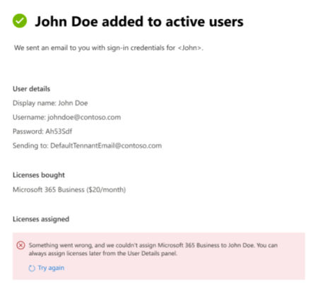

# Novità nell'interfaccia di amministrazione di Microsoft 365

::: moniker range="o365-21vianet"

> [!NOTE]
> Alcune delle informazioni contenute in questo articolo potrebbero non essere applicabili a Office 365 gestito da 21Vianet.

::: moniker-end

Stiamo continuamente aggiungendo nuove funzionalità all'interfaccia di amministrazione di [Microsoft 365,](https://docs.microsoft.com/microsoft-365/business-video/admin-center-overview)risolvendo i problemi a cui apprendiamo e apportando modifiche in base al tuo feedback. Dai un'occhiata qui sotto per vedere cosa è disponibile per te oggi. Alcune funzionalità vengono implementazioni a velocità diverse per i clienti. Se non vedi ancora una funzionalità, prova ad [aggiungerti alla versione mirata.](manage/release-options-in-office-365.md)

E se si desidera sapere quali sono le novità con altri servizi cloud Microsoft:

- [Novità di Azure Active Directory](/azure/active-directory/fundamentals/whats-new)
- [Novità nell'interfaccia di amministrazione di Exchange](/Exchange/whats-new)
- [Novità di Microsoft Intune](/mem/intune/fundamentals/whats-new)
- [Novità del Centro conformità Microsoft 365](/Office365/SecurityCompliance/whats-new)
- [Novità di Microsoft 365 Defender](../security/mtp/whats-new.md)
- [Novità nell'interfaccia di amministrazione di SharePoint](/sharepoint/what-s-new-in-admin-center)
- [Aggiornamenti di Office](/OfficeUpdates/)
- [Come controllare l'integrità dei rilasci di Windows](https://docs.microsoft.com/windows/deployment/update/check-release-health)

## Aprile 2021

### App Admin per dispositivi mobili

### Gestire licenze e fatture dall'app Admin per dispositivi mobili

- È ora possibile visualizzare tutte le licenze disponibili e assegnate per le sottoscrizioni. Puoi anche assegnare o annullare l'assegnazione di licenze agli utenti e aggiungere o rimuovere licenze.
- Ora puoi visualizzare le fatture dettagliate nell'app.
- Questi aggiornamenti sono disponibili sia nei [dispositivi Android](https://go.microsoft.com/fwlink/p/?linkid=2159786) che [iOS.](https://go.microsoft.com/fwlink/p/?linkid=2159787)

:::image type="content" source="../media/assign-license-mobile-app2.png" alt-text="Screenshot: Admin mobile app assign license page":::
:::image type="content" source="../media/license-screen-mobile-app2.png" alt-text="Screenshot: Admin mobile app screen with users and their licenses":::
:::image type="content" source="../media/invoice-summary-mobile-app.png" alt-text="Screenshot: Admin mobile app invoice summary page":::

### Feed del Centro messaggi aggiornato nell'app Admin per dispositivi mobili

- Ora hai un'esperienza di lettura più flessibile del feed del Centro messaggi. Ora puoi filtrare i messaggi in base al servizio o ai tag e contrassegnare i messaggi come preferiti. Sono state aggiunte anche azioni in blocco per contrassegnare i messaggi come letti, non letti o archiviati.
- Questi aggiornamenti sono disponibili sia nei [dispositivi Android](https://go.microsoft.com/fwlink/p/?linkid=2159786) che [iOS.](https://go.microsoft.com/fwlink/p/?linkid=2159787)

:::image type="content" source="../media/mc-feed-mobile-app.png" alt-text="Screenshot: Admin mobile app Message center feed page":::

## Ignite 2021 (marzo)

Benvenuto in Microsoft Ignite. Ci auguriamo che tu sia stato in grado di partecipare ad alcune delle nostre sessioni: [Microsoft Ignite 2021.](https://myignite.microsoft.com/sessions) Ecco alcune delle cose di cui abbiamo parlato in Ignite.
> [!NOTE]
> Non tutte le funzionalità saranno immediatamente disponibili per tutti gli utenti. Se non vedi le nuove funzionalità, partecipa [a Targeted Release.](manage/release-options-in-office-365.md)

### Centro messaggi

Abbiamo rinnovato il Centro messaggi per aiutarti a individuare i messaggi pertinenti e abbiamo aggiunto un'esperienza di lettura più flessibile. È stata aggiunta una nuova colonna **Servizio** per analizzare il servizio a cui si applica un messaggio e filtrare i messaggi in base al servizio e ad altri metadati. È possibile contrassegnare un messaggio come preferito per il follow-up, scegliere le colonne da visualizzare nell'elenco dei messaggi e spostarsi tra i messaggi con i pulsanti Indietro e Avanti. Abbiamo anche migliorato il processo per semplificare l'invio di commenti e suggerimenti sui post del Centro messaggi.

:::image type="content" source="../media/message-center.png" alt-text="Screenshot: Message center home page showing inbox and messages":::

Per ulteriori informazioni sulle nuove funzionalità, vedere [Gestire i messaggi nel Centro messaggi.](manage/manage-messages.md)

### Novità

Sono stati apportati miglioramenti alla modalità di visualizzazione delle funzionalità "Novità" per gli utenti nelle app di Office. È ora possibile visualizzare il contenuto rtf nel nuovo riquadro Novità che gli utenti possono visualizzare. È inoltre possibile ottenere ulteriori informazioni sulla funzionalità prima di decidere di consentire agli utenti di conoscerlo. Per altre info, vedere [Gestire le caratteristiche di Office visualizzate in Novità.](manage/show-hide-new-features.md)

:::image type="content" source="../media/power-bi-whats-new2.png" alt-text="Screenshot: Office apps what's new page showing improvements to Power BI":::

## Ignite 2020 (agosto & settembre)

Benvenuto in Microsoft Ignite- il nostro primo Ignite solo online. Ci auguriamo di vederti in una delle nostre sessioni: [Microsoft Ignite 2020 Session Catalog.](https://myignite.microsoft.com/sessions) Ecco solo alcune delle cose di cui si parla in Ignite.
> [!NOTE]
> Non tutte le funzionalità saranno immediatamente disponibili per tutti gli utenti. Se non vedi le nuove funzionalità, partecipa [a Targeted Release.](manage/release-options-in-office-365.md)

### Gestione multi-tenant

Abbiamo sviluppato un set di funzionalità per amministratori multi-tenant come te per eseguire il tuo lavoro in modo più rapido ed efficiente. Per ulteriori informazioni, vedere [Manage multiple tenants.](multi-tenant/manage.md)

- **Tenant:** passare rapidamente tra i tenant gestiti.
- **Tutti i tenant**: una nuova pagina in cui è possibile visualizzare rapidamente l'integrità di tutti i servizi dei tenant, le eventuali richieste di servizi aperte, i prodotti e la fatturazione, le attività di configurazione consigliate e il numero di utenti in tale tenant.
- **Installazione**: la pagina Configurazione multi-tenant offre una visualizzazione elenco della pagina Installazione, ma organizzata per molti tenant. È possibile vedere quali funzionalità non sono attivate, quali attività sono complete per tutti i tenant, attività che i tenant devono ancora completare. Questa visualizzazione consente di tenere traccia dell'adozione delle funzionalità e di assicurarsi che le attività di configurazione della sicurezza consigliate siano sempre eseguite.
- **Integrità del** servizio: la visualizzazione integrità del servizio mostra se eventuali eventi imprevisti o avvisi influiscono sui tenant. Ti dirà anche quanti tenant gestiti sono interessati. Basta selezionare un evento imprevisto per ottenere ulteriori informazioni nella scheda panoramica, quindi passare alla scheda Tenant interessati per eseguire il drill-down e supportare tale tenant.
- **Le migrazioni di cassette postali** tra tenant sono un nuovo servizio, ora in anteprima pubblica, che consente di spostare le cassette postali tra tenant senza dover eseguire l'offboard e quindi l'onboard. 
- **Condivisione di domini tra tenant:** presto, è possibile aggiungere un'anteprima privata per le funzionalità che consentono di condividere un dominio tra più tenant. Ad esempio, se Contoso acquisisce Wingtip Toys, Contoso può condividere il dominio con Wingtip Toys in modo che gli utenti di entrambi i tenant possano usare "contoso.com" come indirizzi di posta elettronica.

### Monitorare gli account più importanti

È possibile monitorare e tenere traccia dei messaggi di posta elettronica non riusciti o ritardati inviati agli utenti che hanno un impatto aziendale elevato, come il CEO. È possibile tenere traccia degli account con priorità aggiungendo gli utenti all'elenco degli account con priorità nell'interfaccia di amministrazione di Microsoft 365. Aggiungere dirigenti, dirigenti, responsabili o altri utenti che hanno accesso a informazioni sensibili o ad alta priorità.

Gli account di priorità sono disponibili solo per le organizzazioni che soddisfano entrambi i requisiti seguenti:

- Office 365 E3 o Microsoft 365 E3 o Office 365 E5 o Microsoft 365 E5.
- Almeno 10.000 licenze e almeno 50 utenti di Exchange Online attivi mensilmente.

Esistono due modi per iniziare:

- Vai a **Utenti** e quindi nel menu "Altre azioni" seleziona Gestisci account con **priorità** per aggiungere utenti all'elenco.
- Vai a **Installazione,** trova l'attività di installazione **Monitora gli account più importanti** e quindi seleziona **Introduzione.**

Per altre info sugli account con priorità, consulta [Monitoraggio degli account con priorità.](./setup/priority-accounts.md)

### Eseguire una ricerca più veloce e ottenere risultati migliori da qualsiasi pagina

Abbiamo iniziato la distribuzione di una nuova esperienza di ricerca per l'interfaccia di amministrazione e non vediamo l'ora di provarla. 

- La casella di ricerca è stata spostata nell'area di intestazione in cui è presente "Interfaccia di amministrazione di Microsoft 365" in modo da eseguire la ricerca da qualsiasi pagina e non solo dalla home page. Abbiamo anche un collegamento: **ALT+S.**
- La ricerca è più intelligente e consente di ottenere risultati migliori, anche più velocemente. Prova a digitare "2fa" per iniziare.
- I risultati della ricerca sono organizzati in base al tipo di elemento o azione che è possibile eseguire.
  - **Utenti**: selezionare il nome dell'utente ed è possibile modificarlo qui. Se si seleziona il menu "Altre azioni" accanto al nome, è possibile reimpostarne la password. È possibile eseguire la ricerca in base al nome visualizzato, al cognome, al nome, al nome utente o all'indirizzo di posta elettronica principale e agli alias di posta elettronica. Ma per ottenere una corrispondenza esatta, cercare in base all'indirizzo di posta elettronica principale o al nome utente.
  - **Gruppi**: modificare il gruppo da qualsiasi pagina, aggiungere membri, assegnare proprietari.
  - **Azioni**: in modo analogo a come è possibile cercare un utente e quindi reimpostare la password, è anche possibile cercare "reimpostare la password" da qualsiasi pagina e quindi reimpostare una o più password per gli utenti.
  - **Spostamento:** i risultati in Spostamento consentono di accedere rapidamente a una pagina nell'interfaccia di amministrazione. Ad esempio, la ricerca di "ruoli" consente di accedere alla pagina Ruoli per i ruoli di Azure AD.
  - **Impostazioni**: cercare qualsiasi impostazione correlata all'organizzazione, i servizi sottoscritti e le impostazioni di sicurezza e privacy. 
  - **Domini**: è possibile trovare collegamenti rapidi ai domini e quindi il collegamento consente di accedere alla pagina Panoramica e integrità del dominio.
  - **Documentazione:** se non è possibile trovare un risultato per l'utente, verrà cercata una documentazione utile. Per trovare una corrispondenza nell'elenco di articoli curato, è necessario attendere un secondo per consentire alla ricerca di trovare i risultati. 
  - **Feedback**: Non hai trovato quello che cercavi? Inviaci commenti e suggerimenti dalla ricerca. Aggiungeremo funzionalità di ricerca per altre pagine e altre funzionalità nell'interfaccia di amministrazione.

### App per dispositivi mobili di amministrazione di Microsoft 365

L'app per dispositivi mobili di amministrazione di [Microsoft 365,](https://www.microsoft.com/microsoft-365/business/manage-office-365-admin-app)inclusa nell'abbonamento, ti consente di gestire Microsoft 365 dal dispositivo mobile in modo da poterti allontanare dalla scrivania per eseguire attività quotidiane. Infatti, nell'app sono presenti più di 90 funzionalità e ne sono state aggiunte altre:

- Supporto per i criteri di gestione delle applicazioni mobili e accesso condizionale di Microsoft Intune: ora è possibile usare il dispositivo personale per gestire Microsoft 365 anche se **l'organizzazione** ha attivato i criteri di gestione delle applicazioni mobili e di accesso condizionale di Intune.
- **Notifiche del Centro messaggi**: attivare le notifiche del Centro messaggi in **Impostazioni** Notifiche se si desidera ricevere un avviso sui nuovi post  >   del Centro messaggi. Tramite le notifiche, vogliamo essere sempre informati su informazioni ed eventi importanti nel tenant.
- **Avvisi di fatturazione:** puoi anche attivare le notifiche di fatturazione in Impostazioni Notifiche se vuoi ricevere notifiche di fatturazione sul dispositivo se un abbonamento sta per  >   scadere.
- **Modalità scura:** benvenuto nel lato oscuro dell'app per dispositivi mobili. Questa è stata una delle funzionalità più richieste. Vai a **Impostazioni**  >  **Temi** per attivarlo.
- **Segnalare un problema:** ora puoi segnalare un problema nell'app o visualizzare i problemi segnalati da altri amministratori. Visitare **Integrità del servizio** per estrarlo.

### Consigli sull'utilizzo per le piccole e medie imprese

Le piccole e medie imprese potrebbero ricevere un suggerimento nella **home** page se alcune persone dell'organizzazione non usano attivamente le app di Teams, OneDrive o Office. Quando si visualizza il suggerimento, è possibile inviare rapidamente tramite posta elettronica la formazione Microsoft agli utenti inattivi per aiutarli a iniziare con l'app e per assicurarsi di ottenere il valore completo dalle sottoscrizioni.

### Raccolta di lavoro remota

A ottobre verrà aggiunta una raccolta di lavoro remota per aiutare i proprietari delle piccole imprese e il loro personale a lavorare in remoto.  **La configurazione di Elementi** essenziali per il lavoro remoto è un elenco curato di tutte le funzionalità consigliate da Microsoft per abilitare in modo sicuro il lavoro remoto e collaborare in modo efficace. In un paio di settimane, è possibile provarlo in **Setup**  >  **Remote work essentials**.

Per ulteriori informazioni su come consentire in modo sicuro il lavoro remoto e un pratico indirizzo Web facile da ricordare e condividere, [vedere aka.ms/remote-business](https://aka.ms/remote-business).

### Serve aiuto? passaggio a più centri di amministrazione

Stiamo continuamente esaminando e aggiornando il contenuto e gli strumenti per tenere il passo con le modifiche apportate al prodotto. Ora abbiamo molti altri strumenti di diagnostica self-service per aiutarti a risolvere i problemi in modo rapido ed efficiente. Ecco alcuni elementi che sono stati aggiunti di recente:

- Modificare il criterio di limitazione del servizio Web Exchange
- Controllo dello stato del provisioning e della convalida di Teams per utenti specifici
- Risolvere i problemi di installazione di DKIM
- Diagnosticare gli errori di registrazione degli utenti di Intune

Stiamo inoltre stentando l'esperienza di supporto nuova e migliorata già visualizzata nell'interfaccia di amministrazione di Microsoft 365 in alcune delle altre centri di amministrazione. L'interfaccia di amministrazione di Teams e le centri di amministrazione di sicurezza e conformità hanno già questa nuova esperienza. A breve, **l'interfaccia di** amministrazione  di **Exchange, l'interfaccia** di amministrazione di SharePoint e Office.com verranno aggiornati insieme a questa nuova esperienza di assistenza per gli amministratori.

### Gestire le modifiche con Microsoft Planner

A maggio, abbiamo annunciato che presto potrai sincronizzare i post del Centro messaggi con Microsoft Planner e ora è disponibile per tutti gli utenti.  È ora possibile creare attività dai messaggi, assegnarle e tenere traccia del completamento. La prima volta che si seleziona **la sincronizzazione di Planner,** sarà necessario connettersi al piano appropriato.

Per altre informazioni, vedere questo articolo e video per vedere come funziona: Tenere traccia dei post del Centro [messaggi in Planner](/Office365/Planner/track-message-center-tasks-planner)

### Documentazione, formazione e video

- Brand new and just in time for Microsoft Ignite--[The Virtual Hub](https://adoption.microsoft.com/virtual-hub/). Approfondimento sulla formazione tecnica per professionisti IT e sviluppatori. Trova rapidamente circa 20 nuovi video come parte di #SIDETRACKED, il nome della traccia dell'amministratore di Ignite quest'anno.
- Novità della serie di video [di Microsoft 365:](https://www.youtube.com/watch?v=OVjb2lGJ4GU&t=2s) questo mese vengono trattate le nuove funzionalità disponibili in Whiteboard per Teams e sul Web, come automatizzare il provisioning degli utenti in Azure AD, nuovi trigger e azioni di Power Automate in Teams e altro ancora. E rimanete sintonizzati per il mese prossimo, dove avremo un riepilogo di tutte le grandi cose che accadono a Ignite!
- È stata riprogettata la pagina [della documentazione di Microsoft 365](/microsoft-365) incentrata innanzitutto sulle soluzioni. Verranno evidenziate nuove soluzioni non appena saranno disponibili in questa pagina, quindi tenere d'occhio.

## Luglio 2020

### Prepararsi per Ignite 2020

Durante il passaggio alla stagione Ignite presso Microsoft, non vengono rilasciate tutte le funzionalità di cui discutere durante le sessioni.

Il prossimo aggiornamento di questo articolo sarà il giorno di apertura del nostro primo Ignite solo online. E quest'anno, è gratuito partecipare! Check it out, get signed up: [Microsoft Ignite 2020](https://www.microsoft.com/ignite).

### I tuoi prodotti

Nella gestione delle sottoscrizioni è stato svolto molto lavoro per velocizzare il caricamento della pagina, per trovare più velocemente ciò che si sta cercando e per soddisfare gli standard di accessibilità Web ( linee guida[di WCAG 2.1).](http://www.w3.org/TR/WCAG21/)

- **Riprogettazione della** tabella : la tabella è stata riprogettata in modo da poter raggruppare sottoscrizioni simili. Vai a **Fatturazione**  >  **I tuoi prodotti**.
- **Dettagli prodotto:** per ottenere più dettagli che mai sugli abbonamenti, selezionare il prodotto nell'elenco.
- **Fare tutto da qui**: E non è necessario andare a saltare diverse pagine per gestire un prodotto. Ad esempio, se devi annullare una sottoscrizione, il pannello si aprirà per eseguire l'azione proprio qui.

### Domini

La gestione del dominio può essere complicata e abbiamo rilasciato una nuova funzionalità per semplificare la gestione. Vai a Impostazioni > Domini e quindi seleziona un dominio per ottenere ulteriori informazioni sul dominio e sull'integrità del dominio.

:::image type="content" source="../media/MAC-WN-DomainDNS.PNG" alt-text="Pagina dei dettagli dei domini per contoso.com":::

### Documenti, formazione e video (luglio 2020)

Novità della serie di video [di Microsoft 365:](https://youtu.be/m1Nu8WJgCDY) questo mese vengono trattate la nuova esperienza Yammer per il Web e i dispositivi mobili, come integrare l'app Community Yammer per Microsoft Teams, nuovi pacchetti di criteri per supportare firstline worker e manager e altro ancora.

## Giugno 2020

### Tenere il passo con la gestione delle novità di Office

Alcuni mesi fa è stata aggiunta un'impostazione che consente di gestire i messaggi Novità visualizzati nelle app di Office di un utente. Questo mese è stata rilasciata una nuova scheda home page che consente di agire rapidamente e tenere traccia dei messaggi Novità che si desidera visualizzare agli utenti **dell'organizzazione.**

### Documenti, formazione e video (giugno)

- [Introduzione a Teams](https://support.microsoft.com/office/184f1aba-2f91-43f0-86e1-9fae607e24f6)

## Maggio 2020

### Nuovo canale di aggiornamento per Office

Il 12 maggio è stata annunciata la disponibilità di un nuovo canale di aggiornamento per Office: Canale Enterprise mensile. Questo canale di aggiornamento fornisce agli utenti nuove funzionalità di Office una volta al mese, il secondo martedì del mese.

Se si consente agli utenti di installare Autonomamente Office dal portale, è possibile selezionare Canale Enterprise mensile per loro. A tale scopo, accedere all'interfaccia di amministrazione di Microsoft 365 e passare a **Mostra** tutte le impostazioni dell'organizzazione Impostazioni organizzazione  >   >    >  **Servizi**  >  **Impostazioni di download software di Office.** Se si seleziona **Una volta al mese (Canale Enterprise mensile),** tutte le nuove installazioni self-install di Office verranno configurate per l'utilizzo del Canale Enterprise mensile.

In combinazione con il rilascio del Canale Enterprise mensile, stiamo anche rivedendo i nomi dei canali di aggiornamento esistenti. Ad esempio, Canale mensile viene rinominato Canale corrente. I nuovi nomi hanno effetto il 9 giugno 2020.

Per altre informazioni, vedere [Modifiche ai canali di aggiornamento per Microsoft 365 Apps](/DeployOffice/update-channels-changes).

### Nuovi ruoli di amministratore

Abbiamo aggiunto alcuni nuovi ruoli di amministratore di Azure Active Directory all'interfaccia di amministrazione di Microsoft 365.

- Il ruolo di amministratore dell'identità ibrida consente agli utenti di gestire il provisioning cloud e i servizi di autenticazione.
- Il ruolo di amministratore di rete consente agli utenti di gestire i percorsi di rete ed esaminare le informazioni dettagliate sulla rete per Microsoft 365 Software as a Service apps.
- Il ruolo di amministratore della stampante concede l'autorizzazione per gestire tutti gli aspetti delle stampanti e delle connessioni alle stampanti.
- Il tecnico della stampante è un sottoinsieme del ruolo di amministratore della stampante in cui tali utenti possono registrare e annullare la registrazione delle stampanti e aggiornare lo stato della stampante.
Per ulteriori informazioni su questi ruoli, vedere [Informazioni sui ruoli di amministratore.](./add-users/about-admin-roles.md)

### Esportare l'elenco dei gruppi

Molti amministratori hanno sentito dire che devono condividere informazioni sui gruppi e sul loro utilizzo a persone che non hanno accesso alle centri di amministrazione. È ora possibile esportare l'elenco Gruppi in un file CSV per scopi di controllo, il che significa che è possibile generare il vecchio script di PowerShell. Per provarlo, passare a **Gruppi**  >  **gruppi** e quindi selezionare **Esporta gruppi** dalla barra dei comandi.

### Microsoft 365 Solution and Architecture Center

Proprio questo mese è stato rilasciato un nuovo sito denominato Centro soluzioni e architettura [https://docs.microsoft.com]() [di Microsoft 365,](../solutions/index.yml)che riunisce le indicazioni tecniche necessarie per comprendere, pianificare e implementare soluzioni Microsoft 365 integrate per la collaborazione sicura e conforme. In questo centro troverai:

- Linee guida per le soluzioni di base
- Soluzioni del carico di lavoro e indicazioni per gli scenari
- Illustrazioni di soluzioni e architetture (poster!!!)
- Indicazioni specifiche del settore
- Entità di progettazione dell'architettura aziendale

### Documenti, formazione e video (maggio)

- Novità della **serie di video di Microsoft 365**: questo mese vengono trattate le nuove esperienze di supporto nell'amministratore di Teams e nei Centri sicurezza e conformità, integrazione di Planner con il Centro messaggi e il nuovo layout video 3x3 in Microsoft Teams. 
- La pagina hub della Guida dell'interfaccia di amministrazione di [Microsoft 365](./index.yml) è stata aggiornata per aiutarti a trovare più rapidamente ciò di cui hai bisogno. E se vai a vedere la pagina in questo momento, abbiamo aggiunto una scheda per informarti degli aggiornamenti e delle modifiche importanti.

## Aprile 2020

### Gestione dei ruoli di Intune

[Aprile 2020](#april-2020)

Beh, l'abbiamo fatto! Abbiamo fatto il secondo passo verso un'esperienza di ruoli unificati ed è ora possibile gestire i ruoli di Intune nell'interfaccia di amministrazione di Microsoft 365. È inoltre possibile sfruttare funzionalità quali la possibilità di cercare ruoli e visualizzare le autorizzazioni di ruolo. Ciò significa che non sono necessari due strumenti separati per gestire i ruoli per Microsoft 365 e Intune. Quando accedi all'interfaccia di amministrazione di Microsoft 365, vedrai che nella pagina Ruoli sono presenti due pivot, uno per Azure AD e uno per Intune.

### Sincronizzare i post del Centro messaggi in Planner

A partire da maggio, gli amministratori in versione mirata inizieranno a vedere il pulsante "Sincronizzazione planner" nel centro messaggi. È ora possibile tenere traccia dei messaggi che necessitano di azioni, selezionare il tipo di messaggi che si desidera tenere traccia, assegnare messaggi da tenere traccia come attività e contrassegnare i messaggi per l'attenzione successiva.

[Partecipa a Targeted Release](manage/release-options-in-office-365.md) per iniziare!

### "Serve aiuto?" avviato nell'interfaccia di amministrazione di Teams & centro sicurezza e conformità

L'interfaccia di amministrazione di Teams, il Centro sicurezza e il Centro conformità ora usano la stessa "Serve assistenza?" funzionalità utilizzata dall'interfaccia di amministrazione di Microsoft 365 per trovare assistenza e contattare il supporto tecnico. Abbiamo ricevuto molti feedback dagli amministratori che desiderano lo stesso livello di assistenza e supporto e siamo lieti di fornire questo feedback. Provalo e inviaci il tuo feedback.

#### Hai bisogno di chat?

I nostri agenti di supporto hanno lavorato da casa, pur continuando a prendere casi dei clienti e limitazioni sulla larghezza di banda Internet mentre lavorano da casa possono influire sulla qualità delle chiamate dei clienti. Per continuare a supportare l'utente, è stata avviata l'opzione di supporto live chat per i clienti commerciali nell'interfaccia di amministrazione di Microsoft 365.

Durante la creazione di una richiesta di servizio, ora vedrai la chat come opzione, oltre al telefono e alla posta elettronica. Seleziona la chat come canale di comunicazione preferito e crea la richiesta. Dopo aver creato la richiesta, puoi avviare la chat quando sei pronto per chattare con gli agenti Microsoft.

### Aggiornamenti di Teams

Con il maggiore utilizzo di Teams, sono state aggiunte alcune funzionalità che consentono di gestirle.

- Una nuova scheda consigliata nella home page dell'interfaccia di amministrazione mostra quali utenti non hanno utilizzato attivamente Teams per 30 giorni. È possibile inviare a tali utenti un messaggio di posta elettronica di formazione per iniziare a usare Teams.
- **Riunire le persone** con  i team: passare a Installazione per visualizzare una nuova pagina che consente di attivare Teams per gli utenti con licenza e consentire l'accesso guest, in modo da poter collaborare con clienti esterni in Teams.
- Una scheda di Microsoft Teams viene ora aggiunta per impostazione predefinita alla home page. Mostra se Teams è attivato e se è consentito l'accesso guest. Consente inoltre di controllare lo stato di installazione per gli utenti di Teams appena concessi in licenza e di verificare se i problemi di rete potrebbero influire sugli utenti di Teams.
- Infine, Teams è ora un passaggio del flusso di configurazione iniziale se hai acquistato una licenza che include Teams.

### Punteggio di produttività

Il punteggio di produttività fornisce informazioni dettagliate su come gli utenti usano i servizi cloud Microsoft e sulle esperienze tecnologiche che li supportano. Il punteggio riflette le prestazioni dell'organizzazione rispetto alle misure relative all'esperienza dei dipendenti e della tecnologia e confronta il punteggio con organizzazioni come la tua. Questo mese vengono illustrati i nuovi concetti seguenti per l'esperienza di anteprima:

- Visualizzazione delle tendenze dei dati analitici principali nelle pagine di dettaglio della home page e delle categorie - Categorie Endpoint Analytics e Connettività di rete aggiunte a Esperienza tecnologica
- Informazioni dettagliate sull'esperienza tecnologica pertinente mostrate nelle categorie Di esperienza dei dipendenti
- Nuova categoria Comunicazioni nell'ambito dell'esperienza dei dipendenti
- Dettagli utente con metadati dell'organizzazione nelle categorie Esperienza dipendente

Per altre informazioni, vedere il blog: Misurare e migliorare l'esperienza di [Microsoft 365 con Microsoft Productivity Score](https://techcommunity.microsoft.com/t5/microsoft-365-blog/measure-and-improve-the-microsoft-365-experience-with-microsoft/ba-p/1348618). Il punteggio di produttività è attualmente in anteprima privata. [Partecipa all'anteprima privata del punteggio produttività](https://aka.ms/productivityscorepreview) per iniziare.

### Aggiornamenti dei gruppi

Abbiamo due aggiornamenti per i gruppi questo mese:

- È ora possibile modificare gli indirizzi di posta elettronica per i gruppi di Office 365 (noti anche come gruppi in Outlook e presto noti come gruppi di Microsoft 365).
- Abbiamo ascoltato il tuo feedback e abbiamo aggiunto messaggi di errore più chiari per il motivo per cui non puoi convertire un gruppo in un team Microsoft.

### Documentazione, video e formazione (aprile)

Novità della **serie di video di Microsoft 365**: questo mese vengono forniti suggerimenti e risorse per aiutare le piccole aziende a passare al lavoro remoto, tra cui come implementare Microsoft Teams, risorse di formazione sul lavoro remoto per rimanere in contatto con clienti e partner e il nuovo piano di Microsoft 365 Business Voice. [Novità di Microsoft 365](https://go.microsoft.com/fwlink/p/?linkid=2118096)

#### Per gli utenti

- [Pianificare una riunione](https://support.microsoft.com/office/c61b4f61-ee62-4a06-8bf7-0a1cd302700a)
- [Partecipare a una riunione di Teams](https://support.microsoft.com/office/078e9868-f1aa-4414-8bb9-ee88e9236ee4)
- [Creare un team di tutta l'organizzazione](https://support.microsoft.com/office/037bb27a-bcc9-48fe-8d72-44d9482420a3)
- [Creare un team con utenti guest](https://support.microsoft.com/office/11fbb083-52ee-434d-8c6e-63711fdafac7)
- [Partecipare a un team come guest](https://support.microsoft.com/office/928d1eef-61e2-49ec-b754-c2fe86b34824)
- [Creare un indirizzo di posta elettronica di gruppo](https://support.microsoft.com/office/ded875f9-a9de-437f-b559-2ae4f235bb2b)

#### Per amministratori e proprietari di aziende

- [Potenziare le piccole aziende con il lavoro remoto](https://support.microsoft.com/office/9b91a85a-39b4-40a6-a590-0f9bea0ba8e6)
- [Esecuzione di una piccola azienda remota](https://support.microsoft.com/office/9ac1a0f1-789b-4143-b954-5821d5d89298)
- [Iscriversi a Microsoft Business Basic](https://support.microsoft.com/office/9ac1a0f1-789b-4143-b954-5821d5d89298)
- [Configurazione dell'accesso a due fattori](https://support.microsoft.com/office/9ac1a0f1-789b-4143-b954-5821d5d89298)

## Marzo 2020

### Correzione feedback in primo piano: migliorare l'affidabilità "aggiungi utente" per le licenze

Abbiamo ricevuto molti commenti e suggerimenti dagli amministratori sulla difficoltà di assegnare licenze quando si aggiungono utenti. Abbiamo apportato il primo aggiornamento a questa correzione ed è stata eseguita la migrazione a un servizio dietro le quinte più affidabile per elaborare tali richieste. In caso di problemi, verrà visualizzato un messaggio di errore che consente di riprovare.

### Home page di Microsoft Teams

Con l'uptick nell'utilizzo di Teams, alcune organizzazioni riceveranno una scheda dashboard aggiunta che rende Teams più individuabile. La scheda include anche collegamenti alla formazione e ai documenti per facilitare la transizione dell'organizzazione al lavoro remoto. Basta passare alla **home** page per visualizzare la nuova scheda.

### Personalizzare il tema dell'app per dispositivi mobili di SharePoint dell'organizzazione

Utilizzando l'interfaccia di amministrazione di Microsoft 365, è ora possibile personalizzare il tema dell'organizzazione nell'app per dispositivi mobili di SharePoint per iOS e app sharePoint per dispositivi mobili per Android. Questa funzionalità offre comodamente un'esperienza di app Intranet per dispositivi mobili che può corrispondere a SharePoint Online per i dipendenti in viaggio. La personalizzazione del tema include l'immagine del logo, il colore della barra di spostamento, i colori del testo e dell'icona e i colori principale, semplificando il riconoscimento.

### Miglioramenti alla procedura guidata "Aggiungi gruppo"

Quando gli amministratori hanno creato un nuovo gruppo e lo hanno reso un team contemporaneamente, possono assegnare ai proprietari che non dispongono di una licenza che include Teams. E questo ha creato qualche mal di testa. Il flusso della procedura guidata è stato aggiornato per verificare che i proprietari hanno una licenza di Teams e se non hanno la possibilità di trasformare il gruppo in un team è disabilitato.

### Offerte di Microsoft 365 per piccole e medie imprese

Sappiamo che si tratta di un annuncio per il mese prossimo, ma vogliamo essere certi di essere pronti.

A partire dal 21 aprile, vengono apportate modifiche relative agli abbonamenti a Office 365 per le piccole e medie imprese e a Office 365 ProPlus. Questi prodotti useranno ora il marchio Microsoft 365.

I nuovi nomi di prodotto vengono validi il 21 aprile 2020. Si tratta di una modifica solo al nome del prodotto e al momento non sono presenti modifiche ai prezzi o alle funzionalità.

|Nome corrente |Nuovo nome  |
|---------|---------|
|Office 365 Business Essentials     |   Microsoft 365 Business Basic      |
|Office 365 Business Premium     |    Microsoft 365 Business Standard     |
|Microsoft 365 Business     |    Microsoft 365 Business Premium     |
|Office 365 Business     |    Microsoft 365 Apps for business       |
|Office 365 ProPlus    |   App di Microsoft 365 per le aziende      |

### Video, formazione e documenti

Novità della [serie Web Microsoft 365](https://go.microsoft.com/fwlink/p/?linkid=2118096): nell'episodio di questo mese, viene evidenziato l'anniversario di 3 anni di Microsoft Teams e vengono trattate nuove funzionalità, tra cui la qualità audio migliorata nelle riunioni online, le comunicazioni mirate per i manager di prima linea con l'app Turni, l'interoperabilità consumer di Teams e Skype e altro ancora.

## Febbraio 2020

### Correzione feedback in primo piano: commutatore multi-organizzazione

Abbiamo ricevuto molti feedback da partner e amministratori sulle sfide della gestione di più organizzazioni cloud Microsoft. Una delle prime funzionalità di gestione multi-organizzazione è lo **switcher** Organizzazione, che consente di passare da un'organizzazione all'altra in soli due clic.
> [!TIP]
> Non è necessario eseguire alcun'operazione per fare in modo che il commutatore dell'organizzazione venga visualizzato purché si sia il Partner of Record per almeno un'organizzazione.

1. Nell'interfaccia di amministrazione di Microsoft 365 selezionare il nome dell'organizzazione.

2. Nel commutatore dell'organizzazione selezionare l'organizzazione che si desidera gestire.

È letteralmente così!!!

### Gruppi

Un paio di modifiche nell'area dei gruppi questo mese:

- **Ordina per nome gruppo**: è possibile ordinare l'elenco dei gruppi in ordine alfabetico selezionando la **colonna Nome** gruppo.
- **Ripristinare i gruppi di Microsoft 365** eliminati: non è più necessario accedere all'interfaccia di amministrazione di Exchange per ripristinare i gruppi di Microsoft 365 eliminati. Passare a Interfaccia di amministrazione di **Microsoft 365** Gruppi eliminati \>  \>  \> gruppi (selezionare un gruppo dall'elenco) \> **Ripristina gruppo**. Il gruppo verrà ripristinato  nell'elenco Gruppi e verrà ripristinato il messaggio di posta elettronica, le conversazioni, il blocco appunti, i file e il calendario del gruppo.

### Video, formazione e documenti (febbraio)

- Novità della **serie di video di Microsoft 365**: questo mese, sono incentrate sulle funzionalità di ricerca personalizzate per SharePoint Online, la funzionalità di gestione di Office "Novità" che consente di visualizzare o nascondere funzionalità specifiche agli utenti finali tramite il riquadro della Guida in-app, gli aggiornamenti più recenti della sicurezza e della conformità in Yammer e altro ancora. Ecco l'ultimo episodio: [Novità di Microsoft 365](https://go.microsoft.com/fwlink/p/?linkid=2118096)

- **Spostamento documenti:** gli articoli Web di amministrazione di Office 365 sono stati combinati con il contenuto di Microsoft 365 e il nuovo URL potrebbe essere stato notato. Ad esempio, questo articolo era ospitato in: **docs.microsoft.com/Office365/Admin/whats-new-in-preview**, ma l'URL è ora: **docs.microsoft.com/microsoft-365/admin/whats-new-in-preview**. Se sono disponibili pagine con segnalibri, è consigliabile aggiornare i collegamenti. Tuttavia, i collegamenti al contenuto verranno reindirizzati al nuovo repo del contenuto.
