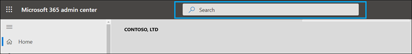
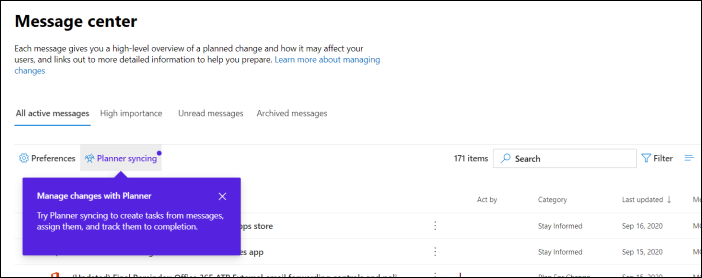
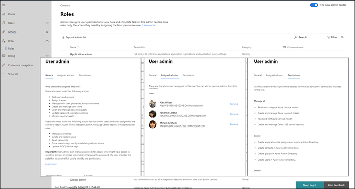

# Novità nell'interfaccia di amministrazione di Microsoft 365

::: moniker range="o365-21vianet"

> [!NOTE]
> Alcune delle informazioni contenute in questo articolo potrebbero non essere valide per Office 365 gestito da 21Vianet.

::: moniker-end

We're continuously adding new features to [the Microsoft 365 admin center,](microsoft-365-admin-center-preview.md)fixing issues we learn about, and making changes based on your feedback. Dai un'occhiata di seguito per vedere cosa è disponibile per te oggi. Alcune funzionalità vengono implementazioni a velocità diverse per i clienti. Se non vedi ancora una funzionalità, prova ad [aggiungerti alla versione mirata.](manage/release-options-in-office-365.md)

E se si desidera conoscere le novità di altri servizi cloud Microsoft:

- [Novità di Azure Active Directory](https://docs.microsoft.com/azure/active-directory/fundamentals/whats-new)
- [Novità nell'interfaccia di amministrazione di Exchange](https://docs.microsoft.com/Exchange/whats-new)
- [Novità di Microsoft Intune](https://docs.microsoft.com/mem/intune/fundamentals/whats-new)
- [Novità del Centro conformità Microsoft 365](https://docs.microsoft.com/Office365/SecurityCompliance/whats-new)
- [Novità di Microsoft 365 Defender](https://docs.microsoft.com/microsoft-365/security/mtp/whats-new)
- [Novità nell'interfaccia di amministrazione di SharePoint](https://docs.microsoft.com/sharepoint/what-s-new-in-admin-center)
- [Aggiornamenti di Office](https://docs.microsoft.com/OfficeUpdates/)

## Ignite 2020 (agosto & settembre)

Benvenuto in Microsoft Ignite: il nostro primo Ignite solo online. Ci auguriamo di vederti in una delle nostre sessioni: [Microsoft Ignite 2020 Session Catalog.](https://myignite.microsoft.com/sessions) Ecco solo alcune delle cose di cui stiamo parlando in Ignite. 
> [!NOTE]
> Non tutte le funzionalità saranno immediatamente disponibili per tutti. Se non vedi le nuove funzionalità, partecipa [a Targeted Release.](manage/release-options-in-office-365.md)

### Gestione multi-tenant

Abbiamo sviluppato un set di funzionalità per amministratori multi-tenant come te per eseguire il tuo lavoro in modo più rapido ed efficiente. Per ulteriori informazioni, vedere [Gestire più tenant.](multi-tenant/manage.md)

- **Tenant:** passare rapidamente da un tenant all'altro.
- Tutti i **tenant:** una nuova pagina in cui è possibile visualizzare rapidamente l'integrità di tutti i servizi dei tenant, le eventuali richieste di servizi aperte, i prodotti e la fatturazione, le attività di configurazione consigliate e il numero di utenti in tale tenant.
- **Configurazione:** la pagina Configurazione multi-tenant offre una visualizzazione elenco della pagina Configurazione, ma è organizzata per molti tenant. È possibile vedere quali funzionalità non sono attivate, quali attività sono state completate per tutti i tenant, attività che i tenant devono ancora completare. Questa visualizzazione consente di tenere traccia dell'adozione delle funzionalità e di assicurarsi che le attività di configurazione della sicurezza consigliate siano sempre eseguite.
- **Integrità del** servizio: la visualizzazione dell'integrità del servizio mostra se eventuali eventi imprevisti o avvisi influiscono sui tenant. Ti dirà anche quanti tenant gestiti sono interessati. È sufficiente selezionare un evento imprevisto per ottenere ulteriori informazioni nella scheda panoramica, quindi passare alla scheda Tenant interessati per eseguire il drill-down e supportare tale tenant.
- **Le migrazioni di cassette** postali tra tenant sono un nuovo servizio, ora in anteprima pubblica, che consente di spostare le cassette postali tra tenant senza dover eseguire l'offboard e quindi eseguire l'onboarder delle cassette postali. 
- **Condivisione di domini tra tenant:** presto sarà possibile partecipare a un'anteprima privata per le funzionalità che consentono di condividere un dominio tra più tenant. Ad esempio, se Contoso acquisisce Wingtip Toys, Contoso può condividere il dominio con Wingtip Toys in modo che gli utenti di entrambi i tenant possano usare "contoso.com" come indirizzi di posta elettronica.

### Monitorare gli account più importanti

È possibile monitorare e tenere traccia dei messaggi di posta elettronica non riusciti o ritardati inviati agli utenti con un forte impatto aziendale, ad esempio il CEO. È possibile tenere traccia degli account con priorità aggiungendo gli utenti all'elenco degli account con priorità nell'interfaccia di amministrazione di Microsoft 365. Aggiungere dirigenti, dirigenti, responsabili o altri utenti che hanno accesso a informazioni sensibili o ad alta priorità.

Gli account di priorità sono disponibili solo per le organizzazioni che soddisfano entrambi i requisiti seguenti:

- Office 365 E3 o Microsoft 365 E3 oppure Office 365 E5 o Microsoft 365 E5.
- Almeno 10.000 licenze e almeno 50 utenti di Exchange Online attivi mensilmente.

Esistono due modi per iniziare:

- Passare a **Utenti** e quindi nel menu "Altre azioni" selezionare Gestisci account con **priorità** per aggiungere utenti all'elenco.
- Passare a **Installazione,** individuare l'attività di installazione **Monitorare gli account più importanti** e quindi selezionare **Inizia.**

Per altre info sugli account con priorità, consulta [Monitoraggio degli account con priorità.](https://docs.microsoft.com/microsoft-365/admin/setup/priority-accounts)

### Ricerca più veloce e risultati migliori da qualsiasi pagina

We've started rolling out a new Search experience for the admin center, and we can't wait for you to try it out. 

- La casella di ricerca è stata spostata nell'area di intestazione in cui viene visualizzata l'intestazione "Interfaccia di amministrazione di Microsoft 365", in modo da eseguire la ricerca da qualsiasi pagina e non solo dalla home page. Abbiamo anche un collegamento: **ALT+S.**
- La ricerca è più intelligente e consente di ottenere risultati migliori, anche più velocemente. Prova a digitare "2fa" per iniziare.
- I risultati della ricerca sono organizzati in base al tipo di elemento o azione che è possibile eseguire.
  - **Utenti:** selezionare il nome dell'utente ed è possibile modificarlo direttamente qui. Se si seleziona il menu "Altre azioni" accanto al nome, è possibile reimpostarne la password. È possibile eseguire la ricerca in base al nome visualizzato, al cognome, al nome, al nome utente o all'indirizzo di posta elettronica principale e agli alias di posta elettronica. Ma per ottenere una corrispondenza esatta, cercare in base all'indirizzo di posta elettronica principale o al nome utente.
  - **Gruppi:** modificare il gruppo da qualsiasi pagina, aggiungere membri e assegnare proprietari.
  - **Azioni:** in modo analogo a come è possibile cercare un utente e quindi reimpostarne la password, è anche possibile cercare "reimpostare la password" da qualsiasi pagina e quindi reimpostare una o più password per gli utenti.
  - **Spostamento:** i risultati in Spostamento consentono di accedere rapidamente a una pagina nell'interfaccia di amministrazione. Ad esempio, la ricerca di "ruoli" consente di accedere alla pagina Ruoli per i ruoli di Azure AD.
  - **Impostazioni**: cercare qualsiasi impostazione correlata all'organizzazione, i servizi sottoscritti e le impostazioni di sicurezza e privacy. 
  - **Domini:** è possibile trovare collegamenti rapidi ai domini, quindi il collegamento consente di accedere alla pagina Panoramica e integrità del dominio.
  - **Documentazione:** se non è possibile trovare un risultato per l'utente, verrà cercata una documentazione di supporto. Per trovare una corrispondenza nell'elenco di articoli curato, attendere un secondo per consentire alla ricerca di trovare i risultati. 
  - **Feedback:** Non hai trovato quello che cercavi? Inviaci commenti e suggerimenti dalla ricerca. Aggiungeremo la funzionalità di ricerca per altre pagine e altre funzionalità nell'interfaccia di amministrazione.

### App per dispositivi mobili per amministratori di Microsoft 365

L'app per dispositivi mobili di amministrazione di [Microsoft 365,](https://www.microsoft.com/microsoft-365/business/manage-office-365-admin-app)inclusa nell'abbonamento, consente di gestire Microsoft 365 dal dispositivo mobile in modo da poter uscire dalla scrivania per eseguire attività quotidiane. Infatti, nell'app sono presenti più di 90 funzionalità e ne sono state aggiunte solo alcune:

- Supporto per i criteri di gestione delle applicazioni mobili e accesso condizionale di Microsoft Intune: ora è possibile usare il dispositivo personale per gestire Microsoft 365 anche se **l'organizzazione** ha attivato la gestione delle applicazioni mobili e i criteri di accesso condizionale di Intune.
- **Notifiche del Centro messaggi:** attivare le notifiche del Centro messaggi **in** Impostazioni Notifiche se si desidera ricevere un avviso sui nuovi post del Centro  >   messaggi. Tramite le notifiche, vogliamo essere sempre informati su informazioni ed eventi importanti in tutto il tenant.
- **Avvisi per la** fatturazione: puoi anche attivare le notifiche di fatturazione in Notifiche impostazioni se vuoi ricevere notifiche di fatturazione nel dispositivo se un abbonamento sta per  >   scadere.
- **Modalità scura:** benvenuto nel lato scuro dell'app per dispositivi mobili. Questa è stata una delle funzionalità più richieste. Vai a **Impostazioni**  >  **Temi** per attivarlo.
- **Segnala un problema:** ora puoi segnalare un problema nell'app o visualizzare i problemi segnalati da altri amministratori. Visitare **Integrità del servizio** per verificarlo.

### Consigli sull'utilizzo per le piccole e medie imprese

Le piccole e medie imprese potrebbero ricevere un consiglio nella **home** page se alcune persone dell'organizzazione non usano attivamente le app di Teams, OneDrive o Office. Quando si visualizza il suggerimento, è possibile inviare rapidamente un'e-mail di formazione Microsoft agli utenti inattivi per aiutarli a iniziare a usare l'app e per assicurarsi di ottenere il valore completo dalle sottoscrizioni.

### Raccolta di lavoro remota

A ottobre, verrà aggiunta una raccolta di lavoro remota per aiutare i proprietari delle piccole imprese e il loro personale a lavorare in remoto e online.  **La configurazione degli elementi** essenziali del lavoro remoto è un elenco curato di tutte le funzionalità consigliate da Microsoft per abilitare in modo sicuro il lavoro remoto e collaborare in modo efficace. In un paio di settimane, è possibile provarlo in **Setup**  >  **Remote work essentials.**

Per altre informazioni su come consentire in modo sicuro il lavoro remoto e su un pratico indirizzo Web facile da ricordare e condividere, vai a [aka.ms/remote-business.](https://aka.ms/remote-business)

### Serve aiuto? passaggio a più centri di amministrazione

We're continuously looking at and updating the content and tools to keep up with changes in the product. Ora sono disponibili molti altri strumenti di diagnostica self-service che consentono di risolvere i problemi in modo rapido ed efficiente. Ecco alcuni elementi aggiunti di recente:

- Modificare il criterio di limitazione del servizio Web Exchange
- Controllo dello stato del provisioning e della convalida di Teams per utenti specifici
- Risolvere i problemi di installazione di DKIM
- Diagnosticare gli errori di registrazione degli utenti di Intune

Inoltre, stiamo stendando la nuova e migliorata esperienza di supporto già visualizzata nell'interfaccia di amministrazione di Microsoft 365 in alcune delle altre centri di amministrazione. L'interfaccia di amministrazione di Teams e le centri di amministrazione di sicurezza e conformità hanno già questa nuova esperienza. A breve, **l'interfaccia di** amministrazione  di **Exchange, l'interfaccia** di amministrazione di SharePoint e Office.com verranno aggiornati insieme a questa nuova esperienza della Guida per gli amministratori.

### Gestire le modifiche con Microsoft Planner

A maggio, è stato annunciato che sarà presto possibile sincronizzare i post del Centro messaggi con Microsoft Planner e ora è disponibile per tutti gli utenti.  È ora possibile creare attività dai messaggi, assegnarle e tenerle traccia del completamento. La prima volta che si seleziona **la sincronizzazione di Planner,** sarà necessario connettersi al piano appropriato.

Per altre informazioni, vedere questo articolo e il video per vedere come funziona: tenere traccia dei post del Centro messaggi [in Planner](https://docs.microsoft.com/Office365/Planner/track-message-center-tasks-planner)

### Documentazione, formazione e video

- Brand new and just in time for Microsoft Ignite--[The Virtual Hub.](https://adoption.microsoft.com/virtual-hub/) Approfondimento sulla formazione tecnica per professionisti IT e sviluppatori. Trova rapidamente circa 20 nuovi video come parte di #SIDETRACKED, il nome della traccia di amministrazione di Ignite di quest'anno.
- Novità della serie di video di [Microsoft 365:](https://www.youtube.com/watch?v=OVjb2lGJ4GU&t=2s) questo mese vengono trattate le nuove funzionalità disponibili in Whiteboard per Teams e sul Web, come automatizzare il provisioning degli utenti in Azure AD, nuovi trigger e azioni di Power Automate in Teams e altro ancora. E rimanete ottimizzati per il mese prossimo, dove sarà possibile avere un riepilogo di tutte le grandi cose che accadono a Ignite!
- È stata riprogettata la pagina [della documentazione di Microsoft 365](https://docs.microsoft.com/microsoft-365) incentrata innanzitutto sulle soluzioni. Verranno evidenziate le nuove soluzioni non appena saranno disponibili in questa pagina, quindi tenere d'occhio.

## Luglio 2020

### Prepararsi per Ignite 2020

Mentre stiamo per passare alla fase Ignite di Microsoft, non rilasciamo altrette funzionalità, quindi abbiamo molto da discutere durante le sessioni.

Il prossimo aggiornamento di questo articolo sarà il giorno di apertura del nostro primo Ignite solo online. E quest'anno, è libero di partecipare! Check it out, get signed up: [Microsoft Ignite 2020](https://www.microsoft.com/ignite).

### I tuoi prodotti

Nella gestione degli abbonamenti è stato eseguito molto lavoro per velocizzare il caricamento della pagina, trovare quello che si sta cercando e soddisfare gli standard di accessibilità Web ( linee guida[WCAG 2.1).](http://www.w3.org/TR/WCAG21/)

- **Riprogettazione della** tabella: la tabella è stata riprogettata in modo da poter raggruppare sottoscrizioni simili. Vai a **Fatturazione**  >  **i tuoi prodotti.**
- **Dettagli sul** prodotto: ottieni più dettagli che mai sulle tue sottoscrizioni selezionando il prodotto nell'elenco.
- **Fare tutto da qui**: E non è necessario passare da diverse pagine per gestire un prodotto. Ad esempio, se devi annullare un abbonamento, il pannello si aprirà per eseguire l'azione proprio qui.

### Domini

La gestione dei domini può essere complicata ed è stata rilasciata una nuova funzionalità per semplificarne la gestione. Passare a Impostazioni > domini e quindi selezionare un dominio per ottenere ulteriori informazioni sul dominio e sull'integrità del dominio.

:::image type="content" source="../media/MAC-WN-DomainDNS.PNG" alt-text="Pagina dei dettagli dei domini per contoso.com":::

### Documentazione, formazione e video (luglio 2020)

Novità della serie di video di [Microsoft 365:](https://youtu.be/m1Nu8WJgCDY) questo mese viene trattata la nuova esperienza Yammer per web e dispositivi mobili, come integrare l'app Community di Yammer per Microsoft Teams, nuovi pacchetti di criteri per supportare i lavoratori e i manager sul campo e altro ancora.

## Giugno 2020

### Tenere il passo con la gestione delle novità di Office

Alcuni mesi fa è stata aggiunta [un'impostazione](#office-whats-new-management)che consente di gestire i messaggi novità visualizzati nelle app di Office di un utente. Questo mese è stata rilasciata una nuova scheda della home page che consente di agire rapidamente e tenere traccia dei nuovi messaggi che si desidera visualizzare agli utenti **dell'organizzazione.**

### Documenti, formazione e video (giugno)

- [Introduzione a Teams](https://support.microsoft.com/office/184f1aba-2f91-43f0-86e1-9fae607e24f6)

## Maggio 2020

### Nuovo canale di aggiornamento per Office

Il 12 maggio è stata annunciata la disponibilità di un nuovo canale di aggiornamento per Office: Canale Enterprise mensile. Questo canale di aggiornamento fornisce agli utenti nuove funzionalità di Office una volta al mese, il secondo martedì del mese.

Se si consente agli utenti di installare autonomamente Office dal portale, è possibile selezionare Canale Enterprise mensile. A tale scopo, accedere all'interfaccia di amministrazione di Microsoft 365 e passare a **Mostra** tutte le impostazioni dell'organizzazione Servizi Impostazioni  >   >    >    >  **download software di Office.** Se si seleziona Una volta al mese **(Canale Enterprise mensile),** tutte le nuove installazioni self-install di Office verranno configurate per l'utilizzo del Canale Enterprise mensile.

In combinazione con il rilascio del Canale Enterprise mensile, stiamo rivedendo anche i nomi dei canali di aggiornamento esistenti. Ad esempio, canale mensile viene rinominato Canale corrente. I nuovi nomi hanno effetto il 9 giugno 2020.

Per altre informazioni, vedere [Modifiche ai canali di aggiornamento per Microsoft 365 Apps.](https://docs.microsoft.com/DeployOffice/update-channels-changes)

### Nuovi ruoli di amministratore

Abbiamo aggiunto alcuni nuovi ruoli di amministratore di Azure Active Directory all'interfaccia di amministrazione di Microsoft 365.

- Il ruolo di amministratore dell'identità ibrida consente agli utenti di gestire il provisioning cloud e i servizi di autenticazione.
- Il ruolo di amministratore di rete consente agli utenti di gestire i percorsi di rete ed esaminare le informazioni dettagliate sulla rete per le app Software as a Service di Microsoft 365.
- Il ruolo di amministratore della stampante concede l'autorizzazione per gestire tutti gli aspetti delle stampanti e delle connessioni alle stampanti.
- Il tecnico della stampante è un sottoinsieme del ruolo di amministratore della stampante in cui tali utenti possono registrare e annullare la registrazione delle stampanti e aggiornare lo stato della stampante.
Per ulteriori informazioni su questi ruoli, vedere [Informazioni sui ruoli di amministratore.](https://docs.microsoft.com/microsoft-365/admin/add-users/about-admin-roles)

### Esportare l'elenco dei gruppi

Molti amministratori hanno detto che devono condividere informazioni sui gruppi e sul loro utilizzo a persone che non hanno accesso alle centri di amministrazione. Ora puoi esportare l'elenco Gruppi in un file CSV per scopi di controllo, il che significa che puoi buttare fuori quel vecchio script di PowerShell. To try it out, go to **Groups**  >  **Groups**, and then select **Export groups** from the command bar.

### Microsoft 365 Solution and Architecture Center

Proprio questo mese è stato rilasciato un nuovo sito denominato Centro soluzioni e architettura di [https://docs.microsoft.com](https://docs.microsoft.com) [Microsoft 365,](https://docs.microsoft.com/microsoft-365/solutions/solution-architecture-center)che riunisce le indicazioni tecniche necessarie per comprendere, pianificare e implementare soluzioni integrate di Microsoft 365 per una collaborazione sicura e conforme. In questo centro troverai:

- Linee guida per le soluzioni di base
- Soluzioni del carico di lavoro e indicazioni per gli scenari
- Illustrazioni della soluzione e dell'architettura (poster!!!)
- Indicazioni specifiche del settore
- Entità di progettazione dell'architettura aziendale

### Documenti, formazione e video (maggio)

- Novità della serie di video di **Microsoft 365:** questo mese viene illustrata la nuova esperienza di supporto nei Centri sicurezza e conformità di Teams, l'integrazione di Planner con il Centro messaggi e il nuovo layout video 3x3 in Microsoft Teams. 
- La pagina dell'hub della Guida dell'interfaccia di amministrazione di [Microsoft 365](https://docs.microsoft.com/microsoft-365/admin/) è stata aggiornata per consentire di trovare più rapidamente le informazioni necessarie. Se si passa ora alla pagina, è stata aggiunta una scheda per informare l'utente degli aggiornamenti e delle modifiche importanti.

## Aprile 2020

### Gestione dei ruoli di Intune

[Aprile 2020](#april-2020)

L'abbiamo fatto. We've taken the second step towards a unified roles experience and you can now manage Intune roles in the Microsoft 365 admin center. È inoltre possibile sfruttare funzionalità come la possibilità di cercare ruoli e visualizzare le autorizzazioni di ruolo. Ciò significa che non sono necessari due strumenti separati per gestire i ruoli per Microsoft 365 e Intune. Quando accedi all'interfaccia di amministrazione di Microsoft 365, vedrai che sono presenti due pivot nella pagina Ruoli, uno per Azure AD e uno per Intune.

### Sincronizzare i post del Centro messaggi con Planner

A partire da maggio, gli amministratori che sono in Targeted Release inizieranno a vedere il pulsante "Sincronizzazione di Planner" nel centro messaggi. È ora possibile tenere traccia dei messaggi che necessitano di un'azione, selezionare il tipo di messaggi di cui si desidera tenere traccia, assegnare messaggi da tenere traccia delle attività e contrassegnare i messaggi per un'attenzione successiva.

[Partecipa a Targeted Release](manage/release-options-in-office-365.md) per iniziare!

### "Serve aiuto?" avviato nell'interfaccia di amministrazione di Teams & centro sicurezza e conformità

L'interfaccia di amministrazione di Teams, il Centro sicurezza e il Centro conformità ora usano lo stesso "Serve aiuto?" che viene utilizzata dall'interfaccia di amministrazione di Microsoft 365 per trovare assistenza e contattare il supporto tecnico. Abbiamo ricevuto molti feedback dagli amministratori che desiderano ottenere lo stesso livello di assistenza e supporto e siamo lieti di fornire questo feedback. Provalo e inviaci il tuo feedback.

#### Hai bisogno di chat?

I nostri agenti di supporto hanno lavorato da casa pur continuando a prendere casi dei clienti e limitazioni sulla larghezza di banda internet mentre lavorano da casa possono influire sulla qualità delle chiamate dei clienti. Per continuare a supportare l'utente, è stata avviata l'opzione di supporto per la chat in tempo reale per i clienti commerciali nell'interfaccia di amministrazione di Microsoft 365.

Durante la creazione di una richiesta di servizio, la chat verrà ora visualizzata come opzione, oltre a telefono e posta elettronica. Selezionare la chat come canale di comunicazione preferito e creare la richiesta. Dopo aver creato la richiesta, è possibile avviare la chat quando si è pronti per chattare con gli agenti Microsoft.

### Aggiornamenti di Teams

Con il maggiore utilizzo di Teams, sono state aggiunte alcune funzionalità che consentono di gestirle.

- Una nuova scheda consigliata nella home page dell'interfaccia di amministrazione mostra quali utenti non hanno usato attivamente Teams per 30 giorni. È possibile inviare a tali utenti un messaggio di posta elettronica di formazione per iniziare a usare Teams.
- **Riunire le persone** con  i team: passare alla configurazione per visualizzare una nuova pagina che consente di attivare Teams per gli utenti con licenza e consentire l'accesso guest, in modo da poter collaborare con clienti esterni in Teams.
- Una scheda di Microsoft Teams è ora aggiunta per impostazione predefinita alla home page. Mostra se Teams è attivato e se è consentito l'accesso guest. Consente inoltre di controllare lo stato di configurazione per i nuovi utenti di Teams con licenza e di verificare se i problemi di rete potrebbero influire sugli utenti di Teams.
- Infine, Teams è ora un passaggio del flusso di configurazione iniziale se è stata acquistata una licenza che include Teams.

### Punteggio produttività

Il punteggio di produttività offre informazioni dettagliate su come gli utenti usano i servizi cloud Microsoft e sulle esperienze tecnologiche che li supportano. Il punteggio riflette le prestazioni dell'organizzazione rispetto alle misure relative all'esperienza dei dipendenti e della tecnologia e confronta il punteggio con organizzazioni come la tua. Questo mese stiamo introducendo i nuovi concetti seguenti all'esperienza di anteprima:

- Visualizzazione di tendenza delle informazioni dettagliate principali nella home page e nelle pagine dei dettagli delle categorie - Categorie di Endpoint Analytics e Connettività di rete aggiunte all'esperienza tecnologica
- Informazioni dettagliate sull'esperienza tecnologica pertinenti mostrate nelle categorie Di esperienza dei dipendenti
- Nuova categoria Comunicazioni nell'ambito dell'esperienza dei dipendenti
- Dettagli utente con metadati dell'organizzazione nelle categorie Esperienza dipendente

Per altre informazioni, consultare il blog: Misurare e migliorare l'esperienza di [Microsoft 365 con Microsoft Productivity Score.](https://techcommunity.microsoft.com/t5/microsoft-365-blog/measure-and-improve-the-microsoft-365-experience-with-microsoft/ba-p/1348618) Il punteggio di produttività è attualmente in anteprima privata. [Partecipa all'anteprima privata del punteggio Produttività](https://aka.ms/productivityscorepreview) per iniziare.

### Aggiornamenti dei gruppi

Abbiamo due aggiornamenti per i gruppi questo mese:

- È ora possibile modificare gli indirizzi di posta elettronica per i gruppi di Office 365 (noti anche come gruppi in Outlook e presto noti come gruppi di Microsoft 365).
- Abbiamo ascoltato il tuo feedback e abbiamo aggiunto messaggi di errore più chiari per il motivo per cui non puoi convertire un gruppo in un team Microsoft.

### Documentazione, video e formazione (aprile)

Novità della serie di video di **Microsoft 365:** questo mese vengono forniti suggerimenti e risorse per aiutare le piccole imprese a passare al lavoro remoto, tra cui come implementare Microsoft Teams, risorse di formazione sul lavoro remoto per rimanere in contatto con clienti e partner e il nuovo piano Di Microsoft 365 Business Voice. [Novità di Microsoft 365](https://go.microsoft.com/fwlink/p/?linkid=2118096)

#### Per gli utenti

- [Pianificare una riunione](https://support.microsoft.com/office/c61b4f61-ee62-4a06-8bf7-0a1cd302700a)
- [Partecipare a una riunione di Teams](https://support.microsoft.com/office/078e9868-f1aa-4414-8bb9-ee88e9236ee4)
- [Creare un team di tutta l'organizzazione](https://support.microsoft.com/office/037bb27a-bcc9-48fe-8d72-44d9482420a3)
- [Creare un team con utenti guest](https://support.microsoft.com/office/11fbb083-52ee-434d-8c6e-63711fdafac7)
- [Partecipare a un team come guest](https://support.microsoft.com/office/928d1eef-61e2-49ec-b754-c2fe86b34824)
- [Creare un indirizzo di posta elettronica di gruppo](https://support.microsoft.com/office/ded875f9-a9de-437f-b559-2ae4f235bb2b)

#### Per amministratori e proprietari di aziende

- [Consentire alle piccole imprese di lavorare da remoto](https://support.microsoft.com/office/9b91a85a-39b4-40a6-a590-0f9bea0ba8e6)
- [Esecuzione di una piccola azienda remota](https://support.microsoft.com/office/9ac1a0f1-789b-4143-b954-5821d5d89298)
- [Iscriversi a Microsoft Business Basic](https://support.microsoft.com/office/9ac1a0f1-789b-4143-b954-5821d5d89298)
- [Configurazione dell'accesso a due fattori](https://support.microsoft.com/office/9ac1a0f1-789b-4143-b954-5821d5d89298)

## Marzo 2020

### Correzione feedback in primo piano: migliorare l'affidabilità "aggiungi utente" per le licenze

Abbiamo ricevuto molti commenti e suggerimenti dagli amministratori sulla difficoltà di assegnare licenze quando si aggiungono utenti. We've made the first update to this fix and we've migrated to a more reliable behind-the-scenes service to process those requests. In caso di problemi, verrà visualizzato un messaggio di errore che consente di riprovare.

### Home page di Microsoft Teams

Con l'uptick dell'utilizzo di Teams, alcune organizzazioni riceveranno una scheda dashboard aggiunta che rende Teams più individuabile. La scheda include anche collegamenti a corsi di formazione e documenti per aiutare l'organizzazione a passare al lavoro remoto. Basta passare alla **home** page per visualizzare la nuova scheda.

### Personalizzare il tema dell'app SharePoint per dispositivi mobili dell'organizzazione

L'interfaccia di amministrazione di Microsoft 365 consente ora di personalizzare il tema dell'organizzazione nell'app SharePoint per dispositivi mobili iOS e SharePoint per Android. Questa funzionalità offre comodamente un'esperienza di app Intranet per dispositivi mobili che può corrispondere a SharePoint Online per i dipendenti in viaggio. La personalizzazione del tema include l'immagine del logo, il colore della barra di spostamento, i colori del testo e delle icone e i colori principale, facilitando il riconoscimento.

### Miglioramenti alla procedura guidata "Aggiungere un gruppo"

Quando gli amministratori hanno creato un nuovo gruppo e hanno creato un team contemporaneamente, possono assegnare proprietari che non hanno una licenza che include Teams. E ciò ha creato problemi. Il flusso della procedura guidata è stato aggiornato per verificare che i proprietari hanno una licenza di Teams e se non hanno la possibilità di trasformare il gruppo in un team è disabilitato.

### Offerte di Microsoft 365 per piccole e medie imprese

Sappiamo che si tratta di un annuncio per il mese prossimo, ma vogliamo essere certi di essere pronti.

A partire dal 21 aprile vengono apportate modifiche relative agli abbonamenti a Office 365 per piccole e medie imprese e a Office 365 ProPlus. Questi prodotti useranno ora il marchio Microsoft 365.

I nuovi nomi di prodotto sono validi il 21 aprile 2020. Si tratta di una modifica solo al nome del prodotto e al momento non sono presenti modifiche ai prezzi o alle funzionalità.

|Nome corrente |Nuovo nome  |
|---------|---------|
|Office 365 Business Essentials     |   Microsoft 365 Business Basic      |
|Office 365 Business Premium     |    Microsoft 365 Business Standard     |
|Microsoft 365 Business     |    Microsoft 365 Business Premium     |
|Office 365 Business     |    Microsoft 365 Apps for business       |
|Office 365 ProPlus    |   App di Microsoft 365 per le aziende      |

### Video, formazione e documentazione

Novità della [serie Web di Microsoft 365: nell'episodio](https://go.microsoft.com/fwlink/p/?linkid=2118096)di questo mese, viene evidenziato l'anniversario di 3 anni di Microsoft Teams e vengono trattate le nuove funzionalità, tra cui la qualità audio migliorata nelle riunioni online, le comunicazioni mirate per i manager sul campo con l'app Turni, l'interoperabilità consumer di Teams e Skype e altro ancora.

## Febbraio 2020

### Correzione feedback in primo piano: commutatore multi-organizzazione

Abbiamo ricevuto molti feedback da partner e amministratori sulle sfide della gestione di più organizzazioni cloud Microsoft. Una delle prime funzionalità di gestione multi-organizzazione è lo **switcher** dell'organizzazione, che consente di passare da un'organizzazione all'altra in soli 2 clic.
> [!TIP]
> Non è necessario fare nulla per fare in modo che il commutatore dell'organizzazione venga visualizzato finché si è il Partner of Record per almeno un'organizzazione.

1. Nell'interfaccia di amministrazione di Microsoft 365 selezionare il nome dell'organizzazione.

2. Nello switcher dell'organizzazione, selezionare l'organizzazione che si desidera gestire.

È letteralmente così!!!

### Gruppi

Un paio di modifiche nell'area dei gruppi questo mese:

- **Ordinare in base al nome del** gruppo: è possibile ordinare l'elenco dei gruppi in ordine alfabetico selezionando la colonna **Nome** gruppo.
- **Ripristinare i gruppi di Microsoft 365** eliminati: non è più necessario accedere all'interfaccia di amministrazione di Exchange per ripristinare i gruppi di Microsoft 365 eliminati. Go to **Microsoft 365 admin center** \> **Groups** \> **Deleted groups** \> (select a group from the list) \> **Restore group.** Il gruppo verrà ripristinato  nell'elenco Gruppi e verrà ripristinato il messaggio di posta elettronica, le conversazioni, il blocco appunti, i file e il calendario del gruppo.

### Video, formazione e documentazione (febbraio)

- Novità della serie di video di **Microsoft 365:** questo mese, microsoft si concentra sulle funzionalità di ricerca personalizzate per SharePoint Online, la funzionalità di gestione "Novità" di Office che consente di visualizzare o nascondere funzionalità specifiche agli utenti finali tramite il riquadro della Guida in-app, gli ultimi aggiornamenti di sicurezza e conformità in Yammer e altro ancora. Ecco l'ultimo episodio: [Novità di Microsoft 365](https://go.microsoft.com/fwlink/p/?linkid=2118096)

- **Spostamento dei documenti:** gli articoli Web di amministrazione di Office 365 sono stati combinati con i contenuti di Microsoft 365 e si potrebbe aver notato il nuovo URL. Ad esempio, questo articolo è stato ospitato in: **docs.microsoft.com/Office365/Admin/whats-new-in-preview**, ma l'URL è ora: **docs.microsoft.com/microsoft-365/admin/whats-new-in-preview**. Se sono disponibili pagine con segnalibri, è necessario aggiornare i collegamenti. Tuttavia, i collegamenti al contenuto verranno reindirizzati al nuovo repo contenuto.

## Gennaio 2020 - Buon anno

> [!NOTE]
> Si è a sapere che è presente una serie di video novità [di Microsoft 365](https://go.microsoft.com/fwlink/p/?linkid=2118096) su YouTube? Vengono evidenziate le funzionalità più recenti che sono disponibili per gli utenti. Ogni mese inizieremo a creare un collegamento all'ultimo episodio della sezione [Video, formazione e](#videos-training-and-docs) documentazione.     Ecco l'ultimo episodio: [Novità di Microsoft 365](https://go.microsoft.com/fwlink/p/?linkid=2118096)

### Modalità scura

La prima volta che abbiamo eseguito l'implementazione della modalità scura, era disponibile solo nella home page. La modalità scura è ora fuori anteprima ed è in rilascio mirato nella maggior parte delle pagine nell'interfaccia di amministrazione.

1. Prima di tutto, dovrai attivare Targeted Release: Vai a **Impostazioni** \> **Impostazioni** \> **Preferenze di rilascio del profilo** \> **dell'organizzazione.**
1. Per attivare la modalità scura, passare alla **home** page e quindi selezionare il **pulsante Modalità** scura. Accanto al campo di  ricerca e al collegamento Novità di questo **articolo.**
1. Per tutte le pagine in cui è disponibile la modalità scura, il pulsante si trova nella parte superiore della pagina, accanto all'interruttore **Nuova interfaccia di amministrazione.**

### Gestione delle novità di Office

Gli amministratori desiderano controllare il modo in cui Microsoft comunica le "novità" agli utenti nelle app di Office e ora si dispone di tale controllo. Passare a **Impostazioni** \> **Office What's New Management Preview.** Selezionare una funzionalità per visualizzarne i dettagli  e quindi selezionare il pulsante Nascondi dagli utenti se non si desidera che gli utenti vedano un particolare messaggio "Novità". Ad esempio, l'organizzazione potrebbe essere in attesa di inserire gli utenti su una funzionalità fino a quando tutti gli utenti dell'organizzazione non sono addestrati su di essa.

Questa funzionalità è stata rilasciata per la prima volta in anteprima a novembre, ma ci sono stati alcuni aggiornamenti delle funzionalità che è necessario conoscere: Office [What's New Management Preview updates now available](https://techcommunity.microsoft.com/t5/microsoft-365-blog/office-what-s-new-management-preview/ba-p/1020438)

### Partner

Howdy, Partners! (Non è stato possibile fare a me stesso.) Abbiamo anche un aggiornamento per te questo mese. Esiste una nuova funzionalità che consente ai partner di offrire ai clienti CSP la possibilità di accettare il contratto per i clienti Microsoft nella sezione **Account di** fatturazione dell'interfaccia di amministrazione. In questa nuova esperienza:

1. Il cliente riceve un messaggio di posta elettronica di invito con un collegamento per accettare la relazione con il partner e l'MCA.
2. Dopo l'accesso, il cliente può visualizzare e accettare le autorizzazioni mca e partner direttamente dall'interfaccia di amministrazione.

### Cassette postali per la risorsa

L'elenco cassette postali per le risorse è stato aggiornato al nuovo stile. Nell'interfaccia di amministrazione di Microsoft 365 passare a **Sale** risorse \> **& attrezzature.**

### Video, formazione e documentazione (gennaio)

Consultare la formazione per gli amministratori di piccole imprese rilasciata a gennaio:

- [Creare il sito Web aziendale](https://support.microsoft.com/office/3325d50e-d131-403c-a278-7f3296fe33a9)
- [Trovare risposte e la guida](https://support.microsoft.com/office/7f681212-c649-4a3e-a43b-32b1d1e58988)
- [Ottenere assistenza o supporto tecnico](https://support.microsoft.com/office/18948a4c-3eb1-4b30-b1bc-a4cc29eb7655)
- [Eliminare un utente](https://support.microsoft.com/office/6bcdad7b-732a-4260-997a-8c176bc3d9d6)
- [Scegliere un abbonamento Microsoft](https://support.microsoft.com/office/b9f7c78e-430f-4117-89ec-2eeb1dced2ca)
- [Panoramica della sicurezza di Microsoft 365 per le aziende](https://support.microsoft.com/office/3274b159-a825-46d7-9421-7d6e209389d1)

## Novembre e dicembre 2019

Stiamo combinando le notizie di novembre e dicembre perché dopo Ignite abbiamo avuto pochi annunci da fare. Ci vediamo nel nuovo anno!

### Passare da carta di credito a pagamento tramite fattura

We've starting to roll out the ability to change your payment method from credit card to an invoice. Vai a **Fatturazione** \> **i tuoi prodotti,** seleziona  un abbonamento e quindi seleziona il collegamento Modifica accanto al pagamento con carta di credito.

Vuoi saperne di più? [Passare da carta di credito o conto corrente bancario a fattura](../commerce/billing-and-payments/change-payment-method.md)

### Ruolo con autorizzazioni di lettura globali

Abbiamo menzionato il ruolo di lettore globale nell'ottobre [2019 - Ignite Edition,](#october-2019---ignite-edition)ma mentre è in distribuzione su larga scala, esaminiamo alcuni dettagli:

- Il ruolo di lettore globale è la controparte di sola lettura del ruolo amministratore globale. Il lettore globale può vedere tutto ciò che l'amministratore globale ha l'autorizzazione per eseguire.
- Con alcune eccezioni, come alcune funzionalità di conformità e sicurezza, i lettori globali hanno accesso per visualizzare tutte le centri di amministrazione cloud Microsoft che l'organizzazione dispone della licenza per l'uso.
- Assegnare il ruolo di lettore globale agli utenti che ne hanno bisogno per la pianificazione, i controlli e le indagini.
- È inoltre possibile combinare il ruolo di lettore globale con un altro ruolo con meno autorizzazioni. Ad esempio, a un titolare di una piccola azienda potrebbe essere assegnato il ruolo di lettore globale amministratore fatturazione in modo che possa pagare le fatture e rimanere al corrente delle modifiche apportate  +   all'organizzazione cloud.
- I lettori globali possono accedere a qualsiasi pagina dell'interfaccia di amministrazione di Microsoft 365. Quando aprono una pagina modificabile, nella parte superiore verrà visualizzato un avviso che informa che non sono autorizzati a salvare le modifiche e il pulsante Salva verrà disabilitato.

Ci piace ricevere il feedback degli utenti sul ruolo di lettore globale e sulle autorizzazioni basate sui ruoli che si desidera visualizzare in futuro. [Inviare commenti e suggerimenti per le autorizzazioni basate sui ruoli](https://office365.uservoice.com/forums/273493-office-365-admin/suggestions/10115430-have-a-consistent-experience-when-assigning-admin)

### Pagina Nuove impostazioni

Le **pagine Profilo organizzazione,** Sicurezza **& privacy** e Servizi & componenti aggiuntivi sono state combinate **in** un'unica pagina con 3 schede verticali. E la parte migliore: da un'unica posizione, è ora possibile cercare tutte le impostazioni.

### Documentazione & formazione

Questa sezione è una nuova funzionalità di questo articolo, in cui inizieremo a creare un collegamento a nuovi corsi di formazione e documentazione che ritieni interessanti.

A novembre sono stati rilasciati alcuni percorsi di apprendimento per il sito [Web Microsoft Learn](https://docs.microsoft.com/learn/) per aiutare i professionisti IT a conoscere e imparare a utilizzare Microsoft 365. Controllali:

- [Nozioni fondamentali su Microsoft 365](https://docs.microsoft.com/learn/paths/m365-fundamentals/)
- [Estendere le nozioni fondamentali su Office](https://docs.microsoft.com/learn/paths/extend-office-fundamentals/)
- [Microsoft 365- Modernizzare la distribuzione aziendale con Windows 10 e Microsoft 365 Apps for enterprise](https://docs.microsoft.com/learn/paths/m365-getmodern/)
- [Gestire la distribuzione aziendale con Microsoft 365](https://docs.microsoft.com/learn/paths/manage-enterprise-deployment-m365/)
- [Aggiornare Microsoft Office per l'IT su larga scala](https://docs.microsoft.com/learn/paths/m365-office-for-it/)
- [Distribuire desktop remoti e app da Azure con Desktop virtuale Windows ](https://docs.microsoft.com/learn/paths/m365-wvd/)
- [Modernizzare l'area di lavoro con Microsoft 365 e Surface for Business](https://docs.microsoft.com/learn/paths/modernize-workplace-with-m365-and-surface/)
- [Proteggere le identità e l'accesso con Microsoft 365](https://docs.microsoft.com/learn/paths/m365-identity/)
- [Proteggere le informazioni aziendali con Microsoft 365](https://docs.microsoft.com/learn/paths/m365-information-protection/)
- [Gestire la sicurezza con Microsoft 365](https://docs.microsoft.com/learn/paths/m365-security-management/)
- [Difendersi dalle minacce con Microsoft 365 Defender](https://docs.microsoft.com/learn/paths/m365-security-threat-protection/)
- [Gestione della collaborazione in team con Microsoft Teams](https://docs.microsoft.com/learn/paths/m365-manage-team-collaboration/)
- [Collaborare con SharePoint in Microsoft 365](https://docs.microsoft.com/learn/paths/m365-teams-sharepoint/)

## Ottobre 2019 - Ignite Edition

Benvenuti nell'edizione Ignite delle novità dell'interfaccia di amministrazione di Microsoft 365. Naturalmente, non si tratta di un elenco completo di annunci, ma ecco alcuni elementi principali. Inoltre, consultare i blog di Ignite per altre informazioni sulle versioni:

- [ADMIN - Miglioramenti di sicurezza, produttività e rete per Microsoft 365.](https://techcommunity.microsoft.com/t5/Microsoft-365-Blog/ADMIN-Security-Productivity-and-Network-Enhancements-for/ba-p/964019)
- [Novità di Microsoft Teams - Ignite 2020.](https://techcommunity.microsoft.com/t5/Microsoft-Teams-Blog/What-s-New-in-Microsoft-Teams-Ignite-2019/ba-p/937025)

### Controllo dell'accesso basato sui ruoli

Sono state apportate molte modifiche ai ruoli nell'interfaccia di amministrazione da quando è stata avviata l'implementazione a giugno:

- **Confronto dei ruoli:** selezionare fino a 3 ruoli per confrontare le autorizzazioni per ognuno di essi. Ciò consente di individuare il ruolo meno permissivo da assegnare agli utenti. Vai a **Ruoli,** usa la casella di controllo a selezione multipla nella prima colonna per scegliere fino a 3 ruoli e quindi seleziona **Confronta ruoli.**

    

- **Preferiti:** puoi aggiungere una stella ai ruoli preferiti o più usati, in modo da poterli trovare facilmente ordinando la colonna o creando un filtro.
- **Utenti attivi**  >  **Gestione dei** ruoli: questo articolo è stato aggiornato per allinearsi alle modifiche apportate ai ruoli. Come per l'elenco Ruoli, l'ambito dell'elenco predefinito di ruoli è quello più utile, ma è possibile visualizzare tutti i ruoli espandendo Mostra **tutto per categoria.**
- **Ruolo lettore globale:** è stato richiesto. L'hai ottenuto. Ruolo [di lettore](add-users/about-admin-roles.md) globale.

### Segnalare un problema

L'integrità dei servizi è stata aggiornata al nuovo stile e se si è influenzati  da un problema che non viene visualizzato nel dashboard sull'integrità dei servizi, è possibile segnalare un problema per insoditrlo a Microsoft. Passare a **Integrità**  >  **del servizio integrità.**

### Abbonamenti "Distorsibili"

Come sai, gli utenti possono attivare sottoscrizioni gratuite a una miriade di prodotti come Power BI e App Connect. È ora possibile visualizzare gli "abbonamenti di questo tipo" che gli utenti stanno provando. Vai a **Fatturazione**  >  **i tuoi prodotti.** Selezionare il **filtro Tipo di** account nella scheda abbonamenti per visualizzare le sottoscrizioni acquistate dall'utente. Se necessario, ora puoi rimuovere queste sottoscrizioni dal tuo account.

### Modelli utente

I modelli consentono di aggiungere facilmente molti utenti salvando e riutilizzando le impostazioni condivise per tali utenti. È possibile salvare i valori per ruoli, licenze assegnate, informazioni di contatto, posizione e altro ancora. Quando si utilizza il modello per creare un nuovo utente, l'utente otterrà automaticamente il valore salvato per queste impostazioni. Passare a **Utenti**  >  **utenti attivi** e quindi selezionare Modelli **utente** per provarlo.

### Gestione "Novità" di Office (anteprima)

Quando viene rilasciata una funzionalità importante di Office in un'app di Office, gli utenti riceveranno una scheda "Novità" per informazioni sulla nuova funzionalità. Se non vuoi che gli utenti vedano la scheda, puoi nasconderla. Puoi anche scegliere quando vuoi che gli utenti vedano la scheda mostrandola. Passare a **Impostazioni**  >  **Gestione delle novità di Office** per estrarlo.

### Modifica dell'URL di SharePoint

Tecnicamente, questa non è la novità dell'interfaccia di amministrazione di Microsoft 365, ma siamo molto contenti di voler essere certi di vedere queste notizie:
> [!IMPORTANT]
> È ora possibile accedere all'interfaccia di amministrazione di SharePoint con un URL normale: [https://admin.microsoft.com/SharePoint](https://admin.microsoft.com/SharePoint)

Per altre informazioni, vedere Novità nell'interfaccia di amministrazione [di SharePoint.](https://docs.microsoft.com/sharepoint/what-s-new-in-admin-center)

## Settembre 2019

We are ramping up for some exciting feature releases at Ignite 2019, so we're only annuuncing a few new features that were released in September. Ma rimanete ottimizzati per l'articolo del mese prossimo, che verrà pubblicato il primo giorno di Ignite!

### Correzione feedback in primo piano: l'opzione per convertire la cassetta postale dell'utente eliminato in una cassetta postale condivisa è tornerà

Abbiamo ascoltato il feedback dell'utente ad alta voce e chiaro e abbiamo riportato la possibilità di concedere ad altri l'accesso alla cassetta postale di un utente eliminato converterlo in **una cassetta postale condivisa.** L'aggiunta di questo elemento alla procedura guidata per l'eliminazione dell'utente consente di decidere cosa fare con i dati:

- Email: Give someone else access to the deleted user's mailbox by converting it to a shared mailbox.
- File: salva i file di OneDrive e assegna a qualcun altro l'accesso.
- Autorizzazioni: rimuovere le autorizzazioni se altri utenti hanno accesso a questa cassetta postale.
- Alias: rimuovere gli alias di posta elettronica in modo che siano immediatamente disponibili per l'uso per un altro utente.

### Configurazione iniziale

È stato aggiornato un altro aggiornamento delle procedure guidate di configurazione iniziale: Microsoft 365 per le aziende. I passaggi sono stati semplificati e sono state spostate due delle attività di configurazione nella pagina di installazione:

- **Proteggere i computer Windows 10:** configurare criteri per proteggere meglio i dispositivi Windows 10 da virus, malware e attacchi da parte di hacker.
- **Installare automaticamente Office:** quando si attiva questa opzione e gli utenti hanno connesso i propri PC a Microsoft 365 Business, i computer si aggiorneranno automaticamente alle app di Office più recenti e rimarranno aggiornati.

## Agosto 2019

### Fatturazione

Questo mese sono disponibili alcuni aggiornamenti per la fatturazione e le sottoscrizioni:

- Sottoscrizioni basate su dispositivi: è possibile assegnare o annullare l'assegnazione delle licenze di **Microsoft 365 Apps for Education (dispositivo)** ai dispositivi nell'interfaccia di amministrazione di Microsoft 365. **Microsoft 365 Apps for Education (dispositivo)** è una licenza per componenti aggiuntivi che consente di assegnare una licenza a un dispositivo. Vai a **Fatturazione**  >  **I tuoi prodotti** per trovare e acquistare la licenza.
- Gestione delle licenze basate sull'utente: è stato aggiornato il modo **in** cui si assegnano le licenze agli utenti  >  **attivi** al nuovo stile. Per altre informazioni, vedere:
  - [Assegnare licenze agli utenti](manage/assign-licenses-to-users.md)
  - [Annullare l'assegnazione delle licenze agli utenti](manage/remove-licenses-from-users.md)

### Aggiornamenti della pagina di installazione

L'installazione ora include categorie  e sezioni, tra cui una sezione Consigliata per l'utente, in cui è consigliabile il passaggio successivo per attivare le funzionalità e configurare l'organizzazione. Abbiamo anche aggiunto una nuova funzionalità per la configurazione:

- **Microsoft Defender per Office 365:** se l'organizzazione ha la licenza per usare Microsoft Defender per Office 365 e non l'hai ancora configurata o attivata, verrà visualizzata questa pagina. Passare al **programma di** installazione per provarlo.

### Segnalare un problema (agosto)

Se si è influenzati da un problema che non viene  visualizzato nel dashboard sull'integrità dei servizi, la funzionalità Segnala un problema fornirà un modo semplice e rapido per segnalarlo. Passare a **Integrità**  >  **del servizio integrità.**

## Luglio 2019

### Centro messaggi

Il Centro messaggi è stato aggiornato alla nuova progettazione e ha un aspetto straordinario.

- È ora possibile visualizzare **i messaggi in base allo stato.** È sufficiente selezionare una delle schede: **Tutti i messaggi attivi,** Priorità **alta,** Messaggi non **letti** e **Messaggi ignorati.**
- È inoltre possibile filtrare in base alla categoria **Privacy dei** dati, **Pianificare la** modifica, Prevenire o **risolvere** i problemi e **Rimanere informati** sulle categorie dei messaggi.
- Selezionare un messaggio dall'elenco e nella barra dei comandi  sono disponibili alcune opzioni: **Ignora,** Segna come già letto o **Segna** come da leggere o **Condividi.**
- E quando si apre un messaggio, sono disponibili altre opzioni:
  - Copiare un collegamento del messaggio negli Appunti per salvarlo per un secondo momento o per condividerlo con i colleghi.
  - Contrassegnare i messaggi **come letti** o **non letti.**
  - Inviare commenti e  suggerimenti su un messaggio selezionando Mi piace o Non mi **piace,** viene visualizzato un riquadro di feedback che chiede di fornire commenti e suggerimenti specifici su ciò che ti è piaciuta o meno su questo messaggio.

### Intelligence del riquadro di spostamento

 Il riquadro di spostamento ora memorizza le ultime azioni e mostra il riquadro nell'ultimo stato in cui è stato lasciato. Rende inoltre visibili gli elementi usati di frequente per impostazione predefinita.

### Configurazione iniziale & pagina Installazione

Abbiamo apportato alcune interessanti modifiche per aiutarti a configurare l'organizzazione. Prima di tutto, esaminiamo la differenza tra il **programma di installazione** e la pagina di **installazione.** **L'installazione** si riferisce alla configurazione guidata iniziale usata per eseguire l'onboarder nei servizi online Di Microsoft. Questo include in genere tre passaggi specifici: **connettere un dominio,** **aggiungere utenti** e scaricare le app di **Office.** La **pagina Configurazione** è la pagina dell'interfaccia di amministrazione in cui è consigliabile configurare le attività per garantire il massimo delle sottoscrizioni, ad esempio per attivare le funzionalità per cui sono state acquistate licenze.

- **Configurazione:** la configurazione guidata iniziale è stata aggiornata per **gli abbonamenti a Microsoft 365 per le** aziende. Questa nuova progettazione consente alle nuove organizzazioni di utilizzare la procedura guidata in modo più rapido e con maggiore successo.
- **Pagina Di installazione:** la **pagina** Configurazione consente di completare la configurazione e la protezione dei servizi disponibili con gli abbonamenti. Nella pagina Installazione è inoltre possibile visualizzare gli **eventuali** suggerimenti ignorati. Per verificare se è ancora disponibile per gli abbonamenti, passare alla configurazione dell'interfaccia di amministrazione **di Microsoft 365.**  >  

### Abbonamenti & fatturazione

- **Tipo** di prodotto software: ora è possibile visualizzare i prodotti software acquistati tramite un provider di servizi cloud (CSP). Per visualizzare i download e le chiavi, passare alla **scheda Fatturazione**  >  **prodotti**  >  **software.**
- È possibile visualizzare i prodotti e i servizi di Azure moderni dall'interfaccia di amministrazione di Microsoft 365, indipendentemente dal fatto che siano stati acquistati da Microsoft o da un provider di terze parti. Sono inclusi esempi di prodotti Azure moderni:
  - Istanze virtuali riservate di Azure
  - Piani di supporto di Azure
  - Vantaggi dell'uso ibrido di Azure (AHUB)
  - Gestire le applicazioni
  - Servizi dispositivo
  - Sottoscrizioni di Azure

### Semplificare l'autenticazione a più fattori

Gli amministratori hanno accesso alle informazioni riservate nell'organizzazione. Richiedere a tutti gli amministratori di usare l'autenticazione a più fattori durante l'accesso. La nuova procedura guidata consente di eseguire questa operazione con un solo passaggio. To try it out, go to **Setup**  >  **Strengthen sign-in security.**

### Utenti

Le **pagine Utenti eliminati** e Utenti **guest** sono state aggiornate al nuovo stile.

- **Utenti guest:** è possibile aggiungere utenti guest invitandoli a visualizzare o condividere file da SharePoint o OneDrive. È possibile visualizzare gli utenti guest **da Utenti**  >  **guest.**
- **Utenti eliminati:** nella pagina **utenti** eliminati aggiornata, è possibile eseguire tutte le azioni che era possibile eseguire nell'interfaccia di amministrazione precedente, ma ora si aggiungono e rimuovono colonne. E abbiamo molte opzioni per le colonne tra cui scegliere. Si tratta infatti delle stesse colonne che è possibile scegliere nella **pagina Utenti** attivi.

## Giugno 2019

### Richiesta di feedback in primo piano - Modalità scura

La visualizzazione dell'interfaccia di amministrazione in modalità scura è in anteprima. È possibile testarlo solo nella **home** page. Nella **home** page, il **pulsante modalità** scura si trova nella barra dei comandi accanto **al** collegamento Novità.

### Gestione dei ruoli

Alla fine di giugno è stato avviato l'implementazione di un nuovo modo per gestire i ruoli di amministratore. Quando è disponibile, passare **a**  >  **Ruoli.** Fino ad allora, dare un'occhiata: è eccezionale!
    

Questa nuova esperienza consente di vedere più facilmente chi dispone delle autorizzazioni di amministratore e di assegnare ruoli che concedono il giusto livello di accesso agli amministratori. Inoltre, sono stati aggiunti altri ruoli da Azure AD in modo da non perdere tempo per accedere a più centri di amministrazione.
What else can you do here?

- Esportare un elenco di tutti gli amministratori dell'organizzazione a cui sono assegnati ruoli di Azure Active Directory in Microsoft 365.  
- Visualizzare tutti gli amministratori assegnati a un ruolo specifico, aggiungere o rimuovere amministratori da un ruolo specifico, cercare i ruoli in base al nome e alla parola chiave e ottenere ulteriori informazioni sulle operazioni che ogni ruolo consente a un utente di eseguire.
- Cercare rapidamente un ruolo specifico e creare filtri.

### Modalità di pagamento

È stato aggiornato il modo in cui vengono pagate le sottoscrizioni. Passare a **Fatture**  >  **di fatturazione & metodi di**  >  **pagamento.** Puoi visualizzare i metodi di pagamento in una visualizzazione elenco. Seleziona qualsiasi elemento nell'elenco per rimuoverlo, modificarlo e visualizzare facilmente l'abbonamento a cui è associata la modalità di pagamento.

## Maggio 2019

### Correzione in primo piano di maggio - Distinzione tra maiuscole e minuscole

Ora, quando si ricercano cassette postali condivise, contatti, risorse e autorizzazioni della cassetta postale, i termini di ricerca non devono fare distinzione tra maiuscole e minuscole.

**Gestione di utenti e gruppi** Questo mese sono stati aggiornati gli  elementi **Blocca utente,** Reimposta  **password,** Visualizzazione elenco **contatti,** Visualizzazione elenco Gruppi e le pagine dei dettagli dei gruppi al nuovo stile dell'interfaccia di amministrazione.

- Con la **nuova** visualizzazione elenco Gruppi, si ottengono dati più dettagliati sui gruppi e si può personalizzare il modo in cui si visualizzano i dati e l'elenco dei gruppi ricorda come si desidera visualizzare i dati. Ad esempio, è ora possibile filtrare i gruppi con **Teams** per vedere se i gruppi fanno parte di un team ed è possibile aggiungere la **colonna di stato di Teams.**
- L'elenco dei gruppi include anche tutti i miglioramenti apportati all'esperienza di elenco nella gestione degli utenti, incluse le azioni rapide e la barra dei comandi contestuale.

**Consigli** 
You might see a new recommendation pop-up in your admin center - we just added 4 new ones. Naturalmente, vedrai consigli solo se ritieni che questo possa essere vantaggioso per l'organizzazione. Ma non attendere che ti mostriamo il consiglio: puoi aggiungerlo dalla raccolta schede.

- **Scadenza password:** è consigliabile impostare le password su **Non scadere mai.** Se l'organizzazione ha un'impostazione diversa, è possibile che venga visualizzato questo consiglio.
- **Troppi amministratori globali:** poiché la presenza di troppi amministratori globali rappresenta una minaccia per la sicurezza, se si dispone di più di 4 amministratori globali, verrà visualizzato questo consiglio. È consigliabile concedere agli utenti solo l'accesso necessario per eseguire il proprio lavoro.
- Protezione dei dispositivi **Intune:** se le licenze includono Intune e microsoft rileva che non è stata completata la configurazione di Intune o non è stata completata la registrazione dei dispositivi, è consigliabile creare un criterio di Intune per proteggere i file dell'organizzazione quando gli utenti vi accedono dai dispositivi mobili.
- **Ottenere aggiornamenti mensili delle** funzionalità di Office: abbiamo ricevuto feedback dai nostri clienti molto piccoli che quando ottengono aggiornamenti mensili delle funzionalità di Office, i loro utenti sono soddisfatti. Pertanto, se si è un'azienda di piccole dimensioni e attualmente si ottengono gli aggiornamenti delle funzionalità di Office ogni sei mesi, verrà visualizzato questo consiglio.

**Impostazioni**  
Quanto alle impostazioni, sono state apportate alcune modifiche. Principalmente, basta aggiornare le impostazioni esistenti al nuovo stile dell'interfaccia di amministrazione. Manteremo avanti e aggiungeremo nuove impostazioni che non hai mai visto prima, inizieremo a menzionarle qui. E abbiamo un'impostazione intera per annunciare: **l'autenticazione moderna.** Sì, è disponibile una nuova impostazione per attivare **l'autenticazione moderna.** Per estrarlo, passare a  >  **Servizi & componenti aggiuntivi Autenticazione**  >  **moderna.**

## Aprile 2019

Le cose sono molto interessanti per l'interfaccia di amministrazione. Abbiamo letto i feedback e i suggerimenti, rispondendo alla maggior parte di essi e prendendo tutto quello che c'è da dire. Naturalmente, stiamo ancora eseguendo il lavoro per verificare che tutto sia in parità con la vecchia interfaccia di amministrazione. Ricorda inoltre che, durante l'implementazione di nuove funzionalità, potresti non ottenerla immediatamente.

### Funzionalità in primo piano - Aggiungere utenti

Ad aprile è stata  illustrata la procedura guidata Aggiungi utente che illustra... attendere... aggiunta di utenti. È un'operazione dettagliata per aggiungere le informazioni di base dell'utente, ad esempio posta elettronica e nome visualizzato, assegnare una licenza e un ruolo, aggiungere le informazioni di contatto e quindi esaminare l'account dell'utente prima di confermare l'operazione. **Perché è stata apportata questa modifica?** Abbiamo ascoltato il tuo feedback che non ti piaceva lo scorrimento quasi infinito per aggiungere utenti nell'esperienza precedente.
    

Esistono due modi per estrarlo:  

1. Nella **home** page selezionare Aggiungi **utente** dalla **scheda Gestione** utenti. La procedura guidata si apre qui, quindi non è necessario spostarsi tra le attività che si stanno eseguendo nella **home** page.
2. Passare a **Utenti**  >  **attivi e** quindi selezionare Aggiungi **utente** dalla barra dei comandi.
  

Abbiamo apportato alcune altre modifiche alla gestione **degli utenti,** ecco un elenco rapido:

- Il **riquadro Gestisci** ruoli è stato aggiornato al nuovo stile ed è accessibile. Abbiamo anche aggiornato i riquadri **Blocca utente** ed Elimina utente al nuovo stile. 
- **Gestire la posizione modificata delle licenze** di prodotto nella barra dei comandi.
- La modifica della foto di un utente è ora più semplice. In **Utenti attivi** selezionare un utente e quindi modificare la foto **sotto** l'immagine.

### Ma aspetta! Ce ne sono altre

- Nella **home** page è presente un nuovo banner di configurazione che consente di vedere se non sono stati completati i passaggi di configurazione, ad esempio l'aggiunta di un dominio, l'aggiunta di utenti e il download delle app di Office.
- **L'elenco** di gruppi e il riquadro dei dettagli sono stati aggiornati al nuovo stile. Passare a  >  **Gruppi di** gruppi per visualizzare le modifiche.
  - A proposito di gruppi, è stata aggiunta anche una scheda **di Microsoft Teams** al riquadro dei dettagli dei gruppi in cui è possibile trasformare qualsiasi gruppo di Microsoft 365 in un team. Per "raggruppare" un gruppo selezionare un gruppo di Microsoft 365 dall'elenco, selezionare la scheda **Microsoft Teams** e quindi **creare team.** Se il gruppo è già un team, si otterrà un collegamento per gestirlo dall'interfaccia di amministrazione **di Teams.**
  - Infine, è possibile aggiungere lo **stato di Teams** all'elenco **dei** gruppi. Nell'intestazione di colonna, selezionare **Scegli colonne Stato**  >  **Teams**  >  **Salva.**
- **Nuovi ruoli di amministratore limitati:** sono stati rilasciati alcuni nuovi ruoli di amministratore per consentire agli utenti solo l'accesso di cui hanno bisogno.
  - **Amministratore kaizala:** gli utenti in questo ruolo hanno l'autorizzazione per eseguire tutte le attività di gestione all'interno di Microsoft Kaizala, tra cui creare e gestire gli utenti nella directory Kaizala, gestire i gruppi di Kaizala, gestire le schede azione e i connettori e creare richieste di servizio.
  - **Amministratore della ricerca:** gli utenti in questo ruolo hanno accesso completo a tutte le funzionalità di gestione di Microsoft Search nell'interfaccia di amministrazione di Microsoft 365. Gli amministratori della ricerca possono delegare i ruoli di amministratore della ricerca e editor della ricerca agli utenti e creare e gestire contenuto, ad esempio segnalibri, domande&A e posizioni. Inoltre, questi utenti possono visualizzare il Centro messaggi, monitorare l'integrità del servizio e creare richieste di servizio.
  - **Editor della** ricerca: gli utenti in questo ruolo possono creare, gestire ed eliminare contenuto per Microsoft Search nell'interfaccia di amministrazione di Microsoft 365, inclusi segnalibri, elementi di domande&A e posizioni.
- There's a bonanza of **Billing** changes this month...
  - È ora possibile aggiornare il CVV per le carte di credito esistenti senza doverlo eliminare e aggiungerlo di nuovo. È possibile aggiornare il CVV andando a **Metodi di pagamento** delle  >  **fatture.**
    - Abbiamo semplificato l'individuazione delle **fatture** e abbiamo compreso eventuali problemi di fatturazione che potrebbero verificarsi nel tuo account. Ora puoi vedere le fatture nel Web browser invece di dover scaricare il PDF. Passare a **Fatture**  >  .
    - Nella pagina **I tuoi prodotti** ora vengono aggregate le informazioni sull'abbonamento se hai più sottoscrizioni dello stesso tipo.

## Marzo 2019 - L'interfaccia di amministrazione è stata rilasciata ufficialmente

Bene, se ti sei perso le notizie interessanti, abbiamo rilasciato ufficialmente l'interfaccia di amministrazione di Microsoft 365 nuova e migliorata. Ecco il post di blog in cui è stato annunciato: la nuova interfaccia di amministrazione di [Microsoft 365 disponibile oggi.](https://techcommunity.microsoft.com/t5/Microsoft-365-Blog/The-new-Microsoft-365-admin-center-available-today/ba-p/377870) Per marzo, ci affideremo al post di blog per scoprire le funzionalità rilasciate. Inoltre, è anche possibile leggere il post per le funzionalità che verranno rilasciate nel prossimo futuro, operazione che non è consentita nei contenuti di base.
    
È stata apportata una modifica all'area Abbonamenti **&** fatturazione che si desidera menzionare. Voglio dire, non tutti pensavi di aver finito di migliorarlo, vero? Perché non lo siamo! Infatti, questo mese è stata aggiunta la possibilità di gestire le relazioni con i partner agli **account**  >  **fatturazione.** Da qui puoi esaminare le relazioni con i partner tra i rivenditori Advisor, CSP e Indiretti. Puoi anche accettare nuove richieste di relazioni con i partner, incluse le autorizzazioni di amministratore delegato.

Come sempre, il tuo feedback è importante per noi, quindi continua a farlo. In qualsiasi pagina dell'interfaccia di amministrazione, è possibile inviare commenti e suggerimenti selezionando Invia **feedback** in basso a destra, accanto **a Serve aiuto?**

## Febbraio 2019 - Billing & Subscriptions Edition

Questo mese ci concentreremo su tutti i miglioramenti apportati alle aree denominate "Fatturazione e sottoscrizioni". In passato, probabilmente non hai fatto riferimento a queste cose in modo insoddziato, ma ora pensiamo che...

- **Modalità di pagamento:** abbiamo ascoltato il tuo feedback sul fatto che l'aggiornamento della modalità di pagamento è stato difficile e abbiamo apportato molte modifiche. Passare a **Metodi di** pagamento per  >  **la fatturazione.** È possibile visualizzare facilmente i metodi di pagamento, ad esempio la carta Visa, e l'abbonamento a cui è associato. Nell'elenco dei metodi di pagamento seleziona il menu **Altro** (3 puntini accanto alla data di scadenza), quindi seleziona **Visualizza sottoscrizioni.** Puoi anche modificare ed eliminare le modalità di pagamento usando il menu **Altro.**
- **Account di fatturazione:** i clienti con rilascio mirato visualizzano prima la pagina del nuovo account di fatturazione e poi la stendiamo a livello mondiale. Quando è disponibile, passare a Account **fatturazione.**  >   Cosa puoi fare nella pagina del nuovo account di fatturazione? Sono contento che tu abbia chiesto:
  - Aggiornare l'indirizzo e altre informazioni di contatto nel profilo dell'organizzazione direttamente da questa pagina. Non è necessario passare al **profilo** dell'organizzazione delle  >  impostazioni, a meno che non si desideri.
  - Inoltre, stiamo semplificando la vita per i clienti con contratti multilicenza o Direct, è possibile accettare ed esaminare i contratti con i clienti degli **account di fatturazione.** È inoltre possibile connettersi con altre organizzazioni che consentono di collegare le organizzazioni per condividere licenze e risorse.
- Abbiamo anche apportato alcuni miglioramenti più piccoli e correzioni di bug:
  - Riattivare una sottoscrizione con un pagamento tramite fattura
  - Modificare l'indirizzo di utilizzo del servizio per le sottoscrizioni
  - Nella pagina Dei dettagli dell'inventario sono stati aggiunti alcuni miglioramenti delle notifiche, viene collegata alla pagina effettiva in cui è possibile eseguire il lavoro e nella scheda dei dettagli dell'inventario sono presenti altre azioni. Vai a **Fatturazione**  >  **Visualizza**  >  **dettagli su** qualsiasi fattura.

## Gennaio 2019 - Buon anno

- Aggiunta ancora in **&** componenti aggiuntivi: sono state aggiornate altre pagine impostazioni > Servizi & **componenti aggiuntivi.** Prova Le app o i report integrati per vedere la versione più recente.
- **Stai cercando miglioramenti?** Non cercare oltre la **casella di** ricerca nella barra dei comandi. È stato aggiornato per consentire la ricerca di attività. Ad esempio, provare "reimpostazione della password" o "aggiungere un utente".

### Correzione feedback in primo piano - Licenze e app

Le licenze e le **app vengono combinate nuovamente nel** riquadro dei dettagli dell'utente in base al feedback degli utenti. Inizialmente abbiamo separato le due funzionalità per fornire spazio ai dettagli di tutte le licenze e di tutte le possibilità dell'app. Abbiamo visto che la separazione di licenze e app in due riquadri creava confusione. Abbiamo ascoltato e riunito licenze e app in un'unica scheda. Ora puoi assicurarti che un'app sia disattivata in tutte le licenze assegnate a un utente in un unico riquadro. Evaso e cookie. Licenze e app. Lo riceviamo ora.

Vedere: **Utenti > utenti attivi > modifica** o **aggiunta di** licenze > utenti e app
