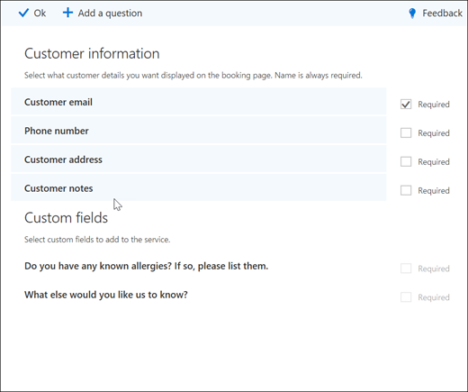

# Aggiungere domande personalizzate e richieste alla pagina di prenotazione

Bookings consente di creare domande per chiedere ai clienti quando prenotano gli appuntamenti. Consente inoltre di scegliere quali domande sono necessarie.

È possibile associare le domande a un servizio, in modo che ogni servizio disponga di una serie di domande diverse. Ad esempio, un hair stylist può chiedere ai clienti che prenotano un appuntamento colorante per capelli se hanno allergie note a sbiancanti o tinte. In questo modo si consente ai clienti di risparmiare tempo quando arrivano per l'appuntamento.

I clienti vedranno le domande personalizzate durante la creazione del loro appuntamento nella pagina di prenotazione. Quando si crea una nuova prenotazione dal calendario delle prenotazioni o quando si visualizza un appuntamento esistente, il personale visualizzerà le domande personalizzate. Le prenotazioni salvano tutte le domande in un elenco principale in modo che non sia necessario ricreare le stesse domande per ogni servizio. È anche possibile scegliere se le domande sono obbligatorie o facoltative.

> [!NOTE]
> Le risposte del cliente alle domande possono essere visualizzate quando si esamina il proprio appuntamento nel calendario di prenotazione.

Per ulteriori informazioni su come personalizzare e personalizzare la pagina di prenotazione, vedere [Customize your Booking page](customize-booking-page.md).

## Aggiungere domande personalizzate ai servizi

1. Accedere a Microsoft 365 e passare a **prenotazioni**.

1. Andare a **Servizi** e modificare un servizio esistente o **aggiungere un servizio**.

1. Scorrere verso il basso fino alla sezione **campi personalizzati** , quindi selezionare **modifica**.

   Sono già state aggiunte alcune domande di base sui clienti: posta elettronica del cliente, numero di telefono, indirizzo del cliente e note del cliente. La prima volta che si esegue questa operazione, le domande relative ai clienti vengono evidenziate in grigio. Questo significa che l'utente vedrà questa domanda. Se si seleziona la domanda, la casella di evidenziazione verrà annienteta e al cliente non verrà posta la domanda.

   In questo esempio, il numero di telefono e le note del cliente sono stati disattivati e sono state create due nuove domande personalizzate da porsi.

   

1. Per rendere obbligatoria la domanda, seleziona la casella di controllo **richiesta** . Il cliente non sarà in grado di completare la prenotazione fino a quando non avranno risposto alle domande richieste.

1. Per creare una domanda personalizzata, selezionare **Aggiungi una domanda** dalla parte superiore del riquadro. Scrivere la propria domanda e quindi fare clic su **Salva**.

1. Fare clic sulla domanda per abilitarla. Viene visualizzata una casella evidenziata e la domanda è abilitata.

1. Fare clic su **OK** nella parte superiore della pagina e quindi **salvare il servizio**.

Le prenotazioni consente di salvare tutte le domande personalizzate in un elenco master in modo da poter aggiungere facilmente le domande a ogni servizio senza dover ripetere più volte le stesse domande. Ad esempio, se si apre un servizio diverso, la domanda creata per il primo servizio verrà visualizzata nella sezione campi personalizzati, ma verrà disabilitata. Fare clic sulla domanda in modo che venga visualizzato un rettangolo evidenziato e che la domanda sia abilitata.

In questo esempio, è possibile vedere che le domande che sono state aggiunte per il primo servizio sono disponibili per questo servizio. Tutte le domande create per questo servizio saranno disponibili per tutti i servizi.

   

Se la pagina di prenotazione è già stata pubblicata, non è necessario eseguire altre operazione. I clienti vedranno le domande alla successiva prenotazione con l'utente. Se la pagina di prenotazione non è ancora stata pubblicata, passare alla **pagina di prenotazione** da Outlook sul Web, quindi selezionare **Salva e pubblica**.

> [!WARNING]
> È inoltre possibile eliminare le domande dall'elenco master. Tuttavia, se si elimina una domanda, questa verrà eliminata da tutti i servizi. Si consiglia di disabilitare la domanda selezionandoli per assicurarsi di non influire su altri servizi. È possibile vedere che una domanda è disabilitata se non è circondata da un rettangolo evidenziato.

## Esperienza del cliente

Quando i clienti prenotano un appuntamento con l'utente, le domande di base sui clienti vengono visualizzate nella sezione **Aggiungi i dettagli** . Tutte le domande personalizzate che si aggiungono saranno **disponibili nella sezione fornire ulteriori informazioni** .

## Esperienza del personale

Quando i clienti prenotano un appuntamento con l'utente, il personale vedrà le domande e le risposte del cliente nel calendario di prenotazione. Per visualizzarlo, vai al **Bookings** \> **Calendario** delle prenotazioni e quindi Apri un appuntamento.

