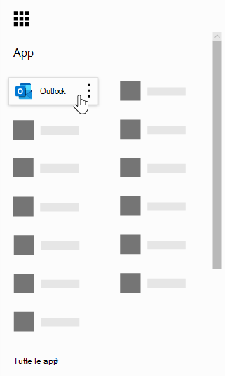
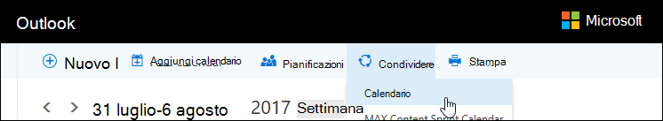
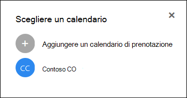

# Domande frequenti su Microsoft bookingsMicrosoft Bookings Frequently Asked Questions

## GeneraleGeneral

### Che cos'è Microsoft bookings?What is Microsoft Bookings?

Microsoft Bookings è un'app Microsoft 365 che semplifica la pianificazione e la gestione degli appuntamenti.Microsoft Bookings is a Microsoft 365 app that makes scheduling and managing appointments easy. Bookings incudes un calendario di prenotazione basato sul Web e si integra con Outlook per ottimizzare il calendario del personale, offrendo ai clienti la possibilità di prenotare un'ora che funziona meglio per loro.Bookings incudes a Web-based booking calendar and integrates with Outlook to optimize your staff’s calendar, giving your customers flexibility to book a time that works best for them. I messaggi di posta elettronica di notifica automatici riducono no-show e le organizzazioni risparmiano tempo con una riduzione delle attività di pianificazione ripetitive.Automated notification emails reduce no-shows, and organizations save time with a reduction in repetitive scheduling tasks. Bookings aiuta a condurre facilmente appuntamenti virtuali tramite Skype o Microsoft teams e consente di gestire la pianificazione quotidiana tramite l'app bookings in teams.Bookings helps you easily conduct virtual appointments via Skype or Microsoft Teams, and helps you manage day-to-day scheduling via the Bookings app in Teams. Con la possibilità di personalizzare la funzionalità predefinita, le prenotazioni sono state progettate in modo da soddisfare le esigenze di più parti di qualsiasi organizzazione.With built-in ability to customize, Bookings is designed to meet the needs of multiple parts of any organization.

### Come si utilizzano le prenotazioni Microsoft?How do I use Microsoft Bookings?

Bookings è un servizio online, quindi non è necessario scaricare nulla.Bookings is an online service, so you don't need to download anything. Basta passare alla finestra di scelta delle app all'interno dell'esperienza Web di Microsoft 365.Just go to the app chooser within the Microsoft 365 Web experience. Gli amministratori possono anche utilizzare l'app Companion bookings per rimanere aggiornati sulle informazioni più aggiornate sui clienti e sui loro appuntamenti.Administrators can also use the Bookings companion app to stay current with the latest information about customers and their appointments.

### Chi ha accesso a Microsoft bookings?Who has access to Microsoft Bookings?

La prenotazione è disponibile e attiva per impostazione predefinita per i clienti Microsoft 365 Business Premium, a3, a5, E3 ed E5 in tutto il mondo.Bookings is available and active by default for Microsoft 365 Business Premium, A3, A5, E3, and E5 customers worldwide. Le prenotazioni sono disponibili anche in Office 365 gestito da 21Vianet.Bookings is also available in Office 365 operated by 21Vianet.

### I clienti visualizzeranno il calendario personale o aziendale?Will my customers see my personal or business calendar?

I clienti vedranno solo il calendario delle prenotazioni che pubblichi online per i servizi, i tempi e il personale che scegli di registrare.Your customers will only see the Bookings calendar that you publish online for the services, times, and staff that you choose to register.

### In che modo gli utenti finali accedono all'app bookings?How do end users access the Bookings app?

Tutti gli utenti che dispongono della licenza per Microsoft 365 Business Premium, a3, a5, E3, E5 o vengono aggiunti come membri del personale nell'amministratore o nei ruoli del visualizzatore possono accedere alle prenotazioni nella finestra di scelta delle app all'interno dell'esperienza Web di Microsoft 365.Anyone who is licensed for Microsoft 365 Business Premium, A3, A5, E3, E5, or is added as a staff member in either the Administrator or Viewer roles can access Bookings in the app chooser within the Microsoft 365 Web experience. Esiste anche un'app Companion disponibile per iOS e Android.There is also a companion app available for iOS and Android.

### È possibile utilizzare le prenotazioni nel proprio sito Web?Can I use Bookings in my own Web site?

Sì.Yes. Viene fornito un modo per incorporare il calendario delle prenotazioni nel sito tramite un iFrame.We provide a way for you to embed your Bookings calendar in your site via an iFrame. Link Embedding code si trova nella scheda **pagina prenotazioni** all'interno dell'app bookings.Link embedding code is located in the **Bookings page** tab within the Bookings app.

### È possibile utilizzare le prenotazioni anche se non si dispone di una pagina Web per la propria azienda?Can I use Bookings even if I don’t have a Web page for my business?

Sì.Yes. Viene fornito un collegamento alla pagina di prenotazione all'interno della scheda della **pagina di prenotazione** nell'app Web.We provide a link to your booking page within the **Booking page** tab in the Web app. È sufficiente fornire il collegamento ai clienti o ai client e verranno visualizzate le informazioni più aggiornate sulla disponibilità per la propria azienda.You just need to provide that link to your customers or clients, and they will see the latest availability information for your business. In alternativa, è possibile condividere la pagina di prenotazione in social media o addirittura utilizzare la funzionalità di incorporamento per ospitarla in un iFrame.Alternatively, you can share the booking page in social media or even use the embed feature to host it in an iFrame. È inoltre possibile controllare gli utenti che possono accedere alla pagina disabilitando l'indicizzazione diretta del motore di ricerca e limitando l'accesso solo alle persone all'interno dell'organizzazione.You also have the ability to control who can access the page by disabling direct search engine indexing and restricting access to only those within your organization.

### Il reparto IT può controllare se gli utenti finali possono accedere alle prenotazioni?Can our IT department control whether end users can access Bookings?

Le prenotazioni sono disponibili in Business Premium, M365 a3/a5 e E3/E5 tenant per impostazione predefinita, ma gli amministratori possono disattivarlo nell'interfaccia di amministrazione di Microsoft 365 se lo desiderano.Bookings is available in Business Premium, M365 A3/A5 and E3/E5 tenants by default, but administrators can turn it off in the Microsoft 365 admin center if they choose. A tale scopo, [seguire le istruzioni](turn-bookings-on-or-off.md)riportate di seguito.To do so, [follow these instructions](turn-bookings-on-or-off.md).

Se un cliente desidera disabilitare l'accesso alle prenotazioni per determinate licenze idonee nel proprio tenant, può essere utilizzato da un criterio di gruppo per limitare le licenze o implementare un criterio di cassette postali OWA che consentirà di limitare gli utenti in grado di creare nuovi calendari di prenotazione.If a customer wants to disable access to Bookings for certain eligible licenses in their tenant, they can either user a group policy to restrict licenses or implement an OWA Mailbox policy that will restrict who is able to create new Bookings calendars.

Se si utilizza un criterio cassetta postale di OWA per disabilitare l'accesso alle prenotazioni, tutti gli utenti disporranno di una licenza di prenotazione, tuttavia quando tentano di accedere all'app, avranno esito positivo solo se fanno parte del criterio o se sono stati aggiunti a un calendario delle prenotazioni esistente come personale.If you use an OWA Mailbox policy to disable access to Bookings, all users will have a Bookings license, however when they attempt to access the app, they will only be successful if they are part of the policy or if they have been added to an existing Bookings calendar as staff. Per [informazioni dettagliate](turn-bookings-on-or-off.md) , vedere la sezione "Consenti solo gli utenti selezionati per creare calendari di prenotazione".Details [here](turn-bookings-on-or-off.md) in the “Allow only selected users to create Bookings calendars” section.

### Le prenotazioni sono personalizzabili?Is Bookings customizable?

Sì, le prenotazioni sono personalizzabili e possono essere utilizzate per una serie di scenari diversi.Yes, Bookings is customizable and can be used for a variety of different scenarios. Quando si configura un calendario delle prenotazioni, è possibile personalizzare molti aspetti della pagina di pianificazione basata sul Web, delle informazioni aziendali, dei dettagli del personale, dei tipi di servizio e dei criteri di pianificazione.When setting up a Bookings calendar, many aspects of the Web-based scheduling page, your business information, staff details, service types, and scheduling policies can be customized.

### Tutte le funzionalità dell'app Web Books originale sono disponibili in Microsoft Teams?Is all the functionality of the original Bookings Web app available in Microsoft Teams?

Una versione leggera delle prenotazioni è ora disponibile come app in teams.A lightweight version of Bookings is now available as an app in Teams. Per favore, trova l'annuncio iniziale [qui](https://www.microsoft.com/microsoft-365/blog/2020/03/06/empowering-care-teams-with-new-tools-in-microsoft-365/).Please find the initial announcement [here](https://www.microsoft.com/microsoft-365/blog/2020/03/06/empowering-care-teams-with-new-tools-in-microsoft-365/). Le funzionalità di collegamento profonde sono disponibili nell'app Web e, dopo l'installazione, è possibile eseguire l'utilizzo giornaliero delle prenotazioni senza lasciare mai i team.There is deep link functionality to pop out in the Web app, and after setup, day-to-day use of Bookings can be done without ever leaving Teams. Le informazioni scorrono tra le varie piattaforme.Information flows across platforms.

### La prenotazione di una piccola azienda o di un'organizzazione o di entrambe le offerte?Is Bookings a small business offering or an Enterprise offering or both?

Bookings è la soluzione ideale sia per i clienti aziendali sia per le piccole imprese, in una vasta gamma di settori.Bookings is an ideal solution for both Enterprise and small business customers, across a variety of industries. I casi di utilizzo includono:Use cases include:

- Servizi finanziariFinancial services
    - consultazioniconsultations
    - Servizi bancari e assicurativibanking and insurance services
    - archiviazioni fiscalitax filings

- Risorse umane (HR)Human resources (HR)
    - interviste ai candidaticandidate interviews
    - onboardingonboarding
    - assistenza ai vantaggibenefits assistance
    - Corsi di formazione e seminaritraining and seminars

- Settore sanitarioHealthcare
    - visite del pazientepatient visits
    - collaborazione tra provider e providerprovider-to-provider collaboration
    - consulenze assicurativeinsurance consults

- Governo & settore pubblicoGovernment & Public Sector
    - udienze e prove giudiziariecourt hearings and trials
    - Servizi pubblicipublic services
    - appuntamenti del repartodepartment appointments

- Istruzione--K-12Education -- K-12
    - Conferenze padre-insegnanteparent-teacher conferences
    - Palazzo comunale scolasticoschool town hall
    - visite degli studenti-consulentistudent-counselor visits

- Education--ed higherEducation -- Higher Ed
    - Orario di ufficiooffice hours
    - tutoraggiotutoring
    - Servizi per gli studentistudent services
    - iscrizione all'esameexam sign-up

- Vendita al dettaglioRetail
    - shopping aiutatoassisted shopping
    - pianificazione del contraentecontractor scheduling
    - Servizi di progettazionedesign services

- Esigenze aziendali generali e di piccole aziendeGeneral Enterprise and small business needs
    - riunioni cliente e clientcustomer and client meetings
    - supporto tecnicotech support
    - Recensioni legalilegal reviews
    - Servizifacilities

## Prezzi e licenzePricing and licensing

### Come si ottengono le prenotazioni Microsoft?How do I get Microsoft Bookings?

Le prenotazioni sono disponibili in Microsoft 365 per i clienti con licenze Business Premium, a3, a5, E3 ed E5, insieme a un'app Companion iOS e Android.Bookings is available in Microsoft 365 for customers with Business Premium, A3, A5, E3, and E5 licenses, along with an iOS and Android companion app. Le prenotazioni non sono disponibili come app autonoma.Bookings is not available as a standalone app. Outlook Web App o Outlook sul Web devono essere abilitati per l'utilizzo di prenotazioni, poiché memorizza i dati in Outlook.Outlook Web App or Outlook on the web must be enabled to use Bookings, as it stores data within Outlook.

Una licenza di prenotazione fornisce funzionalità complete al prodotto, tra cui la creazione e la gestione dei calendari.A Bookings license provides full functionality to the product, including creating and managing calendars. Consente inoltre agli utenti di visualizzare e modificare i calendari esistenti, quando gli utenti vengono aggiunti come membri del personale in un ruolo amministratore o visualizzatore.It also enables the ability for users to view and edit existing calendars, when those users are added as staff in an Administrator or Viewer role.

### È necessario eseguire la migrazione dell'account di posta elettronica dal provider corrente a Microsoft 365?Do I need to migrate my email account from my current provider to Microsoft 365?

È possibile mantenere il provider corrente, ma le prenotazioni invieranno tutte le notifiche al messaggio di posta elettronica utilizzato nell'account Microsoft 365.You can keep your current provider, but Bookings will send all notifications to the email used in your Microsoft 365 account.

### I dipendenti possono utilizzare le prenotazioni senza un account Microsoft 365?Can my employees use Bookings without a Microsoft 365 account?

Sì.Yes. È possibile aggiungere il proprio personale con qualsiasi messaggio di posta elettronica e ricevere comunque la conferma della posta elettronica e il calendario invitare quando qualcuno Prenota un appuntamento con loro.You can add your staff with any email, and they will still get the email confirmation and the calendar invite when someone books an appointment with them.

### È possibile creare più calendari di prenotazioni con lo stesso account Microsoft 365 e passare da un utente all'altro?Can I create more than one Bookings calendar under the same Microsoft 365 account and switch between them?

Sì.Yes. È possibile creare e gestire più di un calendario delle prenotazioni con un solo account.You can create and manage more than one Bookings calendar with one account. È possibile passare da una pagina all'altra utilizzando il cursore accanto al nome dell'azienda nell'app Web bookings.You can switch between them using the caret next to the business name in the Bookings Web app.

### Cosa succede se l'organizzazione dispone di licenze miste con F1/F3, E1 e E3/E5?What if my organization has mixed licenses with F1/F3, E1, and E3/E5?

Si riconosce che molte organizzazioni dispongono di una combinazione di licenze Microsoft 365.We recognize that many organizations have a mixture of Microsoft 365 licensing. Ad esempio, un cliente può disporre di licenze M365 E3 per i dipendenti nelle rispettive sedi, ma M365 E1 (o F1 o F3) licenze per i dipendenti dell'archivio.For example, a customer may have M365 E3 licenses for employees in their headquarters, but M365 E1 (or F1 or F3) licenses for their store employees.

In questo esempio, i dipendenti del quartier generale con una licenza di M365 E3 hanno accesso completo alle prenotazioni, il che significa che possono creare nuovi calendari, modificare le impostazioni, aggiungere personale, pubblicare una pagina di prenotazione, creare e gestire appuntamenti all'interno del calendario e tirare i report.In this example, the headquarters employees with an M365 E3 license have full access to Bookings, which means they can create new calendars, edit settings, add staff, publish a booking page, create and manage appointments within the calendar, and pull reports.

I dipendenti dell'archivio con licenze E1/F1/F3 o senza licenze possono comunque essere aggiunti come personale ai calendari in un ruolo Guest e quindi prenotati per gli appuntamenti e ricevono messaggi di posta elettronica di conferma quando sono prenotati.Those store employees with E1/F1/F3 licenses, or with no licenses, can still be added as staff to calendars in a Guest role and then booked for appointments, and they will receive confirmation emails when they are booked. Possono ancora essere prenotati durante le ore disponibili/pianificate elencate nella scheda staff. La disponibilità del calendario delle prenotazioni vincola gli orari prenotabili per le ore e gli orari di servizio stabiliti.They can still be booked during their available/scheduled hours as listed in the staff tab. The Bookings calendar availability constrains bookable times by their set hours and service hours.

I dipendenti dell'archivio verranno visualizzati anche come non disponibili nelle prenotazioni se un appuntamento è già stato pianificato in quel momento tramite l'app Web bookings.The store employees will also display as unavailable in Bookings if an appointment has already been scheduled at that time through the Bookings Web app. Gli appuntamenti prenotati tramite prenotazione rispecchiano il calendario di un membro del personale all'interno delle prenotazioni.Appointments booked via Bookings will reflect as busy on a staff member's calendar within Bookings. Il personale con una licenza non consentita per le prenotazioni può ancora avere un impatto sul calendario personale sulla disponibilità nelle prenotazioni, purché rientrino nello stesso tenant.Staff with a non-Bookings enabled license can still have their personal calendar impact their availability in Bookings, provided they are within the same tenant.

Gli utenti del ruolo guests possono visualizzare le informazioni fornite dal cliente all'interno della creazione dell'appuntamento iniziale.People in the Guests role can view any of the information the customer has provided within the initial appointment creation. Ad esempio, se il rappresentante dell'archivio prenotato per l'appuntamento è tenuto a chiamare il cliente prima dell'appuntamento, avrà accesso alle informazioni fornite dal cliente durante il processo di pianificazione.For example, if the store representative who is booked for the appointment is required to call the customer prior to the appointment, they will have access to the information the customer provides during the scheduling process. Il membro del personale prenotato avrà accesso a tutte le informazioni visualizzate nel messaggio di posta elettronica di conferma e all'evento del calendario con estensione ICS, ad esempio il numero di telefono del cliente, se è stato immesso.The staff member who is booked will have access to all information that appears in the confirmation email, as well as the .ics calendar event (such as the customer phone number if it was entered).

Gli utenti del ruolo Guest non avranno la possibilità di accedere all'app Web bookings per modificare le impostazioni o per visualizzare e gestire gli appuntamenti (aggiunta, annullamento e ripianificazione).People in the Guest role will not have the ability to access the Bookings Web app to change settings or to view and manage appointments (add, cancel, and reschedule). Tuttavia, possono prendere appuntamenti per conto dei clienti che usano la pagina self-service, nello stesso modo in cui un cliente deve fissare un appuntamento.However, they can make appointments on behalf of customers using the Self-service page, in the same way that a customer would make an appointment.

Si consiglia di autorizzare un responsabile aziendale o un amministratore di ogni archivio con una licenza di prenotazione idonea a configurare e gestire le pagine e gli appuntamenti.We recommend licensing a business manager or administrator of each store with a Bookings-eligible license to set up and manage pages and appointments. Il resto del personale avrebbe quindi collaborato con il dipendente concesso in licenza con le prenotazioni per ripianificare o annullare una prenotazione.The rest of the staff would then work with the employee licensed with Bookings in order to reschedule or cancel a booking.

## Caratteristiche del prodottoProduct features

### Dove vengono visualizzati i calendari delle prenotazioni nel tenant Microsoft 365? \* \*Where do Bookings calendars show up in my Microsoft 365 tenant?\*\*

Ogni nuovo calendario delle prenotazioni crea una cassetta postale corrispondente in Exchange, oltre a una voce correlata in Azure Active Directory (AAD), in cui la voce è elencata come un utente senza licenza.Each new Bookings calendar creates a corresponding mailbox in Exchange, as well as a related entry in Azure Active Directory (AAD), where the entry is listed as an unlicensed user.

### È possibile eliminare un calendario delle prenotazioni creato in precedenza?Can I delete a previously created Bookings calendar?

Per eliminare un calendario delle prenotazioni è necessario eliminare la cassetta postale associata in Exchange.In order to delete a Bookings calendar you must delete the associated mailbox in Exchange.

### Se si crea un calendario e qualcun altro ha accesso alle prenotazioni, potrebbe essere in grado di visualizzare il calendario?If I create a calendar and someone else has access to Bookings, would they be able to see my calendar?

Gli unici utenti che dispongono dell'accesso ai calendari di prenotazione creati (tramite l'app Web) sono tutti gli utenti che sono stati aggiunti come membri del personale, sia in un ruolo di amministratore che di visualizzatore.The only people who have access to Bookings calendars that you create (through the Web app) is anyone who has been added as staff, in either an Administrator or Viewer role. Gli amministratori dei tenant saranno in grado di visualizzare un elenco di tutte le cassette postali di prenotazioni in Exchange e AAD.Tenant admins will be able to see a list of all Bookings mailboxes in Exchange and AAD.

### Le riunioni di video conferenza sono integrate nell'app bookings?Are video conferencing meetings integrated into the Bookings app?

Le riunioni online sono disponibili all'interno delle prenotazioni quando si utilizzano i client Skype o Microsoft teams.Online meetings are available within Bookings when using the Skype or Microsoft Teams clients. Le riunioni online possono essere abilitate a livello di servizio e il client della riunione scelto (Skype o Teams) sarà quello impostato per impostazione predefinita per un membro del personale prenotato.Online meetings can be enabled at the service-level, and the meeting client you choose (Skype or Teams) will be the one set by default for a booked staff member. Per partecipare alle riunioni online, ogni nuovo appuntamento avrà un collegamento di riunione univoco collegato all'appuntamento e, inoltre, le opzioni di join facili sono incluse nell'evento e nei messaggi di posta elettronica di conferma.To join the online meetings, each new appointment will have a unique meeting link attached to the appointment, and in addition, easy join options are included in the event and in confirmation emails.

### Come funziona il criterio di pianificazione?How does scheduling policy work?

Un'impostazione denominata **Maximum lead time** determina il più lontano in anticipo (misurato in giorni) che è possibile effettuare una prenotazione.A setting called **Maximum lead time** determines the farthest in advance (measured in days) that a booking can be made. Devono essere presenti almeno 24 ore tra il **tempo** di conferimento minimo (il tempo di conferimento minimo, in ore, per le prenotazioni e gli annullamenti) e il tempo massimo di esecuzione.There must be at least 24 hours between **Minimum lead time** (the minimum lead time, in hours, for bookings and cancellations) and Maximum lead time. Il tempo massimo di esecuzione può essere impostato su un giorno se il tempo di conferimento minimo è impostato su 0, il che significa che in questo caso un cliente può annullare una prenotazione fino al momento in cui viene avviata e i clienti possono programmare solo le prenotazioni se l'appuntamento è il giorno successivo.Maximum lead time can be set to one day if Minimum lead time is set to 0 hours, which in this case means a customer can cancel a booking up until the time that it starts, and customers can only schedule bookings if the appointment is within the next day.

:::image type="content" source="media/bookings-faq-scheduling.png" alt-text="Pianificazione nelle prenotazioni":::

### In che modo le prenotazioni interagiscono tra fusi orari?How does Bookings work across time zones?

Tutti gli orari sono nel fuso orario di ufficio (il fuso orario locale) per impostazione predefinita.All times are in the business time zone (your local time zone) by default. Questo significa che tutte le impostazioni configurate per un calendario delle prenotazioni, ad esempio le ore lavorative, verranno visualizzate nel fuso orario.This means any setting you configure for a Bookings calendar, such as working hours, will appear in this time zone. La pagina Self-Service ha la possibilità di visualizzare tutti i tempi di appuntamenti nel fuso orario dell'utente finale, che può essere disattivato se lo si desidera.The Self-service page has the ability to display all the appointment times in the end-user's time zone, which can be turned off if desired.Se **sempre la visualizzazione delle fasce orarie nel fuso orario di ufficio** rimane deselezionata nella scheda pagina prenotazioni, gli utenti che visitano la pagina vedranno gli intervalli di tempo nei rispettivi fusi orari locali. If **Always show time slots in business time zone** remains unchecked on the Bookings page tab, then people visiting the page will see time slots in their own local time zones.

:::image type="content" source="media/bookings-faq-region.png" alt-text="Impostazioni delle aree di prenotazione e del fuso orario":::

Non è previsto l'impostazione del fuso orario per il personale nelle prenotazioni.There is no provision to set time zone for staff in Bookings. Il fuso orario del personale e quindi l'orario di ufficio sarà nel fuso orario di ufficio.Staff time zone, and thus business hours, will be in the business time zone.

### È possibile inviare notifiche tramite posta elettronica come nome di dominio del tenant?Can email notifications be sent as the tenant domain name?

Gli indirizzi di posta elettronica vengono controllati e gestiti a livello di impostazioni di Microsoft 365 e dipendono dalle impostazioni di configurazione del dominio.The email addresses are controlled and managed at the Microsoft 365 settings level and depend on the domain configuration settings there. Ulteriori informazioni sono disponibili [qui](https://docs.microsoft.com/powershell/module/exchange/mail-flow/get-accepteddomain?view=exchange-ps).More information can be found [here](https://docs.microsoft.com/powershell/module/exchange/mail-flow/get-accepteddomain?view=exchange-ps).

### La possibilità di inviare messaggi SMS dipende da un servizio diverso o da una configurazione specifica?Is the ability to send SMS messages dependent on a different service or specific configuration?

I messaggi SMS sono attualmente disponibili in Nord America e viene utilizzato un account Skype o Twilio per il recapito SMS.SMS messages are currently available in North America, and a Skype or Twilio account will be used for SMS delivery.

### In che modo è possibile visualizzare gli appuntamenti nel calendario di una persona?How can Bookings appointments show up on a person’s calendar?

La conferma della prenotazione viene inviata alle cassette postali del provider di servizi e del cliente.The confirmation of the booking is sent to both the service provider’s and customer’s inboxes. Il messaggio di posta elettronica di conferma contiene un allegato file con estensione ICS che può quindi essere aggiunto al calendario dell'utente con tutti i dettagli relativi agli appuntamenti.The confirmation email contains an \*.ics file attachment, which can then be added to the user’s calendar with all relevant appointment details.

### Che cosa attiva il provider di servizi o il personale e i messaggi di posta elettronica?What triggers service provider or staff and customer emails?

I messaggi di posta elettronica vengono attivati in base alle impostazioni nella scheda servizi dell'app Web bookings.Emails are triggered based on settings in the Services tab in the Bookings Web app. La prenotazione effettuata dal cliente nella pagina self-service o nella scheda calendario nell'app Web bookings, attiverà una conferma e/o un messaggio di posta elettronica di promemoria.A booking made by the customer on the Self-service page, or on the Calendar tab in the Bookings Web app, will trigger a confirmation and/or a reminder email. La stessa cosa accadrà quando qualcuno apporta una modifica alla prenotazione tramite il pulsante **Gestisci prenotazione** nell'e-mail di conferma o all'interno dell'applicazione Web.The same thing will happen when someone makes a change to the booking via the **Manage booking** button in the confirmation email or within the Web app. I messaggi di posta elettronica di sollecito vengono inviati a un determinato periodo di tempo prima di un appuntamento, come descritto nella scheda servizi dell'applicazione Web bookings.Reminder emails are sent at a specified time period prior to an appointment, as detailed in the Services tab in the Bookings Web app.

### È possibile prenotare appuntamenti in stile aula che sono 1: molti invece di 1:1?Can I book classroom-style appointments that are 1:many instead of 1:1?

Sì, è presente una funzionalità di prenotazioni di gruppo che consente a più persone di prenotare lo stesso appuntamento contemporaneamente, ad esempio per una classe di fitness.Yes, we have a group bookings functionality that allows multiple people to book the same appointment at the same time (such as for a fitness class). Questa funzionalità è descritta in dettaglio [qui](https://techcommunity.microsoft.com/t5/microsoft-bookings-blog/microsoft-bookings-now-supports-online-meetings-and-group/ba-p/1214120).This functionality is described in detail [here](https://techcommunity.microsoft.com/t5/microsoft-bookings-blog/microsoft-bookings-now-supports-online-meetings-and-group/ba-p/1214120).

### I calendari possono rimanere inediti (non di fronte pubblico) ma ancora accessibili agli utenti designati?Can calendars remain unpublished (not public-facing) but still accessible to designated users?

Sì.Yes. È presente una casella di controllo nella scheda pagina di prenotazione nell'app Web: **richiedere l'esecuzione di un account di Microsoft 365 o di Office 365 da**parte dell'organizzazione.There is a check box on the Booking page tab in the Web app: **Require a Microsoft 365 or Office 365 account from my organization to book**. Se si seleziona questa casella di controllo, si limita l'accesso alle pagine in modalità self-service solo a quelle presenti all'interno del tenant.Selecting this check box restricts Self-service page access to only those that are within your tenant. Il calendario delle prenotazioni che si trova all'interno dell'app Web per la creazione e la gestione può essere eseguito solo dagli utenti aggiunti come personale alla pagina con ruoli di amministratore o di visualizzatore.The Bookings calendar that sits within the Web app for creation and management can only be accessed by those individuals added as staff to the page with Administrator or Viewer roles.

:::image type="content" source="media/bookings-faq-access-ctrl.png" alt-text="Controllo di accesso alle pagine di prenotazione nelle prenotazioni":::

### Con quale frequenza viene aggiornata la Home page?How frequently does the Home page update?

I dati più recenti collegati alla Home page vengono recuperati ogni volta che viene caricata l'applicazione Web.The latest data linked to your Home page is retrieved  whenever the Web app is loaded. Per ulteriori informazioni sul tipo di informazioni registrate dalle prenotazioni, vedere questo articolo di [supporto](metrics-and-activity-tracking.md).For further details on the type of information tracked by Bookings, see this [support article](metrics-and-activity-tracking.md).

### È possibile disattivare le notifiche tramite posta elettronica per il tempo di disattivazione?Can I turn off the email notifications for Time Off?

La registrazione di un timeout all'interno dell'app Web bookings attiverà sempre un messaggio di posta elettronica di notifica ai membri del personale.Recording Time Off within the Bookings Web app will always trigger a notification email to staff members. Se i membri del personale sono confusi sulla notifica, si consiglia di aggiungere ulteriori dettagli nelle note o nel titolo della notifica di timeout, per informare meglio il personale su ciò che si sta verificando dal punto di vista dell'amministratore.If any staff members are confused about the notification, we recommend you add more detail in the notes or title of the Time Off notification, to better inform staff about what is occurring on the admin side.

### I calendari delle prenotazioni possono essere clonati o duplicati e possono essere templatized per semplificare la scalabilità?Can Bookings calendars be cloned or duplicated, and can they be templatized for easy scaling?

La possibilità di duplicare le pagine è attualmente disponibile tramite PowerShell.The ability to duplicate pages is currently available via PowerShell. Il processo consiste nell'utilizzare l'API del grafico per ottenere i dettagli della cassetta postale e quindi utilizzare tali dettagli per creare una nuova cassetta postale.The process would be to use the Graph API to get mailbox details, and then use those details to create a new mailbox. La documentazione API è [qui](https://docs.microsoft.com/graph/api/resources/booking-api-overview?view=graph-rest-beta).API documentation is [here](https://docs.microsoft.com/graph/api/resources/booking-api-overview?view=graph-rest-beta).

### Quali relazioni sono disponibili nelle prenotazioni?What reporting is available in Bookings?

Tutti i membri del personale di prenotazione assegnati al ruolo di amministratore possono scaricare i valori separati da tabulazione (. TSV) file con tutte le prenotazioni effettuate negli ultimi 120 giorni.All Bookings staff assigned to the Administrator role can download a tab-separated values (.TSV) file with all bookings made in the past 120 days. È possibile scaricare i rapporti di prenotazione. Formato TSV dalla scheda Home della pagina bookings.Bookings reports can be downloaded in .TSV form from the Home tab of the Bookings page. L'API bookings può anche essere utilizzata per raccogliere i dati per scopi più personalizzati e specifici.The Bookings API can also be used to collect this data for more customized and specific purposes.

### È possibile condividere un solo servizio nella pagina self-service alla volta?Is it possible to share only one service on the Self-service page at a time?

Sì, è possibile creare calendari di prenotazioni separate per ogni servizio oppure andare alla scheda servizi, modificare un servizio e nella parte superiore della pagina verrà visualizzata un'opzione per condividere un URL solo per il servizio specifico.Yes, you can either create separate Bookings calendars for each service, or you can go to the Services tab, edit a service, and at the top of the page you will see an option to share a URL only for that specific service.

### Quali opzioni sono disponibili per l'inclusione di un modulo di consenso o divulgazione per coloro che prenotano un appuntamento?What options are available for embedding a consent form or disclosure for those booking an appointment?

È consigliabile abilitare la casella di controllo **consenso all'utilizzo dei dati del cliente** nella pagina di prenotazione e personalizzare la formulazione per trasmettere adeguatamente i requisiti di consenso o divulgazione dell'organizzazione.We recommend enabling the **Customer data usage consent** check box in the Booking page and customizing the wording to properly convey your organization's disclosure or consent requirements. Un'altra opzione consiste nell'aggiungere un campo personalizzato al servizio che include un collegamento al modulo di consenso e richiedere ai clienti di confermare di aver completato il modulo prima che possano continuare a fissare un appuntamento.Another option is to add a custom field to the service that includes a link to the consent form, and require customers to confirm that they have completed the form before they can proceed with making an appointment. È inoltre possibile aggiungere l'URL del modulo di consenso come note aggiuntive nei messaggi di conferma e di sollecito, ma non impedisce agli utenti di prenotare un appuntamento.You can also add the consent form URL as additional notes in confirmation and reminder emails, but this will not prevent users from booking an appointment.

### Quali modifiche possono essere apportate alla funzionalità di selezione del personale nella pagina di prenotazione in modalità self-service?What changes can be made to the staff selection capability on the Self-service booking page?

La possibilità per i clienti di selezionare i membri del personale specifici quando la prenotazione può essere rimossa completamente deselezionando l'opzione **Consenti ai clienti di scegliere una persona specifica per la prenotazione** dalla pagina di prenotazione o dalla sezione servizi.The ability for customers to select specific staff members when booking can be removed completely by de-selecting the **Allow customers to choose a specific person for the booking** option from the Booking page or the Services section. Le prenotazioni assegnerà automaticamente un membro del personale disponibile in modo casuale alla prenotazione, in base alla disponibilità del personale.Bookings will automatically assign an available staff member at random to the booking, based on staff availability.

### Le prenotazioni possono supportare numerose richieste di prenotazione simultanee e visite a pagine self-service?Can Bookings support many concurrent booking requests and Self-service page visits?

La prenotazione è in grado di supportare una quantità elevata di visitatori e prenotazioni contemporaneamente.Booking can support a large quantity of visitors and bookings at one time. Se nella pagina è presente un volume molto elevato di traffico, gli utenti riceveranno un errore "Server occupato".If the page experiences a very large volume of traffic, users will receive a “server busy” error. La disponibilità degli appuntamenti viene aggiornata quando viene caricata la pagina e quando viene effettuata una prenotazione.Appointment availability is updated when the page is loaded, as well as when a booking is made. Se più persone tentano di prenotare lo stesso appuntamento contemporaneamente, le prenotazioni consentiranno solo a una persona di prenotare quel momento e di fornire un messaggio di notifica agli altri potenziali clienti e di chiedere loro di trovare un orario diverso.If multiple people are trying to book the same appointment at one time, Bookings will only let one person book that time and give a notification message to the other potential customers, and prompt them to find a different time.

## PrivacyPrivacy

### Dove sono archiviati i dati delle prenotazioni?Where is Bookings data stored?

Bookings è un'app Microsoft 365, che indica che tutti i dati sono archiviati all'interno della piattaforma Microsoft 365 e in Exchange.Bookings is a Microsoft 365 app, meaning all data is stored within the Microsoft 365 platform and in Exchange. Bookings segue tutti i criteri di archiviazione dei dati impostati da Microsoft, che sono gli stessi criteri seguiti da tutte le app di Office.Bookings follows all data storage policies set by Microsoft, which are the same policies followed by all Office apps. Bookings utilizza cassette postali condivise in Exchange per archiviare i dettagli dei clienti, del personale, del servizio e degli appuntamenti.Bookings uses shared mailboxes in Exchange to store customer, staff, service, and appointment details. I criteri di conformità per le cassette postali condivise in Exchange si applicano anche alle cassette postali.Compliance policies for shared mailboxes in Exchange also apply for Bookings mailboxes. Tutti i dati dei clienti (incluse le informazioni fornite dai clienti al momento della prenotazione) vengono acquisiti nelle prenotazioni e sono archiviati all'interno dell'app, quindi vengono archiviati in Exchange.All customer data (including information provided by customers when booking) is captured in Bookings and is stored within the app, thus it is stored within Exchange. Microsoft bookings utilizza gli stessi criteri utilizzati da Microsoft 365, che è possibile trovare [qui.](https://www.microsoft.com/online/legal/v2/?docid=22&langid=en-us)Microsoft Bookings uses the same policies used by Microsoft 365, which you can find [here.](https://www.microsoft.com/online/legal/v2/?docid=22&langid=en-us)

### È possibile gestire in modo centralizzato i calendari delle prenotazioni per tutti gli utenti?Is there a way to centrally manage Bookings calendars for all users?

Ogni calendario delle prenotazioni viene gestito in modo indipendente.Each Bookings calendar is maintained independently. Non esiste una visualizzazione consolidata, diversa dall'elenco a discesa ricerca dopo aver fatto clic sul cursore nella Home page.There is no consolidated view, other than the search drop-down after clicking the caret on the home page.

### Come vengono autenticati gli utenti?How are users authenticated?

L'accesso all'app Web bookings implica l'autenticazione tramite l'autenticazione di Azure Active Directory (AAD) normale.Access to the Bookings Web app involves authentication through the regular Azure Active Directory (AAD) authentication. La pagina di prenotazione self-service può essere messa a disposizione di tutti gli utenti con il collegamento alla pagina Web.The Self-service booking page can be made available to everyone with the Web page link. Tuttavia, quando è selezionata l'impostazione **Richiedi un account di microsoft 365 o Office 365 dall'organizzazione** per la Rubrica, la pagina viene limitata per essere utilizzata solo all'interno del tenant di Microsoft 365 (utilizzando l'autenticazione AAD).However, when the **Require a Microsoft 365 or Office 365 account from my organization** to book setting is selected, the page is restricted for use only within the Microsoft 365 tenant (using AAD authentication).

:::image type="content" source="media/bookings-faq-access-ctrl.png" alt-text="Controllo di accesso alle pagine di prenotazione nelle prenotazioni":::

### I dati dei clienti lasciano il sistema di produzione per qualsiasi motivo?Does customer data leave the production system for any reason?

Sì, poiché le prenotazioni fanno parte di Exchange, è possibile consentire ai clienti di scaricare le API del grafico e le API di servizi Web Exchange (EWS) per il download dei propri dati a cui possono accedere.Yes, since Bookings is a part of Exchange, we allow Graph APIs and Exchange Web Services (EWS) APIs for the customers to download their own data to which they have access.

### Esiste la possibilità di personalizzare gli indirizzi di posta elettronica per le risposte dei clienti?Is there the ability to customize email addresses for customer replies?

È possibile definire il tipo di indirizzo di posta elettronica a cui inviare le risposte.There is the ability to define which email address customer send their replies to. Questa impostazione si trova nella scheda **informazioni business** . Il nome della cassetta postale bookings può essere modificato anche all'interno di Exchange, tramite i consueti processi di ridenominazione delle cassette postali di Exchange.This setting is on the **Business information** tab. The Bookings mailbox name itself can also be changed within Exchange, through usual Exchange mailbox renaming processes.

### Il cliente desidera accettare i termini e le condizioni nel corso del processo di prenotazione.We would like for the customer to accept our terms and conditions during the booking process. È possibile?Is that possible?

Questa funzionalità esiste già per la conformità di GDPR.This feature already exists for GDPR compliance. La pagina di prenotazione ha un campo per il consenso personalizzato, proprio sotto la sezione Dettagli pubblicazione.The Booking page has a field for custom consent, right under the publishing details section. Basta spuntare la casella e scrivere un messaggio di consenso personalizzato e verrà visualizzato come campo obbligatorio nella pagina self-service.Just check that box and write your own custom consent message and it will show up as a required field on the Self-service page. La data e l'ora in cui il cliente concede il consenso verranno registrate.The date and time that the customer grants consent will be recorded.

In questa sezione non è supportato il testo RTF, ma è possibile aggiungere i collegamenti nella sezione informazioni business e visualizzarli appena sotto la casella di controllo consenso.This section does not support rich text, but think links can be added under the business information section and would show up just below the consent check box.

### In che modo è possibile identificare le cassette postali associate in Exchange?How can Bookings-associated mailboxes in Exchange be identified?

È possibile utilizzare il comando seguente per recuperare le informazioni di tutte le cassette postali di prenotazione e gli utenti che dispongono dell'accesso.The following command can be used to retrieve information of all Bookings mailboxes and users who have access to them.

`Get-Mailbox -RecipientTypeDetails SchedulingMailbox -ResultSize:Unlimited | Get-MailboxPermission |Select-Object Identity,User,AccessRights | Where-Object {($\_.user -like '\*@\*')}`

## Domande tecnicheTechnical Questions

### Se un utente pianifica un appuntamento per un servizio costituito da una riunione online, come ricevono il collegamento Microsoft teams alla riunione se lasciano vuoto il campo indirizzo di posta elettronica facoltativo?If a user schedules an appointment for a service consisting of an online meeting, how do they receive the Microsoft Teams link to the meeting if they leave the optional email address field empty?

Se il sistema non dispone delle informazioni di posta elettronica del cliente, non è possibile recapitare il messaggio di conferma al cliente e quindi non riceveranno un collegamento a squadre.If the system does not have the customer's email information, there is no way for the confirmation mail to be delivered to the customer, and thus they will not receive a Teams link. La soluzione consiste nel impostare l'indirizzo di posta elettronica come campo obbligatorio, che è possibile eseguire nella scheda servizi di bookings.The solution is to set the email address as a required field, which you can do on the Services tab of Bookings. Si noti che ogni volta che si crea un nuovo servizio in bookings, il campo di posta elettronica del cliente è impostato come campo obbligatorio per impostazione predefinita.Note that whenever you create a new service in Bookings, the customer email field is set as a required field by default.

### In che modo il personale viene assegnato agli appuntamenti quando viene selezionato "chiunque" o quando i clienti non hanno la possibilità di scegliere un membro del personale per l'appuntamento?How are staff assigned to appointments when “Anyone” is selected, or when customers do not have the ability to choose a staff member for the appointment?

Il personale viene assegnato in modo casuale in questi scenari, fuori da tutti i membri del personale disponibili al momento dell'appuntamento in fase di prenotazione.Staff are assigned randomly in these scenarios, out of all staff members available at the time of the appointment being booked. Attualmente non esiste alcun modo per garantire la distribuzione equa degli appuntamenti assegnati casualmente in tutti i membri del personale o per limitare il numero di appuntamenti assegnati a ciascun membro del personale.Currently there is no way to ensure equal distribution of randomly assigned appointments across all members of the staff, or to cap the number of assigned appointments to each staff member. Se il bilanciamento del carico deve essere eseguito in tutto il personale dopo un certo numero di assegnazioni casuali, può essere eseguito manualmente nella scheda calendario all'interno della pagina bookings.If there is load-balancing that needs to be done across your staff after a number of random assignments, it can be done manually in the Calendar tab within the Bookings page.

### In che modo gli utenti possono scegliere di non ricevere messaggi SMS se sono già stati precedentemente scelti?How can users opt out of receiving SMS messages if they have already opted in previously?

Quando si prenota un appuntamento con i messaggi SMS abilitati, ai clienti verrà richiesto di controllare la casella opt-in ogni volta che si prenota.When booking an appointment with SMS text messages enabled, customers will be prompted to check the opt in box each time they book. I clienti possono anche rispondere direttamente al messaggio SMS (il provider di SMS) che indica che desiderano che i messaggi vengano cessati e che non vengano inviati altri testi a quel numero di telefono.Customers can also reply directly to the SMS message (the SMS provider) indicating that they would like the messages to cease, and then no further texts will be sent to that phone number. Se il cliente sceglie di non ricevere messaggi di testo dal provider, non dalle prenotazioni stesse, non riceverà più messaggi SMS in futuro, anche quando si sceglie dalla pagina bookings.If the customer opts out of receiving text messages from the provider, not from Bookings itself, they will no longer receive SMS messages in the future, even when opting in from the Bookings page.

## Risoluzione dei problemiTroubleshooting

### Il calendario di questo membro del personale non può essere sincronizzatoThis staff member's calendar can't be synced

Se viene visualizzato l'errore "il calendario di questo membro del personale non può essere sincronizzato", questa sezione contiene diverse procedure per la risoluzione dei problemi che consentono di risolvere l'errore.If you receive the error, "This staff member's calendar can't be synced", this section contains several troubleshooting procedures to help you resolve the error.

> [!NOTE]
> La prenotazione è attivata per impostazione predefinita per i clienti che hanno gli abbonamenti Microsoft 365 business standard, Microsoft 365 a3 o Microsoft 365 a5.Bookings is turned on by default for customers who have the Microsoft 365 Business Standard, Microsoft 365 A3, or Microsoft 365 A5 subscriptions. La prenotazione è disponibile anche per i clienti che dispongono di Office 365 Enterprise E3 e Office 365 Enterprise E5, ma è disattivata per impostazione predefinita.Bookings is also available to customers who have Office 365 Enterprise E3 and Office 365 Enterprise E5, but it is turned off by default. Per iniziare, vedere [accesso a Microsoft bookings](get-access.md).To get started, see [Get access to Microsoft Bookings](get-access.md). Per abilitare o disabilitare le prenotazioni, vedere [attivazione o disattivazione delle prenotazioni per l'organizzazione](turn-bookings-on-or-off.md).To turn Bookings on or off, see [Turn Bookings on or off for your organization](turn-bookings-on-or-off.md).

Se si desiderano informazioni sulla sincronizzazione del calendario del personale, vedere [Add staff to bookings](add-staff.md).If you are looking for information on syncing your staff's calendar, see [Add staff to Bookings](add-staff.md). Verificare che nella pagina dei **Dettagli del personale** siano verificati **gli eventi** relativi alla disponibilità del calendario.Make sure on the **Staff details** page, **Events on calendar affect availability** is checked.

### Il membro del personale deve modificare le autorizzazioni del calendarioThe staff member needs to change their calendar permissions

Affinché le prenotazioni siano sincronizzate correttamente con i calendari dei membri del personale, ogni membro del personale deve condividere il calendario.In order for Bookings to properly sync with your staff members' calendars, each staff member must share their calendar. Ogni membro del personale deve seguire queste istruzioni per condividere il proprio calendario.Each staff member must follow these instructions to share their own calendar.

1. Accedere a Microsoft 365, quindi selezionare **Outlook** dall'icona di avvio delle app.Sign in to Microsoft 365, and then select **Outlook** from the app launcher.

   

1. Nella parte superiore della pagina, selezionare **Condividi** \> **Calendario**.At the top of the page, select **Share** \> **Calendar**.

   

1. Nella sezione **utenti all'interno della propria organizzazione** selezionare la casella di menu a discesa accanto a **organizzazione**e quindi selezionare **può visualizzare quando sono occupato**.In the **People inside your organization** section, select the drop-down box next to **My Organization**, and then select **Can view when I'm busy**.

> [!NOTE]
> Questa impostazione consente di condividere le informazioni sulla disponibilità con le prenotazioni e con gli altri utenti dell'organizzazione.This setting shares your free/busy information with Bookings and with other users in your organization. Non include altre informazioni, ad esempio il tipo di appuntamento pianificato, a cui è stato pianificato l'appuntamento o il percorso.It does not include any other information, such as what type of appointment you have scheduled, who you have scheduled the appointment with, or the location.

   

1. Scegliere **Fine**.Select **Done**.

### Non è possibile trovare un membro del personale nell'organizzazioneWe can't find a staff member in our organization

Se un dipendente ha lasciato la propria azienda e li ha rimossi dall'organizzazione Microsoft 365 o Office 365, è comunque necessario rimuovere quell'utente dalle prenotazioni in modo che non vengano visualizzati nel calendario e impediscono ai clienti di prenotare appuntamenti con tali utenti.If an employee has left your company and you removed them from your Microsoft 365 or Office 365 organization, you still need to remove that user from Bookings so they won't show up in the calendar and to prevent customers from booking appointments with them.

1. Accedere a Microsoft 365 e quindi passare a personale di **prenotazione** \> **Staff**.Sign in to Microsoft 365, and then go to **Bookings** \> **Staff**.

1. Posizionare il cursore del mouse sul nome del membro del pentagramma.Hover your mouse cursor over the staff member's name. La **modifica** e l' **eliminazione** delle icone vengono visualizzate a destra della colonna **Phone** .**Edit** and **delete** icons appear to the right of the **Phone** column.

1. Selezionare l'icona **Elimina** .Select the **Delete** icon.

1. Nella casella di conferma fare clic su **OK**.In the confirmation box, select **OK**.

> [!NOTE]
> Se si dispone di più di un calendario di prenotazione, è necessario rimuovere l'utente da tutti gli utenti.If you have more than one booking calendar, you must remove the user from all of them.

Per verificare se sono presenti più calendari, nel menu a sinistra selezionare la freccia a discesa accanto al nome della società e quindi selezionare **Apri**.To check if you have more than one calendar, in the left menu, select the drop-down arrow next to your company name, and then select **Open**. Se si dispone di un solo calendario, sarà possibile visualizzare solo l'opzione per aggiungere un calendario di prenotazione.If you only have one calendar, then you will see only the option to add a booking calendar. In questo esempio viene mostrato che è presente un secondo calendario denominato "contoso CO".This example shows that there is a second calendar named "Contoso CO".

   

### È presente un errore di sincronizzazione che non è possibile identificareThere's a syncing error we can't identify

Si tratta di un errore temporaneo che si verifica in genere a causa di una connessione Internet instabile.This is a transient error and typically occurs because of an unstable internet connection. Questi problemi in genere si risolvono dopo qualche minuto.These problems usually resolve themselves after a few minutes.

Se si continua a visualizzare questo errore dopo un periodo di tempo prolungato o se lo si vede spesso, contattare il supporto tecnico.If you still see this error after an extended period of time or you are seeing it often, please contact support.

## Risorse aggiuntiveAdditional resources

  - [Microsoft bookings espande la disponibilità nel Blog delle aziendeMicrosoft Bookings expands availability in the enterprises blog](https://techcommunity.microsoft.com/t5/microsoft-bookings-blog/microsoft-bookings-expands-availability-in-enterprises/ba-p/1214065)

  - [Come funziona il video di Microsoft bookingsHow Microsoft Bookings Works video](https://support.office.com/article/microsoft-bookings-69c45b78-6de4-4f28-9449-cdcc18b7ae45)

  - [Iniziare a utilizzare Microsoft bookingsStart using Microsoft Bookings](get-access.md)

  - [Attivazione o disattivazione delle prenotazioni MicrosoftTurn Microsoft Bookings on or off](turn-bookings-on-or-off.md)

  - [Aggiungere utenti singolarmente o in bloccoAdd users individually or in bulk](https://docs.microsoft.com/microsoft-365/admin/add-users/add-users?view=o365-worldwide.)

  - [Aggiungere personale alle prenotazioniAdd staff to Bookings](add-staff.md)

  - [Componenti API per automatizzare dopo la definizione del modelloAPI components to automate after template has been defined](https://docs.microsoft.com/graph/api/bookingbusiness-post-bookingbusinesses)

  - [URL del calendario delle prenotazioni per la visualizzazioneURL to Bookings Calendar for Display](https://outlook.office.com/bookings/calendar)

  - [Criteri di conformità per le prenotazioniBookings compliance policies](https://docs.microsoft.com/microsoft-365/compliance/gdpr-dsr-office365?view=o365-worldwide#bookings)

  - [Personalizzare e pubblicare la pagina di prenotazioneCustomize and publish your booking page](customize-booking-page.md)

  - [Configurazione della cassetta postale tenantTenant Mailbox configuration](https://docs.microsoft.com/powershell/module/exchange/mail-flow/get-accepteddomain?view=exchange-ps)

  - [Prenotazioni di gruppoGroup Bookings](https://techcommunity.microsoft.com/t5/microsoft-bookings-blog/microsoft-bookings-now-supports-online-meetings-and-group/ba-p/1214120)

  - [Metriche di prenotazioni e Tracking attivitàBookings metrics and activity tracking](metrics-and-activity-tracking.md)

  - [Roadmap pubblica di M365M365 Public Roadmap](https://www.microsoft.com/microsoft-365/roadmap?filters=&searchterms=bookings)

  - Inviare commenti e suggerimenti tramite [UserVoice](https://outlook.uservoice.com/forums/314907-microsoft-bookings/suggestions/39505261-365-admins-should-have-full-access-to-all-bookings)Submit feedback via [UserVoice](https://outlook.uservoice.com/forums/314907-microsoft-bookings/suggestions/39505261-365-admins-should-have-full-access-to-all-bookings)
