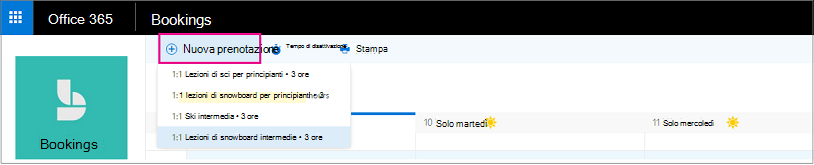

# Creare una prenotazione manuale

Le prenotazioni possono essere pianificate e assegnate al personale in due modi diversi. Il primo modo è il cliente che utilizza una pagina di prenotazione autonoma o una pagina di prenotazione incorporata che viene aggiunta al sito Web. L'altro modo è che tu o uno dei tuoi dipendenti Immetti manualmente le prenotazioni, ad esempio quando un cliente chiama per un appuntamento. Questo articolo illustra lo scenario manuale.

> [!NOTE]
> La prenotazione è attivata per impostazione predefinita per i clienti che hanno gli abbonamenti Microsoft 365 business standard, Microsoft 365 a3 o Microsoft 365 a5. La prenotazione è disponibile anche per i clienti che dispongono di Office 365 Enterprise E3 e Office 365 Enterprise E5, ma è disattivata per impostazione predefinita. Per iniziare, vedere [accesso a Microsoft bookings](get-access.md). Per abilitare o disabilitare le prenotazioni, vedere [attivazione o disattivazione delle prenotazioni per l'organizzazione](turn-bookings-on-or-off.md).

1. In Microsoft 365 selezionare l'icona di avvio delle app e quindi selezionare **bookings**.

   

1. Nel riquadro di spostamento selezionare **Calendario** \> **Nuova prenotazione**.

   

1. Selezionare il servizio da fornire. Per istruzioni sulla configurazione del servizio, vedere [definire le offerte di servizi in Microsoft bookings](define-service-offerings.md) .

1. Immettere le informazioni sul cliente, come nome, indirizzo di posta elettronica, numero di telefono e altri dettagli importanti.

1. Selezionare il membro del personale che fornirà il servizio. L'elenco dei membri del personale si basa su quanto configurato nella pagina dei servizi.

   

1. Immettere i dettagli relativi al servizio, tra cui data, ora, luogo e altre informazioni rilevanti. Dopo aver immesso un indirizzo di posta elettronica valido per il cliente, il pulsante **Salva** diventa **Invia** e si vedrà una nota che informa che verrà inviato un messaggio di conferma al cliente. Il messaggio di conferma include un allegato che il cliente potrà aggiungere al suo calendario. I membri del personale selezionati, inoltre, riceveranno convocazioni di riunione con le informazioni sull'appuntamento, che potranno aggiungere ai propri calendari.

1. Selezionare **Aggiungi promemoria tramite posta elettronica**.

1. Specificare quando deve essere inviato il promemoria, dove deve essere inviato (**cliente**, **personale**, **tutti i partecipanti**) e cosa dovrebbe essere il messaggio di sollecito.

1. Selezionare **Salva** \> **Invia**.

   Di seguito è riportato un messaggio di posta elettronica di esempio del promemoria che il cliente riceverà:

:::image type="content" source="../media/bookings-confirmed-email.png" alt-text="Schermata: esempio di conferma della posta elettronica da una prenotazione manuale":::