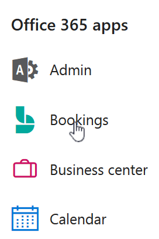

# Creare una prenotazione manuale

Le prenotazioni possono essere pianificate e assegnate al personale in due modi diversi. Il primo modo è che il cliente usa una pagina di prenotazione autonoma o una pagina di prenotazione incorporata che aggiungi al tuo sito Web. In alternativa, le prenotazioni possono essere inserite manualmente dal titolare o dai dipendenti dell'azienda, ad esempio quando un cliente chiama per prendere appuntamento. Questo articolo illustra lo scenario manuale.

1. In Microsoft 365, seleziona l'icona di avvio delle app e quindi seleziona **Prenotazioni.**

   

1. Nel riquadro di spostamento selezionare **Calendario** \> **Nuova prenotazione**.

   

1. Selezionare il servizio da fornire. Vedi [Definire le offerte di servizio in Microsoft Bookings per](define-service-offerings.md) istruzioni sulla configurazione del servizio.

1. Immettere le informazioni sul cliente, come nome, indirizzo di posta elettronica, numero di telefono e altri dettagli importanti.

1. Selezionare il membro del personale che fornirà il servizio. L'elenco dei membri del personale si basa su quanto configurato nella pagina dei servizi.

   

1. Immettere i dettagli relativi al servizio, tra cui data, ora, luogo e altre informazioni rilevanti. Dopo aver immesso un indirizzo di posta elettronica valido per il cliente, il pulsante **Salva** diventa **Invia** e si vedrà una nota che informa che verrà inviato un messaggio di conferma al cliente. Il messaggio di conferma include un allegato che il cliente potrà aggiungere al suo calendario. I membri del personale selezionati, inoltre, riceveranno convocazioni di riunione con le informazioni sull'appuntamento, che potranno aggiungere ai propri calendari.

1. Selezionare **Aggiungi promemoria tramite posta elettronica**.

1. Specificare quando inviare il promemoria, dove deve essere inviato (**Cliente,** **Personale,** **Tutti** i partecipanti ) e quale dovrebbe essere il messaggio di promemoria.

1. Selezionare **Salva** \> **Invia**.

   Ecco un esempio di messaggio di posta elettronica del promemoria che il cliente riceverà:

:::image type="content" source="../media/bookings-confirmed-email.png" alt-text="Screenshot: Example confirmation email from a manual booking":::