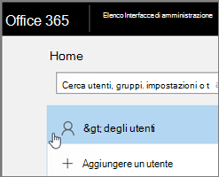
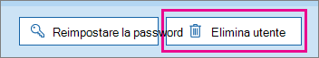

# <a name="delete-a-booking-calendar-in-bookings"></a>Eliminare un calendario delle prenotazioni in Bookings

Questo articolo spiega come eliminare un calendario di prenotazione indesiderato. È possibile eliminare il calendario delle prenotazioni nell'interfaccia di amministrazione di Microsoft 365 oppure usare PowerShell. Il calendario di Bookings è una cassetta postale in Exchange Online in modo da eliminare l'account utente corrispondente per eliminare il calendario delle prenotazioni.

> [!IMPORTANT]
> Tutti i calendari di prenotazione creati nel 2017 o prima devono essere eliminati usando le istruzioni di PowerShell in questo argomento. Tutti i calendari di prenotazione creati nel 2018 o dopo possono essere eliminati nell'interfaccia di amministrazione di Microsoft 365.

Nel calendario di prenotazione sono archiviate tutte le informazioni rilevanti relative a tale calendario e dati di prenotazione, tra cui:

- Informazioni aziendali, logo e orario di lavoro aggiunti al momento della creazione del calendario delle prenotazioni
- Personale e servizi pertinenti aggiunti al momento della creazione del calendario delle prenotazioni
- Tutte le prenotazioni e gli appuntamenti fuori servizio aggiunti al calendario delle prenotazioni dopo la sua creazione.

> [!WARNING]
> Una volta eliminato un calendario delle prenotazioni, anche queste informazioni aggiuntive vengono eliminate definitivamente e non possono essere recuperate.

## <a name="delete-a-booking-calendar-in-the-microsoft-365-admin-center"></a>Eliminare un calendario delle prenotazioni nell'interfaccia di amministrazione di Microsoft 365

1. Passare all'interfaccia di amministrazione di Microsoft 365.

1. Nell'interfaccia di amministrazione selezionare **Utenti**.

   

1. Nella pagina **Utenti attivi** scegliere i nomi degli utenti da eliminare, quindi selezionare **Elimina utente**.

   

## <a name="delete-a-booking-calendar-using-exchange-online-powershell"></a>Eliminare un calendario delle prenotazioni tramite PowerShell di Exchange Online

Vedere [Connettersi a PowerShell di Exchange Online](https://docs.microsoft.com/powershell/exchange/exchange-online-powershell-v2?view=exchange-ps) per i prerequisiti e le indicazioni per la connessione a PowerShell di Exchange Online.

Per eseguire questi passaggi, è necessario utilizzare una finestra di comando attiva di Microsoft PowerShell eseguita scegliendo l'opzione "Esegui come amministratore".

1. In una finestra di PowerShell caricare il modulo EXO V2 eseguendo il comando seguente:

   ```powershell
   Import-Module ExchangeOnlineManagement
   ```

   > [!NOTE]
   > Se si è già [installato il modulo EXO V2](https://docs.microsoft.com/powershell/exchange/exchange-online-powershell-v2?view=exchange-ps#install-and-maintain-the-exo-v2-module), il comando precedente funzionerà come descritto.
   
2. Il comando da eseguire utilizza la sintassi seguente:

   ```powershell
   Connect-ExchangeOnline -UserPrincipalName <UPN> 
   ```

   - _\<UPN\>_ è il proprio account in formato del nome dell'entità utente, (ad esempio `john@contoso.com`).

3. Quando richiesto, accedere con le credenziali di amministratore tenant al tenant di Microsoft 365 che ospita il calendario delle prenotazioni che si desidera eliminare definitivamente.

4. Terminata l'elaborazione di questo comando, immettere il comando seguente per ottenere un elenco delle cassette postali delle prenotazioni nel tenant:

   ```powershell
   Get-EXOMailbox -RecipientTypeDetails Scheduling
   ```

5. Digitare il comando seguente:

   ```powershell
   remove-mailbox [BookingCalendarToDelete]
   ```

   > [!IMPORTANT]
   > Prestare attenzione a digitare il nome esatto dell'alias della cassetta postale di prenotazione che si desidera eliminare definitivamente.

6. Per verificare che il calendario sia stato eliminato, immettere il comando seguente:

   ```powershell
    Get-EXOMailbox -RecipientTypeDetails SchedulingMailbox
   ```

   Il calendario eliminato non verrà visualizzato nell'output.
