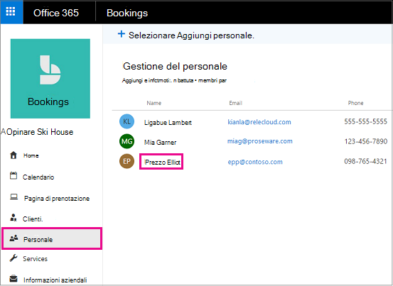
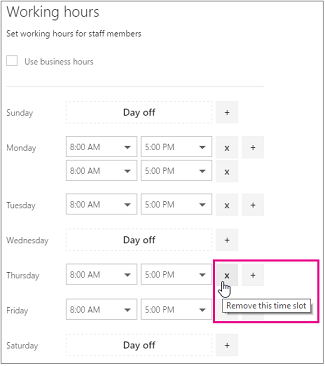

# Orario di lavoro dei dipendenti in Microsoft Bookings

L'impostazione dell'orario di lavoro dei dipendenti garantisce che la loro disponibilità sia mostrata in modo accurato quando i clienti provano a prenotarli. Per impostazione predefinita, l'orario di lavoro di ogni dipendente corrisponde all'orario di ufficio definito nell'app Prenotazioni Microsoft (vedere l'argomento relativo alla Impostare gli orari di ufficio). Vedere la sezione "Impostare l'orario di ufficio" di [Immettere informazioni aziendali.](enter-business-information.md#set-your-business-hours)

Nella pagina **Personale** è possibile personalizzare l'orario di lavoro dei dipendenti in base alle esigenze dell'azienda e dei dipendenti.

Per impostare gli orari in cui i membri del personale non sono disponibili, in modo che i clienti non possano prenotarli quando non sono in ufficio, vedere le istruzioni in [Pianificare chiusure aziendali, permessi e ferie](schedule-closures-time-off-vacation.md).

## Personalizzare l'orario di lavoro dei dipendenti

Guarda questo video o segui i passaggi seguenti per impostare l'orario di lavoro di un dipendente.

> [!VIDEO https://www.microsoft.com/videoplayer/embed/RWuXUq]

1. In Microsoft 365, seleziona l'icona di avvio delle app e quindi seleziona **Prenotazioni.**

1. Nel riquadro di spostamento selezionare **Personale** e quindi selezionare il membro del personale per cui si vuole impostare l'orario.

   

1. In Orario di lavoro deselezionare la casella di controllo **Usa orario di ufficio**.

1. Usare gli elenchi a discesa per selezionare l'ora di inizio e l'ora di fine per ogni giorno. Gli orari sono disponibili a incrementi di 15 minuti.

   

1. Fare **+** clic per aggiungere selettori di inizio e ora di fine.

1. Selezionare Salva.

## Impostare i giorni non lavorativi di un dipendente

Quando si pianifica un giorno libero per un dipendente, il dipendente risulterà non disponibile nella pagina di prenotazione. I clienti che usano la pagina di prenotazione non potranno pianificare quel dipendente per un servizio in quella giornata.

1. Nella schermata dell'orario di lavoro, selezionare **la x** accanto al giorno di riposo del dipendente.

   

1. Se si desidera pianificare un giorno contrassegnato in precedenza come giorno libero, selezionare il segno accanto al **+** giorno che si desidera pianificare.

> [!TIP]
> Se si pianificano le ferie dei dipendenti o altri blocchi di tempo libero, vedere la sezione "Pianificare le ferie dei dipendenti" in Pianificare chiusure aziendali, periodi di ferie e [periodi di ferie.](schedule-closures-time-off-vacation.md#schedule-employee-time-off)
