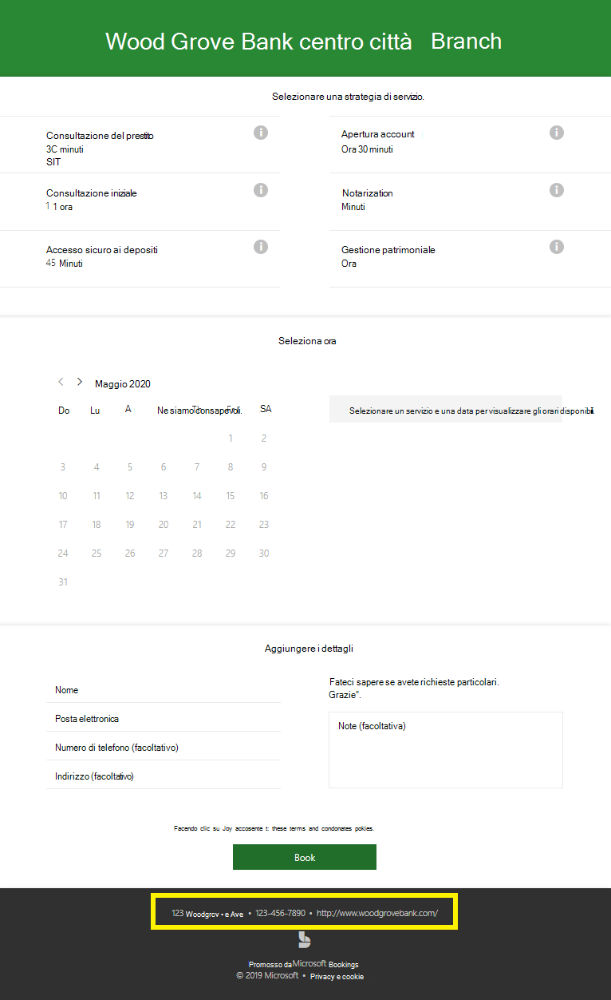
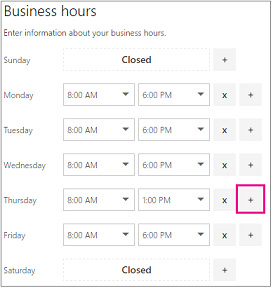
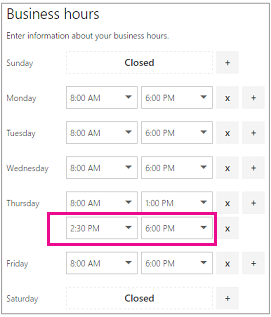
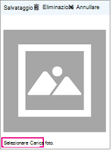

# Immettere le informazioni aziendali

In Microsoft bookings, la pagina di informazioni aziendali all'interno dell'app Web contiene tutti i dettagli che in genere si trovano in una pagina "chi siamo" dell'azienda. Questi dettagli includono il nome, l'indirizzo, il numero di telefono, l'URL del sito Web, l'URL, il logo e l'orario di ufficio della privacy policy.

Le informazioni fornite in questo articolo verranno visualizzate nella pagina clienti e client per prenotare appuntamenti (nota come pagina di prenotazione) e nei messaggi e promemoria inviati loro dalle prenotazioni. Di seguito è riportato un esempio di queste informazioni nella pagina di prenotazione.

   

> [!NOTE]
> La prenotazione è attivata per impostazione predefinita per i clienti che hanno gli abbonamenti Microsoft 365 business standard, Microsoft 365 a3 o Microsoft 365 a5. La prenotazione è disponibile anche per i clienti che dispongono di Office 365 Enterprise E3 e Office 365 Enterprise E5, ma è disattivata per impostazione predefinita. Per iniziare, vedere [accesso a Microsoft bookings](get-access.md). Per abilitare o disabilitare le prenotazioni, vedere [attivazione o disattivazione delle prenotazioni per l'organizzazione](turn-bookings-on-or-off.md).

## Specificare il nome e le informazioni di contatto dell'azienda

1. In Microsoft 365 selezionare l'icona di avvio delle app e quindi selezionare **bookings**.

1. Nel riquadro di spostamento selezionare **Informazioni azienda**.

1. Immettere il nome, l'indirizzo e il numero di telefono rilevanti che si desidera utilizzare per il calendario delle prenotazioni.

1. In **Invia risposte ai clienti**, digitare l'indirizzo di posta elettronica preferito in cui devono essere inoltrate le risposte di posta elettronica alle conferme di prenotazione e ai promemoria.

1. Nel campo **URL sito Web** immettere l'URL della Home page per la propria azienda.

1. Immettere l' **informativa sulla privacy** e i **termini &** URL delle condizioni.

1. Selezionare **Salva**.

## Impostare gli orari di ufficio

L'orario di ufficio predefinito nell'app Prenotazioni è dalle 8:00 alle 17:00, dal lunedì al venerdì. Gli orari sono specificati a incrementi di 15 minuti. L'app Prenotazioni usa il formato 12 ore.

Impostare l' **orario di ufficio** per le ore operative. Sono le ore a cui sono state limitate tutte le prenotazioni. Altre limitazioni temporali relative al momento in cui è possibile prenotare gli appuntamenti possono essere impostate per ogni servizio e per ogni membro del personale nelle pagine dei servizi e del personale.

1. Nella pagina Informazioni aziendali, in Orari di ufficio, usare gli elenchi a discesa per selezionare l'ora di inizio e l'ora di fine di ogni giorno.

1. Fare clic **+** per aggiungere i selettori di inizio e di fine-ora.

## Come impostare le ore per un turno diviso

Potrebbe essere necessario escludere una parte di ogni giorno o settimana per avere riunioni del personale, aggiornare l'inventario o prendersi cura di altri dettagli del Rhythm-of-business. L'app bookings consente di limitare gli appuntamenti dei clienti alle fasce orarie specificate.

Ad esempio, si dispone di riunioni del personale ogni Giovedi dalle 01:00 alle 2:30 e si vuole bloccare quel tempo in modo che tutti i membri del personale possano partecipare. Per eseguire l'operazione:

1. Nella pagina Informazioni aziendali, in Orari di ufficio, selezionare l'ora di inizio e l'ora di fine per il giovedì. In questo esempio si imposterà dalle 8:00 alle 13:00.

1. Selezionare **+** per creare una nuova riga per giovedì.

   

1. Nella nuova riga, selezionare 2:30 p.m. per l'ora di inizio e 6:00 p.m. per l'ora di fine.

   

1. Selezionare Salva.

    Quando un cliente visita la pagina di prenotazione, vedrà che l'azienda è chiusa dalle 13 alle 14:30 il giovedì.

## Caricare il logo

Se il logo aziendale non è ancora stato caricato nell'app Bookings, è possibile farlo dalla pagina Informazioni aziendali.

1. Nella pagina informazioni aziendali, in carica logo, selezionare **Cambia**.

1. Selezionare **Carica foto**.

   

1. Selezionare **Salva**.
