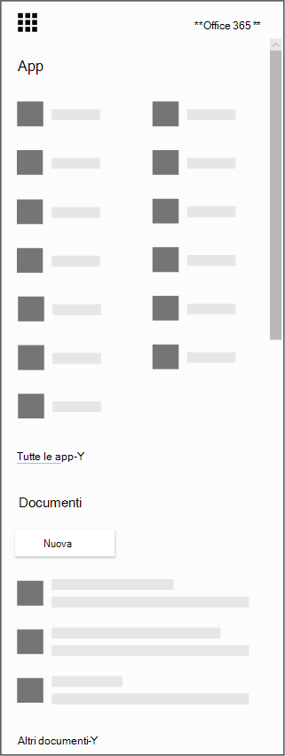

# Ottenere l'app Microsoft Bookings per iOS e Android

Grazie per aver scaricato l'app Prenotazioni Microsoft! Microsoft Bookings è disponibile come app per dispositivi mobili per iOS e Android. L'app Bookings per iOS è disponibile in tutte le aree geografiche e paesi supportati da Apple. Puoi scaricare l'app [dall'App Store di iTunes.](https://apps.apple.com/app/microsoft-bookings/id1065657468) L'app Bookings per Android è disponibile per il download da [Google Play Store](https://play.google.com/store/apps/details?id=com.microsoft.exchange.bookings) negli Stati Uniti e in Canada.

Prima di iniziare, è necessario configurare Prenotazioni sul Web.

1. Non riesci a trovare l'app che stai cercando? Nell'icona di avvio delle app seleziona Tutte le app per visualizzare un elenco alfabetico delle app di Microsoft 365 disponibili. Da qui puoi cercare un'app specifica

   

2. Accedere alla [home page di Office](https://office.com) e selezionare Prenotazioni dall'icona di avvio delle **app.**

3. Selezionare **Scarica l'app adesso**.

4. Fornire il nome e il tipo di esercizio commerciale, ad esempio salone di parrucchiere o studio dentistico, e selezionare **A Bookings**.

5. A questo punto è possibile configurare Bookings per l'organizzazione. Seguire i passaggi [nell'argomento Prenotazioni Microsoft](bookings-overview.md) per completare la configurazione di Bookings. Tornare al dispositivo mobile e disconnettersi dall'app per dispositivi mobili. Eseguire di nuovo l'accesso per passare al nuovo calendario delle prenotazioni.

## Modalità di sola visualizzazione

Qualsiasi utente a cui non è concesso l'accesso in lettura e scrittura in Bookings può comunque usare l'app per dispositivi mobili in modalità di sola visualizzazione. Chiunque abbia una licenza di Bookings che viene aggiunta a un calendario di prenotazione può visualizzare le pianificazioni, i dettagli degli appuntamenti e le informazioni aziendali dei propri colleghi. Un utente con accesso in sola visualizzazione non può apportare modifiche o modifiche e non può accedere all'elenco dei clienti.
