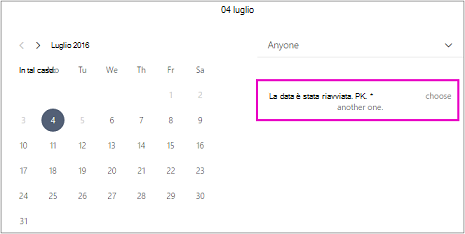

# Pianificare chiusure aziendali, permessi e ferieSchedule business closures, time off, and vacation time

A volte, è possibile chiudere l'azienda per le festività o gli eventi del team oppure i dipendenti hanno bisogno di un periodo di ferie quando si ammalano, sono in ferie o non sono disponibili per altri motivi.Occasionally, you'll want to close your business for holidays or team events, or your employees will need time off when they're sick, on vacation, or unavailable for other reasons. È possibile pianificare le ferie dal calendario di Prenotazioni Microsoft, e il dipendente non sarà disponibile per le prenotazioni durante il periodo specificato.You can schedule time off from the Microsoft Bookings calendar, and the employee will be unavailable for bookings during the specified time. Quando l'azienda riapre o il dipendente torna al lavoro, ognuno comparirà sulla pagina di prenotazione in base ai propri orari lavorativi stabiliti.Once the business reopens or employees return to work, everyone will be listed on the booking page according to their established work hours.

Guardare questo video o seguire i passaggi seguenti per pianificare chiusure aziendali o dipendenti non in servizio.Watch this video or follow the steps below to schedule business closures or employee off.

> [!VIDEO https://www.microsoft.com/videoplayer/embed/RE2TxDC]

## Pianificare chiusure dell'azienda ad hocSchedule ad hoc business closures

1. In Microsoft 365, selezionare l'icona di avvio delle app e quindi selezionare Prenotazioni.In Microsoft 365, select the app launcher, and then select Bookings.

1. Nel riquadro di spostamento selezionare **Calendario** \> **Permesso**.In the navigation pane, select **Calendar** \> **Time off**.

   

1. Inserire i dettagli, inclusi il titolo, la data e ora di inizio e di fine, il luogo ed eventuali note aggiuntive.Fill in the details, including a title, start and end date and times, location, and additional notes.

1. Selezionare **Evento giornata intera**.Select **All day event**.

1. Selezionare tutti i membri del personale.Select all staff members.

1. Scegliere **Salva**.Select **Save**.

Quando un cliente cerca di pianificare un servizio in un giorno in cui l'ufficio è chiuso, vedrà un messaggio nella pagina di prenotazione.When a customer attempts to schedule service on a day the office is closed, they'll see a message on the booking page.

   

## Pianificare i permessi dei dipendentiSchedule employee time off

1. In Microsoft 365, selezionare l'icona di avvio delle app e quindi **selezionare Prenotazioni.**In Microsoft 365, select the app launcher, and then select **Bookings**.

   

1. Nel riquadro di spostamento selezionare **Calendario** \> **Permesso**.In the navigation pane, select **Calendar** \> **Time off**.

   

1. Inserire i dettagli, inclusi il titolo, la data e ora di inizio e di fine, il luogo ed eventuali note aggiuntive. Se il dipendente sarà assente per un'intera giornata o per diversi giorni, selezionare **Evento giornata intera**.Fill in the details, including a title, start and end date and times, location, and additional notes. If the employee will be gone for a full day or for several days, select **All day event**.

1. Selezionare il membro o i membri del personale che hanno richiesto il permesso.Select the staff member or members who are taking the time off.

1. Selezionare **Salva**.Select **Save**.
