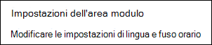
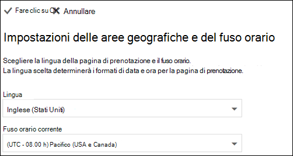

# Impostare la lingua e il fuso orario in Microsoft BookingsSet language and time zones in Microsoft Bookings

Se si utilizza Microsoft Bookings e le prenotazioni vengono create nel momento sbagliato, potrebbe essere necessario modificare le impostazioni del fuso orario.If you are using Microsoft Bookings and bookings are created at the wrong time, then your time zone settings might need to be changed. Analogamente, se alcune prenotazioni sono nella lingua errata, potrebbe essere necessario modificare le impostazioni della lingua.Likewise, if some bookings are in the wrong language, you might need to change your language settings.

Esistono due impostazioni di lingua e fuso orario separate per Bookings.There are two separate language and time zone settings for Bookings. La prima impostazione controlla la lingua e il fuso orario del calendario delle prenotazioni e viene impostata utilizzando le impostazioni di Outlook sul Web per il calendario personale dell'utente connesso.The first setting controls the language and time zone of the booking calendar and is set using the Outlook on the web settings for the personal calendar of the logged-in user. La seconda impostazione influisce sulla pagina di prenotazione self-service utilizzata dai clienti e viene impostata utilizzando una pagina di "impostazioni internazionali" che controlla la lingua e il fuso orario solo per tale pagina.The second setting affects the self-service booking page that your customers use and is set using a "regional settings" page that controls language and time zone only for that page.

## Impostazione di lingua e fuso orario per un calendario delle prenotazioniSetting language and time zone for a booking calendar

Il calendario delle prenotazioni utilizza le impostazioni della lingua e del fuso orario dell'utente connesso.The booking calendar uses the logged-in user’s language and time zone settings. Ad esempio, se il fuso orario dell'utente connesso è impostato sull'ora solare orientale (EST), il calendario delle prenotazioni mostrerà le ore di inizio e fine degli appuntamenti esistenti in EST.For example, If the logged-in user’s time zone is set to Eastern Standard Time (EST), then the booking calendar will show existing appointment start and end times in EST. Questo fuso orario è stato originariamente impostato quando sono stati creati gli account di Microsoft 365 e Outlook sul Web dell'utente.This time zone was originally set when the user’s Microsoft 365 and Outlook on the web accounts were created.

Per impostare la lingua e il fuso orario per il calendario delle prenotazioni:To set the language and time zone for the booking calendar:

1. Accedere a Microsoft 365 e selezionare il riquadro di Outlook nella pagina di destinazione (come mostrato nella schermata seguente) o nell'icona di avvio delle app di Microsoft 365.Log into Microsoft 365 and select the Outlook tile on the landing page (as shown in the screenshot below) or in the Microsoft 365 App Launcher.

   

1. After Outlook opens, select the **gear icon** in the upper, right-hand corner of the screen to open your personal and account settings, then search for "time zone" in the **Settings** panel search box.After Outlook opens, select the **gear icon** in the upper, right-hand corner of the screen to open your personal and account settings, then search for “time zone” in the **Settings** panel search box. Il riquadro viene aggiornato per visualizzare le impostazioni personali correnti per la lingua e il fuso orario dell'account.The panel will update to show your current personal language and time zone settings for this account. Come accennato in precedenza, questa impostazione controlla anche la lingua e il fuso orario del calendario delle prenotazioni.As noted above, this setting also controls the language and time zone of the booking calendar.

1. Modificare la lingua o il fuso orario selezionando  la freccia dell'elenco a discesa nella casella Lingua o Fuso orario corrente e scegliendo l'impostazione desiderata.Change the language or time zone by selecting the drop-down arrow in the **Language or Current time zone** box and choosing the desired setting.

1. Fare clic su **Salva**.Click **Save**. Il pannello Impostazioni viene chiuso, Outlook sul Web viene riavviato e vengono applicate le nuove impostazioni relative alla lingua e al fuso orario.The Settings panel closes, Outlook on the web restarts, and the new language and time zone settings are applied.

## Impostazione di lingua e fuso orario per una pagina di prenotazioneSetting the language and time zone for the booking page

1. In Microsoft 365, selezionare l'icona di avvio delle app e quindi **selezionare Prenotazioni.**In Microsoft 365, select the app launcher, and then select **Bookings**.

1. Nel riquadro di spostamento, selezionare **Pagina prenotazione e** selezionare Modifica impostazioni lingua **e fuso orario.**In the navigation pane, select **Booking page** and select **Change language and time zone settings**.

   

1. Selezionare la lingua e il fuso orario corrente e scegliere OK.Select your language and current time zone and choose OK.

   
