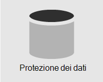
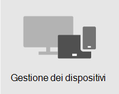

# Panoramica della sicurezza

> [!VIDEO https://www.microsoft.com/videoplayer/embed/RE4mzxI?autoplay=false]

Microsoft 365 Business Premium offre funzionalità di protezione dalle minacce, protezione dei dati e gestione dei dispositivi che consentono di proteggere l'azienda da minacce online e accessi non autorizzati, oltre a proteggere e gestire i dati aziendali su telefoni, tablet e computer.

| [Protezione dalle minacce](#threat-protection)|  [Protezione dei dati](#data-protection) |   [Gestione dei dispositivi](#device-management) |
|--|--|--|

## Protezione dalle minacce

Microsoft 365 Business Premium include Office 365 Advanced Threat Protection (ATP), un servizio di filtro della posta elettronica basato su cloud che protegge da malware, ransomware, collegamenti dannosi e altro ancora. I collegamenti sicuri di ATP proteggono l'utente da URL dannosi nei messaggi di posta elettronica o nei documenti di Office. Gli allegati sicuri di ATP proteggono l'utente da malware e virus allegati a messaggi o documenti.

L'autenticazione a più fattori (MFA) o la verifica in due passaggi richiede la presentazione di una seconda forma di autenticazione, ad esempio un codice di verifica, per confermare l'identità prima di poter accedere alle risorse.  

Windows Defender fornisce una protezione completa per il sistema, i file e le attività online da virus, malware, spyware e altre minacce.

## Protezione dei dati

Le funzionalità di protezione dei dati in Microsoft 365 Business Premium assicurano che i dati importanti rimangano sicuri e che solo le persone autorizzate vi hanno accesso.

È possibile utilizzare i criteri di prevenzione della perdita dei dati (DLP) per identificare e gestire le informazioni riservate, ad esempio i numeri di carta di credito o di previdenza sociale, in modo che non vengono erroneamente condivise. 

La crittografia dei messaggi di Office 365 combina le funzionalità di crittografia e diritti di accesso per garantire che solo i destinatari previsti possano visualizzare il contenuto dei messaggi. La crittografia dei messaggi di Office 365 funziona con Outlook.com, Yahoo!, Gmail e altri servizi di posta elettronica.

Archiviazione Exchange Online è una soluzione di archiviazione basata su cloud che funziona con Microsoft Exchange o Exchange Online per fornire funzionalità di archiviazione avanzate, tra cui blocchi e ridondanza dei dati. È possibile utilizzare i criteri di conservazione per aiutare l'organizzazione a ridurre le responsabilità associate alla posta elettronica e ad altre comunicazioni. Se l'azienda deve conservare le comunicazioni relative a controversie legali, è possibile utilizzare In-Place esenzioni per controversia legale per conservare la posta elettronica correlata.

## Gestione dei dispositivi

Le funzionalità avanzate di gestione dei dispositivi di Microsoft 365 Business Premium consentono di monitorare e controllare le attività che gli utenti possono eseguire con i dispositivi registrati. Queste funzionalità includono l'accesso condizionale, Gestione di dispositivi mobili (MDM), BitLocker e gli aggiornamenti automatici.

È possibile utilizzare i criteri di accesso condizionale per richiedere misure di sicurezza aggiuntive per determinati utenti e attività. Ad esempio, è possibile richiedere l'autenticazione a più fattori (MFA) o bloccare i client che non supportano l'accesso condizionale.

Con MDM puoi proteggere e gestire i dispositivi mobili degli utenti come iPhone, iPad, Android e Windows Phone. Puoi creare e gestire i criteri di sicurezza dei dispositivi, cancellare in remoto un dispositivo per rimuovere tutti i dati aziendali, ripristinare le impostazioni di fabbrica di un dispositivo e visualizzare report dettagliati sul dispositivo. 

Puoi abilitare la crittografia BitLocker per proteggere i dati in caso di perdita o furto di un dispositivo e abilitare Windows Exploit Guard per fornire protezione avanzata dal ransomware.

È possibile configurare gli aggiornamenti automatici in modo che le funzionalità di sicurezza e gli aggiornamenti più recenti siano applicati a tutti i dispositivi degli utenti. 