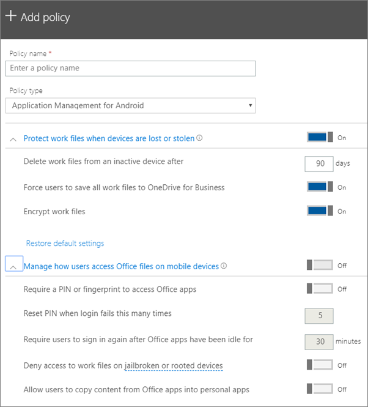

# Configurare le impostazioni di protezione delle app per i dispositivi Android o iOS

## Creare un criterio di gestione delle app

1. Passare all’interfaccia di amministrazione su <a href="https://go.microsoft.com/fwlink/p/?linkid=837890" target="_blank">https://admin.microsoft.com</a>. 
    
2. Nel NAV sinistro, scegliere **Devices** \> **** \> **Add**.
  
3. Nel riquadro **Aggiungi criterio** immettere un nome univoco per il criterio. 
    
4. In **tipo di criterio**scegliere **Gestione applicazioni per Android** o **Gestione applicazioni per iOS**, a seconda del set di criteri che si desidera creare. 
    
5. Espandere **Proteggi file di lavoro quando i dispositivi vengono persi o rubati** e **gestiscono come gli utenti accedono ai file di Office nei dispositivi mobili**. Configurare le impostazioni come desiderate. **Gestire il modo in cui gli utenti accedono ai file di Office nei dispositivi mobili** per impostazione predefinita, **ma è consigliabile** attivarlo **e accettare** i valori predefiniti. Per ulteriori informazioni, vedere [available Settings](#available-settings). 
    
    È sempre possibile usare il collegamento **Ripristina impostazioni predefinite** per ripristinare l'impostazione predefinita. 
    
    
  
6. Successivamente decidere **chi otterrà queste impostazioni?** Se non si desidera utilizzare il gruppo di sicurezza **tutti gli utenti** predefinito, scegliere **Cambia**, scegliere i gruppi di sicurezza in cui \> vengono **selezionate**le impostazioni.
    
7. Infine, scegliere **Fatto** per salvare il criterio e assegnarlo ai dispositivi. 
    
## Modificare un criterio di gestione delle app

1. Nella scheda **criteri** scegliere **modifica criterio**.
    
2. Nel riquadro **Modifica criterio** scegliere il criterio da modificare. 
    
3. Scegliere **Modifica** accanto a ogni impostazione per modificare i valori corrispondenti nel criterio. Quando si modifica un valore, il criterio viene salvato automaticamente.
    
4. Al termine, chiudere il riquadro **modifica criterio** . 
    
## Eliminare un criterio di gestione delle app

1. Nella pagina **criteri** scegliere un criterio e quindi **Elimina**.
    
2. Nel riquadro **Elimina criteri** scegliere **conferma** per eliminare i criteri o i criteri scelti. 
    
## Impostazioni disponibili

Nelle tabelle seguenti vengono fornite informazioni dettagliate sulle impostazioni disponibili per proteggere i file di lavoro nei dispositivi e le impostazioni che controllano il modo in cui gli utenti accedono ai file di Office dai propri dispositivi mobili.
  
 Per altre informazioni, vedere [Corrispondenza tra le caratteristiche di protezione in Microsoft 365 Business e le impostazioni di Intune](map-protection-features-to-intune-settings.md). 
  
### Impostazioni per la protezione dei file di lavoro

Le impostazioni seguenti sono disponibili per la protezione dei file di lavoro in caso di perdita o di furto del dispositivo di un utente:
  
|||
|:-----|:-----|
|Impostazione    |Descrizione    |
|Elimina i file di lavoro dai dispositivi inattivi dopo questo numero di giorni    |Se un dispositivo non viene utilizzato per il numero di giorni specificato, tutti i file di lavoro archiviati nel dispositivo verranno eliminati automaticamente.    |
|Forza gli utenti a salvare tutti i file di lavoro in OneDrive for Business    |Se questa impostazione è **attiva**, l'unico percorso di salvataggio disponibile per i file di lavoro è OneDrive for business.    |
|Crittografa i file di lavoro    |Mantenere **attivata** questa impostazione in modo che i file di lavoro siano protetti dalla crittografia. Anche se il dispositivo è perduto o rubato, nessuno può leggere i dati dell'azienda.    |
   
### Impostazioni che controllano la modalità di accesso degli utenti ai file di Office nei dispositivi mobili

Le impostazioni seguenti sono disponibili per la gestione della modalità di accesso degli utenti ai file di lavoro di Office:
  
|||
|:-----|:-----|
|Impostazione    |Descrizione    |
|Richiedi un PIN o l'impronta digitale per accedere alle app di Office    |Se questa impostazione è impostata **su** gli utenti devono fornire un'altra forma di autenticazione, oltre a nome utente e password, prima di poter utilizzare le app di Office nei propri dispositivi mobili.  |
|Reimposta il PIN dopo il numero di tentativi di accesso falliti seguente    |Per impedire a un utente non autorizzato di indovinare casualmente un PIN, il PIN verrà reimpostato dopo il numero specificato di tentativi di immissione non riusciti.    |
|Richiedi agli utenti di accedere di nuovo dopo che le app di Office sono rimaste inattive per    |Questa impostazione determina per quanto tempo un utente può rimanere inattivo prima che venga richiesto di eseguire nuovamente l'accesso.    |
|Nega l'accesso ai file di lavoro nei dispositivi jailbroken o rooted    |È possibile che gli utenti esperti abbiano un dispositivo sottoposto a jailbreak o root. L'utente può quindi modificare il sistema operativo, rendendo il dispositivo più vulnerabile a malware. Questi dispositivi sono bloccati quando l'impostazione è **attivata**.    |
|Consenti agli utenti di copiare contenuti dalle app di Office in quelle personali    |Questa operazione è consentita per impostazione predefinita, ma se l'impostazione è **attivata** l'utente potrebbe copiare le informazioni di un file di lavoro in un file personale. Se l'impostazione è **disattivata**, l'utente non potrà copiare informazioni da un account aziendale a un'app personale o un account personale.    |
