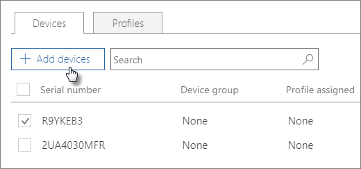

# Creare e modificare dispositivi AutoPilotCreate and edit AutoPilot devices

## Caricare un elenco di dispositiviUpload a list of devices

Per caricare i dispositivi, è possibile usare la [Guida dettagliata](add-autopilot-devices-and-profile.md) oppure usare la scheda **Dispositivi**.You can use the [Step-by-step guide](add-autopilot-devices-and-profile.md) to upload devices, but you can also upload the in the **Devices** tab. 
  
I dispositivi devono soddisfare questi requisiti:Devices need to meet these requirements:
  
- Devono eseguire Windows 10 1703 o versione successiva.Windows 10, version 1703 or later.
    
- Devono essere nuovi dispositivi per i quali non è stata eseguita la Configurazione guidata di Windows.New devices that have not been through Windows out-of-box experience.

1. Nell'interfaccia di amministrazione di Microsoft 365 business, scegliere **Devices** \> **Autopilot**.In the Microsoft 365 Business Admin center, choose **Devices** \> **AutoPilot**.
  
2. Nella pagina **Autopilot** scegliere la scheda \> **dispositivi** **Aggiungi dispositivi**.On the **AutoPilot** page, choose the **Devices** tab \> **Add devices**.
    
    
  
3. Nel riquadro **Aggiungi dispositivi** , passare a un [file CSV elenco dispositivi](https://support.office.com/article/932e3676-2491-49f0-9177-d893d2f5276e) che è stato preparato \> **Salva** \> **Chiudi**.On the **Add devices** panel, browse to a [Device list CSV-file](https://support.office.com/article/932e3676-2491-49f0-9177-d893d2f5276e) that you have prepared \> **Save** \> **Close**.
    
    È possibile ottenere queste informazioni dal produttore dell'hardware o usare lo [script di PowerShell Get-WindowsAutoPilotInfo](https://www.powershellgallery.com/packages/Get-WindowsAutoPilotInfo) che consente di generare un file CSV.You can get this information from your hardware vendor, or you can use the [Get-WindowsAutoPilotInfo PowerShell script](https://www.powershellgallery.com/packages/Get-WindowsAutoPilotInfo) that will generate a csv file. 
    
## Assegnare un profilo a un dispositivo o a un gruppo di dispositiviAssign a profile to a device or a group of devices

1. Nella pagina **Prepara Windows** scegliere la scheda **Dispositivi** e selezionare la casella di controllo accanto a uno o più dispositivi.On the **Prepare Windows** page, choose the **Devices** tab and check the check box next to one or more devices. 
    
2. Nel pannello **Dispositivo** selezionare un profilo dall'elenco a discesa **Profilo assegnato**.On the **Device** panel, select a profile from the **Assigned profile** drop-down. 
    
    Se non è ancora stato creato alcun profilo, per le istruzioni vedere [Creare e modificare profili AutoPilot](create-and-edit-autopilot-profiles.md).If you don't have any profiles yet, see [Create and edit AutoPilot profiles](create-and-edit-autopilot-profiles.md) for instructions. 
    
