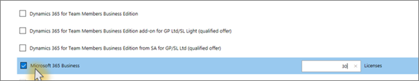

# Ottenere Microsoft 365 Business Premium

## Ottenere Microsoft 365 Business Premium da Microsoft

Se non si dispone di un partner e si desidera ottenere Microsoft 365 Business Premium, è possibile [acquistarlo qui.](https://www.microsoft.com/en-US/microsoft-365/business)

Per istruzioni dettagliate, vedere Iscriversi a [Microsoft 365 Business Premium.](sign-up.md)

Puoi anche accedere a un [Microsoft Store per](https://www.microsoft.com/en-us/store/locations/find-a-store?icid=en_US_Store_UH_FAS) acquistare Microsoft 365 Business Premium e ottenere assistenza per la configurazione.
  
## Ottenere Microsoft 365 Business Premium dal Centro per i partner Microsoft

1. Accedere al [Centro per i partner Microsoft](https://go.microsoft.com/fwlink/p/?linkid=849910) con le credenziali create al momento della registrazione al programma Cloud Service Provider (CSP). 
    
2. Nel dashboard del partner scegli **Clienti,** quindi seleziona il cliente o aggiungi un nuovo cliente prima di ottenere Microsoft 365 Business Premium.
    
    
  
3. Nella pagina Sottoscrizione **del** cliente seleziona Aggiungi **sottoscrizione,** scegli l'opzione Piccole aziende in Catalogo e quindi **scegli Microsoft 365 Business Premium.**
    
    Selezionare il numero di licenze necessarie (fino a 300). Se hai più di 300 utenti, vedi [Invece Microsoft 365 Enterprise.](../enterprise/index.yml) 
    
    
  
    Completare il resto dei passaggi per l'aggiunta di un nuovo cliente, incluso il nome dell'azienda.
