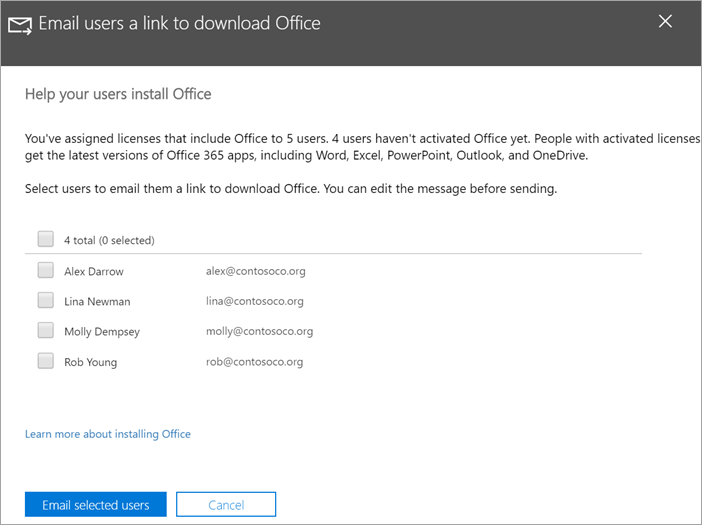

# Aiutare gli utenti a installare Office su Windows 10 dispositiviHelp your users install Office on Windows 10 devices

È possibile installare rapidamente e facilmente Office pc Windows 10 dall'Microsoft 365 di amministrazione.You can quickly and easily install Office on Windows 10 PCs from the Microsoft 365 admin center.
  
Prima di iniziare, leggere [Preparare l'installazione di Office nei client](prepare-for-office-client-deployment.md) per informazioni sulla coesistenza di Office con le app di Office già installate.To understand how this works with previously installed Office apps, read [Prepare for Office client installation](prepare-for-office-client-deployment.md) before you get started.

Guarda un breve video sull'installazione Office app.Watch a short video about installing Office apps.  

> [!VIDEO https://www.microsoft.com/videoplayer/embed/acce002c-0756-4b64-ac5d-2198ee96a9b1] 

Se il video è stato utile, consultare la [serie dei corsi di formazione completa per piccole imprese e nuovi utenti di Microsoft 365](../business-video/index.yml).If you found this video helpful, check out the [complete training series for small businesses and those new to Microsoft 365](../business-video/index.yml).

## Gestire le distribuzioni di OfficeManage Office deployments

1. Accedere all'interfaccia di amministrazione <a href="https://go.microsoft.com/fwlink/p/?linkid=2024339" target="_blank">https://admin.microsoft.com</a> all'indirizzo e accedere con le credenziali di amministratore globale.Go to the admin center at <a href="https://go.microsoft.com/fwlink/p/?linkid=2024339" target="_blank">https://admin.microsoft.com</a>, and sign in with global admin credentials. 

2. Passare a **Installazione** nel riquadro di spostamento sinistro e nella pagina **Installazione** scorrere fino a **App e aggiornamenti.**Go to **Setup** in the left navigation pane, and on the **Setup** page, scroll to **Apps and updates**.
    > [!NOTE]
    > Questa scheda potrebbe non essere visualizzata se tutti gli utenti hanno installato Office app.You might not see this card if all of your  users have installed Office apps.
  
3. Nella scheda **Help users install their Office apps** scegliere **View** e quindi **Get started**.On the **Help users install their Office apps** card, choose **View**, and then **Get started**.
    
4. Nel riquadro Invia tramite posta elettronica agli utenti un collegamento **Office,** selezionare gli utenti che si desidera inviare tramite posta elettronica e quindi Inviare un messaggio di posta **elettronica agli utenti selezionati.**On the **Email users a link to download Office** panel, select the users you want to email, and then **Email selected users**.

   

## Per altre informazioni sulla configurazione e sull'Microsoft 365 Business PremiumFor more on setting up and using Microsoft 365 Business Premium

[Video di formazione su Microsoft 365 per le aziendeMicrosoft 365 for business training videos](../business-video/index.yml)