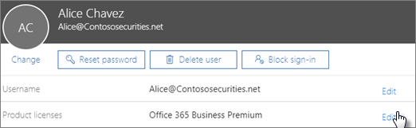

# Eseguire l'aggiornamento a Microsoft 365 business da Office 365 Business PremiumUpgrade to Microsoft 365 Business from Office 365 Business Premium

Se si dispone di un [abbonamento a office 365 per le aziende](https://products.office.com/compare-all-microsoft-office-products-4-column?activetab=tab:primaryr2), ad esempio Office 365 Business Premium, è possibile eseguire facilmente l'aggiornamento a Microsoft 365 business.If you have an [Office 365 for business subscription](https://products.office.com/compare-all-microsoft-office-products-4-column?activetab=tab:primaryr2), for example, Office 365 Business Premium, you can easily upgrade to Microsoft 365 Business. Eseguire l'aggiornamento a Microsoft 365 business se si desidera aggiungere:Upgrade to Microsoft 365 Business if you want to add: 
- Windows 10 Pro (per i computer che eseguono Windows 8 o versioni successive)Windows 10 Pro (to PCs running Windows 8 or later)
- Controlli semplici che gestiscono i dati business nei dispositiviSimple controls that manage business data on devices
- Funzionalità di sicurezza avanzate.Advanced security capabilities.
Per ulteriori informazioni su Microsoft 365 business, vedere [Microsoft.com](https://www.microsoft.com/microsoft-365/business)Find out more about Microsoft 365 Business at [Microsoft.com](https://www.microsoft.com/microsoft-365/business)

## Qual è la differenza tra Office 365 Business Premium e Microsoft 365 business?What's the difference between Office 365 Business Premium and Microsoft 365 Business?
È stato aggiunto un confronto affiancato di questi due piani alla [Descrizione del servizio Microsoft 365 business](https://docs.microsoft.com/office365/servicedescriptions/microsoft-365-service-descriptions/microsoft-365-business-service-description).We've added a side-by-side comparison of these two plans to the [Microsoft 365 Business service description](https://docs.microsoft.com/office365/servicedescriptions/microsoft-365-service-descriptions/microsoft-365-business-service-description). 

1. Dopo aver acquistato nuove licenze e questa è la prima volta che l'utente ha eseguito, il banner di installazione per Microsoft 365 business verrà visualizzato all'inizio dell'interfaccia di amministrazione.Once you have purchased new licenses, and this is the first time you did, the setup banner for Microsoft 365 Business will display on top of the admin center.
    
    > [!NOTE]
    > Il banner di installazione è la possibilità di aggiungere nuovi utenti, un nuovo dominio ed eseguire la migrazione della posta elettronica per i nuovi utenti.The setup banner is an opportunity to add new users, a new domain, and migrate email for new users. Se non si prevede di eseguire alcuna operazione, è consigliabile continuare con la procedura guidata e scegliere opzioni predefinite per farla scomparire dalla Home page di amministrazione.If you don't plan to do any, you should still go through the wizard and choose default options to make it disappear from the admin home page. 
  
   
  
    Scegliere **Avvia configurazione**.Choose **Start setup**.
    
2. Nella pagina **Personalizza l'accesso e la posta elettronica** , è possibile aggiungere un dominio, scegliendo **Connetti un dominio già** in uso, se si desidera utilizzare questa opportunità per aggiungere un altro dominio all'abbonamento.On the **Personalize your sign-in and email** page, you can add a domain by choosing **Connect a domain you already own** if you want to use this opportunity to add another domain to your subscription. 
    
    Se è già stato configurato un dominio, il secondo campo indicherà che **continuerà a utilizzare** \< _il nome_ \> **di dominio per la posta elettronica e l'accesso**.  If you have already set up a domain, the second field will indicate that and will say **Continue using** \<  _your domain name_\> **for email and signing in**. Se non è stato configurato un dominio con l'abbonamento, sarà necessario **continuare a utilizzare** \< _la società Name.onmicrosoft.com_ \> **per la posta elettronica e l'accesso**.  If you haven't set up a domain with you subscription, it will say **Continue using** \<  _your company name.onmicrosoft.com_\> **for email and signing in**.
    
    Scegliere **Avanti**.Choose **Next**.
    
    
  
3. Nella pagina **Aggiungi nuovi utenti** , è possibile aggiungere nuovi utenti, se si dispone di nuovi dipendenti a cui si desidera assegnare le licenze di Microsoft 365 business.On the **Add new users** page, you can add new users, if you have new employees that you want to assign the Microsoft 365 Business licenses to. 
    
    Se non si dispone di nuovi dipendenti da aggiungere e si desidera assegnare licenze agli utenti esistenti, scegliere **Avanti**.If you don't have new employees to add and want to assign licences to existing users, choose **Next**.
    
4. Nella pagina **migrate messaggi di posta elettronica** è possibile scegliere di eseguire la migrazione della posta elettronica per tutti i nuovi utenti aggiunti al passaggio 3.On the **Migrate email messages** page you can choose to migrate email for any of the new users you added in step 3. È anche possibile ignorare questo passaggio.You can skip this step also. Scegliere **Avanti**.Choose **Next**.
    
5. Nell'ultima pagina, scegliere **Vai all'interfaccia di amministrazione**e continuare l'installazione lì.On the last page, choose **go to the admin center**, and continue setup there.
    
6. Nell'interfaccia di amministrazione, passare a utenti **attivi**degli **utenti** \> .In the admin center, go to **Users** \> **Active users**.
    
7. Selezionare l'utente a cui si desidera assegnare la licenza **Microsoft 365 business** e quindi scegliere **modifica** accanto a **licenze di prodotto**.Select the user to whom you want to assign the **Microsoft 365 Business** license to, and then choose **Edit** next to **Product Licenses**.
    
    
  
## Prima di iniziareBefore you get started

- **Quando scegliere l'aggiornamento?****When should I choose upgrade?** L'aggiornamento è la scelta giusta quando si desidera aggiornare **tutti gli utenti** assegnati a un singolo piano.Upgrade is the right choice when you want to upgrade **all users** assigned to a single plan. Quando si sceglie l'opzione di aggiornamento, tutti i piani di utenti vengono passati a un altro piano contemporaneamente.When you choose upgrade, all plan users get switched to another plan at the same time. Se non si desidera aggiornare tutti gli utenti assegnati a un singolo piano, acquistare le licenze per il nuovo piano (in questo caso Microsoft 365 business) e [assegnare tali licenze singolarmente](https://docs.microsoft.com/office365/admin/manage/assign-licenses-to-users) a ogni utente che si desidera aggiornare.If you don't want to upgrade everyone assigned to a single plan, buy licenses for the new plan (in this case Microsoft 365 Business), and [assign those licenses individually](https://docs.microsoft.com/office365/admin/manage/assign-licenses-to-users) to each user that you want to upgrade. 
- **Alcuni componenti aggiuntivi potrebbero impedire l'aggiornamento** Se si tenta di avviare un aggiornamento e si dispone di un componente aggiuntivo che impedisce di continuare, è possibile rimuovere il componente aggiuntivo e quindi aggiungerlo in un secondo momento, se ne è ancora necessario.**Some add-ons might prevent upgrade** If you try to start an upgrade and you have an add-on that prevents you from continuing, you can remove the add-on first, and then add it back later - if you still need it. 
- **Se il piano è stato prepagato** Non esiste un percorso di aggiornamento semplice per i piani prepagati.**If you prepaid your plan** There isn't a straightforward upgrade path for prepaid plans. È possibile sapere se si dispone di un piano prepagato perché si configura il piano utilizzando un ID prodotto che potrebbe essere stato acquistato in un archivio.You'll know if you have a prepaid plan because you set up your plan using a product ID that you might have purchased in a store. Contattare un partner, accedere a Microsoft Store oppure attendere che il piano prepagato SCADA per passare a un nuovo piano.Contact a partner, go to the Microsoft store, or wait until your prepaid plan expires to switch to a new plan.

## Eseguire l'aggiornamento a Microsoft 365 businessUpgrade to Microsoft 365 Business
Acquistare le licenze attenendosi alla procedura seguente nella [nuova](https://docs.microsoft.com/office365/admin/microsoft-365-admin-center-preview)interfaccia di amministrazione:Buy your licenses by following these steps in the [new admin center](https://docs.microsoft.com/office365/admin/microsoft-365-admin-center-preview):
1. Accedere all'interfaccia di amministrazione all' <a href="https://go.microsoft.com/fwlink/p/?linkid=837890" target="_blank">https://admin.microsoft.com</a>indirizzo.Sign into the admin center at <a href="https://go.microsoft.com/fwlink/p/?linkid=837890" target="_blank">https://admin.microsoft.com</a>.
2. Passare al riquadro di spostamento e selezionare prodotti di **fatturazione** \> **& Servizi**.Go to the navigation pane and select **Billing** \> **Products & Services**. Individuare la sottoscrizione di Office 365 e selezionarla per visualizzare i dettagli.Find your Office 365 subscription and select it to view the details. 

    

3. Nella pagina successiva, selezionare **Aggiorna**.On the next page, select **Upgrade**. 

      

  > [!NOTE]
  > Se viene visualizzato un messaggio in cui viene indicato che l'aggiornamento della sottoscrizione non è supportato con la gestione delle licenze basate su gruppo in Azure Active Directory, è possibile ignorare questo valore se non si dispone di un'organizzazione di grandi dimensioni.If you see a message that says "Upgrading your subscription is not supported with group-based licensing in Azure Active Directory", you can safely ignore this unless you have a very large organization. Le organizzazioni che hanno selezionato questa opzione sapranno di usare le licenze basate su gruppo.Organizations who have selected this option will be aware that they're using group-based licensing.

4. Successivamente, è possibile visualizzare un elenco di piani di Office a cui è possibile eseguire l'aggiornamento.Next, you can view a list of Office plans that you can upgrade to. In questo caso, trovare il piano aziendale Microsoft 365.In this case, find the Microsoft 365 Business plan. È possibile scorrere verso il basso se si desidera visualizzare tutte le app e i servizi di Office inclusi in questo piano.You can scroll down if you want to see all the Office apps and services that are included with this plan. In **microsoft 365 business**, selezionare **upgrade** to Add Microsoft 365 business to your cart.Under **Microsoft 365 Business**, select **Upgrade** to add Microsoft 365 Business to your cart.
5. Nel carrello:In the cart:
    1. Verranno incluse automaticamente le licenze per tutti gli utenti correnti nel carrello.We'll automatically include licenses for all your current users to the cart. Se sono necessarie più o meno licenze, è necessario [acquistare e assegnare tali licenze singolarmente](https://docs.microsoft.com/office365/admin/manage/assign-licenses-to-users).If you need more, or less licenses, you'll need to [buy and assign those licenses individually](https://docs.microsoft.com/office365/admin/manage/assign-licenses-to-users).  
    2. È possibile modificare il modo in cui si desidera pagare mensilmente o annualmente.You can adjust how you'd like to pay - monthly or yearly. Selezionare il menu a discesa per scegliere.Select the drop-down menu to make your choice.
6. Selezionare **Vai a checkout in** cui verrà visualizzato un riepilogo dell'acquisto, incluso il metodo di pagamento per questo account.Select **Go to Checkout** where you'll see a summary of your purchase, including the payment method for this account. È anche possibile aggiungere un codice promozionale qui se si dispone di uno.You can also add a promo code here if you have one.
7. Selezionare l' **ordine** di esecuzione per completare l'acquisto.Select **Place order** to complete your purchase.
Microsoft impiega alcuni minuti per configurare i nuovi piani di servizio.It takes Microsoft a few minutes to set up your new service plans. Per verificare lo stato di avanzamento, selezionare **Controlla stato aggiornamento**.To check on progress, select **Check upgrade status**. 
1. Una volta che il piano è pronto, potrebbe essere necessario completare alcuni passaggi di installazione aggiuntivi nell'interfaccia di amministrazione.Once your plan is ready, you might need to complete some additional setup steps in the admin center. Nel riquadro di spostamento, selezionare **Home** per completare i passaggi di installazione aggiuntivi.In the navigation pane, select **Home** to complete any additional setup steps.

> [!NOTE]
> Si riceverà un rimborso proporzionale per le licenze di Ofifce 365 che non è più necessario.You'll receive a prorated refund for the Ofifce 365 licenses that you no longer need. Il conto corrente bancario o la carta di credito viene addebitata circa due giorni dopo la configurazione del nuovo piano.Your bank account or credit card will be charged about two days after you set up the new plan.
  
## Protezione dei dispositivi e dei file utenteProtect user devices and files

Ora che sono state assegnate licenze aziendali Microsoft 365, completare i passaggi per avviare la protezione di dispositivi e file.Now that Microsoft 365 Business licenses have been assigned, complete steps to start protecting devices and files. Verranno utilizzate alcune nuove opzioni incluse nel riquadro di spostamento dell'interfaccia di amministrazione.You'll be using some new options included in the admin center navigation pane.
  
1. Nell'interfaccia di amministrazione, nel riquadro di spostamento, passare ai \*\*\*\* \> **criteri**dei dispositivi.In the admin center, in the navigation pane, go to **Devices** \> **Policies**.
    
2. Nella pagina **Criteri dispositivo** selezionare **Aggiungi**.On the **Device policies** page, select **Add**.
    
3. Nel riquadro **Aggiungi criterio** assegnare un nome al criterio (ad esempio, proteggere i file di lavoro) e quindi scegliere un **tipo di criterio** dall'elenco a discesa.In the **Add policy** pane give the policy a name (for example, Protect work files), and then choose a **Policy type** from the drop-down. 
    
    È possibile configurare i criteri di applicazione per la protezione dei file su dispositivi Android e iPhone, oltre a Windows 10, ed è possibile configurare i criteri di configurazione del dispositivo per i dispositivi Windows 10 di proprietà dell'azienda.You can set up application policies for protecting files on Android and iPhone devices, as well as Windows 10, and you can set up device configuration policies for company owned Windows 10 devices. Per informazioni dettagliate, vedere i seguenti collegamenti:See the following links for details:
    
  - [Configurare le impostazioni di protezione delle app per i dispositivi Android o iOSSet app protection settings for Android or iOS devices](app-protection-settings-for-android-and-ios.md)
    
  - [Configurare le impostazioni di protezione delle app per i dispositivi Windows 10Set application protection settings for Windows 10 devices](protection-settings-for-windows-10-devices.md)
    
  - [Impostazione delle impostazioni di protezione dei dispositivi per PC Windows 10Set device protection settings for Windows 10 PCs](protection-settings-for-windows-10-pcs.md)
    
  
4. Dopo aver configurato i criteri, gli utenti e i dipendenti possono configurare i dispositivi:After you set up policies, you and your employees can set up devices:
    
  - Se i dispositivi Windows non utilizzano già l'aggiornamento di Windows Pro Creator, è necessario aggiornarli [a Windows Pro Creators Update](upgrade-to-windows-pro-creators-update.md).If your Windows devices aren't already using the Windows Pro Creator update, you'll need to [upgrade them to Windows Pro Creators Update](upgrade-to-windows-pro-creators-update.md).
    
  - Vedere [configurare i dispositivi Windows per gli utenti di Microsoft 365 business](set-up-windows-devices.md) per i passaggi per i dispositivi Windows.See [Set up Windows devices for Microsoft 365 Business users](set-up-windows-devices.md) for steps for Windows devices. 
    
  - Vedere [configurare i dispositivi mobili per gli utenti di Microsoft 365 business](set-up-mobile-devices.md) per i passaggi per i telefoni Android e iPhone.See [Set up mobile devices for Microsoft 365 Business users](set-up-mobile-devices.md) for steps for Android phones and iPhones. 

