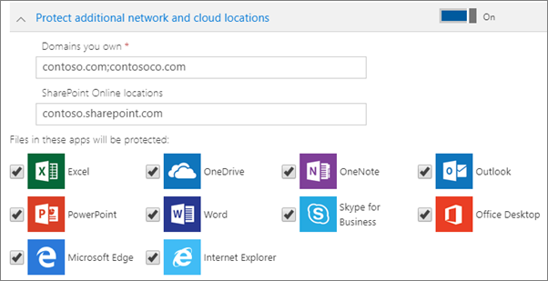

# Configurare le impostazioni di protezione delle app per i dispositivi Windows 10Set application protection settings for Windows 10 devices

## Creare criteri di gestione delle app per Windows 10Create an app management policy for Windows 10

Se gli utenti hanno dispositivi Windows 10 personali in cui eseguono attività di lavoro, è possibile proteggere anche i dati in questi dispositivi.If your users have personal Windows 10 devices on which they perform work tasks, you can protect your data on those devices as well.
  
1. Accedere all'interfaccia di amministrazione all' <a href="https://go.microsoft.com/fwlink/p/?linkid=837890" target="_blank">https://admin.microsoft.com</a>indirizzo.Go to the admin center at <a href="https://go.microsoft.com/fwlink/p/?linkid=837890" target="_blank">https://admin.microsoft.com</a>. 
    
2. Nella barra di spostamento sinistra fare clic su **criteri** \> **dispositivi** \> **Aggiungi**.On the left nav, choose **Devices** \> **Policies** \> **Add**.

3. Nel riquadro **Aggiungi criterio** immettere un nome univoco per il criterio.On the **Add policy** pane, enter a unique name for this policy. 
    
4. In **Tipo di criterio** scegliere **Gestione applicazioni per Windows 10**.Under **Policy type**, choose **Application Management for Windows 10**.
    
5. In **tipo di dispositivo**scegliere **personale** o di **proprietà dell'azienda**.Under **Device type**, choose either **Personal** or **Company Owned**.
    
6. L'opzione **Crittografa i file di lavoro** viene attivata automaticamente.The **Encrypt work files** is turned on automatically. 
    
7. Impostare **Impedisci agli utenti di copiare dati aziendali in file personali e forzali a salvare i file di lavoro in OneDrive for Business** su **Sì** per evitare che gli utenti salvino i file di lavoro nei rispettivi PC.Set **Prevent users from copying company data to personal files and force them to save work files to OneDrive for Business** to **On** if you don't want the users to save work files on their PC. 
    
9. Espandere **Recupera i dati nei dispositivi Windows** ed è consigliabile è **attivarla**.Expand **Recover data on Windows devices** and it is recommended that you turn it **On**.
    
    Prima di passare al percorso del certificato dell'agente di recupero dati, è necessario crearne uno. Per istruzioni, vedere [Creare e verificare un certificato dell'agente di recupero dati per EFS (Encrypting File System)](https://go.microsoft.com/fwlink/p/?linkid=853700).Before you can browse to the location of the Data Recovery Agent certificate, you have to first create one. For instructions see, [Create and verify an Encrypting File System (EFS) Data Recovery Agent (DRA) certificate](https://go.microsoft.com/fwlink/p/?linkid=853700).
    
    Per impostazione predefinita, i file di lavoro sono crittografati con una chiave segreta archiviata nel dispositivo e associata al profilo dell'utente. Solo l'utente può aprire e decrittografare il file. Tuttavia, se un dispositivo viene perso o se un utente viene rimosso, un file può restare bloccato in stato crittografato. Il certificato DRA (Data Recovery Agent) può essere usato da un amministratore per decrittografare il file.By default, work files are encrypted using a secret key that is stored on the device and associated with the user's profile. Only the user can open and decrypt the file. However, if a device is lost or a user is removed, a file can be stuck in an encrypted state. The Data Recovery Agent (DRA) certificate can be used by an admin to decrypt the file.
    
    
  
10. Espandere **Proteggi altre posizioni di rete e sul cloud** per aggiungere ulteriori domini o posizioni di SharePoint Online per assicurare la protezione dei file in tutte le app incluse nell'elenco. Se è necessario immettere più voci per uno dei campi, usare il punto e virgola (;) per separare le voci.Expand **Protect additional network and cloud locations** if you want to add additional domains or SharePoint Online locations to make sure that files in all the listed apps will be protected. If you need to enter more than one item for either field, use a semicolon (;) between the items.
    
    
  
11. In **Chi otterrà queste impostazioni?** specificare i destinatari. Se non si vuole usare il gruppo di sicurezza predefinito **Tutti gli utenti**, scegliere **Modifica**, scegliere i gruppi di sicurezza che riceveranno queste impostazioni \> **Seleziona**.Next decide **Who will get these settings?** If you don't want to use the default **All Users** security group, choose **Change**, choose the security groups who will get these settings \> **Select**.
    
12. Infine, scegliere **Aggiungi** per salvare il criterio e assegnarlo ai dispositivi.Finally, choose **Add** to save the policy, and assign it to devices. 