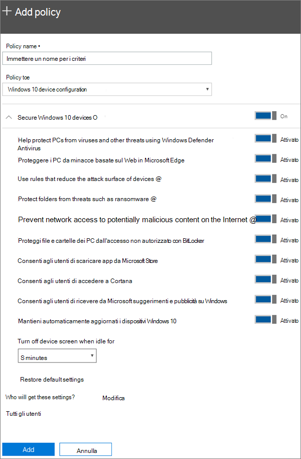

# Configurare le impostazioni di protezione dei dispositivi per i PC Windows 10

## Proteggere i dispositivi Windows 10

Guardare un video che illustra come proteggere i dispositivi Windows 10 con Microsoft 365 Business:
  
> [!VIDEO https://www.microsoft.com/videoplayer/embed/a5734146-620a-4cec-8618-536b3ca37972?autoplay=false]
  
1. Passare all’interfaccia di amministrazione su <a href="https://go.microsoft.com/fwlink/p/?linkid=837890" target="_blank">https://admin.microsoft.com</a>. 
    
2. Nella barra di spostamento sinistra fare clic su **criteri** \> **dispositivi** \> **Aggiungi**.
  
3. Nel riquadro **Aggiungi criterio** immettere un nome univoco per il criterio. 
    
4. In **Tipo di criterio** scegliere **Configurazione dei dispositivi di Windows 10**.
    
5. Expand **Secure Windows 10 Devices** \> configure the settings how you would like. Per ulteriori informazioni, vedere [available Settings](#available-settings). 
    
    È sempre possibile usare il collegamento **Ripristina impostazioni predefinite** per ripristinare l'impostazione predefinita. 
    
    
  
6. In **Chi otterrà queste impostazioni?** specificare i destinatari. Se non si vuole usare il gruppo di sicurezza predefinito **Tutti gli utenti**, scegliere **Modifica**, cercare il gruppo di sicurezza che riceverà queste impostazioni \> **Seleziona**.
    
7. Infine, scegliere **Fatto** per salvare il criterio e assegnarlo ai dispositivi. 
    
## Impostazioni disponibili

Per impostazione predefinita, tutte le impostazioni sono **attivate**. Sono disponibili le impostazioni seguenti.
  
Per altre informazioni, vedere [Corrispondenza tra le caratteristiche di protezione in Microsoft 365 Business e le impostazioni di Intune](map-protection-features-to-intune-settings.md). 
  
|||
|:-----|:-----|
|Impostazione    |Descrizione    |
|Protegge i PC da virus e altre minacce tramite Windows Defender Antivirus    |Richiede l'attivazione di Windows Defender Antivirus per la protezione dei PC dai pericoli derivanti dalla connessione a Internet.    |
|Protegge i PC dalle minacce del Web in Microsoft Edge    |Attiva le impostazioni di Microsoft Edge che consentono di proteggere gli utenti da siti e download dannosi.    |
|Usa regole per ridurre la superficie di attacco dei dispositivi    |Quando è attivata, la riduzione della superficie di attacco consente di bloccare azioni e app generalmente usate dal malware per infettare i dispositivi. Questa impostazione è disponibile solo se Windows Defender Antivirus è attivato. Per altre informazioni, vedere [Ridurre le superfici di attacco con le regole di riduzione della superficie di attacco](https://docs.microsoft.com/windows/security/threat-protection/microsoft-defender-atp/exploit-protection).    |
|Protegge le cartelle da minacce come il ransomware    |Questa impostazione usa l'accesso controllato alle cartelle per proteggere i dati aziendali dalle modifiche effettuate da app sospette o pericolose, come il ransomware. A questi tipi di app viene impedito di apportare modifiche nelle cartelle protette. Questa impostazione è disponibile solo se Windows Defender Antivirus è attivato. Per ulteriori informazioni, vedere [Protect Folders with controllato Folder Access](https://docs.microsoft.com/configmgr/protect/deploy-use/create-deploy-exploit-guard-policy#bkmk_CFA) .    |
|Impedisce l'accesso alla rete a contenuti potenzialmente pericolosi su Internet    |Utilizzare questa impostazione per bloccare le connessioni degli utenti in uscita a posizioni Internet di bassa reputazione che possono ospitare truffe, exploit o altri contenuti dannosi. Questa impostazione è disponibile solo se Windows Defender Antivirus è impostato **su**attivato. Per ulteriori informazioni, vedere [Protect your network](https://docs.microsoft.com/windows/security/threat-protection/windows-defender-antivirus/configure-real-time-protection-windows-defender-antivirus).    |
|Proteggi file e cartelle dei PC dall'accesso non autorizzato con BitLocker    |Bitlocker protegge i dati crittografando le unità disco rigido del computer e impedisce l'esposizione dei dati in caso di furto o smarrimento di un computer. Per ulteriori informazioni, vedere [domande frequenti su BitLocker](https://go.microsoft.com/fwlink/?linkid=871000).    |
|Consenti agli utenti di scaricare app da Microsoft Store    |Consente agli utenti di scaricare e installare app da Microsoft Store. Le app possono essere di qualsiasi tipo, da giochi a strumenti per la produttività, quindi questa impostazione viene lasciata **attivata**, ma è possibile disattivarla per rafforzare la sicurezza.    |
|Consenti agli utenti di accedere a Cortana    |Cortana può essere molto utile. Cortana è in grado di abilitare o disabilitare le impostazioni per l'utente, fornire indicazioni e assicurarsi di essere puntuali per gli appuntamenti, in modo da mantenere **questa impostazione per** impostazione predefinita.    |
|Consenti agli utenti di ricevere da Microsoft suggerimenti e pubblicità su Windows    |I suggerimenti su Windows possono essere utili e possono fornire informazioni sulle nuove funzionalità quando vengono rilasciate.    |
|Mantieni automaticamente aggiornati i dispositivi Windows 10    |Assicura che i dispositivi Windows 10 ricevano automaticamente gli aggiornamenti più recenti.    |
|Disattiva lo schermo del dispositivo quando rimane inattivo per questo periodo di tempo    |Assicura che i dati aziendali siano protetti in caso di inattività di un utente. È possibile che un utente lavori in un luogo pubblico, ad esempio un bar, e si allontani o si distragga per qualche minuto, esponendo il dispositivo agli sguardi altrui. Questa impostazione consente di controllare per quanto tempo l'utente può rimanere inattivo prima che lo schermo disattivato.    |
