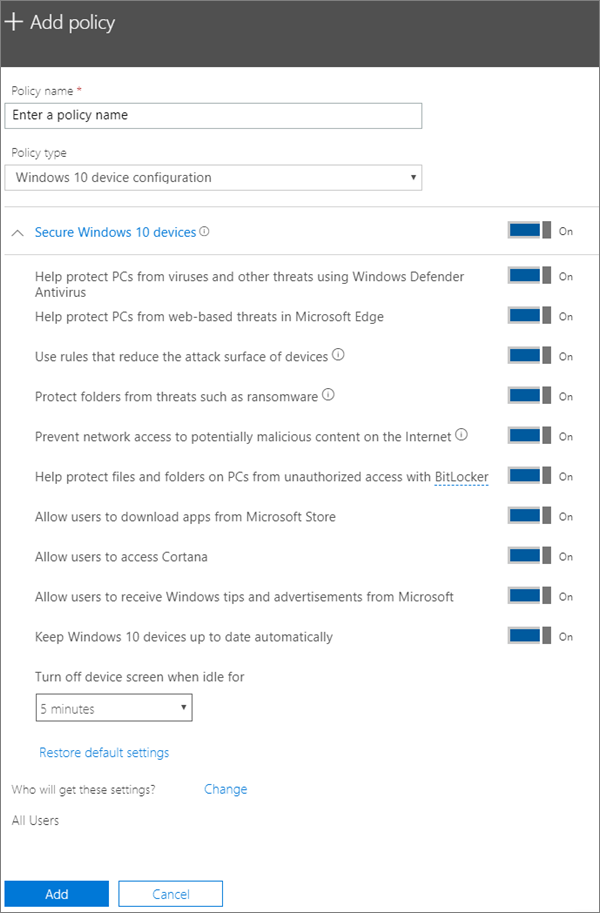

# Modificare o creare le impostazioni di protezione dei dispositivi Windows 10 PCEdit or create device protection settings for Windows 10 PCs

Questo articolo si applica a Microsoft 365 Business Premium.This article applies to Microsoft 365 Business Premium.

Dopo aver configurato le impostazioni di protezione Windows predefinite nella pagina Installazione, è possibile aggiungerne di nuove che si applicano a tutti gli utenti o a un set di utenti.After you have set set up default Windows protection settings on the Setup page, you can add new ones that apply to either all users, or a set of users. Puoi anche modificare uno qualsiasi di quelli che hai creato.You can also edit any of the ones you have created.

## Creare impostazioni di protezione per Windows 10 dispositiviCreate protection settings for Windows 10 devices

Guarda un video su come proteggere Windows 10 dispositivi con Microsoft 365 Business Premium:View a video on how to secure Windows 10 devices with Microsoft 365 Business Premium:
  
> [!VIDEO https://www.microsoft.com/videoplayer/embed/a5734146-620a-4cec-8618-536b3ca37972?autoplay=false]
  
1. Passare all'interfaccia di amministrazione all'indirizzo <a href="https://go.microsoft.com/fwlink/p/?linkid=837890" target="_blank">https://admin.microsoft.com</a>.Go to the admin center at <a href="https://go.microsoft.com/fwlink/p/?linkid=837890" target="_blank">https://admin.microsoft.com</a>. 
2. Nel riquadro di spostamento sinistro scegliere **Criteri** \> **dispositivi** \> **Aggiungi**.On the left nav, choose **Devices** \> **Policies** \> **Add**.
3. Nel riquadro **Aggiungi criterio** immettere un nome univoco per il criterio.On the **Add policy** pane, enter a unique name for this policy. 
4. In **Tipo di criterio** scegliere **Configurazione dei dispositivi di Windows 10**.Under **Policy type**, choose **Windows 10 Device Configuration**.
5. Expand **Secure Windows 10 Devices** \> configure the settings how you would like.Expand **Secure Windows 10 Devices** \> configure the settings how you would like. Per ulteriori informazioni, vedere [Impostazioni disponibili.](#available-settings)For more information, see [Available settings](#available-settings). 
    
    È sempre possibile usare il collegamento **Ripristina impostazioni predefinite** per ripristinare l'impostazione predefinita.You can always use the **Reset default settings** link to return to the default setting. 
    
    
  
6. In **Chi otterrà queste impostazioni?** specificare i destinatari. Se non si vuole usare il gruppo di sicurezza predefinito **Tutti gli utenti**, scegliere **Modifica**, cercare il gruppo di sicurezza che riceverà queste impostazioni \> **Seleziona**.Next decide **Who will get these settings?** If you don't want to use the default **All users** security group, Choose **Change**, search for the security group who will get these settings \> **Select**.
7. Infine, scegliere **Fatto** per salvare il criterio e assegnarlo ai dispositivi.Finally, choose **Done** to save the policy, and assign it to devices. 

## Modificare Windows 10 di protezioneEdit Windows 10 protection settings
 
1. Passare all'interfaccia di amministrazione all'indirizzo <a href="https://go.microsoft.com/fwlink/p/?linkid=837890" target="_blank">https://admin.microsoft.com</a>.Go to the admin center at <a href="https://go.microsoft.com/fwlink/p/?linkid=837890" target="_blank">https://admin.microsoft.com</a>.     
2. Nel riquadro di spostamento sinistro scegliere **Criteri** \> **dispositivi.**On the left nav, choose **Devices** \> **Policies** .
1. Scegli un criterio Windows dispositivo esistente e quindi **Modifica**.Choose an existing Windows device policy and then **Edit**.
1. Scegliere **Modifica** accanto a un'impostazione che si desidera modificare e quindi **Salva.**Choose **Edit** next to a setting you want to change and then **Save**.

## Impostazioni disponibiliAvailable settings

Per impostazione predefinita, tutte le impostazioni sono **attivate**. Sono disponibili le impostazioni seguenti.By default all settings are **On**. The following settings are available.
  
Per ulteriori informazioni, vedere [How do protection features in Microsoft 365 Premium map to Intune settings](map-protection-features-to-intune-settings.md).For more information, see [How do protection features in Microsoft 365 Premium map to Intune settings](map-protection-features-to-intune-settings.md). 
  
|||
|:-----|:-----|
|ImpostazioneSetting    |DescrizioneDescription    |
|Protegge i PC da virus e altre minacce tramite Windows Defender AntivirusHelp protect PCs from viruses and other threats using Windows Defender Antivirus    |Richiede l'attivazione di Windows Defender Antivirus per la protezione dei PC dai pericoli derivanti dalla connessione a Internet.Requires that Windows Defender Antivirus is turned on to protect PCs from the dangers of being connected to the internet.    |
|Protegge i PC dalle minacce del Web in Microsoft EdgeHelp protect PCs from web-based threats in Microsoft Edge    |Attiva le impostazioni di Microsoft Edge che consentono di proteggere gli utenti da siti e download dannosi.Turns on settings in Edge that help protect users from malicious sites and downloads.    |
|Usa regole per ridurre la superficie di attacco dei dispositiviUse rules that reduce the attack surface of devices    |Quando è attivata, la riduzione della superficie di attacco consente di bloccare azioni e app generalmente usate dal malware per infettare i dispositivi. Questa impostazione è disponibile solo se Windows Defender Antivirus è attivato. Per altre informazioni, vedere [Ridurre le superfici di attacco con le regole di riduzione della superficie di attacco](/windows/security/threat-protection/microsoft-defender-atp/exploit-protection).  When turned On, attack surface reduction helps block actions and apps typically used by malware to infect devices. This setting is only available if Windows Defender Antivirus is set to On. See [Reduce attack surfaces](/windows/security/threat-protection/microsoft-defender-atp/exploit-protection) to learn more.    |
|Protegge le cartelle da minacce come il ransomwareProtect folders from threats such as ransomware    |Questa impostazione usa l'accesso controllato alle cartelle per proteggere i dati aziendali dalle modifiche effettuate da app sospette o pericolose, come il ransomware.This setting uses controlled folder access to protect company data from modification by suspicious or malicious apps, such as ransomware. A questi tipi di app viene impedito di apportare modifiche nelle cartelle protette.These types of apps are blocked from making changes in protected folders. Questa impostazione è disponibile solo se Windows Defender Antivirus è attivato.This setting is only available if Windows Defender Antivirus is set to On. Per [ulteriori informazioni, vedere Proteggere le cartelle con accesso](/mem/configmgr/protect/deploy-use/create-deploy-exploit-guard-policy#bkmk_CFA) controllato alle cartelle.See [Protect folders with Controlled folder access](/mem/configmgr/protect/deploy-use/create-deploy-exploit-guard-policy#bkmk_CFA) to learn more.    |
|Impedisce l'accesso alla rete a contenuti potenzialmente pericolosi su InternetPrevent network access to potentially malicious content on the Internet    |Utilizzare questa impostazione per bloccare le connessioni degli utenti in uscita a posizioni Internet con reputazione bassa che potrebbero ospitare tentativi di phishing, exploit o altro contenuto dannoso.Use this setting to block outbound user connections to low-reputation Internet locations that may host phishing scams, exploits, or other malicious content. Questa impostazione è disponibile solo se Windows Defender Antivirus è impostato su **On.**This setting is only available if Windows Defender Antivirus is set to **On**. Per ulteriori informazioni, vedere [Proteggere la rete.](/windows/security/threat-protection/windows-defender-antivirus/configure-real-time-protection-windows-defender-antivirus)For more information, see [Protect your network](/windows/security/threat-protection/windows-defender-antivirus/configure-real-time-protection-windows-defender-antivirus).    |
|Proteggi file e cartelle dei PC dall'accesso non autorizzato con BitLockerHelp protect files and folders on PCs from unauthorized access with BitLocker    |Bitlocker protegge i dati crittografando le unità disco rigido del computer e impedisce l'esposizione dei dati in caso di furto o smarrimento di un computer.Bitlocker protects data by encrypting the computer hard drives and protect against data exposure if a computer is lost or stolen. Per altre informazioni, vedi Domande [frequenti su Bitlocker.](/windows/security/information-protection/bitlocker/bitlocker-frequently-asked-questions)For more information, see [Bitlocker FAQ](/windows/security/information-protection/bitlocker/bitlocker-frequently-asked-questions).    |
|Consenti agli utenti di scaricare app da Microsoft StoreAllow users to download apps from Microsoft Store    |Consente agli utenti di scaricare e installare app da Microsoft Store. Le app possono essere di qualsiasi tipo, da giochi a strumenti per la produttività, quindi questa impostazione viene lasciata **attivata**, ma è possibile disattivarla per rafforzare la sicurezza.  Lets users download and install apps from the Microsoft Store. Apps include everything from games to productivity tools, so we leave this setting **On**, but you can turn it off for extra security.    |
|Consenti agli utenti di accedere a CortanaAllow users to access Cortana    |Cortana può essere molto utile!Cortana can be very helpful! Cortana può attivare o disattivare automaticamente le impostazioni, fornire indicazioni stradali e assicurarsi  di essere in tempo per gli appuntamenti, quindi questa impostazione viene conservata per impostazione predefinita.Cortana can turn settings on or off for you, give directions, and make sure you're on time for appointments, so we keep this setting **On** by default.    |
|Consenti agli utenti di ricevere da Microsoft suggerimenti e pubblicità su WindowsAllow users to receive Windows tips and advertisements from Microsoft    |I suggerimenti su Windows possono essere utili e possono fornire informazioni sulle nuove funzionalità quando vengono rilasciate.Windows tips can be handy and help orient users when new features are released.    |
|Mantieni automaticamente aggiornati i dispositivi Windows 10Keep Windows 10 devices up to date automatically    |Assicura che i dispositivi Windows 10 ricevano automaticamente gli aggiornamenti più recenti.Makes sure that Windows 10 devices automatically receive the latest updates.    |
|Disattiva lo schermo del dispositivo quando rimane inattivo per questo periodo di tempoTurn off device screen when idle for this amount of time    |Assicura che i dati aziendali siano protetti in caso di inattività di un utente. È possibile che un utente lavori in un luogo pubblico, ad esempio un bar, e si allontani o si distragga per qualche minuto, esponendo il dispositivo agli sguardi altrui. Questa impostazione consente di controllare per quanto tempo l'utente può rimanere inattivo prima che lo schermo disattivato.Makes sure that company data is protected if a user is idle. A user may be working in a public location, like a coffee shop, and step away or be distracted for just a moment, leaving their device vulnerable to random glances. This setting lets you control how long the user can be idle before the screen shuts off.    |