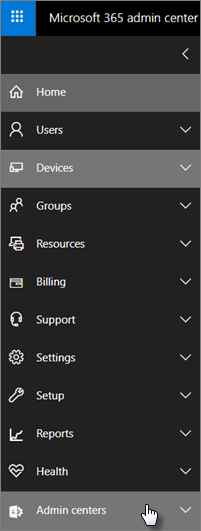

# Funzionalità di sicurezza aziendale di Microsoft 365Microsoft 365 Business security features

Microsoft 365 business offre funzionalità di sicurezza semplificate per garantire la protezione dei dati su PC, telefoni e tablet.Microsoft 365 Business offers simplified security features to help safeguard your data on PCs, phones, and tablets.
    
## Funzionalità di sicurezza dell'interfaccia di amministrazione di Microsoft 365 businessMicrosoft 365 Business admin center security features

È possibile gestire molte delle funzionalità di sicurezza aziendale di Microsoft 365 nell'interfaccia di amministrazione, che consente di abilitare o disabilitare queste funzionalità in modo semplificato.You can manage many of the Microsoft 365 Business security features in the admin center, which gives you a simplified way to turn these features on or off. Nell'interfaccia di amministrazione è possibile eseguire le operazioni seguenti:In the admin center you can do the following:
  

  
- [Impostare le impostazioni di gestione applicazioni per i dispositivi Android o iOS](app-protection-settings-for-android-and-ios.md) .[Set application management settings for Android or iOS devices](app-protection-settings-for-android-and-ios.md) . 
    
    Tali impostazioni includono l'eliminazione di file da un dispositivo inattivo dopo un determinato periodo di tempo, la crittografia dei file di lavoro, la necessità di impostare un PIN e così via.These settings include deleting files from an inactive device after a set period, encrypting work files, requiring that users set a PIN, etc.
    
- [Impostare le impostazioni di protezione delle applicazioni per i dispositivi Windows 10](protection-settings-for-windows-10-devices.md) .[Set application protection settings for Windows 10 devices](protection-settings-for-windows-10-devices.md) . 
    
    Queste impostazioni possono essere applicate ai dati aziendali sia su dispositivi di proprietà o personali.These settings can be applied to company data on both company-owned, or personally-owned devices.
    
- [Impostare le impostazioni di protezione del dispositivo per i dispositivi Windows 10](protection-settings-for-windows-10-pcs.md) .[Set device protection settings for Windows 10 devices](protection-settings-for-windows-10-pcs.md) . 
    
    È possibile abilitare la crittografia [BitLocker](https://go.microsoft.com/fwlink/p/?linkid=871405) per proteggere i dati in caso di perdita o di furto di un dispositivo e consentire a [Windows exploit Guard](https://go.microsoft.com/fwlink/p/?linkid=871404) di fornire una protezione avanzata contro ransomware.You can enable [BitLocker](https://go.microsoft.com/fwlink/p/?linkid=871405) encryption to help protect data in case a device is lost or stolen, and enable [Windows Exploit Guard](https://go.microsoft.com/fwlink/p/?linkid=871404) to provide advanced protection against ransomware. 
    
- [Rimuovere i dati aziendali dai dispositiviRemove company data from devices](remove-company-data.md)
    
    È possibile cancellare in remoto i dati della società se un dispositivo viene perso, rubato o un dipendente lascia la propria azienda.You can remotely wipe company data if a device is lost, stolen, or an employee leaves your company.
    
- [Ripristinare le impostazioni di fabbrica dei dispositivi Windows 10](reset-devices-to-factory-settings.md) .[Reset Windows 10 devices to their factory settings](reset-devices-to-factory-settings.md) . 
    
    È possibile reimpostare tutti i dispositivi Windows 10 a cui sono state applicate le impostazioni di protezione dei dispositivi.You can reset any Windows 10 devices that have device protection settings applied to them.
    
## Altre funzionalità di sicurezzaAdditional security features 

Le funzionalità avanzate di Microsoft 365 business sono disponibili per aiutare a proteggere la propria azienda dalle minacce informatiche e salvaguardare le informazioni riservate.Advanced features in Microsoft 365 Business are available to help you protect your business against cyber-threats and safeguard sensitive information.
  
- **[Office 365 Advanced Threat Protection](https://support.office.com/article/e100fe7c-f2a1-4b7d-9e08-622330b83653)****[Office 365 Advanced Threat Protection](https://support.office.com/article/e100fe7c-f2a1-4b7d-9e08-622330b83653)**
    
    Advanced Threat Protection (ATP) consente di proteggere la propria azienda da attacchi di phishing e ransomware sofisticati destinati a compromettere le informazioni relative ai dipendenti o ai clienti.Advanced Threat Protection (ATP) helps guard your business against sophisticated phishing and ransomware attacks designed to compromise employee or customer information. Le caratteristiche includono:Features include:
    
  - Scansione avanzata degli allegati e analisi di AI per rilevare e scartare messaggi pericolosi.Sophisticated attachment scanning and AI-powered analysis to detect and discard dangerous messages.
    
  - Controlli automatici dei collegamenti Web nel messaggio di posta elettronica per valutare se fanno parte di uno schema di phishing.Automatic checks of web links in email to assess if they are part of a phishing scheme. In questo modo si impedisce all'utente di accedere a siti Web non sicuri.This keeps you safe from accessing unsafe websites.
    
- **[Panoramica dei criteri di prevenzione della perdita di dati](https://support.office.com/article/1966b2a7-d1e2-4d92-ab61-42efbb137f5e)** (DLP).**[Overview of data loss prevention policies](https://support.office.com/article/1966b2a7-d1e2-4d92-ab61-42efbb137f5e)** (DLP). 
    
    È possibile configurare DLP per rilevare automaticamente le informazioni riservate, come i numeri di carta di credito, i numeri di previdenza sociale e così via, per impedire la condivisione accidentale all'esterno dell'azienda.You can set up DLP to automatically detect sensitive information, like credit card numbers, social security numbers, etc. to prevent their inadvertent sharing outside your company.
    
- **[Archiviazione Exchange Online](https://products.office.com/exchange/microsoft-exchange-online-archiving-email)****[Exchange Online Archiving](https://products.office.com/exchange/microsoft-exchange-online-archiving-email)**
    
    La licenza di archiviazione Exchange Online consente di archiviare facilmente i messaggi con il backup dei dati continua.Exchange Online Archiving license enables messages to be easily archived with continuous data backup. Archivia tutti i messaggi di posta elettronica di un utente, inclusi gli elementi eliminati, nel caso in cui siano necessari in seguito per l'individuazione o il ripristino.It stores all of a user's emails, including deleted items, in case they are needed later for discovery or restoration. Inoltre, è possibile utilizzare criteri di conservazione diversi per conservare i dati della posta elettronica per controversia legale, eDiscovery, o per soddisfare i requisiti di conformità.Additionally, you can use different retention policies to preserve email data for litigation holds, eDiscovery, or to meet compliance requirements.
    
- **[Azure Information Protection](https://go.microsoft.com/fwlink/p/?linkid=871406)****[Azure Information Protection](https://go.microsoft.com/fwlink/p/?linkid=871406)**
    
    La protezione delle informazioni consente di controllare l'accesso alle informazioni riservate nei messaggi di posta elettronica e nei documenti con controlli quali "non inoltrare" e "non copiare".Information protection helps you control access to sensitive information in email and documents with controls like "Do not forward" and "Do not copy." È inoltre possibile classificare le informazioni riservate come "riservate" e specificare in che modo le informazioni classificate possono essere condivise all'esterno e all'interno dell'azienda.You can also classify sensitive information as "Confidential" and specify how classified information can be shared outside and inside the business. La crittografia di livello aziendale è facile da applicare ai messaggi di posta elettronica e ai documenti per mantenere private le informazioni.Enterprise-grade encryption is easy to apply to email and documents to keep your information private. Microsoft 365 business include tutte le funzionalità di [Azure Information Protection Plan 1](https://go.microsoft.com/fwlink/p/?linkid=871407).Microsoft 365 Business includes all the features of [Azure Information Protection Plan 1](https://go.microsoft.com/fwlink/p/?linkid=871407). È inoltre possibile installare il componente aggiuntivo di Azure Information Protection client per le app di Office.You can also install the Azure Information Protection client add-in for Office apps. Per ulteriori informazioni, vedere [Guida di Admininstrator del client di Azure Information Protection](https://docs.microsoft.com/azure/information-protection/rms-client/client-admin-guide).For more details, see [Azure Information Protection client admininstrator guide](https://docs.microsoft.com/azure/information-protection/rms-client/client-admin-guide).
    
- **[Le funzionalità complete di Intune nel portale di Azure](https://go.microsoft.com/fwlink/p/?linkid=871403)****[The full capabilities of Intune in the Azure portal](https://go.microsoft.com/fwlink/p/?linkid=871403)**
    
    L'accesso all'interfaccia di amministrazione di Intune nel portale di Azure consente di configurare altre funzionalità di sicurezza, ad esempio la gestione dei dispositivi MacOS, iPhone e Android insieme a Advanced Device Management per Windows, che non sono disponibili tramite Microsoft 365 Business Admin Center.Accessing the Intune admin center in the Azure portal allows you to set up additional security features, such as the management of MacOS devices, iPhone, and Android devices along with advanced device management for Windows, that are not available through Microsoft 365 Business admin center.
    
Nelle sezioni successive viene descritto come è possibile gestire queste funzionalità nel centro &amp; conformità sicurezza e nell'interfaccia di amministrazione di Intune.The next sections describe how you can manage these features in the Security &amp; Compliance center and the Intune admin center. Nel corso del tempo, i controlli semplificati verranno aggiunti all'interfaccia di amministrazione di Microsoft 365 business.Over time the simplified controls will be added to the Microsoft 365 Business admin center.
  
    
## Domande frequentiFAQ

 ### Queste funzionalità di sicurezza sono disponibili in tutti i mercati?Are these security features available in all markets?
  
Sì, queste funzionalità sono disponibili in tutti i mercati in cui è venduto Microsoft 365 business.Yes, these features are available in all markets where Microsoft 365 Business is sold.
  
### Come trovare il Centro sicurezza &amp; e conformitàHow do I find the Security &amp; Compliance center?
  
1. [Accedere a Microsoft 365 business](https://portal.microsoft.com/) utilizzando le credenziali di amministratore.[Sign in to Microsoft 365 Business](https://portal.microsoft.com/) by using your admin credentials. 
    
2. Nel NAV sinistro, individuare i **centri di amministrazione** ed espanderlo.In the left nav, locate **Admin centers** and expand it. 
    
    
  
3. Scegliere **conformità &amp; di sicurezza** per accedere al &amp; Centro sicurezza e conformità.Choose **Security &amp; Compliance** to go to Security &amp; compliance center.