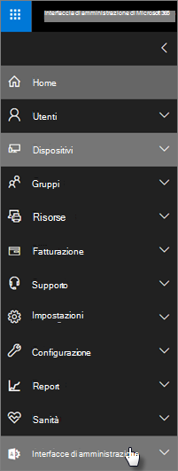

# Funzionalità di sicurezza e conformità di Microsoft 365 Business Premium

Microsoft 365 Business Premium offre funzionalità di sicurezza semplificate per proteggere i dati su PC, telefoni e tablet.
    
## Funzionalità di sicurezza dell'interfaccia di amministrazione di Microsoft 365

È possibile gestire molte delle funzionalità di sicurezza di Microsoft 365 Business Premium nell'interfaccia di amministrazione, in modo da semplificare l'attivazione o la disattivazione di queste funzionalità. Nell'interfaccia di amministrazione è possibile eseguire le operazioni seguenti:
  
- [Imposta le impostazioni di gestione delle applicazioni per i dispositivi Android o iOS.](app-protection-settings-for-android-and-ios.md) 
    
    Queste impostazioni includono l'eliminazione di file da un dispositivo inattivo dopo un determinato periodo di tempo, la crittografia dei file di lavoro, la richiesta agli utenti di impostare un PIN e così via.
    
- [Imposta le impostazioni di protezione delle applicazioni per i dispositivi Windows 10.](protection-settings-for-windows-10-devices.md) 
    
    Queste impostazioni possono essere applicate ai dati aziendali su dispositivi di proprietà dell'azienda o personali.
    
- [Imposta le impostazioni di protezione del dispositivo per i dispositivi Windows 10.](protection-settings-for-windows-10-pcs.md) 
    
    Puoi abilitare la [crittografia BitLocker](/windows/security/information-protection/bitlocker/bitlocker-frequently-asked-questions) per proteggere i dati in caso di perdita o furto di un dispositivo e abilitare [Windows Exploit Guard](/windows/security/threat-protection/microsoft-defender-atp/enable-exploit-protection) per fornire una protezione avanzata contro i ransomware. 
    
- [Rimuovere i dati aziendali dai dispositivi](remove-company-data.md)
    
    Puoi cancellare in remoto i dati aziendali se un dispositivo viene perso, rubato o un dipendente lascia l'azienda.
    
- Ripristinare le impostazioni di fabbrica dei dispositivi [Windows 10.](reset-devices-to-factory-settings.md) 
    
    Puoi reimpostare tutti i dispositivi Windows 10 a cui sono applicate le impostazioni di protezione dei dispositivi.
    
## Ulteriori funzionalità relative alla sicurezza 

Le funzionalità avanzate di Microsoft 365 Business Premium sono disponibili per aiutarti a proteggere la tua azienda dalle minacce informatiche e salvaguardare le informazioni sensibili.
  
- **[Microsoft Defender per Office 365](../security/office-365-security/office-365-atp.md)**
    
    Microsoft Defender per Office 365 aiuta a proteggere l'azienda da sofisticati attacchi di phishing e ransomware progettati per compromettere le informazioni dei dipendenti o dei clienti. Le funzionalità includono:
    
  - Sofisticata analisi degli allegati e analisi basate su IA per rilevare ed eliminare i messaggi pericolosi.
    
  - Controlli automatici dei collegamenti nella posta elettronica per valutare se fanno parte di uno schema di phishing. In questo modo si impedisce l'accesso a siti Web non sicuri.

- **[Funzionalità complete di Intune nel portale di Azure](/mem/intune/fundamentals/what-is-intune)**
    
    L'accesso all'interfaccia di amministrazione di Intune nel portale di Azure consente di configurare funzionalità di sicurezza aggiuntive, ad esempio la gestione dei dispositivi MacOS, iPhone e Android, insieme alla gestione avanzata dei dispositivi per Windows, che non sono disponibili tramite l'interfaccia di amministrazione di Microsoft 365.
- **Stesso [accesso condizionale del](/azure/active-directory/conditional-access/overview) piano Azure AD Premium P1**

    L'accesso condizionale consente di proteggere l'organizzazione da rischi di accesso, tentativi di accesso da una rete o da impostazioni locali impreviste, tentativi di accesso da tipi di dispositivi rischiosi e così via. I criteri di accesso condizionale vengono applicati dopo il completamento della prima autenticazione e utilizzano i segnali del primo evento di autenticazione per determinare se il tentativo di accesso deve essere approvato, negato o se sono necessarie ulteriori prove (ad esempio una seconda forma di identificazione).

    Le funzionalità di accesso condizionale incluse sono:

    - Accesso basato su nome utente, gruppo e ruolo
    - Accesso [basato su un'app](/azure/active-directory/conditional-access/app-based-conditional-access) 
    - [Accesso in base alla posizione](/azure/active-directory/authentication/howto-registration-mfa-sspr-combined#conditional-access-policies-for-combined-registration);  consentire solo l'accesso da intervalli IP attendibili o da paesi specifici 
    - Richiedi autenticazione a più fattori per l'accesso
    - Bloccare l'accesso alle app che usano [l'autenticazione legacy](/azure/active-directory/conditional-access/block-legacy-authentication)
    - Richiedere alle app di usare [la protezione delle app di Intune](/azure/active-directory/conditional-access/app-protection-based-conditional-access)
    - Autenticazione personalizzata, ad esempio MFA con provider di terze parti, ad esempio DUO.
   
    Altre funzionalità:
    - [Reimpostazione della password in modalità self-service](/azure/active-directory/authentication/concept-sspr-customization) per Azure AD ibrido
    
## Funzionalità di conformità

L'abbonamento a Microsoft 365 Business Premium include funzionalità che consentono di mantenere gli standard normativi e di conformità.

- **[Panoramica dei criteri di prevenzione della perdita dei dati](../compliance/data-loss-prevention-policies.md)** (DLP). 
    
    È possibile configurare DLP in modo che rilevi automaticamente informazioni riservate, ad esempio numeri di carta di credito, numeri di previdenza sociale e così via, per impedire la condivisione accidentale all'esterno dell'azienda.
    
- **[Archiviazione Exchange Online](https://products.office.com/exchange/microsoft-exchange-online-archiving-email)**
    
    Archiviazione Exchange Online licenza consente di archiviare facilmente i messaggi con il backup continuo dei dati. Archivia tutti i messaggi di posta elettronica di un utente, inclusi gli elementi eliminati, nel caso in cui siano necessari in un secondo momento per l'individuazione o il ripristino. Inoltre, è possibile utilizzare criteri di conservazione diversi per conservare i dati di posta elettronica per i blocchi per controversia legale, eDiscovery o per soddisfare i requisiti di conformità.
    
- **[Etichette di riservatezza](../compliance/sensitivity-labels.md)**

   Microsoft 365 Business Premium include tutte le funzionalità di [Azure Information Protection Piano 1.](https://go.microsoft.com/fwlink/p/?linkid=871407) Con questo piano,  è possibile creare etichette di riservatezza che consentono di controllare l'accesso alle informazioni riservate nei messaggi di posta elettronica e nei documenti, con controlli come "Non inoltrare" e "Non copiare". È inoltre possibile classificare le informazioni riservate come "Riservate" e specificare in che modo le informazioni classificate possono essere condivise all'esterno e all'interno dell'azienda. La crittografia di livello enterprise è facile da applicare alla posta elettronica e ai documenti per mantenere private le informazioni. È anche possibile installare il componente aggiuntivo del client Azure Information Protection per le app di Office. Per altre informazioni, vedere [Client di etichettatura di Azure Information Protection unificato](/azure/information-protection/rms-client/unifiedlabelingclient-version-release-history). Per le etichette di riservatezza, **installare ilAzInfoProtection_UL.exe**.

È possibile gestire queste funzionalità nel Centro sicurezza &amp; e conformità e nell'interfaccia di amministrazione di Intune. Nel corso del tempo i controlli semplificati verranno aggiunti all'interfaccia di amministrazione di Microsoft 365.
  
    
## Domande frequenti

 ### Queste funzionalità di sicurezza sono disponibili in tutti i mercati?
  
Sì, queste funzionalità sono disponibili in tutti i mercati in cui è venduto Microsoft 365 Business Premium.
  
### Come si trova il Centro &amp; sicurezza e conformità?
  
1. [Accedi a Microsoft 365 Business Premium](https://portal.microsoft.com/) usando le credenziali di amministratore. 
    
2. Nel riquadro di spostamento a sinistra, individuare **Le admin center** ed espanderlo. 
    
    
  
3. Scegliere **Conformità &amp; sicurezza** per passare a Centro &amp; sicurezza e conformità.