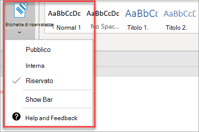

# Funzionalità di conformità della configurazione

Microsoft 365 Business Premium è dotato di funzionalità per proteggere i dati e i dispositivi, nonché per garantire la sicurezza delle informazioni riservate e dei clienti.

## Configurare le funzionalità DLP

Vedere [creare un criterio DLP da un modello](https://support.office.com/article/59414438-99f5-488b-975c-5023f2254369) per un esempio su come impostare un criterio per proteggere le informazioni personali. 
  
DLP viene fornito con molti modelli di criteri pronti per l'uso per molte impostazioni locali diverse. Ad esempio, Australia Financial Data, Canada Personal Information Act, US Financial Data e così via. Vedere [cosa includono i modelli di criteri DLP](https://support.office.com/article/c2e588d3-8f4f-4937-a286-8c399f28953a) per un elenco completo. Tutti questi modelli possono essere abilitati in modo analogo all'esempio del modello PII. 
  
## Configurare la conservazione della posta elettronica con archiviazione Exchange Online

 Le funzionalità di licenza di **archiviazione di Exchange Online** aiutano a mantenere la conformità e gli standard normativi preservando il contenuto della posta elettronica per eDiscovery. Consente inoltre di ridurre il rischio se esiste una causa legale e consente di recuperare i dati dopo una violazione della sicurezza o quando è necessario recuperare gli elementi eliminati. È possibile utilizzare il blocco per controversia legale per mantenere tutto il contenuto di un utente o utilizzare i criteri di conservazione per personalizzare gli elementi che si desidera conservare.
  
**Blocco per controversia legale:** È possibile mantenere tutti i contenuti delle cassette postali, compresi gli elementi eliminati, inserendo l'intera cassetta postale di un utente sul blocco per controversia legale. 
    
Per inserire una cassetta postale per il blocco per controversia legale, nell'interfaccia di amministrazione:
    
1. Nella barra di spostamento a sinistra, passare a utenti **attivi**degli **utenti** \> .
    
2. Selezionare un utente la cui cassetta postale si desidera inserire nel blocco per controversia legale. Nel riquadro utente espandere Impostazioni di **posta elettronica**e accanto a **altre impostazioni**scegliere **modifica proprietà di Exchange**.
    
3. Nella pagina Cassetta postale per l'utente, scegliere * * funzionalità cassetta postale * * sulla barra di spostamento sinistra e quindi scegliere il collegamento **attiva** in **blocco per controversia legale**.
    
4. Nella finestra di dialogo **blocco per controversia legale** , è possibile specificare la durata del blocco per controversia legale nel campo **Durata blocco** per controversia legale. Lasciare vuoto il campo se si desidera inserire un blocco infinito. È inoltre possibile aggiungere note e indirizzare il proprietario della cassetta postale a un sito Web potrebbe essere necessario spiegarne di più sul blocco per controversia legale. \>**Save**.
    
**Conservazione:** È possibile abilitare i criteri di conservazione personalizzati, ad esempio per mantenere un determinato intervallo di tempo o eliminare il contenuto in modo permanente alla fine del periodo di conservazione. Per ulteriori informazioni, vedere [Overview of Retention Policies](https://support.office.com/article/5e377752-700d-4870-9b6d-12bfc12d2423).

## Configurare le etichette di riservatezza

Le etichette di riservatezza sono dotate di Azure Information Protection (AIP) piano 1 e consentono di classificare e, facoltativamente, proteggere i documenti e i messaggi di posta elettronica applicando etichette. Le etichette possono essere applicate automaticamente dagli amministratori che definiscono le regole e le condizioni, manualmente dagli utenti o utilizzando una combinazione in cui gli utenti ricevono consigli.

Per impostare le etichette di riservatezza, vedere [creare e gestire le etichette di riservatezza](https://support.office.com/article/2fb96b54-7dd2-4f0c-ac8d-170790d4b8b9) video.

### Installare il client Azure Information Protection manualmente

Per installare manualmente il client AIP:

1. Scaricare **AzinfoProtection_UL. exe** dall' [area download Microsoft](https://www.microsoft.com/download/details.aspx?id=53018).
 
2. È possibile verificare che l'installazione abbia avuto esito positivo visualizzando un documento di Word e assicurandosi che l'opzione **sensitivity** sia disponibile nella scheda **Home** .
 

Per ulteriori informazioni, vedere [Install the client](https://docs.microsoft.com/azure/information-protection/infoprotect-tutorial-step3).
