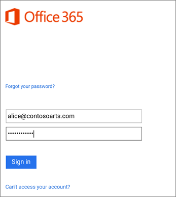

# Configurare i dispositivi mobili per utenti di Microsoft 365 Business

Seguire le istruzioni nelle schede per installare Office su un iPhone o un telefono Android. Una volta completate queste procedure, i file di lavoro creati nelle app di Office saranno protetti tramite Microsoft 365 Business.

L'esempio riguarda Outlook, ma si applica anche ad altre app di Office da installare.
  
## Configurare i dispositivi mobili

## [iPhone](#tab/iPhone)
  
Guarda un breve video su come configurare le app di Office nei dispositivi iOS con Microsoft 365 business.  

> [!VIDEO https://www.microsoft.com/videoplayer/embed/RWee2n] 

Se il video è stato utile, consultare la [serie di formazione completa per piccole imprese e nuovi utenti di Microsoft 365](https://support.office.com/article/6ab4bbcd-79cf-4000-a0bd-d42ce4d12816).

Accedere all' **App Store** e digitare Microsoft Outlook nel campo di ricerca.
  

  
Toccare l'icona del cloud per installare Outlook.
  

  
Al termine dell'installazione, toccare il pulsante **Apri** per aprire Outlook e quindi toccare **Inizia**.
  

  
Immettere l'indirizzo di posta elettronica aziendale nella schermata **Aggiungi account email** \> **Aggiungi account**, quindi immettere le credenziali di Microsoft 365 Business \> **Accedi**.
  

  
Se l'organizzazione sta proteggendo i file nelle app, viene visualizzata una finestra di dialogo in cui viene indicato che l'organizzazione protegge i dati nell'app e che è necessario riavviare l'applicazione per continuare a utilizzarla. Toccare **OK** e chiudere Outlook. 
  

  
Trovare Outlook sull'iPhone e riavviarlo. Quando richiesto, immettere un PIN e verificarlo. Outlook nell'iPhone è ora pronto per essere usato.
  

  
## [Android](#tab/Android)
  
Guardare un video sull'installazione di Outlook e Office su dispositivi Android.  

> [!VIDEO https://www.microsoft.com/videoplayer/embed/ecc2e9c0-bc7e-4f26-8b14-91d84dbcfef0] 

Se il video è stato utile, consultare la [serie di formazione completa per piccole imprese e nuovi utenti di Microsoft 365](https://support.office.com/article/6ab4bbcd-79cf-4000-a0bd-d42ce4d12816).

Per iniziare a configurare il telefono Android, passare a Play Store.
  

  
Immettere Microsoft Outlook nella casella di ricerca di Google Play e toccare **Install**. Dopo aver completato l'installazione di Outlook, toccare **Apri**.
  

  
Nell'app Outlook **, toccare inizia**, quindi aggiungere il proprio account \> di posta elettronica Microsoft 365 business **continue**e accedere con le credenziali dell'organizzazione.
  

  
Nella finestra di dialogo che chiede di installare l'app Portale aziendale Intune toccare **Vai allo Store**.
  

  
In Play Store, installare il portale aziendale di Intune.
  

  
Aprire nuovamente Outlook, immettere il PIN e confermarlo. L'app Outlook è ora pronta per essere usata.
  

## Vedere anche

[Video per la formazione di Microsoft 365 Business](https://support.office.com/article/6ab4bbcd-79cf-4000-a0bd-d42ce4d12816)

---
