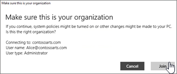

# Configurare i dispositivi Windows per utenti di Microsoft 365 BusinessSet up Windows devices for Microsoft 365 Business users

## PrerequisitiPrerequisites

Prima di poter configurare i dispositivi Windows per gli utenti di Microsoft 365 Business, assicurarsi che tutti i dispositivi Windows eseguano Windows 10 Pro, versione 1703 (Creators Update). Windows 10 Pro rappresenta un prerequisito per la distribuzione di Windows 10 Business, ovvero un insieme di servizi cloud e funzionalità di gestione dei dispositivi che integrano Windows 10 Pro e consentono la gestione centralizzata e i controlli di sicurezza di Microsoft 365 Business.Before you can set up Windows devices for Microsoft 365 Business users, make sure all the Windows devices are running Windows 10 Pro, version 1703 (Creators Update). Windows 10 Pro is a prerequisite for deploying Windows 10 Business, which is a set of cloud services and device management capabilities that complement Windows 10 Pro and enable the centralized management and security controls of Microsoft 365 Business.
  
Se sono presenti dispositivi Windows che eseguono Windows 7 Pro, Windows 8 Pro o Windows 8.1 Pro, l'abbonamento a Microsoft 365 Business dà diritto a un aggiornamento a Windows 10.If you have Windows devices running Windows 7 Pro, Windows 8 Pro, or Windows 8.1 Pro, your Microsoft 365 Business subscription entitles you to a Windows 10 upgrade.
  
Per altre informazioni su come eseguire l'aggiornamento di dispositivi Windows Pro a Windows 10 Pro Creators Update, seguire i passaggi descritti in questo argomento: [Eseguire l'aggiornamento di dispositivi Windows a Windows Pro Creators Update](upgrade-to-windows-pro-creators-update.md).For more information on how to upgrade Windows devices to Windows 10 Pro Creators Update, follow the steps in this topic: [Upgrade Windows devices to Windows Pro Creators Update](upgrade-to-windows-pro-creators-update.md).
  
Vedere [verificare che il dispositivo sia connesso a Azure](#verify-the-device-is-connected-to-azure-ad) ad per verificare che l'aggiornamento sia stato effettuato o che l'aggiornamento abbia avuto esito positivo.See [Verify the device is connected to Azure AD](#verify-the-device-is-connected-to-azure-ad) to verify you have the upgrade, or to make sure the upgrade worked.

Guardare un breve video sulla connessione di Windows a Microsoft 365.Watch a short video about connecting Windows to Microsoft 365.  

> [!VIDEO https://www.microsoft.com/videoplayer/embed/RE3yXh3] 

Se è stato trovato utile questo video, vedere la [serie completa di formazione per le piccole imprese e quelle nuove a Microsoft 365](https://support.office.com/article/6ab4bbcd-79cf-4000-a0bd-d42ce4d12816).If you found this video helpful, check out the [complete training series for small businesses and those new to Microsoft 365](https://support.office.com/article/6ab4bbcd-79cf-4000-a0bd-d42ce4d12816).
  
## Unire i dispositivi Windows 10 a Azure AD dell'organizzazione.Join Windows 10 devices to your organization's Azure AD

Quando tutti i dispositivi Windows nell'organizzazione sono stati aggiornati a Windows 10 Pro Creators Update o sono già in esecuzione l'aggiornamento di Windows 10 Pro Creator, è possibile aggiungere questi dispositivi a Azure Active Directory dell'organizzazione.When all Windows devices in your organization have either been upgraded to Windows 10 Pro Creators Update or are already running Windows 10 Pro Creators Update, you can join these devices to your organization's Azure Active Directory. Una volta che i dispositivi sono Stati Uniti, verranno aggiornati automaticamente a Windows 10 business, che fa parte dell'abbonamento a Microsoft 365 business.Once the devices are joined, they'll be automatically upgraded to Windows 10 Business, which is part of your Microsoft 365 Business subscription.
  
### Per un dispositivo Windows 10 Pro nuovo o appena aggiornatoFor a brand new, or newly upgraded, Windows 10 Pro device

Per un nuovo dispositivo che esegue Windows 10 Pro Creators Update oppure appena aggiornato a Windows 10 Pro Creators Update ma che non è ancora stato configurato con Windows 10, seguire questa procedura.For a brand new device running Windows 10 Pro Creators Update, or for a device that was upgraded to Windows 10 Pro Creators Update but has not gone through Windows 10 device setup, follow these steps.
  
1. Seguire la procedura di installazione di Windows 10 finché non viene visualizzata la pagina **Che configurazione vuoi eseguire?**.Go through Windows 10 device setup until you get to the **How would you like to set up?** page. 
    
    
  
2. In questa pagina scegliere **Configurazione per un'organizzazione** e quindi immettere il nome utente e la password per Microsoft 365 Business.Here, choose **Set up for an organization** and then enter your username and password for Microsoft 365 Business. 
    
3. Completare la configurazione del dispositivo con Windows 10.Finish Windows 10 device setup.
    
   Al termine, l'utente verrà connesso a Azure Active Directory dell'organizzazione. Per accertarsene, vedere [Verificare che il dispositivo sia connesso a Azure AD](#verify-the-device-is-connected-to-azure-ad).Once you're done, the user will be connected to your organization's Azure AD. See [Verify the device is connected to Azure AD](#verify-the-device-is-connected-to-azure-ad) to make sure. 
  
### Per un dispositivo già configurato e che esegue Windows 10 ProFor a device already set up and running Windows 10 Pro

 **Collegare gli utenti a Azure Active Directory:****Connect users to Azure AD:**
  
1. Nel PC Windows dell'utente, che esegue Windows 10 Pro, versione 1703 (Creators Update) (vedere i [prerequisiti](pre-requisites-for-data-protection.md)), fare clic sul logo Windows e quindi sull'icona Impostazioni.In your user's Windows PC, that is running Windows 10 Pro, version 1703 (Creators Update) (see [pre-requisites](pre-requisites-for-data-protection.md)), click the Windows logo, and then the Settings icon.
  
   
  
2. In **Impostazioni** passare ad **Account**.In **Settings**, go to **Accounts**.
  
   
  
3. Nella pagina **Le tue info** fare clic su **Accedi all'azienda o all'istituto di istruzione** \> **Connetti**.On **Your info** page, click **Access work or school** \> **Connect**.
  
   
  
4. Nella finestra di dialogo **Imposta un account aziendale o dell'istituto di istruzione**, in **Azioni alternative**, scegliere **Aggiungi il dispositivo ad Azure Active Directory**.On the **Set up a work or school account** dialog, under **Alternate actions**, choose **Join this device to Azure Active Directory**.
  
   
  
5. Nella pagina **Esegui l'accesso** immettere l'account aziendale o dell'istituto di iscrizione \> **Avanti**.On the **Let's get you signed in** page, enter your work or school account \> **Next**.
  
   Nella pagina **Immettere la password** immettere la password \> **Accedi**.On the **Enter password** page, enter your password \> **Sign in**.
  
   
  
6. Nella pagina controlla che **sia la tua organizzazione** , verifica che le informazioni siano corrette e fai clic su **Unisci**.On the **Make sure this is your organization** page, verify that the information is correct, and click **Join**.
  
   Nella pagina **È tutto pronto** fare clic su **Fatto**.On the **You're all set!** page, click **Done**.
  
   
  
Se sono stati caricati file in OneDrive for Business, sincronizzarli nuovamente.If you uploaded files to OneDrive for Business, sync them back down. Se è stato utilizzato uno strumento di terze parti per eseguire la migrazione di profili e file, sincronizzarli anche con il nuovo profilo.If you used a third-party tool to migrate profile and files, also sync those to the new profile.
  
## Verificare che il dispositivo sia connesso a Azure ADVerify the device is connected to Azure AD

Per verificare lo stato della sincronizzazione, nella pagina **Accedi all'azienda o all'istituto di istruzione** in **Impostazioni** fare clic nell'area **Connesso a** _ \<organization name\> _ per visualizzare i pulsanti **Informazioni** e **Disconnetti**. Fare clic su **Informazioni** per ottenere lo stato di sincronizzazione.To verify your sync status, on the **Access work or school** page in **Settings**, click in the **Connected to** _ \<organization name\> _ area to expose the buttons **Info** and **Disconnect**. Click on **Info** to get your synchronization status. 
  
Nella pagina Stato sincronizzazione fare clic su Sincronizza per ottenere i criteri di gestione più recenti per i dispositivi mobili nel PC.On the Sync status page, click Sync to get the latest mobile device management policies onto the PC.
  
Per iniziare a usare l'account Microsoft 365 business, passare al pulsante **Start** di Windows, fare clic con il tasto destro del mouse sull'immagine corrente dell'account e quindi **cambiare account**.To start using the Microsoft 365 Business account, go to the Windows **Start** button, right-click your current account picture, and then **Switch account**. Accedere usando l'indirizzo di posta elettronica e la password della propria organizzazione.Sign in by using your organization email and password.
  

  
## Verificare che sia stato eseguito l'aggiornamento a Windows 10 Business nel dispositivoVerify the device is upgraded to Windows 10 Business

Verificare che i dispositivi Windows 10 uniti a Azure AD siano stati aggiornati a Windows 10 Business come parte dell'abbonamento a Microsoft 365 Business.Verify that your Azure AD joined Windows 10 devices were upgraded to Windows 10 Business as part of your Microsoft 365 Business subscription.
  
1. Selezionare **Impostazioni** \> **Sistema** \> **Informazioni su**.Go to **Settings** \> **System** \> **About**.
    
2. Verificare che in **Edizione** sia indicato **Windows 10 Business**.Confirm that the **Edition** shows **Windows 10 Business**.
    
    
  
## Passaggi successiviNext steps

Per configurare i dispositivi mobili, vedere [Configurare i dispositivi mobili per utenti di Microsoft 365 Business](set-up-mobile-devices.md). Per impostare i criteri di protezione del dispositivo o dell'app, vedere [Gestire Microsoft 365 Business](manage.md).To set up your mobile devices, see [Set up mobile devices for Microsoft 365 Business users](set-up-mobile-devices.md), To set device protection or app protection policies, see [Manage Microsoft 365 Business](manage.md).
  
## Vedere ancheSee also

[Video di formazione aziendale Microsoft 365Microsoft 365 Business training videos](https://support.office.com/article/6ab4bbcd-79cf-4000-a0bd-d42ce4d12816)
