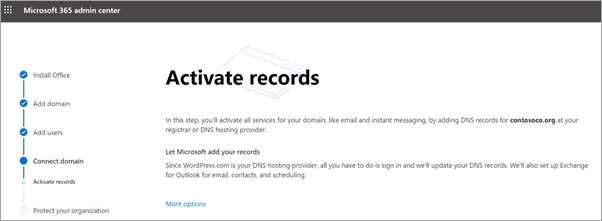

# Configurare i Microsoft 365 Business Premium nella configurazione guidata

## Watch: Overview of Microsoft 365 setup

Guarda questo video per una panoramica dell'Microsoft 365 Business Premium configurazione.  

> [!VIDEO https://www.microsoft.com/videoplayer/embed/RE4jZwg] 

## Aggiungere il dominio, gli utenti e configurare i criteri

Quando acquisti Microsoft 365 Business Premium, hai la possibilità di usare un dominio di tua proprietà o acquistarne uno durante [l'iscrizione.](sign-up.md)

- Se è stato acquistato un nuovo dominio al momento dell’iscrizione, il dominio è già configurato ed è possibile [Aggiungere utenti e assegnare le licenze](#add-users-and-assign-licenses).

### Aggiungere il proprio dominio per personalizzare l’accesso

1. Autenticarsi allì[interfaccia di amministrazione di Microsoft 365](https://admin.microsoft.com) usando le proprie credenziali globali di amministrazione. 

2. Scegliere **Vai alla configurazione** per avviare la procedura guidata.

    

3. Nella pagina **Installa le tue app di Office**, è possibile installare le app sul proprio computer.
    
4. Nel passaggio **Aggiungi dominio** immettere il nome del dominio che si vuole usare (ad esempio contoso.com).

    > [!IMPORTANT]
    > Se un dominio è stato acquistato durante l'iscrizione, il passaggio **Aggiungi un dominio** non comparirà. In alternativa, andare a [Aggiungi utenti](#add-users-and-assign-licenses).

    

    
4. Seguire i passaggi della procedura guidata per creare record DNS presso qualsiasi provider di [hosting DNS per](/office365/admin/get-help-with-domains/create-dns-records-at-any-dns-hosting-provider) Microsoft 365 che verifica di essere proprietari del dominio. Se si conosce l'host di dominio, vedere anche [Aggiungere un dominio a Microsoft 365](/microsoft-365/admin/setup/add-domain).

    Se il proprio provider di hosting è GoDaddy o un altro host abilitato con [Domain Connect](/office365/admin/get-help-with-domains/domain-connect), il processo è semplice e viene richiesto di eseguire l’accesso e lasciare che Microsoft Authenticate completi l’autenticazione.

    

### Aggiungere utenti e assegnare licenze

Gli utenti possono essere aggiunti nella procedura guidata, ma è anche possibile [aggiungere utenti in seguito](../admin/add-users/add-users.md) nell’interfaccia di amministrazione. Inoltre, se si dispone di un controller di dominio, è possibile aggiungere utenti con [Azure AD Connect](/azure/active-directory/hybrid/how-to-connect-install-express).

#### Aggiungere utenti nella procedura guidata

A tutti gli utenti aggiunti nella procedura guidata viene assegnata automaticamente una Microsoft 365 Business Premium licenza.

1. Se la sottoscrizione Microsoft 365 Business Premium ha utenti esistenti (ad esempio, se hai usato Azure AD Connessione), ottieni un'opzione per assegnare le licenze a loro ora. Procedere aggiungendo le licenze anche per questi utenti.

2. Dopo aver aggiunto gli utenti, sarà disponibile anche un'opzione per la condivisione delle credenziali con i nuovi utenti aggiunti. È possibile scegliere se stamparle, inviarle tramite posta elettronica o scaricarle.

### Connettere il proprio dominio

> [!NOTE]
> Se si è scelto di usare il dominio .onmicrosoft o se si usa Azure AD Connect per configurare gli utenti, questo passaggio non sarà visibile.
  
Per configurare i servizi, occorre aggiornare alcuni record presso l'host DNS o il registrar.
  
1. La configurazione guidata rileva in genere il registrar e offre un collegamento a istruzioni dettagliate per l'aggiornamento dei record NS presso il suo sito Web. In caso contrario, modificare i server dei nomi per [configurare Microsoft 365 con qualsiasi registrar .](../admin/get-help-with-domains/change-nameservers-at-any-domain-registrar.md) 

    - Se si dispone di record DNS esistenti, ad esempio un sito Web, ma il proprio host DNS è abilitato per [Domain Connect](/office365/admin/get-help-with-domains/domain-connect), scegliere **Aggiungi record per me**. Nella pagina **Scegli i tuoi servizi online**, accettare tutti i predefiniti, scegliere **Successivo**, e scegliere **Autorizza** nella pagina del proprio host DNS.
    - Se si dispone di record DNS esistenti con altri host DNS (non abilitati per il protocollo Domain Connect), è possibile gestire i propri record DNS per assicurarsi che i servizi esistenti restino connessi. Vedere [dati principali domini](/office365/admin/get-help-with-domains/dns-basics) per altre informazioni.

        

2. Seguire i passaggi della procedura guidata, la posta elettronica e gli altri servizi saranno configurati automaticamente.

### Proteggere l'organizzazione 

I criteri impostati nella procedura guidata vengono applicati automaticamente a un [gruppo di sicurezza](/office365/admin/create-groups/compare-groups#security-groups) denominato Tutti gli *utenti.* È inoltre possibile creare gruppi aggiuntivi a cui assegnare criteri nell'interfaccia di amministrazione.

1. In Aumentare la protezione dalle minacce **informatiche** avanzate è consigliabile accettare le impostazioni predefinite per consentire a [Office 365 Advance Threat Protection](../security/office-365-security/defender-for-office-365.md) di analizzare file e collegamenti nelle app Office avanzate.

    

2. Nella pagina **Impedisci** perdite di dati sensibili accettare le impostazioni predefinite per attivare Office 365 Data Loss Prevention (DLP) per tenere traccia dei dati sensibili nelle app di Office e impedire la condivisione accidentale di questi dati all'esterno dell'organizzazione.

3. Nella pagina **Proteggi i dati in Office** per dispositivi mobili, lascia la gestione delle app per dispositivi mobili, espandi le impostazioni e rivedile e quindi seleziona Crea criteri di gestione delle app per dispositivi **mobili.**

    

## Proteggere i PC con Windows 10

Nel riquadro di spostamento sinistro selezionare **Installazione** e quindi, **in** Accesso e sicurezza, scegliere Proteggi i Windows 10 **computer.** Scegliere **Visualizza** per iniziare. Per [istruzioni complete, vedere proteggere Windows 10 computer.](secure-win-10-pcs.md)

## Distribuire Office 365 client

Se hai scelto di installare automaticamente le app Office durante la configurazione, le app verranno installate nei dispositivi Windows 10 dopo che gli utenti hanno eseguito l'accesso ad Azure AD dai dispositivi Windows, usando le credenziali di lavoro.

Per installare Office dispositivi mobili iOS o Android, vedi [Configurare i dispositivi mobili per Microsoft 365 Business Premium utenti.](set-up-mobile-devices.md)

È inoltre possibile installare Office singolarmente. Vedi [installare Office su un PC o mac per](https://support.microsoft.com/office/4414eaaf-0478-48be-9c42-23adc4716658) istruzioni.

## Contenuto correlato

[Video di formazione su Microsoft 365 per le aziende](../business-video/index.yml) (pagina collegamento)
