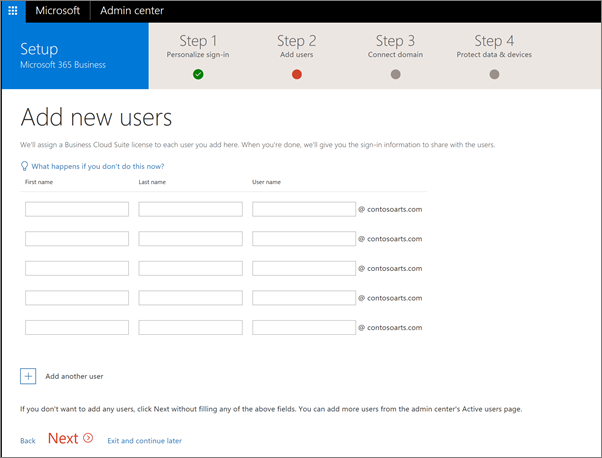
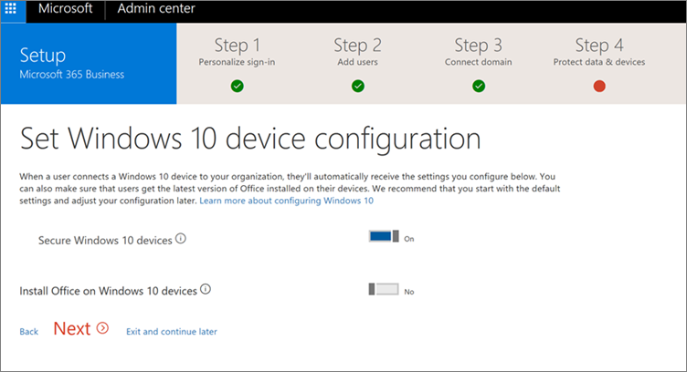

# Configurare Microsoft 365 Business tramite la configurazione guidata

Completare i passaggi 1-4 riportati di seguito.
  
### Configurare Microsoft 365 Business

Guardare un video su come configurare Microsoft 365 business quando non si dispone di un Active Directory locale:
  
> [!VIDEO https://www.microsoft.com/videoplayer/embed/0705c337-f3e8-4d28-bb6c-530cd28e99f2?autoplay=false]
  
I passaggi di configurazione includono informazioni per le configurazioni che includono Active Directory locale. Se si desidera continuare ad accedere ai dispositivi appartenenti al dominio, leggere gli articoli seguenti per due diverse modalità di abilitazione e completare la procedura prima di eseguire l'installazione guidata:
  
- [Abilitare i dispositivi Windows 10 associati a un dominio per essere gestiti da Microsoft 365 business](manage-windows-devices.md)
    
    -Questo è il modo consigliato.
    
- [Accedere alle risorse locali da un dispositivo di Azure AD-join in Microsoft 365 business](access-resources.md)
    
### Passaggio 1: personalizzare l'accesso

1. Accedere a [Microsoft 365 Business](https://portal.microsoft.com) usando le credenziali di amministratore globale. Selezionare il riquadro **Amministratore** per passare all'interfaccia di amministrazione. 
    
2. Nell'interfaccia di amministrazione scegliere **Avvia configurazione** (a seconda dello stato potrebbe invece essere visualizzato **Continua configurazione**) per avviare la procedura guidata. 
    
3. Immettere il nome del dominio che si vuole usare, ad esempio contoso.com.
    
    Immettere il dominio anche se è già stato verificato durante l'uso di Azure AD Connect, ad esempio. I due passaggi seguenti non si applicano all'utente se si utilizza Azure AD Connect per verificare il dominio.
    
4. Seguire i passaggi della procedura guidata per [creare record DNS presso un provider di hosting DNS per Office 365](https://support.office.com/article/7b7b075d-79f9-4e37-8a9e-fb60c1d95166) che verifica che si è proprietari del dominio. 
    
    È possibile visualizzare un video di esempio del [video: configurare Office 365 nella nuova](https://support.office.com/article/a8c2002a-34bc-4ab3-93d8-9b5156c48bf8)interfaccia di amministrazione. Questo video non include i passaggi per la protezione dei dati di Microsoft 365 Business.
    
    
  
### Passaggio 2: aggiungere utenti e assegnare licenze

1. È possibile aggiungere utenti qui oppure [aggiungere gli utenti in un secondo momento](add-users-m365b.md) nell'interfaccia di amministrazione. 
    
    A qualsiasi utente aggiunto viene automaticamente assegnata una licenza di Microsoft 365 Business.
    
2. Se l'abbonamento a Microsoft 365 Business include già degli utenti (ad esempio se si è usato Azure AD Connect), sarà disponibile un'opzione per l'assegnazione di licenze a questi utenti. Procedere con l'aggiunta di licenze anche per questi utenti.
    
3. Sarà disponibile anche un'opzione per la condivisione delle credenziali con i nuovi utenti aggiunti. È possibile scegliere se stamparle, inviarle tramite posta elettronica o scaricarle.
    
4. Ignorare il passaggio relativo alla migrazione dei messaggi di posta elettronica e scegliere **Avanti** nella pagina **Esegui la migrazione dei messaggi di posta elettronica**. 
    
    Se si sta passando da un altro provider di posta elettronica e si desidera copiare i dati in un secondo momento, è possibile [eseguire la migrazione di posta elettronica e contatti a Office 365](https://support.office.com/article/a3e3bddb-582e-4133-8670-e61b9f58627e).
    
    
  
### Passaggio 3: connettere il dominio

> [!NOTE]
> Se si è scelto di utilizzare il dominio. onmicrosoft o Azure AD Connect, questo passaggio non verrà visualizzato. 
  
Per configurare i servizi, occorre aggiornare alcuni record presso l'host DNS o il registrar.
  
1. La configurazione guidata rileva in genere il registrar e offre un collegamento a istruzioni dettagliate per l'aggiornamento dei record NS presso il suo sito Web. In caso contrario, [modificare i server dei nomi per configurare Office 365 con qualsiasi registrar](https://support.office.com/article/a8b487a9-2a45-4581-9dc4-5d28a47010a2).
    
2. La posta elettronica e altri servizi verranno configurati automaticamente.
    
### Passaggio 4: gestire i dispositivi e i file di lavoro

1. Nella pagina **Proteggi i file di lavoro nei dispositivi mobili** **attivare** sia **Proteggi i file di lavoro in caso di furto o smarrimento dei dispositivi** che **Gestisci la modalità di accesso ai file di Office nei dispositivi mobili**. È inoltre possibile accedere a ogni impostazione secondaria facendo clic sulle virgolette acute accanto a ogni impostazione.
  
  Tutti i file di lavoro degli utenti con licenza sono ora protetti nei dispositivi iOS e Android, non appena installano le [app di Office](set-up-mobile-devices.md) (ed eseguono l'autenticazione con le credenziali aziendali di Microsoft 365). 
  
  
  
2. Nella pagina **Imposta configurazione dispositivo Windows 10** , impostare **Secure Windows 10 Devices** setting **su on**.
  
   È inoltre possibile accedere a ogni impostazione secondaria facendo clic sul simbolo chevron accanto a esso.
  
3. Impostare l'opzione **Installa Office nei dispositivi Windows 10** su **Sì** se tutti gli utenti hanno computer Windows 10 e nessuna installazione di Office esistente oppure installazioni di Office A portata di clic. In caso contrario, impostare questa opzione su **No**. È possibile [installare Office automaticamente](auto-install-or-uninstall-office.md) in un secondo momento dall'interfaccia di amministrazione dopo aver preparato i computer degli utenti. Per istruzioni, vedere [Prepare for Office Client Installation](prepare-for-office-client-deployment.md).
  
    I file di lavoro degli utenti con licenza nei dispositivi Windows 10 verranno proiettati non appena entreranno a [far parte del dispositivo Windows 10](set-up-windows-devices.md) a un dominio di Microsoft 365 business Azure ad o [installeranno Windows 10 in un nuovo computer](https://support.office.com/article/c654bd23-d256-4ac7-8fba-0c993bf5a771.aspx) e contemporaneamente entreranno a far parte di Microsoft 365. Dominio di Azure AD aziendale. 
  
4. Fare clic su **Avanti** per completare la configurazione. 
  
    Inviare infine il proprio feedback per aiutarci a migliorare l'esperienza utente.
  
    
  
## Impostazioni di sicurezza aggiuntive

Oltre all'impostazione sicurezza e conformità nell'installazione guidata, è anche possibile configurare le seguenti impostazioni aggiuntive:
  
- Impostare la protezione contro gli allegati non sicuri. **Protezione avanzata dalle minacce** (ATP) identifica i contenuti dannosi e quindi blocca il recapito degli allegati non sicuri, contribuendo a proteggersi dagli schemi di phishing e dalle infezioni ransomware. Per attivare la protezione degli allegati, vedere [set up Office 365 ATP SAFE Attachment Policies](https://support.office.com/article/078eb946-819a-4e13-8673-fe0c0ad3a775#setpolicy).
    
- Proteggere l'ambiente quando gli utenti fanno clic su collegamenti dannosi. ATP esamina i collegamenti nella posta elettronica al momento in cui un utente fa clic su di essi. Se un collegamento non è sicuro, l'utente viene avvisato di non visitare il sito o ha informato che il sito è stato bloccato. Ciò consente di proteggere gli schemi di phishing. [Configurare i criteri dei collegamenti sicuri ATP di office 365](https://support.office.com/article/bdd5372d-775e-4442-9c1b-609627b94b5d#reveddefaultscc) o [configurare i criteri dei collegamenti sicuri atp di Office 365](https://support.office.com/article/bdd5372d-775e-4442-9c1b-609627b94b5d#addemailpolscc).
    
- È possibile mantenere tutti i contenuti delle cassette postali, compresi gli elementi eliminati, inserendo l'intera cassetta postale di un utente sul **blocco per controversia legale**. Per istruzioni, vedere 
- [Configurare la conservazione della posta elettronica con Exchange Online Archiving](security-features.md#set-up-email-retention-with-exchange-online-archiving).
    
- Impostare criteri di **conservazione**personalizzati, ad esempio per mantenere un determinato intervallo di tempo o eliminare il contenuto in modo permanente alla fine del periodo di conservazione. È possibile abilitare i criteri di conservazione personalizzati nel centro titoli e conformità, passare a \> **conservazione**della **governance dei dati** e quindi seguire i passaggi della procedura guidata. Per ulteriori informazioni, vedere [Overview of](https://support.office.com/article/5e377752-700d-4870-9b6d-12bfc12d2423)Retention Policies.
    
## Passaggi successivi

Per gli utenti che hanno le proprie licenze, il passaggio successivo consiste nel configurare i dispositivi.  Vedere [Configurare i dispositivi Windows per utenti di Microsoft 365 Business](set-up-windows-devices.md) e [Configurare i dispositivi mobili per utenti di Microsoft 365 Business](set-up-mobile-devices.md).  Vedere [Gestire Microsoft 365 Business](manage.md) per i collegamenti agli argomenti su come impostare i criteri di protezione di dispositivi e app e su come rimuovere i dati dai dispositivi degli utenti. 
  

