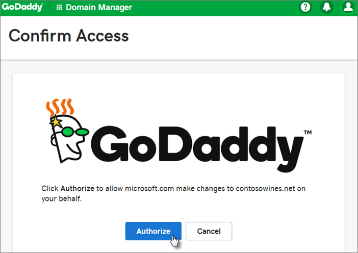
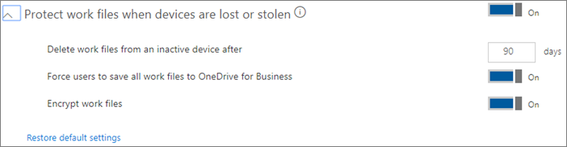

# Configurare Microsoft 365 Business

Prima di iniziare, vedere [Get Microsoft 365 business](get-microsoft-365-business.md) for sign-up details.

Guardare un [breve video su come configurare Microsoft 365 business](https://support.office.com/article/38003e30-9d10-44cf-b596-f1b5f662bfa1) tramite la configurazione guidata e quando non si dispone di un Active Directory locale
  

## Panoramica

La maggior parte dei passaggi di configurazione può essere effettuata nell'installazione guidata, ma anche le altre opzioni sono elencate.

1. [Aggiungere il dominio](#add-your-domain-to-personalize-sign-in) Se il dominio è stato acquistato durante l' [iscrizione](sign-up.md), questo passaggio è già stato fatto.
2. Aggiungere utenti. È possibile eseguire questa operazione in uno dei tre modi seguenti:
    - Nell' [installazione guidata](#add-users-in-the-wizard).
    - Utilizzare la sincronizzazione della directory per [aggiungere utenti utilizzando Azure ad Connect](#add-users-by-using-azure-ad-connect) se si dispone di Active Directory locale.
    - È inoltre possibile [aggiungere gli utenti in un secondo momento](add-users-m365b.md) nell'interfaccia di amministrazione.
3. Impostare i criteri di sicurezza e configurare i dispositivi. È possibile eseguire questa operazione in uno dei tre modi seguenti:
    - Nell' [installazione guidata](#set-up-policies-in-the-wizard).  
    - Nell'interfaccia di [Amministrazione](#modify-or-add-policies-in-the-admin-center).
    - Nell'interfaccia di [amministrazione di Intune](https://docs.microsoft.com/intune/what-is-device-management).
4. Configurare e gestire i dispositivi Windows 10.

    Quando si aggiunge un dispositivo WIndows 10 ad Azure AD, tutti i criteri vengono applicati a esso.
    - Configurare le configurazioni dei dispositivi Windows 10 nell' [installazione guidata](#set-up-policies-in-the-wizard).
    - Aggiungere un [nuovo dispositivo Windows 10](set-up-windows-devices.md#for-a-brand-new-or-newly-upgraded-windows-10-pro-device) AD Azure ad.
    - Aggiungere un [dispositivo Windows 10 esistente](set-up-windows-devices.md#for-a-device-already-set-up-and-running-windows-10-pro) AD Azure ad.
1. Installare Office 365 business.
    - È possibile installare automaticamente Office nei dispositivi Windows utilizzando l' [installazione guidata](#set-up-policies-in-the-wizard).
    - [Installare automaticamente Office](auto-install-or-uninstall-office.md) dall'interfaccia di amministrazione.
    - Consente agli utenti di [installare le app di Office](https://docs.microsoft.com/office365/admin/setup/install-applications) per Windows e i dispositivi.
     
1. Configurare una sicurezza aggiuntiva.
    - L'installazione guidata aggiunge criteri per proteggere i dispositivi, ma è anche possibile avvalersi delle funzionalità di [sicurezza aggiuntive](#additional-security-settings) per garantire la protezione dei dati, degli account e dei messaggi di posta elettronica. 

## Aggiungere il dominio, gli utenti e i criteri di configurazione

Quando si acquista Microsoft 365 business, si ha la possibilità di utilizzare un dominio che si è proprietari o di acquistarne uno durante l' [iscrizione](sign-up.md).

- Se si è acquistato un nuovo dominio al momento dell'iscrizione, il dominio è tutto configurato ed è possibile spostarsi per [aggiungere utenti e assegnare licenze](#add-users-and-assign-licenses).

### Aggiungere il dominio per personalizzare l'accesso

1. Accedere all'interfaccia di [amministrazione di Microsoft 365](https://admin.microsoft.com) utilizzando le credenziali di amministratore globale. 

2. Fare clic su **Aggiungi un dominio** per avviare la procedura guidata.

    
    
3. Nella procedura guidata, immettere il nome di dominio che si desidera utilizzare (come contoso.com).

    

    
4. Seguire i passaggi della procedura guidata per [creare record DNS presso un provider di hosting DNS per Office 365](https://docs.microsoft.com/office365/admin/get-help-with-domains/create-dns-records-at-any-dns-hosting-provider) che verifica che si è proprietari del dominio. Se si conosce l'host di dominio, vedere anche le [istruzioni specifiche dell'host](https://docs.microsoft.com/office365/admin/get-help-with-domains/set-up-your-domain-host-specific-instructions).

    Se il provider di hosting è GoDaddy, il processo è semplice e verrà automaticamente chiesto di accedere e di consentire a Microsoft di eseguire l'autenticazione per conto di:

    

### Aggiungere utenti e assegnare licenze

È possibile aggiungere utenti nella procedura guidata, ma è anche possibile aggiungerli in un [secondo momento](add-users-m365b.md) nell'interfaccia di amministrazione. Inoltre, se si dispone di un controller di dominio locale, è possibile aggiungere utenti con [Azure ad Connect](https://docs.microsoft.com/azure/active-directory/hybrid/how-to-connect-install-express).

#### Aggiungere gli utenti nella procedura guidata

Tutti gli utenti aggiunti nella procedura guidata vengono assegnati automaticamente a una licenza aziendale Microsoft 365.
Se si dispone di un controller di dominio locale e si utilizza Active Directory, vedere [How to ddd Users by using Azure ad Connect](#add-users-by-using-azure-ad-connect).

1. Se l'abbonamento a Microsoft 365 Business include già degli utenti (ad esempio se si è usato Azure AD Connect), sarà disponibile un'opzione per l'assegnazione di licenze a questi utenti. Procedere con l'aggiunta di licenze anche per questi utenti.

3. Dopo aver aggiunto gli utenti, si otterrà anche un'opzione per condividere le credenziali con i nuovi utenti aggiunti. È possibile scegliere se stamparle, inviarle tramite posta elettronica o scaricarle.

4. Ignorare il passaggio relativo alla migrazione dei messaggi di posta elettronica e scegliere **Avanti** nella pagina **Esegui la migrazione dei messaggi di posta elettronica**. 

    Se si sta passando da un altro provider di posta elettronica e si desidera copiare i dati in un secondo momento, è possibile [eseguire la migrazione di posta elettronica e contatti a Office 365](https://support.office.com/article/a3e3bddb-582e-4133-8670-e61b9f58627e).

#### Aggiungere utenti tramite Azure AD Connect

 Se si dispone di un controller di dominio locale con Active Directory, è possibile sincronizzare gli utenti con Microsoft 365 business tramite [Azure ad Connect](https://docs.microsoft.com/azure/active-directory/hybrid/how-to-connect-install-express). Completare questa procedura prima di avviare l'installazione guidata. È possibile scaricarlo nell'interfaccia di amministrazione:

- Passare a **** \> utenti **attivi**, selezionare i puntini di controllo nella parte superiore della pagina e quindi selezionare **sincronizzazione directory** per scaricare Azure ad Connect.

    

    > [!IMPORTANT]
    > Se si creano gli utenti in questo modo, sarà comunque necessario assegnare loro le licenze nell'interfaccia di amministrazione.

##### Continuare a accedere alle app e ai dispositivi associati a un dominio

Se si desidera continuare ad accedere alle app e ai dispositivi associati a un dominio, leggere gli articoli seguenti per due diversi modi per abilitare:
  
- [Abilitare i dispositivi Windows 10 associati a un dominio per essere gestiti da Microsoft 365 business](manage-windows-devices.md)
    - Questo è il modo consigliato.

- [Accedere alle risorse locali da un dispositivo di Azure AD-join in Microsoft 365 business](access-resources.md)

### Connettere il dominio

> [!NOTE]
> Se si è scelto di utilizzare il dominio. onmicrosoft o di Azure AD Connect per configurare gli utenti, questo passaggio non verrà visualizzato.
  
Per configurare i servizi, occorre aggiornare alcuni record presso l'host DNS o il registrar.
  
1. La configurazione guidata rileva in genere il registrar e offre un collegamento a istruzioni dettagliate per l'aggiornamento dei record NS presso il suo sito Web. In caso contrario, [modificare i server dei nomi per configurare Office 365 con qualsiasi registrar](https://support.office.com/article/a8b487a9-2a45-4581-9dc4-5d28a47010a2). 

    - Se si dispone di record DNS esistenti, ad esempio un sito Web esistente, sarà necessario gestire i propri record DNS per assicurarsi che i servizi esistenti siano connessi. Per altre informazioni, vedere [Domain nozioni di base](https://docs.microsoft.com/office365/admin/get-help-with-domains/dns-basics) .

        

2. Seguire i passaggi della procedura guidata e la posta elettronica e altri servizi verranno configurati per l'utente.

### Impostare i criteri di sicurezza e le configurazioni dei dispositivi 

Questi criteri si applicano a tutti gli utenti a cui si assegna una licenza o a un gruppo di utenti, se si decide di assegnare criteri diversi a un set di utenti.

#### Impostare i criteri nella procedura guidata

I criteri configurati nella procedura guidata vengono applicati automaticamente a un [gruppo di sicurezza](https://docs.microsoft.com/office365/admin/create-groups/compare-groups#security-groups) denominato *tutti gli utenti*.

1. Nella pagina **Proteggi i file di lavoro nei dispositivi mobili** , l'opzione Proteggi i **file di lavoro quando i dispositivi vengono persi o rubati** è selezionata per impostazione predefinita. È possibile abilitare la gestione del modo in cui **gli utenti accedono ai file di Office nei dispositivi mobili**e questo è consigliato.

    

     - Se si espande la **protezione dei file di lavoro quando i dispositivi vengono persi o rubati**, i [valori predefiniti](protect-work-files-on-lost-or-stolen-device.md) sono preselezionati:

        

    - Se si seleziona **Gestisci la modalità di accesso degli utenti ai file di Office nei dispositivi mobili** ed è possibile espanderla, verranno visualizzati i [valori predefiniti](manage-user-access-on-mobile-devices.md) . È consigliabile accettare i valori predefiniti durante l'installazione per creare criteri di applicazione per Android, iOS e Windows 10 applicabili a tutti gli utenti. È possibile creare altri criteri al termine dell'installazione.

        

2. L'ultimo passaggio su Protect data and Devices consente di configurare i criteri per proteggere i dispositivi Windows 10. Queste impostazioni vengono applicate automaticamente quando un utente di Windows 10 si connette all'organizzazione. È possibile espandere i **dispositivi Windows 10 sicuri** per visualizzare e modificare i [valori predefiniti](secure-windows-10-devices.md).
3. È inoltre possibile scegliere di [installare automaticamente Office](install-office-on-windows-10-during-setup.md) nei dispositivi Windows 10.

    

#### Modificare o aggiungere criteri nell'interfaccia di amministrazione

Vedere [gestire Microsoft 365 business](manage.md) per i collegamenti agli argomenti su come visualizzare e modificare i criteri di protezione di dispositivi e app e su come rimuovere i dati da o reimpostare i dispositivi utente.

## Distribuire e gestire Windows 10
Vedere [configurare i dispositivi Windows per gli utenti di Microsoft 365 business](set-up-windows-devices.md) per connettersi manualmente AD Azure ad, durante l'installazione dei nuovi computer o modificando il profilo di accesso per i computer esistenti. 

### Utilizzare Autopilot per configurare nuovi dispositivi

È possibile usare [Windows Autopilot](add-autopilot-devices-and-profile.md) per preconfigurare automaticamente i **nuovi** dispositivi Windows 10 per un utente, ma potrebbe essere più facile ottenere un [partner](https://www.microsoft.com/solution-providers/search) che può eseguire questa operazione. È inoltre possibile accedere a [Microsoft Store](https://go.microsoft.com/fwlink/?linkid=874598) e chiedere a un esperto di tecnologia cloud di configurare nuovi dispositivi acquistati per l'utente.

### Accedere alle risorse locali

Se l'organizzazione utilizza Windows Server Active Directory in locale, è possibile configurare Microsoft 365 business per proteggere i dispositivi Windows 10, mantenendo comunque l'accesso alle risorse locali che richiedono l'autenticazione locale. Seguire la procedura descritta in [Enable domain-joined Windows 10 devices to be managed by Microsoft 365 business](manage-windows-devices.md) to set this up. Questo è il metodo preferito e i dispositivi in questo stato sono denominati dispositivi ibridi di Azure AD Uniti.

Se l'azienda dispone di un Active Directory locale che contiene alcune risorse locali, ad esempio condivisioni di file e stampanti, è possibile consentire ai dispositivi di Azure AD-join di accedere a tali risorse attenendosi alla procedura seguente: [accesso alle risorse locali da un Dispositivo di Azure AD-joined in Microsoft 365 business](access-resources.md).

## Distribuire le app client di Office 365

Se si è scelto di installare automaticamente le app di Office durante la configurazione, le app verranno installate nei dispositivi Windows 10 dopo che gli utenti hanno effettuato l'accesso a Azure AD dai propri dispositivi Windows con le credenziali di lavoro.
Per installare Office su dispositivi mobili iOS o Android, vedere [configurare i dispositivi mobili per gli utenti aziendali di Microsoft 365](set-up-mobile-devices.md).

È anche possibile installare Office individualmente. Per istruzioni, vedere [installare Office in un PC o Mac](https://support.office.com/article/4414eaaf-0478-48be-9c42-23adc471665) .

## Impostazioni di sicurezza aggiuntive

Oltre all'impostazione sicurezza e conformità nell'installazione guidata, è anche possibile configurare le seguenti impostazioni aggiuntive:
  
- **Protezione antimalware per la posta elettronica**
- **Allegati sicuri di Advanced Threat Protection (ATP)**
- **Collegamenti sicuri di ATP**
- **Anti-phishing APT**
- **Archiviazione Exchange Online**
- **Prevenzione della perdita di dati (DLP)**
- **Protezione delle informazioni di Azure** (Piano 1)
- **Disponibilità del portale di Intune**

Per iniziare, vedere, [impostare i criteri di sicurezza avanzati](set-up-advanced-security.md).

Vedere anche [i primi 10 modi per proteggere l'azienda Microsoft 365](https://docs.microsoft.com/office365/admin/security-and-compliance/secure-your-business-data) per una roadmap delle migliori procedure di sicurezza.