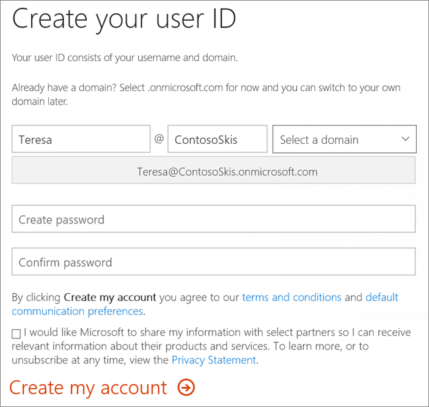

# Iscriversi a Microsoft 365 businessSign up for Microsoft 365 Business

Se si è un partner, vedere [Get microsoft 365 business da Microsoft Partner Center](get-microsoft-365-business.md#get-microsoft-365-business-from-microsoft-partner-center).If you are a partner, see [Get Microsoft 365 Business from Microsoft Partner Center](get-microsoft-365-business.md#get-microsoft-365-business-from-microsoft-partner-center).

Per acquistare Microsoft 365 business online, visitare il [microsoft 365 Business Advantage](https://www.microsoft.com/microsoft-365/business#pmg-cmp-desktop) e scegliere **Buy Now** under Microsoft 365 business.To purchase Microsoft 365 Business online, go to [Discover Microsoft 365 Business advantage](https://www.microsoft.com/microsoft-365/business#pmg-cmp-desktop) and choose **Buy Now** under Microsoft 365 Business.

È inoltre possibile accedere a un [Microsoft Store](https://www.microsoft.com/en-us/store/locations/find-a-store?icid=en-us_UF_FAS) per acquistare Microsoft 365 business e ottenere assistenza per la configurazione.You can also head over to a [Microsoft Store](https://www.microsoft.com/en-us/store/locations/find-a-store?icid=en-us_UF_FAS) to both buy Microsoft 365 Business and get set-up help.

## Completare i passaggi di iscrizioneComplete the sign-up steps

Dopo aver acquistato Microsoft 365 business, eseguire la procedura seguente.After you have purchased Microsoft 365 Business, complete the following steps.

1. Nella pagina **iniziale, Let ' s Get to know you** page immettere le informazioni richieste.On the **Welcome, let's get to know you** page enter the required information. Tenere presente che:Note that:
 
    -  **Paese o aree geografiche:** Ciò determina il servizio che si riceve e non può essere modificato in un secondo momento.**Country or regions:** This determines the service you receive and can't be changed later.
    - **Indirizzo di posta elettronica aziendale:** Immettere l'indirizzo di posta elettronica corrente.**Business email address:** Enter your current email address. Microsoft utilizza questo indirizzo per corrispondere con l'utente sull'abbonamento a Microsoft 365.Microsoft uses this address to correspond with you about your Microsoft 365 subscription.
    - **Nome della società** Verrà visualizzato il nome della società nell'interfaccia di amministrazione; Questo è il percorso in cui verranno gestiti gli utenti di Microsoft 365, le licenze e così via.**Company name** We'll display your company name in the admin center; this is where you'll manage Microsoft 365 users, licenses, and so on. Verrà inclusa anche in tutti gli URL del sito di SharePoint.We'll also include it in any SharePoint site URLs.

2. Nella pagina **Crea ID utente** :On the **Create your user ID** page:

    - Nome **utente**: immettere il nome (denominato alias) che verrà utilizzato per la propria posta elettronica aziendale.**Username**: Enter the name (called an alias) that you'll use for your own business email. Ad esempio, Robert Young potrebbe utilizzare RobY o RobYoung come alias di lavoro.For example, Robert Young might use RobY or RobYoung as a work alias.
    - **Azienda**: immettere il proprio nome aziendale univoco.**Your company**: Enter your unique business name. Questo è il nome che il sito Web aziendale utilizza se ne esiste uno ed è anche il nome che si desidera includere dopo il segno @ quando si riceve un messaggio di posta elettronica aziendale.This is the name that your business web site uses if you have one, and is also the name you want to include after the @ sign when you receive a business email. Questo nome è denominato dominio.This name is called a domain. Ad esempio, se l'azienda è denominata sci contoso, immettere ContosoSkis dopo il simbolo @.For example, if your business is called Contoso Skis, enter ContosoSkis after the @ sign.
    - **Selezionare un dominio**: se si è già proprietari del nome di dominio, selezionare. onmicrosoft.com dal menu a discesa e verrà chiesto di configurarlo in un secondo momento.**Select a domain**: If you own your domain name already, select .onmicrosoft.com from the drop down menu and we'll ask you to set it up later. In caso contrario, è facile acquistare un nome di dominio che rappresenti la tua azienda.Otherwise, it's easy to buy a domain name that represents your business. A tale scopo, selezionare il dominio che si preferisce dal menu a discesa.To do that, select the domain you prefer from the drop down menu. Ad esempio, l'indirizzo di posta elettronica completo potrebbe essere *Teresa@ContosoSkis.net*.For example, your full email address might be *Teresa@ContosoSkis.net*. Se il nome di dominio è disponibile, è possibile saperlo subito.We'll let you know right away if the domain name is available. In tal caso, verrà aggiunto il costo del dominio al costo dell'abbonamento a Microsoft 365 business.If it is, we'll add the cost of your domain to the cost of your Microsoft 365 Business subscription. Anche il nuovo dominio sarà configurato e pronto per l'uso in Microsoft 365 se lo si acquista qui.The new domain will also be set up and ready for use in Microsoft 365 if you purchase it here. Per informazioni sui domini, vedere [domande frequenti sui domini](https://docs.microsoft.com/office365/admin/setup/domains-faq).For information about domains, see [Domains FAQ](https://docs.microsoft.com/office365/admin/setup/domains-faq).
    
        

3. Compilare il resto dei campi e selezionare **Crea account personale**.Fill in the rest of the fields and select **Create my account**.
4. Sul **provare. You ' re. Non. A. robot.**On the **Prove.You're.Not.A.Robot.** pagina immettere un numero di telefono per ricevere un codice tramite testo o una chiamata e selezionare **Text me** or **Call me**, quindi immettere il codice \> di verifica **successivo**.page enter a phone number to receive a code either via text or a call and select **Text me** or **Call me**, then enter the verification code \> **Next**.
5. Nel percorso in **cui si utilizzerà questa** pagina, immettere l'indirizzo aziendale.On the **Where will you be using this** page enter your business address. Queste informazioni determinano quali imposte si pagano e quali abbonamenti sono disponibili.This information determines what taxes you pay and which subscriptions are are available. Per ulteriori informazioni sulle imposte, vedere [quali imposte vengono addebitate?](https://docs.microsoft.com/office365/admin/subscriptions-and-billing/what-tax-will-i-be-charged?view=o365-worldwide)For more information about taxes, see [What tax will I be charged?](https://docs.microsoft.com/office365/admin/subscriptions-and-billing/what-tax-will-i-be-charged?view=o365-worldwide) 
1. Selezionare **Avanti**, rivedere l'ordine e selezionare di nuovo **Avanti** .Select **Next**, review your order and select **Next** again.
1. Nella pagina **come si desidera pagare** , immettere i dettagli del pagamento e quindi **effettuare l'ordine**.On the **How do you want to pay** page, enter your payment details, and then **Place order**.
    È quindi possibile passare all'interfaccia di [Amministrazione](https://docs.microsoft.com/en-us/office365/admin/subscriptions-and-billing/what-tax-will-i-be-charged?view=o365-worldwide) per completare la [configurazione](set-up.md).You can then go to the [admin center](https://docs.microsoft.com/en-us/office365/admin/subscriptions-and-billing/what-tax-will-i-be-charged?view=o365-worldwide) to finish your [set up](set-up.md).

    > [!NOTE]
    > Se, al termine del programma di installazione, si seleziona il collegamento **Vai all'interfaccia di amministrazione**, l'utente verrà portato direttamente all'  esperienza di configurazione.If, at the end of the setup you select the link **Go to the admin center**, you will be taken directly to the [set up](set-up.md) experience.