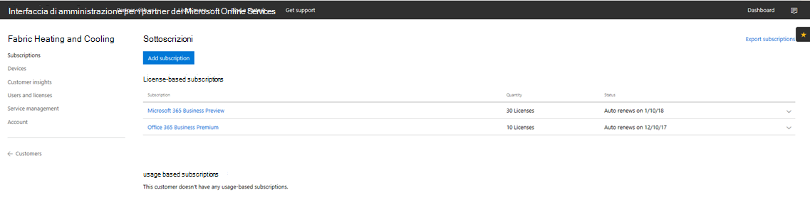
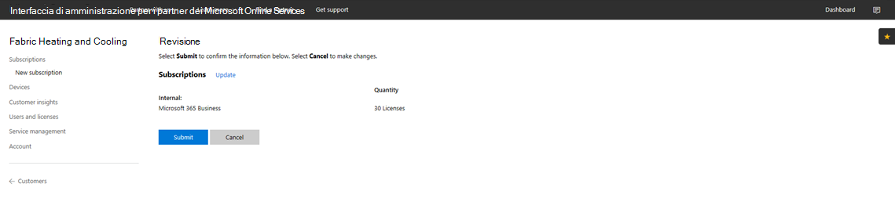
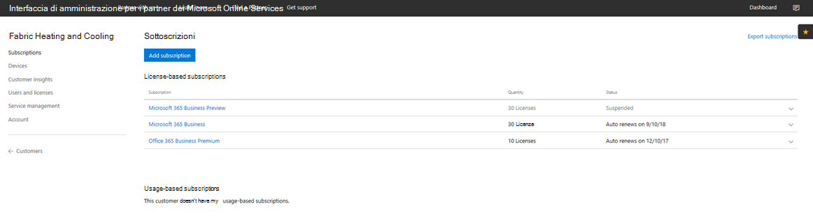
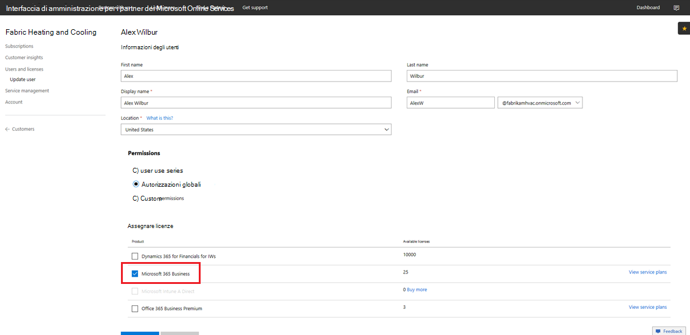

# Transizione di un abbonamento Microsoft 365 Business CSP

Se hai un abbonamento Microsoft 365 Business Preview CSP, segui questa guida per scoprire come eseguire la transizione dal tuo abbonamento in anteprima a Microsoft 365 Business GA (disponibilità generale).

**Come eseguire la transizione a un abbonamento in anteprima su GA**

1. Accedi al <a href="https://partnercenter.microsoft.com" target="_blank">Centro per i partner</a>.
2. Dal dashboard seleziona **Clienti**, quindi trova e seleziona il nome della società.

    Visualizzerai un elenco degli abbonamenti della società.

    
    
3. Nella pagina Abbonamenti **della** società selezionare **Aggiungi sottoscrizione.**
4. Nella pagina **Nuova sottoscrizione** selezionare **Small business** e quindi **selezionare** Microsoft 365 Business dall'elenco.
5. Aggiungi il numero di licenze, quindi seleziona **Successivo: Revisione** per esaminare l'abbonamento, poi seleziona **Inoltra**.

    

    **Sottoscrizioni basate su licenza** mostrerà **Microsoft 365 Business Preview** e **Microsoft 365 Business**. La sottoscrizione di anteprima verrà sospesa successivamente.

6. Seleziona **Microsoft 365 Business Preview**.
7. Nella pagina **Microsoft 365 Business Anteprima** selezionare **Sospeso per sospendere** la sottoscrizione di anteprima.

    

8. Seleziona **Invia** per confermare.

    Nella pagina **Sottoscrizioni** verificare che lo stato dell Microsoft 365 Business **Preview** sia **Sospeso.**

    

9. Facoltativamente, puoi convalidare il contratto di licenza. A tale scopo, attieniti alla seguente procedura:
    1. Seleziona **Utenti e licenze** dalla pagina **Sottoscrizioni** dell'azienda.
    2. Nella pagina **Utenti e licenze** selezionare un utente.
    3. Nella pagina dell'utente, controlla la **sezione Assegna licenze** e verifica che sia visualizzata **Microsoft 365 Business**.

        

## Conseguenze per clienti e utenti durante e dopo la transizione

Non c'è alcun impatto per i clienti e gli utenti durante la transizione e la transizione post.

## Conseguenze per i clienti che non effettuano la transizione

La tabella seguente riepiloga le conseguenze per i clienti che non passano da una sottoscrizione dell'anteprima Microsoft 365 Business a una sottoscrizione Microsoft 365 Business.

|       | Da T-0 a T+30     | Da T+30 a T+60 | Da T+60 a T+120 | Oltre 120 + T  |
|-------|-----------------|--------------|---------------|---------------|
| **Stato** | Periodo di tolleranza | Scaduto      | Disattivato      | Senza provisioning |
| **Impatti del servizio**                                                        |
| **Portale di amministrazione di Microsoft 365 Business** | Nessun impatto sulla funzionalità | Nessun impatto sulla funzionalità | Puoi aggiungere/eliminare gli utenti, acquistare sottoscrizioni.  Non è possibile assegnare/revocare licenze. | La sottoscrizione del cliente e tutti i dati verranno eliminati. L'amministratore può gestire altre sottoscrizioni a pagamento. |
| **App di Office**                         | Nessun impatto sull'utente finale | Nessun impatto sull'utente finale | Office entra in modalità con funzionalità ridotte.  Gli utenti possono visualizzare solo i file. | Office entra in modalità con funzionalità ridotte.  Gli utenti possono visualizzare solo i file. |
| **Servizi cloud (SharePoint Online, Exchange Online, Skype, Teams e altro)** | Nessun impatto sull'utente finale | Nessun impatto sull'utente finale | Gli utenti finali e gli amministratori non hanno accesso ai dati nel cloud. | La sottoscrizione del cliente e tutti i dati verranno eliminati. |
| **Componenti EM+S** | Nessun impatto sull'amministratore  Nessun impatto sull'utente finale | Nessun impatto sull'amministratore  Nessun impatto sull'utente finale | La funzionalità non viene più applicata.  Per altre info, vedi [Impatto dei dispositivi mobili dopo la scadenza della sottoscrizione](#mobile-device-impacts-upon-subscription-expiration) e [Impatto sui PC Windows 10 alla scadenza della sottoscrizione](#windows-10-pc-impacts-upon-subscription-expiration). | La funzionalità non viene più applicata.  Per altre info, vedi [Impatto dei dispositivi mobili dopo la scadenza della sottoscrizione](#mobile-device-impacts-upon-subscription-expiration) e [Impatto sui PC Windows 10 alla scadenza della sottoscrizione](#windows-10-pc-impacts-upon-subscription-expiration). |
| **Windows 10 Business** | Nessun impatto sull'amministratore  Nessun impatto sull'utente finale | Nessun impatto sull'amministratore  Nessun impatto sull'utente finale | La funzionalità non viene più applicata.  Per altre info, vedi [Impatto dei dispositivi mobili dopo la scadenza della sottoscrizione](#mobile-device-impacts-upon-subscription-expiration) e [Impatto sui PC Windows 10 alla scadenza della sottoscrizione](#windows-10-pc-impacts-upon-subscription-expiration). | La funzionalità non viene più applicata.  Per altre info, vedi [Impatto dei dispositivi mobili dopo la scadenza della sottoscrizione](#mobile-device-impacts-upon-subscription-expiration) e [Impatto sui PC Windows 10 alla scadenza della sottoscrizione](#windows-10-pc-impacts-upon-subscription-expiration). |
| **Accesso di Azure AD a un PC Windows 10** | Nessun impatto sull'amministratore  Nessun impatto sull'utente finale | Nessun impatto sull'amministratore  Nessun impatto sull'utente finale | Nessun impatto sull'amministratore  Nessun impatto sull'utente finale | Dopo l'eliminazione del tenant, un utente può accedere solo con credenziali locali. Ricreare l'immagine del dispositivo se non esistono credenziali locali. |

## Impatto dei dispositivi mobili dopo la scadenza della sottoscrizione

La tabella seguente riepiloga l'impatto sui criteri di gestione delle app sui dispositivi mobili.

|                            | Licenza completa                      | T+60 giorni dopo la scadenza          |
|----------------------------|------------------------------------------------|------------------------------------|
| **Eliminare i file di lavoro da un dispositivo inattivo** | I file di lavoro vengono rimossi dopo i giorni selezionati | I file di lavoro restano nei dispositivi personali dell'utente |
| **Chiedere agli utenti di salvare tutti i file di lavoro su OneDrive for Business** | I file di lavoro possono essere salvati solo su OneDrive for Business | I file di lavoro possono essere salvati ovunque |
| **Crittografare i file di lavoro** | I file di lavoro sono crittografati | I file di lavoro non sono più crittografati.  Vengono rimossi i criteri di sicurezza e i dati di Office sulle app. |
| **Richiedere PIN o impronta digitale per accedere alle app di Office** | Accesso limitato alle app | Nessuna restrizione di accesso a livello di app |
| **Reimpostare il PIN in caso di errore di accesso** | Accesso limitato alle app | Nessuna restrizione di accesso a livello di app |
| **Richiedere agli utenti di accedere nuovamente dopo un periodo di inattività delle app di Office** | Accesso richiesto | Non è richiesto alcun accesso |
| **Negare l'accesso ai file in dispositivi jailbroken o rooted di lavoro** | Non è possibile accedere ai file di lavoro nei dispositivi jailbroken/rooted | L'accesso ai file di lavoro è consentito solo da dispositivi jailbroken/rooted |
| **Consentire agli utenti di copiare il contenuto da app di Office in App personali** | Copia/Incolla limitato alle app disponibili come parte dell'Microsoft 365 abbonamento | Copia/Incolla disponibile per tutte le app |

## Impatto dei PC Windows 10 dopo la scadenza della sottoscrizione

La tabella seguente riepiloga l'impatto sui criteri di configurazione del dispositivo Windows 10.

|                            | Licenza completa                      | T+60 giorni dopo la scadenza          |
|----------------------------|------------------------------------------------|------------------------------------|
| **Proteggere il PC da minacce con Windows Defender** | Attiva/Disattiva è fuori controllo utente | L'utente può attivare/disattivare Windows Defender sul PC Windows 10 pc |
| **Proteggere il PC da minacce basate sul Web in Microsoft Edge** | Protezione del PC in Microsoft Edge | L'utente può attivare/disattivare la protezione del PC in Microsoft Edge |
| **Disattivare lo schermo del dispositivo quando è inattivo** | L'amministratore definisce i criteri di intervallo di timeout dello schermo | Il timeout dello schermo può essere configurato dall'utente finale |
| **Consentire agli utenti di scaricare app da Microsoft Store** | L'amministratore stabilisce se un utente può scaricare app da Microsoft Store | L'utente può scaricare app da Microsoft Store in qualsiasi momento |
| **Consentire agli utenti di accedere a Cortana** | L'amministratore definisce i criteri di accesso utente a Cortana | Dispositivi utente per attivare/disattivare Cortana |
| **Consentire agli utenti di ricevere suggerimenti e annunci da Microsoft** | L'amministratore definisce i criteri utente per ricevere suggerimenti e annunci da Microsoft | L'utente può attivare/disattivare suggerimenti e annunci da Microsoft |
| **Consentire agli utenti di copiare il contenuto da app di Office in App personali** | L'amministratore definisce i criteri per mantenere aggiornati Windows 10 dispositivi | Gli utenti possono decidere quando aggiornare Windows |
